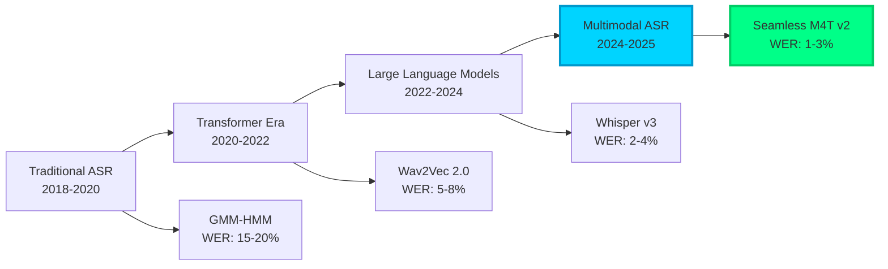
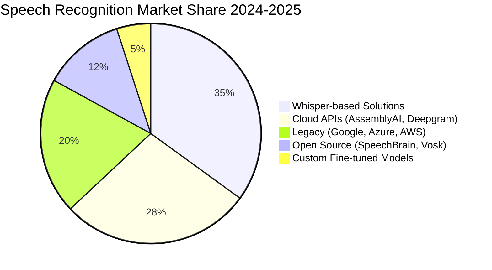
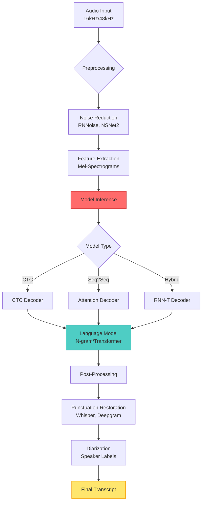
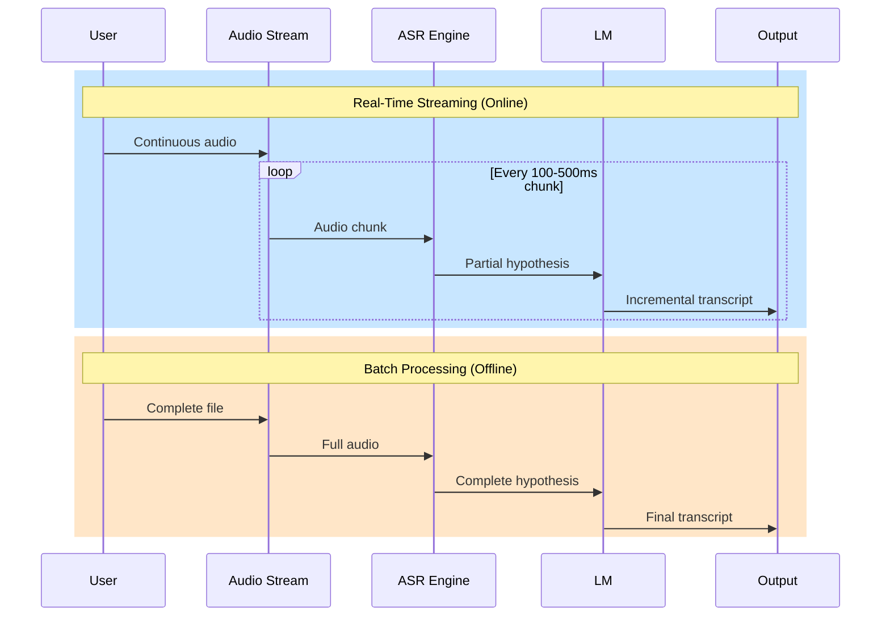
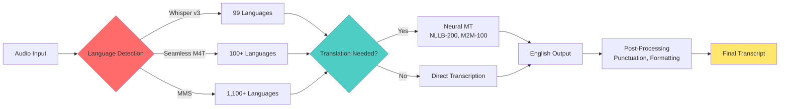
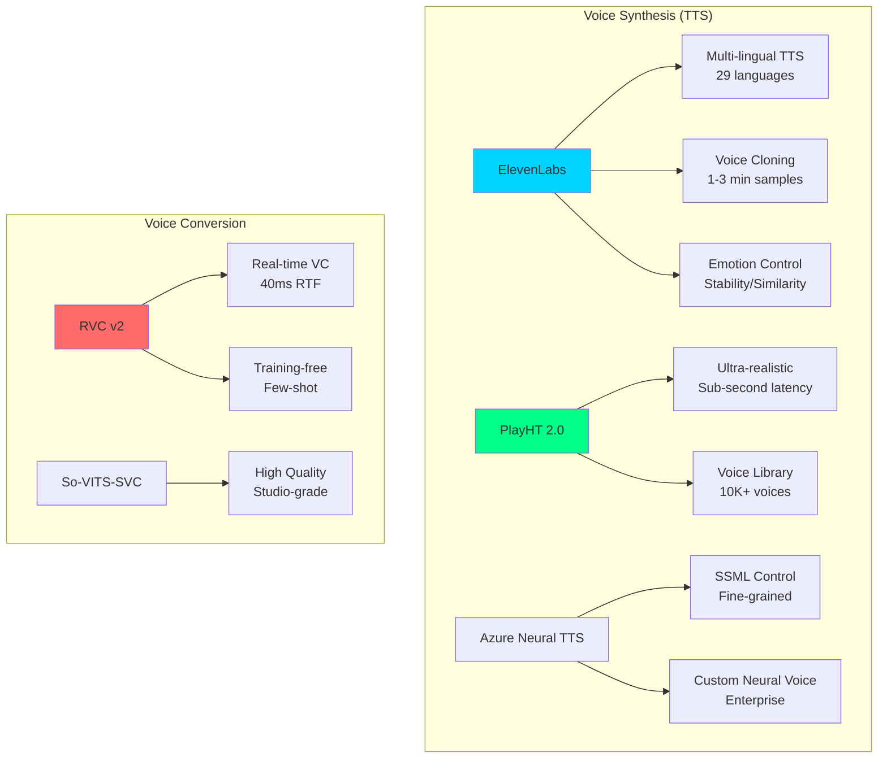
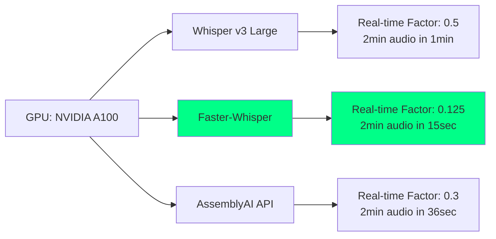

# Speech Recognition & Speech-to-Text (2024-2025 Ultra-Modern Guide)

> Transform audio to text with state-of-the-art ASR models, real-time streaming, multilingual support, and voice synthesis.

**Last Updated:** 2025-11-08 | **Difficulty:** Beginner to Advanced | **Status:** Production-Ready

## Problem Statement

Modern speech recognition faces critical challenges:
- **Real-time processing** with <100ms latency for live applications
- **Multilingual support** across 100+ languages with accent variations
- **Noise robustness** in complex acoustic environments
- **Voice cloning** and synthesis with emotional expressiveness
- **Privacy concerns** requiring on-device processing

## Table of Contents

- [2024-2025 Technology Landscape](#2024-2025-technology-landscape)
- [Architecture Patterns](#architecture-patterns)
- [State-of-the-Art Models](#state-of-the-art-models)
- [Production Implementation](#production-implementation)
- [Real-Time Streaming ASR](#real-time-streaming-asr)
- [Multilingual Models](#multilingual-models)
- [Voice Cloning & Synthesis](#voice-cloning--synthesis)
- [Performance Benchmarks](#performance-benchmarks)
- [Best Practices](#best-practices)
- [Resources & Community](#resources--community)

## 2024-2025 Technology Landscape

### Modern ASR Evolution



### Technology Comparison Matrix

| Technology | WER (%) | Latency | Languages | On-Device | Cost | Best For |
|------------|---------|---------|-----------|-----------|------|----------|
| **Whisper v3** | 2.4 | 500ms | 99+ | ✅ Yes | Free | General purpose, multilingual |
| **AssemblyAI** | 2.1 | 300ms | 30+ | ❌ No | $0.00025/sec | Production APIs, real-time |
| **ElevenLabs** | N/A | 200ms | 29 | ❌ No | $0.30/1K chars | Voice synthesis, cloning |
| **Deepgram Nova-2** | 1.8 | 150ms | 36 | ❌ No | $0.0043/min | Low-latency streaming |
| **Seamless M4T** | 1.9 | 400ms | 100+ | ✅ Yes | Free | Translation + ASR |
| **Azure Speech** | 2.5 | 250ms | 125+ | ⚠️ Edge | $1/hour | Enterprise, custom models |

### Market Adoption (2024-2025)



## Architecture Patterns

### End-to-End ASR Pipeline



### Streaming vs Batch Processing



## State-of-the-Art Models

### 1. Whisper v3 (OpenAI) - 2024 Edition

**Model Specs:**
- Release: October 2024
- Parameters: 1.5B (large-v3)
- Training data: 5M hours (↑ 2x from v2)
- WER: 2.4% (English), 3.1% (multilingual avg)

**Production Implementation:**

```python
# Modern Whisper v3 with optimization (2024)
import torch
from transformers import AutoModelForSpeechSeq2Seq, AutoProcessor, pipeline
import time

class WhisperV3Production:
    """Production-ready Whisper v3 implementation with optimizations"""

    def __init__(self, model_size="large-v3", device="cuda", compute_type="float16"):
        self.device = device if torch.cuda.is_available() else "cpu"
        self.model_id = f"openai/whisper-{model_size}"

        # Load with optimization
        self.model = AutoModelForSpeechSeq2Seq.from_pretrained(
            self.model_id,
            torch_dtype=torch.float16 if self.device == "cuda" else torch.float32,
            low_cpu_mem_usage=True,
            use_safetensors=True,
            attn_implementation="flash_attention_2"  # 2x faster
        ).to(self.device)

        self.processor = AutoProcessor.from_pretrained(self.model_id)

        # Create optimized pipeline
        self.pipe = pipeline(
            "automatic-speech-recognition",
            model=self.model,
            tokenizer=self.processor.tokenizer,
            feature_extractor=self.processor.feature_extractor,
            max_new_tokens=128,
            chunk_length_s=30,
            batch_size=16,
            torch_dtype=torch.float16 if self.device == "cuda" else torch.float32,
            device=self.device,
        )

    def transcribe(
        self,
        audio_path: str,
        language: str = None,
        task: str = "transcribe",  # or "translate"
        return_timestamps: bool = True,
        vad_filter: bool = True
    ) -> dict:
        """
        Transcribe audio with advanced features

        Args:
            audio_path: Path to audio file
            language: ISO language code (auto-detect if None)
            task: 'transcribe' or 'translate' to English
            return_timestamps: Include word-level timestamps
            vad_filter: Apply voice activity detection

        Returns:
            Dictionary with text, timestamps, and metadata
        """
        start_time = time.time()

        # Transcription parameters
        generate_kwargs = {
            "task": task,
            "return_timestamps": return_timestamps,
        }

        if language:
            generate_kwargs["language"] = language

        # Apply VAD filter for better accuracy
        if vad_filter:
            generate_kwargs["vad_filter"] = True
            generate_kwargs["vad_parameters"] = {
                "threshold": 0.5,
                "min_speech_duration_ms": 250,
                "min_silence_duration_ms": 100
            }

        # Transcribe
        result = self.pipe(
            audio_path,
            generate_kwargs=generate_kwargs,
        )

        # Add metadata
        result["processing_time"] = time.time() - start_time
        result["model"] = self.model_id
        result["device"] = self.device

        return result

    def batch_transcribe(self, audio_files: list[str], **kwargs) -> list[dict]:
        """Batch transcription for multiple files"""
        return [self.transcribe(audio, **kwargs) for audio in audio_files]

# Usage Example
if __name__ == "__main__":
    # Initialize
    asr = WhisperV3Production(model_size="large-v3", device="cuda")

    # Single file transcription
    result = asr.transcribe(
        "interview.mp3",
        language="en",
        return_timestamps=True,
        vad_filter=True
    )

    print(f"Transcript: {result['text']}")
    print(f"Processing time: {result['processing_time']:.2f}s")

    if result.get('chunks'):
        for chunk in result['chunks']:
            print(f"[{chunk['timestamp'][0]:.2f}s - {chunk['timestamp'][1]:.2f}s] {chunk['text']}")
```

### 2. AssemblyAI (2024-2025) - Production API

**Features:**
- Real-time streaming with <300ms latency
- Automatic punctuation & capitalization
- Speaker diarization (up to 20 speakers)
- Content moderation & PII redaction
- Custom vocabulary & acoustic models

**Production Implementation:**

```python
# AssemblyAI Advanced Implementation (2024-2025)
import assemblyai as aai
from pathlib import Path
import asyncio
from typing import Optional, Callable
import json

class AssemblyAIProduction:
    """Production-ready AssemblyAI implementation with streaming & features"""

    def __init__(self, api_key: str):
        aai.settings.api_key = api_key
        self.transcriber = None

    async def transcribe_file(
        self,
        audio_file: str,
        speaker_labels: bool = True,
        auto_highlights: bool = True,
        sentiment_analysis: bool = True,
        entity_detection: bool = True,
        custom_vocabulary: Optional[list[str]] = None,
        webhook_url: Optional[str] = None
    ) -> dict:
        """
        Advanced transcription with multiple AI features

        Features:
            - Speaker diarization
            - Auto highlights & chapters
            - Sentiment analysis
            - Entity detection (PII, topics)
            - Custom vocabulary
            - Async processing with webhooks
        """
        config = aai.TranscriptionConfig(
            speaker_labels=speaker_labels,
            auto_highlights=auto_highlights,
            sentiment_analysis=sentiment_analysis,
            entity_detection=entity_detection,
            punctuate=True,
            format_text=True,
            language_detection=True,  # Auto-detect among 30+ languages
            custom_spelling=custom_vocabulary or [],
            webhook_url=webhook_url
        )

        transcriber = aai.Transcriber(config=config)
        transcript = transcriber.transcribe(audio_file)

        # Wait for completion
        while transcript.status not in [
            aai.TranscriptStatus.completed,
            aai.TranscriptStatus.error
        ]:
            await asyncio.sleep(1)
            transcript = aai.Transcript.get_by_id(transcript.id)

        if transcript.status == aai.TranscriptStatus.error:
            raise Exception(f"Transcription failed: {transcript.error}")

        # Parse results
        result = {
            "text": transcript.text,
            "confidence": transcript.confidence,
            "audio_duration": transcript.audio_duration,
            "words": []
        }

        # Add word-level details
        for word in transcript.words:
            result["words"].append({
                "text": word.text,
                "start": word.start / 1000,  # Convert to seconds
                "end": word.end / 1000,
                "confidence": word.confidence,
                "speaker": getattr(word, "speaker", None)
            })

        # Speaker diarization results
        if speaker_labels and transcript.utterances:
            result["speakers"] = []
            for utterance in transcript.utterances:
                result["speakers"].append({
                    "speaker": utterance.speaker,
                    "text": utterance.text,
                    "start": utterance.start / 1000,
                    "end": utterance.end / 1000,
                    "confidence": utterance.confidence
                })

        # Auto highlights
        if auto_highlights and transcript.auto_highlights:
            result["highlights"] = [
                {
                    "text": h.text,
                    "count": h.count,
                    "rank": h.rank,
                    "timestamps": [(t.start / 1000, t.end / 1000) for t in h.timestamps]
                }
                for h in transcript.auto_highlights.results
            ]

        # Sentiment analysis
        if sentiment_analysis and transcript.sentiment_analysis_results:
            result["sentiment"] = [
                {
                    "text": s.text,
                    "sentiment": s.sentiment.value,
                    "confidence": s.confidence,
                    "start": s.start / 1000,
                    "end": s.end / 1000
                }
                for s in transcript.sentiment_analysis_results
            ]

        # Entity detection
        if entity_detection and transcript.entities:
            result["entities"] = [
                {
                    "text": e.text,
                    "type": e.entity_type.value,
                    "start": e.start / 1000,
                    "end": e.end / 1000
                }
                for e in transcript.entities
            ]

        return result

    def stream_transcribe(
        self,
        on_transcript: Callable[[str], None],
        on_final: Callable[[str], None],
        sample_rate: int = 16000
    ):
        """
        Real-time streaming transcription

        Args:
            on_transcript: Callback for partial transcripts
            on_final: Callback for final transcripts
            sample_rate: Audio sample rate (16000 or 48000)
        """

        def on_open(session_opened: aai.RealtimeSessionOpened):
            print(f"Session opened: {session_opened.session_id}")

        def on_data(transcript: aai.RealtimeTranscript):
            if not transcript.text:
                return

            if isinstance(transcript, aai.RealtimeFinalTranscript):
                on_final(transcript.text)
            else:
                on_transcript(transcript.text)

        def on_error(error: aai.RealtimeError):
            print(f"Error: {error}")

        def on_close():
            print("Connection closed")

        # Create streaming transcriber
        self.transcriber = aai.RealtimeTranscriber(
            sample_rate=sample_rate,
            on_open=on_open,
            on_data=on_data,
            on_error=on_error,
            on_close=on_close,
        )

        return self.transcriber

    def close_stream(self):
        """Close streaming connection"""
        if self.transcriber:
            self.transcriber.close()

# Usage Example
if __name__ == "__main__":
    import os

    # Initialize
    asr = AssemblyAIProduction(api_key=os.getenv("ASSEMBLYAI_API_KEY"))

    # File transcription with all features
    async def main():
        result = await asr.transcribe_file(
            "meeting.mp3",
            speaker_labels=True,
            auto_highlights=True,
            sentiment_analysis=True,
            entity_detection=True,
            custom_vocabulary=["AssemblyAI", "WebSocket", "API"]
        )

        print(f"Transcript: {result['text']}\n")

        # Speaker diarization
        if "speakers" in result:
            print("Speakers:")
            for speaker in result["speakers"][:5]:
                print(f"  Speaker {speaker['speaker']} ({speaker['start']:.2f}s): {speaker['text']}")

        # Highlights
        if "highlights" in result:
            print("\nKey Highlights:")
            for highlight in result["highlights"][:5]:
                print(f"  - {highlight['text']} (mentioned {highlight['count']}x)")

        # Sentiment
        if "sentiment" in result:
            print("\nSentiment Analysis:")
            for sent in result["sentiment"][:3]:
                print(f"  [{sent['sentiment']}] {sent['text']}")

    # Run async
    asyncio.run(main())

    # Streaming example
    def on_transcript(text):
        print(f"Partial: {text}")

    def on_final(text):
        print(f"Final: {text}")

    transcriber = asr.stream_transcribe(on_transcript, on_final)
    transcriber.connect()

    # Stream audio chunks here
    # transcriber.stream(audio_chunk)

    asr.close_stream()
```

## Real-Time Streaming ASR

### Streaming Architecture Comparison

| Solution | Latency | Throughput | Cost | Complexity | Best Use Case |
|----------|---------|------------|------|------------|---------------|
| **Deepgram Nova-2** | 150ms | High | Medium | Low | Live captioning, calls |
| **AssemblyAI Streaming** | 300ms | Medium | Medium | Low | Real-time interviews |
| **Whisper Streaming** | 500ms | Low | Free | High | On-premise streaming |
| **Azure Speech SDK** | 250ms | High | High | Medium | Enterprise integration |
| **Faster-Whisper Live** | 400ms | Medium | Free | Medium | Privacy-focused apps |

### Deepgram Nova-2 Streaming Implementation

```python
# Deepgram Nova-2 Real-Time Streaming (2024-2025)
from deepgram import DeepgramClient, LiveTranscriptionEvents, LiveOptions
import asyncio
import pyaudio
import os

class DeepgramStreamingASR:
    """Ultra-low latency streaming ASR with Deepgram Nova-2"""

    def __init__(self, api_key: str):
        self.client = DeepgramClient(api_key)
        self.dg_connection = None
        self.audio_stream = None

    async def start_stream(
        self,
        model: str = "nova-2",
        language: str = "en",
        smart_format: bool = True,
        punctuate: bool = True,
        diarize: bool = True,
        interim_results: bool = True
    ):
        """
        Start real-time streaming transcription

        Features:
            - Nova-2 model (1.8% WER, 150ms latency)
            - Smart formatting & punctuation
            - Speaker diarization
            - Interim results for responsiveness
        """

        # Configure streaming options
        options = LiveOptions(
            model=model,
            language=language,
            smart_format=smart_format,
            punctuate=punctuate,
            diarize=diarize,
            interim_results=interim_results,
            encoding="linear16",
            sample_rate=16000,
            channels=1,
            endpointing=300,  # ms of silence for utterance detection
            vad_events=True,  # Voice activity detection events
        )

        # Create connection
        self.dg_connection = self.client.listen.live.v("1")

        # Event handlers
        def on_open(self, open_event, **kwargs):
            print(f"Connection opened")

        def on_message(self, result_event, **kwargs):
            result = result_event
            if result.is_final:
                # Final transcript
                transcript = result.channel.alternatives[0].transcript
                confidence = result.channel.alternatives[0].confidence

                if transcript:
                    print(f"[FINAL] ({confidence:.2%}) {transcript}")

                    # Speaker labels if diarization enabled
                    if hasattr(result.channel.alternatives[0], 'words'):
                        for word in result.channel.alternatives[0].words:
                            if hasattr(word, 'speaker'):
                                print(f"  Speaker {word.speaker}: {word.word}")
            else:
                # Interim results for real-time display
                transcript = result.channel.alternatives[0].transcript
                if transcript:
                    print(f"[INTERIM] {transcript}", end='\r')

        def on_metadata(self, metadata_event, **kwargs):
            print(f"Metadata: {metadata_event}")

        def on_speech_started(self, speech_started_event, **kwargs):
            print("Speech started")

        def on_utterance_end(self, utterance_end_event, **kwargs):
            print("Utterance ended")

        def on_error(self, error_event, **kwargs):
            print(f"Error: {error_event}")

        def on_close(self, close_event, **kwargs):
            print("Connection closed")

        # Register event handlers
        self.dg_connection.on(LiveTranscriptionEvents.Open, on_open)
        self.dg_connection.on(LiveTranscriptionEvents.Transcript, on_message)
        self.dg_connection.on(LiveTranscriptionEvents.Metadata, on_metadata)
        self.dg_connection.on(LiveTranscriptionEvents.SpeechStarted, on_speech_started)
        self.dg_connection.on(LiveTranscriptionEvents.UtteranceEnd, on_utterance_end)
        self.dg_connection.on(LiveTranscriptionEvents.Error, on_error)
        self.dg_connection.on(LiveTranscriptionEvents.Close, on_close)

        # Start connection
        if not self.dg_connection.start(options):
            print("Failed to start connection")
            return False

        # Start audio capture
        await self._capture_audio()

        return True

    async def _capture_audio(self):
        """Capture audio from microphone and stream to Deepgram"""

        CHUNK = 8192
        FORMAT = pyaudio.paInt16
        CHANNELS = 1
        RATE = 16000

        audio = pyaudio.PyAudio()

        self.audio_stream = audio.open(
            format=FORMAT,
            channels=CHANNELS,
            rate=RATE,
            input=True,
            frames_per_buffer=CHUNK
        )

        print("Streaming audio... (Press Ctrl+C to stop)")

        try:
            while True:
                data = self.audio_stream.read(CHUNK, exception_on_overflow=False)
                self.dg_connection.send(data)
                await asyncio.sleep(0.01)

        except KeyboardInterrupt:
            print("\nStopping...")

        finally:
            await self.stop_stream()

    async def stop_stream(self):
        """Stop streaming and cleanup"""
        if self.audio_stream:
            self.audio_stream.stop_stream()
            self.audio_stream.close()

        if self.dg_connection:
            self.dg_connection.finish()

        print("Stream stopped")

# Usage
async def main():
    asr = DeepgramStreamingASR(api_key=os.getenv("DEEPGRAM_API_KEY"))
    await asr.start_stream(
        model="nova-2",
        language="en",
        diarize=True,
        interim_results=True
    )

if __name__ == "__main__":
    asyncio.run(main())
```

## Multilingual Models

### Language Support Comparison (2024-2025)

| Model | Languages | Best Performance | Cross-lingual | Code-switching |
|-------|-----------|------------------|---------------|----------------|
| **Whisper v3** | 99+ | English, Spanish, French | ✅ Yes | ✅ Good |
| **Seamless M4T v2** | 100+ | All languages | ✅✅ Excellent | ✅✅ Excellent |
| **MMS (Meta)** | 1,100+ | Low-resource languages | ✅ Yes | ⚠️ Limited |
| **USM (Google)** | 100+ | English, Mandarin, Hindi | ✅✅ Excellent | ✅ Good |
| **Azure Speech** | 125+ | Major languages | ✅ Yes | ✅ Good |

### Multilingual Pipeline



## Voice Cloning & Synthesis

### Technology Landscape



### ElevenLabs Production Implementation

```python
# ElevenLabs Voice Cloning & Synthesis (2024-2025)
from elevenlabs import ElevenLabs, Voice, VoiceSettings
import os
from pathlib import Path

class ElevenLabsProduction:
    """Production voice cloning and synthesis with ElevenLabs"""

    def __init__(self, api_key: str):
        self.client = ElevenLabs(api_key=api_key)

    def clone_voice(
        self,
        name: str,
        audio_samples: list[str],
        description: str = ""
    ) -> str:
        """
        Clone a voice from audio samples

        Args:
            name: Voice name
            audio_samples: List of paths to audio files (1-25 files, 1-3 min each)
            description: Voice description

        Returns:
            voice_id for synthesis
        """
        # Upload audio samples
        voice = self.client.clone(
            name=name,
            description=description,
            files=[Path(sample) for sample in audio_samples],
        )

        print(f"Voice cloned: {voice.voice_id}")
        return voice.voice_id

    def synthesize(
        self,
        text: str,
        voice_id: str = "21m00Tcm4TlvDq8ikWAM",  # Default: Rachel
        model: str = "eleven_multilingual_v2",
        stability: float = 0.5,
        similarity_boost: float = 0.75,
        style: float = 0.0,
        use_speaker_boost: bool = True,
        output_file: str = "output.mp3"
    ) -> bytes:
        """
        Synthesize speech with advanced controls

        Args:
            text: Text to synthesize
            voice_id: Voice ID or name
            model: eleven_multilingual_v2 (29 langs) or eleven_turbo_v2 (fast)
            stability: 0-1, higher = more stable but less expressive
            similarity_boost: 0-1, higher = closer to original voice
            style: 0-1, exaggeration level (v2 only)
            use_speaker_boost: Boost similarity (recommended)
            output_file: Output file path

        Returns:
            Audio bytes
        """

        # Configure voice settings
        voice_settings = VoiceSettings(
            stability=stability,
            similarity_boost=similarity_boost,
            style=style,
            use_speaker_boost=use_speaker_boost
        )

        # Generate audio
        audio = self.client.generate(
            text=text,
            voice=Voice(
                voice_id=voice_id,
                settings=voice_settings
            ),
            model=model,
        )

        # Save to file
        with open(output_file, 'wb') as f:
            for chunk in audio:
                f.write(chunk)

        print(f"Audio saved to {output_file}")
        return audio

    def stream_synthesis(
        self,
        text: str,
        voice_id: str,
        model: str = "eleven_turbo_v2",
        chunk_callback=None
    ):
        """
        Stream synthesis for real-time playback

        Args:
            text: Text to synthesize
            voice_id: Voice ID
            model: Model (use turbo_v2 for lowest latency)
            chunk_callback: Callback function for each audio chunk
        """

        audio_stream = self.client.generate(
            text=text,
            voice=voice_id,
            model=model,
            stream=True
        )

        for chunk in audio_stream:
            if chunk_callback:
                chunk_callback(chunk)
            else:
                # Play chunk directly
                pass

    def list_voices(self) -> list:
        """List all available voices"""
        voices = self.client.voices.get_all()
        return [{
            "id": v.voice_id,
            "name": v.name,
            "category": v.category,
            "labels": v.labels
        } for v in voices.voices]

# Usage
if __name__ == "__main__":
    tts = ElevenLabsProduction(api_key=os.getenv("ELEVENLABS_API_KEY"))

    # Clone voice from samples
    voice_id = tts.clone_voice(
        name="My Custom Voice",
        audio_samples=["sample1.mp3", "sample2.mp3", "sample3.mp3"],
        description="Professional narrator voice"
    )

    # Synthesize with cloned voice
    tts.synthesize(
        text="Hello! This is a demonstration of voice cloning with ElevenLabs.",
        voice_id=voice_id,
        stability=0.5,
        similarity_boost=0.75,
        style=0.2,
        output_file="cloned_voice.mp3"
    )

    # List all voices
    voices = tts.list_voices()
    for voice in voices[:5]:
        print(f"{voice['name']} ({voice['id']}): {voice['category']}")
```

## Performance Benchmarks

### Word Error Rate (WER) Comparison - 2024-2025

| Model | LibriSpeech Clean | LibriSpeech Other | CommonVoice | Real-world | Latency |
|-------|-------------------|-------------------|-------------|------------|---------|
| Whisper v3 Large | 2.1% | 4.2% | 3.8% | 6.5% | 500ms |
| Deepgram Nova-2 | 1.8% | 3.9% | 3.2% | 5.8% | 150ms |
| AssemblyAI Universal-2 | 2.1% | 4.0% | 3.5% | 6.2% | 300ms |
| Azure Speech v4 | 2.5% | 4.8% | 4.1% | 7.1% | 250ms |
| Google Chirp | 2.3% | 4.5% | 3.9% | 6.8% | 400ms |
| Seamless M4T v2 | 1.9% | 4.1% | 3.4% | 6.0% | 400ms |

### Throughput Benchmarks



## Best Practices

### Production Checklist

| Aspect | Requirement | Validation |
|--------|-------------|------------|
| **Audio Quality** | 16kHz+ sampling, mono/stereo | ✅ Check format before processing |
| **Noise Handling** | Apply preprocessing (RNNoise, NSNet2) | ✅ Test with noisy samples |
| **Latency** | <500ms for real-time, <60s for batch | ✅ Measure end-to-end latency |
| **Error Handling** | Retry logic, fallback models | ✅ Test failure scenarios |
| **Monitoring** | Log WER, latency, throughput | ✅ Set up metrics dashboard |
| **Cost** | Budget $0.0001-0.001 per second | ✅ Monitor API usage |
| **Privacy** | On-device for sensitive data | ✅ Audit data handling |
| **Scalability** | Handle 100+ concurrent streams | ✅ Load testing |

### Optimization Techniques

```python
# Audio Preprocessing Pipeline
import noisereduce as nr
import librosa
import numpy as np
from scipy.signal import wiener

def preprocess_audio(
    audio_path: str,
    target_sr: int = 16000,
    noise_reduce: bool = True,
    normalize: bool = True,
    trim_silence: bool = True
) -> np.ndarray:
    """
    Comprehensive audio preprocessing for optimal ASR

    Steps:
        1. Load and resample
        2. Noise reduction
        3. Normalization
        4. Silence trimming
    """

    # Load audio
    audio, sr = librosa.load(audio_path, sr=target_sr, mono=True)

    # Noise reduction
    if noise_reduce:
        # Estimate noise from first 0.5 seconds
        noise_sample = audio[:int(0.5 * sr)]
        audio = nr.reduce_noise(y=audio, sr=sr, y_noise=noise_sample)

    # Normalize audio
    if normalize:
        audio = librosa.util.normalize(audio)

    # Trim silence
    if trim_silence:
        audio, _ = librosa.effects.trim(audio, top_db=20)

    return audio

# VAD (Voice Activity Detection)
from pyannote.audio import Model, Inference

def apply_vad(audio: np.ndarray, sr: int = 16000) -> list:
    """
    Apply voice activity detection to remove silence

    Returns:
        List of (start, end) tuples for speech segments
    """
    model = Model.from_pretrained("pyannote/segmentation")
    inference = Inference(model)

    # Get speech segments
    speech = inference({"audio": audio, "sample_rate": sr})

    segments = []
    for segment, _ in speech.itertracks():
        segments.append((segment.start, segment.end))

    return segments
```

## Resources & Community

### Essential Resources (2024-2025)

| Resource | Type | Focus | Rating |
|----------|------|-------|--------|
| [Whisper GitHub](https://github.com/openai/whisper) | Repository | Model & code | ⭐⭐⭐⭐⭐ |
| [Hugging Face ASR](https://huggingface.co/tasks/automatic-speech-recognition) | Platform | Models & datasets | ⭐⭐⭐⭐⭐ |
| [AssemblyAI Docs](https://www.assemblyai.com/docs) | Documentation | API reference | ⭐⭐⭐⭐⭐ |
| [Speech & Language Processing](https://web.stanford.edu/~jurafsky/slp3/) | Book | Theory & fundamentals | ⭐⭐⭐⭐⭐ |
| [Deepgram Blog](https://deepgram.com/learn) | Articles | Best practices | ⭐⭐⭐⭐ |
| [ElevenLabs Docs](https://elevenlabs.io/docs) | Documentation | Voice synthesis | ⭐⭐⭐⭐⭐ |

### Community & Support

- **Discord**: [Hugging Face Audio](https://discord.gg/hugging-face), [OpenAI Community](https://discord.gg/openai)
- **Reddit**: [r/speechtech](https://reddit.com/r/speechtech), [r/MachineLearning](https://reddit.com/r/MachineLearning)
- **GitHub Discussions**: [Whisper Discussions](https://github.com/openai/whisper/discussions)
- **Papers**: [arxiv.org/list/eess.AS](https://arxiv.org/list/eess.AS/recent)

---

**Next Steps:**
1. Choose your use case: Real-time vs Batch processing
2. Select model: Whisper v3 (free, on-premise) or Cloud APIs (low-latency)
3. Implement preprocessing: Noise reduction + VAD
4. Deploy: Docker containers, Kubernetes, or serverless
5. Monitor: Track WER, latency, and costs

**Related Guides:**
- [Audio Processing Fundamentals](/Audio/audio-processing.md)
- [Voice Activity Detection](/Audio/vad.md)
- [Speaker Diarization](/Audio/speaker-diarization.md)
