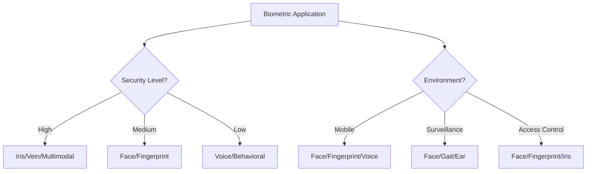

# 🔐 Biometrics & Security

Comprehensive collection of biometric recognition systems, authentication methods, and security applications powered by AI/ML.

**Last Updated:** 2025-06-20

## 📑 Table of Contents

### 🎯 Core Biometric Modalities
- [👤 Face Recognition](./face-recognition.md) - The most widely deployed biometric
- [👆 Fingerprint Recognition](./fingerprint-recognition.md) - Most established biometric technology
- [👁️ Iris Recognition](./iris-recognition.md) - Highest accuracy biometric system
- [🎤 Voice/Speaker Recognition](./voice-recognition.md) - Authentication through speech
- [👂 Ear Recognition](./ear-recognition.md) - Contactless biometric identification
- [✍️ Signature Verification](./signature-verification.md) - Handwritten authentication

### 🚶 Behavioral Biometrics
- [🚶‍♂️ Gait Recognition](./gait-recognition.md) - Walking pattern analysis
- [⌨️ Keystroke Dynamics](./behavioral-biometrics.md) - Typing pattern recognition
- [🖱️ Mouse Movement](./behavioral-biometrics.md) - User interaction patterns

### 🔬 Advanced Biometrics
- [🖐️ Vein Recognition](./vein-recognition.md) - Palm and finger vein patterns
- [🤝 Palmprint Recognition](./palmprint-recognition.md) - Palm texture analysis
- [🧬 DNA Recognition](./dna-biometrics.md) - Genetic identification
- [🔄 Multimodal Biometrics](./multimodal-biometrics.md) - Fusion of multiple modalities

### 🛡️ Security Applications
- [🎭 DeepFake Detection](./deepfake-detection.md) - Synthetic media detection
- [🔒 Liveness Detection](./liveness-detection.md) - Anti-spoofing techniques
- [📱 Mobile Biometrics](./mobile-biometrics.md) - Smartphone authentication

## 📊 Biometric Comparison Matrix

| Modality | Accuracy | Cost | User Acceptance | Spoofing Resistance | Use Cases |
|----------|----------|------|-----------------|---------------------|-----------|
| **Face** | ⭐⭐⭐⭐ | 💰💰 | ⭐⭐⭐⭐⭐ | ⭐⭐⭐ | Surveillance, Mobile, Access Control |
| **Fingerprint** | ⭐⭐⭐⭐⭐ | 💰 | ⭐⭐⭐⭐ | ⭐⭐⭐⭐ | Mobile, Forensics, Banking |
| **Iris** | ⭐⭐⭐⭐⭐ | 💰💰💰💰 | ⭐⭐⭐ | ⭐⭐⭐⭐⭐ | High Security, Border Control |
| **Voice** | ⭐⭐⭐ | 💰 | ⭐⭐⭐⭐⭐ | ⭐⭐ | Call Centers, Smart Speakers |
| **Ear** | ⭐⭐⭐⭐ | 💰💰 | ⭐⭐⭐⭐ | ⭐⭐⭐⭐ | Surveillance, Forensics |
| **Signature** | ⭐⭐⭐ | 💰 | ⭐⭐⭐⭐⭐ | ⭐⭐ | Banking, Legal Documents |
| **Gait** | ⭐⭐⭐ | 💰💰 | ⭐⭐⭐⭐⭐ | ⭐⭐⭐ | Long-range Surveillance |
| **Vein** | ⭐⭐⭐⭐⭐ | 💰💰💰 | ⭐⭐⭐ | ⭐⭐⭐⭐⭐ | High Security Facilities |

## 🚀 Quick Start Guide

### 1. Choose Your Application


### 2. Implementation Frameworks

#### Face Recognition
```python
# Using face_recognition library
import face_recognition
import cv2

# Load and encode face
image = face_recognition.load_image_file("person.jpg")
face_encoding = face_recognition.face_encodings(image)[0]

# Compare faces
results = face_recognition.compare_faces([known_encoding], face_encoding)
```

#### Fingerprint Recognition
```python
# Using python-fingerprint
from pyfingerprint import PyFingerprint

# Initialize sensor
f = PyFingerprint('/dev/ttyUSB0', 57600, 0xFFFFFFFF, 0x00000000)

# Capture fingerprint
f.readImage()
f.convertImage(0x01)
```

## 📈 Performance Benchmarks

### NIST Benchmarks
- **[FRVT](https://www.nist.gov/programs-projects/face-recognition-vendor-test-frvt)** - Face Recognition
- **[MINEX](https://www.nist.gov/itl/iad/image-group/minutiae-interoperability-exchange-minex-iii)** - Fingerprint
- **[IREX](https://www.nist.gov/programs-projects/iris-exchange-irex-overview)** - Iris Recognition
- **[SRE](https://www.nist.gov/itl/iad/mig/speaker-recognition-evaluation)** - Speaker Recognition

### Error Rates
| Metric | Description | Target |
|--------|-------------|---------|
| **FRR** | False Rejection Rate | < 1% |
| **FAR** | False Acceptance Rate | < 0.1% |
| **EER** | Equal Error Rate | < 0.5% |
| **FMR** | False Match Rate | < 0.01% |
| **FNMR** | False Non-Match Rate | < 1% |

## 🔧 Development Tools

### Open Source Libraries
- **[OpenCV](https://opencv.org/)** - Computer vision library
- **[dlib](https://dlib.net/)** - ML toolkit with face recognition
- **[OpenBR](https://openbiometrics.org/)** - Open biometrics framework
- **[Bob](https://www.idiap.ch/software/bob/)** - Signal processing and ML

### Commercial SDKs
- **[NEC NeoFace](https://www.nec.com/en/global/solutions/biometrics/face/index.html)** - Enterprise face recognition
- **[Neurotechnology](https://www.neurotechnology.com/)** - Multi-biometric SDKs
- **[Aware](https://www.aware.com/)** - Biometric software solutions
- **[IDEMIA](https://www.idemia.com/)** - Identity solutions

## 📱 Mobile Integration

### iOS Biometrics
```swift
// Face ID / Touch ID
import LocalAuthentication

let context = LAContext()
context.evaluatePolicy(.deviceOwnerAuthenticationWithBiometrics, 
                      localizedReason: "Authenticate") { success, error in
    // Handle result
}
```

### Android Biometrics
```kotlin
// BiometricPrompt API
val biometricPrompt = BiometricPrompt(this, executor,
    object : BiometricPrompt.AuthenticationCallback() {
        override fun onAuthenticationSucceeded(
            result: BiometricPrompt.AuthenticationResult) {
            // Handle success
        }
    })
```

## 🌐 Standards & Compliance

### International Standards
- **ISO/IEC 19794** - Biometric data interchange formats
- **ISO/IEC 19795** - Biometric performance testing
- **ISO/IEC 24745** - Biometric information protection
- **FIDO Alliance** - Authentication standards

### Privacy Regulations
- **GDPR** - EU data protection
- **CCPA** - California privacy rights
- **BIPA** - Illinois biometric privacy
- **India DPDP** - Data protection bill

## 🔬 Research Datasets

### Face Recognition
- **[LFW](https://vis-www.cs.umass.edu/lfw/)** - Labeled Faces in the Wild
- **[VGGFace2](https://github.com/ox-vgg/vgg_face2)** - 3.31M images
- **[MS-Celeb-1M](https://www.microsoft.com/en-us/research/project/ms-celeb-1m-challenge-recognizing-one-million-celebrities-real-world/)** - 1M celebrities

### Fingerprint
- **[FVC Databases](https://biolab.csr.unibo.it/fvcongoing/UI/Form/Home.aspx)** - Competition datasets
- **[NIST SD302](https://www.nist.gov/itl/iad/image-group/nist-special-database-302)** - Nail-to-nail fingerprints

### Other Modalities
- **[CASIA Iris](https://biometrics.idealtest.org/)** - Iris image database
- **[VoxCeleb](https://www.robots.ox.ac.uk/~vgg/data/voxceleb/)** - Speaker recognition
- **[CASIA Gait](https://www.cbsr.ia.ac.cn/english/Gait%20Databases.asp)** - Gait database

## 🎯 Use Cases

### Government & Security
- Border control systems
- National ID programs
- Law enforcement
- Voter registration

### Commercial Applications
- Banking authentication
- Workplace access control
- Time and attendance
- Customer verification

### Consumer Electronics
- Smartphone unlock
- Laptop security
- Smart home devices
- Automotive systems

## 📚 Learning Resources

### Online Courses
- **[Coursera - Biometric Authentication](https://www.coursera.org/learn/biometric-authentication)** - University at Buffalo
- **[edX - Biometrics](https://www.edx.org/learn/biometrics)** - Various universities
- **[Udemy - Face Recognition](https://www.udemy.com/topic/facial-recognition/)** - Practical courses

### Books
- "Handbook of Biometrics" - Jain, Flynn, Ross
- "Biometric Systems: Technology, Design and Performance Evaluation" - Wayman et al.
- "Guide to Biometrics" - Bolle, Connell, Pankanti, Ratha, Senior

### Conferences
- **[IJCB](https://ieee-biometrics.org/)** - International Joint Conference on Biometrics
- **[BTAS](https://www.ieee-btas.org/)** - Biometrics Theory, Applications and Systems
- **[ICB](https://icbiometrics.org/)** - International Conference on Biometrics

## 🔗 Additional Resources

### Research Groups
- **[Michigan State University - Biometrics](https://biometrics.cse.msu.edu/)** - Prof. Anil Jain's group
- **[IDIAP Research Institute](https://www.idiap.ch/en/scientific-research/biometric-person-recognition)** - Switzerland
- **[Notre Dame CVRL](https://cvrl.nd.edu/)** - Computer Vision Research Lab

### Industry Associations
- **[Biometrics Institute](https://www.biometricsinstitute.org/)** - Global community
- **[IBIA](https://www.ibia.org/)** - International Biometrics + Identity Association
- **[SIA](https://www.securityindustry.org/)** - Security Industry Association

---

<div align="center">
  <p><strong>⚠️ Important:</strong> Always consider privacy, ethical implications, and local regulations when implementing biometric systems.</p>
</div>