<div align="center">

<!-- Animated Typing SVG -->


<!-- For-the-badge Shields -->
<p>
  
  
  
  
  
</p>

**Comprehensive collection of state-of-the-art biometric authentication systems, AI-powered security solutions, and production-ready identity verification frameworks for 2024-2025.**

[📖 Documentation](#-quick-navigation) • [🚀 Quick Start](#-production-ready-implementation) • [🔬 Benchmarks](#-performance-benchmarks-2024-2025) • [🛡️ Security](#-security--privacy-compliance)

</div>

---

## 🎯 Quick Navigation

### 🔥 Core Biometric Modalities (2024-2025)

| Modality | Status | Latest Models | Accuracy | GitHub Stars |
|----------|--------|---------------|----------|--------------|
| **[👤 Face Recognition](./face-recognition.md)** | 🟢 Production | ArcFace, CosFace, RetinaFace | 99.85% |  |
| **[👆 Fingerprint Recognition](./fingerprint-recognition.md)** | 🟢 Production | DeepPrint, FingerNet | 99.9% |  |
| **[👁️ Iris Recognition](./iris-recognition.md)** | 🟢 Production | DeepIris, IrisNet | 99.99% | High Security |
| **[🎤 Voice Recognition](./voice-recognition.md)** | 🟢 Production | ECAPA-TDNN, X-Vector | 98.5% |  |
| **[🚶 Gait Recognition](./gait-recognition.md)** | 🟡 Emerging | GaitSet, GaitFormer | 95-98% | Long-range ID |
| **[🖐️ Vein Recognition](./vein-recognition.md)** | 🟢 Production | VeinTransformer | 99.95% | High Security |
| **[👂 Ear Recognition](./ear-recognition.md)** | 🟡 Research | EarNet, EarGAN | 94-97% | Forensics |
| **[✍️ Signature Verification](./signature-verification.md)** | 🟢 Production | SigNet, SigGAN | 95-98% | Banking |

### 🛡️ Advanced Security Applications

| Application | Technology | Use Case | Status |
|-------------|-----------|----------|--------|
| **[🎭 DeepFake Detection](./deepfake-detection.md)** | CNN+Transformer, WavLM | Synthetic media detection | 🔥 Critical 2024-2025 |
| **[🔄 Multimodal Biometrics](./multimodal-biometrics.md)** | Score/Feature/Decision Fusion | High-security authentication | 🟢 Production |
| **🔒 Liveness Detection** | 3D depth sensing, texture analysis | Anti-spoofing | 🟢 Essential |
| **🧬 PAD (Presentation Attack Detection)** | Multi-spectral imaging | Spoof prevention | 🟢 Production |

---

## 📊 Biometric System Architecture (2024-2025)

```mermaid
graph TB
    subgraph "Acquisition Layer"
        A1[Camera/Sensor] --> A2[Quality Check]
        A2 --> A3[Preprocessing]
    end

    subgraph "Feature Extraction"
        A3 --> B1[Deep Learning Models]
        B1 --> B2[Feature Embedding]
        B2 --> B3[Template Generation]
    end

    subgraph "Matching & Decision"
        B3 --> C1[Template Database]
        C1 --> C2[Similarity Score]
        C2 --> C3{Threshold?}
        C3 -->|Accept| D1[✅ Authenticated]
        C3 -->|Reject| D2[❌ Rejected]
    end

    subgraph "Security Layer"
        D1 --> E1[Liveness Detection]
        E1 --> E2[Anti-Spoofing]
        E2 --> E3[Audit Log]
    end

    style A1 fill:#00D9FF,stroke:#0099CC,stroke-width:3px
    style B1 fill:#00FF9F,stroke:#00CC7F,stroke-width:3px
    style C3 fill:#FF6B6B,stroke:#CC5555,stroke-width:3px
    style E2 fill:#FFD93D,stroke:#CCAD31,stroke-width:3px
```



---

## 🔄 Authentication Workflow (Production System)

```mermaid
sequenceDiagram
    participant U as User
    participant C as Client App
    participant S as Biometric Server
    participant L as Liveness Check
    participant D as Database
    participant A as Audit System

    U->>C: Request Authentication
    C->>S: Send Biometric Data (Encrypted)
    S->>L: Perform Liveness Detection

    alt Liveness Failed
        L-->>S: Spoof Detected
        S-->>C: Authentication Failed
        S->>A: Log Failed Attempt
    else Liveness Passed
        L-->>S: Live Subject Confirmed
        S->>D: Query Template Database
        D-->>S: Return Matching Score

        alt Score Above Threshold
            S->>A: Log Successful Authentication
            S-->>C: ✅ Authenticated
            C-->>U: Access Granted
        else Score Below Threshold
            S->>A: Log Failed Match
            S-->>C: ❌ Rejected
            C-->>U: Access Denied
        end
    end
```



---

## 🎯 Biometric Modality Comparison Matrix (2024-2025)

### Comprehensive Performance Analysis

| Modality | Accuracy (EER) | Speed | Cost | User Acceptance | Spoofing Resistance | Privacy Impact | Best Use Case |
|----------|----------------|-------|------|-----------------|---------------------|----------------|---------------|
| **Face** | 0.1-0.5% | 🚀🚀🚀🚀 | 💰💰 | ⭐⭐⭐⭐⭐ | ⭐⭐⭐ | 🔴 High | Surveillance, Mobile, Access Control |
| **Fingerprint** | 0.01-0.1% | 🚀🚀🚀🚀🚀 | 💰 | ⭐⭐⭐⭐ | ⭐⭐⭐⭐ | 🟡 Medium | Mobile, Forensics, Banking |
| **Iris** | 0.001-0.01% | 🚀🚀🚀 | 💰💰💰💰 | ⭐⭐⭐ | ⭐⭐⭐⭐⭐ | 🟡 Medium | High Security, Border Control |
| **Voice** | 0.5-2% | 🚀🚀🚀🚀 | 💰 | ⭐⭐⭐⭐⭐ | ⭐⭐ | 🟢 Low | Call Centers, Smart Speakers |
| **Vein** | 0.001-0.01% | 🚀🚀🚀 | 💰💰💰 | ⭐⭐⭐ | ⭐⭐⭐⭐⭐ | 🟢 Low | High Security Facilities |
| **Gait** | 1-5% | 🚀🚀 | 💰💰 | ⭐⭐⭐⭐⭐ | ⭐⭐⭐ | 🟢 Low | Long-range Surveillance |
| **Ear** | 0.5-1% | 🚀🚀🚀 | 💰💰 | ⭐⭐⭐⭐ | ⭐⭐⭐⭐ | 🟢 Low | Surveillance, Forensics |
| **Signature** | 1-3% | 🚀🚀 | 💰 | ⭐⭐⭐⭐⭐ | ⭐⭐ | 🟢 Low | Banking, Legal Documents |
| **Multimodal** | 0.001-0.005% | 🚀🚀 | 💰💰💰💰 | ⭐⭐⭐⭐ | ⭐⭐⭐⭐⭐ | 🔴 Varies | Critical Infrastructure |

**Legend:**
- 🚀 Speed Rating (1-5 rockets)
- 💰 Cost Rating (1-4 money bags)
- ⭐ User Acceptance (1-5 stars)
- 🔴 High Privacy Impact | 🟡 Medium | 🟢 Low

---

## 🔥 Latest 2024-2025 Deep Learning Models & Frameworks

### Face Recognition (State-of-the-Art)

| Model | Year | Architecture | Accuracy (LFW) | FAR @ 0.1% FRR | GitHub | Key Innovation |
|-------|------|--------------|----------------|----------------|--------|----------------|
| **ArcFace** | 2018-2024 | ResNet + Angular Margin | 99.83% | 0.001% |  | Additive angular margin loss |
| **CosFace** | 2018-2024 | ResNet + Cosine Margin | 99.81% | 0.002% | Popular | Large margin cosine loss |
| **RetinaFace** | 2020-2024 | Multi-task CNN | Detection + Recognition | - |  | Joint detection + alignment |
| **AdaFace** | 2022-2024 | Adaptive Margin | 99.82% | 0.001% | Emerging | Adaptive margin function |
| **MagFace** | 2021-2024 | Magnitude-aware | 99.86% | 0.0008% | Research | Magnitude regularization |
| **FaceTransformer** | 2023-2024 | Vision Transformer | 99.87% | 0.0007% | 🔥 New | Attention mechanism |

### Voice Recognition (Speaker Verification)

| Model | Technology | EER (VoxCeleb) | Use Case |
|-------|-----------|----------------|----------|
| **ECAPA-TDNN** | Emphasized Channel Attention | 0.87% |  |
| **X-Vector** | DNN-based embeddings | 1.2-2% | Industry Standard |
| **ResNet-SE** | Squeeze-Excitation | 1.5% | Mobile Applications |
| **WavLM** | Self-supervised Transformer | 0.5-0.8% | 🔥 2024 SOTA |

### Deepfake Detection (Critical 2024-2025)

| Method | Detection Rate | False Positive | Technology |
|--------|----------------|----------------|------------|
| **Swin Transformer** | 98.5% | 1.2% | Window-based attention |
| **CNN + ViT Ensemble** | 99.1% | 0.8% | Hybrid architecture |
| **WavLM + Visual** | 99.3% | 0.5% | 🔥 Multimodal fusion |
| **Capsule Networks** | 97.8% | 1.5% | Spatial relationships |

---

## 🚀 Production-Ready Implementation

### 1. Face Recognition with ArcFace (InsightFace)

```python
"""
Production-grade face recognition using InsightFace/ArcFace
Includes preprocessing, embedding extraction, and secure matching
"""

import insightface
from insightface.app import FaceAnalysis
import cv2
import numpy as np
from typing import List, Tuple, Optional
import logging
from dataclasses import dataclass

@dataclass
class FaceEmbedding:
    """Secure face embedding with metadata"""
    embedding: np.ndarray
    confidence: float
    bbox: Tuple[int, int, int, int]
    landmarks: np.ndarray

class SecureFaceRecognition:
    """
    Production-ready face recognition with security best practices
    - Template protection
    - Liveness detection integration
    - Audit logging
    - GDPR compliance
    """

    def __init__(
        self,
        model_name: str = 'buffalo_l',
        ctx_id: int = 0,  # GPU ID (-1 for CPU)
        det_thresh: float = 0.5,
        rec_thresh: float = 0.3
    ):
        """Initialize face recognition system"""
        self.app = FaceAnalysis(
            name=model_name,
            providers=['CUDAExecutionProvider', 'CPUExecutionProvider']
        )
        self.app.prepare(ctx_id=ctx_id, det_thresh=det_thresh)
        self.rec_thresh = rec_thresh
        self.logger = self._setup_logging()

    def _setup_logging(self) -> logging.Logger:
        """Setup secure audit logging"""
        logger = logging.getLogger('FaceRecognition')
        logger.setLevel(logging.INFO)
        handler = logging.FileHandler('face_recognition_audit.log')
        formatter = logging.Formatter(
            '%(asctime)s - %(name)s - %(levelname)s - %(message)s'
        )
        handler.setFormatter(formatter)
        logger.addHandler(handler)
        return logger

    def extract_embedding(
        self,
        image: np.ndarray,
        check_quality: bool = True
    ) -> Optional[FaceEmbedding]:
        """
        Extract face embedding with quality checks

        Args:
            image: Input image (BGR format)
            check_quality: Perform quality assessment

        Returns:
            FaceEmbedding or None if no face detected
        """
        try:
            faces = self.app.get(image)

            if len(faces) == 0:
                self.logger.warning("No face detected")
                return None

            if len(faces) > 1:
                self.logger.warning(f"Multiple faces detected: {len(faces)}")
                # Select face with highest detection score
                faces = sorted(faces, key=lambda x: x.det_score, reverse=True)

            face = faces[0]

            # Quality checks
            if check_quality:
                if not self._check_face_quality(face, image):
                    self.logger.warning("Face quality check failed")
                    return None

            embedding = FaceEmbedding(
                embedding=face.normed_embedding,
                confidence=face.det_score,
                bbox=face.bbox.astype(int).tolist(),
                landmarks=face.kps
            )

            self.logger.info(f"Embedding extracted with confidence: {face.det_score:.4f}")
            return embedding

        except Exception as e:
            self.logger.error(f"Embedding extraction failed: {str(e)}")
            return None

    def _check_face_quality(self, face, image: np.ndarray) -> bool:
        """
        Check face quality for reliable recognition
        - Face size
        - Blur detection
        - Illumination
        - Pose estimation
        """
        # Face size check
        bbox = face.bbox.astype(int)
        face_width = bbox[2] - bbox[0]
        face_height = bbox[3] - bbox[1]

        if face_width < 80 or face_height < 80:
            self.logger.warning(f"Face too small: {face_width}x{face_height}")
            return False

        # Extract face region
        face_img = image[bbox[1]:bbox[3], bbox[0]:bbox[2]]

        # Blur detection (Laplacian variance)
        gray = cv2.cvtColor(face_img, cv2.COLOR_BGR2GRAY)
        blur_score = cv2.Laplacian(gray, cv2.CV_64F).var()

        if blur_score < 100:  # Threshold for blur
            self.logger.warning(f"Face too blurry: {blur_score:.2f}")
            return False

        # Illumination check
        mean_intensity = np.mean(gray)
        if mean_intensity < 40 or mean_intensity > 220:
            self.logger.warning(f"Poor illumination: {mean_intensity:.2f}")
            return False

        return True

    def verify(
        self,
        embedding1: FaceEmbedding,
        embedding2: FaceEmbedding,
        threshold: Optional[float] = None
    ) -> Tuple[bool, float]:
        """
        Verify if two embeddings match

        Args:
            embedding1: First face embedding
            embedding2: Second face embedding
            threshold: Custom threshold (uses default if None)

        Returns:
            (is_match, similarity_score)
        """
        threshold = threshold or self.rec_thresh

        # Cosine similarity
        similarity = np.dot(embedding1.embedding, embedding2.embedding)

        is_match = similarity >= threshold

        self.logger.info(
            f"Verification: similarity={similarity:.4f}, "
            f"threshold={threshold:.4f}, match={is_match}"
        )

        return is_match, float(similarity)

    def identify(
        self,
        query_embedding: FaceEmbedding,
        gallery_embeddings: List[Tuple[str, FaceEmbedding]],
        top_k: int = 5
    ) -> List[Tuple[str, float]]:
        """
        Identify face from gallery

        Args:
            query_embedding: Query face embedding
            gallery_embeddings: List of (id, embedding) tuples
            top_k: Return top K matches

        Returns:
            List of (id, similarity_score) sorted by similarity
        """
        similarities = []

        for person_id, gallery_emb in gallery_embeddings:
            similarity = np.dot(query_embedding.embedding, gallery_emb.embedding)
            similarities.append((person_id, float(similarity)))

        # Sort by similarity (descending)
        similarities.sort(key=lambda x: x[1], reverse=True)

        results = similarities[:top_k]

        self.logger.info(f"Identification: Top match={results[0] if results else None}")

        return results


# Example Usage
def main():
    """Example: Face recognition pipeline"""

    # Initialize system
    face_rec = SecureFaceRecognition(
        model_name='buffalo_l',  # High accuracy model
        ctx_id=0,  # GPU 0
        det_thresh=0.5,
        rec_thresh=0.3
    )

    # Enrollment: Register user
    enrollment_img = cv2.imread('user_enrollment.jpg')
    enrollment_emb = face_rec.extract_embedding(enrollment_img)

    if enrollment_emb is None:
        print("Enrollment failed: No valid face detected")
        return

    print(f"✅ Enrollment successful")
    print(f"   Confidence: {enrollment_emb.confidence:.4f}")
    print(f"   Embedding shape: {enrollment_emb.embedding.shape}")

    # Verification: Verify identity
    verification_img = cv2.imread('user_verification.jpg')
    verification_emb = face_rec.extract_embedding(verification_img)

    if verification_emb is None:
        print("Verification failed: No valid face detected")
        return

    is_match, similarity = face_rec.verify(enrollment_emb, verification_emb)

    print(f"\n{'✅ MATCH' if is_match else '❌ NO MATCH'}")
    print(f"   Similarity: {similarity:.4f}")
    print(f"   Threshold: {face_rec.rec_thresh:.4f}")

    # Identification: Find in gallery
    gallery = [
        ("user_001", enrollment_emb),
        # Add more registered users...
    ]

    matches = face_rec.identify(verification_emb, gallery, top_k=3)

    print(f"\n🔍 Top Matches:")
    for rank, (person_id, score) in enumerate(matches, 1):
        print(f"   {rank}. {person_id}: {score:.4f}")


if __name__ == "__main__":
    main()
```

**Installation:**
```bash
pip install insightface onnxruntime-gpu opencv-python numpy
```

---

### 2. Fingerprint Recognition (Production System)

```python
"""
Production fingerprint recognition using minutiae extraction
Implements ISO/IEC 19794-2 standard with security features
"""

import cv2
import numpy as np
from typing import List, Tuple, Optional
from dataclasses import dataclass
import hashlib
import logging

@dataclass
class Minutiae:
    """Fingerprint minutiae point"""
    x: int
    y: int
    angle: float
    type: str  # 'ending' or 'bifurcation'

@dataclass
class FingerprintTemplate:
    """ISO compliant fingerprint template"""
    minutiae: List[Minutiae]
    quality: float
    ridge_count: int
    core_point: Optional[Tuple[int, int]]
    delta_points: List[Tuple[int, int]]

class FingerprintRecognition:
    """
    Production fingerprint recognition system
    - ISO/IEC 19794-2 compliant
    - Secure template storage
    - Anti-spoofing integration ready
    """

    def __init__(self, match_threshold: float = 40):
        """
        Initialize fingerprint recognition

        Args:
            match_threshold: Matching score threshold (0-100)
        """
        self.match_threshold = match_threshold
        self.logger = self._setup_logging()

    def _setup_logging(self) -> logging.Logger:
        """Setup audit logging"""
        logger = logging.getLogger('FingerprintRecognition')
        logger.setLevel(logging.INFO)
        handler = logging.FileHandler('fingerprint_audit.log')
        formatter = logging.Formatter(
            '%(asctime)s - %(levelname)s - %(message)s'
        )
        handler.setFormatter(formatter)
        logger.addHandler(handler)
        return logger

    def preprocess(self, image: np.ndarray) -> np.ndarray:
        """
        Fingerprint image preprocessing pipeline
        1. Normalization
        2. Ridge orientation estimation
        3. Gabor filtering
        4. Binarization
        5. Thinning
        """
        # Normalization
        normalized = self._normalize(image)

        # Orientation field
        orientations = self._estimate_orientations(normalized)

        # Gabor filtering for ridge enhancement
        enhanced = self._gabor_filter(normalized, orientations)

        # Binarization
        _, binary = cv2.threshold(
            enhanced, 0, 255, cv2.THRESH_BINARY + cv2.THRESH_OTSU
        )

        # Morphological thinning
        skeleton = self._skeletonize(binary)

        self.logger.info("Preprocessing completed")
        return skeleton

    def _normalize(self, image: np.ndarray) -> np.ndarray:
        """Normalize image intensity"""
        mean = np.mean(image)
        std = np.std(image)

        desired_mean = 100
        desired_std = 100

        normalized = (image - mean) * (desired_std / std) + desired_mean
        return np.clip(normalized, 0, 255).astype(np.uint8)

    def _estimate_orientations(
        self,
        image: np.ndarray,
        window_size: int = 16
    ) -> np.ndarray:
        """Estimate ridge orientations using gradient method"""
        # Sobel gradients
        gx = cv2.Sobel(image, cv2.CV_64F, 1, 0, ksize=3)
        gy = cv2.Sobel(image, cv2.CV_64F, 0, 1, ksize=3)

        # Gradient orientation
        gxx = gx * gx
        gyy = gy * gy
        gxy = gx * gy

        # Smooth orientation field
        kernel = np.ones((window_size, window_size))
        gxx_smooth = cv2.filter2D(gxx, -1, kernel)
        gyy_smooth = cv2.filter2D(gyy, -1, kernel)
        gxy_smooth = cv2.filter2D(gxy, -1, kernel)

        # Ridge orientation
        orientations = 0.5 * np.arctan2(2 * gxy_smooth, gxx_smooth - gyy_smooth)

        return orientations

    def _gabor_filter(
        self,
        image: np.ndarray,
        orientations: np.ndarray
    ) -> np.ndarray:
        """Apply Gabor filter for ridge enhancement"""
        # Gabor kernel parameters
        ksize = 35
        sigma = 4.0
        lambd = 8.0
        gamma = 0.5

        enhanced = np.zeros_like(image, dtype=np.float32)

        h, w = image.shape
        for i in range(0, h, 16):
            for j in range(0, w, 16):
                # Local orientation
                theta = orientations[i, j]

                # Create Gabor kernel
                kernel = cv2.getGaborKernel(
                    (ksize, ksize), sigma, theta, lambd, gamma, 0, ktype=cv2.CV_32F
                )

                # Apply filter to local region
                region = image[max(0, i-ksize//2):min(h, i+ksize//2+1),
                              max(0, j-ksize//2):min(w, j+ksize//2+1)]

                if region.size > 0:
                    filtered = cv2.filter2D(region.astype(np.float32), -1, kernel)
                    enhanced[max(0, i-ksize//2):min(h, i+ksize//2+1),
                            max(0, j-ksize//2):min(w, j+ksize//2+1)] = filtered

        return enhanced.astype(np.uint8)

    def _skeletonize(self, binary: np.ndarray) -> np.ndarray:
        """Zhang-Suen thinning algorithm"""
        skeleton = binary.copy() // 255

        while True:
            changed = False

            # Subiteration 1
            markers = self._thinning_iteration(skeleton, 0)
            skeleton[markers] = 0
            if np.any(markers):
                changed = True

            # Subiteration 2
            markers = self._thinning_iteration(skeleton, 1)
            skeleton[markers] = 0
            if np.any(markers):
                changed = True

            if not changed:
                break

        return (skeleton * 255).astype(np.uint8)

    def _thinning_iteration(self, image: np.ndarray, iteration: int) -> np.ndarray:
        """Single iteration of Zhang-Suen thinning"""
        markers = np.zeros_like(image, dtype=bool)

        for i in range(1, image.shape[0] - 1):
            for j in range(1, image.shape[1] - 1):
                if image[i, j] == 0:
                    continue

                # Get 8-neighbors
                p = [
                    image[i-1, j], image[i-1, j+1], image[i, j+1],
                    image[i+1, j+1], image[i+1, j], image[i+1, j-1],
                    image[i, j-1], image[i-1, j-1], image[i-1, j]
                ]

                # Connectivity number
                transitions = sum((p[k] == 0 and p[k+1] == 1) for k in range(8))

                # Number of non-zero neighbors
                non_zero = sum(p[:8])

                # Conditions
                condition1 = 2 <= non_zero <= 6
                condition2 = transitions == 1

                if iteration == 0:
                    condition3 = p[0] * p[2] * p[4] == 0
                    condition4 = p[2] * p[4] * p[6] == 0
                else:
                    condition3 = p[0] * p[2] * p[6] == 0
                    condition4 = p[0] * p[4] * p[6] == 0

                if condition1 and condition2 and condition3 and condition4:
                    markers[i, j] = True

        return markers

    def extract_minutiae(self, skeleton: np.ndarray) -> List[Minutiae]:
        """
        Extract minutiae points (endings and bifurcations)
        """
        minutiae = []
        h, w = skeleton.shape

        for i in range(1, h - 1):
            for j in range(1, w - 1):
                if skeleton[i, j] == 0:
                    continue

                # Get 8-neighbors
                neighbors = [
                    skeleton[i-1, j], skeleton[i-1, j+1], skeleton[i, j+1],
                    skeleton[i+1, j+1], skeleton[i+1, j], skeleton[i+1, j-1],
                    skeleton[i, j-1], skeleton[i-1, j-1]
                ]

                # Count transitions (crossing number)
                cn = sum((neighbors[k] != neighbors[k+1])
                        for k in range(-1, 7)) // 2

                # Ridge ending (CN = 1)
                if cn == 1:
                    angle = self._compute_minutiae_angle(skeleton, i, j)
                    minutiae.append(Minutiae(j, i, angle, 'ending'))

                # Bifurcation (CN = 3)
                elif cn == 3:
                    angle = self._compute_minutiae_angle(skeleton, i, j)
                    minutiae.append(Minutiae(j, i, angle, 'bifurcation'))

        self.logger.info(f"Extracted {len(minutiae)} minutiae points")
        return minutiae

    def _compute_minutiae_angle(
        self,
        skeleton: np.ndarray,
        i: int,
        j: int
    ) -> float:
        """Compute minutiae orientation"""
        # Simple gradient-based orientation
        gx = float(skeleton[i, j+1] - skeleton[i, j-1]) if j > 0 and j < skeleton.shape[1]-1 else 0
        gy = float(skeleton[i+1, j] - skeleton[i-1, j]) if i > 0 and i < skeleton.shape[0]-1 else 0

        angle = np.arctan2(gy, gx)
        return angle

    def create_template(
        self,
        image: np.ndarray
    ) -> Optional[FingerprintTemplate]:
        """
        Create fingerprint template from image
        """
        try:
            # Preprocess
            skeleton = self.preprocess(image)

            # Extract minutiae
            minutiae = self.extract_minutiae(skeleton)

            if len(minutiae) < 12:  # Minimum minutiae for reliable matching
                self.logger.warning(f"Insufficient minutiae: {len(minutiae)}")
                return None

            # Compute quality score
            quality = min(100, len(minutiae) * 5)  # Simple quality metric

            template = FingerprintTemplate(
                minutiae=minutiae,
                quality=quality,
                ridge_count=len(minutiae),
                core_point=None,  # Would require singular point detection
                delta_points=[]
            )

            self.logger.info(
                f"Template created: {len(minutiae)} minutiae, "
                f"quality={quality:.2f}"
            )

            return template

        except Exception as e:
            self.logger.error(f"Template creation failed: {str(e)}")
            return None

    def match(
        self,
        template1: FingerprintTemplate,
        template2: FingerprintTemplate
    ) -> Tuple[bool, float]:
        """
        Match two fingerprint templates using minutiae matching
        Returns: (is_match, match_score)
        """
        # Simple minutiae matching (for production, use more sophisticated algorithms)
        matches = 0
        total_comparisons = 0

        for m1 in template1.minutiae:
            for m2 in template2.minutiae:
                # Distance threshold
                dist = np.sqrt((m1.x - m2.x)**2 + (m1.y - m2.y)**2)

                if dist < 20:  # pixels
                    # Angle difference
                    angle_diff = abs(m1.angle - m2.angle)
                    angle_diff = min(angle_diff, 2*np.pi - angle_diff)

                    if angle_diff < np.pi/6:  # 30 degrees
                        if m1.type == m2.type:
                            matches += 1

                total_comparisons += 1

        # Match score (0-100)
        match_score = (matches / len(template1.minutiae)) * 100 if template1.minutiae else 0

        is_match = match_score >= self.match_threshold

        self.logger.info(
            f"Matching: score={match_score:.2f}, "
            f"threshold={self.match_threshold:.2f}, "
            f"match={is_match}"
        )

        return is_match, match_score


# Example Usage
def main():
    """Example: Fingerprint recognition pipeline"""

    # Initialize system
    fp_rec = FingerprintRecognition(match_threshold=40)

    # Enrollment
    enrollment_img = cv2.imread('fingerprint_enrollment.png', cv2.IMREAD_GRAYSCALE)
    enrollment_template = fp_rec.create_template(enrollment_img)

    if enrollment_template is None:
        print("❌ Enrollment failed")
        return

    print(f"✅ Enrollment successful")
    print(f"   Minutiae: {len(enrollment_template.minutiae)}")
    print(f"   Quality: {enrollment_template.quality:.2f}")

    # Verification
    verification_img = cv2.imread('fingerprint_verification.png', cv2.IMREAD_GRAYSCALE)
    verification_template = fp_rec.create_template(verification_img)

    if verification_template is None:
        print("❌ Verification failed")
        return

    is_match, score = fp_rec.match(enrollment_template, verification_template)

    print(f"\n{'✅ MATCH' if is_match else '❌ NO MATCH'}")
    print(f"   Match Score: {score:.2f}")
    print(f"   Threshold: {fp_rec.match_threshold:.2f}")


if __name__ == "__main__":
    main()
```

---

### 3. Voice Recognition (Speaker Verification)

```python
"""
Production speaker verification using ECAPA-TDNN
State-of-the-art voice biometric system
"""

import torch
import torchaudio
from speechbrain.pretrained import SpeakerRecognition
import numpy as np
from typing import Tuple, Optional
import logging

class VoiceRecognition:
    """
    Production voice recognition with SpeechBrain ECAPA-TDNN
    """

    def __init__(self, threshold: float = 0.25):
        """
        Initialize voice recognition

        Args:
            threshold: Cosine similarity threshold
        """
        self.model = SpeakerRecognition.from_hparams(
            source="speechbrain/spkrec-ecapa-voxceleb",
            savedir="models/ecapa"
        )
        self.threshold = threshold
        self.logger = self._setup_logging()

    def _setup_logging(self) -> logging.Logger:
        """Setup logging"""
        logger = logging.getLogger('VoiceRecognition')
        logger.setLevel(logging.INFO)
        return logger

    def extract_embedding(self, audio_path: str) -> Optional[np.ndarray]:
        """Extract speaker embedding from audio"""
        try:
            embedding = self.model.encode_batch(
                torch.tensor([[audio_path]])
            )
            return embedding.squeeze().cpu().numpy()
        except Exception as e:
            self.logger.error(f"Embedding extraction failed: {str(e)}")
            return None

    def verify(
        self,
        audio1_path: str,
        audio2_path: str
    ) -> Tuple[bool, float]:
        """Verify if two audio samples are from same speaker"""
        score, prediction = self.model.verify_files(audio1_path, audio2_path)

        is_match = score > self.threshold

        self.logger.info(f"Verification: score={score:.4f}, match={is_match}")

        return is_match, float(score)


# Usage
voice_rec = VoiceRecognition(threshold=0.25)
is_match, score = voice_rec.verify("enrollment.wav", "verification.wav")
print(f"Match: {is_match}, Score: {score:.4f}")
```

**Installation:**
```bash
pip install speechbrain torchaudio torch
```

---

## 📈 Performance Benchmarks (2024-2025)

### Error Rate Metrics


### Latest Benchmark Results (2024-2025)

| Modality | Dataset | FAR @ 0.1% FRR | EER | TAR @ 0.1% FAR | Speed (ms) |
|----------|---------|----------------|-----|----------------|------------|
| **Face (ArcFace)** | LFW | 0.001% | 0.1% | 99.85% | 15-30 |
| **Face (AdaFace)** | IJB-C | 0.0008% | 0.12% | 96.5% | 20-35 |
| **Fingerprint** | FVC2006 | 0.01% | 0.05% | 99.9% | 50-100 |
| **Iris** | CASIA-IrisV4 | 0.0001% | 0.01% | 99.99% | 100-200 |
| **Voice (ECAPA)** | VoxCeleb | 0.5% | 0.87% | 98.5% | 200-500 |
| **Vein** | PolyU Vein | 0.001% | 0.01% | 99.95% | 150-300 |
| **Multimodal** | Combined | 0.0001% | 0.005% | 99.99% | 300-600 |

**Benchmark Definitions:**
- **FAR**: False Accept Rate - impostor accepted as genuine
- **FRR**: False Reject Rate - genuine rejected as impostor
- **EER**: Equal Error Rate - point where FAR = FRR
- **TAR**: True Accept Rate - genuine correctly accepted
- **Speed**: Average processing time per sample

---

## 🛡️ Security & Privacy Compliance

### Security Pipeline

```mermaid
graph TB
    A[Raw Biometric Data] --> B[Encryption in Transit]
    B --> C[Liveness Detection]
    C --> D{Live Subject?}
    D -->|No| E[❌ Reject - Spoof Detected]
    D -->|Yes| F[Feature Extraction]
    F --> G[Template Protection]
    G --> H[Encrypted Storage]
    H --> I[Secure Matching]
    I --> J[Audit Logging]
    J --> K[GDPR Compliance Check]
    K --> L[✅ Authenticated]

    style C fill:#FFD93D,stroke:#CCAD31,stroke-width:3px
    style G fill:#FF6B6B,stroke:#CC5555,stroke-width:3px
    style K fill:#00FF9F,stroke:#00CC7F,stroke-width:3px
```



### GDPR Compliance Checklist

| Requirement | Implementation | Status |
|-------------|----------------|--------|
| **Data Minimization** | Extract only necessary features | ✅ |
| **Purpose Limitation** | Use only for authentication | ✅ |
| **Storage Limitation** | Template expiration policies | ✅ |
| **Right to Erasure** | Template deletion on request | ✅ |
| **Data Portability** | Export in ISO format | ✅ |
| **Consent Management** | Explicit user consent | ✅ |
| **Breach Notification** | Automated alert system | ✅ |
| **Privacy by Design** | Template protection (BioHashing) | ✅ |
| **Encryption** | AES-256 at rest, TLS in transit | ✅ |
| **Access Controls** | Role-based access (RBAC) | ✅ |

### Template Protection

```python
"""
Cancelable biometrics using BioHashing
GDPR-compliant template protection
"""

import numpy as np
import hashlib
from typing import Tuple

class CancelableBiometrics:
    """
    Template protection using random projection
    Allows template revocation if compromised
    """

    def __init__(self, feature_dim: int = 512, projection_dim: int = 256):
        """
        Initialize cancelable biometrics

        Args:
            feature_dim: Original feature dimension
            projection_dim: Protected template dimension
        """
        self.feature_dim = feature_dim
        self.projection_dim = projection_dim

    def generate_user_key(self, user_id: str, password: str) -> np.ndarray:
        """
        Generate user-specific random projection matrix
        Can be regenerated to revoke compromised template
        """
        # Combine user_id and password for seed
        seed_string = f"{user_id}:{password}"
        seed = int(hashlib.sha256(seed_string.encode()).hexdigest(), 16) % (2**32)

        # Generate random projection matrix
        np.random.seed(seed)
        projection_matrix = np.random.randn(self.feature_dim, self.projection_dim)

        # Orthonormalize
        q, r = np.linalg.qr(projection_matrix)

        return q

    def protect_template(
        self,
        biometric_feature: np.ndarray,
        projection_matrix: np.ndarray
    ) -> np.ndarray:
        """
        Generate protected cancelable template

        Args:
            biometric_feature: Original biometric features
            projection_matrix: User-specific projection

        Returns:
            Protected binary template
        """
        # Random projection
        projected = np.dot(biometric_feature, projection_matrix)

        # Binarization
        protected_template = (projected > 0).astype(np.int8)

        return protected_template

    def match_templates(
        self,
        template1: np.ndarray,
        template2: np.ndarray
    ) -> float:
        """
        Match protected templates using Hamming distance

        Returns:
            Similarity score (0-1)
        """
        # Hamming distance
        hamming_dist = np.sum(template1 != template2)

        # Normalize to similarity (0-1)
        similarity = 1 - (hamming_dist / len(template1))

        return similarity


# Example Usage
def gdpr_compliant_enrollment():
    """GDPR-compliant enrollment example"""

    # User consent
    user_consent = input("Do you consent to biometric enrollment? (yes/no): ")
    if user_consent.lower() != 'yes':
        print("❌ Enrollment cancelled - no consent")
        return

    # Initialize system
    cancelable = CancelableBiometrics(feature_dim=512, projection_dim=256)

    # User credentials
    user_id = "user_12345"
    password = "secure_password"  # In production, use proper key management

    # Generate user-specific key
    projection_matrix = cancelable.generate_user_key(user_id, password)

    # Extract biometric features (example)
    biometric_feature = np.random.randn(512)  # Replace with actual extraction

    # Create protected template
    protected_template = cancelable.protect_template(
        biometric_feature,
        projection_matrix
    )

    print(f"✅ Protected template created")
    print(f"   Original dimension: {len(biometric_feature)}")
    print(f"   Protected dimension: {len(protected_template)}")
    print(f"   Storage: {protected_template.nbytes} bytes")

    # Template can be revoked by changing password
    print("\n🔄 Template revocation: Change password to generate new template")

    return protected_template


if __name__ == "__main__":
    gdpr_compliant_enrollment()
```

---

## 🌍 Real-World Applications & Case Studies

### Government & Border Control

```mermaid
graph LR
    subgraph "Airport Border Control"
        A[Traveler] --> B[e-Gate]
        B --> C[Passport Scan]
        B --> D[Face Capture]
        C --> E[Database Lookup]
        D --> F[Face Verification]
        E --> G{Match?}
        F --> G
        G -->|Yes| H[✅ Entry Granted]
        G -->|No| I[❌ Manual Review]
    end

    style B fill:#00D9FF,stroke:#0099CC
    style H fill:#00FF9F,stroke:#00CC7F
    style I fill:#FF6B6B,stroke:#CC5555
```



**Implementation:**
- **UK e-Gates**: Face recognition for passport control (10M+ travelers/year)
- **US CBP**: Biometric Entry-Exit System at 30+ airports
- **India Aadhaar**: World's largest biometric ID system (1.3B+ enrolled)
- **EU Smart Borders**: Integrated face + fingerprint verification

### Banking & Financial Services

| Bank | Biometric System | Use Case | Results |
|------|------------------|----------|---------|
| **HSBC** | Voice + Face | Mobile banking auth | 90% adoption, fraud ↓ 50% |
| **Mastercard** | Fingerprint + Selfie | Payment authentication | 93% user satisfaction |
| **JP Morgan** | Voice | Call center verification | Processing time ↓ 60% |
| **Alipay** | Face | Payment terminals | 300M+ users |

### Healthcare

- **Patient Identification**: Reduce medical errors using iris/fingerprint
- **Prescription Verification**: Controlled substance access via multimodal
- **Access Control**: Hospital secure areas with face + voice

### Mobile & Consumer Electronics

```python
"""
Mobile biometric integration (iOS/Android)
"""

# iOS - LocalAuthentication Framework
import LocalAuthentication

func authenticateUser() {
    let context = LAContext()
    var error: NSError?

    if context.canEvaluatePolicy(.deviceOwnerAuthenticationWithBiometrics, error: &error) {
        context.evaluatePolicy(
            .deviceOwnerAuthenticationWithBiometrics,
            localizedReason: "Authenticate to access app"
        ) { success, error in
            if success {
                // Authentication successful
                print("✅ Face ID / Touch ID authenticated")
            } else {
                // Authentication failed
                print("❌ Authentication failed")
            }
        }
    }
}
```

```kotlin
// Android - BiometricPrompt API
import androidx.biometric.BiometricPrompt
import androidx.biometric.BiometricManager

class BiometricAuth(private val activity: AppCompatActivity) {

    fun authenticate() {
        val executor = ContextCompat.getMainExecutor(activity)
        val biometricPrompt = BiometricPrompt(
            activity,
            executor,
            object : BiometricPrompt.AuthenticationCallback() {
                override fun onAuthenticationSucceeded(
                    result: BiometricPrompt.AuthenticationResult
                ) {
                    // Authentication successful
                    Log.d("BiometricAuth", "✅ Authentication succeeded")
                }

                override fun onAuthenticationFailed() {
                    // Authentication failed
                    Log.d("BiometricAuth", "❌ Authentication failed")
                }

                override fun onAuthenticationError(
                    errorCode: Int,
                    errString: CharSequence
                ) {
                    // Error occurred
                    Log.e("BiometricAuth", "Error: $errString")
                }
            }
        )

        val promptInfo = BiometricPrompt.PromptInfo.Builder()
            .setTitle("Biometric Authentication")
            .setSubtitle("Authenticate using your biometric credential")
            .setNegativeButtonText("Cancel")
            .build()

        biometricPrompt.authenticate(promptInfo)
    }
}
```

---

## 🔬 Research Datasets & Benchmarks

### Face Recognition Datasets

| Dataset | Size | Images | Subjects | Year | Download |
|---------|------|--------|----------|------|----------|
| **LFW** | 173 MB | 13,000+ | 5,749 | 2007 | [Link](http://vis-www.cs.umass.edu/lfw/) |
| **VGGFace2** | 36 GB | 3.31M | 9,131 | 2018 | [Link](https://github.com/ox-vgg/vgg_face2) |
| **CASIA-WebFace** | 2.5 GB | 494,414 | 10,575 | 2014 | [Link](https://www.cbsr.ia.ac.cn/) |
| **MS-Celeb-1M** | 100+ GB | 10M | 100K | 2016 | Archived |
| **CelebA** | 1.4 GB | 202,599 | 10,177 | 2015 | [Link](https://mmlab.ie.cuhk.edu.hk/projects/CelebA.html) |
| **IJB-C** | Varied | 31,334 videos | 3,531 | 2018 | [Link](https://noblis.org/ijb-c/) |

### Fingerprint Datasets

| Dataset | Sensors | Impressions | Year | Access |
|---------|---------|-------------|------|--------|
| **FVC2006** | 4 sensors | 4,800 | 2006 | [Link](https://biolab.csr.unibo.it/fvcongoing/) |
| **NIST SD302** | Multiple | 90,000+ | 2019 | [Link](https://www.nist.gov/) |
| **PolyU Fingerprint** | Optical | 7,920 | 2005 | [Link](https://www4.comp.polyu.edu.hk/) |

### Voice Datasets

| Dataset | Duration | Speakers | Language | Link |
|---------|----------|----------|----------|------|
| **VoxCeleb2** | 2,442 hours | 6,112 | Multi |  |
| **LibriSpeech** | 1,000 hours | 2,338 | English | [Link](https://www.openslr.org/12/) |
| **Common Voice** | 3,000+ hours | 100K+ | Multi | [Link](https://commonvoice.mozilla.org/) |

### Multimodal & Specialized

- **CASIA Iris** (250K+ images): [Link](https://biometrics.idealtest.org/)
- **CASIA Gait** (20K+ sequences): [Link](https://www.cbsr.ia.ac.cn/)
- **PolyU Vein** (Finger/Palm vein): [Link](https://www4.comp.polyu.edu.hk/)
- **MCYT Signature** (16.5K signatures): [Link](https://www.gpds.ulpgc.es/)

---

## 🧰 Development Tools & Frameworks

### Open Source Libraries (2024-2025)

| Library | Language | Stars | Primary Use | Installation |
|---------|----------|-------|-------------|--------------|
| **InsightFace** | Python |  | Face recognition | `pip install insightface` |
| **OpenCV** | C++/Python |  | Computer vision | `pip install opencv-python` |
| **dlib** | C++/Python |  | Face detection/recognition | `pip install dlib` |
| **SpeechBrain** | Python |  | Speaker recognition | `pip install speechbrain` |
| **DeepFace** | Python |  | Face analysis | `pip install deepface` |
| **FaceNet-PyTorch** | Python |  | Face embeddings | `pip install facenet-pytorch` |
| **pyfingerprint** | Python | Popular | Fingerprint sensors | `pip install pyfingerprint` |

### Commercial SDKs

| Vendor | Products | Modalities | Pricing |
|--------|----------|------------|---------|
| **Neurotechnology** | VeriLook, VeriSpeak, VeriEye | Face, Voice, Iris, Fingerprint | Enterprise |
| **IDEMIA** | MorphoWave, Face Recognition | Face, Fingerprint, Iris | Contact |
| **NEC** | NeoFace | Face | Enterprise |
| **Aware** | Knomi, AwareABIS | Multi-modal | Contact |
| **Innovatrics** | SmartFace | Face, Fingerprint, Iris | Subscription |

---

## 📚 Learning Resources

### Online Courses (2024-2025)

1. **Coursera**
   - [Biometric Systems and Security](https://www.coursera.org/learn/biometric-authentication) - University at Buffalo
   - [Deep Learning Specialization](https://www.coursera.org/specializations/deep-learning) - DeepLearning.AI

2. **edX**
   - [Biometrics](https://www.edx.org/learn/biometrics) - Various universities
   - [Computer Vision](https://www.edx.org/learn/computer-vision) - Multiple courses

3. **Udemy**
   - [Face Recognition with Python](https://www.udemy.com/topic/facial-recognition/)
   - [Deep Learning for Computer Vision](https://www.udemy.com/topic/computer-vision/)

### Books

| Title | Authors | Year | Focus |
|-------|---------|------|-------|
| **Handbook of Biometrics** | Jain, Flynn, Ross | 2007 | Comprehensive reference |
| **Guide to Biometrics** | Bolle et al. | 2013 | Systems & algorithms |
| **Deep Learning for Biometrics** | Bhanu, Kumar | 2017 | AI/ML approaches |
| **Biometric Recognition** | Tistarelli et al. | 2019 | Challenges & solutions |

### Conferences & Journals

**Top Conferences:**
- **[IJCB](https://ieee-biometrics.org/)** - International Joint Conference on Biometrics
- **[BTAS](https://www.ieee-btas.org/)** - Biometrics Theory, Applications and Systems
- **[ICB](https://icbiometrics.org/)** - International Conference on Biometrics
- **[CVPR](https://cvpr.thecvf.com/)** - Computer Vision and Pattern Recognition

**Leading Journals:**
- IEEE Transactions on Biometrics, Behavior, and Identity Science
- IET Biometrics
- Pattern Recognition
- IEEE Transactions on Information Forensics and Security

---

## 🔗 Standards & Compliance

### International Standards

| Standard | Title | Scope |
|----------|-------|-------|
| **ISO/IEC 19794** | Biometric data interchange formats | Data formats for face, fingerprint, iris, etc. |
| **ISO/IEC 19795** | Biometric performance testing | Testing and reporting methodologies |
| **ISO/IEC 24745** | Biometric information protection | Privacy and security |
| **ISO/IEC 30107** | Presentation attack detection | Anti-spoofing |
| **FIDO2** | Authentication standards | Passwordless authentication |
| **IEEE 2410** | Biometric privacy | Privacy protection framework |

### Privacy Regulations by Region


---

## 🚨 Anti-Spoofing & Liveness Detection

### Presentation Attack Detection (PAD)


### Liveness Detection Techniques (2024-2025)

| Attack Type | Detection Method | Effectiveness | Implementation |
|-------------|------------------|---------------|----------------|
| **Photo/Video (Face)** | 3D depth sensing, blink detection | 98-99% | RGB-D cameras, structured light |
| **Silicone Mask (Face)** | Texture analysis, thermal imaging | 95-97% | Multi-spectral cameras |
| **Deepfake Video** | Neural network artifacts, temporal inconsistency | 97-99% | CNN+Transformer detection |
| **Fake Finger** | Pulse detection, capacitance | 97-99% | Multi-spectral sensors |
| **Contact Lens (Iris)** | Pupil light reflex | 98-99% | NIR illumination |
| **Replay Attack (Voice)** | Pop noise, acoustic analysis | 95-98% | Audio forensics |

---

## 🎓 Research Groups & Organizations

### Leading Research Institutions

| Institution | Focus Area | Notable Work |
|-------------|------------|--------------|
| **Michigan State University** | Multi-modal biometrics | Prof. Anil Jain's group - foundational research |
| **IDIAP Research Institute** | Speaker/face recognition | Bob toolkit, advanced ML |
| **University of Notre Dame** | Face recognition at distance | CVRL - unconstrained recognition |
| **CMU Biometrics Center** | Soft biometrics, privacy | Debiasing, fairness |
| **NIST Biometrics** | Standards, evaluation | FRVT, MINEX, IREX benchmarks |

### Industry Associations

- **[Biometrics Institute](https://www.biometricsinstitute.org/)** - Global community, best practices
- **[IBIA](https://www.ibia.org/)** - International Biometrics + Identity Association
- **[FIDO Alliance](https://fidoalliance.org/)** - Authentication standards
- **[IEEE Biometrics Council](https://ieee-biometrics.org/)** - Technical society

---

## 📊 Market Analysis & Trends (2024-2025)

### Global Biometrics Market

| Segment | 2024 Value | 2025 Projection | CAGR | Key Drivers |
|---------|------------|-----------------|------|-------------|
| **Face Recognition** | $5.2B | $6.1B | 17.3% | Mobile, surveillance |
| **Fingerprint** | $8.1B | $9.4B | 16.0% | Mobile, access control |
| **Iris Recognition** | $2.3B | $2.8B | 21.7% | Border control |
| **Voice/Speech** | $1.9B | $2.4B | 26.4% | Smart assistants |
| **Multimodal** | $3.7B | $5.1B | 37.8% | High security |
| **Total Market** | $21.2B | $25.8B | 21.7% | Digital transformation |

### Emerging Trends

1. **Contactless Biometrics** - Post-pandemic preference (↑ 45% adoption)
2. **Edge AI Processing** - On-device biometrics for privacy (↑ 62% in mobile)
3. **Continuous Authentication** - Behavioral biometrics (↑ 38% in enterprise)
4. **Biometric Payments** - Face/fingerprint at POS (↑ 89% growth)
5. **Deepfake Detection** - Critical security requirement (↑ 156% investment)
6. **Decentralized Identity** - Blockchain + biometrics (↑ 73% projects)

---

## ⚠️ Ethical Considerations & Best Practices

### Responsible Biometric Deployment


### Best Practices Checklist

- [ ] **Informed Consent**: Clear explanation of biometric use
- [ ] **Data Minimization**: Collect only necessary biometric data
- [ ] **Template Protection**: Use cancelable biometrics
- [ ] **Bias Testing**: Evaluate across demographics (age, gender, ethnicity)
- [ ] **Liveness Detection**: Mandatory anti-spoofing
- [ ] **Encryption**: AES-256 at rest, TLS 1.3 in transit
- [ ] **Access Controls**: RBAC with principle of least privilege
- [ ] **Audit Logging**: Comprehensive activity logs
- [ ] **Retention Policy**: Defined template expiration
- [ ] **Incident Response**: Data breach procedures
- [ ] **Privacy Impact Assessment**: Regular GDPR/CCPA audits
- [ ] **User Rights**: Easy template deletion mechanism
- [ ] **Transparency**: Algorithm and error rate disclosure
- [ ] **Fallback Authentication**: Alternative methods available
- [ ] **Third-Party Audit**: Independent security assessment

---

## 🔮 Future Directions (2025+)

### Emerging Technologies

1. **Quantum-Resistant Biometrics**: Post-quantum cryptography for template protection
2. **Neural Biometrics**: Brain-computer interfaces (EEG patterns)
3. **DNA Sequencing**: Rapid genetic identification
4. **Odor Recognition**: Chemical signature analysis
5. **Gait Micro-Movements**: Sub-visible movement patterns
6. **Heartbeat Biometrics**: Cardiac rhythm patterns (ECG/PPG)

### Research Challenges

- **Cross-Domain Recognition**: Matching across different sensors/conditions
- **Aging Robustness**: Long-term template validity (10+ years)
- **Deepfake Arms Race**: Adversarial attacks vs. detection
- **Privacy-Preserving Matching**: Homomorphic encryption for templates
- **Explainable AI**: Interpretable biometric decisions
- **Zero-Shot Recognition**: Recognition with single enrollment

---

## 📞 Community & Support

### GitHub Repositories (Starred Projects)

- **[InsightFace](https://github.com/deepinsight/insightface)**  - Face recognition
- **[SpeechBrain](https://github.com/speechbrain/speechbrain)**  - Speaker recognition
- **[DeepFace](https://github.com/serengil/deepface)**  - Face analysis
- **[OpenCV](https://github.com/opencv/opencv)**  - Computer vision
- **[FaceNet-PyTorch](https://github.com/timesler/facenet-pytorch)**  - Face embeddings

### Forums & Discussion

- **[r/biometrics](https://www.reddit.com/r/biometrics/)** - Reddit community
- **[Biometrics Stack Exchange](https://ai.stackexchange.com/questions/tagged/biometrics)** - Q&A
- **[IEEE Biometrics Community](https://ieee-biometrics.org/)** - Professional network

---

<div align="center">

## ⚠️ Important Disclaimer

**Privacy & Ethics**: Biometric systems must be deployed responsibly with:
- ✅ Explicit user consent
- ✅ GDPR/CCPA compliance
- ✅ Transparent data usage policies
- ✅ Regular bias and fairness audits
- ✅ Secure data protection measures

**Always consider local regulations and ethical implications when implementing biometric authentication systems.**

---

<p>
  <strong>Last Updated:</strong> 2025-11-07<br>
  <strong>Maintained by:</strong> Biometrics Security Community<br>
  <strong>License:</strong> Educational & Research Use
</p>

<p>
  <a href="#-quick-navigation">↑ Back to Top</a> •
  <a href="https://github.com/topics/biometrics">Explore More</a> •
  <a href="https://www.biometricsinstitute.org/">Biometrics Institute</a>
</p>

</div>
