<div align="center">

# 🤝 Contributing Guide


[](https://github.com/umitkacar/Problem-Solving-Code-Snippets-Resource-Curation/graphs/contributors)
[](https://github.com/umitkacar/Problem-Solving-Code-Snippets-Resource-Curation/pulls)
[](CODE_OF_CONDUCT.md)
[](LICENSE)

<p align="center">
  <a href="#-quick-start">⚡ Quick Start</a> •
  <a href="#-contribution-types">📝 What to Contribute</a> •
  <a href="#-workflow">🔄 Workflow</a> •
  <a href="#-standards">✨ Standards</a> •
  <a href="#-recognition">🏆 Recognition</a>
</p>

**Thank you for considering contributing to the world's most comprehensive AI/ML resource repository!**

Every contribution helps thousands of developers solve problems faster and ship better AI/ML solutions.

</div>

---

## 🌟 Why Your Contribution Matters

```mermaid
graph LR
    A[Your Contribution] --> B[Reviewed & Merged]
    B --> C[1000+ Developers Benefit]
    C --> D[Products Ship Faster]
    D --> E[AI/ML Innovation Accelerates]
    E --> F[🌍 Global Impact]

    style A fill:#a855f7,stroke:#7e22ce,stroke-width:3px,color:#fff
    style B fill:#3b82f6,stroke:#1d4ed8,stroke-width:2px,color:#fff
    style C fill:#10b981,stroke:#059669,stroke-width:2px,color:#fff
    style F fill:#ec4899,stroke:#be185d,stroke-width:3px,color:#fff
```

<div align="center">



</div>

<table>
<tr>
<td width="25%" align="center">

### 💡 **Share Knowledge**
Your experience helps others avoid hours of troubleshooting

</td>
<td width="25%" align="center">

### 🚀 **Build Portfolio**
Open-source contributions that demonstrate expertise

</td>
<td width="25%" align="center">

### 🤝 **Join Community**
Connect with AI/ML developers worldwide

</td>
<td width="25%" align="center">

### 🏆 **Get Recognition**
Your name in our Hall of Fame

</td>
</tr>
</table>

---

## ⚡ Quick Start

```mermaid
flowchart LR
    A[🍴 Fork Repo] --> B[🌿 Create Branch]
    B --> C[✏️ Make Changes]
    C --> D[✅ Test & Verify]
    D --> E[📤 Submit PR]
    E --> F[🔍 Code Review]
    F --> G{Approved?}
    G -->|Yes| H[🎉 Merged!]
    G -->|Changes Needed| C

    style A fill:#a855f7,stroke:#7e22ce,stroke-width:2px,color:#fff
    style E fill:#f59e0b,stroke:#d97706,stroke-width:2px,color:#fff
    style H fill:#10b981,stroke:#059669,stroke-width:3px,color:#fff
```

<div align="center">



</div>

### 🚀 **5-Minute Setup**

```bash
# 1. Fork the repository (Click "Fork" button on GitHub)

# 2. Clone your fork
git clone https://github.com/YOUR_USERNAME/Problem-Solving-Code-Snippets-Resource-Curation.git
cd Problem-Solving-Code-Snippets-Resource-Curation

# 3. Add upstream remote
git remote add upstream https://github.com/umitkacar/Problem-Solving-Code-Snippets-Resource-Curation.git

# 4. Create a feature branch
git checkout -b feature/your-amazing-contribution

# 5. Make your changes
# Edit files, add code snippets, or curate resources

# 6. Commit with conventional commits
git add .
git commit -m "feat: add RAG system code snippet for LangChain"

# 7. Push to your fork
git push origin feature/your-amazing-contribution

# 8. Open a Pull Request on GitHub
# Visit: https://github.com/YOUR_USERNAME/Problem-Solving-Code-Snippets-Resource-Curation
```

---

## 📝 Contribution Types

<div align="center">

### Choose Your Impact Area

</div>

### 1️⃣ **Code Snippets** ⚡ (Most Needed!)

<table>
<tr>
<td width="50%">

#### ✅ **What We're Looking For**
- Production-ready solutions (20-30 lines)
- Solves real-world problems
- Error handling included
- Clear inline documentation
- Modern libraries (2024-2025)
- Follows repository structure

</td>
<td width="50%">

#### 📂 **Where to Add**
```
Category/
├── code-snippets/
│   ├── your-problem-solution.md
│   ├── another-snippet.md
```

**Template:**
```markdown
## Problem: [Clear problem statement]

## Solution
[Brief explanation]

## Code
```python
# Production-ready code here
```

## Usage
[How to use it]

## Dependencies
- library==version
```

</td>
</tr>
</table>

#### 🎯 **Perfect Code Snippet Example**

```markdown
## Problem: Implement RAG with LangChain and Pinecone

Retrieval-Augmented Generation (RAG) combines LLM reasoning with real-time data retrieval.

## Solution
Use LangChain's RAG pipeline with Pinecone vector database for efficient semantic search.

## Code

```python
from langchain.embeddings import OpenAIEmbeddings
from langchain.vectorstores import Pinecone
from langchain.chat_models import ChatOpenAI
from langchain.chains import RetrievalQA
import pinecone

# Initialize Pinecone
pinecone.init(api_key="your-api-key", environment="us-west1-gcp")
index = pinecone.Index("knowledge-base")

# Setup embeddings and vector store
embeddings = OpenAIEmbeddings()
vectorstore = Pinecone(index, embeddings.embed_query, "text")

# Create RAG chain
llm = ChatOpenAI(model="gpt-4", temperature=0)
qa_chain = RetrievalQA.from_chain_type(
    llm=llm,
    retriever=vectorstore.as_retriever(search_kwargs={"k": 3}),
    return_source_documents=True
)

# Query with context
result = qa_chain({"query": "What is quantum computing?"})
print(f"Answer: {result['result']}")
print(f"Sources: {[doc.metadata for doc in result['source_documents']]}")
```

## Usage
```bash
pip install langchain openai pinecone-client
export OPENAI_API_KEY="your-key"
export PINECONE_API_KEY="your-key"
python rag_example.py
```

## Dependencies
- langchain>=0.1.0
- openai>=1.0.0
- pinecone-client>=3.0.0

## Production Notes
- Add retry logic for API calls
- Implement caching for repeated queries
- Monitor token usage and costs
```

---

### 2️⃣ **Curated Resources** 📚

<table>
<tr>
<td width="50%">

#### ✅ **Quality Criteria**
- Published in 2024-2025 (or timeless)
- High-quality source (official docs, research, top repos)
- Adds unique value (not duplicate)
- Working links verified
- Brief context on why it matters

</td>
<td width="50%">

#### 📂 **Where to Add**
```
Category/
├── README.md (main resource list)
├── subcategory-name.md
```

**Format:**
```markdown
- **[Resource Name](URL)** - Brief description explaining value proposition and use case. (⭐ 10K+ stars if GitHub)
```

</td>
</tr>
</table>

#### 🎯 **Perfect Resource Example**

```markdown
### 🤖 AI Agent Frameworks

- **[LangGraph](https://github.com/langchain-ai/langgraph)** - Build stateful, multi-actor LLM applications with cyclic graphs. Unlike linear chains, supports complex agent workflows with human-in-the-loop, memory, and conditional edges. (⭐ 15K+ stars, 2024)

- **[DeepSeek-R1](https://github.com/deepseek-ai/DeepSeek-R1)** - Open-source reasoning model matching GPT-4 performance. First truly competitive open alternative to frontier models with MIT license. (⭐ 30K+ stars, 2025)
```

---

### 3️⃣ **Full Examples** 🏗️

<table>
<tr>
<td width="50%">

#### ✅ **Requirements**
- Complete, deployable system (100+ lines)
- Production-ready architecture
- Configuration files included
- Deployment instructions
- Error handling & logging
- Environment setup guide

</td>
<td width="50%">

#### 📂 **Where to Add**
```
Category/
├── examples/
│   ├── production-system/
│   │   ├── README.md
│   │   ├── main.py
│   │   ├── config.yaml
│   │   ├── requirements.txt
│   │   └── deploy.sh
```

</td>
</tr>
</table>

---

### 4️⃣ **Documentation** 📖

<table>
<tr>
<td width="50%">

#### ✅ **What We Need**
- Fix typos and broken links
- Improve clarity and examples
- Add missing sections
- Update outdated information
- Enhance diagrams and visuals

</td>
<td width="50%">

#### 🎯 **Impact Areas**
- Category README files
- Code snippet explanations
- Architecture diagrams
- Tutorial improvements
- Translation (future)

</td>
</tr>
</table>

---

### 5️⃣ **New Categories** 🆕

<table>
<tr>
<td width="50%">

#### ✅ **Before Creating**
1. **Search** existing categories
2. **Open an issue** to discuss
3. **Get approval** from maintainers
4. **Follow structure** exactly

</td>
<td width="50%">

#### 📂 **Required Structure**
```
NewCategory/
├── README.md (resources & theory)
├── code-snippets/
│   └── example.md
└── examples/
    └── full-system/
```

</td>
</tr>
</table>

---

## 🔄 Contribution Workflow

<div align="center">

### **The Complete Process**

</div>

### Step 1: 🍴 Fork & Clone

```bash
# Fork on GitHub (click Fork button)
git clone https://github.com/YOUR_USERNAME/Problem-Solving-Code-Snippets-Resource-Curation.git
cd Problem-Solving-Code-Snippets-Resource-Curation
```

### Step 2: 🌿 Create Feature Branch

```bash
# Always create a new branch from main
git checkout main
git pull upstream main
git checkout -b feature/your-contribution-name

# Branch naming convention:
# feature/add-rag-snippet
# fix/broken-link-llms
# docs/improve-contributing-guide
# refactor/reorganize-cv-category
```

### Step 3: ✏️ Make Your Changes

<table>
<tr>
<td width="50%">

#### **Code Snippets**
1. Navigate to `Category/code-snippets/`
2. Create `problem-name.md`
3. Follow template format
4. Include all sections
5. Test code works

</td>
<td width="50%">

#### **Resources**
1. Open `Category/README.md`
2. Find appropriate section
3. Add in alphabetical order
4. Follow format exactly
5. Verify link works

</td>
</tr>
</table>

### Step 4: ✅ Self-Review Checklist

```markdown
Before committing, verify:

**Code Snippets:**
- [ ] Code runs without errors
- [ ] Dependencies listed with versions
- [ ] Error handling included
- [ ] Comments explain complex logic
- [ ] Production-ready (not just POC)
- [ ] Follows Python/JavaScript/etc. best practices

**Resources:**
- [ ] Link works (returns 200 OK)
- [ ] Not duplicate (searched existing)
- [ ] High-quality source
- [ ] Description explains value
- [ ] Stars count added (if GitHub)
- [ ] Relevant to 2024-2025

**Documentation:**
- [ ] No typos or grammatical errors
- [ ] Formatting consistent
- [ ] Links formatted correctly
- [ ] Code blocks have language tags
- [ ] Mermaid diagrams render properly

**Structure:**
- [ ] Files in correct directory
- [ ] Naming follows conventions
- [ ] No binary files (images via URL)
- [ ] README updated if needed
```

### Step 5: 📝 Commit with Conventional Commits

We use [Conventional Commits](https://www.conventionalcommits.org/) for clear history and automated changelogs.

#### **Commit Message Format**

```
<type>(<scope>): <subject>

<body> (optional)

<footer> (optional)
```

#### **Types**

| Type | Usage | Example |
|------|-------|---------|
| `feat` | New code snippet, resource, or feature | `feat(llms): add RAG implementation with Pinecone` |
| `fix` | Bug fix, broken link, typo | `fix(cv): correct broken YOLO link` |
| `docs` | Documentation only | `docs(contributing): add commit message examples` |
| `refactor` | Code restructuring | `refactor(mlops): reorganize deployment snippets` |
| `style` | Formatting, no code change | `style(readme): fix markdown table alignment` |
| `test` | Add or update tests | `test(examples): add RAG system tests` |
| `chore` | Maintenance tasks | `chore: update dependencies` |

#### **Examples**

```bash
# Adding a new code snippet
git commit -m "feat(llms): add streaming response handler for OpenAI API"

# Fixing a broken link
git commit -m "fix(mcp): update MCP server examples link"

# Improving documentation
git commit -m "docs(readme): add Mermaid diagram for contribution workflow"

# Adding multiple resources
git commit -m "feat(aiagents): add 5 new agent frameworks from 2025"

# Restructuring category
git commit -m "refactor(cv): split video processing into subcategories"
```

#### **Good Commit Message Practices**

```bash
✅ GOOD:
git commit -m "feat(llms): add LangChain RAG pipeline with caching"
git commit -m "fix(mobile): correct TensorFlow Lite conversion snippet"
git commit -m "docs(contributing): add code review checklist"

❌ BAD:
git commit -m "update"
git commit -m "fixed stuff"
git commit -m "added things"
```

### Step 6: 📤 Push & Create Pull Request

```bash
# Push to your fork
git push origin feature/your-contribution-name

# Create PR on GitHub
# 1. Visit: https://github.com/YOUR_USERNAME/Problem-Solving-Code-Snippets-Resource-Curation
# 2. Click "Compare & pull request"
# 3. Fill out PR template
# 4. Submit!
```

---

## 🎯 Pull Request Guidelines

### **Perfect PR Title Format**

```
<type>(<category>): <clear description>

Examples:
✅ feat(LLMs): add OpenAI function calling code snippet
✅ fix(ComputerVision): update SAM2 model links
✅ docs(README): improve quick start instructions
✅ feat(AIAgents): add CrewAI multi-agent example
```

### **PR Description Template**

When you open a PR, use this template:

```markdown
## 📋 Description
Brief description of what this PR adds/fixes/improves.

## 🎯 Type of Change
- [ ] 🆕 New code snippet
- [ ] 📚 New resource(s)
- [ ] 🏗️ Full example/system
- [ ] 📖 Documentation improvement
- [ ] 🐛 Bug fix (broken link, typo)
- [ ] ♻️ Refactoring/reorganization

## 📂 Category
Which category does this affect?
- [ ] LLMs
- [ ] AI Agents
- [ ] Computer Vision
- [ ] MCP
- [ ] Other: __________

## ✅ Checklist
- [ ] Tested code runs successfully
- [ ] Links verified working
- [ ] Follows contribution guidelines
- [ ] No duplicate content
- [ ] Conventional commit message used
- [ ] Self-reviewed for typos/errors

## 📸 Screenshots (if applicable)
Add screenshots for visual changes, diagrams, or UI-related contributions.

## 📚 Additional Context
Any extra information, references, or notes for reviewers.
```

### **Example Perfect PR**

```markdown
## 📋 Description
Adds a production-ready RAG implementation using LangChain and Pinecone with streaming responses and error handling.

## 🎯 Type of Change
- [x] 🆕 New code snippet

## 📂 Category
- [x] LLMs

## ✅ Checklist
- [x] Tested code runs successfully
- [x] Links verified working
- [x] Follows contribution guidelines
- [x] No duplicate content
- [x] Conventional commit message used
- [x] Self-reviewed for typos/errors

## 📚 Additional Context
This snippet addresses the common problem of implementing RAG without proper streaming support. Includes:
- Async streaming for better UX
- Retry logic for API failures
- Token counting and cost estimation
- Production-ready error handling

Tested with:
- Python 3.11
- LangChain 0.1.0
- OpenAI API v1.0
- Pinecone 3.0
```

---

## 🔍 Code Review Process

```mermaid
flowchart TD
    A[PR Submitted] --> B{Automated Checks}
    B -->|✅ Pass| C[Maintainer Review]
    B -->|❌ Fail| D[Fix Issues]
    D --> A

    C --> E{Review Result}
    E -->|✅ Approved| F[Merged!]
    E -->|💬 Changes Requested| G[Address Feedback]
    E -->|❌ Rejected| H[Closed with Reason]

    G --> C
    F --> I[🎉 Added to Contributors]

    style A fill:#3b82f6,stroke:#1d4ed8,stroke-width:2px,color:#fff
    style F fill:#10b981,stroke:#059669,stroke-width:3px,color:#fff
    style I fill:#ec4899,stroke:#be185d,stroke-width:3px,color:#fff
```

<div align="center">



</div>

### **What We Review**

<table>
<tr>
<td width="33%">

#### **Technical Quality**
- Code actually works
- Best practices followed
- Error handling present
- Performance considered
- Security implications

</td>
<td width="33%">

#### **Content Quality**
- Solves real problem
- Clear documentation
- No duplicates
- Current/relevant
- Professional writing

</td>
<td width="33%">

#### **Structure**
- Correct directory
- Follows format
- Naming conventions
- Complete information
- Links working

</td>
</tr>
</table>

### **Review Timeline**

| PR Type | Expected Review Time |
|---------|---------------------|
| 🐛 Bug fixes (typos, broken links) | 24-48 hours |
| 📚 Single resource addition | 2-3 days |
| ⚡ Code snippet | 3-5 days |
| 🏗️ Full example | 5-7 days |
| 🆕 New category | 7-14 days (requires discussion) |

### **Responding to Review Feedback**

```bash
# Make requested changes
git add .
git commit -m "fix: address review feedback - add error handling"
git push origin feature/your-contribution-name

# PR automatically updates!
```

---

## ✨ Quality Standards

### **Code Standards**

#### **Python Code Snippets**

```python
# ✅ GOOD - Production Ready
from typing import Optional, Dict, Any
import logging
from tenacity import retry, stop_after_attempt, wait_exponential

logger = logging.getLogger(__name__)

@retry(stop=stop_after_attempt(3), wait=wait_exponential(multiplier=1, min=4, max=10))
async def fetch_embeddings(
    text: str,
    model: str = "text-embedding-ada-002",
    api_key: Optional[str] = None
) -> Optional[list[float]]:
    """
    Fetch embeddings from OpenAI with retry logic and error handling.

    Args:
        text: Input text to embed
        model: OpenAI embedding model
        api_key: OpenAI API key (optional, uses env var if not provided)

    Returns:
        List of embedding floats, or None if failed
    """
    try:
        from openai import AsyncOpenAI
        client = AsyncOpenAI(api_key=api_key)

        response = await client.embeddings.create(
            input=text,
            model=model
        )

        return response.data[0].embedding

    except Exception as e:
        logger.error(f"Failed to fetch embeddings: {e}")
        return None
```

```python
# ❌ BAD - Not Production Ready
def get_embeddings(text):
    import openai
    openai.api_key = "sk-..."  # Hardcoded key!
    response = openai.Embedding.create(input=text, model="text-embedding-ada-002")
    return response['data'][0]['embedding']  # No error handling!
```

#### **JavaScript/TypeScript Code Snippets**

```typescript
// ✅ GOOD - Production Ready
import { OpenAI } from 'openai';
import pRetry from 'p-retry';

interface EmbeddingConfig {
  model?: string;
  apiKey?: string;
}

/**
 * Fetch embeddings from OpenAI with retry logic
 */
export async function fetchEmbeddings(
  text: string,
  config: EmbeddingConfig = {}
): Promise<number[] | null> {
  const { model = 'text-embedding-ada-002', apiKey } = config;

  const client = new OpenAI({ apiKey });

  try {
    const response = await pRetry(
      () => client.embeddings.create({ input: text, model }),
      { retries: 3, minTimeout: 1000 }
    );

    return response.data[0].embedding;
  } catch (error) {
    console.error('Failed to fetch embeddings:', error);
    return null;
  }
}
```

### **Documentation Standards**

#### **Resource Links**

```markdown
✅ GOOD:
- **[LangGraph](https://github.com/langchain-ai/langgraph)** - Build stateful multi-actor LLM applications with cyclic graphs. Unlike linear chains, supports complex agent workflows with human-in-the-loop, memory, and conditional routing. Essential for production AI agents. (⭐ 15K+ stars, 2024)

❌ BAD:
- LangGraph - https://github.com/langchain-ai/langgraph - cool tool
- [LangGraph](https://github.com/langchain-ai/langgraph)
```

#### **Code Snippet Structure**

```markdown
✅ GOOD - Complete Template:

## Problem: [Clear, specific problem statement]

Brief explanation of the problem and why it matters.

## Solution

High-level approach and key technologies used.

## Code

```python
# Production-ready, well-commented code
```

## Usage

```bash
# Installation
pip install requirements

# Configuration
export API_KEY="your-key"

# Run
python script.py
```

## Dependencies
- library>=version
- another-lib==exact.version

## Production Notes
- Important considerations
- Scaling tips
- Cost implications
```

---

## 🎨 Formatting Guidelines

### **Markdown Style**

```markdown
✅ GOOD:

# Main Title (H1 - only once per file)

## Section Title (H2)

### Subsection (H3)

#### Minor heading (H4)

**Bold for emphasis**
*Italic for subtle emphasis*
`inline code`

```python
# Code blocks with language tags
```

- Bulleted lists
- Use hyphens
- Consistent spacing

1. Numbered lists
2. When order matters
3. Sequential steps

| Column 1 | Column 2 |
|----------|----------|
| Data     | More     |

❌ BAD:

### random heading levels
**too** *much* **formatting**
Links with no description: [here](url)
Code blocks without language tags
```

### **Mermaid Diagrams**

```markdown
✅ GOOD - Clear, Styled:


❌ BAD - No styling:

```

---

## 🏆 Recognition & Rewards

<div align="center">

### **Every Contributor Matters!**

</div>

### **How We Recognize Contributors**

<table>
<tr>
<td width="25%" align="center">

#### 🥉 **First Contribution**
- Listed in Contributors
- Welcome shoutout
- Invitation to community

</td>
<td width="25%" align="center">

#### 🥈 **Regular Contributor**
5+ merged PRs
- Featured in README
- Special badge
- Early access to features

</td>
<td width="25%" align="center">

#### 🥇 **Top Contributor**
20+ merged PRs
- Hall of Fame
- Decision input
- Co-maintainer opportunity

</td>
<td width="25%" align="center">

#### 💎 **Core Maintainer**
Ongoing commitment
- Merge permissions
- Repository ownership
- Strategic decisions

</td>
</tr>
</table>

### **Current Top Contributors**

<div align="center">

[](https://github.com/umitkacar/Problem-Solving-Code-Snippets-Resource-Curation/graphs/contributors)

</div>

### **Contribution Leaderboard**

| Rank | Contributor | PRs Merged | Impact Score | Badge |
|------|-------------|------------|--------------|-------|
| 🥇 | [@umitkacar](https://github.com/umitkacar) | 100+ | 10000+ | 💎 Core Maintainer |
| 🥈 | *Your name here!* | - | - | - |
| 🥉 | *Your name here!* | - | - | - |

**Impact Score = (Code Snippets × 10) + (Resources × 5) + (Examples × 20) + (Docs × 3)**

---

## 🤝 Community Guidelines

### **Code of Conduct - TL;DR**

<table>
<tr>
<td width="50%">

#### ✅ **We Encourage**
- Respectful, constructive feedback
- Helping newcomers learn
- Sharing knowledge generously
- Celebrating others' contributions
- Asking questions
- Admitting when you don't know

</td>
<td width="50%">

#### ❌ **We Don't Tolerate**
- Harassment or discrimination
- Offensive comments
- Spam or self-promotion
- Low-quality contributions
- Plagiarism
- Toxic behavior

</td>
</tr>
</table>

### **Communication Channels**

| Channel | Purpose | Response Time |
|---------|---------|---------------|
| 🐛 [GitHub Issues](https://github.com/umitkacar/Problem-Solving-Code-Snippets-Resource-Curation/issues) | Bug reports, feature requests | 24-48 hours |
| 💬 [GitHub Discussions](https://github.com/umitkacar/Problem-Solving-Code-Snippets-Resource-Curation/discussions) | Questions, ideas, general chat | 1-3 days |
| 📧 Email | Private matters | 3-5 days |

### **Getting Help**

```markdown
🆕 New to open source?
→ Check out: https://opensource.guide/how-to-contribute/

❓ Have a question?
→ Open a Discussion (don't open an Issue)

🐛 Found a bug?
→ Open an Issue with details

💡 Have an idea?
→ Open a Discussion first to validate

🔒 Security issue?
→ Email maintainers privately
```

---

## 📊 Contribution Impact

<div align="center">

### **See Your Global Impact**

```mermaid
graph TD
    A[Your PR Merged] --> B[Added to Repository]
    B --> C[1000+ Monthly Visitors]
    C --> D1[🇺🇸 North America: 400+]
    C --> D2[🇪🇺 Europe: 300+]
    C --> D3[🇨🇳 Asia: 250+]
    C --> D4[🌍 Other: 50+]

    D1 --> E[Developers Save Time]
    D2 --> E
    D3 --> E
    D4 --> E

    E --> F[Products Ship Faster]
    F --> G[🚀 AI/ML Innovation Accelerates]

    style A fill:#a855f7,stroke:#7e22ce,stroke-width:3px,color:#fff
    style G fill:#10b981,stroke:#059669,stroke-width:4px,color:#fff
```



</div>

### **Real Impact Numbers**

<div align="center">

| Metric | Current | Your Impact |
|--------|---------|-------------|
| 📈 Monthly Visitors | 10,000+ | +Each contribution reaches thousands |
| ⏱️ Avg. Time Saved | 4 hours | ×1000 = 4000 hours saved monthly |
| 🌍 Countries Reached | 50+ | Global developer community |
| ⭐ GitHub Stars | Growing | Help us reach 10K stars |
| 💼 Career Advancement | - | Build portfolio, get noticed |

</div>

---

## 🚀 Advanced Contribution Paths

### **For Experienced Contributors**

#### **1. Become a Category Maintainer**

Own a specific category (e.g., LLMs, Computer Vision):
- Curate new resources weekly
- Review related PRs
- Keep content up-to-date
- Engage with community

**Apply:** Comment on [this issue](https://github.com/umitkacar/Problem-Solving-Code-Snippets-Resource-Curation/issues) with your expertise.

#### **2. Create Learning Paths**

Design structured learning journeys:
- Beginner to Advanced roadmaps
- Project-based learning
- Certification preparation
- Career transition guides

#### **3. Build Tools & Automation**

- Link checker automation
- Content quality linter
- Code snippet tester
- AI-powered search
- IDE extensions

#### **4. Community Building**

- Answer questions in Discussions
- Create tutorial videos
- Write blog posts
- Organize study groups
- Speak at conferences

---

## 📚 Resources for Contributors

### **Learning Resources**

<table>
<tr>
<td width="50%">

#### **Git & GitHub**
- [GitHub Flow Guide](https://guides.github.com/introduction/flow/)
- [Conventional Commits](https://www.conventionalcommits.org/)
- [Writing Good Commit Messages](https://chris.beams.io/posts/git-commit/)
- [Mastering Markdown](https://guides.github.com/features/mastering-markdown/)

</td>
<td width="50%">

#### **Open Source**
- [First Contributions](https://github.com/firstcontributions/first-contributions)
- [How to Contribute to Open Source](https://opensource.guide/how-to-contribute/)
- [Open Source Etiquette](https://tirania.org/blog/archive/2010/Dec-31.html)
- [Code Review Best Practices](https://google.github.io/eng-practices/review/)

</td>
</tr>
</table>

### **Technical Writing**

- [Google Developer Documentation Style Guide](https://developers.google.com/style)
- [Microsoft Writing Style Guide](https://docs.microsoft.com/en-us/style-guide/welcome/)
- [Awesome Technical Writing](https://github.com/BolajiAyodeji/awesome-technical-writing)

---

## 🎯 Quick Reference

### **File Structure**

```
Category/
├── README.md                    # Resources, theory, learning paths
├── code-snippets/
│   ├── problem-solution-1.md   # 20-30 line solutions
│   ├── problem-solution-2.md
│   └── ...
└── examples/
    ├── full-system-1/          # 100+ line complete systems
    │   ├── README.md
    │   ├── main.py
    │   ├── config.yaml
    │   └── requirements.txt
    └── full-system-2/
```

### **Naming Conventions**

| Item | Format | Example |
|------|--------|---------|
| Branches | `type/description-kebab-case` | `feature/add-rag-snippet` |
| Code Snippets | `problem-description.md` | `rag-with-langchain.md` |
| Examples | `descriptive-folder-name/` | `production-rag-system/` |
| Commits | `type(scope): description` | `feat(llms): add streaming` |

### **Common Commands**

```bash
# Sync with upstream
git fetch upstream
git checkout main
git merge upstream/main

# Update your branch
git checkout feature/your-branch
git rebase main

# Amend last commit
git add .
git commit --amend --no-edit

# Check commit message format
git log --oneline -5
```

---

## ❓ FAQ

<details>
<summary><strong>Q: I'm new to open source. Where do I start?</strong></summary>

**A:** Start small! Look for issues labeled `good first issue` or contribute a single resource you found helpful. Read our [Quick Start](#-quick-start) guide and don't hesitate to ask questions in [Discussions](https://github.com/umitkacar/Problem-Solving-Code-Snippets-Resource-Curation/discussions).
</details>

<details>
<summary><strong>Q: How long does it take for my PR to be reviewed?</strong></summary>

**A:** Most PRs are reviewed within 2-5 days. Bug fixes and simple additions are faster (24-48 hours). Complex contributions like new categories may take up to 2 weeks.
</details>

<details>
<summary><strong>Q: Can I add resources that aren't from 2024-2025?</strong></summary>

**A:** Yes! Timeless, foundational resources are always welcome (e.g., seminal research papers, classic textbooks). Just make sure they're still relevant and not superseded by newer alternatives.
</details>

<details>
<summary><strong>Q: What if my code snippet is similar to an existing one?</strong></summary>

**A:** That's okay if it solves the problem differently or adds significant value (e.g., different framework, better error handling, production optimizations). Explain the difference in your PR description.
</details>

<details>
<summary><strong>Q: Can I contribute in languages other than English?</strong></summary>

**A:** Currently, we only accept English contributions to maintain consistency. However, we're planning internationalization in 2025 Q3-Q4!
</details>

<details>
<summary><strong>Q: I found a security vulnerability. What should I do?</strong></summary>

**A:** Please **DO NOT** open a public issue. Email the maintainers privately with details. We'll address it ASAP and credit you once fixed.
</details>

<details>
<summary><strong>Q: Can I get feedback on my idea before implementing it?</strong></summary>

**A:** Absolutely! Open a Discussion with `[RFC]` (Request for Comments) prefix. We'll provide feedback before you invest time coding.
</details>

<details>
<summary><strong>Q: What makes a "production-ready" code snippet?</strong></summary>

**A:** Production-ready means:
- Error handling (try/except, null checks)
- Logging for debugging
- Configuration externalized
- Input validation
- Retry logic for network calls
- Type hints (Python) or TypeScript
- Comments explaining "why", not "what"
</details>

---

## 🎉 Thank You!

<div align="center">


---

Every contribution, no matter how small, makes a difference.

**You're not just adding to a repository—you're helping thousands of developers solve problems faster, ship better products, and advance AI/ML innovation worldwide.**

---

### 💌 **Ready to Make Your First Contribution?**

<p>
  <a href="#-quick-start">
    
  </a>
  <a href="https://github.com/umitkacar/Problem-Solving-Code-Snippets-Resource-Curation/issues?q=is%3Aissue+is%3Aopen+label%3A%22good+first+issue%22">
    
  </a>
  <a href="https://github.com/umitkacar/Problem-Solving-Code-Snippets-Resource-Curation/discussions">
    
  </a>
</p>

---

**Questions?** Open a [Discussion](https://github.com/umitkacar/Problem-Solving-Code-Snippets-Resource-Curation/discussions)
**Found a bug?** Open an [Issue](https://github.com/umitkacar/Problem-Solving-Code-Snippets-Resource-Curation/issues)
**Want to chat?** Join our community (coming soon!)

---

<sub>**Last Updated:** November 2025 | **Maintained with** ❤️ **by** [Umit Kacar, PhD](https://github.com/umitkacar) **and contributors**</sub>

</div>
