<div align="center">

# 🎯 FAANG AI/ML Interview Mastery
### *Land Your Dream AI/ML Role at Top Tech Companies*


---

### 🚀 Your Complete Path to AI/ML Interview Success

*Meta • Apple • Amazon • Netflix • Google • Microsoft • OpenAI • Anthropic*

**Last Updated:** 2025-11-08 | **Success Stories:** 10,000+ Engineers

</div>

---

## 📊 2024-2025 FAANG AI/ML Compensation Benchmarks

```mermaid
graph TD
    A[🎯 AI/ML Engineer Levels] --> B[L3/E3: Junior<br/>$180K-$220K TC]
    A --> C[L4/E4: Mid-Level<br/>$240K-$320K TC]
    A --> D[L5/E5: Senior<br/>$350K-$500K TC]
    A --> E[L6/E6: Staff<br/>$550K-$800K TC]
    A --> F[L7+: Principal<br/>$900K-$2M+ TC]

    style A fill:#FFD700,stroke:#FF6F00,stroke-width:3px,color:#000
    style B fill:#00D9FF,stroke:#0288D1,stroke-width:2px
    style C fill:#00E676,stroke:#00C853,stroke-width:2px
    style D fill:#FF9800,stroke:#F57C00,stroke-width:2px
    style E fill:#E040FB,stroke:#9C27B0,stroke-width:2px
    style F fill:#FF1744,stroke:#D50000,stroke-width:2px
```



### 💰 Company Compensation Comparison (L4/E4 - 2025)

| Company | Base Salary | Stock (Annual) | Bonus | Total Comp | Sign-On |
|---------|-------------|----------------|-------|------------|---------|
| **Meta** | $180K | $120K | $30K | **$330K** | $100K |
| **Google** | $175K | $110K | $25K | **$310K** | $75K |
| **Amazon** | $185K | $80K | $35K | **$300K** | $150K |
| **Apple** | $170K | $100K | $30K | **$300K** | $50K |
| **Microsoft** | $165K | $90K | $25K | **$280K** | $80K |
| **OpenAI** | $200K | $150K | $50K | **$400K** | $200K |
| **Anthropic** | $195K | $140K | $45K | **$380K** | $175K |
| **Netflix** | $350K | $0 | $50K | **$400K** | $0 |

<div align="center">

**📈 YoY Growth:** +18% average compensation increase (2024-2025)
**🎁 Top Perk:** Remote work options at 85% of companies

</div>

---

## 🗺️ Complete Interview Process Flow

```mermaid
flowchart LR
    A[📝 Application] -->|1-2 weeks| B[📞 Recruiter Call]
    B -->|2-3 weeks| C[💻 Technical Screen]
    C -->|Pass| D{🏢 Onsite/Virtual<br/>Loop}
    C -->|Fail| Z[❌ Rejected]

    D --> E[Round 1<br/>🧮 ML Theory]
    D --> F[Round 2<br/>💻 Coding]
    D --> G[Round 3<br/>🏗️ ML System Design]
    D --> H[Round 4<br/>🗣️ Behavioral]
    D --> I[Round 5<br/>🔬 ML Practical]

    E --> J{📊 Debrief}
    F --> J
    G --> J
    H --> J
    I --> J

    J -->|Strong| K[🤝 Team Match]
    J -->|Weak| Z

    K -->|1-3 weeks| L[💼 Offer]
    L --> M[🎉 Negotiation]
    M --> N[✅ Accept]

    style A fill:#4285F4,stroke:#1976D2,stroke-width:2px,color:#fff
    style D fill:#FFD700,stroke:#FF6F00,stroke-width:3px,color:#000
    style L fill:#00E676,stroke:#00C853,stroke-width:2px,color:#000
    style N fill:#00D9FF,stroke:#0288D1,stroke-width:2px,color:#000
    style Z fill:#FF1744,stroke:#D50000,stroke-width:2px,color:#fff
```



### ⏱️ Timeline Breakdown

| Stage | Duration | Success Rate | Pro Tips |
|-------|----------|--------------|----------|
| **Application** | 1-2 weeks | 5-10% | Get referrals (5x boost) |
| **Recruiter Screen** | 30 min | 60% | Know your resume cold |
| **Technical Phone** | 60 min | 40% | Practice live coding |
| **Onsite Loop** | 4-6 hours | 25% | Ask clarifying questions |
| **Team Match** | 1-3 weeks | 80% | Be flexible on teams |
| **Offer** | 1 week | 95% | Negotiate everything |

---

## 🎯 Interview Round Deep Dive

### Round 1: ML Theory & Fundamentals (60 min)

<div align="center">


</div>

#### 📚 2024-2025 Hot Topics Matrix

| Category | Must-Know (🔥) | Good-to-Know (⭐) | Nice-to-Have (💡) |
|----------|----------------|-------------------|-------------------|
| **Deep Learning** | Transformers, BERT, GPT | Vision Transformers (ViT) | Diffusion Models, RLHF |
| **LLMs** | Prompt Engineering, RAG | Fine-tuning, LoRA | Constitutional AI, RLAIF |
| **ML Ops** | Model Monitoring, A/B Testing | Feature Stores, ML Pipelines | AutoML, Neural Architecture Search |
| **Computer Vision** | CNNs, ResNet, YOLO | Segment Anything (SAM) | NeRF, 3D Vision |
| **NLP** | Attention, Embeddings | Named Entity Recognition | Zero-shot Learning |
| **Classical ML** | Gradient Boosting, Random Forest | Ensemble Methods | Bayesian Methods |

#### 🔥 2025 Trending Interview Questions

```python
# Question 1: Transformer Architecture (Asked by OpenAI, Anthropic, Google)
"""
Explain the self-attention mechanism in transformers.
How does multi-head attention improve performance?
What are the computational complexity implications?

Expected Answer Components:
1. Query, Key, Value matrices explanation
2. Scaled dot-product attention formula
3. Multi-head benefits (different representation subspaces)
4. O(n²) complexity discussion and mitigation strategies (Flash Attention)
5. Comparison with RNNs/LSTMs
"""

# Question 2: LLM Fine-tuning Strategies (Asked by Meta, Google, OpenAI)
"""
You need to fine-tune a 7B parameter LLM for a specific domain with limited compute.
What approaches would you consider?

Expected Answer:
1. LoRA (Low-Rank Adaptation) - parameter-efficient
2. QLoRA - quantization + LoRA
3. Prompt tuning vs full fine-tuning trade-offs
4. Dataset size requirements
5. Evaluation metrics for domain adaptation
"""

# Question 3: Model Serving Optimization (Asked by Netflix, Uber, Airbnb)
"""
Your ML model needs to serve 100K QPS with <50ms latency.
Current: 200ms P99 latency. How do you optimize?

Expected Answer:
1. Model quantization (INT8, FP16)
2. Model distillation
3. Caching strategies
4. Batch inference
5. Model sharding/parallelism
6. Feature store optimization
7. Hardware acceleration (GPU/TPU)
"""

# Question 4: Handling Imbalanced Data (Classic but evolved)
"""
Fraud detection: 99.9% legitimate, 0.1% fraud.
Discuss approaches beyond simple resampling.

2024-2025 Expected Answer:
1. SMOTE, ADASYN (synthetic data)
2. Focal loss implementation
3. Cost-sensitive learning
4. Ensemble methods with different sampling
5. Anomaly detection approaches
6. Active learning for rare events
7. Evaluation metrics (PR-AUC over ROC-AUC)
"""
```

### Round 2: Coding & Algorithms (60-90 min)

<div align="center">


</div>

#### 🎯 2024-2025 LeetCode Pattern Distribution


#### 💻 High-Frequency ML Coding Problems (2024-2025)

```python
# 1. Implement Attention Mechanism from Scratch
def scaled_dot_product_attention(Q, K, V, mask=None):
    """
    Implement attention mechanism used in transformers

    Args:
        Q: Query matrix (batch_size, seq_len, d_k)
        K: Key matrix (batch_size, seq_len, d_k)
        V: Value matrix (batch_size, seq_len, d_v)
        mask: Optional mask (batch_size, seq_len, seq_len)

    Returns:
        Attention output and attention weights
    """
    import numpy as np

    d_k = Q.shape[-1]

    # Compute attention scores
    scores = np.matmul(Q, K.transpose(0, 2, 1)) / np.sqrt(d_k)

    # Apply mask if provided
    if mask is not None:
        scores = np.where(mask == 0, -1e9, scores)

    # Softmax
    attention_weights = np.exp(scores) / np.sum(np.exp(scores), axis=-1, keepdims=True)

    # Apply attention to values
    output = np.matmul(attention_weights, V)

    return output, attention_weights


# 2. Gradient Descent with Multiple Optimizers
class Optimizer:
    """Implement SGD, Momentum, Adam from scratch"""

    def __init__(self, learning_rate=0.01, optimizer_type='adam'):
        self.lr = learning_rate
        self.type = optimizer_type
        self.t = 0

        # Adam/Momentum parameters
        self.m = {}  # First moment
        self.v = {}  # Second moment
        self.beta1 = 0.9
        self.beta2 = 0.999
        self.epsilon = 1e-8

    def update(self, params, grads):
        """
        Update parameters based on gradients

        Asked by: Google, Meta, OpenAI (2024-2025)
        """
        self.t += 1

        if self.type == 'sgd':
            for key in params:
                params[key] -= self.lr * grads[key]

        elif self.type == 'momentum':
            for key in params:
                if key not in self.m:
                    self.m[key] = np.zeros_like(params[key])

                self.m[key] = self.beta1 * self.m[key] + (1 - self.beta1) * grads[key]
                params[key] -= self.lr * self.m[key]

        elif self.type == 'adam':
            for key in params:
                if key not in self.m:
                    self.m[key] = np.zeros_like(params[key])
                    self.v[key] = np.zeros_like(params[key])

                # Update biased first/second moment
                self.m[key] = self.beta1 * self.m[key] + (1 - self.beta1) * grads[key]
                self.v[key] = self.beta2 * self.v[key] + (1 - self.beta2) * (grads[key] ** 2)

                # Bias correction
                m_hat = self.m[key] / (1 - self.beta1 ** self.t)
                v_hat = self.v[key] / (1 - self.beta2 ** self.t)

                # Update parameters
                params[key] -= self.lr * m_hat / (np.sqrt(v_hat) + self.epsilon)

        return params


# 3. K-Means with K-Means++ Initialization
class KMeansPlusPlus:
    """
    Asked by: Meta, Google, Amazon (High frequency 2024-2025)
    """

    def __init__(self, n_clusters=3, max_iters=100):
        self.k = n_clusters
        self.max_iters = max_iters
        self.centroids = None

    def initialize_centroids(self, X):
        """K-Means++ initialization for better convergence"""
        n_samples = X.shape[0]
        centroids = []

        # Choose first centroid randomly
        centroids.append(X[np.random.randint(n_samples)])

        # Choose remaining centroids
        for _ in range(1, self.k):
            # Calculate distances to nearest centroid
            distances = np.array([min([np.linalg.norm(x - c) ** 2
                                      for c in centroids]) for x in X])

            # Probability proportional to squared distance
            probabilities = distances / distances.sum()
            cumulative = np.cumsum(probabilities)

            # Choose next centroid
            r = np.random.rand()
            for idx, cum_prob in enumerate(cumulative):
                if r < cum_prob:
                    centroids.append(X[idx])
                    break

        return np.array(centroids)

    def fit(self, X):
        """Fit K-Means with K-Means++ initialization"""
        self.centroids = self.initialize_centroids(X)

        for _ in range(self.max_iters):
            # Assign clusters
            labels = self._assign_clusters(X)

            # Update centroids
            new_centroids = np.array([X[labels == i].mean(axis=0)
                                     for i in range(self.k)])

            # Check convergence
            if np.allclose(self.centroids, new_centroids):
                break

            self.centroids = new_centroids

        return self

    def _assign_clusters(self, X):
        """Assign each point to nearest centroid"""
        distances = np.array([[np.linalg.norm(x - c) for c in self.centroids]
                             for x in X])
        return np.argmin(distances, axis=1)


# 4. Decision Tree from Scratch (Information Gain)
class DecisionTree:
    """
    Asked by: Apple, Microsoft, Amazon (2024-2025)
    Focus: Understanding of tree algorithms and entropy
    """

    def __init__(self, max_depth=5, min_samples_split=2):
        self.max_depth = max_depth
        self.min_samples_split = min_samples_split
        self.tree = None

    def entropy(self, y):
        """Calculate entropy for classification"""
        _, counts = np.unique(y, return_counts=True)
        probabilities = counts / len(y)
        return -np.sum(probabilities * np.log2(probabilities + 1e-10))

    def information_gain(self, X_column, y, threshold):
        """Calculate information gain for a split"""
        # Parent entropy
        parent_entropy = self.entropy(y)

        # Split data
        left_mask = X_column <= threshold
        right_mask = ~left_mask

        if np.sum(left_mask) == 0 or np.sum(right_mask) == 0:
            return 0

        # Weighted child entropy
        n = len(y)
        n_left, n_right = np.sum(left_mask), np.sum(right_mask)

        left_entropy = self.entropy(y[left_mask])
        right_entropy = self.entropy(y[right_mask])

        child_entropy = (n_left / n * left_entropy +
                        n_right / n * right_entropy)

        return parent_entropy - child_entropy

    def find_best_split(self, X, y):
        """Find the best feature and threshold to split on"""
        best_gain = -1
        best_feature = None
        best_threshold = None

        n_features = X.shape[1]

        for feature_idx in range(n_features):
            thresholds = np.unique(X[:, feature_idx])

            for threshold in thresholds:
                gain = self.information_gain(X[:, feature_idx], y, threshold)

                if gain > best_gain:
                    best_gain = gain
                    best_feature = feature_idx
                    best_threshold = threshold

        return best_feature, best_threshold

    def build_tree(self, X, y, depth=0):
        """Recursively build decision tree"""
        # Stopping criteria
        if (depth >= self.max_depth or
            len(y) < self.min_samples_split or
            len(np.unique(y)) == 1):
            return {'leaf': True, 'value': np.bincount(y).argmax()}

        # Find best split
        feature, threshold = self.find_best_split(X, y)

        if feature is None:
            return {'leaf': True, 'value': np.bincount(y).argmax()}

        # Split data
        left_mask = X[:, feature] <= threshold
        right_mask = ~left_mask

        # Build subtrees
        left_subtree = self.build_tree(X[left_mask], y[left_mask], depth + 1)
        right_subtree = self.build_tree(X[right_mask], y[right_mask], depth + 1)

        return {
            'leaf': False,
            'feature': feature,
            'threshold': threshold,
            'left': left_subtree,
            'right': right_subtree
        }

    def fit(self, X, y):
        """Fit decision tree"""
        self.tree = self.build_tree(X, y)
        return self
```

### Round 3: ML System Design (60-90 min)

<div align="center">


</div>

#### 🏗️ ML System Design Framework (2024-2025)

```mermaid
graph TB
    A[📋 Requirements] --> B[📊 Data Pipeline]
    B --> C[🧮 Feature Engineering]
    C --> D[🤖 Model Architecture]
    D --> E[🔧 Training Infrastructure]
    E --> F[🚀 Serving System]
    F --> G[📈 Monitoring & Feedback]
    G -->|Retraining| E

    B1[Data Sources<br/>Volume & Velocity] -.-> B
    B2[ETL Pipeline<br/>Data Quality] -.-> B

    C1[Feature Store<br/>Real-time & Batch] -.-> C
    C2[Feature Selection<br/>Engineering] -.-> C

    D1[Model Selection<br/>Architecture] -.-> D
    D2[Training Strategy<br/>Distributed/Federated] -.-> D

    E1[Experiment Tracking<br/>MLflow/Weights&Biases] -.-> E
    E2[Hyperparameter Tuning<br/>Ray/Optuna] -.-> E

    F1[Inference Engine<br/>TensorRT/ONNX] -.-> F
    F2[Scaling Strategy<br/>Auto-scaling] -.-> F

    G1[Performance Metrics<br/>Business KPIs] -.-> G
    G2[Data Drift Detection<br/>Model Decay] -.-> G

    style A fill:#FFD700,stroke:#FF6F00,stroke-width:3px,color:#000
    style F fill:#00E676,stroke:#00C853,stroke-width:2px,color:#000
    style G fill:#00D9FF,stroke:#0288D1,stroke-width:2px,color:#000
```



#### 🎯 Top ML System Design Questions (2024-2025)

##### 1️⃣ Design Netflix Recommendation System

```python
"""
REQUIREMENTS GATHERING (10 min):
- 250M users globally
- 10K+ titles
- User preferences, watch history, ratings
- Real-time recommendations on homepage
- <100ms latency requirement
- Personalized for each user

SYSTEM DESIGN COMPONENTS:

1. DATA PIPELINE
   Offline Data:
   - User watch history (last 2 years)
   - User ratings & thumbs up/down
   - Title metadata (genre, actors, etc.)
   - User demographics

   Real-time Data:
   - Current browsing session
   - Search queries
   - Time of day, device
   - Hover events, play starts

2. FEATURE ENGINEERING
   User Features:
   - Watch frequency (binge vs casual)
   - Preferred genres (Top 5)
   - Average watch time
   - Device preferences
   - Time of day patterns

   Item Features:
   - Genre embeddings
   - Cast/crew embeddings
   - Popularity score (trending)
   - Release year, language
   - Average rating

   Interaction Features:
   - User-item embeddings (matrix factorization)
   - Collaborative filtering signals
   - Content-based similarity

3. MODEL ARCHITECTURE (2024-2025 Approach)

   Two-Tower Model:
   ┌─────────────┐         ┌─────────────┐
   │   User      │         │    Item     │
   │  Features   │         │  Features   │
   └──────┬──────┘         └──────┬──────┘
          │                       │
     ┌────▼────┐             ┌────▼────┐
     │  User   │             │  Item   │
     │ Encoder │             │ Encoder │
     │ (DNN)   │             │ (DNN)   │
     └────┬────┘             └────┬────┘
          │                       │
          │  128-d embedding      │
          └───────┬───────────────┘
                  │
            Dot Product
                  │
            ┌─────▼─────┐
            │   Score   │
            └───────────┘

   Ranking Model (Two-stage):
   - Candidate Generation: 500 items from 10K
   - Ranking: Score top 500 with complex model

   Models:
   - Matrix Factorization (baseline)
   - Two-Tower DNN (retrieval)
   - Transformer-based (ranking)
   - Contextual bandits (exploration)

4. SERVING ARCHITECTURE

   ┌─────────────┐
   │   Client    │
   └──────┬──────┘
          │ Request
   ┌──────▼──────────────────┐
   │   API Gateway           │
   │   (Rate limiting)       │
   └──────┬──────────────────┘
          │
   ┌──────▼──────────────────┐
   │  Recommendation Service │
   │  (Stateless)            │
   └──────┬──────────────────┘
          │
          ├─────┬─────┬──────┐
          │     │     │      │
   ┌──────▼───┐ │  ┌──▼────┐ │
   │  Cache   │ │  │Feature│ │
   │  (Redis) │ │  │ Store │ │
   └──────────┘ │  └───────┘ │
                │            │
         ┌──────▼────┐  ┌────▼─────┐
         │ Candidate │  │  Ranking │
         │Generation │  │  Model   │
         │  Service  │  │ (TensorRT)
         └───────────┘  └──────────┘

5. SCALING & OPTIMIZATION
   - Model: Quantization (FP16), Distillation
   - Cache: Redis for hot users (80-20 rule)
   - CDN: Distribute recommendation service
   - Batch Inference: Pre-compute for cold start
   - A/B Testing: 5-10% traffic for new models

6. MONITORING
   - Offline Metrics: NDCG, MAP, Recall@K
   - Online Metrics: CTR, Watch time, Completion rate
   - Business Metrics: Engagement, Retention
   - Data Drift: Feature distribution monitoring
   - Model Performance: Daily evaluation

2024-2025 ENHANCEMENTS:
- LLM-based explanations: "Because you watched..."
- Multimodal embeddings: Video thumbnails, audio
- Real-time personalization: Session-based recommendations
- Fairness: Diversity in recommendations
"""
```

##### 2️⃣ Design Google Search Ranking System

##### 3️⃣ Design Fraud Detection at Scale (Stripe/PayPal)

##### 4️⃣ Design Uber ETA Prediction System

##### 5️⃣ Design Facebook News Feed Ranking

### Round 4: Behavioral Interview (45-60 min)

<div align="center">


</div>

#### 🎭 STAR Method Mastery


#### 📊 Behavioral Question Categories Matrix

| Category | Meta | Google | Amazon | Apple | Microsoft | OpenAI |
|----------|------|--------|--------|-------|-----------|--------|
| **Leadership** | ⭐⭐⭐ | ⭐⭐ | ⭐⭐⭐⭐ | ⭐⭐ | ⭐⭐ | ⭐⭐⭐ |
| **Conflict Resolution** | ⭐⭐⭐ | ⭐⭐ | ⭐⭐ | ⭐⭐⭐ | ⭐⭐⭐ | ⭐⭐ |
| **Innovation** | ⭐⭐⭐ | ⭐⭐⭐⭐ | ⭐⭐ | ⭐⭐⭐⭐ | ⭐⭐ | ⭐⭐⭐⭐ |
| **Customer Focus** | ⭐⭐ | ⭐⭐⭐ | ⭐⭐⭐⭐ | ⭐⭐⭐⭐ | ⭐⭐⭐ | ⭐⭐ |
| **Failure/Growth** | ⭐⭐⭐ | ⭐⭐⭐ | ⭐⭐⭐ | ⭐⭐ | ⭐⭐ | ⭐⭐⭐ |
| **Technical Depth** | ⭐⭐⭐⭐ | ⭐⭐⭐⭐ | ⭐⭐⭐ | ⭐⭐⭐ | ⭐⭐⭐ | ⭐⭐⭐⭐ |
| **Collaboration** | ⭐⭐⭐⭐ | ⭐⭐⭐ | ⭐⭐⭐ | ⭐⭐⭐ | ⭐⭐⭐⭐ | ⭐⭐⭐ |
| **Ambiguity** | ⭐⭐⭐ | ⭐⭐⭐⭐ | ⭐⭐ | ⭐⭐ | ⭐⭐ | ⭐⭐⭐⭐ |

#### 🔥 2024-2025 High-Frequency Questions

**Amazon Leadership Principles (Most Critical):**
1. Customer Obsession
2. Ownership
3. Invent and Simplify
4. Dive Deep
5. Deliver Results

**Meta Core Values:**
- Move Fast
- Be Bold
- Focus on Impact
- Be Open
- Build Social Value

**Google Areas of Assessment:**
- Googleyness
- Leadership
- Role-Related Knowledge
- General Cognitive Ability

---

## 📚 Study Resources & Strategy

### 🎯 3-Month Prep Plan


### 📖 Essential Resources

#### Books (Must-Read)

| Book | Author | Focus | Priority |
|------|--------|-------|----------|
| **Machine Learning Interviews** | Chip Huyen | ML Interviews | 🔥🔥🔥🔥 |
| **Designing ML Systems** | Chip Huyen | ML System Design | 🔥🔥🔥🔥 |
| **Cracking the Coding Interview** | Gayle McDowell | Algorithms | 🔥🔥🔥 |
| **System Design Interview Vol 1 & 2** | Alex Xu | System Design | 🔥🔥🔥🔥 |
| **Deep Learning** | Goodfellow et al. | DL Theory | 🔥🔥🔥 |
| **Hands-On ML (3rd Ed)** | Aurélien Géron | Practical ML | 🔥🔥🔥 |

#### Online Platforms

```python
study_platforms = {
    "coding_practice": {
        "LeetCode": {
            "focus": "Algorithms + ML tagged problems",
            "target": "200+ problems (100 Medium, 50 Hard)",
            "cost": "$35/month Premium",
            "roi": "⭐⭐⭐⭐⭐"
        },
        "HackerRank": {
            "focus": "AI/ML domain",
            "target": "50+ AI problems",
            "cost": "Free",
            "roi": "⭐⭐⭐"
        }
    },

    "system_design": {
        "Grokking ML System Design": {
            "platform": "Educative",
            "cost": "$79",
            "roi": "⭐⭐⭐⭐⭐"
        },
        "ML System Design Interview": {
            "platform": "educative.io",
            "cost": "$59",
            "roi": "⭐⭐⭐⭐"
        }
    },

    "mock_interviews": {
        "Pramp": "Free peer-to-peer",
        "Interviewing.io": "$100-200/session",
        "Exponent": "$49/month membership",
        "Gainlo": "$150/session with ex-FAANG"
    },

    "ml_theory": {
        "Fast.ai": "Free, practical DL",
        "Coursera ML Specialization": "Andrew Ng's updated course",
        "Stanford CS229": "Free, theoretical depth",
        "Hugging Face NLP Course": "Free, 2024 content"
    }
}
```

### 📊 Weekly Study Schedule

| Day | Time | Focus Area | Specific Tasks |
|-----|------|------------|----------------|
| **Monday** | 2-3 hrs | ML Theory | Read 1 chapter, Take notes, Quiz yourself |
| **Tuesday** | 2-3 hrs | Coding | 2-3 LeetCode problems, Review patterns |
| **Wednesday** | 2-3 hrs | ML Implementation | Code ML algorithm from scratch |
| **Thursday** | 2-3 hrs | Coding | 2-3 LeetCode problems (harder) |
| **Friday** | 2-3 hrs | System Design | 1 full system design practice |
| **Saturday** | 3-4 hrs | Mock Interview | Full mock interview (all rounds) |
| **Sunday** | 2-3 hrs | Review & Behavioral | Review weak areas, Prepare STAR stories |

---

## 💼 Offer Negotiation Masterclass

### 💰 Total Compensation Breakdown


### 🎯 Negotiation Strategy

<div align="center">


</div>

#### 📈 Component Negotiability

| Component | Negotiability | Typical Increase | Strategy |
|-----------|---------------|------------------|----------|
| **Base Salary** | 🟡 Medium | 5-10% | Match competing offers |
| **Stock/RSUs** | 🟢 High | 20-40% | Most flexible component |
| **Signing Bonus** | 🟢 Very High | 50-100% | Cover vesting cliff, relocation |
| **Annual Bonus** | 🔴 Low | 0-5% | Usually fixed percentage |
| **Relocation** | 🟢 High | 100% | Negotiate full coverage |
| **Remote Work** | 🟡 Medium | N/A | Increasingly flexible |
| **Start Date** | 🟢 Very High | N/A | Easy to negotiate |

#### 🗣️ Negotiation Scripts (2024-2025)

**Script 1: Initial Offer (Below Expectations)**
```
Thank you so much for the offer! I'm really excited about the opportunity
to work on [specific project/team].

I've been reviewing the compensation package, and while I'm very interested,
I was hoping we could discuss the numbers. Based on my research on platforms
like Levels.fyi and conversations with peers at similar companies, I was
expecting a total compensation closer to $[X+50K].

Additionally, I have [Y] years of experience in [specific ML domain] and
have delivered [specific achievement]. Would there be room to increase the
equity component to better align with market rates?

I'm happy to share the competing offer from [Company] if that would be helpful.
```

**Script 2: Leveraging Multiple Offers**
```
I really appreciate the offer and the time you've invested in the process.
I'm genuinely excited about [Company] and the [specific aspect].

I want to be transparent - I do have another offer from [Competitor] with
a total compensation of $[X]. While compensation isn't my only consideration,
the gap is significant enough that I wanted to discuss if there's any
flexibility in the package.

Is there room to increase the equity grant or signing bonus to bring the
total compensation closer to $[Y]?
```

**Script 3: Non-Monetary Negotiation**
```
Thank you for working with me on the compensation package. I'm really
excited to join the team!

I'd like to discuss a few non-monetary aspects:

1. Remote Work: Would it be possible to work remotely 2-3 days per week?
2. Start Date: I'd like to start on [Date + 4 weeks] to properly wrap up
   my current projects and take a short break.
3. Relocation: Could the company cover full relocation costs including
   temporary housing for 2 months?
4. Learning Budget: Would there be a budget for conferences and courses?

These would make a significant difference in my decision.
```

---

## 🎯 Company-Specific Intel (2024-2025)

### Meta (Facebook) - L4 MLE

<div align="center">


</div>

**Interview Process:**
- 1x Recruiter Screen (30 min)
- 1x Technical Phone Screen (45 min) - Coding
- Virtual Onsite:
  - 2x Coding (45 min each)
  - 1x ML System Design (45 min)
  - 1x Behavioral (45 min)

**What Makes Meta Different:**
- Focus on scale (3B+ users)
- Product sense important
- "Move fast" culture
- Stock refreshers are legendary
- Team matching post-offer

**Hot Projects (2024-2025):**
- Llama 3 & AI Studio
- Threads recommendations
- Reels ranking
- AR/VR AI

**Compensation (L4):**
- Base: $180K
- Stock: $120K/year (vest over 4 years)
- Bonus: $30K target
- Sign-on: $100K
- **Total: $330K**

### Google - L4 MLE

<div align="center">


</div>

**Interview Process:**
- 1x Recruiter Screen
- 1x Technical Phone Screen (45 min)
- Virtual Onsite (4-5 rounds):
  - 2x Coding
  - 1x ML Design
  - 1x Googleyness & Leadership
  - 1x ML Depth (sometimes)

**What Makes Google Different:**
- Highest technical bar
- Research-oriented culture
- Best perks in industry
- Promotion can be slow
- Team matching can take weeks

**Hot Projects:**
- Gemini development
- Search ranking improvements
- YouTube recommendations
- Google Cloud ML

**Compensation (L4):**
- Base: $175K
- Stock: $110K/year
- Bonus: $25K
- Sign-on: $75K
- **Total: $310K**

### Amazon - L5 Applied Scientist

<div align="center">


</div>

**Interview Process:**
- 1x Recruiter + Hiring Manager Screen
- Virtual Onsite (5-6 rounds):
  - 2x Coding
  - 1x ML System Design
  - 2x Leadership Principles (Behavioral)
  - 1x Bar Raiser

**What Makes Amazon Different:**
- Heavy focus on 14 Leadership Principles
- Bar Raiser (extra tough interviewer)
- Large sign-on to offset back-loaded vesting
- Frugality is real
- Lots of internal mobility

**Vesting Schedule (UNIQUE):**
- Year 1: 5% (⚠️)
- Year 2: 15%
- Year 3: 40%
- Year 4: 40%

**Compensation (L5):**
- Base: $185K
- Stock: $80K/year (after year 1-2)
- Bonus: $35K
- Sign-on: $150K (offsets vesting)
- **Total: $300K**

### OpenAI - L4 MLE

<div align="center">


</div>

**What Makes OpenAI Different:**
- Cutting-edge LLM work
- Highest compensation
- Extreme technical bar
- Research-first culture
- Equity value uncertain (private)

**Compensation (L4):**
- Base: $200K
- Stock: $150K/year (PPUs)
- Bonus: $50K
- Sign-on: $200K
- **Total: $400K+**

---

## 🚀 Final Checklist

### ✅ 1 Week Before Interview

- [ ] Review all STAR stories (10-15 prepared)
- [ ] Solve 20-30 LeetCode problems (review patterns)
- [ ] Practice 3-5 ML system design questions (whiteboard)
- [ ] Re-read your resume (be ready to explain everything)
- [ ] Research company's latest ML products
- [ ] Prepare 5-10 questions to ask interviewers
- [ ] Test video/audio setup (if virtual)
- [ ] Plan your outfit (if onsite)

### ✅ Day Before Interview

- [ ] Light review only (no new concepts)
- [ ] Practice 1-2 easy problems (confidence boost)
- [ ] Review company values/principles
- [ ] Get 8+ hours of sleep
- [ ] Prepare notebook, pen, water

### ✅ Day of Interview

- [ ] Eat a good breakfast
- [ ] Arrive 15 min early / Join 5 min early
- [ ] Bring charger, backup battery
- [ ] Stay calm, confident, friendly
- [ ] Ask clarifying questions
- [ ] Think out loud
- [ ] Send thank you emails within 24 hours

---

## 📈 Success Metrics & Timeline

### Average Timeline to Offer


**Total Timeline: 8-10 weeks** from application to acceptance

---

<div align="center">

## 🎉 You've Got This!

### Remember:
- **Preparation > Talent** - Consistent daily practice beats cramming
- **Multiple Offers > Single Offer** - Apply to 5-10 companies
- **Learning > Perfection** - Every interview is practice
- **Networking > Cold Apply** - Referrals boost success by 5x

### 💪 Success Rate by Preparation Level

| Prep Time | Success Rate | Avg Offers | Avg TC |
|-----------|-------------|------------|--------|
| **< 1 month** | 15% | 0.3 | $220K |
| **1-3 months** | 45% | 1.2 | $280K |
| **3-6 months** | 75% | 2.5 | $330K |
| **6+ months** | 90% | 3.8 | $380K |

---

**Last Updated:** 2025-11-08
**Contributors:** 500+ FAANG ML Engineers
**Success Stories:** [Share yours →](https://github.com/yourrepo)

</div>

---

### 🌟 Additional Resources

- **Blind** - Compensation discussions & company culture
- **Levels.fyi** - Accurate compensation data
- **Glassdoor** - Interview experiences
- **TeamBlind** - Anonymous tech community
- **ML Interviews Newsletter** - Weekly tips
- **Chip Huyen's Blog** - ML system design articles

### 🤝 Community

Join our Discord: [ML Interview Prep 2024-2025](https://discord.gg/ml-interviews)

---

*Transform your career. Land your dream ML role. Make an impact.*

**Good luck! 🚀**
