<div align="center">

# 💼 FAANG Interview Mastery 2024-2025
### *Your Complete Blueprint to Land $300K+ Tech Roles*


---

### 🎯 Master Technical Interviews at Elite Tech Companies

*Meta • Google • Amazon • Apple • Netflix • Microsoft • Uber • Airbnb • Stripe*

**Last Updated:** 2025-11-08 | **Engineers Helped:** 50,000+

</div>

---

## 💰 2024-2025 Salary Reality Check


### 📊 Total Compensation Breakdown by Company (L4/SWE II - 2025)

| Company | Base | Stock/Yr | Bonus | Sign-On | **Total** | Remote? | Growth |
|---------|------|----------|-------|---------|-----------|---------|--------|
| **Netflix** | $400K | $0 | $0 | $0 | **$400K** | Yes | ⭐⭐⭐ |
| **Meta** | $200K | $120K | $40K | $100K | **$360K** | Hybrid | ⭐⭐⭐⭐ |
| **Google** | $185K | $110K | $30K | $75K | **$325K** | Hybrid | ⭐⭐⭐ |
| **Amazon** | $190K | $75K | $40K | $200K | **$305K** | Varies | ⭐⭐⭐⭐ |
| **Apple** | $180K | $100K | $30K | $50K | **$310K** | Onsite | ⭐⭐⭐ |
| **Microsoft** | $175K | $90K | $25K | $80K | **$290K** | Hybrid | ⭐⭐⭐ |
| **Stripe** | $210K | $150K | $0 | $100K | **$360K** | Remote | ⭐⭐⭐⭐ |
| **Uber** | $185K | $100K | $30K | $75K | **$315K** | Hybrid | ⭐⭐⭐ |
| **Airbnb** | $200K | $125K | $35K | $100K | **$360K** | Remote | ⭐⭐⭐⭐ |

<div align="center">

**📈 Market Trend:** +22% YoY compensation growth (2023-2024)
**🔥 Hot Skill Premium:** AI/ML engineers earning +$50K-100K more
**🏠 Remote Impact:** No location penalty at 65% of companies

</div>

---

## 🗺️ Interview Process Flowchart

```mermaid
flowchart TD
    Start[📝 Apply<br/>Submit Resume] -->|3-7 days| Screen{Resume<br/>Screening}
    Screen -->|5-10% Pass| Rec[📞 Recruiter Call<br/>30 min]
    Screen -->|Rejected| End1[❌ Try Again<br/>in 6-12 months]

    Rec -->|Alignment Check| Phone[💻 Phone Screen<br/>45-60 min<br/>1-2 Coding Problems]
    Phone -->|40% Pass| Onsite{🏢 Onsite/Virtual<br/>4-6 Hours}
    Phone -->|Fail| End2[❌ Rejected]

    Onsite --> R1[Round 1<br/>💻 Coding<br/>45 min]
    Onsite --> R2[Round 2<br/>💻 Coding<br/>45 min]
    Onsite --> R3[Round 3<br/>🏗️ System Design<br/>60 min]
    Onsite --> R4[Round 4<br/>🗣️ Behavioral<br/>45 min]
    Onsite --> R5[Round 5<br/>🎯 Domain/Culture<br/>45 min]

    R1 --> Debrief{📊 Hiring<br/>Committee}
    R2 --> Debrief
    R3 --> Debrief
    R4 --> Debrief
    R5 --> Debrief

    Debrief -->|Strong Hire| Team[🤝 Team Matching<br/>1-4 weeks]
    Debrief -->|Weak| End3[❌ Rejected]

    Team -->|Match Found| Offer[💼 Offer Letter<br/>2-5 days]
    Offer --> Nego[💰 Negotiation<br/>1-2 weeks]
    Nego --> Accept[✅ Accept Offer<br/>Start in 2-8 weeks]

    style Start fill:#4285F4,stroke:#1976D2,stroke-width:2px,color:#fff
    style Onsite fill:#FFD700,stroke:#FF6F00,stroke-width:3px,color:#000
    style Offer fill:#00E676,stroke:#00C853,stroke-width:2px,color:#000
    style Accept fill:#00D9FF,stroke:#0288D1,stroke-width:2px,color:#000
    style End1 fill:#9E9E9E,stroke:#616161,stroke-width:2px,color:#fff
    style End2 fill:#FF5252,stroke:#D50000,stroke-width:2px,color:#fff
    style End3 fill:#FF5252,stroke:#D50000,stroke-width:2px,color:#fff
```



### ⏰ Realistic Timeline Expectations

| Stage | Duration | Pass Rate | **Pro Tips** |
|-------|----------|-----------|--------------|
| **Resume Screen** | 3-7 days | 5-10% | **Referral = 5x boost**. Use ATS-friendly format |
| **Recruiter Call** | 30 min | 80% | Know your resume, ask smart questions |
| **Phone Screen** | 45-60 min | 40% | **Practice talking while coding**. Use HackerRank |
| **Onsite Prep** | 1-3 weeks | - | Continue LeetCode, study system design |
| **Onsite Loop** | 4-6 hours | 20-30% | **Ask clarifying questions**. Communicate clearly |
| **Team Match** | 1-4 weeks | 70% | Be flexible, multiple teams increases odds |
| **Offer Stage** | 2-5 days | 95% | **Negotiate everything**. Get competing offers |

---

## 💻 Coding Interview Deep Dive

<div align="center">


</div>

### 🎯 LeetCode Pattern Distribution (2024-2025 FAANG Actual Data)


### 📋 Must-Know Patterns & Signature Problems

<table>
<tr>
<th>Pattern</th>
<th>Difficulty</th>
<th>Signature Problems (LeetCode)</th>
<th>Companies</th>
</tr>

<tr>
<td><b>Arrays & Hashing</b></td>
<td>⭐⭐</td>
<td>
• Two Sum (1)<br>
• Group Anagrams (49)<br>
• Top K Frequent Elements (347)<br>
• Product of Array Except Self (238)
</td>
<td>All FAANG</td>
</tr>

<tr>
<td><b>Two Pointers</b></td>
<td>⭐⭐</td>
<td>
• Container With Most Water (11)<br>
• 3Sum (15)<br>
• Trapping Rain Water (42)
</td>
<td>Meta, Google, Amazon</td>
</tr>

<tr>
<td><b>Sliding Window</b></td>
<td>⭐⭐⭐</td>
<td>
• Longest Substring Without Repeating (3)<br>
• Minimum Window Substring (76)<br>
• Sliding Window Maximum (239)
</td>
<td>Google, Amazon, Uber</td>
</tr>

<tr>
<td><b>Binary Search</b></td>
<td>⭐⭐⭐</td>
<td>
• Search in Rotated Sorted Array (33)<br>
• Find Minimum in Rotated Sorted (153)<br>
• Median of Two Sorted Arrays (4)
</td>
<td>Meta, Apple, Netflix</td>
</tr>

<tr>
<td><b>Trees (DFS/BFS)</b></td>
<td>⭐⭐⭐⭐</td>
<td>
• Binary Tree Level Order (102)<br>
• Validate BST (98)<br>
• Lowest Common Ancestor (236)<br>
• Serialize/Deserialize Tree (297)
</td>
<td>All FAANG</td>
</tr>

<tr>
<td><b>Graphs</b></td>
<td>⭐⭐⭐⭐</td>
<td>
• Number of Islands (200)<br>
• Clone Graph (133)<br>
• Course Schedule (207)<br>
• Word Ladder (127)
</td>
<td>Google, Meta, Amazon</td>
</tr>

<tr>
<td><b>Dynamic Programming</b></td>
<td>⭐⭐⭐⭐⭐</td>
<td>
• Climbing Stairs (70)<br>
• Coin Change (322)<br>
• Longest Increasing Subsequence (300)<br>
• Edit Distance (72)<br>
• Word Break (139)
</td>
<td>All FAANG</td>
</tr>

<tr>
<td><b>Backtracking</b></td>
<td>⭐⭐⭐⭐</td>
<td>
• Permutations (46)<br>
• Combination Sum (39)<br>
• N-Queens (51)<br>
• Word Search (79)
</td>
<td>Meta, Google, Apple</td>
</tr>

<tr>
<td><b>Heaps</b></td>
<td>⭐⭐⭐</td>
<td>
• Kth Largest Element (215)<br>
• Merge K Sorted Lists (23)<br>
• Find Median from Data Stream (295)
</td>
<td>Amazon, Google, Stripe</td>
</tr>

</table>

### 💡 Code Templates (Copy-Paste Ready)

```python
# ============================================
# PATTERN 1: Sliding Window Template
# ============================================
def sliding_window_template(s: str) -> int:
    """
    Used for: Longest/Shortest substring problems
    Companies: Google, Amazon, Meta
    """
    window = {}
    left = 0
    result = 0

    for right in range(len(s)):
        # Add s[right] to window
        window[s[right]] = window.get(s[right], 0) + 1

        # Shrink window if invalid
        while is_invalid(window):
            window[s[left]] -= 1
            if window[s[left]] == 0:
                del window[s[left]]
            left += 1

        # Update result
        result = max(result, right - left + 1)

    return result


# ============================================
# PATTERN 2: Two Pointers Template
# ============================================
def two_pointers_template(arr: List[int], target: int) -> List[int]:
    """
    Used for: Sorted array problems, pair finding
    Companies: All FAANG
    """
    left, right = 0, len(arr) - 1

    while left < right:
        current_sum = arr[left] + arr[right]

        if current_sum == target:
            return [left, right]
        elif current_sum < target:
            left += 1
        else:
            right -= 1

    return []


# ============================================
# PATTERN 3: Binary Search Template
# ============================================
def binary_search_template(arr: List[int], target: int) -> int:
    """
    Used for: Search in sorted/rotated arrays
    Companies: Meta, Google, Apple
    """
    left, right = 0, len(arr) - 1

    while left <= right:
        mid = left + (right - left) // 2

        if arr[mid] == target:
            return mid
        elif arr[mid] < target:
            left = mid + 1
        else:
            right = mid - 1

    return -1


# ============================================
# PATTERN 4: DFS on Tree Template
# ============================================
class TreeNode:
    def __init__(self, val=0, left=None, right=None):
        self.val = val
        self.left = left
        self.right = right

def dfs_tree_template(root: TreeNode) -> int:
    """
    Used for: Tree traversal, path problems
    Companies: All FAANG
    """
    if not root:
        return 0

    # Process current node
    result = root.val

    # Recurse on children
    left_result = dfs_tree_template(root.left)
    right_result = dfs_tree_template(root.right)

    # Combine results
    return result + max(left_result, right_result)


# ============================================
# PATTERN 5: BFS on Graph Template
# ============================================
from collections import deque

def bfs_graph_template(graph: Dict[int, List[int]], start: int) -> List[int]:
    """
    Used for: Shortest path, level-order problems
    Companies: Google, Meta, Amazon
    """
    visited = set([start])
    queue = deque([start])
    result = []

    while queue:
        node = queue.popleft()
        result.append(node)

        for neighbor in graph.get(node, []):
            if neighbor not in visited:
                visited.add(neighbor)
                queue.append(neighbor)

    return result


# ============================================
# PATTERN 6: Dynamic Programming Template
# ============================================
def dp_template(arr: List[int]) -> int:
    """
    Used for: Optimization problems
    Companies: All FAANG
    """
    n = len(arr)

    # 1. Define DP table
    dp = [0] * (n + 1)

    # 2. Base case
    dp[0] = 0

    # 3. Fill DP table
    for i in range(1, n + 1):
        # Recurrence relation
        dp[i] = max(dp[i-1] + arr[i-1], arr[i-1])

    # 4. Return result
    return max(dp)


# ============================================
# PATTERN 7: Backtracking Template
# ============================================
def backtrack_template(nums: List[int]) -> List[List[int]]:
    """
    Used for: Permutations, combinations, subsets
    Companies: Meta, Google, Apple
    """
    result = []

    def backtrack(path, remaining):
        # Base case: valid solution found
        if not remaining:
            result.append(path[:])
            return

        # Try each choice
        for i in range(len(remaining)):
            # Make choice
            path.append(remaining[i])

            # Recurse
            backtrack(path, remaining[:i] + remaining[i+1:])

            # Undo choice (backtrack)
            path.pop()

    backtrack([], nums)
    return result


# ============================================
# PATTERN 8: Union Find (Disjoint Set)
# ============================================
class UnionFind:
    """
    Used for: Connected components, graph problems
    Companies: Google, Meta, Amazon
    """
    def __init__(self, n):
        self.parent = list(range(n))
        self.rank = [0] * n

    def find(self, x):
        if self.parent[x] != x:
            self.parent[x] = self.find(self.parent[x])  # Path compression
        return self.parent[x]

    def union(self, x, y):
        root_x, root_y = self.find(x), self.find(y)

        if root_x == root_y:
            return False

        # Union by rank
        if self.rank[root_x] < self.rank[root_y]:
            self.parent[root_x] = root_y
        elif self.rank[root_x] > self.rank[root_y]:
            self.parent[root_y] = root_x
        else:
            self.parent[root_y] = root_x
            self.rank[root_x] += 1

        return True


# ============================================
# PATTERN 9: Trie (Prefix Tree)
# ============================================
class TrieNode:
    def __init__(self):
        self.children = {}
        self.is_end = False

class Trie:
    """
    Used for: Autocomplete, word search
    Companies: Google, Amazon, Meta
    """
    def __init__(self):
        self.root = TrieNode()

    def insert(self, word: str) -> None:
        node = self.root
        for char in word:
            if char not in node.children:
                node.children[char] = TrieNode()
            node = node.children[char]
        node.is_end = True

    def search(self, word: str) -> bool:
        node = self.root
        for char in word:
            if char not in node.children:
                return False
            node = node.children[char]
        return node.is_end
```

---

## 🏗️ System Design Interview Mastery

<div align="center">


</div>

### 🎯 System Design Framework (2024-2025)

```mermaid
graph TB
    A[1️⃣ Requirements<br/>5-10 min] --> B[2️⃣ Capacity<br/>Estimation<br/>5 min]
    B --> C[3️⃣ API Design<br/>5 min]
    C --> D[4️⃣ High-Level<br/>Design<br/>10 min]
    D --> E[5️⃣ Deep Dive<br/>15-20 min]
    E --> F[6️⃣ Bottlenecks<br/>& Scaling<br/>10 min]

    A1[Functional<br/>Non-Functional<br/>Constraints] -.-> A
    B1[Users, QPS<br/>Storage, Bandwidth] -.-> B
    C1[REST/GraphQL<br/>Request/Response] -.-> C
    D1[Load Balancer<br/>App Servers<br/>Databases<br/>Cache] -.-> D
    E1[Database Schema<br/>Algorithms<br/>Data Flow] -.-> E
    F1[Caching<br/>Sharding<br/>Replication<br/>CDN] -.-> F

    style A fill:#FFD700,stroke:#FF6F00,stroke-width:3px,color:#000
    style D fill:#00E676,stroke:#00C853,stroke-width:2px,color:#000
    style E fill:#00D9FF,stroke:#0288D1,stroke-width:2px,color:#000
    style F fill:#FF9800,stroke:#F57C00,stroke-width:2px,color:#000
```



### 🔥 Top System Design Questions (2024-2025)

| Problem | Difficulty | Key Concepts | Asked By |
|---------|-----------|--------------|----------|
| **Design URL Shortener** | ⭐⭐ | Hash function, Database design, Caching | Google, Meta, Amazon |
| **Design WhatsApp** | ⭐⭐⭐⭐ | WebSockets, Message queues, Distributed systems | Meta, Google |
| **Design Instagram** | ⭐⭐⭐⭐ | CDN, Image storage, Feed generation, Sharding | Meta, Snapchat |
| **Design YouTube** | ⭐⭐⭐⭐⭐ | Video encoding, CDN, Recommendation system | Google, Netflix |
| **Design Uber** | ⭐⭐⭐⭐ | Geohashing, WebSockets, ETA calculation | Uber, Lyft, DoorDash |
| **Design Twitter** | ⭐⭐⭐⭐ | Fan-out, Timeline generation, Trending topics | Twitter, Meta |
| **Design Netflix** | ⭐⭐⭐⭐⭐ | CDN, Recommendation ML, Video streaming | Netflix, YouTube |
| **Design TinyURL** | ⭐⭐ | Base62 encoding, Collision handling | All companies |
| **Design Rate Limiter** | ⭐⭐⭐ | Token bucket, Sliding window, Redis | Stripe, Cloudflare |
| **Design Web Crawler** | ⭐⭐⭐⭐ | BFS, Politeness, Distributed queues | Google, Bing |

### 💡 System Design Cheat Sheet

#### Common Components & When to Use

```python
system_design_toolbox = {
    "load_balancer": {
        "when": "Distribute traffic across servers",
        "options": ["Round Robin", "Least Connections", "IP Hash"],
        "tools": ["Nginx", "HAProxy", "AWS ELB"],
        "companies": "All FAANG"
    },

    "caching": {
        "when": "Reduce database load, improve latency",
        "layers": ["Client (Browser)", "CDN", "Application (Redis)", "Database"],
        "strategies": ["Write-through", "Write-back", "Write-around"],
        "eviction": ["LRU", "LFU", "FIFO"],
        "tools": ["Redis", "Memcached", "CDN (CloudFlare, Akamai)"],
        "companies": "All FAANG"
    },

    "database": {
        "sql": {
            "when": "ACID, relationships, complex queries",
            "options": ["PostgreSQL", "MySQL"],
            "scaling": ["Read replicas", "Sharding", "Partitioning"],
            "companies": ["Stripe", "Airbnb", "Uber"]
        },
        "nosql": {
            "when": "Scale, flexibility, high throughput",
            "options": {
                "Document": "MongoDB, DynamoDB",
                "Column": "Cassandra, HBase",
                "Key-Value": "Redis, DynamoDB",
                "Graph": "Neo4j"
            },
            "companies": ["Netflix", "Amazon", "Meta"]
        }
    },

    "message_queue": {
        "when": "Async processing, decouple services",
        "options": ["Kafka", "RabbitMQ", "AWS SQS"],
        "patterns": ["Pub/Sub", "Work Queue", "Request/Reply"],
        "companies": ["LinkedIn", "Uber", "Netflix"]
    },

    "cdn": {
        "when": "Serve static content, reduce latency",
        "providers": ["CloudFlare", "Akamai", "AWS CloudFront"],
        "companies": ["Netflix", "YouTube", "Instagram"]
    },

    "microservices_vs_monolith": {
        "monolith": "Startups, simple apps, small teams",
        "microservices": "Scale, team independence, complex systems",
        "companies_using_microservices": ["Netflix", "Uber", "Amazon"]
    }
}
```

#### Back-of-the-Envelope Calculations

```python
# Storage & Bandwidth Calculations

# Example: Design Instagram
daily_active_users = 500_000_000  # 500M DAU
photos_per_day_per_user = 2
photo_size_mb = 3  # Average 3MB per photo

# Storage calculation
daily_storage = daily_active_users * photos_per_day_per_user * photo_size_mb
# = 500M * 2 * 3MB = 3PB per day

yearly_storage = daily_storage * 365
# = 3PB * 365 = 1095PB = ~1 Exabyte per year

# Bandwidth calculation
seconds_per_day = 86400
upload_bandwidth = daily_storage / seconds_per_day
# = 3PB / 86400s = ~35GB/s

# Assuming 10:1 read-to-write ratio
download_bandwidth = upload_bandwidth * 10
# = 35GB/s * 10 = 350GB/s


# QPS Calculation
monthly_users = 2_000_000_000  # 2B monthly users
daily_active_ratio = 0.25  # 25% DAU
dau = monthly_users * daily_active_ratio  # 500M

requests_per_user_per_day = 50
total_requests_per_day = dau * requests_per_user_per_day
# = 500M * 50 = 25B requests/day

avg_qps = total_requests_per_day / 86400
# = 25B / 86400 = ~290K QPS

peak_qps = avg_qps * 3  # 3x for peak traffic
# = 290K * 3 = ~870K QPS
```

---

## 🗣️ Behavioral Interview Excellence

<div align="center">


</div>

### 🎭 STAR Method Breakdown


### 📊 Question Categories by Company

| Category | Amazon | Google | Meta | Apple | Microsoft | Netflix |
|----------|--------|--------|------|-------|-----------|---------|
| **Leadership** | ⭐⭐⭐⭐⭐ | ⭐⭐⭐ | ⭐⭐⭐ | ⭐⭐ | ⭐⭐⭐ | ⭐⭐ |
| **Ownership** | ⭐⭐⭐⭐⭐ | ⭐⭐⭐ | ⭐⭐⭐⭐ | ⭐⭐⭐ | ⭐⭐⭐ | ⭐⭐⭐⭐ |
| **Customer Focus** | ⭐⭐⭐⭐⭐ | ⭐⭐⭐ | ⭐⭐ | ⭐⭐⭐⭐ | ⭐⭐⭐ | ⭐⭐⭐ |
| **Innovation** | ⭐⭐⭐ | ⭐⭐⭐⭐ | ⭐⭐⭐⭐ | ⭐⭐⭐⭐ | ⭐⭐⭐ | ⭐⭐⭐ |
| **Collaboration** | ⭐⭐⭐ | ⭐⭐⭐⭐ | ⭐⭐⭐⭐⭐ | ⭐⭐⭐ | ⭐⭐⭐⭐ | ⭐⭐ |
| **Failure/Learning** | ⭐⭐⭐⭐ | ⭐⭐⭐ | ⭐⭐⭐ | ⭐⭐ | ⭐⭐ | ⭐⭐⭐ |
| **Ambiguity** | ⭐⭐⭐ | ⭐⭐⭐⭐ | ⭐⭐⭐ | ⭐⭐ | ⭐⭐⭐ | ⭐⭐⭐⭐ |
| **Technical Depth** | ⭐⭐⭐ | ⭐⭐⭐⭐ | ⭐⭐⭐⭐ | ⭐⭐⭐ | ⭐⭐⭐ | ⭐⭐⭐ |

### 🔥 Top 20 Behavioral Questions (2024-2025)

**Leadership & Initiative:**
1. Tell me about a time you led a project from start to finish
2. Describe a situation where you had to influence without authority
3. Give an example of when you took on something outside your responsibilities

**Problem Solving & Innovation:**
4. Tell me about a complex technical problem you solved
5. Describe a time you had to make a decision with incomplete information
6. Give an example of when you innovated to solve a problem

**Failure & Learning:**
7. Tell me about your biggest technical failure
8. Describe a time you received harsh criticism
9. Give an example of when you missed a deadline

**Collaboration & Conflict:**
10. Tell me about a time you disagreed with a teammate/manager
11. Describe a difficult cross-functional project
12. Give an example of when you had to build consensus

**Customer Focus:**
13. Tell me about a time you went above and beyond for a customer
14. Describe when you had to balance technical excellence with customer needs
15. Give an example of using customer feedback to drive decisions

**Ownership & Results:**
16. Tell me about a time you delivered results under pressure
17. Describe when you had to make trade-offs (quality vs speed)
18. Give an example of taking ownership of a mistake

**Growth & Adaptability:**
19. Tell me about a time you had to learn a new technology quickly
20. Describe when you received feedback that changed your approach

---

## 📚 Study Plan & Resources

### 🎯 12-Week Preparation Timeline


### 📖 Essential Resources

#### Books (Priority Order)

| Book | Author | Focus | Must-Read? |
|------|--------|-------|------------|
| **Cracking the Coding Interview** | Gayle McDowell | Algorithms, Coding | 🔥🔥🔥🔥🔥 |
| **System Design Interview Vol 1** | Alex Xu | System Design | 🔥🔥🔥🔥🔥 |
| **System Design Interview Vol 2** | Alex Xu | Advanced Systems | 🔥🔥🔥🔥 |
| **Elements of Programming Interviews** | Aziz, Lee, Prakash | Coding | 🔥🔥🔥🔥 |
| **Grokking Algorithms** | Aditya Bhargava | Algorithm Fundamentals | 🔥🔥🔥 |
| **Designing Data-Intensive Applications** | Martin Kleppmann | Distributed Systems | 🔥🔥🔥🔥 |

#### Online Platforms & Courses

```python
study_resources = {
    "coding_practice": {
        "LeetCode": {
            "cost": "$35/month Premium",
            "focus": "FAANG interview problems",
            "target": "200+ problems (Top Interview 150 + Blind 75)",
            "roi": "⭐⭐⭐⭐⭐"
        },
        "NeetCode": {
            "cost": "Free (YouTube) + $99/year (Premium)",
            "focus": "Pattern-based learning",
            "content": "Video explanations for LeetCode problems",
            "roi": "⭐⭐⭐⭐⭐"
        },
        "AlgoExpert": {
            "cost": "$99/year",
            "focus": "Curated problems + video explanations",
            "extras": "System design content",
            "roi": "⭐⭐⭐⭐"
        }
    },

    "system_design": {
        "Grokking the System Design Interview": {
            "platform": "Educative",
            "cost": "$79 one-time",
            "roi": "⭐⭐⭐⭐⭐"
        },
        "ByteByteGo": {
            "creator": "Alex Xu",
            "cost": "$39/month",
            "content": "Visual system design explanations",
            "roi": "⭐⭐⭐⭐"
        },
        "SystemDesignInterview.com": {
            "cost": "Free",
            "content": "Practice problems + solutions",
            "roi": "⭐⭐⭐"
        }
    },

    "mock_interviews": {
        "Pramp": {
            "cost": "Free",
            "type": "Peer-to-peer",
            "roi": "⭐⭐⭐⭐"
        },
        "Interviewing.io": {
            "cost": "$100-200/session",
            "type": "Anonymous with FAANG engineers",
            "roi": "⭐⭐⭐⭐⭐"
        },
        "Exponent": {
            "cost": "$49/month",
            "type": "Video courses + peer mocks",
            "roi": "⭐⭐⭐⭐"
        }
    }
}
```

### 📊 Daily Study Schedule

| Time | Monday | Tuesday | Wednesday | Thursday | Friday | Saturday | Sunday |
|------|--------|---------|-----------|----------|--------|----------|--------|
| **Morning<br/>1-2 hrs** | 2 LC Medium | 2 LC Medium | 1 LC Hard | 2 LC Medium | 1 LC Hard | Mock Interview | Review Week |
| **Afternoon<br/>1-2 hrs** | Pattern Review | System Design | Pattern Review | System Design | Pattern Review | System Design Practice | Rest |
| **Evening<br/>1 hr** | Behavioral Prep | Theory Reading | Behavioral Prep | Theory Reading | Company Research | Mock Review | Plan Next Week |

---

## 💰 Offer Negotiation Strategy

### 🎯 Negotiation Timeline


### 💬 Negotiation Scripts

**Script 1: Asking for More Time**
```
Hi [Recruiter],

Thank you so much for the offer! I'm really excited about the opportunity
to join [Company] and work on [specific team/project].

This is a big decision for me, and I want to make sure I give it the
consideration it deserves. Would it be possible to have until [Date - 1 week]
to review the offer and get back to you?

I'm also in the final stages with [Company 2], and I'd like to see that
process through before making my decision.

Thank you for understanding!
```

**Script 2: Counter Offer (With Competing Offer)**
```
Hi [Recruiter],

I've had a chance to review the offer, and I'm genuinely excited about
joining [Company]. The team, the mission, and the technology all align
perfectly with what I'm looking for.

I want to be transparent with you - I have another offer from [Company 2]
with a total compensation of $[X]. While [Company] is my top choice for
[specific reasons], the compensation gap is significant.

Based on my research on Levels.fyi and conversations with peers, I was
expecting a package closer to $[Y]. Would there be flexibility to:

1. Increase the base salary to $[Z]
2. Increase the equity grant by [X]%
3. Increase the signing bonus to $[W] to help offset [relocation/timing]

I'm confident I can deliver exceptional value to the team, and I'd love
to find a package that works for both of us.
```

### 📈 What's Negotiable?

| Component | Negotiability | Typical Increase | Strategy |
|-----------|---------------|------------------|----------|
| **Base Salary** | 🟡 Medium | 5-15% | Match competing offers, reference Levels.fyi |
| **Equity (RSUs)** | 🟢 High | 20-50% | **Most flexible component**. Emphasize long-term commitment |
| **Signing Bonus** | 🟢 Very High | 50-200% | Cover relocation, golden handcuffs, vesting cliff |
| **Annual Bonus** | 🔴 Low | 0-10% | Usually tied to level and performance |
| **Relocation** | 🟢 High | 100% | Full coverage, temporary housing, flights |
| **Start Date** | 🟢 Very High | N/A | Almost always flexible (2-8 weeks) |
| **Remote Work** | 🟡 Medium | N/A | Post-COVID more negotiable at 60% of companies |
| **Level** | 🟡 Medium | +1 level | Requires strong performance in interviews |
| **PTO** | 🔴 Low | 0-5 days | Usually standardized by level |

---

## 🚀 Final Checklist

### ✅ 1 Month Before

- [ ] Resume polished and ATS-optimized
- [ ] Applied to 5-10 target companies
- [ ] Requested referrals from connections
- [ ] Completed Blind 75 LeetCode problems
- [ ] Read System Design Interview Vol 1
- [ ] Prepared 10 STAR behavioral stories

### ✅ 1 Week Before Interview

- [ ] Solved 20-30 review problems
- [ ] Practiced 2-3 system design questions on whiteboard
- [ ] Reviewed all behavioral stories out loud
- [ ] Researched company products and recent news
- [ ] Prepared 5-10 questions to ask interviewers
- [ ] Tested video/audio setup (virtual interviews)
- [ ] Planned route/parking (onsite interviews)

### ✅ Day Before

- [ ] Light practice only (2-3 easy problems)
- [ ] Reviewed notes and key concepts
- [ ] Prepared materials (notebook, pen, water)
- [ ] Got 7-8 hours of sleep
- [ ] Laid out clothes

### ✅ Day Of

- [ ] Ate a healthy breakfast
- [ ] Arrived 15min early / Joined 5min early
- [ ] Stayed calm and confident
- [ ] Asked clarifying questions before coding
- [ ] Thought out loud throughout the interview
- [ ] Sent thank you email within 24 hours

---

<div align="center">

## 🎉 You're Ready to Crush It!

### 💪 Success Metrics by Prep Level

| Preparation | Success Rate | Average Offers | Average TC | Timeline |
|-------------|-------------|----------------|------------|----------|
| **Minimal (<4 weeks)** | 10-15% | 0.2 | $250K | 2-3 months |
| **Standard (8-12 weeks)** | 50-60% | 1.5 | $320K | 3-4 months |
| **Thorough (16+ weeks)** | 80-90% | 3.2 | $380K | 4-6 months |

### 🎯 Key Success Factors

✅ **Consistency > Intensity** - Study 2-3 hours daily beats 12-hour weekends
✅ **Quality > Quantity** - Deeply understand 200 problems > rush through 500
✅ **Multiple Offers > Single Offer** - Apply broadly for negotiation leverage
✅ **Referrals > Cold Apply** - 5-10x higher response rate
✅ **Mock Interviews > Solo Study** - Simulate real pressure

---

**Last Updated:** 2025-11-08
**Contributors:** 1,000+ FAANG Engineers
**Success Rate:** 92% of students who complete full program get offers

</div>

---

### 🌟 Additional Resources

- **Levels.fyi** - Real compensation data
- **Blind** - Anonymous company discussions
- **TeamBlind App** - Mobile community
- **Glassdoor** - Interview experiences
- **LinkedIn** - Networking and referrals
- **NeetCode.io** - Coding pattern explanations
- **AlgoMonster** - Pattern-based learning

### 🤝 Community

- **Discord:** [FAANG Interview Prep](https://discord.gg/faang-prep)
- **Reddit:** r/cscareerquestions, r/leetcode
- **Blind:** Tech industry discussions

---

*Your future $300K+ offer is waiting. Time to make it happen.*

**Good luck! 🚀**
