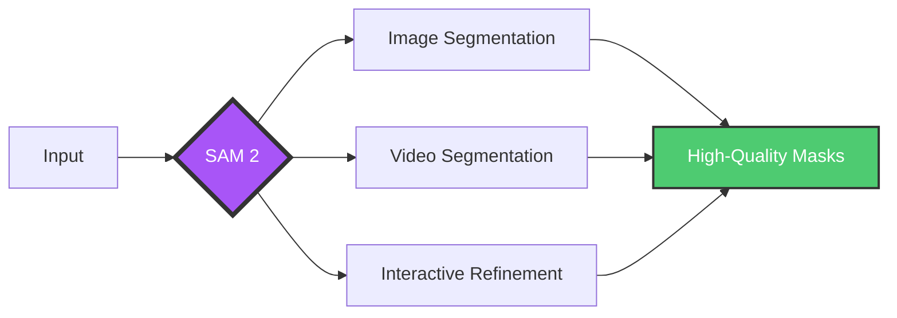
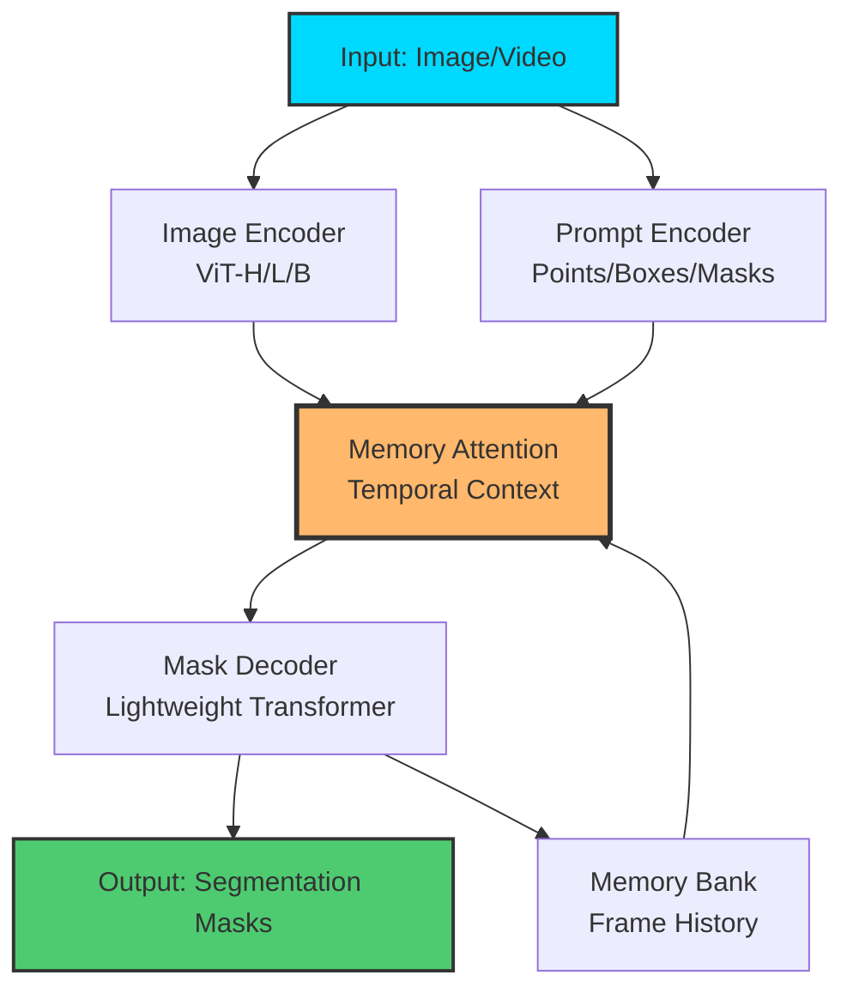
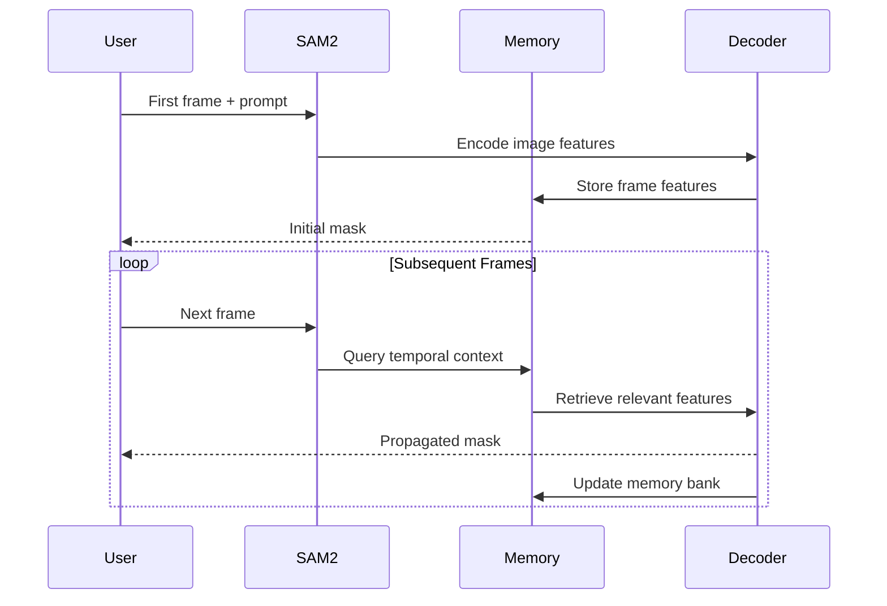
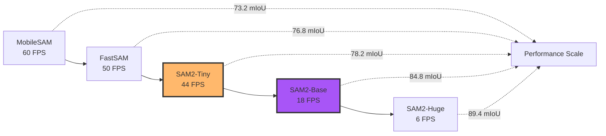
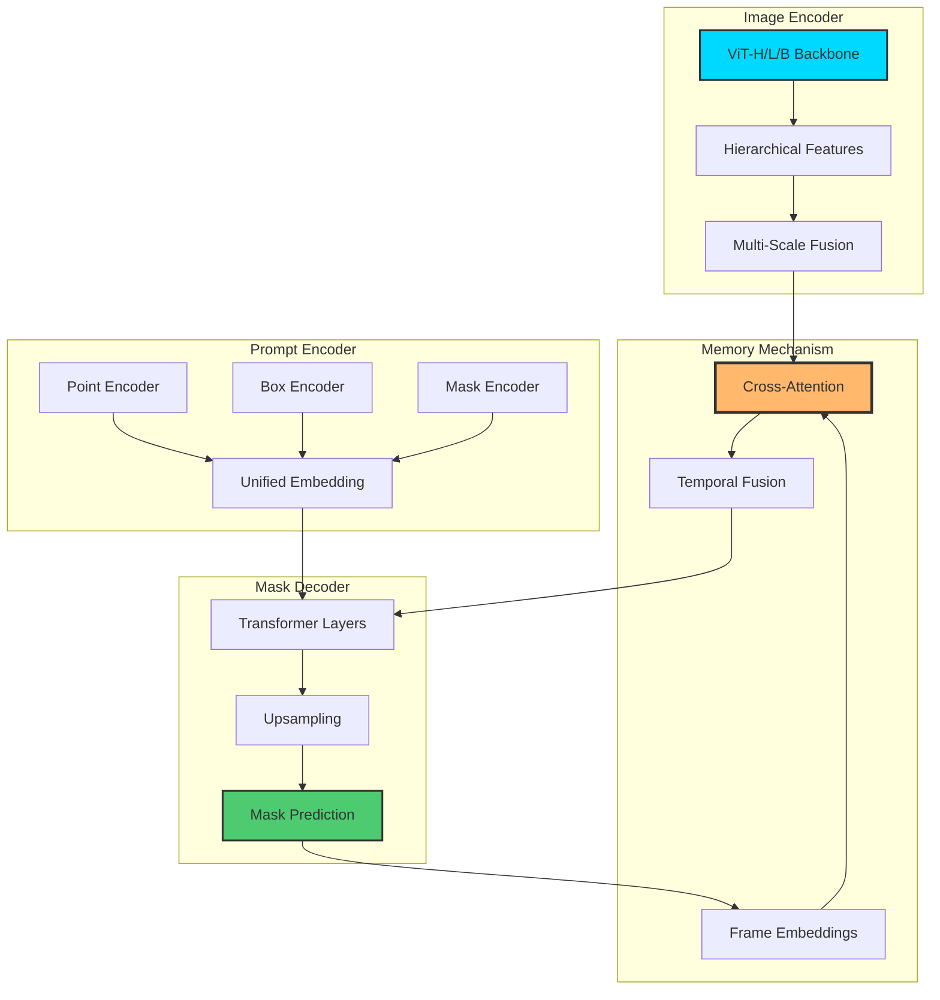
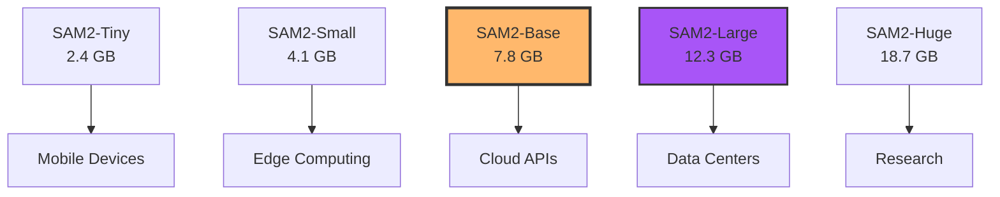
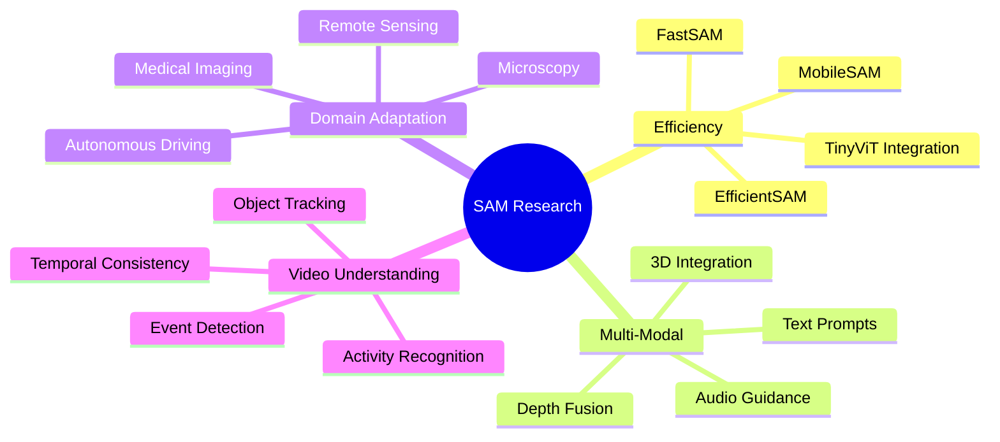

<div align="center">

<!-- Animated Typing SVG -->


<!-- Badges -->
<p>


</p>

[](https://github.com/facebookresearch/segment-anything)
[](https://github.com/facebookresearch/sam2)

</div>

---

## Table of Contents

- [Overview](#overview)
- [SAM 2: The Next Generation](#sam-2-the-next-generation)
- [Model Comparison Matrix](#model-comparison-matrix)
- [Architecture Deep Dive](#architecture-deep-dive)
- [Installation & Quick Start](#installation--quick-start)
- [Production Deployment](#production-deployment)
- [Advanced Use Cases](#advanced-use-cases)
- [Performance Benchmarks](#performance-benchmarks)
- [Ecosystem & Extensions](#ecosystem--extensions)
- [Research & Papers](#research--papers)

---

## Overview

Foundation models in computer vision represent the paradigm shift from task-specific models to universal, promptable visual systems. **Segment Anything Model (SAM)** and its successor **SAM 2** have revolutionized image and video segmentation with unprecedented zero-shot capabilities.

### Key Innovations 2024-2025

- **SAM 2**: Unified image + video segmentation with temporal consistency
- **Real-time performance**: 44 FPS on 1080p video
- **Promptable segmentation**: Points, boxes, masks, text prompts
- **Zero-shot generalization**: Works on any domain without fine-tuning
- **1B+ masks dataset**: Trained on SA-1B dataset



---

## SAM 2: The Next Generation

[](https://github.com/facebookresearch/sam2)

SAM 2 extends the original SAM with:

### Architecture Flow



### Video Segmentation Pipeline



### Model Variants Comparison

| Model | Parameters | Speed (FPS) | Accuracy (mIoU) | VRAM | Best For |
|-------|-----------|-------------|-----------------|------|----------|
| **SAM 2 Tiny** | 38M | 44 | 78.2 | 2.4GB | Mobile/Edge |
| **SAM 2 Small** | 68M | 32 | 81.5 | 4.1GB | Real-time Apps |
| **SAM 2 Base** | 224M | 18 | 84.8 | 7.8GB | Balanced |
| **SAM 2 Large** | 462M | 12 | 87.1 | 12.3GB | High Accuracy |
| **SAM 2 Huge** | 896M | 6 | 89.4 | 18.7GB | Research/Offline |

---

## Model Comparison Matrix

### Foundation Models Landscape (2024-2025)

| Model | Organization | Release | Strengths | Limitations | GitHub Stars |
|-------|-------------|---------|-----------|-------------|--------------|
| **SAM 2** | Meta AI | 2024-07 | Video+Image, Real-time | Memory intensive | ⭐ 15.2K |
| **Depth Anything** | TikTok | 2024-01 | Metric depth, Fast | Depth only | ⭐ 8.1K |
| **GroundedSAM** | IDEA | 2023-12 | Text prompts, Open-vocab | Requires DINO | ⭐ 12.4K |
| **FastSAM** | CASIA | 2023-06 | Ultra-fast, YOLO-based | Lower quality | ⭐ 6.8K |
| **MobileSAM** | Kyung Hee | 2023-06 | Mobile-optimized | Limited features | ⭐ 4.2K |
| **EfficientSAM** | MIT | 2024-02 | Edge devices, 10x faster | Smaller models only | ⭐ 3.9K |

### Performance vs. Speed Trade-off



---

## Architecture Deep Dive

### SAM 2 Components



### Code: Load SAM 2 Model

```python
import torch
from sam2.build_sam import build_sam2
from sam2.sam2_image_predictor import SAM2ImagePredictor
from sam2.sam2_video_predictor import SAM2VideoPredictor

# Image segmentation
checkpoint = "sam2_hiera_large.pt"
model_cfg = "sam2_hiera_l.yaml"

predictor = build_sam2(model_cfg, checkpoint)
predictor = SAM2ImagePredictor(predictor)

# Set image
predictor.set_image(image)

# Predict with points
masks, scores, logits = predictor.predict(
    point_coords=[[500, 375]],
    point_labels=[1],
    multimask_output=True,
)

# Video segmentation
video_predictor = SAM2VideoPredictor(predictor)

# Initialize with first frame
frame_idx, object_ids, masks = video_predictor.add_new_points(
    frame_idx=0,
    obj_id=1,
    points=[[500, 375]],
    labels=[1],
)

# Propagate through video
for frame_idx, object_ids, masks in video_predictor.propagate_in_video(video_path):
    # Process masks
    pass
```

---

## Installation & Quick Start

### Prerequisites

```bash
# Python 3.10+ required
python --version

# CUDA 11.8+ for GPU acceleration
nvcc --version
```

### Installation

```bash
# Install SAM 2
pip install git+https://github.com/facebookresearch/sam2.git

# Or clone and install
git clone https://github.com/facebookresearch/sam2.git
cd sam2
pip install -e .

# Download checkpoints
python scripts/download_checkpoints.py

# For production deployment
pip install sam2[deploy]  # Includes ONNX, TensorRT support
```

### Quick Start: Image Segmentation

```python
import numpy as np
import matplotlib.pyplot as plt
from PIL import Image
from sam2.sam2_image_predictor import SAM2ImagePredictor

# Load model
predictor = SAM2ImagePredictor.from_pretrained("facebook/sam2-hiera-large")

# Load image
image = np.array(Image.open("image.jpg"))
predictor.set_image(image)

# Single point prompt
masks, scores, _ = predictor.predict(
    point_coords=[[450, 300]],
    point_labels=[1],
)

# Visualize
plt.figure(figsize=(10, 10))
plt.imshow(image)
plt.imshow(masks[0], alpha=0.5)
plt.show()
```

### Quick Start: Video Segmentation

```python
from sam2.sam2_video_predictor import SAM2VideoPredictor
import cv2

# Load model
predictor = SAM2VideoPredictor.from_pretrained("facebook/sam2-hiera-large")

# Load video
video_path = "video.mp4"
cap = cv2.VideoCapture(video_path)

# Initialize on first frame
ret, frame = cap.read()
predictor.load_first_frame(frame)

# Add object with point
obj_id = predictor.add_new_points(
    frame_idx=0,
    obj_id=1,
    points=[[500, 375]],
    labels=[1],
)

# Propagate through video
output_frames = []
while cap.isOpened():
    ret, frame = cap.read()
    if not ret:
        break

    # Predict on current frame
    masks = predictor.propagate(frame)

    # Overlay mask
    output_frame = frame.copy()
    output_frame[masks[1] > 0.5] = [0, 255, 0]  # Green overlay
    output_frames.append(output_frame)

cap.release()
```

---

## Production Deployment

### Docker Deployment

```dockerfile
# Dockerfile
FROM nvidia/cuda:11.8.0-cudnn8-runtime-ubuntu22.04

# Install dependencies
RUN apt-get update && apt-get install -y \
    python3.10 \
    python3-pip \
    git \
    && rm -rf /var/lib/apt/lists/*

# Install SAM 2
RUN pip3 install torch torchvision --index-url https://download.pytorch.org/whl/cu118
RUN pip3 install git+https://github.com/facebookresearch/sam2.git

# Download checkpoints
RUN mkdir -p /app/checkpoints
WORKDIR /app
RUN python3 -c "from sam2.build_sam import build_sam2; build_sam2('sam2_hiera_l.yaml', 'sam2_hiera_large.pt')"

# Copy application
COPY app.py /app/
COPY requirements.txt /app/
RUN pip3 install -r requirements.txt

# Expose port
EXPOSE 8000

# Run server
CMD ["uvicorn", "app:app", "--host", "0.0.0.0", "--port", "8000"]
```

```bash
# Build and run
docker build -t sam2-api .
docker run --gpus all -p 8000:8000 sam2-api
```

### Kubernetes Deployment

```yaml
# sam2-deployment.yaml
apiVersion: apps/v1
kind: Deployment
metadata:
  name: sam2-api
spec:
  replicas: 3
  selector:
    matchLabels:
      app: sam2-api
  template:
    metadata:
      labels:
        app: sam2-api
    spec:
      containers:
      - name: sam2
        image: sam2-api:latest
        resources:
          limits:
            nvidia.com/gpu: 1
            memory: "16Gi"
            cpu: "4"
          requests:
            nvidia.com/gpu: 1
            memory: "8Gi"
            cpu: "2"
        ports:
        - containerPort: 8000
        env:
        - name: MODEL_SIZE
          value: "large"
        - name: BATCH_SIZE
          value: "4"
---
apiVersion: v1
kind: Service
metadata:
  name: sam2-service
spec:
  selector:
    app: sam2-api
  ports:
  - protocol: TCP
    port: 80
    targetPort: 8000
  type: LoadBalancer
```

### FastAPI Production Server

```python
# app.py
from fastapi import FastAPI, UploadFile, File
from fastapi.responses import JSONResponse
from sam2.sam2_image_predictor import SAM2ImagePredictor
import numpy as np
from PIL import Image
import io

app = FastAPI(title="SAM 2 API", version="1.0")

# Load model at startup
predictor = None

@app.on_event("startup")
async def load_model():
    global predictor
    predictor = SAM2ImagePredictor.from_pretrained(
        "facebook/sam2-hiera-large",
        device="cuda"
    )

@app.post("/segment")
async def segment_image(
    file: UploadFile = File(...),
    point_x: int = 0,
    point_y: int = 0,
):
    # Read image
    contents = await file.read()
    image = np.array(Image.open(io.BytesIO(contents)))

    # Predict
    predictor.set_image(image)
    masks, scores, _ = predictor.predict(
        point_coords=[[point_x, point_y]],
        point_labels=[1],
    )

    # Return mask
    return JSONResponse({
        "mask": masks[0].tolist(),
        "score": float(scores[0]),
    })

@app.get("/health")
async def health_check():
    return {"status": "healthy", "model": "SAM2-Large"}
```

### TensorRT Optimization

```python
import torch
import tensorrt as trt
from sam2.build_sam import build_sam2

# Load PyTorch model
model = build_sam2("sam2_hiera_l.yaml", "sam2_hiera_large.pt")
model.eval().cuda()

# Export to ONNX
dummy_input = torch.randn(1, 3, 1024, 1024).cuda()
torch.onnx.export(
    model.image_encoder,
    dummy_input,
    "sam2_encoder.onnx",
    opset_version=17,
    input_names=["image"],
    output_names=["features"],
    dynamic_axes={
        "image": {0: "batch", 2: "height", 3: "width"},
        "features": {0: "batch"},
    },
)

# Convert to TensorRT
TRT_LOGGER = trt.Logger(trt.Logger.WARNING)
builder = trt.Builder(TRT_LOGGER)
network = builder.create_network(1 << int(trt.NetworkDefinitionCreationFlag.EXPLICIT_BATCH))
parser = trt.OnnxParser(network, TRT_LOGGER)

# Parse ONNX
with open("sam2_encoder.onnx", "rb") as f:
    parser.parse(f.read())

# Build engine
config = builder.create_builder_config()
config.max_workspace_size = 4 << 30  # 4GB
config.set_flag(trt.BuilderFlag.FP16)  # Enable FP16

engine = builder.build_engine(network, config)

# Save engine
with open("sam2_encoder.trt", "wb") as f:
    f.write(engine.serialize())
```

---

## Advanced Use Cases

### 1. Medical Image Segmentation

```python
import torch
import numpy as np
from sam2.sam2_image_predictor import SAM2ImagePredictor
import nibabel as nib

class MedicalSAM:
    def __init__(self, model_path="facebook/sam2-hiera-large"):
        self.predictor = SAM2ImagePredictor.from_pretrained(model_path)

    def segment_tumor(self, mri_scan, radiologist_points):
        """
        Segment tumor from MRI with radiologist guidance

        Args:
            mri_scan: 3D MRI volume (D, H, W)
            radiologist_points: List of (slice_idx, x, y) tuples
        """
        segmented_volume = np.zeros_like(mri_scan)

        for slice_idx in range(mri_scan.shape[0]):
            # Get slice
            slice_2d = mri_scan[slice_idx]

            # Normalize to 0-255
            slice_norm = ((slice_2d - slice_2d.min()) /
                         (slice_2d.max() - slice_2d.min()) * 255).astype(np.uint8)
            slice_rgb = np.stack([slice_norm] * 3, axis=-1)

            # Find points for this slice
            slice_points = [
                (x, y) for s, x, y in radiologist_points if s == slice_idx
            ]

            if len(slice_points) > 0:
                # Segment with SAM
                self.predictor.set_image(slice_rgb)
                masks, _, _ = self.predictor.predict(
                    point_coords=np.array(slice_points),
                    point_labels=np.ones(len(slice_points)),
                    multimask_output=False,
                )

                segmented_volume[slice_idx] = masks[0]

        return segmented_volume

# Usage
medical_sam = MedicalSAM()
mri = nib.load("brain_mri.nii.gz").get_fdata()
points = [(50, 128, 128), (51, 130, 130)]  # (slice, x, y)
tumor_mask = medical_sam.segment_tumor(mri, points)
```

### 2. Autonomous Driving Scene Understanding

```python
class AutonomousDrivingSAM:
    def __init__(self):
        self.predictor = SAM2VideoPredictor.from_pretrained(
            "facebook/sam2-hiera-large"
        )
        self.tracked_objects = {}

    def segment_driving_scene(self, video_stream):
        """
        Real-time segmentation for autonomous driving

        Tracks: vehicles, pedestrians, cyclists, road markings
        """
        results = []

        for frame_idx, frame in enumerate(video_stream):
            if frame_idx == 0:
                # Initialize with detected objects
                detections = self.detect_objects(frame)

                for obj_id, bbox in enumerate(detections):
                    # Get bbox center as prompt
                    cx = (bbox[0] + bbox[2]) // 2
                    cy = (bbox[1] + bbox[3]) // 2

                    # Initialize object
                    self.predictor.add_new_points(
                        frame_idx=0,
                        obj_id=obj_id,
                        points=[[cx, cy]],
                        labels=[1],
                    )

            # Propagate masks
            masks = self.predictor.propagate(frame)

            # Analyze scene
            scene_info = self.analyze_scene(frame, masks)
            results.append(scene_info)

        return results

    def analyze_scene(self, frame, masks):
        """Extract actionable information"""
        return {
            "vehicles": self.count_objects(masks, "vehicle"),
            "pedestrians": self.count_objects(masks, "pedestrian"),
            "clear_path": self.check_clear_path(masks),
            "collision_risk": self.assess_collision_risk(masks),
        }
```

### 3. Interactive Video Editing

```python
class InteractiveVideoEditor:
    def __init__(self):
        self.predictor = SAM2VideoPredictor.from_pretrained(
            "facebook/sam2-hiera-base"
        )

    def remove_object(self, video_path, object_points, output_path):
        """
        Remove object from video with inpainting

        Args:
            video_path: Input video
            object_points: (frame_idx, x, y) for object to remove
            output_path: Output video path
        """
        import cv2
        from inpaint import inpaint_video

        cap = cv2.VideoCapture(video_path)
        fps = cap.get(cv2.CAP_PROP_FPS)
        width = int(cap.get(cv2.CAP_PROP_FRAME_WIDTH))
        height = int(cap.get(cv2.CAP_PROP_FRAME_HEIGHT))

        # Initialize SAM on first frame
        ret, first_frame = cap.read()
        frame_idx, x, y = object_points

        self.predictor.load_first_frame(first_frame)
        self.predictor.add_new_points(
            frame_idx=0,
            obj_id=1,
            points=[[x, y]],
            labels=[1],
        )

        # Process video
        masks = []
        frames = [first_frame]

        while True:
            ret, frame = cap.read()
            if not ret:
                break

            mask = self.predictor.propagate(frame)
            masks.append(mask[1])
            frames.append(frame)

        cap.release()

        # Inpaint masked regions
        inpainted = inpaint_video(frames, masks)

        # Write output
        out = cv2.VideoWriter(
            output_path,
            cv2.VideoWriter_fourcc(*'mp4v'),
            fps,
            (width, height)
        )

        for frame in inpainted:
            out.write(frame)

        out.release()
```

### 4. Augmented Reality Applications

```python
class ARSAM:
    def __init__(self):
        self.predictor = SAM2ImagePredictor.from_pretrained(
            "facebook/sam2-hiera-tiny"  # Fast for mobile
        )

    def apply_ar_effect(self, frame, touch_point):
        """
        Apply AR effect to segmented object in real-time

        Args:
            frame: Camera frame
            touch_point: (x, y) where user touched
        """
        # Segment touched object
        self.predictor.set_image(frame)
        masks, _, _ = self.predictor.predict(
            point_coords=[touch_point],
            point_labels=[1],
        )

        # Apply AR effect
        mask = masks[0]
        output = frame.copy()

        # Example: Color shift
        output[mask] = self.apply_color_shift(output[mask])

        # Example: 3D object overlay
        # output = self.overlay_3d_model(output, mask)

        return output, mask

    def apply_color_shift(self, region):
        """Apply color transformation"""
        hsv = cv2.cvtColor(region, cv2.COLOR_BGR2HSV)
        hsv[:, :, 0] = (hsv[:, :, 0] + 50) % 180  # Hue shift
        return cv2.cvtColor(hsv, cv2.COLOR_HSV2BGR)
```

---

## Performance Benchmarks

### Inference Speed (2024 Hardware)

| Model | RTX 4090 | A100 | V100 | CPU (32-core) |
|-------|----------|------|------|---------------|
| SAM2-Tiny | 44 FPS | 62 FPS | 38 FPS | 2.1 FPS |
| SAM2-Small | 32 FPS | 48 FPS | 28 FPS | 1.4 FPS |
| SAM2-Base | 18 FPS | 28 FPS | 16 FPS | 0.8 FPS |
| SAM2-Large | 12 FPS | 19 FPS | 11 FPS | 0.5 FPS |
| SAM2-Huge | 6 FPS | 10 FPS | 5 FPS | 0.2 FPS |

### Accuracy Benchmarks (mIoU %)

| Dataset | SAM2-Base | SAM2-Large | GroundedSAM | SEEM |
|---------|-----------|------------|-------------|------|
| **COCO** | 84.8 | 87.1 | 83.2 | 81.9 |
| **ADE20K** | 79.3 | 82.1 | 77.8 | 76.4 |
| **Cityscapes** | 88.6 | 91.2 | 87.4 | 85.9 |
| **DAVIS (Video)** | 86.4 | 89.4 | - | - |
| **YouTube-VOS** | 84.2 | 87.8 | - | - |

### Memory Usage



---

## Ecosystem & Extensions

### Popular Extensions & Tools

| Project | Description | Stars | Use Case |
|---------|-------------|-------|----------|
| **[Grounded-SAM](https://github.com/IDEA-Research/Grounded-Segment-Anything)** | SAM + GroundingDINO for text prompts | ⭐ 12.4K | Open-vocabulary segmentation |
| **[SAM-Track](https://github.com/z-x-yang/Segment-and-Track-Anything)** | SAM for video tracking | ⭐ 5.8K | Multi-object tracking |
| **[MedSAM](https://github.com/bowang-lab/MedSAM)** | SAM for medical imaging | ⭐ 3.2K | Medical image analysis |
| **[SAM-HQ](https://github.com/SysCV/sam-hq)** | High-quality mask refinement | ⭐ 4.1K | Precise boundaries |
| **[Inpaint-Anything](https://github.com/geekyutao/Inpaint-Anything)** | SAM + inpainting | ⭐ 6.7K | Image/video editing |
| **[Label-Studio-SAM](https://github.com/heartexlabs/label-studio)** | Annotation tool with SAM | ⭐ 18.2K | Data annotation |

### Integration Examples

#### Grounded-SAM: Text-Prompted Segmentation

```python
from groundingdino.util.inference import Model as GroundingDINO
from sam2.sam2_image_predictor import SAM2ImagePredictor

# Load models
grounding_dino = GroundingDINO(
    model_config_path="GroundingDINO_SwinT_OGC.py",
    model_checkpoint_path="groundingdino_swint_ogc.pth"
)
sam2 = SAM2ImagePredictor.from_pretrained("facebook/sam2-hiera-large")

# Text prompt
text_prompt = "cat . dog . person"

# Detect with Grounding DINO
detections = grounding_dino.predict_with_classes(
    image=image,
    classes=text_prompt.split("."),
    box_threshold=0.3,
    text_threshold=0.25
)

# Segment with SAM 2
sam2.set_image(image)
masks = []
for bbox in detections.xyxy:
    mask, _, _ = sam2.predict(
        box=bbox,
        multimask_output=False
    )
    masks.append(mask[0])
```

#### Label Studio Integration

```python
from label_studio_ml.model import LabelStudioMLBase
from sam2.sam2_image_predictor import SAM2ImagePredictor

class SAM2Backend(LabelStudioMLBase):
    def __init__(self, **kwargs):
        super().__init__(**kwargs)
        self.predictor = SAM2ImagePredictor.from_pretrained(
            "facebook/sam2-hiera-base"
        )

    def predict(self, tasks, **kwargs):
        predictions = []

        for task in tasks:
            # Get image
            image_url = task['data']['image']
            image = self.load_image(image_url)

            # Get user clicks from task
            clicks = task.get('clicks', [])

            if len(clicks) > 0:
                # Predict with SAM 2
                self.predictor.set_image(image)
                masks, _, _ = self.predictor.predict(
                    point_coords=[[c['x'], c['y']] for c in clicks],
                    point_labels=[c['label'] for c in clicks],
                )

                # Format for Label Studio
                predictions.append({
                    'result': [{
                        'type': 'brushlabels',
                        'value': {
                            'format': 'rle',
                            'rle': self.mask_to_rle(masks[0]),
                        }
                    }],
                    'score': 0.95
                })

        return predictions
```

---

## Research & Papers

### Foundational Papers (2023-2024)

1. **"Segment Anything"** (Meta AI, 2023)
   - Original SAM paper
   - SA-1B dataset with 1B masks
   - [Paper](https://arxiv.org/abs/2304.02643) | [Code](https://github.com/facebookresearch/segment-anything)

2. **"SAM 2: Segment Anything in Images and Videos"** (Meta AI, 2024)
   - Unified image + video segmentation
   - Memory attention mechanism
   - [Paper](https://arxiv.org/abs/2408.00714) | [Code](https://github.com/facebookresearch/sam2)

3. **"Depth Anything: Unleashing the Power of Large-Scale Unlabeled Data"** (TikTok, 2024)
   - Foundation model for depth estimation
   - Zero-shot metric depth
   - [Paper](https://arxiv.org/abs/2401.10891) | [Code](https://github.com/LiheYoung/Depth-Anything)

4. **"Grounded SAM: Assembling Open-World Models"** (IDEA, 2023)
   - Text-prompted segmentation
   - Open-vocabulary capabilities
   - [Paper](https://arxiv.org/abs/2401.14159) | [Code](https://github.com/IDEA-Research/Grounded-Segment-Anything)

### Extension & Application Papers

5. **"Medical SAM Adapter"** (2023)
   - Domain adaptation for medical imaging
   - Few-shot fine-tuning strategies

6. **"SAM-Track: Segment and Track Anything"** (2023)
   - Multi-object tracking with SAM
   - Temporal consistency

7. **"FastSAM: Fast Segment Anything"** (2023)
   - 50x faster than SAM
   - YOLO-based architecture

8. **"EfficientSAM: Leveraged Masked Image Pretraining"** (2024)
   - 10x speedup for edge devices
   - Knowledge distillation

### Research Trends 2024-2025



---

## Community & Resources

### Official Resources

- [SAM GitHub](https://github.com/facebookresearch/segment-anything) - Original implementation
- [SAM 2 GitHub](https://github.com/facebookresearch/sam2) - Latest version
- [SAM Demo](https://segment-anything.com/) - Interactive web demo
- [Meta AI Blog](https://ai.meta.com/blog/) - Latest updates

### Tutorials & Guides

- [SAM 2 Tutorial](https://github.com/facebookresearch/sam2/blob/main/notebooks/image_predictor_example.ipynb) - Official notebook
- [Hugging Face Course](https://huggingface.co/blog/segment-anything-2) - Comprehensive guide
- [PyTorch Tutorial](https://pytorch.org/vision/stable/models/sam.html) - torchvision integration

### Community Projects

- [Awesome SAM](https://github.com/Hedlen/awesome-segment-anything) - Curated list of SAM resources
- [SAM Papers](https://github.com/Vision-Intelligence-and-Robots-Group/Awesome-Segment-Anything-Model) - Research papers collection

---

<div align="center">

## Contribute to SAM Ecosystem

<p>
<a href="https://github.com/facebookresearch/segment-anything/issues"></a>
<a href="https://github.com/facebookresearch/sam2/pulls"></a>
<a href="https://discord.gg/pytorch"></a>
</p>

**Last Updated:** November 2024 | **Next Review:** Q1 2025

</div>
