<div align="center">

<!-- Animated Typing SVG Header -->


<!-- Modern Shields -->
<p align="center">
  
  
  
  
</p>

<p align="center">
  
  
  
</p>

---

### 🎯 Master Node-Based AI Workflows
*From Beginner to Advanced: Build Production-Ready Generative AI Pipelines*

[](https://github.com/comfyanonymous/ComfyUI)
[](https://github.com)

</div>

---

## 📋 Table of Contents

- [🚀 What's New in 2024-2025](#-whats-new-in-2024-2025)
- [⚡ Quick Start](#-quick-start)
- [🎨 Essential Workflows](#-essential-workflows)
- [🔌 Top Custom Nodes 2024-2025](#-top-custom-nodes-2024-2025)
- [🏗️ Advanced Architectures](#️-advanced-architectures)
- [📊 Workflow Examples](#-workflow-examples)
- [🎯 Production Deployment](#-production-deployment)
- [💡 Tips & Optimization](#-tips--optimization)
- [🌐 Community & Resources](#-community--resources)

---

## 🚀 What's New in 2024-2025

### Latest Features

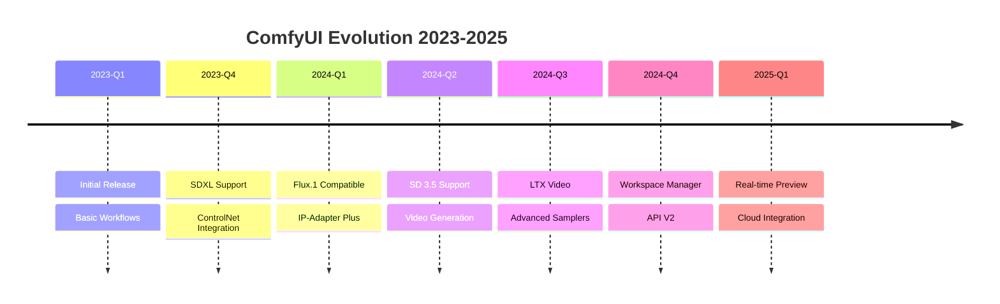

### 🏆 Key Advantages

| Feature | ComfyUI | A1111 WebUI | InvokeAI |
|---------|---------|-------------|----------|
| **Memory Efficiency** | ⭐⭐⭐⭐⭐ | ⭐⭐⭐ | ⭐⭐⭐⭐ |
| **Workflow Complexity** | ⭐⭐⭐⭐⭐ | ⭐⭐ | ⭐⭐⭐ |
| **Custom Nodes** | 1000+ | Extensions | Limited |
| **Learning Curve** | Moderate | Easy | Moderate |
| **Speed** | ⭐⭐⭐⭐⭐ | ⭐⭐⭐⭐ | ⭐⭐⭐⭐ |
| **Batch Processing** | ⭐⭐⭐⭐⭐ | ⭐⭐⭐ | ⭐⭐⭐ |
| **API Support** | ⭐⭐⭐⭐⭐ | ⭐⭐⭐⭐ | ⭐⭐⭐⭐ |

---

## ⚡ Quick Start

### Installation

```bash
# Clone repository
git clone https://github.com/comfyanonymous/ComfyUI.git
cd ComfyUI

# Create virtual environment
python -m venv venv
source venv/bin/activate  # On Windows: venv\Scripts\activate

# Install dependencies
pip install -r requirements.txt

# For NVIDIA GPUs (recommended)
pip install torch torchvision torchaudio --index-url https://download.pytorch.org/whl/cu121

# Launch ComfyUI
python main.py

# Access at http://127.0.0.1:8188
```

### Installation with Manager (Recommended)

```bash
# After basic install, add ComfyUI Manager
cd custom_nodes
git clone https://github.com/ltdrdata/ComfyUI-Manager.git

# Restart ComfyUI - Manager will appear in the interface
```

### 📁 Directory Structure

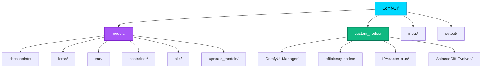

---

## 🎨 Essential Workflows

### Basic Text-to-Image Workflow

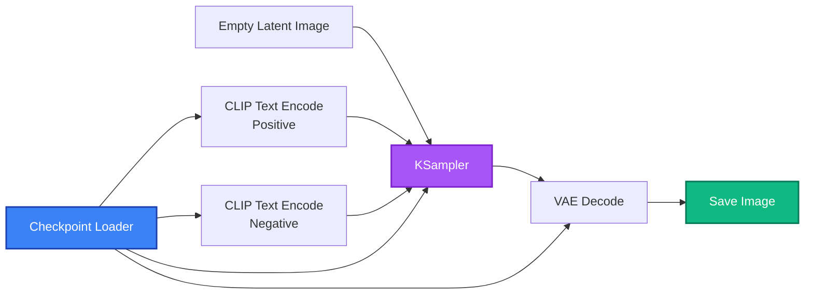

### Advanced SDXL Workflow with Refiner

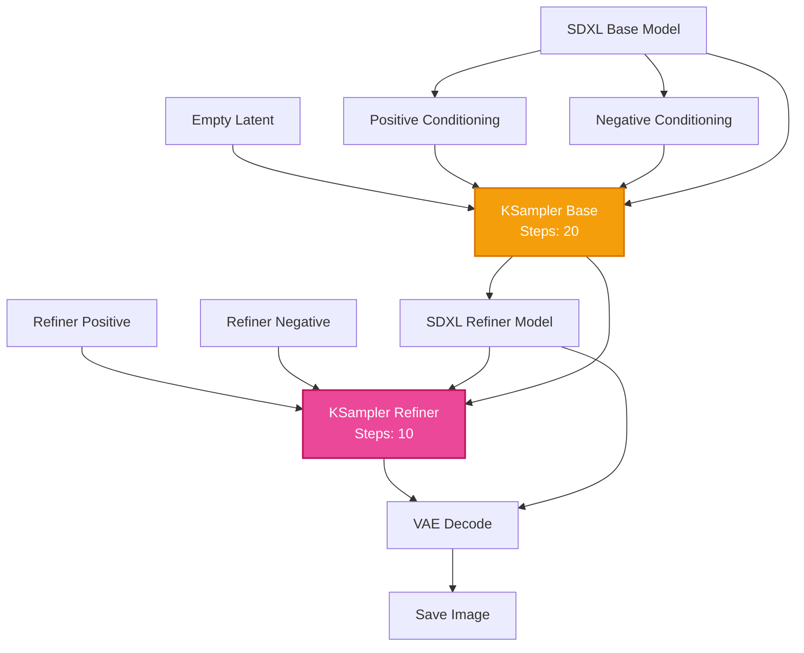

---

## 🔌 Top Custom Nodes 2024-2025

### 🏆 Essential Nodes

#### 1. **ComfyUI Manager** ⭐⭐⭐⭐⭐
[](https://github.com/ltdrdata/ComfyUI-Manager)

**Features:**
- Install/update custom nodes with one click
- Model manager
- Missing nodes auto-install
- Workflow sharing

```bash
cd custom_nodes
git clone https://github.com/ltdrdata/ComfyUI-Manager.git
```

#### 2. **Efficiency Nodes** ⭐⭐⭐⭐⭐
[](https://github.com/jags111/efficiency-nodes-comfyui)

**Features:**
- Consolidated nodes for faster workflows
- XY Plot generation
- Highres-Fix node
- Script nodes for automation

#### 3. **IP-Adapter Plus** ⭐⭐⭐⭐⭐
[](https://github.com/cubiq/ComfyUI_IPAdapter_plus)

**Use Cases:**
- Style transfer from reference images
- Face ID preservation
- Composition guidance
- Multi-image conditioning

**Workflow:**
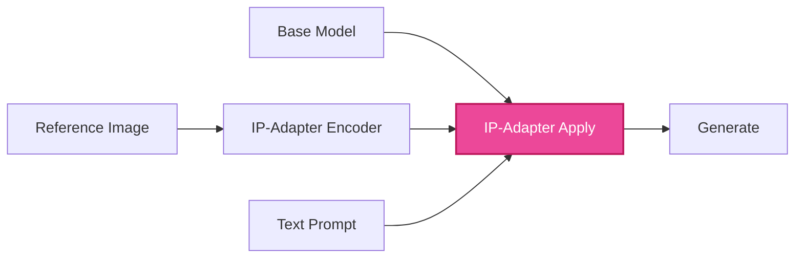

#### 4. **ControlNet Preprocessors** ⭐⭐⭐⭐⭐
[](https://github.com/Fannovel16/comfyui_controlnet_aux)

**Available Preprocessors:**
- ✅ Canny Edge Detection
- ✅ Depth (MiDaS, ZoeDepth, DepthAnything)
- ✅ Normal Map
- ✅ OpenPose & DWPose
- ✅ Lineart (Anime, Realistic)
- ✅ Scribble & HED
- ✅ Segmentation (OneFormer, SAM)

#### 5. **AnimateDiff Evolved** ⭐⭐⭐⭐⭐
[](https://github.com/Kosinkadink/ComfyUI-AnimateDiff-Evolved)

**Video Generation:**
- AnimateDiff for SD 1.5 and SDXL
- Motion LoRAs
- HotshotXL support
- Frame interpolation
- Context scheduling

### 🌟 2024-2025 New Nodes

#### 6. **InstantID**
Face-preserving generation with incredible consistency

```python
# Node setup
instantid_model -> apply_instantid -> ksampler
face_image -> face_analysis -> apply_instantid
```

#### 7. **PhotoMaker**
Photorealistic portrait generation

#### 8. **LTX Video**
State-of-the-art video generation (2024)

#### 9. **IC-Light**
Controllable relighting in generation

#### 10. **LayerDiffuse**
Transparent image generation with alpha channel

---

## 🏗️ Advanced Architectures

### Multi-ControlNet + IP-Adapter Workflow

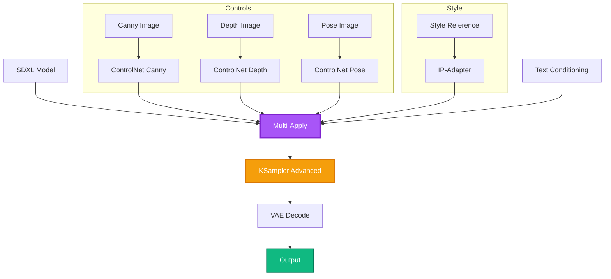

### Upscale Workflow (4K+)

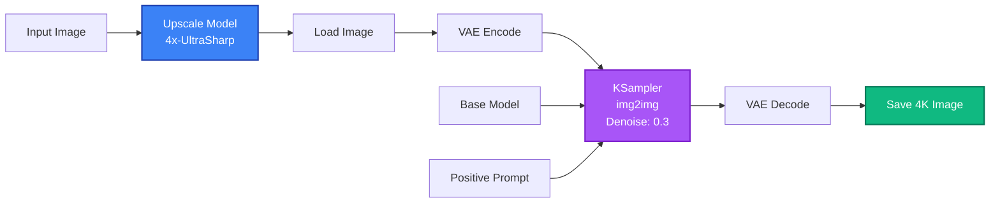

---

## 📊 Workflow Examples

### 1. Photorealistic Portrait Pipeline

**Nodes Used:**
- Checkpoint: `realisticVisionV60.safetensors`
- ControlNet: OpenPose + Depth
- IP-Adapter: Face ID
- Upscaler: 4x-UltraSharp
- Face Restore: CodeFormer

**Settings:**
```json
{
  "base_steps": 30,
  "cfg": 7.0,
  "sampler": "dpmpp_2m_sde_gpu",
  "scheduler": "karras",
  "denoise": 1.0,
  "controlnet_strength": [0.7, 0.5],
  "ip_adapter_weight": 0.6
}
```

### 2. Architectural Visualization

**Workflow:**
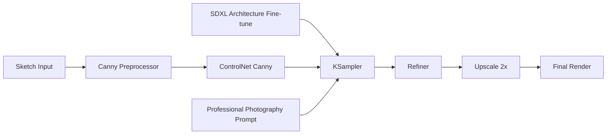

### 3. Anime Character Generation

**Stack:**
- Model: `animagineXL3.safetensors`
- LoRAs: Character style + Pose control
- ControlNet: Lineart
- Additional: Color palette guidance

### 4. Product Photography

**Complete Pipeline:**
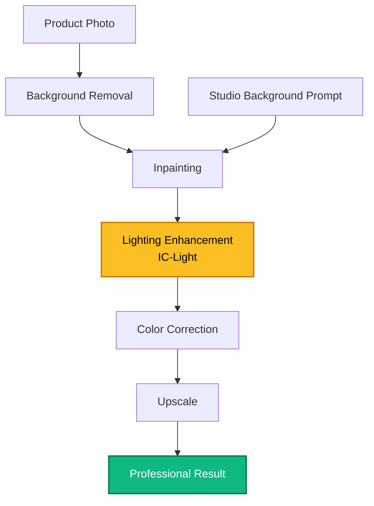

### 5. Video Generation (AnimateDiff)

**16-Frame Animation:**
```json
{
  "workflow": {
    "checkpoint": "sd15_base",
    "motion_module": "mm_sd_v15_v2",
    "motion_lora": "v2_lora_RollingAnticlockwise",
    "frames": 16,
    "fps": 8,
    "context_length": 16,
    "prompt_travel": {
      "0": "day scene, sunny",
      "8": "sunset scene, golden hour",
      "16": "night scene, stars"
    }
  }
}
```

---

## 🎯 Production Deployment

### API Usage

```python
import requests
import json
import base64
from io import BytesIO
from PIL import Image

class ComfyUIAPI:
    def __init__(self, server_address="127.0.0.1:8188"):
        self.server_address = server_address
        self.client_id = str(uuid.uuid4())

    def queue_prompt(self, prompt):
        """Queue a workflow for execution"""
        p = {"prompt": prompt, "client_id": self.client_id}
        data = json.dumps(p).encode('utf-8')
        req = urllib.request.Request(
            f"http://{self.server_address}/prompt",
            data=data
        )
        return json.loads(urllib.request.urlopen(req).read())

    def get_image(self, filename, subfolder, folder_type):
        """Get generated image"""
        data = {
            "filename": filename,
            "subfolder": subfolder,
            "type": folder_type
        }
        url_values = urllib.parse.urlencode(data)

        with urllib.request.urlopen(
            f"http://{self.server_address}/view?{url_values}"
        ) as response:
            return response.read()

    def generate_image(self, prompt_text, negative_prompt=""):
        """Complete generation pipeline"""
        # Load workflow template
        workflow = self.load_workflow_template()

        # Update prompts
        workflow["6"]["inputs"]["text"] = prompt_text
        workflow["7"]["inputs"]["text"] = negative_prompt

        # Queue and wait
        response = self.queue_prompt(workflow)
        prompt_id = response['prompt_id']

        # Wait for completion and get image
        output_images = self.wait_for_completion(prompt_id)

        return output_images

# Usage
api = ComfyUIAPI()
images = api.generate_image(
    "a beautiful landscape, mountains, lake, sunset",
    "blurry, low quality"
)
```

### Docker Deployment

```dockerfile
FROM nvidia/cuda:12.1.0-cudnn8-runtime-ubuntu22.04

# Install dependencies
RUN apt-get update && apt-get install -y \
    python3.10 \
    python3-pip \
    git \
    wget \
    && rm -rf /var/lib/apt/lists/*

# Clone ComfyUI
WORKDIR /app
RUN git clone https://github.com/comfyanonymous/ComfyUI.git
WORKDIR /app/ComfyUI

# Install Python packages
RUN pip3 install --no-cache-dir -r requirements.txt
RUN pip3 install --no-cache-dir \
    torch torchvision torchaudio \
    --index-url https://download.pytorch.org/whl/cu121

# Install essential custom nodes
WORKDIR /app/ComfyUI/custom_nodes
RUN git clone https://github.com/ltdrdata/ComfyUI-Manager.git && \
    git clone https://github.com/jags111/efficiency-nodes-comfyui.git && \
    git clone https://github.com/cubiq/ComfyUI_IPAdapter_plus.git

# Expose port
EXPOSE 8188

# Run ComfyUI
WORKDIR /app/ComfyUI
CMD ["python3", "main.py", "--listen", "0.0.0.0", "--port", "8188"]
```

**Build and Run:**
```bash
docker build -t comfyui:latest .
docker run --gpus all -p 8188:8188 -v $(pwd)/models:/app/ComfyUI/models comfyui:latest
```

### Kubernetes Deployment

```yaml
apiVersion: apps/v1
kind: Deployment
metadata:
  name: comfyui
spec:
  replicas: 2
  selector:
    matchLabels:
      app: comfyui
  template:
    metadata:
      labels:
        app: comfyui
    spec:
      containers:
      - name: comfyui
        image: comfyui:latest
        ports:
        - containerPort: 8188
        resources:
          limits:
            nvidia.com/gpu: 1
            memory: "16Gi"
          requests:
            nvidia.com/gpu: 1
            memory: "8Gi"
        volumeMounts:
        - name: models
          mountPath: /app/ComfyUI/models
        - name: output
          mountPath: /app/ComfyUI/output
      volumes:
      - name: models
        persistentVolumeClaim:
          claimName: comfyui-models
      - name: output
        persistentVolumeClaim:
          claimName: comfyui-output
---
apiVersion: v1
kind: Service
metadata:
  name: comfyui-service
spec:
  type: LoadBalancer
  ports:
  - port: 80
    targetPort: 8188
  selector:
    app: comfyui
```

---

## 💡 Tips & Optimization

### Performance Optimization

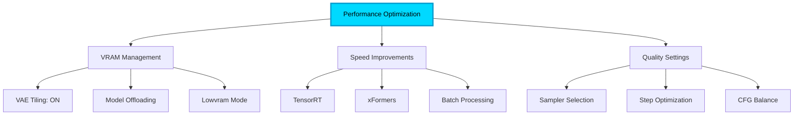

### Best Practices

**1. VRAM Optimization**
```python
# Low VRAM settings (8GB)
--lowvram  # Loads models on demand
--preview-method auto  # Efficient previews

# Medium VRAM (12-16GB)
--normalvram  # Standard mode

# High VRAM (24GB+)
# No flags needed, full performance
```

**2. Sampler Recommendations**

| Use Case | Best Sampler | Steps | CFG |
|----------|-------------|-------|-----|
| **Quality (slow)** | DPM++ 2M Karras | 25-30 | 7.0 |
| **Balanced** | DPM++ SDE Karras | 20-25 | 6.5 |
| **Speed** | LCM | 4-8 | 1.5 |
| **Photorealistic** | DPM++ 2M SDE GPU | 30-40 | 7.5 |
| **Anime** | Euler a | 20-28 | 7.0 |

**3. Workflow Optimization**
- Group related nodes
- Use reroute nodes for clean connections
- Save frequently used node groups
- Use workflow templates
- Enable auto-queue for batch processing

**4. Model Management**
```bash
# Organize models
models/
├── checkpoints/
│   ├── realistic/
│   ├── anime/
│   └── artistic/
├── loras/
│   ├── characters/
│   ├── styles/
│   └── concepts/
└── controlnet/
    ├── sd15/
    └── sdxl/
```

### Troubleshooting

**Common Issues:**

| Problem | Solution |
|---------|----------|
| Out of Memory | Enable `--lowvram` or reduce batch size |
| Slow Generation | Use faster samplers (LCM, DPM++ 2M) |
| Poor Quality | Increase steps, adjust CFG |
| Missing Nodes | Install via ComfyUI Manager |
| Black Images | Check VAE, try different one |
| Workflow Won't Load | Update custom nodes |

---

## 🌐 Community & Resources

### Official Links

[](https://github.com/comfyanonymous/ComfyUI)
[](https://comfyanonymous.github.io/ComfyUI_examples/)
[](https://comfyanonymous.github.io/ComfyUI_examples/)

### Top Resources

**Workflow Sharing:**
- 🌐 [OpenArt](https://openart.ai/workflows) - Thousands of workflows
- 🎨 [CivitAI](https://civitai.com/models?type=Workflow) - Community workflows
- 📊 [ComfyWorkflows](https://comfyworkflows.com/) - Curated collection

**Learning:**
- 📺 [Olivio Sarikas](https://www.youtube.com/@OlivioSarikas) - Comprehensive tutorials
- 🎓 [Scott Detweiler](https://www.youtube.com/@scottdetweiler) - Advanced techniques
- 🔥 [Aitrepreneur](https://www.youtube.com/@Aitrepreneur) - Business applications

**Custom Nodes:**
- 📦 [ComfyUI Nodes Registry](https://ltdrdata.github.io/ComfyUI-Manager/)
- 🔌 [Custom Nodes List](https://github.com/ltdrdata/ComfyUI-Manager)

### Community

- **Discord:** [ComfyUI Official](https://discord.gg/comfyui)
- **Reddit:** [r/comfyui](https://reddit.com/r/comfyui)
- **GitHub:** [Discussions](https://github.com/comfyanonymous/ComfyUI/discussions)

### Recommended Extensions

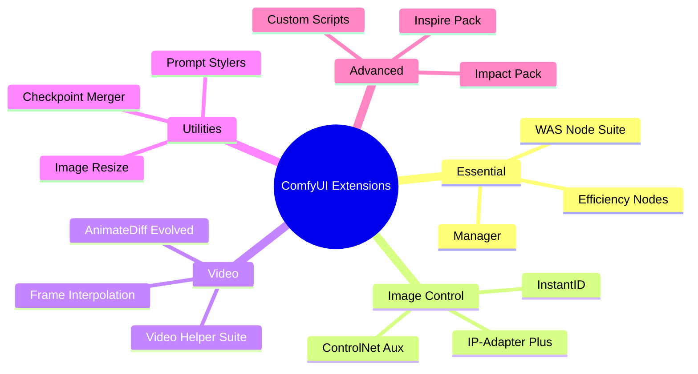

---

<div align="center">

## 🎓 Learning Path

**Beginner** → Install + Basic workflow → Text-to-Image mastery
↓
**Intermediate** → ControlNet + LoRAs → Complex workflows
↓
**Advanced** → Custom nodes + API + Production deployment
↓
**Expert** → Workflow optimization + Custom integrations + Business solutions

---

## 🌟 Contributing

Share your workflows and help the community grow!

[](CONTRIBUTING.md)
[](https://github.com)

---

**Last Updated:** November 2025 | **Next Update:** Weekly

*Join 100K+ users creating amazing AI art with ComfyUI!*

</div>
