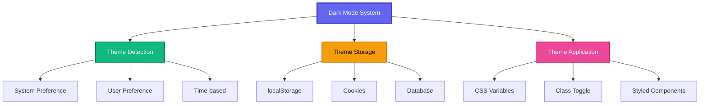
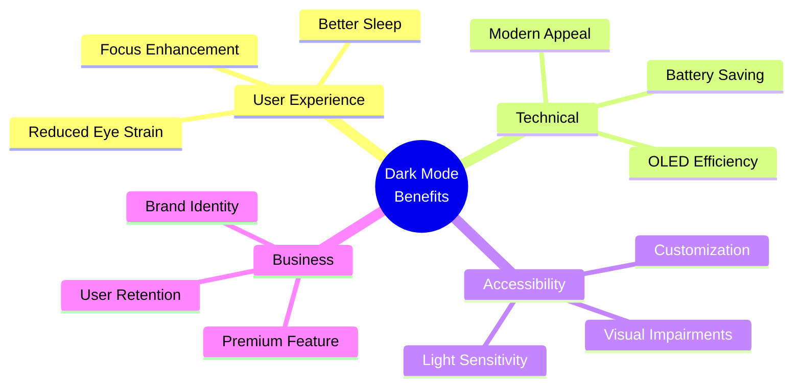
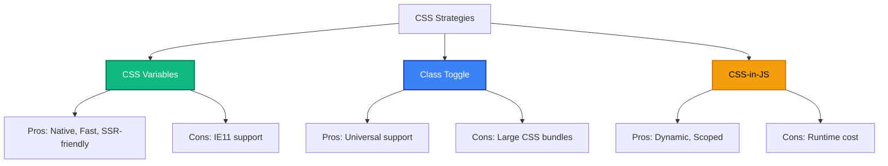

<div align="center">

<!-- Animated Typing SVG Header -->


<!-- Modern Shields -->
<p align="center">
  
  
  
  
</p>

<p align="center">
  
  
  
</p>

---

### 🌙 Essential Feature for Modern Apps
*Complete Dark Mode Implementation Guide for Web & Mobile*

[](https://github.com)

</div>

---

## 📋 Table of Contents

- [🚀 Overview](#-overview)
- [🎨 Design System](#-design-system)
- [⚛️ React Implementation](#️-react-implementation)
- [🔄 Next.js & SSR](#-nextjs--ssr)
- [🎯 Tailwind CSS](#-tailwind-css)
- [📱 Mobile Implementation](#-mobile-implementation)
- [♿ Accessibility](#-accessibility)
- [🏭 Production Best Practices](#-production-best-practices)

---

## 🚀 Overview

### Architecture



### Benefits



---

## 🎨 Design System

### Color Palette Structure

```css
:root {
  /* Light Mode */
  --color-bg-primary: #ffffff;
  --color-bg-secondary: #f3f4f6;
  --color-bg-tertiary: #e5e7eb;

  --color-text-primary: rgba(0, 0, 0, 0.87);
  --color-text-secondary: rgba(0, 0, 0, 0.60);
  --color-text-tertiary: rgba(0, 0, 0, 0.38);

  --color-border-primary: #e5e7eb;
  --color-border-secondary: #d1d5db;

  --color-surface: #ffffff;
  --color-surface-elevated: #f9fafb;

  /* Shadows */
  --shadow-sm: 0 1px 2px 0 rgba(0, 0, 0, 0.05);
  --shadow-md: 0 4px 6px -1px rgba(0, 0, 0, 0.1);
  --shadow-lg: 0 10px 15px -3px rgba(0, 0, 0, 0.1);
}

[data-theme="dark"] {
  /* Dark Mode */
  --color-bg-primary: #0f172a;
  --color-bg-secondary: #1e293b;
  --color-bg-tertiary: #334155;

  --color-text-primary: rgba(255, 255, 255, 0.87);
  --color-text-secondary: rgba(255, 255, 255, 0.60);
  --color-text-tertiary: rgba(255, 255, 255, 0.38);

  --color-border-primary: #334155;
  --color-border-secondary: #475569;

  --color-surface: #1e293b;
  --color-surface-elevated: #334155;

  /* Enhanced Shadows for Dark */
  --shadow-sm: 0 1px 2px 0 rgba(0, 0, 0, 0.3);
  --shadow-md: 0 4px 6px -1px rgba(0, 0, 0, 0.4);
  --shadow-lg: 0 10px 15px -3px rgba(0, 0, 0, 0.5);
}

/* Material Design Elevation System */
[data-theme="dark"] {
  --surface-dp0: #121212;
  --surface-dp1: #1e1e1e;  /* 5% white */
  --surface-dp2: #232323;  /* 7% white */
  --surface-dp3: #252525;  /* 8% white */
  --surface-dp4: #272727;  /* 9% white */
  --surface-dp6: #2c2c2c;  /* 11% white */
  --surface-dp8: #2e2e2e;  /* 12% white */
  --surface-dp12: #333333; /* 14% white */
}
```

### Typography & Contrast

```css
/* Ensure WCAG 2.1 AA compliance */
:root {
  --text-contrast-high: 7:1;    /* AAA Large Text */
  --text-contrast-medium: 4.5:1; /* AA Normal Text */
  --text-contrast-low: 3:1;      /* UI Elements */
}

[data-theme="dark"] {
  /* Reduce pure white to prevent eye strain */
  --color-text-primary: #e2e8f0;     /* Not pure white */
  --color-text-secondary: #94a3b8;
  --color-text-tertiary: #64748b;
}
```

---

## ⚛️ React Implementation

### Complete React Hook

```typescript
import { useState, useEffect } from 'react';

type Theme = 'light' | 'dark' | 'system';

interface UseDarkModeReturn {
  theme: Theme;
  setTheme: (theme: Theme) => void;
  isDark: boolean;
  toggle: () => void;
}

export function useDarkMode(): UseDarkModeReturn {
  const [theme, setThemeState] = useState<Theme>('system');
  const [isDark, setIsDark] = useState(false);

  // Initialize theme from localStorage or system preference
  useEffect(() => {
    const stored = localStorage.getItem('theme') as Theme;
    if (stored && ['light', 'dark', 'system'].includes(stored)) {
      setThemeState(stored);
    }
  }, []);

  // Apply theme
  useEffect(() => {
    const applyTheme = () => {
      let shouldBeDark = false;

      if (theme === 'dark') {
        shouldBeDark = true;
      } else if (theme === 'light') {
        shouldBeDark = false;
      } else {
        // System preference
        shouldBeDark = window.matchMedia('(prefers-color-scheme: dark)').matches;
      }

      // Apply to document
      document.documentElement.setAttribute(
        'data-theme',
        shouldBeDark ? 'dark' : 'light'
      );

      // Optional: Add class for utility frameworks
      if (shouldBeDark) {
        document.documentElement.classList.add('dark');
      } else {
        document.documentElement.classList.remove('dark');
      }

      setIsDark(shouldBeDark);
    };

    applyTheme();

    // Listen to system preference changes
    const mediaQuery = window.matchMedia('(prefers-color-scheme: dark)');
    const handleChange = () => {
      if (theme === 'system') {
        applyTheme();
      }
    };

    mediaQuery.addEventListener('change', handleChange);
    return () => mediaQuery.removeEventListener('change', handleChange);
  }, [theme]);

  const setTheme = (newTheme: Theme) => {
    setThemeState(newTheme);
    localStorage.setItem('theme', newTheme);
  };

  const toggle = () => {
    setTheme(isDark ? 'light' : 'dark');
  };

  return { theme, setTheme, isDark, toggle };
}
```

### Theme Provider Component

```tsx
import React, { createContext, useContext, ReactNode } from 'react';
import { useDarkMode } from './useDarkMode';

interface ThemeContextValue {
  theme: 'light' | 'dark' | 'system';
  setTheme: (theme: 'light' | 'dark' | 'system') => void;
  isDark: boolean;
  toggle: () => void;
}

const ThemeContext = createContext<ThemeContextValue | undefined>(undefined);

export function ThemeProvider({ children }: { children: ReactNode }) {
  const darkMode = useDarkMode();

  return (
    <ThemeContext.Provider value={darkMode}>
      {children}
    </ThemeContext.Provider>
  );
}

export function useTheme() {
  const context = useContext(ThemeContext);
  if (!context) {
    throw new Error('useTheme must be used within ThemeProvider');
  }
  return context;
}
```

### Theme Toggle Button

```tsx
import { useTheme } from './ThemeProvider';

export function ThemeToggle() {
  const { theme, setTheme, isDark } = useTheme();

  return (
    <div className="flex gap-2 p-1 bg-gray-200 dark:bg-gray-800 rounded-lg">
      <button
        onClick={() => setTheme('light')}
        className={`px-3 py-2 rounded ${
          theme === 'light' ? 'bg-white shadow' : ''
        }`}
        aria-label="Light mode"
      >
        ☀️
      </button>

      <button
        onClick={() => setTheme('system')}
        className={`px-3 py-2 rounded ${
          theme === 'system' ? 'bg-white dark:bg-gray-700 shadow' : ''
        }`}
        aria-label="System preference"
      >
        💻
      </button>

      <button
        onClick={() => setTheme('dark')}
        className={`px-3 py-2 rounded ${
          theme === 'dark' ? 'bg-gray-700 shadow' : ''
        }`}
        aria-label="Dark mode"
      >
        🌙
      </button>
    </div>
  );
}
```

---

## 🔄 Next.js & SSR

### Prevent Flash of Unstyled Content (FOUC)

```tsx
// app/layout.tsx or pages/_document.tsx
export default function RootLayout({ children }) {
  return (
    <html suppressHydrationWarning>
      <head>
        <script
          dangerouslySetInnerHTML={{
            __html: `
              (function() {
                try {
                  const theme = localStorage.getItem('theme');
                  const systemDark = window.matchMedia('(prefers-color-scheme: dark)').matches;

                  let shouldBeDark = systemDark;

                  if (theme === 'dark') {
                    shouldBeDark = true;
                  } else if (theme === 'light') {
                    shouldBeDark = false;
                  }

                  document.documentElement.setAttribute(
                    'data-theme',
                    shouldBeDark ? 'dark' : 'light'
                  );
                  document.documentElement.classList.toggle('dark', shouldBeDark);
                } catch (e) {}
              })();
            `,
          }}
        />
      </head>
      <body>
        <ThemeProvider>
          {children}
        </ThemeProvider>
      </body>
    </html>
  );
}
```

### next-themes (Recommended)

```bash
npm install next-themes
```

```tsx
// app/providers.tsx
'use client';

import { ThemeProvider } from 'next-themes';

export function Providers({ children }) {
  return (
    <ThemeProvider attribute="data-theme" defaultTheme="system" enableSystem>
      {children}
    </ThemeProvider>
  );
}

// app/layout.tsx
import { Providers } from './providers';

export default function RootLayout({ children }) {
  return (
    <html suppressHydrationWarning>
      <body>
        <Providers>{children}</Providers>
      </body>
    </html>
  );
}

// Any component
'use client';

import { useTheme } from 'next-themes';

export function ThemeToggle() {
  const { theme, setTheme, systemTheme } = useTheme();

  return (
    <button onClick={() => setTheme(theme === 'dark' ? 'light' : 'dark')}>
      Toggle theme
    </button>
  );
}
```

---

## 🎯 Tailwind CSS

### Configuration

```js
// tailwind.config.js
module.exports = {
  darkMode: 'class', // or 'media' for system preference only
  theme: {
    extend: {
      colors: {
        // Define semantic color names
        background: {
          primary: 'var(--color-bg-primary)',
          secondary: 'var(--color-bg-secondary)',
          tertiary: 'var(--color-bg-tertiary)',
        },
        text: {
          primary: 'var(--color-text-primary)',
          secondary: 'var(--color-text-secondary)',
          tertiary: 'var(--color-text-tertiary)',
        },
        border: {
          primary: 'var(--color-border-primary)',
          secondary: 'var(--color-border-secondary)',
        },
      },
    },
  },
};
```

### Usage Examples

```tsx
// Component with Tailwind dark mode
export function Card({ children }) {
  return (
    <div className="
      bg-white dark:bg-gray-800
      text-gray-900 dark:text-gray-100
      border border-gray-200 dark:border-gray-700
      rounded-lg p-6
      shadow-md dark:shadow-xl
      transition-colors duration-200
    ">
      {children}
    </div>
  );
}

// Advanced: Multiple dark variants
export function Button({ variant = 'primary' }) {
  return (
    <button className={`
      px-4 py-2 rounded-md font-medium
      transition-all duration-200
      ${variant === 'primary' && `
        bg-blue-600 hover:bg-blue-700
        dark:bg-blue-500 dark:hover:bg-blue-600
        text-white
      `}
      ${variant === 'secondary' && `
        bg-gray-200 hover:bg-gray-300
        dark:bg-gray-700 dark:hover:bg-gray-600
        text-gray-900 dark:text-gray-100
      `}
    `}>
      Click me
    </button>
  );
}
```

---

## 📱 Mobile Implementation

### React Native

```tsx
import { useColorScheme } from 'react-native';
import { ThemeProvider } from 'styled-components/native';

const lightTheme = {
  background: '#ffffff',
  text: '#000000',
  card: '#f5f5f5',
};

const darkTheme = {
  background: '#121212',
  text: '#ffffff',
  card: '#1e1e1e',
};

export function App() {
  const colorScheme = useColorScheme();
  const theme = colorScheme === 'dark' ? darkTheme : lightTheme;

  return (
    <ThemeProvider theme={theme}>
      {/* Your app */}
    </ThemeProvider>
  );
}
```

### Flutter

```dart
import 'package:flutter/material.dart';

class MyApp extends StatelessWidget {
  @override
  Widget build(BuildContext context) {
    return MaterialApp(
      theme: ThemeData.light().copyWith(
        primaryColor: Colors.blue,
        scaffoldBackgroundColor: Colors.white,
      ),
      darkTheme: ThemeData.dark().copyWith(
        primaryColor: Colors.blue,
        scaffoldBackgroundColor: Color(0xFF121212),
      ),
      themeMode: ThemeMode.system, // or .light, .dark
      home: HomeScreen(),
    );
  }
}
```

### SwiftUI

```swift
import SwiftUI

struct ContentView: View {
    @Environment(\.colorScheme) var colorScheme

    var body: some View {
        VStack {
            Text("Hello, World!")
                .foregroundColor(colorScheme == .dark ? .white : .black)
                .padding()
                .background(colorScheme == .dark ? Color(UIColor.systemGray6) : .white)
        }
    }
}

// Or use dynamic colors
extension Color {
    static let dynamicBackground = Color(UIColor.systemBackground)
    static let dynamicText = Color(UIColor.label)
}
```

---

## ♿ Accessibility

### WCAG Compliance

```tsx
// Ensure sufficient contrast
const contrastChecker = (foreground: string, background: string): number => {
  // Calculate relative luminance
  const getLuminance = (rgb: number[]) => {
    const [r, g, b] = rgb.map(val => {
      val /= 255;
      return val <= 0.03928 ? val / 12.92 : Math.pow((val + 0.055) / 1.055, 2.4);
    });
    return 0.2126 * r + 0.7152 * g + 0.0722 * b;
  };

  // Parse colors and calculate contrast ratio
  // ... implementation

  return contrastRatio; // Should be >= 4.5:1 for AA, >= 7:1 for AAA
};
```

### Accessible Theme Toggle

```tsx
export function AccessibleThemeToggle() {
  const { theme, setTheme, isDark } = useTheme();

  return (
    <button
      onClick={() => setTheme(isDark ? 'light' : 'dark')}
      aria-label={`Switch to ${isDark ? 'light' : 'dark'} mode`}
      aria-pressed={isDark}
      className="p-2 rounded-full hover:bg-gray-200 dark:hover:bg-gray-700"
    >
      <span className="sr-only">
        Current theme: {isDark ? 'dark' : 'light'}
      </span>
      {isDark ? '☀️' : '🌙'}
    </button>
  );
}
```

### Prefers Reduced Motion

```css
/* Respect user's motion preferences */
@media (prefers-reduced-motion: reduce) {
  *,
  *::before,
  *::after {
    animation-duration: 0.01ms !important;
    animation-iteration-count: 1 !important;
    transition-duration: 0.01ms !important;
  }
}
```

---

## 🏭 Production Best Practices

### Performance Optimization

```typescript
// Debounce theme changes
import { debounce } from 'lodash';

const debouncedSetTheme = debounce((theme: Theme) => {
  localStorage.setItem('theme', theme);
  applyTheme(theme);
}, 100);
```

### Image Handling

```tsx
// Serve different images for light/dark modes
export function AdaptiveImage({ lightSrc, darkSrc, alt }) {
  const { isDark } = useTheme();

  return (
    <picture>
      <source srcSet={darkSrc} media="(prefers-color-scheme: dark)" />
      
    </picture>
  );
}
```

### CSS Strategy Comparison



### Testing

```typescript
// Jest test for dark mode
import { render, screen } from '@testing-library/react';
import { ThemeProvider } from './ThemeProvider';

describe('Dark Mode', () => {
  it('applies dark theme when selected', () => {
    render(
      <ThemeProvider>
        <div data-testid="content">Test</div>
      </ThemeProvider>
    );

    // Simulate theme change
    // ... test implementation
  });

  it('respects system preference', () => {
    window.matchMedia = jest.fn().mockImplementation(query => ({
      matches: query === '(prefers-color-scheme: dark)',
      addEventListener: jest.fn(),
      removeEventListener: jest.fn(),
    }));

    // ... test implementation
  });
});
```

### Bundle Size Optimization

```javascript
// Only load dark mode CSS when needed
const loadDarkModeStyles = async () => {
  if (isDark) {
    await import('./styles/dark-mode.css');
  }
};
```

---

## 🌐 Popular Libraries

<div align="center">

| Library | Stars | Framework | Features |
|---------|-------|-----------|----------|
| [next-themes](https://github.com/pacocoursey/next-themes) |  | Next.js | SSR, No Flash, System detect |
| [use-dark-mode](https://github.com/donavon/use-dark-mode) |  | React | Hook-based, LocalStorage |
| [theme-ui](https://github.com/system-ui/theme-ui) |  | React | Design system |
| [styled-components](https://github.com/styled-components/styled-components) |  | React | CSS-in-JS |

</div>

---

<div align="center">

## 🌟 Quick Start Template

```bash
# Create Next.js app with dark mode
npx create-next-app@latest my-dark-mode-app
cd my-dark-mode-app
npm install next-themes
```

```tsx
// app/layout.tsx
import { ThemeProvider } from 'next-themes';

export default function RootLayout({ children }) {
  return (
    <html suppressHydrationWarning>
      <body>
        <ThemeProvider attribute="class">{children}</ThemeProvider>
      </body>
    </html>
  );
}
```

---

## 📚 Resources

[](https://developer.mozilla.org/en-US/docs/Web/CSS/@media/prefers-color-scheme)
[](https://www.w3.org/WAI/WCAG21/quickref/)
[](https://material.io/design/color/dark-theme.html)

---

**Last Updated:** January 2025

*Build accessible, beautiful dark mode experiences*

</div>
