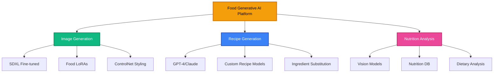
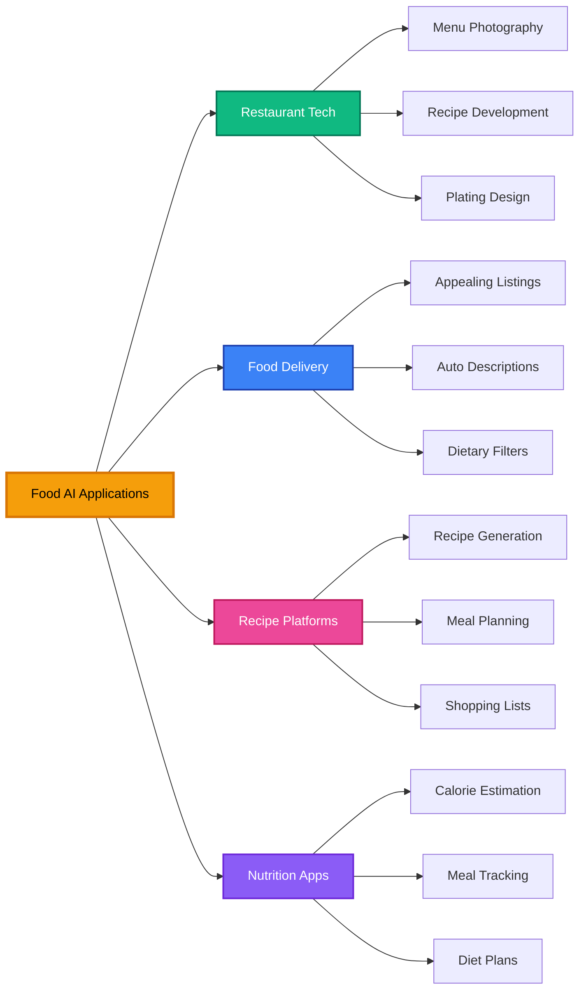

<div align="center">

<!-- Animated Typing SVG Header -->


<!-- Modern Shields -->
<p align="center">
  
  
  
  
</p>

<p align="center">
  
  
  
</p>

---

### 🍽️ AI-Powered Culinary Innovation
*Stable Diffusion + LLMs for Next-Gen Food Tech*

[](https://github.com)

</div>

---

## 📋 Table of Contents

- [🚀 Overview](#-overview)
- [🎨 Food Image Generation](#-food-image-generation)
- [🤖 Recipe Generation with LLMs](#-recipe-generation-with-llms)
- [🔬 Multimodal Food AI](#-multimodal-food-ai)
- [💻 Implementation](#-implementation)
- [🏭 Production Use Cases](#-production-use-cases)
- [🌐 Resources](#-resources)

---

## 🚀 Overview

### System Architecture



---

## 🎨 Food Image Generation

### SDXL Food Photography Model

```python
import torch
from diffusers import StableDiffusionXLPipeline, ControlNetModel
from PIL import Image

class FoodImageGenerator:
    def __init__(self):
        """
        Professional food photography generator
        """
        # Load SDXL with food fine-tune
        self.pipe = StableDiffusionXLPipeline.from_pretrained(
            "stabilityai/stable-diffusion-xl-base-1.0",
            torch_dtype=torch.float16,
            variant="fp16"
        )
        self.pipe.to("cuda")

        # Load food-specific LoRA
        self.pipe.load_lora_weights("food-photography-lora")

    def generate_food_image(
        self,
        dish_name: str,
        style: str = "professional",
        cuisine: str = "modern"
    ):
        """
        Generate appetizing food photography

        Styles: professional, rustic, modern, traditional
        Cuisines: italian, japanese, french, mexican, etc.
        """
        # Craft detailed prompt
        prompt = self._create_food_prompt(dish_name, style, cuisine)

        # Generate
        image = self.pipe(
            prompt=prompt,
            negative_prompt=self._negative_prompt(),
            num_inference_steps=30,
            guidance_scale=7.5,
            height=1024,
            width=1024
        ).images[0]

        return image

    def _create_food_prompt(self, dish, style, cuisine):
        """Create optimized food photography prompt"""
        style_prompts = {
            "professional": "professional food photography, studio lighting, shallow depth of field, 85mm lens, bokeh background",
            "rustic": "rustic food photography, natural lighting, wooden table, artisanal presentation",
            "modern": "modern minimalist plating, geometric composition, clean white plate",
            "traditional": "traditional home cooking, warm lighting, family-style serving"
        }

        base = f"{dish}, {cuisine} cuisine"
        style_desc = style_prompts.get(style, style_prompts["professional"])

        full_prompt = f"""
        {base}, {style_desc},
        fresh ingredients, vibrant colors, appetizing,
        high resolution, professional color grading,
        food styling, garnished, steam rising,
        8k ultra detailed, award-winning food photography
        """

        return full_prompt

    def _negative_prompt(self):
        return """
        blurry, low quality, distorted, unappetizing,
        burnt, raw, spoiled, messy, dirty plate,
        cartoon, illustration, bad lighting,
        overcooked, undercooked
        """

# Usage
generator = FoodImageGenerator()
image = generator.generate_food_image(
    "gourmet pasta carbonara with truffle shavings",
    style="professional",
    cuisine="italian"
)
image.save("carbonara_professional.png")
```

### ControlNet for Food Styling

```python
from diffusers import StableDiffusionXLControlNetPipeline, ControlNetModel

class FoodStylingPipeline:
    def __init__(self):
        """Control food presentation with reference images"""
        # Load ControlNets
        self.controlnet_depth = ControlNetModel.from_pretrained(
            "diffusers/controlnet-depth-sdxl-1.0",
            torch_dtype=torch.float16
        )

        self.controlnet_canny = ControlNetModel.from_pretrained(
            "diffusers/controlnet-canny-sdxl-1.0",
            torch_dtype=torch.float16
        )

        # Create pipeline
        self.pipe = StableDiffusionXLControlNetPipeline.from_pretrained(
            "stabilityai/stable-diffusion-xl-base-1.0",
            controlnet=[self.controlnet_depth, self.controlnet_canny],
            torch_dtype=torch.float16
        )
        self.pipe.to("cuda")

    def style_food_plate(
        self,
        reference_image_path: str,
        dish_description: str
    ):
        """
        Generate food image matching reference plating style
        """
        # Load and process reference image
        ref_image = Image.open(reference_image_path)

        # Extract depth and edges
        depth_map = self._extract_depth(ref_image)
        canny_map = self._extract_canny(ref_image)

        # Generate with dual control
        result = self.pipe(
            prompt=f"{dish_description}, professional plating, beautiful presentation",
            image=[depth_map, canny_map],
            controlnet_conditioning_scale=[0.5, 0.3],
            num_inference_steps=30
        ).images[0]

        return result

# Example: Match plating style
styler = FoodStylingPipeline()
styled_dish = styler.style_food_plate(
    "reference_plating.jpg",
    "grilled salmon with asparagus and lemon butter sauce"
)
```

---

## 🤖 Recipe Generation with LLMs

### GPT-4 Recipe Generator

```python
from openai import OpenAI
import json

class RecipeAI:
    def __init__(self, api_key):
        """AI-powered recipe generation"""
        self.client = OpenAI(api_key=api_key)

    def generate_recipe(
        self,
        ingredients: list,
        dietary_restrictions: list = None,
        cuisine_type: str = None,
        difficulty: str = "medium",
        servings: int = 4
    ):
        """
        Generate complete recipe from ingredients
        """
        prompt = f"""
        Create a detailed, professional recipe using these ingredients:
        {', '.join(ingredients)}

        Requirements:
        - Dietary restrictions: {dietary_restrictions or 'None'}
        - Cuisine: {cuisine_type or 'Any'}
        - Difficulty: {difficulty}
        - Servings: {servings}

        Provide:
        1. Recipe name
        2. Description
        3. Prep time and cook time
        4. Complete ingredient list with measurements
        5. Step-by-step instructions
        6. Cooking tips
        7. Nutritional information (estimated)
        8. Suggested variations
        9. Wine/drink pairing

        Format as JSON.
        """

        response = self.client.chat.completions.create(
            model="gpt-4-turbo",
            messages=[
                {"role": "system", "content": "You are a professional chef and recipe developer."},
                {"role": "user", "content": prompt}
            ],
            response_format={"type": "json_object"},
            temperature=0.7
        )

        recipe = json.loads(response.choices[0].message.content)
        return recipe

    def adapt_recipe(
        self,
        original_recipe: dict,
        constraints: dict
    ):
        """
        Adapt recipe for dietary needs/available ingredients
        """
        prompt = f"""
        Adapt this recipe:
        {json.dumps(original_recipe, indent=2)}

        Constraints:
        {json.dumps(constraints, indent=2)}

        Maintain flavor profile while adapting. Return adapted recipe as JSON.
        """

        response = self.client.chat.completions.create(
            model="gpt-4-turbo",
            messages=[
                {"role": "system", "content": "You are an expert in recipe adaptation and substitutions."},
                {"role": "user", "content": prompt}
            ],
            response_format={"type": "json_object"}
        )

        return json.loads(response.choices[0].message.content)

# Usage
recipe_ai = RecipeAI(api_key="your-api-key")

# Generate recipe
recipe = recipe_ai.generate_recipe(
    ingredients=["chicken breast", "tomatoes", "basil", "mozzarella", "pasta"],
    dietary_restrictions=["gluten-free"],
    cuisine_type="Italian",
    difficulty="easy",
    servings=4
)

print(json.dumps(recipe, indent=2))
```

### Claude for Culinary Creativity

```python
from anthropic import Anthropic

class CulinaryCreativeAI:
    def __init__(self, api_key):
        """Claude for creative recipe development"""
        self.client = Anthropic(api_key=api_key)

    def create_fusion_recipe(
        self,
        cuisine_a: str,
        cuisine_b: str,
        base_ingredient: str
    ):
        """
        Create innovative fusion recipes
        """
        prompt = f"""
        Create an innovative fusion recipe combining {cuisine_a} and {cuisine_b} cuisines,
        featuring {base_ingredient} as the star ingredient.

        Design a unique dish that:
        1. Respects both culinary traditions
        2. Creates harmonious flavor combinations
        3. Is feasible for home cooks
        4. Includes modern plating techniques

        Provide complete recipe with cultural context.
        """

        message = self.client.messages.create(
            model="claude-3-5-sonnet-20241022",
            max_tokens=2000,
            messages=[{
                "role": "user",
                "content": prompt
            }]
        )

        return message.content[0].text

# Example: Japanese-Mexican Fusion
creative_ai = CulinaryCreativeAI(api_key="your-api-key")
fusion_recipe = creative_ai.create_fusion_recipe(
    cuisine_a="Japanese",
    cuisine_b="Mexican",
    base_ingredient="salmon"
)
print(fusion_recipe)
```

---

## 🔬 Multimodal Food AI

### Complete Food Analysis Pipeline

```python
from transformers import BlipProcessor, BlipForConditionalGeneration
from transformers import CLIPProcessor, CLIPModel
import torch

class FoodAnalysisAI:
    def __init__(self):
        """
        Multimodal food understanding
        """
        # Image captioning
        self.blip_processor = BlipProcessor.from_pretrained(
            "Salesforce/blip-image-captioning-large"
        )
        self.blip_model = BlipForConditionalGeneration.from_pretrained(
            "Salesforce/blip-image-captioning-large"
        ).to("cuda")

        # Image understanding
        self.clip_processor = CLIPProcessor.from_pretrained(
            "openai/clip-vit-large-patch14"
        )
        self.clip_model = CLIPModel.from_pretrained(
            "openai/clip-vit-large-patch14"
        ).to("cuda")

    def analyze_food_image(self, image_path):
        """
        Complete food image analysis
        """
        image = Image.open(image_path)

        # Generate description
        description = self._generate_description(image)

        # Classify cuisine
        cuisine = self._classify_cuisine(image)

        # Identify ingredients
        ingredients = self._identify_ingredients(image)

        # Estimate calories (simplified)
        nutrition = self._estimate_nutrition(image, ingredients)

        return {
            "description": description,
            "cuisine": cuisine,
            "ingredients": ingredients,
            "nutrition": nutrition
        }

    def _generate_description(self, image):
        """Generate natural language description"""
        inputs = self.blip_processor(image, return_tensors="pt").to("cuda")
        out = self.blip_model.generate(**inputs, max_length=50)
        description = self.blip_processor.decode(out[0], skip_special_tokens=True)
        return description

    def _classify_cuisine(self, image):
        """Classify cuisine type using CLIP"""
        cuisines = [
            "Italian cuisine",
            "Japanese cuisine",
            "Mexican cuisine",
            "French cuisine",
            "Indian cuisine",
            "Chinese cuisine",
            "Thai cuisine",
            "American cuisine"
        ]

        inputs = self.clip_processor(
            text=cuisines,
            images=image,
            return_tensors="pt",
            padding=True
        ).to("cuda")

        outputs = self.clip_model(**inputs)
        probs = outputs.logits_per_image.softmax(dim=1)

        top_idx = probs.argmax().item()
        confidence = probs[0][top_idx].item()

        return {
            "cuisine": cuisines[top_idx].replace(" cuisine", ""),
            "confidence": float(confidence)
        }

# Usage
analyzer = FoodAnalysisAI()
analysis = analyzer.analyze_food_image("food_photo.jpg")
print(json.dumps(analysis, indent=2))
```

---

## 💻 Implementation

### End-to-End Food AI Platform

```python
class FoodAIPlatform:
    def __init__(self):
        """Complete food AI platform"""
        self.image_generator = FoodImageGenerator()
        self.recipe_generator = RecipeAI(api_key="your-key")
        self.analyzer = FoodAnalysisAI()

    def create_dish_concept(
        self,
        idea: str,
        generate_image: bool = True,
        generate_recipe: bool = True
    ):
        """
        Create complete dish concept from idea
        """
        result = {"idea": idea}

        # Generate recipe
        if generate_recipe:
            recipe = self.recipe_generator.generate_recipe(
                ingredients=self._extract_ingredients(idea),
                cuisine_type=self._detect_cuisine(idea)
            )
            result["recipe"] = recipe

        # Generate image
        if generate_image:
            image = self.image_generator.generate_food_image(
                dish_name=idea,
                style="professional"
            )
            result["image"] = image

        return result

    def reverse_engineer_dish(self, image_path):
        """
        Analyze food image and generate recipe
        """
        # Analyze image
        analysis = self.analyzer.analyze_food_image(image_path)

        # Generate recipe from analysis
        recipe = self.recipe_generator.generate_recipe(
            ingredients=analysis["ingredients"],
            cuisine_type=analysis["cuisine"]["cuisine"]
        )

        return {
            "analysis": analysis,
            "recipe": recipe
        }

# Complete workflow example
platform = FoodAIPlatform()

# Create new dish
dish = platform.create_dish_concept(
    idea="Spicy Korean-Italian fusion pasta with gochujang and pancetta"
)

# Or reverse engineer from photo
reconstructed = platform.reverse_engineer_dish("mystery_dish.jpg")
```

---

## 🏭 Production Use Cases

### Use Case Matrix



### FastAPI Production Service

```python
from fastapi import FastAPI, File, UploadFile
from pydantic import BaseModel

app = FastAPI(title="Food AI API")

platform = FoodAIPlatform()

class RecipeRequest(BaseModel):
    ingredients: list[str]
    dietary_restrictions: list[str] = []
    cuisine: str = None

@app.post("/generate-image")
async def generate_food_image(
    dish_name: str,
    style: str = "professional",
    cuisine: str = "modern"
):
    """Generate food image"""
    image = platform.image_generator.generate_food_image(
        dish_name, style, cuisine
    )

    # Convert to base64
    buffered = io.BytesIO()
    image.save(buffered, format="PNG")
    img_str = base64.b64encode(buffered.getvalue()).decode()

    return {"image": img_str}

@app.post("/generate-recipe")
async def generate_recipe(request: RecipeRequest):
    """Generate recipe from ingredients"""
    recipe = platform.recipe_generator.generate_recipe(
        ingredients=request.ingredients,
        dietary_restrictions=request.dietary_restrictions,
        cuisine_type=request.cuisine
    )
    return recipe

@app.post("/analyze-food")
async def analyze_food(file: UploadFile = File(...)):
    """Analyze uploaded food image"""
    # Save temp file
    temp_path = f"temp_{file.filename}"
    with open(temp_path, "wb") as f:
        f.write(await file.read())

    # Analyze
    analysis = platform.analyzer.analyze_food_image(temp_path)

    # Cleanup
    os.remove(temp_path)

    return analysis
```

---

## 🌐 Resources

### Official Resources

[](https://huggingface.co)
[](https://openai.com)
[](https://anthropic.com)

### Datasets

- **Food-101**: 101 food categories, 101K images
- **Recipe1M+**: 1M+ recipes with images
- **Nutrition5k**: Food with nutritional data
- **FoodKG**: Food knowledge graph

### Models

- **Food Classification**: EfficientNet, ResNet fine-tuned
- **Ingredient Detection**: Custom YOLO models
- **Food Segmentation**: Mask R-CNN variants

---

<div align="center">

## 🌟 Contributing

Help build the future of food tech!

[](CONTRIBUTING.md)

---

**Last Updated:** January 2025

*AI-Powered Culinary Innovation for Everyone*

</div>
