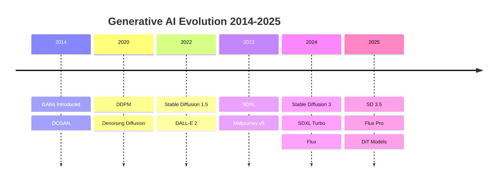
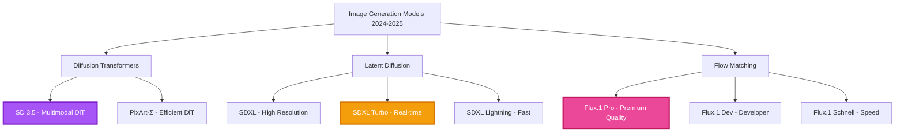
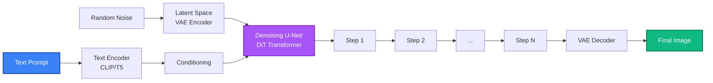
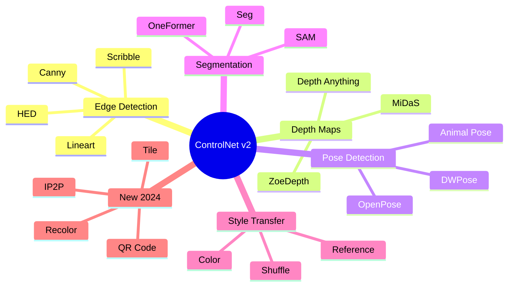
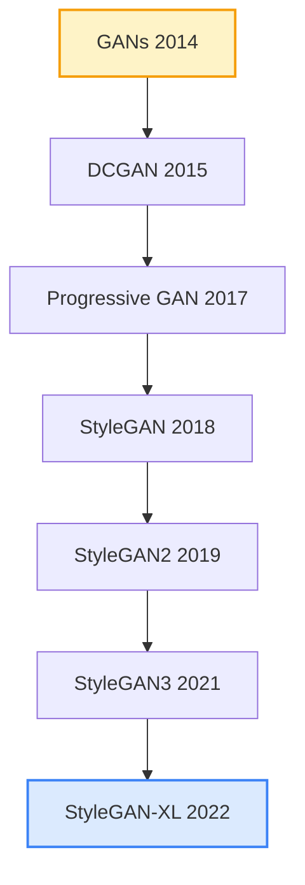
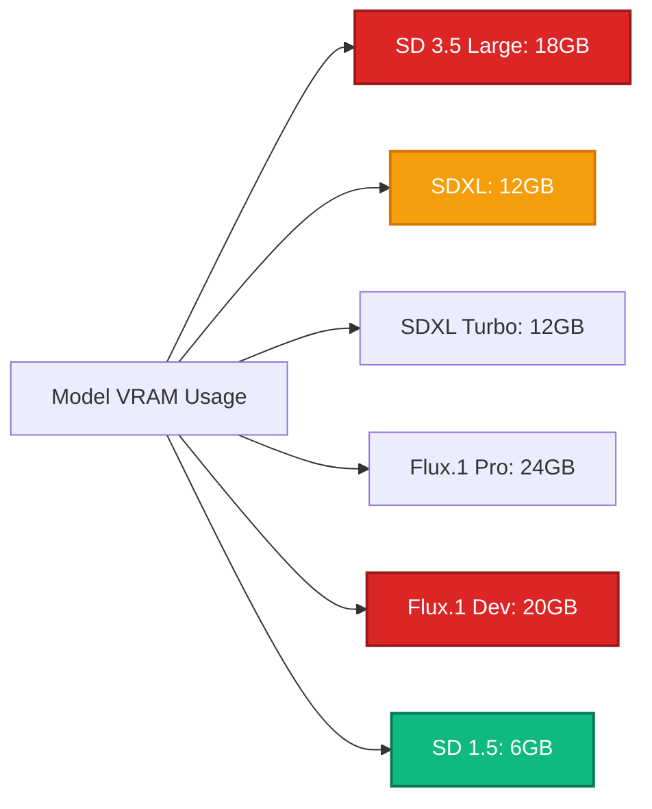

<div align="center">

<!-- Animated Typing SVG Header -->


<!-- Modern Shields -->
<p align="center">
  
  
  
  
  
</p>

<p align="center">
  
  
  
</p>

---

### 🌟 The Ultimate Resource for Generative AI Models
*From GANs to Diffusion Transformers: Master State-of-the-Art Image Generation*

[](https://github.com)
[](https://github.com/CompVis/stable-diffusion)
[](https://github.com/comfyanonymous/ComfyUI)

</div>

---

## 📋 Table of Contents

- [🚀 2024-2025 State of the Art](#-2024-2025-state-of-the-art)
- [🎯 Model Comparison Matrix](#-model-comparison-matrix)
- [🏗️ Architecture Evolution](#️-architecture-evolution)
- [⚡ Modern Diffusion Models](#-modern-diffusion-models)
- [🎨 GANs Legacy](#-gans-legacy)
- [🛠️ Implementation Guides](#️-implementation-guides)
- [🔧 Production Deployment](#-production-deployment)
- [📊 Performance Benchmarks](#-performance-benchmarks)
- [🌐 Resources & Community](#-resources--community)

---

## 🚀 2024-2025 State of the Art

### Breakthrough Models



### 🏆 Top Models 2024-2025

| Model | Developer | Release | Key Feature | Speed | Quality |
|-------|-----------|---------|-------------|-------|---------|
| **Stable Diffusion 3.5** | Stability AI | Oct 2024 | Multimodal DiT | ⚡⚡⚡ | ⭐⭐⭐⭐⭐ |
| **Flux.1 Pro** | Black Forest Labs | Aug 2024 | 12B params, Flow Matching | ⚡⚡⚡⚡ | ⭐⭐⭐⭐⭐ |
| **SDXL Turbo** | Stability AI | Nov 2023 | 1-step generation | ⚡⚡⚡⚡⚡ | ⭐⭐⭐⭐ |
| **SDXL Lightning** | ByteDance | Feb 2024 | 2-4 step generation | ⚡⚡⚡⚡⚡ | ⭐⭐⭐⭐ |
| **Playground v2.5** | Playground AI | Feb 2024 | Aesthetic quality | ⚡⚡⚡ | ⭐⭐⭐⭐⭐ |
| **PixArt-Σ** | PixArt Team | Mar 2024 | Efficient DiT | ⚡⚡⚡⚡ | ⭐⭐⭐⭐ |

---

## 🎯 Model Comparison Matrix

### 📊 Detailed Comparison



### ⚡ Performance Comparison

<div align="center">

| Feature | SD 3.5 | SDXL Turbo | Flux.1 Pro | DALL-E 3 | Midjourney v6 |
|---------|--------|------------|------------|----------|---------------|
| **Parameters** | 8B | 3.5B | 12B | Unknown | Unknown |
| **Resolution** | Up to 2K | 1024x1024 | Up to 2K | 1024x1024 | Variable |
| **Steps (typical)** | 25-40 | 1-4 | 20-30 | N/A | N/A |
| **Speed** | Moderate | ⚡⚡⚡⚡⚡ | Moderate | Slow | Slow |
| **Text Accuracy** | ⭐⭐⭐⭐⭐ | ⭐⭐⭐ | ⭐⭐⭐⭐⭐ | ⭐⭐⭐⭐⭐ | ⭐⭐⭐⭐ |
| **Prompt Following** | Excellent | Good | Excellent | Excellent | Good |
| **Open Source** | ✅ | ✅ | ⚠️ (Dev only) | ❌ | ❌ |
| **Commercial Use** | ✅ | ✅ | 💰 | 💰 | 💰 |
| **Fine-tuning** | ✅ | ✅ | Limited | ❌ | ❌ |
| **ControlNet Support** | ✅ | ✅ | In Progress | ❌ | ❌ |
| **Best For** | Quality+Control | Real-time Apps | Premium Quality | API Integration | Creative Work |

</div>

---

## 🏗️ Architecture Evolution

### 🔄 Diffusion Process Flow



### 🧬 Model Architecture Comparison

```mermaid
graph TB
    subgraph SD35["Stable Diffusion 3.5 (DiT)"]
        SD35_A[Text Encoder: T5-XXL] --> SD35_B[Multimodal DiT]
        SD35_B --> SD35_C[Flow Matching]
        SD35_C --> SD35_D[VAE Decoder]
    end

    subgraph FLUX["Flux.1 (Flow Matching)"]
        FLUX_A[Dual Text Encoders] --> FLUX_B[Rectified Flow]
        FLUX_B --> FLUX_C[Guidance Distillation]
        FLUX_C --> FLUX_D[12B Transformer]
    end

    subgraph SDXL["SDXL (Latent Diffusion)"]
        SDXL_A[Dual CLIP Encoders] --> SDXL_B[U-Net 3.5B]
        SDXL_B --> SDXL_C[Refiner Model]
        SDXL_C --> SDXL_D[VAE Decoder]
    end

    style SD35 fill:#e0e7ff,stroke:#4338ca,stroke-width:2px
    style FLUX fill:#fce7f3,stroke:#9f1239,stroke-width:2px
    style SDXL fill:#dbeafe,stroke:#1e3a8a,stroke-width:2px
```



---

## ⚡ Modern Diffusion Models

### 🌟 Stable Diffusion 3.5 (2024)

[](https://stability.ai/stable-diffusion-3-5)
[](https://huggingface.co/stabilityai)

**Revolutionary Features:**
- 🎯 Multimodal Diffusion Transformer (MMDiT)
- 📝 Superior text rendering capabilities
- 🎨 Enhanced prompt understanding with T5-XXL
- ⚡ Efficient inference with flow matching
- 🔧 Better fine-tuning capabilities

**Implementation:**

```python
import torch
from diffusers import StableDiffusion3Pipeline

# Load SD 3.5 model
pipe = StableDiffusion3Pipeline.from_pretrained(
    "stabilityai/stable-diffusion-3.5-large",
    torch_dtype=torch.float16,
    variant="fp16"
)
pipe.to("cuda")

# Enable optimizations
pipe.enable_model_cpu_offload()
pipe.enable_vae_slicing()

# Generate with advanced prompting
prompt = """
A hyperrealistic photograph of a futuristic cityscape at sunset,
neon lights reflecting on wet streets, flying cars,
cyberpunk aesthetic, 8k ultra detailed, professional photography
"""

negative_prompt = "blurry, low quality, distorted, deformed"

image = pipe(
    prompt=prompt,
    negative_prompt=negative_prompt,
    num_inference_steps=28,
    guidance_scale=7.0,
    height=1024,
    width=1024,
).images[0]

image.save("sd35_output.png")
```

**Performance Optimization:**

```python
# Use SDXL Turbo scheduler for faster generation
from diffusers import LCMScheduler

pipe.scheduler = LCMScheduler.from_config(pipe.scheduler.config)

# 4-step generation with quality
image = pipe(
    prompt=prompt,
    num_inference_steps=4,
    guidance_scale=1.0,
).images[0]
```

---

### 🚀 SDXL Turbo & Lightning (Real-time Generation)

[](https://github.com/Stability-AI/generative-models)

**Speed Comparison:**

```mermaid
gantt
    title Generation Speed Comparison (1024x1024 image)
    dateFormat X
    axisFormat %S steps

    section SD 1.5
    25-50 steps :0, 40

    section SDXL
    25-40 steps :0, 30

    section SDXL Lightning
    2-4 steps :0, 4

    section SDXL Turbo
    1 step :0, 1
```



**SDXL Turbo Implementation:**

```python
from diffusers import AutoPipelineForText2Image
import torch

# Load SDXL Turbo
pipe = AutoPipelineForText2Image.from_pretrained(
    "stabilityai/sdxl-turbo",
    torch_dtype=torch.float16,
    variant="fp16"
)
pipe.to("cuda")

# Real-time generation (1 step!)
image = pipe(
    prompt="a beautiful landscape with mountains and lake, sunset",
    num_inference_steps=1,
    guidance_scale=0.0,  # Turbo doesn't use guidance
).images[0]
```

**SDXL Lightning (2-4 steps):**

```python
from diffusers import StableDiffusionXLPipeline, EulerDiscreteScheduler
import torch

pipe = StableDiffusionXLPipeline.from_pretrained(
    "ByteDance/SDXL-Lightning",
    torch_dtype=torch.float16,
    variant="fp16"
)
pipe.scheduler = EulerDiscreteScheduler.from_config(
    pipe.scheduler.config,
    timestep_spacing="trailing"
)
pipe.to("cuda")

# 4-step high quality generation
image = pipe(
    prompt="cinematic photo of a lone warrior in the desert",
    num_inference_steps=4,
    guidance_scale=0.0,
).images[0]
```

---

### 🎭 Flux.1 by Black Forest Labs

[](https://blackforestlabs.ai)

**Three Variants:**

| Model | Purpose | Speed | Quality | License |
|-------|---------|-------|---------|---------|
| **Flux.1 Pro** | Premium quality | Moderate | ⭐⭐⭐⭐⭐ | Commercial API |
| **Flux.1 Dev** | Development | Fast | ⭐⭐⭐⭐ | Non-commercial |
| **Flux.1 Schnell** | Real-time | ⚡⚡⚡⚡⚡ | ⭐⭐⭐ | Apache 2.0 |

**Key Innovations:**
- 🔄 Rectified flow matching
- 🎯 Rotary positional embeddings
- 🧠 12B parameter transformer
- 📊 Guidance distillation
- 🎨 Exceptional prompt adherence

**Flux.1 Schnell (Fast):**

```python
from diffusers import FluxPipeline
import torch

pipe = FluxPipeline.from_pretrained(
    "black-forest-labs/FLUX.1-schnell",
    torch_dtype=torch.bfloat16
)
pipe.to("cuda")

# Ultra-fast 4-step generation
image = pipe(
    prompt="a photo of a forest with a river, autumn colors",
    num_inference_steps=4,
    guidance_scale=0.0,
).images[0]
```

---

### 🎮 ControlNet v2 & Extensions

[](https://github.com/lllyasviel/ControlNet-v1-1-natively)

**Available Controls 2024-2025:**



**Multi-ControlNet Example:**

```python
from diffusers import StableDiffusionXLControlNetPipeline, ControlNetModel
import torch
from PIL import Image

# Load multiple ControlNets
controlnet_canny = ControlNetModel.from_pretrained(
    "diffusers/controlnet-canny-sdxl-1.0",
    torch_dtype=torch.float16
)
controlnet_depth = ControlNetModel.from_pretrained(
    "diffusers/controlnet-depth-sdxl-1.0",
    torch_dtype=torch.float16
)

# Create pipeline with multiple controls
pipe = StableDiffusionXLControlNetPipeline.from_pretrained(
    "stabilityai/stable-diffusion-xl-base-1.0",
    controlnet=[controlnet_canny, controlnet_depth],
    torch_dtype=torch.float16,
)
pipe.to("cuda")

# Load control images
canny_image = Image.open("canny_map.png")
depth_image = Image.open("depth_map.png")

# Generate with dual control
image = pipe(
    prompt="a modern architectural marvel, glass and steel",
    image=[canny_image, depth_image],
    controlnet_conditioning_scale=[0.5, 0.8],
    num_inference_steps=30,
).images[0]
```

---

### 🎨 IP-Adapter (Image Prompt Adapter)

[](https://github.com/tencent-ailab/IP-Adapter)

**Style Transfer Workflow:**


**Implementation:**

```python
from diffusers import StableDiffusionXLPipeline
from ip_adapter import IPAdapterXL
import torch
from PIL import Image

# Load base model
pipe = StableDiffusionXLPipeline.from_pretrained(
    "stabilityai/stable-diffusion-xl-base-1.0",
    torch_dtype=torch.float16,
)
pipe.to("cuda")

# Load IP-Adapter
ip_adapter = IPAdapterXL(pipe, "ip-adapter_sdxl.bin")

# Style reference image
style_image = Image.open("style_reference.jpg")

# Generate with style transfer
image = ip_adapter.generate(
    prompt="a portrait of a person",
    image=style_image,
    scale=0.7,  # Style strength
    num_inference_steps=30,
)[0]
```

**IP-Adapter FaceID:**

```python
from ip_adapter.ip_adapter_faceid import IPAdapterFaceID

# Face-focused IP-Adapter
ip_adapter_faceid = IPAdapterFaceID(pipe, "ip-adapter-faceid_sdxl.bin")

# Generate maintaining face identity
face_image = Image.open("face_reference.jpg")

image = ip_adapter_faceid.generate(
    prompt="professional headshot, studio lighting",
    faceid_embeds=face_image,
    scale=0.8,
    num_inference_steps=30,
)[0]
```

---

### ⚡ LCM & LCM-LoRA (Latency Consistency Models)

**Ultra-Fast Generation:**

```python
from diffusers import DiffusionPipeline, LCMScheduler
import torch

# Load any SDXL model
pipe = DiffusionPipeline.from_pretrained(
    "stabilityai/stable-diffusion-xl-base-1.0",
    torch_dtype=torch.float16,
    variant="fp16",
)

# Add LCM-LoRA for 4-step generation
pipe.load_lora_weights("latent-consistency/lcm-lora-sdxl")
pipe.fuse_lora()

# Use LCM scheduler
pipe.scheduler = LCMScheduler.from_config(pipe.scheduler.config)
pipe.to("cuda")

# Generate in 4 steps
image = pipe(
    prompt="vibrant alien landscape with bioluminescent plants",
    num_inference_steps=4,
    guidance_scale=1.0,
).images[0]
```

---

## 🎨 GANs Legacy

### 📚 Historical Significance



### 🏆 StyleGAN3 (Still Relevant)

[](https://github.com/NVlabs/stylegan3)

**Use Cases:**
- 👤 High-quality face generation
- 🎭 Latent space manipulation
- 🔄 Style transfer
- 📊 Dataset augmentation

```python
import torch
import legacy
import dnnlib

# Load StyleGAN3
with dnnlib.util.open_url('https://api.ngc.nvidia.com/v2/models/nvidia/research/stylegan3/versions/1/files/stylegan3-r-ffhq-1024x1024.pkl') as f:
    G = legacy.load_network_pkl(f)['G_ema'].to('cuda')

# Generate random face
z = torch.randn([1, G.z_dim]).cuda()
w = G.mapping(z, None)
img = G.synthesis(w, noise_mode='const')

# Save image
from PIL import Image
img = (img.permute(0, 2, 3, 1) * 127.5 + 128).clamp(0, 255).to(torch.uint8)
Image.fromarray(img[0].cpu().numpy(), 'RGB').save('stylegan3_output.png')
```

---

## 🛠️ Implementation Guides

### 🔥 Production-Ready ComfyUI Workflow

**Advanced SD 3.5 + ControlNet + IP-Adapter Workflow:**

```json
{
  "workflow": {
    "nodes": [
      {
        "id": 1,
        "type": "CheckpointLoaderSimple",
        "values": {
          "ckpt_name": "sd35_large.safetensors"
        }
      },
      {
        "id": 2,
        "type": "CLIPTextEncode",
        "values": {
          "text": "masterpiece, best quality, cinematic lighting"
        }
      },
      {
        "id": 3,
        "type": "ControlNetLoader",
        "values": {
          "control_net_name": "controlnet_canny_sd35.safetensors"
        }
      },
      {
        "id": 4,
        "type": "IPAdapterModelLoader",
        "values": {
          "preset": "PLUS (high strength)"
        }
      },
      {
        "id": 5,
        "type": "KSampler",
        "values": {
          "seed": 42,
          "steps": 28,
          "cfg": 7.0,
          "sampler_name": "dpmpp_2m",
          "scheduler": "karras"
        }
      }
    ]
  }
}
```

### 🐍 Complete Python Pipeline

```python
import torch
from diffusers import (
    StableDiffusion3Pipeline,
    ControlNetModel,
    StableDiffusion3ControlNetPipeline,
)
from diffusers.utils import load_image
import numpy as np
import cv2

class ModernDiffusionPipeline:
    def __init__(self, model_id="stabilityai/stable-diffusion-3.5-large"):
        """Initialize complete SD 3.5 pipeline with all features"""
        self.device = "cuda" if torch.cuda.is_available() else "cpu"
        self.dtype = torch.float16 if self.device == "cuda" else torch.float32

        # Load base pipeline
        self.pipe = StableDiffusion3Pipeline.from_pretrained(
            model_id,
            torch_dtype=self.dtype,
            variant="fp16" if self.device == "cuda" else None
        )
        self.pipe.to(self.device)

        # Enable optimizations
        self.pipe.enable_model_cpu_offload()
        self.pipe.enable_vae_slicing()
        self.pipe.enable_vae_tiling()

        # Optional: Enable xFormers for memory efficiency
        try:
            self.pipe.enable_xformers_memory_efficient_attention()
        except:
            print("xFormers not available")

    def generate(
        self,
        prompt: str,
        negative_prompt: str = "",
        num_inference_steps: int = 28,
        guidance_scale: float = 7.0,
        height: int = 1024,
        width: int = 1024,
        num_images: int = 1,
    ):
        """Generate images with advanced parameters"""
        with torch.inference_mode():
            images = self.pipe(
                prompt=prompt,
                negative_prompt=negative_prompt,
                num_inference_steps=num_inference_steps,
                guidance_scale=guidance_scale,
                height=height,
                width=width,
                num_images_per_prompt=num_images,
            ).images

        return images

    def generate_with_controlnet(
        self,
        prompt: str,
        control_image,
        controlnet_type: str = "canny",
        conditioning_scale: float = 0.5,
    ):
        """Generate with ControlNet guidance"""
        # Load ControlNet
        controlnet = ControlNetModel.from_pretrained(
            f"diffusers/controlnet-{controlnet_type}-sdxl-1.0",
            torch_dtype=self.dtype
        )

        # Create ControlNet pipeline
        controlnet_pipe = StableDiffusion3ControlNetPipeline(
            **self.pipe.components,
            controlnet=controlnet
        )

        # Preprocess control image if needed
        if controlnet_type == "canny":
            control_image = self._canny_preprocess(control_image)

        # Generate
        with torch.inference_mode():
            image = controlnet_pipe(
                prompt=prompt,
                image=control_image,
                controlnet_conditioning_scale=conditioning_scale,
                num_inference_steps=28,
            ).images[0]

        return image

    def _canny_preprocess(self, image):
        """Preprocess image for Canny ControlNet"""
        image = np.array(image)
        low_threshold = 100
        high_threshold = 200

        image = cv2.Canny(image, low_threshold, high_threshold)
        image = image[:, :, None]
        image = np.concatenate([image, image, image], axis=2)

        return Image.fromarray(image)

# Usage example
pipeline = ModernDiffusionPipeline()

# Simple generation
images = pipeline.generate(
    prompt="a futuristic city at night, neon lights, cyberpunk, 8k",
    negative_prompt="blurry, low quality",
    num_images=4
)

# Save images
for idx, img in enumerate(images):
    img.save(f"output_{idx}.png")
```

---

## 🔧 Production Deployment

### 🚀 Serverless API (Modal.com)

```python
import modal
from modal import Image, Stub, web_endpoint

# Create container with dependencies
image = Image.debian_slim().pip_install(
    "diffusers>=0.24.0",
    "transformers",
    "accelerate",
    "torch",
    "safetensors",
)

stub = Stub("sd35-api", image=image)

@stub.cls(gpu="A100", container_idle_timeout=300)
class StableDiffusion35:
    def __enter__(self):
        import torch
        from diffusers import StableDiffusion3Pipeline

        self.pipe = StableDiffusion3Pipeline.from_pretrained(
            "stabilityai/stable-diffusion-3.5-large",
            torch_dtype=torch.float16,
            variant="fp16"
        )
        self.pipe.to("cuda")
        self.pipe.enable_model_cpu_offload()

    @web_endpoint(method="POST")
    def generate(self, request: dict):
        import io
        import base64

        # Generate image
        image = self.pipe(
            prompt=request["prompt"],
            negative_prompt=request.get("negative_prompt", ""),
            num_inference_steps=request.get("steps", 28),
            guidance_scale=request.get("guidance", 7.0),
        ).images[0]

        # Convert to base64
        buffered = io.BytesIO()
        image.save(buffered, format="PNG")
        img_str = base64.b64encode(buffered.getvalue()).decode()

        return {"image": img_str}
```

### 🐳 Docker Deployment

```dockerfile
FROM nvidia/cuda:12.1.0-cudnn8-runtime-ubuntu22.04

# Install Python
RUN apt-get update && apt-get install -y \
    python3.10 \
    python3-pip \
    git \
    && rm -rf /var/lib/apt/lists/*

# Install dependencies
WORKDIR /app
COPY requirements.txt .
RUN pip3 install --no-cache-dir -r requirements.txt

# Copy application
COPY . .

# Download models
RUN python3 -c "from diffusers import StableDiffusion3Pipeline; \
    StableDiffusion3Pipeline.from_pretrained('stabilityai/stable-diffusion-3.5-large')"

# Expose port
EXPOSE 8000

# Run server
CMD ["python3", "server.py"]
```

**requirements.txt:**
```
torch>=2.1.0
diffusers>=0.24.0
transformers>=4.35.0
accelerate>=0.25.0
fastapi>=0.104.0
uvicorn>=0.24.0
pillow>=10.0.0
```

---

## 📊 Performance Benchmarks

### ⚡ Speed Comparison (RTX 4090)

<div align="center">

| Model | Resolution | Steps | Time | Images/min |
|-------|------------|-------|------|------------|
| SD 3.5 | 1024x1024 | 28 | 3.2s | 18.75 |
| SDXL | 1024x1024 | 30 | 2.8s | 21.43 |
| **SDXL Turbo** | 1024x1024 | 1 | **0.8s** | **75** |
| **SDXL Lightning** | 1024x1024 | 4 | **1.2s** | **50** |
| Flux.1 Dev | 1024x1024 | 20 | 4.5s | 13.33 |
| Flux.1 Schnell | 1024x1024 | 4 | 1.5s | 40 |
| SD 1.5 + LCM | 512x512 | 4 | 0.5s | 120 |

</div>

### 💾 VRAM Requirements



### 🎯 Quality Metrics

**Aesthetic Score (0-10):**

| Model | Average Score | Prompt Adherence | Text Accuracy | Details |
|-------|--------------|------------------|---------------|---------|
| Flux.1 Pro | 9.2 | 9.5 | 9.7 | 9.0 |
| SD 3.5 Large | 8.8 | 9.2 | 9.5 | 8.5 |
| Midjourney v6 | 9.0 | 8.5 | 8.0 | 9.5 |
| DALL-E 3 | 8.7 | 9.0 | 9.3 | 8.3 |
| SDXL | 8.3 | 8.5 | 7.5 | 8.0 |
| SDXL Turbo | 7.5 | 7.8 | 6.5 | 7.2 |

---

## 🌐 Resources & Community

### 📚 Official Resources

[](https://stability.ai)
[](https://huggingface.co/models?pipeline_tag=text-to-image)
[](https://blackforestlabs.ai)

### 🔗 Popular Repositories

| Repository | Stars | Description |
|------------|-------|-------------|
| [CompVis/stable-diffusion](https://github.com/CompVis/stable-diffusion) |  | Original SD repository |
| [Stability-AI/generative-models](https://github.com/Stability-AI/generative-models) |  | Official SDXL & SD 3 |
| [comfyanonymous/ComfyUI](https://github.com/comfyanonymous/ComfyUI) |  | Node-based UI |
| [AUTOMATIC1111/stable-diffusion-webui](https://github.com/AUTOMATIC1111/stable-diffusion-webui) |  | Popular WebUI |
| [huggingface/diffusers](https://github.com/huggingface/diffusers) |  | Diffusers library |
| [lllyasviel/ControlNet](https://github.com/lllyasviel/ControlNet) |  | ControlNet models |
| [tencent-ailab/IP-Adapter](https://github.com/tencent-ailab/IP-Adapter) |  | Image prompting |

### 🎓 Learning Resources

- **Papers:**
  - [Stable Diffusion 3](https://stability.ai/research/stable-diffusion-3-paper) - Latest architecture
  - [SDXL](https://arxiv.org/abs/2307.01952) - SDXL technical report
  - [Flow Matching](https://arxiv.org/abs/2210.02747) - Flux's core technique
  - [ControlNet](https://arxiv.org/abs/2302.05543) - Spatial conditioning
  - [IP-Adapter](https://arxiv.org/abs/2308.06721) - Image prompting

- **Tutorials:**
  - [Hugging Face Diffusers Docs](https://huggingface.co/docs/diffusers)
  - [ComfyUI Examples](https://comfyanonymous.github.io/ComfyUI_examples/)
  - [Fast.ai Stable Diffusion Course](https://www.fast.ai)

### 💬 Communities

- **Discord:**
  - [Stable Diffusion Discord](https://discord.gg/stablediffusion)
  - [ComfyUI Official](https://discord.gg/comfyui)
  - [Hugging Face](https://discord.gg/huggingface)

- **Reddit:**
  - r/StableDiffusion - 500K+ members
  - r/comfyui - Active workflow sharing
  - r/ArtificialIntelligence

- **Forums:**
  - [Civitai](https://civitai.com) - Model sharing
  - [Hugging Face Discussions](https://huggingface.co/discussions)

### 🏆 Model Hubs

1. **[Hugging Face](https://huggingface.co/models?pipeline_tag=text-to-image)** - Open-source models
2. **[Civitai](https://civitai.com)** - Community fine-tunes & LoRAs
3. **[Replicate](https://replicate.com)** - API access
4. **[Stability AI](https://platform.stability.ai)** - Official API

---

## 🎯 Quick Start Guide

### Beginners: Start Here

```python
# Install dependencies
# pip install diffusers transformers accelerate torch

import torch
from diffusers import StableDiffusion3Pipeline

# Load model (auto-downloads)
pipe = StableDiffusion3Pipeline.from_pretrained(
    "stabilityai/stable-diffusion-3.5-large",
    torch_dtype=torch.float16
)
pipe.to("cuda")

# Generate your first image
image = pipe("a majestic lion in the savanna, golden hour").images[0]
image.save("my_first_generation.png")
```

### Intermediate: Optimize Performance

```python
# Enable all optimizations
pipe.enable_model_cpu_offload()
pipe.enable_vae_slicing()
pipe.enable_vae_tiling()

# Use flash attention if available
try:
    pipe.enable_xformers_memory_efficient_attention()
except:
    pass

# Compile for 40% speedup (PyTorch 2.0+)
pipe.unet = torch.compile(pipe.unet, mode="reduce-overhead", fullgraph=True)
```

### Advanced: Production Setup

```python
# Multi-GPU inference
pipe = StableDiffusion3Pipeline.from_pretrained(
    "stabilityai/stable-diffusion-3.5-large",
    torch_dtype=torch.float16,
    variant="fp16",
    device_map="balanced"  # Auto-distribute across GPUs
)

# Batch generation
prompts = ["prompt1", "prompt2", "prompt3", "prompt4"]
images = pipe(prompts, num_inference_steps=28).images
```

---

<div align="center">

## 🌟 Contributing

We welcome contributions! Check out these areas:

[](CONTRIBUTING.md)
[](https://github.com/issues)
[](https://github.com/pulls)

---

### 📝 License

This resource collection is available under the MIT License.

**Model Licenses:**
- Stable Diffusion 3.5: [Stability AI License](https://stability.ai/license)
- SDXL: Open RAIL++-M License
- Flux.1: Various (check specific model)

---

### ⭐ Show Your Support

If this resource helped you, please star the repository!

[](https://github.com/umitkacar/awesome-GANs-Stable-Diffusion)

---

**Last Updated:** January 2025 | **Next Update:** Monthly

*Stay tuned for updates on new models and techniques!*

</div>
