<div align="center">

<!-- Animated Header -->


<p align="center">
  <a href="#-overview"><kbd>Overview</kbd></a>
  <a href="#-architectures"><kbd>Architectures</kbd></a>
  <a href="#-frameworks"><kbd>Frameworks</kbd></a>
  <a href="#-applications"><kbd>Applications</kbd></a>
  <a href="#-production"><kbd>Production</kbd></a>
</p>

[](https://pytorch-geometric.readthedocs.io/)
[](https://www.dgl.ai/)
[](LICENSE)
[](.)

</div>

---

## 🌟 Overview

**Graph Neural Networks (GNNs)** extend deep learning to graph-structured data, revolutionizing machine learning on non-Euclidean domains. From social networks to molecular discovery, GNNs are reshaping AI in 2024-2025.

### Why GNNs Matter in 2025


| Domain | Applications | 2024-2025 Impact |
|--------|-------------|------------------|
| 🧬 **Drug Discovery** | Molecular property prediction | 40% faster drug development |
| 🌐 **Social Networks** | Recommendation, influence analysis | 3B+ users affected |
| 🧠 **Knowledge Graphs** | Question answering, reasoning | GPT-scale integration |
| 🚗 **Transportation** | Traffic prediction, routing | Autonomous vehicle AI |
| 💰 **Finance** | Fraud detection, risk analysis | $10B+ annual savings |

### Key Concepts

```python
# Graph Structure
G = {
    'nodes': ['A', 'B', 'C', 'D'],           # Entities
    'edges': [(A,B), (B,C), (C,D), (D,A)],   # Relationships
    'node_features': tensor([...]),           # Attributes
    'edge_features': tensor([...])            # Edge attributes
}

# Message Passing Framework
def message_passing(G):
    for layer in range(L):
        messages = aggregate_neighbors(G)    # Collect info
        node_features = update(messages)     # Transform
    return predictions(node_features)
```

---

## 🏗️ Architectures

### Architecture Evolution 2020-2025


### 1️⃣ Graph Convolutional Networks (GCN)

**[Paper: Kipf & Welling, ICLR 2017](https://arxiv.org/abs/1609.02907)** • Spectral Convolution Approach

```python
import torch
import torch.nn.functional as F
from torch_geometric.nn import GCNConv, BatchNorm

class ModernGCN(torch.nn.Module):
    """GCN with 2024 best practices"""
    def __init__(self, num_features, hidden_dim, num_classes,
                 num_layers=3, dropout=0.5):
        super().__init__()

        # Input layer
        self.conv1 = GCNConv(num_features, hidden_dim)
        self.bn1 = BatchNorm(hidden_dim)

        # Hidden layers
        self.convs = torch.nn.ModuleList([
            GCNConv(hidden_dim, hidden_dim)
            for _ in range(num_layers - 2)
        ])
        self.bns = torch.nn.ModuleList([
            BatchNorm(hidden_dim)
            for _ in range(num_layers - 2)
        ])

        # Output layer
        self.conv_out = GCNConv(hidden_dim, num_classes)
        self.dropout = dropout

    def forward(self, x, edge_index, edge_weight=None):
        # Layer 1
        x = self.conv1(x, edge_index, edge_weight)
        x = self.bn1(x)
        x = F.relu(x)
        x = F.dropout(x, p=self.dropout, training=self.training)

        # Hidden layers
        for conv, bn in zip(self.convs, self.bns):
            x = conv(x, edge_index, edge_weight)
            x = bn(x)
            x = F.relu(x)
            x = F.dropout(x, p=self.dropout, training=self.training)

        # Output
        x = self.conv_out(x, edge_index, edge_weight)
        return F.log_softmax(x, dim=1)

# Usage with PyTorch Geometric 2.5+
from torch_geometric.datasets import Planetoid
from torch_geometric.loader import NeighborLoader

dataset = Planetoid(root='/tmp/Cora', name='Cora')
data = dataset[0]

model = ModernGCN(
    num_features=dataset.num_features,
    hidden_dim=256,
    num_classes=dataset.num_classes,
    num_layers=4
).to('cuda')

optimizer = torch.optim.AdamW(model.parameters(), lr=0.01, weight_decay=5e-4)
```

**🎯 Best Use Cases:**
- Citation networks
- Social network analysis
- Semi-supervised node classification
- Small to medium graphs (<100K nodes)

---

### 2️⃣ GraphSAGE

**[Paper: Hamilton et al., NeurIPS 2017](https://arxiv.org/abs/1706.02216)** • Inductive Learning via Sampling

```python
from torch_geometric.nn import SAGEConv

class GraphSAGE(torch.nn.Module):
    """Production-ready GraphSAGE for large graphs"""
    def __init__(self, in_channels, hidden_channels, out_channels,
                 num_layers=2, aggr='mean'):
        super().__init__()

        self.convs = torch.nn.ModuleList()
        self.convs.append(SAGEConv(in_channels, hidden_channels, aggr=aggr))

        for _ in range(num_layers - 2):
            self.convs.append(SAGEConv(hidden_channels, hidden_channels, aggr=aggr))

        self.convs.append(SAGEConv(hidden_channels, out_channels, aggr=aggr))

    def forward(self, x, edge_index):
        for i, conv in enumerate(self.convs[:-1]):
            x = conv(x, edge_index)
            x = F.relu(x)
            x = F.dropout(x, p=0.5, training=self.training)
        x = self.convs[-1](x, edge_index)
        return x

# Scalable training with neighbor sampling
from torch_geometric.loader import NeighborLoader

train_loader = NeighborLoader(
    data,
    num_neighbors=[25, 10],  # Sample 25 neighbors in layer 1, 10 in layer 2
    batch_size=1024,
    input_nodes=data.train_mask,
    shuffle=True,
    num_workers=4
)

# Mini-batch training for billion-scale graphs
for batch in train_loader:
    optimizer.zero_grad()
    out = model(batch.x, batch.edge_index)
    loss = F.cross_entropy(out[:batch.batch_size], batch.y[:batch.batch_size])
    loss.backward()
    optimizer.step()
```

**🚀 Scalability Metrics (2024):**
- ✅ Graphs with 100M+ nodes
- ✅ Production deployment at Pinterest, Twitter
- ✅ Inductive learning (unseen nodes at test time)
- ✅ 10x faster than full-batch GCN

---

### 3️⃣ Graph Attention Networks (GAT)

**[Paper: Veličković et al., ICLR 2018](https://arxiv.org/abs/1710.10903)** • Attention Mechanism for Graphs

```python
from torch_geometric.nn import GATv2Conv  # GATv2: improved version (2021)

class ModernGAT(torch.nn.Module):
    """GAT with multi-head attention and edge features"""
    def __init__(self, in_channels, hidden_channels, out_channels,
                 heads=8, edge_dim=None):
        super().__init__()

        self.conv1 = GATv2Conv(
            in_channels,
            hidden_channels,
            heads=heads,
            dropout=0.6,
            edge_dim=edge_dim,
            concat=True
        )

        self.conv2 = GATv2Conv(
            hidden_channels * heads,
            out_channels,
            heads=1,
            dropout=0.6,
            edge_dim=edge_dim,
            concat=False
        )

    def forward(self, x, edge_index, edge_attr=None, return_attention=False):
        # First layer with multi-head attention
        x, attn1 = self.conv1(x, edge_index, edge_attr, return_attention_weights=True)
        x = F.elu(x)
        x = F.dropout(x, p=0.6, training=self.training)

        # Second layer
        x, attn2 = self.conv2(x, edge_index, edge_attr, return_attention_weights=True)

        if return_attention:
            return F.log_softmax(x, dim=1), (attn1, attn2)
        return F.log_softmax(x, dim=1)

# Visualize attention weights (interpretability)
model = ModernGAT(dataset.num_features, 128, dataset.num_classes)
out, (attn_edge_index, attn_weights) = model(
    data.x, data.edge_index, return_attention=True
)

# Extract important edges
top_k = 100
_, top_indices = torch.topk(attn_weights.flatten(), k=top_k)
important_edges = attn_edge_index[:, top_indices]
```

**🎨 Visualization Example:**

```mermaid
graph TD
    A[Node A] -->|α=0.8| B[Node B]
    A -->|α=0.2| C[Node C]
    B -->|α=0.6| D[Node D]
    C -->|α=0.9| D

    style A fill:#667eea,stroke:#333,stroke-width:4px
    style B fill:#764ba2
    style C fill:#f093fb
    style D fill:#4facfe
```



---

### 4️⃣ Graph Transformers (2024 SOTA)

**[GPS: Graph Positional and Structural Encoding](https://arxiv.org/abs/2205.12454)** • Transformer Architecture for Graphs

```python
from torch_geometric.nn import GPSConv, GINEConv
from torch_geometric.nn.attention import PerformerAttention

class GraphGPS(torch.nn.Module):
    """Graph GPS: Transformer + GNN hybrid (SOTA 2024)"""
    def __init__(self, channels, num_layers, heads=8):
        super().__init__()

        self.node_emb = torch.nn.Linear(dataset.num_features, channels)
        self.pe_encoder = torch.nn.Linear(20, channels)  # Positional encoding

        self.convs = torch.nn.ModuleList()
        for _ in range(num_layers):
            conv = GPSConv(
                channels,
                GINEConv(torch.nn.Sequential(
                    torch.nn.Linear(channels, channels),
                    torch.nn.ReLU(),
                    torch.nn.Linear(channels, channels)
                )),
                heads=heads,
                attn_type='performer',  # Efficient attention
                attn_kwargs={'kernel': 'relu'}
            )
            self.convs.append(conv)

        self.lin = torch.nn.Linear(channels, dataset.num_classes)

    def forward(self, x, edge_index, edge_attr, pe, batch):
        # Embed nodes and positional encoding
        x = self.node_emb(x) + self.pe_encoder(pe)

        # GPS layers
        for conv in self.convs:
            x = conv(x, edge_index, batch, edge_attr=edge_attr)

        return self.lin(x)

# Generate positional encodings (Laplacian eigenvectors)
from torch_geometric.transforms import AddLaplacianEigenvectorPE

transform = AddLaplacianEigenvectorPE(k=20)
data = transform(data)
```

**📊 Performance Comparison (OGB Benchmarks 2024):**

| Architecture | ogbn-arxiv | ogbg-molhiv | Training Time | Parameters |
|-------------|-----------|-------------|---------------|-----------|
| GCN | 71.2% | 76.8% | 1x | 0.5M |
| GAT | 72.5% | 78.3% | 2x | 1.2M |
| GraphSAGE | 73.1% | 77.9% | 1.5x | 0.8M |
| **GPS (2024)** | **76.9%** | **82.1%** | 3x | 2.5M |

---

## 🛠️ Frameworks

### Framework Comparison 2024-2025

| Framework | Version | Best For | Pros | Cons |
|-----------|---------|----------|------|------|
| **PyTorch Geometric** | 2.5+ | Research & Production | 🟢 60+ layers<br>🟢 Excellent docs<br>🟢 Active community | 🔴 Learning curve |
| **DGL** | 2.0+ | Large-scale graphs | 🟢 Multi-backend<br>🟢 Distributed training<br>🟢 Industry proven | 🔴 Less layers |
| **GraphGym** | 2.0 | Experiment management | 🟢 Modular design<br>🟢 Auto-tuning | 🔴 Less flexible |
| **Spektral** | 1.4 | TensorFlow users | 🟢 Keras integration<br>🟢 Easy to learn | 🔴 Smaller community |

### PyTorch Geometric 2.5+ (Recommended)

```bash
# Installation (2024)
pip install torch==2.2.0 torch-geometric==2.5.0

# With CUDA acceleration
pip install torch==2.2.0+cu121 -f https://download.pytorch.org/whl/torch_stable.html
pip install torch-geometric==2.5.0
pip install pyg-lib torch-scatter torch-sparse -f https://data.pyg.org/whl/torch-2.2.0+cu121.html
```

**New Features in PyG 2.5:**
- ⚡ Compilation support via `torch.compile()`
- 🚀 50% faster message passing with `pyg-lib`
- 🔥 Heterogeneous graph support
- 📊 Built-in benchmarking suite
- 🎯 One-line model compilation

```python
# Compile model for 2x speedup (PyG 2.5+)
import torch._dynamo
torch._dynamo.config.suppress_errors = True

model = ModernGCN(...)
model = torch.compile(model, mode='reduce-overhead')

# Heterogeneous graphs (different node/edge types)
from torch_geometric.data import HeteroData

data = HeteroData()
data['user'].x = ...      # User node features
data['item'].x = ...      # Item node features
data['user', 'buys', 'item'].edge_index = ...  # User-item edges
data['item', 'similar', 'item'].edge_index = ...  # Item-item edges
```

### DGL 2.0+ (Scalability Champion)

```python
import dgl
import dgl.nn as dglnn

class DGLGraphSAGE(torch.nn.Module):
    def __init__(self, in_feats, hidden_size, num_classes):
        super().__init__()
        self.conv1 = dglnn.SAGEConv(in_feats, hidden_size, 'mean')
        self.conv2 = dglnn.SAGEConv(hidden_size, num_classes, 'mean')

    def forward(self, g, features):
        h = F.relu(self.conv1(g, features))
        h = self.conv2(g, h)
        return h

# Distributed training on multiple GPUs
import dgl.multiprocessing as mp

def train_on_gpu(rank, world_size):
    dgl.distributed.initialize(rank, world_size)
    model = DGLGraphSAGE(...).to(f'cuda:{rank}')
    # ... training loop ...

if __name__ == '__main__':
    mp.spawn(train_on_gpu, args=(4,), nprocs=4)  # 4 GPUs
```

**🌐 DGL Production Use Cases:**
- Amazon product recommendations (1B+ nodes)
- Alibaba fraud detection
- Pinterest PinSage (3B+ pins)

---

## 🎯 Applications

### 1. Molecular Property Prediction

```python
from torch_geometric.datasets import QM9
from torch_geometric.nn import NNConv, global_add_pool

class MolecularGNN(torch.nn.Module):
    """Predict quantum properties of molecules"""
    def __init__(self, num_features, edge_dim, hidden_dim=128):
        super().__init__()

        # Edge network for bond features
        nn = torch.nn.Sequential(
            torch.nn.Linear(edge_dim, 128),
            torch.nn.ReLU(),
            torch.nn.Linear(128, hidden_dim * hidden_dim)
        )

        self.conv1 = NNConv(num_features, hidden_dim, nn, aggr='mean')
        self.conv2 = NNConv(hidden_dim, hidden_dim, nn, aggr='mean')
        self.conv3 = NNConv(hidden_dim, hidden_dim, nn, aggr='mean')

        # Graph-level readout
        self.fc1 = torch.nn.Linear(hidden_dim, 64)
        self.fc2 = torch.nn.Linear(64, 1)  # Predict single property

    def forward(self, data):
        x, edge_index, edge_attr, batch = data.x, data.edge_index, data.edge_attr, data.batch

        # Message passing on molecular graph
        x = F.relu(self.conv1(x, edge_index, edge_attr))
        x = F.relu(self.conv2(x, edge_index, edge_attr))
        x = F.relu(self.conv3(x, edge_index, edge_attr))

        # Pool to graph-level representation
        x = global_add_pool(x, batch)

        # Predict property
        x = F.relu(self.fc1(x))
        x = self.fc2(x)
        return x

# Load QM9 dataset (134k molecules)
dataset = QM9(root='/tmp/QM9')
loader = DataLoader(dataset, batch_size=32, shuffle=True)

# Train to predict HOMO-LUMO gap
model = MolecularGNN(num_features=11, edge_dim=4)
```

**🧪 2024 Impact:**
- **Drug Discovery**: 40% reduction in discovery time
- **Materials Science**: Novel catalyst design
- **Quantum Chemistry**: DFT-level accuracy at 1000x speed

### 2. Recommendation Systems

```python
from torch_geometric.nn import LightGCN

class RecommenderGNN(torch.nn.Module):
    """LightGCN for user-item recommendations"""
    def __init__(self, num_users, num_items, embedding_dim=64, num_layers=3):
        super().__init__()

        self.num_users = num_users
        self.num_items = num_items

        # Embedding tables
        self.user_emb = torch.nn.Embedding(num_users, embedding_dim)
        self.item_emb = torch.nn.Embedding(num_items, embedding_dim)

        # LightGCN layers (no trainable weights!)
        self.convs = torch.nn.ModuleList([
            LightGCN() for _ in range(num_layers)
        ])

        self.init_weights()

    def init_weights(self):
        torch.nn.init.normal_(self.user_emb.weight, std=0.1)
        torch.nn.init.normal_(self.item_emb.weight, std=0.1)

    def forward(self, edge_index):
        # Concatenate user and item embeddings
        x = torch.cat([self.user_emb.weight, self.item_emb.weight])

        # Multi-scale embeddings
        out = x
        for conv in self.convs:
            out = conv(out, edge_index)

        # Split back to users and items
        users, items = torch.split(out, [self.num_users, self.num_items])
        return users, items

    def predict(self, users, items):
        user_emb, item_emb = self.forward(edge_index)
        # Dot product for rating prediction
        return (user_emb[users] * item_emb[items]).sum(dim=-1)

# BPR loss for implicit feedback
def bpr_loss(pos_scores, neg_scores):
    return -torch.log(torch.sigmoid(pos_scores - neg_scores)).mean()
```

### 3. Knowledge Graph Reasoning

```python
from torch_geometric.nn import RGCNConv  # Relational GCN

class KnowledgeGraphGNN(torch.nn.Module):
    """Multi-relational reasoning on knowledge graphs"""
    def __init__(self, num_entities, num_relations, hidden_dim=128):
        super().__init__()

        self.entity_emb = torch.nn.Embedding(num_entities, hidden_dim)

        # Relational GCN (different weights per relation type)
        self.conv1 = RGCNConv(hidden_dim, hidden_dim, num_relations)
        self.conv2 = RGCNConv(hidden_dim, hidden_dim, num_relations)

    def forward(self, edge_index, edge_type):
        x = self.entity_emb.weight
        x = F.relu(self.conv1(x, edge_index, edge_type))
        x = self.conv2(x, edge_index, edge_type)
        return x

    def score_triple(self, head, relation, tail):
        """Score (head, relation, tail) triple"""
        x = self.forward(edge_index, edge_type)
        score = (x[head] * self.relation_emb(relation) * x[tail]).sum(dim=-1)
        return score

# Link prediction on Freebase/Wikidata
from ogb.linkproppred import PygLinkPropPredDataset

dataset = PygLinkPropPredDataset(name='ogbl-wikikg2')
model = KnowledgeGraphGNN(
    num_entities=dataset[0].num_nodes,
    num_relations=dataset[0].num_edge_types
)
```

---

## 🚀 Production Deployment

### Model Serving with TorchServe

```python
# model_handler.py
import torch
from ts.torch_handler.base_handler import BaseHandler

class GNNHandler(BaseHandler):
    def initialize(self, context):
        self.manifest = context.manifest
        properties = context.system_properties
        model_dir = properties.get("model_dir")

        # Load model
        self.model = torch.jit.load(f"{model_dir}/model.pt")
        self.model.eval()

    def preprocess(self, data):
        # Convert JSON to PyG Data object
        edge_index = torch.tensor(data[0]['edge_index'])
        x = torch.tensor(data[0]['node_features'])
        return {'x': x, 'edge_index': edge_index}

    def inference(self, data):
        with torch.no_grad():
            predictions = self.model(data['x'], data['edge_index'])
        return predictions

    def postprocess(self, inference_output):
        return inference_output.tolist()

# Export model
scripted_model = torch.jit.script(model)
torch.jit.save(scripted_model, "model.pt")

# Create MAR file
torch-model-archiver --model-name gnn_model \
    --version 1.0 \
    --model-file model.pt \
    --handler model_handler.py \
    --export-path model_store

# Serve
torchserve --start --model-store model_store --models gnn_model=gnn_model.mar
```

### Inference Optimization

```python
# ONNX export for cross-platform deployment
import torch.onnx

dummy_x = torch.randn(100, num_features)
dummy_edge_index = torch.randint(0, 100, (2, 500))

torch.onnx.export(
    model,
    (dummy_x, dummy_edge_index),
    "gnn_model.onnx",
    export_params=True,
    opset_version=14,
    input_names=['node_features', 'edge_index'],
    output_names=['predictions'],
    dynamic_axes={
        'node_features': {0: 'num_nodes'},
        'edge_index': {1: 'num_edges'}
    }
)

# ONNX Runtime inference (3-5x faster)
import onnxruntime as ort

session = ort.InferenceSession("gnn_model.onnx")
outputs = session.run(None, {
    'node_features': x.numpy(),
    'edge_index': edge_index.numpy()
})
```

---

## 📚 Resources & Community

### 2024-2025 Research Trends

- 🔥 **Foundation Models for Graphs**: Pre-trained GNNs (GraphGPT, GraphMAE)
- 🌐 **Multi-modal Graph Learning**: Text + Graph (LLM + GNN)
- ⚡ **Efficient Graph Transformers**: Linear complexity attention
- 🔐 **Federated Graph Learning**: Privacy-preserving GNNs
- 🧠 **Neural Architecture Search**: AutoGNN

### Courses & Tutorials

| Resource | Level | Duration | Link |
|----------|-------|----------|------|
| **CS224W** (Stanford) | Intermediate | 10 weeks | [web.stanford.edu/class/cs224w](http://web.stanford.edu/class/cs224w/) |
| **Geometric Deep Learning** | Advanced | Self-paced | [geometricdeeplearning.com](https://geometricdeeplearning.com/) |
| **PyG Tutorials** | Beginner | 2-3 hours | [PyG Colabs](https://pytorch-geometric.readthedocs.io/en/latest/notes/colabs.html) |

### Key Papers (2024-2025)

```bibtex
@inproceedings{gps2024,
  title={Recipe for a General, Powerful, Scalable Graph Transformer},
  author={Rampášek et al.},
  booktitle={NeurIPS},
  year={2024}
}

@article{graphgpt2024,
  title={GraphGPT: Graph Learning with Pre-trained Language Models},
  author={Tang et al.},
  journal={arXiv:2401.00529},
  year={2024}
}
```

---

<div align="center">

### 🌟 State-of-the-Art Benchmarks (Jan 2025)

| Dataset | Task | SOTA Model | Accuracy | Year |
|---------|------|-----------|----------|------|
| ogbn-arxiv | Node Classification | **GraphGPS + LLM** | 77.8% | 2024 |
| ogbg-molhiv | Graph Classification | **GPS-Mega** | 82.5% | 2024 |
| ogbl-citation2 | Link Prediction | **NBFNet** | 89.2% | 2024 |


**Last Updated:** January 2025 • **Maintainer:** Graph ML Community
[](.)
[](.)

</div>
