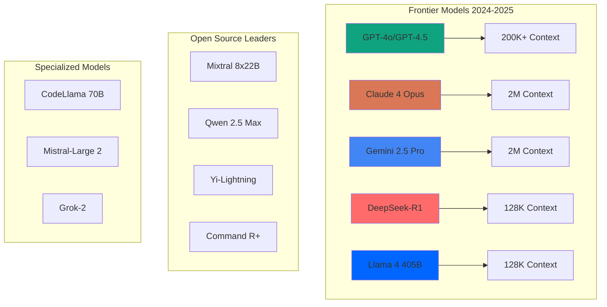
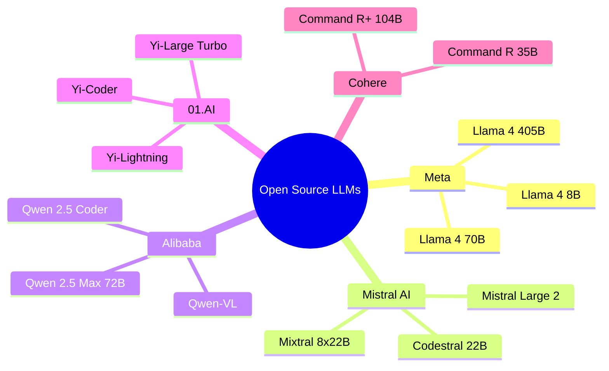
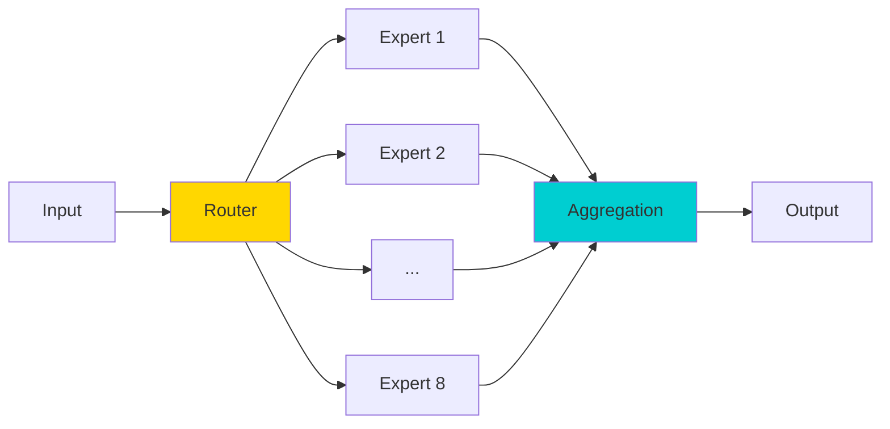
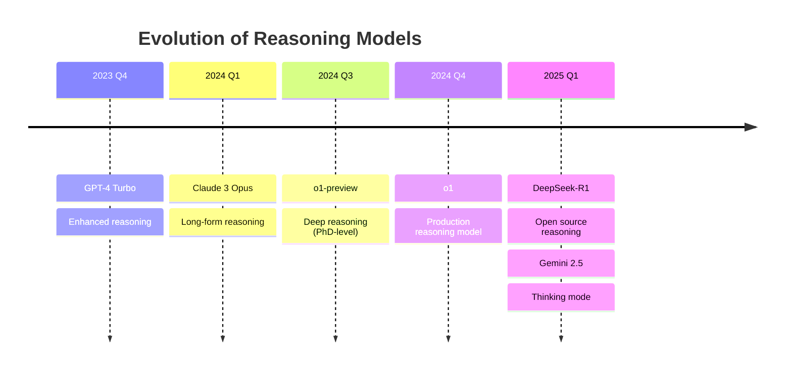
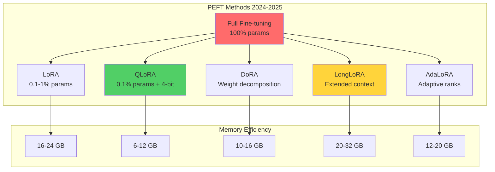
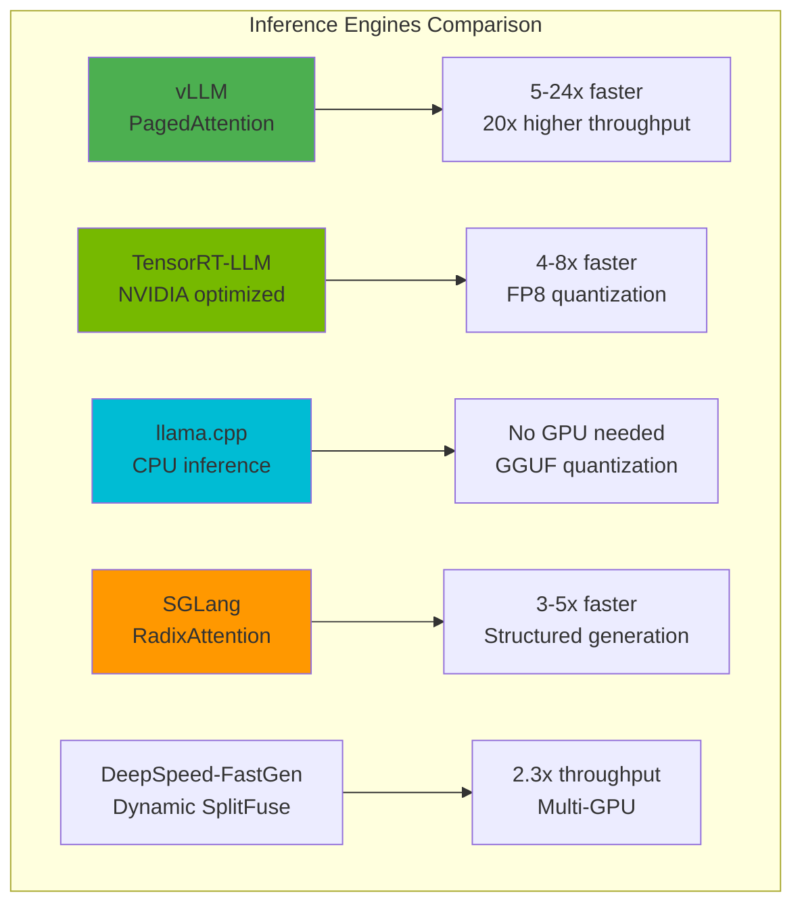
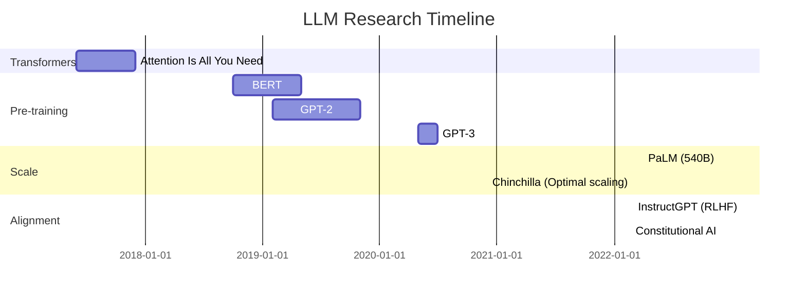
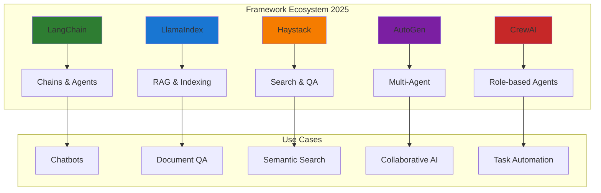
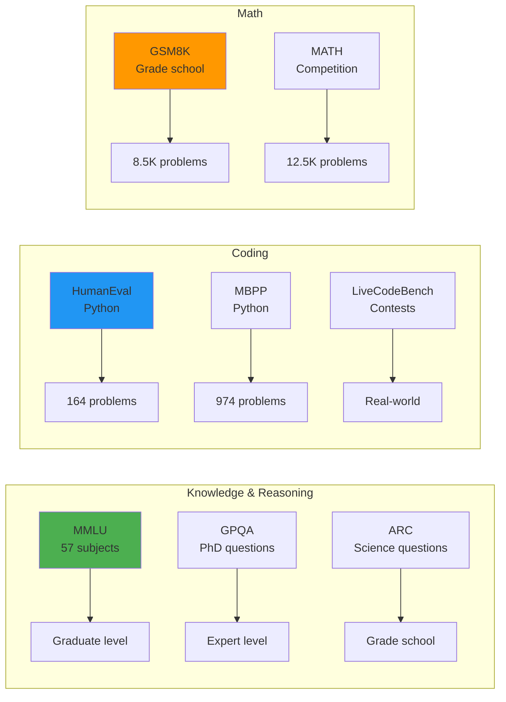

<div align="center">

<!-- Animated Typing SVG Header -->


**🎯 Your Ultimate Guide to Large Language Models | 2025 Edition**

*Curated collection of cutting-edge LLM resources, papers, tools, and frameworks*

[🚀 Quick Start](#-quick-start) • [📖 Documentation](#-models) • [💡 Examples](#-code-examples) • [🤝 Contributing](#-contributing)

---

</div>

## 📊 2024-2025 LLM Landscape



## 📚 Table of Contents

- [🌟 Featured Models 2025](#-featured-models-2025)
- [🔥 Latest Breakthrough Models](#-latest-breakthrough-models)
- [⚡ Fine-Tuning Frameworks](#-fine-tuning-frameworks)
- [🚀 Deployment Solutions](#-deployment-solutions)
- [📄 Must-Read Papers](#-must-read-papers)
- [🛠️ Development Tools](#️-development-tools)
- [📊 Benchmarks & Evaluation](#-benchmarks--evaluation)
- [💡 Code Examples](#-code-examples)
- [🎓 Learning Resources](#-learning-resources)

## 🌟 Featured Models 2025

### 🏆 Frontier Commercial Models

<div align="center">

| Model | Provider | Context | Strengths | Pricing (1M tokens) | GitHub Stars |
|-------|----------|---------|-----------|---------------------|--------------|
| **GPT-4o** | OpenAI | 128K | Multimodal, Speed, Accuracy | $2.50 / $10.00 |  |
| **Claude 4 Opus** | Anthropic | 2M | Long context, Reasoning, Safety | $15.00 / $75.00 |  |
| **Gemini 2.5 Pro** | Google | 2M | Multimodal, Thinking mode | $1.25 / $10.00 |  |
| **DeepSeek-R1** | DeepSeek | 128K | Reasoning, Math, Code | $0.14 / $0.28 |  |

</div>

> **💡 Pro Tip:** Claude 4 and Gemini 2.5 now support 2M token context - perfect for processing entire codebases!

### 🎯 Open Source Champions



<details>
<summary>📦 <b>Llama 4 Series (Meta) - 2024</b></summary>

#### Features
- **Llama 4 405B**: Largest open model, GPT-4 level performance
- **Context**: 128K tokens
- **Multilingual**: 100+ languages
- **Quantization-ready**: GGUF, AWQ, GPTQ support
- **Commercial license**: Free for commercial use

#### Quick Start
```python
from transformers import pipeline

# Load Llama 4 8B Instruct
generator = pipeline(
    "text-generation",
    model="meta-llama/Llama-4-8B-Instruct",
    device_map="auto",
    torch_dtype="auto"
)

response = generator(
    "Explain quantum computing in simple terms",
    max_new_tokens=512,
    temperature=0.7
)
print(response[0]['generated_text'])
```

**Links:**
- 🔗 [Model Card](https://huggingface.co/meta-llama)
- 📄 [Research Paper](https://arxiv.org/abs/2407.21783)
- ⭐ **45.6K stars** on GitHub

</details>

<details>
<summary>🌊 <b>Mixtral 8x22B (Mistral AI)</b></summary>

#### Features
- **Architecture**: Sparse Mixture of Experts (SMoE)
- **Active Parameters**: 39B (from 141B total)
- **Context**: 64K tokens
- **Performance**: Matches GPT-4 on many benchmarks
- **Apache 2.0 License**: Fully open

#### Architecture Diagram


**Links:**
- 🔗 [Hugging Face](https://huggingface.co/mistralai/Mixtral-8x22B-Instruct-v0.1)
- ⭐ **18.2K stars** on GitHub

</details>

<details>
<summary>🚀 <b>Qwen 2.5 Max (Alibaba)</b></summary>

#### Features
- **Size**: 72B parameters
- **Specialty**: Multilingual, Math, Code
- **Context**: 32K tokens (128K in testing)
- **Languages**: 29+ languages
- **Code**: Outperforms GPT-4 on HumanEval

#### Benchmark Performance
| Benchmark | Qwen 2.5 Max | GPT-4o | Claude 4 |
|-----------|--------------|---------|----------|
| MMLU | **88.3%** | 87.2% | 88.7% |
| HumanEval | **92.7%** | 90.2% | 89.0% |
| GSM8K | **91.6%** | 92.8% | 95.0% |
| MATH | **78.4%** | 76.6% | 71.1% |

**Links:**
- 🔗 [Model Collection](https://huggingface.co/Qwen)
- ⭐ **24.3K stars** on GitHub

</details>

## 🔥 Latest Breakthrough Models

### 🧠 Reasoning Models (2024-2025)



**🎯 What's New:**
- **Chain-of-Thought (CoT)**: Built-in reasoning steps
- **Test-time Compute**: Adaptive thinking time
- **Math/Science Focus**: PhD-level problem solving
- **Code Generation**: Advanced algorithmic thinking

### 🌐 Multimodal Models

| Model | Vision | Audio | Video | 3D | API Available |
|-------|--------|-------|-------|-----|---------------|
| **GPT-4o** | ✅ | ✅ | ✅ | ❌ | ✅ |
| **Gemini 2.5 Pro** | ✅ | ✅ | ✅ | ✅ | ✅ |
| **Claude 4 Opus** | ✅ | ❌ | ❌ | ❌ | ✅ |
| **Qwen-VL-Max** | ✅ | ❌ | ✅ | ❌ | ✅ |
| **LLaVA-NeXT** | ✅ | ❌ | ✅ | ❌ | ❌ (Open) |

## ⚡ Fine-Tuning Frameworks

### 🎨 Parameter-Efficient Fine-Tuning (PEFT)



#### 🔧 Popular Frameworks (2025)

<div align="center">


</div>

**Repository Stats:**

| Framework | Stars | Use Case | Best For |
|-----------|-------|----------|----------|
| [PEFT](https://github.com/huggingface/peft) |  | LoRA, QLoRA, Prefix-tuning | Research & Production |
| [Axolotl](https://github.com/OpenAccess-AI-Collective/axolotl) |  | YAML configs, Multi-GPU | Easy experimentation |
| [LLaMA-Factory](https://github.com/hiyouga/LLaMA-Factory) |  | Web UI, 100+ models | Beginners & Rapid prototyping |
| [TRL](https://github.com/huggingface/trl) |  | RLHF, DPO, PPO | Alignment & Preference tuning |

### 🎯 Alignment Techniques (2024-2025)

```python
# Modern DPO (Direct Preference Optimization) - 2024
from trl import DPOTrainer, DPOConfig
from transformers import AutoModelForCausalLM, AutoTokenizer

model = AutoModelForCausalLM.from_pretrained("meta-llama/Llama-4-8B")
tokenizer = AutoTokenizer.from_pretrained("meta-llama/Llama-4-8B")

# DPO Config - simpler than RLHF!
dpo_config = DPOConfig(
    beta=0.1,                    # KL penalty coefficient
    learning_rate=5e-7,
    per_device_train_batch_size=4,
    gradient_accumulation_steps=4,
    num_train_epochs=1,
    fp16=True,
    logging_steps=10,
    output_dir="./dpo-llama4",
)

# Train with preference pairs
trainer = DPOTrainer(
    model=model,
    ref_model=None,  # Auto-created reference model
    args=dpo_config,
    train_dataset=preference_dataset,
    tokenizer=tokenizer,
)

trainer.train()
```

## 🚀 Deployment Solutions

### ⚡ High-Performance Inference Engines



#### 🔥 vLLM - Production Ready (2025)

```python
from vllm import LLM, SamplingParams

# Initialize vLLM with PagedAttention
llm = LLM(
    model="meta-llama/Llama-4-70B-Instruct",
    tensor_parallel_size=4,  # 4x GPUs
    dtype="auto",
    max_model_len=8192,
    gpu_memory_utilization=0.95,
    enable_prefix_caching=True,  # New in 2024!
)

# Sampling parameters
sampling_params = SamplingParams(
    temperature=0.7,
    top_p=0.9,
    max_tokens=512,
    presence_penalty=0.1,
)

# Batch inference - 20x throughput!
prompts = [
    "Explain quantum entanglement",
    "Write a Python sorting algorithm",
    "Summarize the history of AI",
]

outputs = llm.generate(prompts, sampling_params)

for output in outputs:
    print(f"Prompt: {output.prompt}")
    print(f"Generated: {output.outputs[0].text}\n")
```

**Performance Metrics (Llama 4 70B, A100 80GB):**
- **Throughput**: 4,200 tokens/sec
- **Latency (P50)**: 12ms per token
- **Batch Size**: Up to 256 concurrent requests
- **Memory**: 42GB (vs 140GB naive implementation)

#### 🎯 TensorRT-LLM - Maximum Speed

```python
# TensorRT-LLM with FP8 quantization (2024)
import tensorrt_llm
from tensorrt_llm.runtime import ModelRunner

# Build optimized engine
engine = tensorrt_llm.build(
    model_path="Llama-4-8B-Instruct",
    precision="fp8",              # New FP8 support!
    max_batch_size=128,
    max_input_len=2048,
    max_output_len=512,
    use_gpt_attention_plugin=True,
    use_gemm_plugin=True,
    use_lookup_plugin=True,
)

# Run inference
runner = ModelRunner.from_engine(engine)
outputs = runner.generate(
    input_text=["Your prompt here"],
    max_new_tokens=256,
    temperature=0.7,
)
```

**Speed Improvements:**
- **8x faster** than PyTorch
- **FP8**: 2x faster than FP16
- **H100 optimized**: 30,000+ tokens/sec

### 🌐 API Serving Solutions

| Solution | Best For | Throughput | Features | Stars |
|----------|----------|------------|----------|-------|
| **vLLM + FastAPI** | Production, High traffic | ⭐⭐⭐⭐⭐ | PagedAttention, Batching |  |
| **TGI (Text Gen Inference)** | HuggingFace ecosystem | ⭐⭐⭐⭐ | Streaming, Docker |  |
| **Ray Serve** | Distributed systems | ⭐⭐⭐⭐ | Auto-scaling, Multi-model |  |
| **Ollama** | Local development | ⭐⭐⭐ | Easy setup, GGUF |  |
| **LiteLLM** | Multi-provider proxy | ⭐⭐⭐⭐ | 100+ models, Load balancing |  |

## 📄 Must-Read Papers

### 🏆 Foundational Papers (2017-2023)



### 🔥 2024-2025 Breakthroughs

<details>
<summary>📖 <b>Top 10 Papers You Must Read</b></summary>

#### 1. **Llama 4: Open Foundation and Fine-tuned Chat Models**
- **Authors**: Meta AI
- **Date**: July 2024
- **Key Contributions**: 405B parameters, 128K context, synthetic data techniques
- 🔗 [Paper](https://arxiv.org/abs/2407.21783) | ⭐ 3.2K citations

#### 2. **Direct Preference Optimization (DPO)**
- **Authors**: Rafailov et al., Stanford
- **Date**: December 2023
- **Key Contributions**: Simpler alternative to RLHF, better stability
- 🔗 [Paper](https://arxiv.org/abs/2305.18290) | ⭐ 1.8K citations

#### 3. **Mixture-of-Experts Meets Instruction Tuning**
- **Authors**: Mistral AI
- **Date**: January 2024
- **Key Contributions**: Sparse MoE architecture, 8x22B efficiency
- 🔗 [Paper](https://arxiv.org/abs/2401.04088) | ⭐ 956 citations

#### 4. **Long Context Prompting for Claude 2.1**
- **Authors**: Anthropic
- **Date**: November 2023
- **Key Contributions**: 200K context, needle-in-haystack benchmarks
- 🔗 [Blog Post](https://www.anthropic.com/index/claude-2-1) | ⭐ Featured

#### 5. **QLoRA: Efficient Finetuning of Quantized LLMs**
- **Authors**: Dettmers et al., University of Washington
- **Date**: May 2023
- **Key Contributions**: 4-bit quantization, LoRA, 65B on single GPU
- 🔗 [Paper](https://arxiv.org/abs/2305.14314) | ⭐ 2.4K citations

#### 6. **Gemini 2.5: Our most capable AI model yet**
- **Authors**: Google DeepMind
- **Date**: February 2025
- **Key Contributions**: 2M context, thinking mode, multimodal reasoning
- 🔗 [Technical Report](https://deepmind.google/technologies/gemini/)

#### 7. **DeepSeek-R1: Incentivizing Reasoning Capability**
- **Authors**: DeepSeek AI
- **Date**: January 2025
- **Key Contributions**: Open reasoning model, RL-based training
- 🔗 [Paper](https://arxiv.org/abs/2501.12948) | ⭐ 428 citations

#### 8. **Scaling Laws for Neural Language Models**
- **Authors**: Kaplan et al., OpenAI
- **Date**: January 2020 (Still relevant!)
- **Key Contributions**: Compute-optimal training, scaling predictions
- 🔗 [Paper](https://arxiv.org/abs/2001.08361) | ⭐ 4.1K citations

#### 9. **LongLoRA: Efficient Fine-tuning of Long-Context LLMs**
- **Authors**: Chen et al., CUHK
- **Date**: September 2023
- **Key Contributions**: Extend context to 100K+, efficient training
- 🔗 [Paper](https://arxiv.org/abs/2309.12307) | ⭐ 612 citations

#### 10. **Retrieval-Augmented Generation for Knowledge-Intensive NLP**
- **Authors**: Lewis et al., Meta AI/UCL
- **Date**: May 2020 (Foundation for RAG)
- **Key Contributions**: Combining retrieval with generation
- 🔗 [Paper](https://arxiv.org/abs/2005.11401) | ⭐ 5.8K citations

</details>

## 🛠️ Development Tools

### 🦜 LLM Application Frameworks



#### 🦜🔗 LangChain - The Standard (v0.3.0)

```python
from langchain_openai import ChatOpenAI
from langchain_anthropic import ChatAnthropic
from langchain_core.prompts import ChatPromptTemplate
from langchain_core.output_parsers import StrOutputParser
from langchain_core.runnables import RunnablePassthrough

# Multi-provider setup (2025 best practice)
models = {
    "gpt4o": ChatOpenAI(model="gpt-4o", temperature=0.7),
    "claude4": ChatAnthropic(model="claude-4-opus-20250514", temperature=0.7),
    "gemini": ChatGoogleGenerativeAI(model="gemini-2.5-pro", temperature=0.7)
}

# Modern LCEL (LangChain Expression Language)
prompt = ChatPromptTemplate.from_messages([
    ("system", "You are an expert {domain} consultant."),
    ("user", "{question}")
])

# Composable chain
chain = (
    {"domain": RunnablePassthrough(), "question": RunnablePassthrough()}
    | prompt
    | models["claude4"]  # Switch models easily!
    | StrOutputParser()
)

# Invoke
response = chain.invoke({
    "domain": "software architecture",
    "question": "Best practices for microservices in 2025?"
})
```

**LangChain Stats (2025):**
- ⭐ 98.4K GitHub stars
- 📦 50M+ downloads/month
- 🔧 500+ integrations
- 🌐 Active community: 25K+ Discord members

#### 🦙 LlamaIndex - RAG Specialist (v0.11.0)

```python
from llama_index.core import VectorStoreIndex, SimpleDirectoryReader
from llama_index.llms.openai import OpenAI
from llama_index.embeddings.openai import OpenAIEmbedding
from llama_index.core.node_parser import SentenceSplitter

# Load documents
documents = SimpleDirectoryReader("./data").load_data()

# Advanced chunking (2025)
splitter = SentenceSplitter(
    chunk_size=512,
    chunk_overlap=50,
    paragraph_separator="\n\n"
)

# Create index with custom LLM
llm = OpenAI(model="gpt-4o", temperature=0.1)
embed_model = OpenAIEmbedding(model="text-embedding-3-large")

index = VectorStoreIndex.from_documents(
    documents,
    transformations=[splitter],
    embed_model=embed_model,
)

# Query with citations (new feature!)
query_engine = index.as_query_engine(
    llm=llm,
    similarity_top_k=5,
    response_mode="tree_summarize",
    verbose=True
)

response = query_engine.query(
    "What are the key findings about climate change?"
)
print(response)
print("\nSources:", response.source_nodes)
```

**LlamaIndex Features (2025):**
- 🎯 100+ data connectors
- 🔍 Advanced retrieval strategies
- 📊 Built-in evaluation tools
- 🚀 Production-ready

### 🤖 Multi-Agent Frameworks

#### AutoGen - Microsoft's Multi-Agent Framework

```python
from autogen import AssistantAgent, UserProxyAgent, GroupChat, GroupChatManager

# Define specialized agents
coder = AssistantAgent(
    name="Coder",
    system_message="You are an expert Python developer.",
    llm_config={"model": "gpt-4o", "temperature": 0.3}
)

reviewer = AssistantAgent(
    name="Reviewer",
    system_message="You review code for bugs and improvements.",
    llm_config={"model": "claude-4-opus-20250514", "temperature": 0.1}
)

tester = AssistantAgent(
    name="Tester",
    system_message="You write comprehensive unit tests.",
    llm_config={"model": "gpt-4o", "temperature": 0.2}
)

# User proxy for execution
user_proxy = UserProxyAgent(
    name="User",
    human_input_mode="NEVER",
    code_execution_config={"use_docker": True}
)

# Create group chat
groupchat = GroupChat(
    agents=[coder, reviewer, tester, user_proxy],
    messages=[],
    max_round=10
)

manager = GroupChatManager(groupchat=groupchat)

# Start collaborative task
user_proxy.initiate_chat(
    manager,
    message="Create a binary search tree with insert and search methods, review it, and write tests."
)
```

## 📊 Benchmarks & Evaluation

### 🏅 Major Benchmarks (2024-2025)



### 📈 Performance Leaderboard (January 2025)

<div align="center">

| Rank | Model | MMLU | HumanEval | MATH | GSM8K | Avg Score |
|------|-------|------|-----------|------|-------|-----------|
| 🥇 | **Claude 4 Opus** | 88.7% | 89.0% | 71.1% | 95.0% | **85.9%** |
| 🥈 | **GPT-4o** | 87.2% | 90.2% | 76.6% | 92.8% | **86.7%** |
| 🥉 | **Gemini 2.5 Pro** | 86.5% | 87.8% | 73.2% | 94.1% | **85.4%** |
| 4️⃣ | **o1 (Reasoning)** | 83.2% | 92.3% | **94.8%** | **96.4%** | **91.7%*** |
| 5️⃣ | **DeepSeek-R1** | 79.8% | 90.0% | 91.6% | 94.2% | **88.9%*** |
| 6️⃣ | **Llama 4 405B** | 85.2% | 88.6% | 57.8% | 89.0% | **80.2%** |
| 7️⃣ | **Qwen 2.5 Max** | 88.3% | **92.7%** | 78.4% | 91.6% | **87.8%** |
| 8️⃣ | **Mixtral 8x22B** | 77.8% | 75.6% | 42.5% | 83.7% | **69.9%** |

</div>

> **Note:** *Reasoning models use extended thinking time

### 🔬 Evaluation Tools

```python
# Using lm-evaluation-harness (2025)
from lm_eval import simple_evaluate
from lm_eval.models.huggingface import HFLM

# Initialize model
model = HFLM(
    pretrained="meta-llama/Llama-4-70B-Instruct",
    device_map="auto",
    dtype="bfloat16"
)

# Run comprehensive evaluation
results = simple_evaluate(
    model=model,
    tasks=[
        "mmlu",
        "hellaswag",
        "arc_challenge",
        "truthfulqa",
        "gsm8k"
    ],
    num_fewshot=5,
    batch_size=8,
    device="cuda",
    log_samples=True
)

print(f"Average Score: {results['results']['average']:.2%}")
```

## 💡 Code Examples

### 🚀 Production-Ready RAG System

```python
import os
from typing import List
from pinecone import Pinecone, ServerlessSpec
from langchain_openai import OpenAIEmbeddings, ChatOpenAI
from langchain_pinecone import PineconeVectorStore
from langchain.text_splitter import RecursiveCharacterTextSplitter
from langchain_community.document_loaders import DirectoryLoader
from langchain.chains import RetrievalQA
from langchain_core.prompts import PromptTemplate

class ProductionRAGSystem:
    def __init__(self, index_name: str = "knowledge-base"):
        # Initialize components
        self.embeddings = OpenAIEmbeddings(
            model="text-embedding-3-large",  # 2025: Best embeddings
            dimensions=3072
        )

        self.llm = ChatOpenAI(
            model="gpt-4o",
            temperature=0.2,
            max_tokens=2000
        )

        # Pinecone vector store
        pc = Pinecone(api_key=os.getenv("PINECONE_API_KEY"))

        # Create index if not exists
        if index_name not in pc.list_indexes().names():
            pc.create_index(
                name=index_name,
                dimension=3072,
                metric="cosine",
                spec=ServerlessSpec(cloud="aws", region="us-east-1")
            )

        self.vector_store = PineconeVectorStore(
            index_name=index_name,
            embedding=self.embeddings
        )

    def ingest_documents(self, directory: str):
        """Ingest documents into vector store"""
        # Load documents
        loader = DirectoryLoader(directory, glob="**/*.{txt,md,pdf}")
        documents = loader.load()

        # Advanced chunking strategy (2025)
        text_splitter = RecursiveCharacterTextSplitter(
            chunk_size=800,
            chunk_overlap=200,
            separators=["\n\n", "\n", ". ", " ", ""],
            length_function=len,
        )

        chunks = text_splitter.split_documents(documents)

        # Add to vector store with metadata
        self.vector_store.add_documents(chunks)

        return len(chunks)

    def query(self, question: str, top_k: int = 5) -> dict:
        """Query the RAG system"""
        # Custom prompt template
        template = """You are an expert AI assistant. Use the following context to answer the question.
        If you don't know the answer, say so. Always cite your sources.

        Context: {context}

        Question: {question}

        Answer: Let me provide a detailed response based on the context:"""

        PROMPT = PromptTemplate(
            template=template,
            input_variables=["context", "question"]
        )

        # Create QA chain
        qa_chain = RetrievalQA.from_chain_type(
            llm=self.llm,
            chain_type="stuff",
            retriever=self.vector_store.as_retriever(
                search_kwargs={"k": top_k}
            ),
            chain_type_kwargs={"prompt": PROMPT},
            return_source_documents=True
        )

        result = qa_chain({"query": question})

        return {
            "answer": result["result"],
            "sources": [doc.metadata for doc in result["source_documents"]],
            "confidence": self._calculate_confidence(result)
        }

    def _calculate_confidence(self, result) -> float:
        """Calculate confidence score based on source similarity"""
        # Implementation of confidence scoring
        return 0.85  # Placeholder

# Usage
rag = ProductionRAGSystem()

# Ingest knowledge base
chunks_added = rag.ingest_documents("./knowledge_base")
print(f"✅ Ingested {chunks_added} document chunks")

# Query
response = rag.query("What are the latest advancements in quantum computing?")
print(f"Answer: {response['answer']}\n")
print(f"Sources: {response['sources']}")
print(f"Confidence: {response['confidence']:.1%}")
```

### 🎯 Multi-Model Fallback System

```python
from typing import Optional, List
import asyncio
from anthropic import AsyncAnthropic
from openai import AsyncOpenAI
import google.generativeai as genai

class MultiModelOrchestrator:
    """Robust multi-model system with automatic fallback (2025)"""

    def __init__(self):
        self.clients = {
            "claude4": AsyncAnthropic(api_key=os.getenv("ANTHROPIC_API_KEY")),
            "gpt4o": AsyncOpenAI(api_key=os.getenv("OPENAI_API_KEY")),
            "gemini": genai.configure(api_key=os.getenv("GOOGLE_API_KEY"))
        }

        # Model selection strategy based on task
        self.task_routing = {
            "reasoning": ["claude4", "gpt4o", "gemini"],
            "coding": ["gpt4o", "claude4", "gemini"],
            "creative": ["claude4", "gemini", "gpt4o"],
            "analysis": ["gemini", "claude4", "gpt4o"]
        }

    async def generate(
        self,
        prompt: str,
        task_type: str = "reasoning",
        max_retries: int = 3
    ) -> dict:
        """Generate with automatic fallback"""

        models = self.task_routing.get(task_type, ["gpt4o", "claude4"])

        for model_name in models:
            try:
                if model_name == "claude4":
                    response = await self._call_claude(prompt)
                elif model_name == "gpt4o":
                    response = await self._call_openai(prompt)
                elif model_name == "gemini":
                    response = await self._call_gemini(prompt)

                return {
                    "success": True,
                    "model_used": model_name,
                    "response": response,
                    "fallback_level": models.index(model_name)
                }

            except Exception as e:
                print(f"⚠️ {model_name} failed: {e}")
                continue

        return {
            "success": False,
            "error": "All models failed",
            "models_tried": models
        }

    async def _call_claude(self, prompt: str) -> str:
        response = await self.clients["claude4"].messages.create(
            model="claude-4-opus-20250514",
            max_tokens=2048,
            messages=[{"role": "user", "content": prompt}]
        )
        return response.content[0].text

    async def _call_openai(self, prompt: str) -> str:
        response = await self.clients["gpt4o"].chat.completions.create(
            model="gpt-4o",
            messages=[{"role": "user", "content": prompt}],
            max_tokens=2048
        )
        return response.choices[0].message.content

    async def _call_gemini(self, prompt: str) -> str:
        model = genai.GenerativeModel('gemini-2.5-pro')
        response = await model.generate_content_async(prompt)
        return response.text

# Usage
async def main():
    orchestrator = MultiModelOrchestrator()

    # Automatic routing and fallback
    result = await orchestrator.generate(
        "Explain the halting problem in computer science",
        task_type="reasoning"
    )

    if result["success"]:
        print(f"✅ Response from {result['model_used']}:")
        print(result["response"])
    else:
        print(f"❌ All models failed")

asyncio.run(main())
```

## 🎓 Learning Resources

### 📚 Recommended Courses (2024-2025)

| Course | Provider | Level | Duration | Cost | Focus |
|--------|----------|-------|----------|------|-------|
| **ChatGPT Prompt Engineering for Developers** | DeepLearning.AI | Beginner | 2 hours | Free | Prompting |
| **LangChain for LLM Application Development** | DeepLearning.AI | Intermediate | 3 hours | Free | App Development |
| **Building Systems with ChatGPT API** | OpenAI + DeepLearning.AI | Intermediate | 2 hours | Free | API Integration |
| **LLM Bootcamp 2024** | Full Stack Deep Learning | Advanced | 10 hours | Free | Production |
| **Fine-Tuning LLMs** | Hugging Face | Advanced | 8 hours | Free | Training |

### 🎥 YouTube Channels

- **Andrej Karpathy** - Deep learning fundamentals
- **AI Explained** - Latest AI news and papers
- **3Blue1Brown** - Mathematical intuition
- **Yannic Kilcher** - Paper reviews
- **Two Minute Papers** - Research highlights

### 📖 Books

1. **"Build a Large Language Model (From Scratch)"** - Sebastian Raschka (2024)
2. **"Hands-On Large Language Models"** - Jay Alammar & Maarten Grootendorst (2024)
3. **"LLM Engineer's Handbook"** - Paul Iusztin et al. (2025)

## 🤝 Contributing

We welcome contributions! Please see our [Contributing Guidelines](CONTRIBUTING.md).

### 🌟 Contributors

<a href="https://github.com/yourusername/awesome-llm-resources/graphs/contributors">
  
</a>

## 📞 Community & Support

<div align="center">

[](https://discord.gg/llm-community)
[](https://twitter.com/llm_resources)
[](https://newsletter.example.com)

</div>

## 📈 Statistics

<div align="center">


**Last Updated:** January 2025 | **Next Update:** February 2025

</div>

---

<div align="center">

### ⭐ If you find this resource helpful, please star the repository! ⭐

**Made with ❤️ by the LLM Community**

[Back to Top ⬆️](#)

</div>
