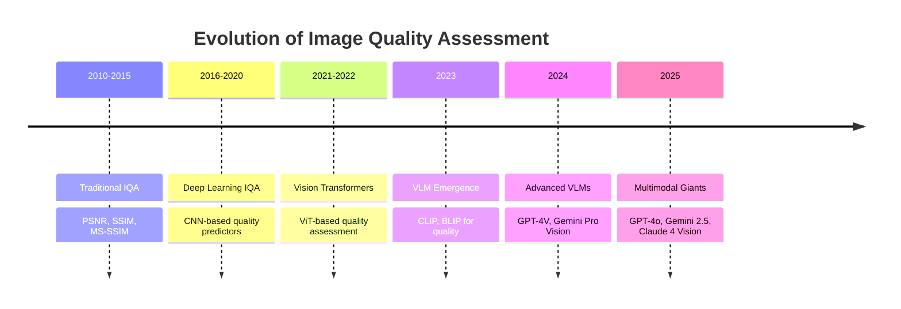
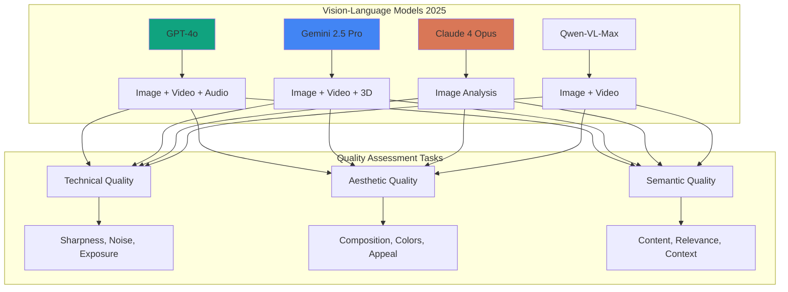
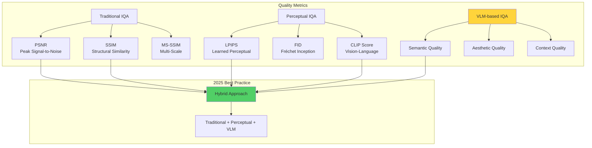
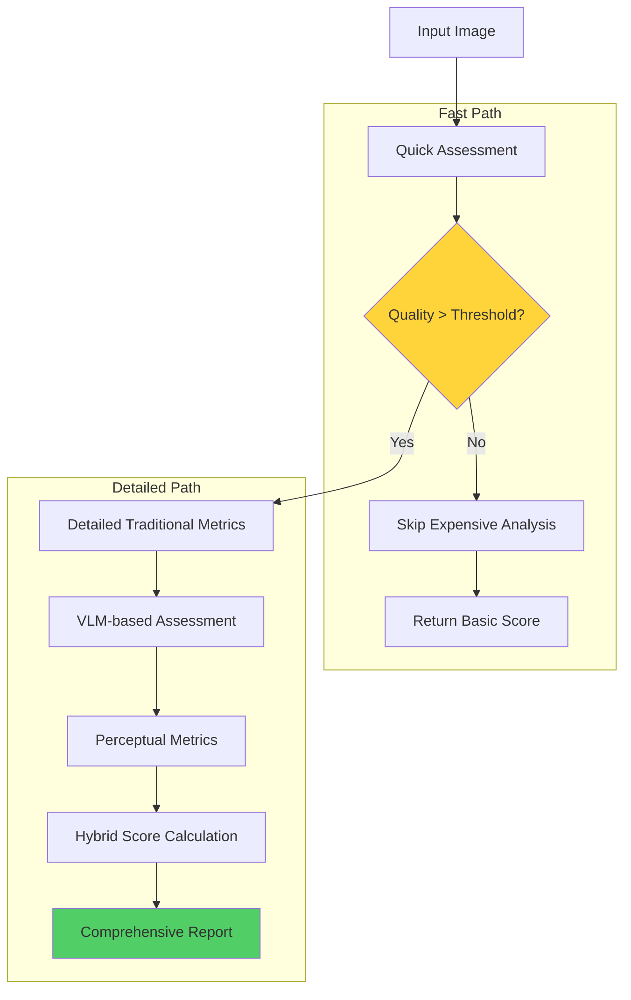

<div align="center">

<!-- Animated Typing SVG Header -->


**🎯 Comprehensive Guide to Image Quality Assessment with LLMs**

*Leverage Vision-Language Models for intelligent image quality analysis*

[🔍 VLMs](#-vision-language-models-2025) • [📊 Metrics](#-quality-metrics-frameworks) • [💻 Code](#-production-implementations) • [🎨 Applications](#-real-world-applications)

---

</div>

## 📊 IQA Evolution Timeline



## 📚 Table of Contents

- [🔍 Vision-Language Models 2025](#-vision-language-models-2025)
- [📊 Quality Metrics Frameworks](#-quality-metrics-frameworks)
- [🎯 Assessment Approaches](#-assessment-approaches)
- [💻 Production Implementations](#-production-implementations)
- [📈 Benchmarks & Evaluation](#-benchmarks--evaluation)
- [🎨 Real-World Applications](#-real-world-applications)
- [🔬 Advanced Techniques](#-advanced-techniques-2025)
- [🛠️ Tools & Libraries](#️-tools--libraries)

## 🔍 Vision-Language Models 2025

### VLM Capabilities Comparison



### Model Specifications (2025)

<div align="center">

| Model | Provider | Max Resolution | Video | 3D | Context | Best For |
|-------|----------|----------------|-------|----|---------| ---------|
| **GPT-4o** | OpenAI | 2048×2048 | ✅ | ❌ | 128K | **General Purpose** |
| **Gemini 2.5 Pro** | Google | 3072×3072 | ✅ | ✅ | 2M | **High-Res Analysis** |
| **Claude 4 Opus** | Anthropic | 1568×1568 | ❌ | ❌ | 2M | **Detailed Descriptions** |
| **Qwen-VL-Max** | Alibaba | 2048×2048 | ✅ | ❌ | 32K | **Multilingual** |
| **LLaVA-NeXT** | Open | 1024×1024 | ✅ | ❌ | 4K | **Open Source** |

</div>

### 1️⃣ GPT-4o Vision (Multimodal Leader)

```python
from openai import OpenAI
import base64

class GPT4oQualityAssessor:
    """GPT-4o for comprehensive image quality assessment"""

    def __init__(self):
        self.client = OpenAI()

    def assess_quality(self, image_path, detail_level="high"):
        """
        Assess image quality with GPT-4o
        detail_level: 'low' (512px) or 'high' (2048px)
        """

        # Read and encode image
        with open(image_path, "rb") as image_file:
            base64_image = base64.b64encode(image_file.read()).decode('utf-8')

        # Comprehensive quality assessment prompt
        prompt = """Analyze this image and provide a detailed quality assessment:

1. **Technical Quality** (Rate 1-10 for each):
   - Sharpness/Focus
   - Noise Level
   - Exposure (brightness/darkness)
   - Color Accuracy
   - Resolution Adequacy
   - Compression Artifacts

2. **Composition Quality** (Rate 1-10 for each):
   - Framing
   - Balance
   - Rule of Thirds
   - Leading Lines
   - Depth of Field

3. **Aesthetic Quality** (Rate 1-10 for each):
   - Visual Appeal
   - Color Harmony
   - Mood/Atmosphere
   - Subject Interest

4. **Content Quality** (Rate 1-10 for each):
   - Subject Clarity
   - Relevance
   - Completeness
   - Context Appropriateness

5. **Overall Assessment**:
   - Overall Quality Score (1-10)
   - Key Strengths (list 3)
   - Key Issues (list 3)
   - Improvement Suggestions (list 3)

Provide response in JSON format."""

        response = self.client.chat.completions.create(
            model="gpt-4o",
            messages=[
                {
                    "role": "user",
                    "content": [
                        {"type": "text", "text": prompt},
                        {
                            "type": "image_url",
                            "image_url": {
                                "url": f"data:image/jpeg;base64,{base64_image}",
                                "detail": detail_level
                            }
                        }
                    ]
                }
            ],
            max_tokens=2000,
            temperature=0.1  # Low temperature for consistency
        )

        return response.choices[0].message.content

    def batch_assess(self, image_paths, max_concurrent=5):
        """Assess multiple images in parallel"""
        import asyncio
        from openai import AsyncOpenAI

        async def assess_one(image_path):
            # Async implementation
            return await self.assess_quality_async(image_path)

        async def assess_all():
            # Process in batches
            results = []
            for i in range(0, len(image_paths), max_concurrent):
                batch = image_paths[i:i+max_concurrent]
                batch_results = await asyncio.gather(*[assess_one(p) for p in batch])
                results.extend(batch_results)
            return results

        return asyncio.run(assess_all())

# Usage
assessor = GPT4oQualityAssessor()
quality_report = assessor.assess_quality("photo.jpg", detail_level="high")
print(quality_report)
```

### 2️⃣ Gemini 2.5 Pro Vision (High-Resolution Expert)

```python
import google.generativeai as genai
from PIL import Image

class GeminiQualityAnalyzer:
    """Gemini 2.5 Pro for high-resolution image analysis"""

    def __init__(self, api_key):
        genai.configure(api_key=api_key)
        self.model = genai.GenerativeModel('gemini-2.5-pro')

    def comprehensive_analysis(self, image_path):
        """Detailed quality analysis with Gemini 2.5 Pro"""

        image = Image.open(image_path)

        prompt = """Perform a comprehensive image quality analysis. Provide:

**Technical Analysis:**
1. Resolution & Sharpness: Evaluate focus quality, detail preservation
2. Exposure & Dynamic Range: Assess highlights, shadows, overall exposure
3. Color Analysis: Color accuracy, saturation, white balance, color cast
4. Noise & Artifacts: Identify noise patterns, compression artifacts, distortions
5. Lens Quality: Detect vignetting, chromatic aberration, distortion

**Composition Analysis:**
1. Framing & Cropping: Evaluate composition, negative space, subject placement
2. Visual Balance: Assess symmetry, weight distribution, visual flow
3. Depth & Perspective: Analyze depth of field, perspective, layers
4. Lines & Shapes: Identify leading lines, geometric patterns, focal points

**Aesthetic Evaluation:**
1. Visual Impact: Rate immediate visual appeal and emotional resonance
2. Color Harmony: Evaluate color palette, contrast, complementary colors
3. Mood & Atmosphere: Describe the emotional tone and ambiance
4. Artistic Merit: Assess creativity, uniqueness, artistic value

**Content Assessment:**
1. Subject Quality: Clarity of main subject, relevance, interest level
2. Context & Story: Narrative quality, context clarity, message delivery
3. Technical Execution: Proper technique for the intended purpose
4. Target Audience Fit: Appropriateness for intended use case

**Quantitative Scores** (1-10):
- Technical Quality: __/10
- Composition: __/10
- Aesthetic Appeal: __/10
- Content Relevance: __/10
- Overall Quality: __/10

**Actionable Recommendations:**
Provide 3-5 specific, actionable suggestions for improvement.

Format as detailed JSON."""

        response = self.model.generate_content([prompt, image])

        return response.text

    def compare_images(self, image_paths):
        """Compare quality across multiple images"""

        images = [Image.open(path) for path in image_paths]

        prompt = f"""Compare the quality of these {len(images)} images. For each image, provide:

1. Overall quality score (1-10)
2. Key strengths (top 3)
3. Key weaknesses (top 3)
4. Best use case

Then rank them from best to worst quality and explain your ranking.

Provide response in structured JSON format."""

        content = [prompt] + images
        response = self.model.generate_content(content)

        return response.text

# Usage
analyzer = GeminiQualityAnalyzer(api_key="your-api-key")
analysis = analyzer.comprehensive_analysis("high_res_photo.jpg")
print(analysis)
```

### 3️⃣ Claude 4 Vision (Detailed Analysis)

```python
from anthropic import Anthropic
import base64

class ClaudeVisionAssessor:
    """Claude 4 for detailed image quality descriptions"""

    def __init__(self, api_key):
        self.client = Anthropic(api_key=api_key)

    def detailed_assessment(self, image_path, max_tokens=4096):
        """Get highly detailed quality assessment from Claude 4"""

        # Read and encode image
        with open(image_path, "rb") as image_file:
            image_data = base64.standard_b64encode(image_file.read()).decode("utf-8")

        # Get image media type
        import mimetypes
        media_type = mimetypes.guess_type(image_path)[0] or "image/jpeg"

        message = self.client.messages.create(
            model="claude-4-opus-20250514",
            max_tokens=max_tokens,
            messages=[
                {
                    "role": "user",
                    "content": [
                        {
                            "type": "image",
                            "source": {
                                "type": "base64",
                                "media_type": media_type,
                                "data": image_data,
                            },
                        },
                        {
                            "type": "text",
                            "text": """Provide an exceptionally detailed image quality assessment. Your analysis should be thorough and specific:

**TECHNICAL QUALITY ANALYSIS:**

1. **Focus & Sharpness:**
   - Evaluate focus accuracy on main subject
   - Assess overall image sharpness across frame
   - Identify any focus issues (front/back focus, motion blur)
   - Rate sharpness: _/10

2. **Exposure & Tonal Range:**
   - Analyze highlight retention and shadow detail
   - Evaluate overall exposure accuracy
   - Identify clipping or blocked shadows
   - Assess dynamic range utilization
   - Rate exposure: _/10

3. **Color & White Balance:**
   - Evaluate color accuracy and neutrality
   - Assess white balance correctness
   - Identify color casts or tints
   - Analyze color saturation levels
   - Rate color quality: _/10

4. **Noise & Clarity:**
   - Identify noise patterns (luminance/chroma)
   - Assess noise impact on image quality
   - Evaluate overall clarity and micro-contrast
   - Rate noise control: _/10

5. **Technical Defects:**
   - Compression artifacts (if present)
   - Chromatic aberration
   - Vignetting
   - Distortion (barrel/pincushion)
   - Other optical issues

**COMPOSITIONAL ANALYSIS:**

1. **Framing & Structure:**
   - Evaluate subject placement and framing choices
   - Assess use of compositional rules (thirds, golden ratio)
   - Analyze negative space utilization
   - Rate composition: _/10

2. **Visual Flow & Balance:**
   - Describe visual weight distribution
   - Identify leading lines and visual paths
   - Assess overall balance and harmony
   - Rate balance: _/10

**AESTHETIC EVALUATION:**

1. **Visual Appeal:**
   - Immediate visual impact
   - Emotional resonance
   - Artistic merit
   - Rate aesthetics: _/10

2. **Color Harmony:**
   - Color palette evaluation
   - Complementary/analogous color use
   - Overall color story
   - Rate color harmony: _/10

**CONTENT & PURPOSE:**

1. **Subject Quality:**
   - Subject clarity and interest
   - Content relevance
   - Storytelling effectiveness
   - Rate content: _/10

**OVERALL ASSESSMENT:**

- **Overall Quality Score:** _/10
- **Primary Strengths:** (List 3-5)
- **Primary Weaknesses:** (List 3-5)
- **Recommended Improvements:** (List 5 specific, actionable suggestions)
- **Best Use Cases:** (Where this image excels)
- **Not Suitable For:** (What this image shouldn't be used for)

Provide response in detailed, structured format."""
                        }
                    ],
                }
            ],
        )

        return message.content[0].text

# Usage
assessor = ClaudeVisionAssessor(api_key="your-api-key")
detailed_report = assessor.detailed_assessment("image.jpg")
print(detailed_report)
```

## 📊 Quality Metrics Frameworks

### IQA Metrics Hierarchy



### 1️⃣ Traditional Metrics Enhanced with LLMs

```python
import cv2
import numpy as np
from skimage.metrics import structural_similarity as ssim
from skimage.metrics import peak_signal_noise_ratio as psnr

class HybridQualityMetrics:
    """Combine traditional metrics with LLM assessment"""

    def __init__(self, llm_assessor=None):
        self.llm_assessor = llm_assessor

    def calculate_traditional_metrics(self, image, reference=None):
        """Calculate traditional IQA metrics"""

        metrics = {}

        # No-reference metrics
        metrics['sharpness'] = self._calculate_sharpness(image)
        metrics['contrast'] = self._calculate_contrast(image)
        metrics['brightness'] = self._calculate_brightness(image)
        metrics['colorfulness'] = self._calculate_colorfulness(image)

        # Reference metrics (if reference provided)
        if reference is not None:
            metrics['psnr'] = psnr(reference, image)
            metrics['ssim'] = ssim(reference, image, multichannel=True, channel_axis=2)
            metrics['mse'] = np.mean((reference - image) ** 2)

        return metrics

    def _calculate_sharpness(self, image):
        """Laplacian variance for sharpness"""
        gray = cv2.cvtColor(image, cv2.COLOR_BGR2GRAY)
        return cv2.Laplacian(gray, cv2.CV_64F).var()

    def _calculate_contrast(self, image):
        """RMS contrast"""
        gray = cv2.cvtColor(image, cv2.COLOR_BGR2GRAY)
        return gray.std()

    def _calculate_brightness(self, image):
        """Average brightness"""
        gray = cv2.cvtColor(image, cv2.COLOR_BGR2GRAY)
        return gray.mean()

    def _calculate_colorfulness(self, image):
        """Colorfulness metric (Hasler and Susstrunk)"""
        (B, G, R) = cv2.split(image.astype("float"))
        rg = np.absolute(R - G)
        yb = np.absolute(0.5 * (R + G) - B)

        std_rg = np.std(rg)
        std_yb = np.std(yb)
        mean_rg = np.mean(rg)
        mean_yb = np.mean(yb)

        colorfulness = np.sqrt(std_rg**2 + std_yb**2) + 0.3 * np.sqrt(mean_rg**2 + mean_yb**2)
        return colorfulness

    def comprehensive_assessment(self, image_path, reference_path=None):
        """Combine traditional and LLM-based assessment"""

        # Load images
        image = cv2.imread(image_path)

        reference = None
        if reference_path:
            reference = cv2.imread(reference_path)

        # Traditional metrics
        traditional = self.calculate_traditional_metrics(image, reference)

        # LLM-based assessment
        llm_assessment = None
        if self.llm_assessor:
            llm_assessment = self.llm_assessor.assess_quality(image_path)

        # Combine results
        return {
            'traditional_metrics': traditional,
            'llm_assessment': llm_assessment,
            'hybrid_score': self._calculate_hybrid_score(traditional, llm_assessment)
        }

    def _calculate_hybrid_score(self, traditional, llm_assessment):
        """Calculate weighted hybrid score"""

        # Normalize traditional metrics (0-1)
        sharpness_norm = min(traditional['sharpness'] / 1000, 1.0)
        contrast_norm = min(traditional['contrast'] / 100, 1.0)
        brightness_norm = 1 - abs(traditional['brightness'] - 127.5) / 127.5
        colorfulness_norm = min(traditional['colorfulness'] / 100, 1.0)

        traditional_score = (
            0.3 * sharpness_norm +
            0.2 * contrast_norm +
            0.2 * brightness_norm +
            0.3 * colorfulness_norm
        )

        # If LLM assessment available, combine
        if llm_assessment:
            # Extract overall score from LLM (assuming 0-10 scale)
            llm_score = llm_assessment.get('overall_quality', 5) / 10

            # Weighted combination
            hybrid_score = 0.4 * traditional_score + 0.6 * llm_score
            return hybrid_score

        return traditional_score

# Usage
assessor = GPT4oQualityAssessor()
metrics = HybridQualityMetrics(llm_assessor=assessor)

result = metrics.comprehensive_assessment("photo.jpg")
print(f"Traditional Metrics: {result['traditional_metrics']}")
print(f"LLM Assessment: {result['llm_assessment']}")
print(f"Hybrid Score: {result['hybrid_score']:.2f}")
```

### 2️⃣ Perceptual Quality with CLIP

```python
import torch
import clip
from PIL import Image
import numpy as np

class CLIPQualityScorer:
    """Use CLIP for perceptual quality assessment"""

    def __init__(self, device="cuda"):
        self.device = device
        self.model, self.preprocess = clip.load("ViT-L/14", device=device)

        # Quality descriptors (positive and negative)
        self.quality_descriptors = {
            'positive': [
                "a high quality professional photograph",
                "a sharp and clear image",
                "a well-exposed photo with good dynamic range",
                "a professionally composed photograph",
                "an aesthetically pleasing image",
                "a photo with excellent color balance",
                "a high resolution detailed image",
                "a professional quality photograph"
            ],
            'negative': [
                "a low quality image",
                "a blurry and out of focus photo",
                "an overexposed or underexposed image",
                "a poorly composed photograph",
                "an unappealing image",
                "a photo with poor color balance",
                "a low resolution pixelated image",
                "an amateur quality photograph"
            ]
        }

    def assess_quality(self, image_path):
        """Assess image quality using CLIP"""

        # Load and preprocess image
        image = self.preprocess(Image.open(image_path)).unsqueeze(0).to(self.device)

        # Encode image
        with torch.no_grad():
            image_features = self.model.encode_image(image)
            image_features /= image_features.norm(dim=-1, keepdim=True)

            # Encode positive descriptors
            positive_tokens = clip.tokenize(self.quality_descriptors['positive']).to(self.device)
            positive_features = self.model.encode_text(positive_tokens)
            positive_features /= positive_features.norm(dim=-1, keepdim=True)

            # Encode negative descriptors
            negative_tokens = clip.tokenize(self.quality_descriptors['negative']).to(self.device)
            negative_features = self.model.encode_text(negative_tokens)
            negative_features /= negative_features.norm(dim=-1, keepdim=True)

            # Calculate similarities
            positive_similarities = (100.0 * image_features @ positive_features.T).softmax(dim=-1)
            negative_similarities = (100.0 * image_features @ negative_features.T).softmax(dim=-1)

        # Calculate quality score
        positive_score = positive_similarities.mean().item()
        negative_score = negative_similarities.mean().item()

        # Quality score (0-1, higher is better)
        quality_score = positive_score / (positive_score + negative_score)

        return {
            'quality_score': quality_score,
            'positive_alignment': positive_score,
            'negative_alignment': negative_score,
            'detailed_scores': {
                desc: float(score)
                for desc, score in zip(
                    self.quality_descriptors['positive'] + self.quality_descriptors['negative'],
                    torch.cat([positive_similarities[0], negative_similarities[0]]).tolist()
                )
            }
        }

    def compare_images(self, image_paths):
        """Compare quality across multiple images"""

        results = []
        for path in image_paths:
            quality = self.assess_quality(path)
            results.append({
                'image': path,
                'quality_score': quality['quality_score']
            })

        # Sort by quality
        results.sort(key=lambda x: x['quality_score'], reverse=True)

        return results

# Usage
scorer = CLIPQualityScorer()
quality = scorer.assess_quality("photo.jpg")
print(f"Quality Score: {quality['quality_score']:.3f}")
print(f"Detailed Scores: {quality['detailed_scores']}")
```

## 🎯 Assessment Approaches

### Quality Assessment Pipeline



### 1️⃣ Multi-Stage Assessment

```python
class MultiStageQualityAssessor:
    """Progressive quality assessment with increasing depth"""

    def __init__(self):
        self.clip_scorer = CLIPQualityScorer()
        self.hybrid_metrics = HybridQualityMetrics()
        self.vlm_assessor = GPT4oQualityAssessor()

    def quick_assessment(self, image_path):
        """Stage 1: Fast CLIP-based assessment"""
        return self.clip_scorer.assess_quality(image_path)

    def detailed_technical(self, image_path):
        """Stage 2: Detailed traditional metrics"""
        image = cv2.imread(image_path)
        return self.hybrid_metrics.calculate_traditional_metrics(image)

    def aesthetic_analysis(self, image_path):
        """Stage 3: VLM-based aesthetic evaluation"""
        return self.vlm_assessor.assess_quality(image_path)

    def assess(self, image_path, depth='full'):
        """
        Progressive assessment
        depth: 'quick', 'technical', 'aesthetic', or 'full'
        """

        results = {'image': image_path}

        # Stage 1: Quick assessment (always done)
        quick_result = self.quick_assessment(image_path)
        results['quick_score'] = quick_result['quality_score']

        if depth == 'quick':
            return results

        # Early stopping if very low quality
        if quick_result['quality_score'] < 0.3:
            results['assessment'] = "Low quality - detailed analysis skipped"
            return results

        # Stage 2: Technical metrics
        if depth in ['technical', 'aesthetic', 'full']:
            technical = self.detailed_technical(image_path)
            results['technical_metrics'] = technical

        if depth == 'technical':
            return results

        # Stage 3: Aesthetic analysis (expensive!)
        if depth in ['aesthetic', 'full']:
            aesthetic = self.aesthetic_analysis(image_path)
            results['aesthetic_analysis'] = aesthetic

        # Calculate final score
        results['final_score'] = self._calculate_final_score(results)

        return results

    def _calculate_final_score(self, results):
        """Weighted combination of all scores"""
        weights = {
            'quick_score': 0.2,
            'technical': 0.3,
            'aesthetic': 0.5
        }

        final_score = weights['quick_score'] * results.get('quick_score', 0)

        if 'technical_metrics' in results:
            tech_score = self._normalize_technical(results['technical_metrics'])
            final_score += weights['technical'] * tech_score

        if 'aesthetic_analysis' in results:
            # Extract overall score from VLM response
            aesthetic_score = self._extract_aesthetic_score(results['aesthetic_analysis'])
            final_score += weights['aesthetic'] * aesthetic_score

        return final_score

# Usage
assessor = MultiStageQualityAssessor()

# Quick assessment for batch processing
quick_result = assessor.assess("photo.jpg", depth='quick')

# Full assessment for important images
full_result = assessor.assess("hero_image.jpg", depth='full')
```

### 2️⃣ Ensemble Quality Prediction

```python
class EnsembleQualityPredictor:
    """Combine multiple assessment methods for robust predictions"""

    def __init__(self):
        self.models = {
            'clip': CLIPQualityScorer(),
            'traditional': HybridQualityMetrics(),
            'gpt4o': GPT4oQualityAssessor(),
            'gemini': GeminiQualityAnalyzer(api_key="your-key")
        }

        # Model weights (can be learned from data)
        self.weights = {
            'clip': 0.25,
            'traditional': 0.25,
            'gpt4o': 0.25,
            'gemini': 0.25
        }

    def predict_quality(self, image_path, use_models=None):
        """
        Ensemble prediction
        use_models: list of models to use, or None for all
        """

        if use_models is None:
            use_models = list(self.models.keys())

        predictions = {}
        scores = []

        # Get predictions from each model
        for model_name in use_models:
            if model_name not in self.models:
                continue

            try:
                if model_name == 'clip':
                    result = self.models[model_name].assess_quality(image_path)
                    score = result['quality_score']

                elif model_name == 'traditional':
                    image = cv2.imread(image_path)
                    result = self.models[model_name].calculate_traditional_metrics(image)
                    # Normalize traditional metrics to 0-1
                    score = (
                        min(result['sharpness'] / 1000, 1.0) * 0.4 +
                        min(result['contrast'] / 100, 1.0) * 0.3 +
                        min(result['colorfulness'] / 100, 1.0) * 0.3
                    )

                elif model_name in ['gpt4o', 'gemini']:
                    result = self.models[model_name].assess_quality(image_path)
                    # Extract overall score from VLM (assuming 0-10 scale)
                    score = self._extract_score_from_llm(result) / 10

                predictions[model_name] = {
                    'score': score,
                    'details': result
                }
                scores.append(score * self.weights.get(model_name, 1.0))

            except Exception as e:
                print(f"Error in {model_name}: {e}")
                continue

        # Ensemble score
        if scores:
            ensemble_score = sum(scores) / sum(self.weights[m] for m in use_models if m in predictions)
        else:
            ensemble_score = 0.5  # Default

        # Confidence based on agreement
        confidence = self._calculate_confidence(predictions)

        return {
            'ensemble_score': ensemble_score,
            'confidence': confidence,
            'individual_predictions': predictions,
            'recommendation': self._get_recommendation(ensemble_score, confidence)
        }

    def _calculate_confidence(self, predictions):
        """Calculate confidence based on prediction agreement"""
        scores = [p['score'] for p in predictions.values()]
        if len(scores) < 2:
            return 0.5

        # Standard deviation of predictions (lower = more agreement)
        std = np.std(scores)
        confidence = 1 - min(std * 2, 1.0)  # Normalize to 0-1

        return confidence

    def _get_recommendation(self, score, confidence):
        """Provide recommendation based on score and confidence"""
        if confidence < 0.5:
            return "Low confidence - manual review recommended"
        elif score >= 0.8:
            return "High quality - approved"
        elif score >= 0.6:
            return "Good quality - minor improvements suggested"
        elif score >= 0.4:
            return "Fair quality - significant improvements needed"
        else:
            return "Low quality - reject or major rework needed"

# Usage
predictor = EnsembleQualityPredictor()

# Use all models
result = predictor.predict_quality("image.jpg")
print(f"Ensemble Score: {result['ensemble_score']:.3f}")
print(f"Confidence: {result['confidence']:.3f}")
print(f"Recommendation: {result['recommendation']}")

# Use only fast models
quick_result = predictor.predict_quality("image.jpg", use_models=['clip', 'traditional'])
```

## 💻 Production Implementations

### Complete Production System

```python
import asyncio
from typing import List, Dict
from dataclasses import dataclass
from datetime import datetime
import json

@dataclass
class QualityReport:
    """Structured quality assessment report"""
    image_path: str
    timestamp: datetime
    quick_score: float
    technical_scores: Dict
    aesthetic_scores: Dict
    overall_score: float
    issues: List[str]
    recommendations: List[str]
    processing_time: float

class ProductionIQASystem:
    """Production-ready image quality assessment system"""

    def __init__(self, config=None):
        self.config = config or self._default_config()

        # Initialize components
        self.clip_scorer = CLIPQualityScorer()
        self.traditional_metrics = HybridQualityMetrics()
        self.vlm_assessor = GPT4oQualityAssessor()

        # Processing stats
        self.stats = {
            'total_processed': 0,
            'avg_processing_time': 0,
            'quality_distribution': []
        }

    def _default_config(self):
        return {
            'quick_threshold': 0.3,  # Skip detailed analysis if below
            'batch_size': 10,
            'use_vlm_for_high_quality': True,
            'vlm_threshold': 0.7,
            'cache_results': True,
            'max_concurrent': 5
        }

    async def assess_single(self, image_path: str) -> QualityReport:
        """Assess single image with full pipeline"""
        start_time = datetime.now()

        # Stage 1: Quick assessment
        quick_result = self.clip_scorer.assess_quality(image_path)
        quick_score = quick_result['quality_score']

        # Early stopping for very low quality
        if quick_score < self.config['quick_threshold']:
            return QualityReport(
                image_path=image_path,
                timestamp=datetime.now(),
                quick_score=quick_score,
                technical_scores={},
                aesthetic_scores={},
                overall_score=quick_score,
                issues=["Low overall quality detected"],
                recommendations=["Consider replacing this image"],
                processing_time=(datetime.now() - start_time).total_seconds()
            )

        # Stage 2: Technical metrics
        image = cv2.imread(image_path)
        technical = self.traditional_metrics.calculate_traditional_metrics(image)

        # Stage 3: VLM assessment (for high-quality images)
        aesthetic_scores = {}
        if quick_score >= self.config['vlm_threshold'] and self.config['use_vlm_for_high_quality']:
            vlm_result = await asyncio.to_thread(
                self.vlm_assessor.assess_quality,
                image_path
            )
            aesthetic_scores = self._parse_vlm_result(vlm_result)

        # Generate report
        overall_score = self._calculate_overall_score(quick_score, technical, aesthetic_scores)
        issues = self._identify_issues(technical, aesthetic_scores)
        recommendations = self._generate_recommendations(issues, technical)

        processing_time = (datetime.now() - start_time).total_seconds()

        # Update stats
        self._update_stats(overall_score, processing_time)

        return QualityReport(
            image_path=image_path,
            timestamp=datetime.now(),
            quick_score=quick_score,
            technical_scores=technical,
            aesthetic_scores=aesthetic_scores,
            overall_score=overall_score,
            issues=issues,
            recommendations=recommendations,
            processing_time=processing_time
        )

    async def assess_batch(self, image_paths: List[str]) -> List[QualityReport]:
        """Assess multiple images efficiently"""

        results = []

        # Process in batches
        for i in range(0, len(image_paths), self.config['max_concurrent']):
            batch = image_paths[i:i+self.config['max_concurrent']]
            batch_results = await asyncio.gather(*[
                self.assess_single(path) for path in batch
            ])
            results.extend(batch_results)

        return results

    def _calculate_overall_score(self, quick_score, technical, aesthetic):
        """Calculate weighted overall score"""

        # Base score from CLIP
        score = quick_score * 0.3

        # Technical contribution
        if technical:
            tech_score = (
                min(technical.get('sharpness', 0) / 1000, 1.0) * 0.25 +
                min(technical.get('contrast', 0) / 100, 1.0) * 0.15 +
                min(technical.get('colorfulness', 0) / 100, 1.0) * 0.15
            )
            score += tech_score * 0.35

        # Aesthetic contribution
        if aesthetic:
            aesthetic_score = aesthetic.get('overall', 5) / 10
            score += aesthetic_score * 0.35

        return min(score, 1.0)

    def _identify_issues(self, technical, aesthetic):
        """Identify specific quality issues"""
        issues = []

        # Technical issues
        if technical.get('sharpness', 1000) < 100:
            issues.append("Image lacks sharpness - may be out of focus or motion blurred")

        if technical.get('contrast', 50) < 20:
            issues.append("Low contrast - image appears flat")

        if technical.get('brightness', 127) < 50:
            issues.append("Image is underexposed")
        elif technical.get('brightness', 127) > 200:
            issues.append("Image is overexposed")

        # Aesthetic issues (if available)
        if aesthetic:
            if aesthetic.get('composition', 10) < 5:
                issues.append("Poor composition - subject placement needs improvement")

            if aesthetic.get('color_harmony', 10) < 5:
                issues.append("Color balance issues detected")

        return issues

    def _generate_recommendations(self, issues, technical):
        """Generate actionable recommendations"""
        recommendations = []

        for issue in issues:
            if "sharpness" in issue.lower():
                recommendations.append("Use tripod or increase shutter speed to improve sharpness")
            elif "contrast" in issue.lower():
                recommendations.append("Adjust levels or curves to enhance contrast")
            elif "underexposed" in issue.lower():
                recommendations.append("Increase exposure by 1-2 stops or adjust in post-processing")
            elif "overexposed" in issue.lower():
                recommendations.append("Decrease exposure or use graduated ND filter")
            elif "composition" in issue.lower():
                recommendations.append("Apply rule of thirds or simplify composition")
            elif "color" in issue.lower():
                recommendations.append("Adjust white balance and color grading")

        if not recommendations:
            recommendations.append("Image quality is good - no major improvements needed")

        return recommendations

    def _update_stats(self, score, processing_time):
        """Update processing statistics"""
        self.stats['total_processed'] += 1
        self.stats['quality_distribution'].append(score)

        # Update running average
        n = self.stats['total_processed']
        old_avg = self.stats['avg_processing_time']
        self.stats['avg_processing_time'] = (old_avg * (n-1) + processing_time) / n

    def get_statistics(self):
        """Get processing statistics"""
        scores = self.stats['quality_distribution']

        return {
            'total_processed': self.stats['total_processed'],
            'avg_processing_time': f"{self.stats['avg_processing_time']:.3f}s",
            'quality_stats': {
                'mean': np.mean(scores) if scores else 0,
                'median': np.median(scores) if scores else 0,
                'std': np.std(scores) if scores else 0,
                'min': min(scores) if scores else 0,
                'max': max(scores) if scores else 0
            }
        }

# Usage
async def main():
    system = ProductionIQASystem()

    # Single image
    report = await system.assess_single("image.jpg")
    print(f"Overall Score: {report.overall_score:.3f}")
    print(f"Issues: {report.issues}")
    print(f"Recommendations: {report.recommendations}")

    # Batch processing
    image_paths = [f"image_{i}.jpg" for i in range(100)]
    reports = await system.assess_batch(image_paths)

    # Statistics
    stats = system.get_statistics()
    print(f"Statistics: {json.dumps(stats, indent=2)}")

asyncio.run(main())
```

## 📈 Benchmarks & Evaluation

### IQA Benchmark Datasets

<div align="center">

| Dataset | Images | Distortions | MOS Range | Use Case |
|---------|--------|-------------|-----------|----------|
| **TID2013** | 3,000 | 24 types | 0-9 | Distortion analysis |
| **LIVE** | 29 ref + 779 distorted | 5 types | 0-100 | General IQA |
| **KonIQ-10k** | 10,073 | Real-world | 1-5 | In-the-wild quality |
| **AVA** | 255,530 | Aesthetic | 1-10 | Aesthetic assessment |
| **PIPAL** | 23,200 | Perceptual | 0-1 | Perceptual quality |

</div>

## 🎨 Real-World Applications

### 1️⃣ Content Moderation

```python
class ContentQualityModerator:
    """Moderate user-uploaded content based on quality"""

    def __init__(self, quality_threshold=0.6):
        self.threshold = quality_threshold
        self.iqa_system = ProductionIQASystem()

    async def moderate_upload(self, image_path, context="social_media"):
        """Moderate uploaded image"""

        # Assess quality
        report = await self.iqa_system.assess_single(image_path)

        # Context-specific rules
        context_thresholds = {
            "social_media": 0.5,
            "e_commerce": 0.7,
            "professional": 0.8,
            "print": 0.9
        }

        threshold = context_thresholds.get(context, self.threshold)

        if report.overall_score < threshold:
            return {
                'approved': False,
                'reason': f"Quality score {report.overall_score:.2f} below threshold {threshold}",
                'issues': report.issues,
                'recommendations': report.recommendations
            }

        return {
            'approved': True,
            'quality_score': report.overall_score,
            'processing_time': report.processing_time
        }

# Usage
moderator = ContentQualityModerator()
result = await moderator.moderate_upload("user_photo.jpg", context="e_commerce")
print(f"Approved: {result['approved']}")
```

### 2️⃣ Automated Photo Curation

```python
class PhotoCurator:
    """Automatically curate best photos from collections"""

    def __init__(self):
        self.assessor = ProductionIQASystem()

    async def curate_album(self, photo_paths, top_k=10, diversity_weight=0.3):
        """Select best photos with diversity"""

        # Assess all photos
        reports = await self.assessor.assess_batch(photo_paths)

        # Sort by quality
        sorted_reports = sorted(reports, key=lambda x: x.overall_score, reverse=True)

        # Select diverse top photos
        selected = []
        selected_features = []

        for report in sorted_reports:
            if len(selected) >= top_k:
                break

            # Check diversity
            if not selected:
                selected.append(report)
                continue

            # Calculate diversity score
            diversity = self._calculate_diversity(report, selected_features)

            # Combined score
            combined_score = (
                (1 - diversity_weight) * report.overall_score +
                diversity_weight * diversity
            )

            if combined_score > 0.5:  # Threshold
                selected.append(report)

        return selected

    def _calculate_diversity(self, report, selected_features):
        """Calculate diversity from selected photos"""
        # Simplified: could use CLIP features, color histograms, etc.
        return 0.7  # Placeholder

# Usage
curator = PhotoCurator()
best_photos = await curator.curate_album(photo_paths, top_k=20)
```

---

<div align="center">

### 🎯 Start assessing image quality with VLMs today!

**Combine traditional metrics with AI-powered analysis for best results**


**Made with ❤️ for the AI Vision Community**

Last Updated: January 2025 | Next Update: February 2025

[Back to Top ⬆️](#)

</div>
