<div align="center">

<!-- Animated Typing SVG Header -->


**🎯 Complete Guide to Fine-Tuning Large Language Models**

*From basic LoRA to advanced RLHF - Master all fine-tuning techniques*

[🚀 Quick Start](#-quick-start) • [📖 Methods](#-fine-tuning-methods) • [💻 Code](#-production-code-examples) • [🎓 Best Practices](#-best-practices)

---

</div>

## 📊 Fine-Tuning Landscape 2024-2025


## 📚 Table of Contents

- [🚀 Quick Start](#-quick-start)
- [🎯 Fine-Tuning Methods](#-fine-tuning-methods)
- [📊 Method Comparison](#-method-comparison-table)
- [💾 Data Preparation](#-data-preparation)
- [⚙️ Training Strategies](#️-training-strategies)
- [🖥️ Hardware Guide](#️-hardware-requirements-guide)
- [💻 Production Code Examples](#-production-code-examples)
- [🎓 Best Practices](#-best-practices)
- [⚠️ Common Pitfalls](#️-common-pitfalls-and-solutions)
- [🔬 Advanced Techniques](#-advanced-techniques-2025)

## 🚀 Quick Start

### One-Command Fine-Tuning

```bash
# Install dependencies (2025)
pip install transformers accelerate peft trl bitsandbytes datasets

# Fine-tune Llama 4 8B with QLoRA - single command!
python -m axolotl.cli.train examples/llama-4/qlora.yml
```

### 5-Minute Example

```python
from transformers import AutoModelForCausalLM, AutoTokenizer, TrainingArguments, Trainer
from peft import LoraConfig, get_peft_model
from datasets import load_dataset
import torch

# 1. Load model with 4-bit quantization
model = AutoModelForCausalLM.from_pretrained(
    "meta-llama/Llama-4-8B",
    load_in_4bit=True,
    device_map="auto",
    torch_dtype=torch.bfloat16
)

# 2. Add LoRA adapters
lora_config = LoraConfig(r=16, lora_alpha=32, target_modules=["q_proj", "v_proj"])
model = get_peft_model(model, lora_config)

# 3. Load dataset
dataset = load_dataset("timdettmers/openassistant-guanaco")

# 4. Train!
trainer = Trainer(
    model=model,
    args=TrainingArguments(
        output_dir="./llama4-finetuned",
        num_train_epochs=3,
        per_device_train_batch_size=4,
        learning_rate=2e-4,
    ),
    train_dataset=dataset["train"],
)

trainer.train()
```

**Result**: Fine-tuned Llama 4 8B in 6GB VRAM!

## 🎯 Fine-Tuning Methods

### 🔥 Method Comparison Flowchart

```mermaid
flowchart TD
    Start([Need to Fine-tune?]) --> Budget{Budget/Resources?}

    Budget -->|High Budget<br/>Multiple GPUs| FullFT[Full Fine-Tuning<br/>✅ Best Performance<br/>❌ Most Expensive]
    Budget -->|Medium<br/>Single GPU 24GB+| LoRA[LoRA<br/>✅ Good Balance<br/>✅ Fast Training]
    Budget -->|Low<br/>Single GPU 8-16GB| QLoRA[QLoRA<br/>✅ Most Efficient<br/>✅ Consumer Hardware]

    Budget -->|Need Alignment?| Alignment{Type?}

    Alignment -->|With Preferences| DPO[DPO<br/>✅ Simple<br/>✅ Stable]
    Alignment -->|Advanced Control| RLHF[RLHF<br/>⚠️ Complex<br/>⚠️ Requires Compute]
    Alignment -->|Without Preferences| KTO[KTO<br/>✅ Binary Feedback<br/>✅ Less Data]

    Budget -->|Long Context?| LongCtx[LongLoRA<br/>✅ 100K+ Tokens<br/>⚠️ Memory Intensive]

    style QLoRA fill:#51CF66
    style DPO fill:#FFD43B
    style LoRA fill:#4DABF7
```



### 1️⃣ Full Fine-Tuning

**When to Use:**
- You have significant compute resources (multiple A100s)
- Need absolute best performance
- Large domain shift from pre-training data
- Budget allows for 100+ GB VRAM

```python
from transformers import AutoModelForCausalLM, Trainer, TrainingArguments
import torch

# Full precision fine-tuning
model = AutoModelForCausalLM.from_pretrained(
    "meta-llama/Llama-4-8B",
    torch_dtype=torch.bfloat16,
    device_map="auto"
)

# All parameters trainable
print(f"Trainable params: {sum(p.numel() for p in model.parameters() if p.requires_grad):,}")
# Output: Trainable params: 8,030,261,248

training_args = TrainingArguments(
    output_dir="./full-ft-llama4",
    num_train_epochs=3,
    per_device_train_batch_size=2,
    gradient_accumulation_steps=8,
    learning_rate=2e-5,
    bf16=True,
    logging_steps=10,
    save_strategy="epoch",
    deepspeed="ds_config_zero3.json"  # ZeRO-3 for 8B model
)
```

**Memory Requirements:**
| Model Size | Full FT | LoRA | QLoRA |
|------------|---------|------|-------|
| 7-8B | 56-64 GB | 16-20 GB | 6-10 GB |
| 13B | 104-120 GB | 24-32 GB | 10-16 GB |
| 34B | 272-340 GB | 48-64 GB | 20-30 GB |
| 70B | 560-700 GB | 80-120 GB | 35-48 GB |

### 2️⃣ LoRA (Low-Rank Adaptation) ⭐

**The Sweet Spot for Most Use Cases**


**Key Concepts:**
- **Rank (r)**: Typically 8-64, controls adapter capacity
- **Alpha (α)**: Scaling factor, typically 2×r
- **Target Modules**: Which layers to adapt (q_proj, v_proj, etc.)

```python
from peft import LoraConfig, get_peft_model, TaskType
from transformers import AutoModelForCausalLM
import torch

model = AutoModelForCausalLM.from_pretrained(
    "meta-llama/Llama-4-8B",
    torch_dtype=torch.bfloat16,
    device_map="auto"
)

# LoRA configuration (2025 best practices)
lora_config = LoraConfig(
    r=16,                              # Rank - higher = more capacity
    lora_alpha=32,                     # Scaling factor
    target_modules=[
        "q_proj",                      # Query projection
        "k_proj",                      # Key projection
        "v_proj",                      # Value projection
        "o_proj",                      # Output projection
        "gate_proj",                   # MLP gate
        "up_proj",                     # MLP up
        "down_proj",                   # MLP down
    ],
    lora_dropout=0.05,                # Dropout for regularization
    bias="none",                       # Don't adapt biases
    task_type=TaskType.CAUSAL_LM,
)

model = get_peft_model(model, lora_config)
model.print_trainable_parameters()
# Output: trainable params: 41,943,040 || all params: 8,072,204,288 || trainable%: 0.52%
```

**LoRA Hyperparameter Guide:**

| Use Case | Rank (r) | Alpha | Target Modules | Notes |
|----------|----------|-------|----------------|-------|
| **Simple Task** | 8 | 16 | q_proj, v_proj | Minimal overfitting risk |
| **General Purpose** | 16-32 | 32-64 | All attention | Recommended default |
| **Complex Domain** | 64-128 | 128-256 | All attention + MLP | More capacity needed |
| **Code Generation** | 32-64 | 64-128 | All layers | Benefits from full coverage |

### 3️⃣ QLoRA (Quantized LoRA) 🔥 Most Popular

**Game Changer: Fine-tune 70B models on consumer GPUs!**

```python
from transformers import AutoModelForCausalLM, BitsAndBytesConfig
from peft import LoraConfig, prepare_model_for_kbit_training, get_peft_model
import torch

# 4-bit quantization config
bnb_config = BitsAndBytesConfig(
    load_in_4bit=True,
    bnb_4bit_quant_type="nf4",           # NormalFloat4 - optimal for LLMs
    bnb_4bit_compute_dtype=torch.bfloat16,  # Compute in bf16
    bnb_4bit_use_double_quant=True,       # Nested quantization - save more memory
)

# Load model in 4-bit
model = AutoModelForCausalLM.from_pretrained(
    "meta-llama/Llama-4-70B",
    quantization_config=bnb_config,
    device_map="auto",
    trust_remote_code=True,
)

# Prepare for k-bit training
model = prepare_model_for_kbit_training(model)

# Add LoRA
lora_config = LoraConfig(
    r=64,
    lora_alpha=128,
    target_modules=["q_proj", "k_proj", "v_proj", "o_proj", "gate_proj", "up_proj", "down_proj"],
    lora_dropout=0.05,
    bias="none",
    task_type="CAUSAL_LM"
)

model = get_peft_model(model, lora_config)
```

**QLoRA Memory Savings:**


### 4️⃣ DoRA (Weight-Decomposed LoRA) - 2024

**Better than LoRA with similar efficiency!**

```python
from peft import LoraConfig, get_peft_model

# DoRA: Decomposes weights into magnitude and direction
dora_config = LoraConfig(
    r=16,
    lora_alpha=32,
    target_modules=["q_proj", "v_proj", "k_proj", "o_proj"],
    use_dora=True,  # Enable DoRA - NEW in 2024!
    lora_dropout=0.05,
)

model = get_peft_model(model, dora_config)
```

**DoRA vs LoRA Performance:**
- **Accuracy**: +2-5% on most benchmarks
- **Training Time**: +10-15% (worth it!)
- **Memory**: Same as LoRA
- **Use When**: You want best possible results with PEFT

### 5️⃣ LongLoRA - Extended Context

**Efficiently extend context window to 100K+ tokens**

```python
from peft import LoraConfig
import torch

# LongLoRA configuration
longlora_config = LoraConfig(
    r=16,
    lora_alpha=32,
    target_modules=["q_proj", "v_proj"],
    # Key: Use shifted sparse attention during training
    use_rslora=True,  # Rank-stabilized LoRA
)

# Training with extended context
training_args = TrainingArguments(
    max_length=32768,  # 32K context
    group_by_length=True,  # Group similar lengths
    dataloader_num_workers=4,
)
```

### 6️⃣ Prefix Tuning

**Keep model frozen, only tune prefix vectors**

```python
from peft import PrefixTuningConfig, get_peft_model

prefix_config = PrefixTuningConfig(
    task_type="CAUSAL_LM",
    num_virtual_tokens=30,  # Number of prefix tokens
    encoder_hidden_size=4096,  # Model hidden size
)

model = get_peft_model(model, prefix_config)
# Trainable params: 0.01% of total!
```

## 📊 Method Comparison Table

<div align="center">

| Method | Memory↓ | Speed↑ | Quality↑ | Complexity | Best For |
|--------|---------|--------|----------|------------|----------|
| **Full FT** | ❌ | ⭐⭐ | ⭐⭐⭐⭐⭐ | ⭐⭐ | Large budgets, critical tasks |
| **LoRA** | ✅ | ⭐⭐⭐⭐ | ⭐⭐⭐⭐ | ⭐⭐ | **Most use cases** ⭐ |
| **QLoRA** | ✅✅ | ⭐⭐⭐ | ⭐⭐⭐⭐ | ⭐⭐⭐ | **Limited hardware** ⭐ |
| **DoRA** | ✅ | ⭐⭐⭐ | ⭐⭐⭐⭐ | ⭐⭐⭐ | Best PEFT results |
| **LongLoRA** | ⭐⭐ | ⭐⭐ | ⭐⭐⭐⭐ | ⭐⭐⭐⭐ | Long documents |
| **Prefix Tuning** | ✅✅✅ | ⭐⭐⭐⭐⭐ | ⭐⭐⭐ | ⭐ | Many tasks, limited memory |

</div>

## 💾 Data Preparation

### 📋 Dataset Format Standards (2025)


### 1. Instruction Format (Alpaca Style)

```json
{
  "instruction": "Write a Python function to calculate factorial",
  "input": "Create a recursive implementation",
  "output": "def factorial(n):\n    if n == 0 or n == 1:\n        return 1\n    return n * factorial(n - 1)"
}
```

```python
# Convert to training format
def format_instruction(example):
    if example["input"]:
        prompt = f"""Below is an instruction that describes a task, paired with an input that provides further context. Write a response that appropriately completes the request.

### Instruction:
{example['instruction']}

### Input:
{example['input']}

### Response:
{example['output']}"""
    else:
        prompt = f"""Below is an instruction that describes a task. Write a response that appropriately completes the request.

### Instruction:
{example['instruction']}

### Response:
{example['output']}"""

    return {"text": prompt}
```

### 2. Chat Format (Modern Standard)

```json
{
  "messages": [
    {"role": "system", "content": "You are a helpful coding assistant."},
    {"role": "user", "content": "How do I reverse a list in Python?"},
    {"role": "assistant", "content": "You can reverse a list using:\n1. list.reverse() - in-place\n2. reversed(list) - returns iterator\n3. list[::-1] - creates new reversed list"}
  ]
}
```

```python
from transformers import AutoTokenizer

def format_chat(example, tokenizer):
    # Use model's chat template
    formatted = tokenizer.apply_chat_template(
        example["messages"],
        tokenize=False,
        add_generation_prompt=False
    )
    return {"text": formatted}

# Example with Llama 4
tokenizer = AutoTokenizer.from_pretrained("meta-llama/Llama-4-8B-Instruct")
formatted_data = dataset.map(lambda x: format_chat(x, tokenizer))
```

### 3. Dataset Quality Pipeline

```python
from datasets import load_dataset
import re

class DatasetQualityPipeline:
    def __init__(self, min_length=10, max_length=4096):
        self.min_length = min_length
        self.max_length = max_length

    def clean_text(self, text):
        """Remove unwanted characters and normalize"""
        # Remove excessive whitespace
        text = re.sub(r'\s+', ' ', text)
        # Remove special characters (customize as needed)
        text = re.sub(r'[^\w\s.,!?-]', '', text)
        return text.strip()

    def filter_quality(self, example):
        """Filter low-quality examples"""
        text = example.get('text', '')

        # Length check
        if len(text) < self.min_length or len(text) > self.max_length:
            return False

        # Basic quality checks
        if text.count('�') > 0:  # Contains replacement characters
            return False

        # Check for repetition
        words = text.split()
        if len(words) > 10:
            unique_ratio = len(set(words)) / len(words)
            if unique_ratio < 0.3:  # Too repetitive
                return False

        return True

    def deduplicate(self, dataset):
        """Remove exact duplicates"""
        seen = set()
        def is_unique(example):
            text_hash = hash(example['text'])
            if text_hash in seen:
                return False
            seen.add(text_hash)
            return True

        return dataset.filter(is_unique)

    def process(self, dataset):
        """Full quality pipeline"""
        # 1. Clean
        dataset = dataset.map(lambda x: {'text': self.clean_text(x['text'])})

        # 2. Filter
        dataset = dataset.filter(self.filter_quality)

        # 3. Deduplicate
        dataset = self.deduplicate(dataset)

        print(f"✅ Final dataset size: {len(dataset)} examples")
        return dataset

# Usage
pipeline = DatasetQualityPipeline()
clean_dataset = pipeline.process(raw_dataset)
```

### 4. Data Augmentation Techniques

```python
import nlpaug.augmenter.word as naw
from transformers import pipeline

class DataAugmenter:
    def __init__(self):
        # Paraphrasing with T5
        self.paraphraser = pipeline("text2text-generation", model="humarin/chatgpt_paraphraser_on_T5_base")

        # Synonym replacement
        self.synonym_aug = naw.SynonymAug(aug_src='wordnet')

    def paraphrase(self, text, num_variations=3):
        """Generate paraphrased versions"""
        variations = []
        for _ in range(num_variations):
            result = self.paraphraser(text, max_length=512, do_sample=True, temperature=0.7)
            variations.append(result[0]['generated_text'])
        return variations

    def synonym_replace(self, text, aug_p=0.3):
        """Replace words with synonyms"""
        return self.synonym_aug.augment(text, n=1, num_thread=1)[0]

    def augment_dataset(self, dataset, multiplier=2):
        """Augment entire dataset"""
        augmented = []

        for example in dataset:
            # Keep original
            augmented.append(example)

            # Add variations
            variations = self.paraphrase(example['text'], num_variations=multiplier-1)
            for var in variations:
                augmented.append({'text': var})

        return augmented

# Usage
augmenter = DataAugmenter()
augmented_dataset = augmenter.augment_dataset(dataset, multiplier=3)
print(f"Original: {len(dataset)} → Augmented: {len(augmented_dataset)}")
```

## ⚙️ Training Strategies

### 🎯 Hyperparameter Optimization Guide


### Optimal Hyperparameters by Model Size

<div align="center">

| Model Size | Learning Rate | Batch Size | LoRA Rank | Epochs | Warmup Steps |
|------------|---------------|------------|-----------|--------|--------------|
| **7-8B** | 2e-4 to 3e-4 | 8-16 | 16-32 | 2-3 | 100 |
| **13B** | 1e-4 to 2e-4 | 4-8 | 16-32 | 2-3 | 50-100 |
| **34B** | 5e-5 to 1e-4 | 2-4 | 32-64 | 1-2 | 50 |
| **70B+** | 2e-5 to 5e-5 | 1-2 | 32-64 | 1-2 | 20-50 |

</div>

### Learning Rate Schedulers (2025)

```python
from transformers import get_scheduler

# 1. Linear with Warmup (Most Common)
scheduler = get_scheduler(
    "linear",
    optimizer=optimizer,
    num_warmup_steps=100,
    num_training_steps=1000
)

# 2. Cosine with Warmup (Better for longer training)
scheduler = get_scheduler(
    "cosine",
    optimizer=optimizer,
    num_warmup_steps=100,
    num_training_steps=1000
)

# 3. Constant with Warmup (Stable for small datasets)
scheduler = get_scheduler(
    "constant_with_warmup",
    optimizer=optimizer,
    num_warmup_steps=100
)
```

**Scheduler Comparison:**


### Advanced Training Techniques

#### 1. Gradient Accumulation (Simulate Larger Batches)

```python
from transformers import TrainingArguments

training_args = TrainingArguments(
    per_device_train_batch_size=2,      # Actual batch per GPU
    gradient_accumulation_steps=8,       # Accumulate 8 batches
    # Effective batch size = 2 × 8 × num_gpus = 16 (on 1 GPU)

    # Other important settings
    gradient_checkpointing=True,         # Save memory
    optim="paged_adamw_8bit",           # 8-bit optimizer
    bf16=True,                           # Better than fp16
)
```

#### 2. Mixed Precision Training

```python
# Use BFloat16 (recommended for modern GPUs)
training_args = TrainingArguments(
    bf16=True,                    # BF16: Better range than FP16
    bf16_full_eval=True,          # Use BF16 for evaluation too
    fp16=False,                   # Don't use both!
)

# For older GPUs (V100, T4)
training_args = TrainingArguments(
    fp16=True,
    fp16_opt_level="O2",          # Apex optimization level
)
```

#### 3. DeepSpeed Integration (Multi-GPU)

```json
{
  "fp16": {
    "enabled": true
  },
  "zero_optimization": {
    "stage": 3,
    "offload_optimizer": {
      "device": "cpu",
      "pin_memory": true
    },
    "offload_param": {
      "device": "cpu",
      "pin_memory": true
    },
    "overlap_comm": true,
    "contiguous_gradients": true,
    "sub_group_size": 1e9,
    "reduce_bucket_size": "auto",
    "stage3_prefetch_bucket_size": "auto",
    "stage3_param_persistence_threshold": "auto",
    "stage3_max_live_parameters": 1e9,
    "stage3_max_reuse_distance": 1e9
  },
  "gradient_accumulation_steps": 4,
  "gradient_clipping": 1.0,
  "train_batch_size": "auto",
  "train_micro_batch_size_per_gpu": "auto"
}
```

```python
# Use DeepSpeed config
training_args = TrainingArguments(
    deepspeed="ds_config_zero3.json",
    # ... other args
)
```

## 🖥️ Hardware Requirements Guide

### GPU Memory Calculator

```python
def estimate_memory(
    model_size_b: float,
    precision: str = "bf16",
    method: str = "qlora",
    batch_size: int = 1,
    sequence_length: int = 2048
):
    """Estimate VRAM needed for fine-tuning"""

    # Model weights
    precision_bytes = {"fp32": 4, "fp16": 2, "bf16": 2, "int8": 1, "int4": 0.5}
    model_memory = model_size_b * 1e9 * precision_bytes[precision]

    # Method multipliers
    if method == "full":
        multiplier = 4  # Model + gradients + optimizer states
    elif method == "lora":
        multiplier = 1.2  # Model + small adapters
    elif method == "qlora":
        multiplier = 1.1  # Quantized model + adapters
    else:
        multiplier = 1.5

    # Activation memory (depends on batch size and sequence length)
    activation_memory = batch_size * sequence_length * 12 * model_size_b * 1e9 * 2 / 1e9

    total_gb = (model_memory * multiplier + activation_memory * 1e9) / 1e9

    return {
        "model_memory_gb": model_memory / 1e9,
        "activation_memory_gb": activation_memory,
        "total_estimated_gb": total_gb
    }

# Example
print(estimate_memory(model_size_b=70, precision="int4", method="qlora", batch_size=1))
# Output: {'model_memory_gb': 35.0, 'activation_memory_gb': 1.9, 'total_estimated_gb': 40.4}
```

### Hardware Recommendations by Model Size

```mermaid
graph TB
    subgraph "7-8B Models"
        A[QLoRA] --> B[RTX 4090 24GB]
        A --> C[RTX 3090 24GB]
        D[LoRA] --> E[A100 40GB]
    end

    subgraph "13B Models"
        F[QLoRA] --> G[RTX 4090 24GB]
        H[LoRA] --> I[A100 40GB]
        J[Full FT] --> K[2× A100 80GB]
    end

    subgraph "70B Models"
        L[QLoRA] --> M[A100 80GB]
        N[LoRA] --> O[2× A100 80GB]
        P[Full FT] --> Q[8× A100 80GB]
    end

    style B fill:#51CF66
    style G fill:#51CF66
    style M fill:#FFD43B
```



<div align="center">

| GPU Model | VRAM | Recommended For | Cost (Est.) |
|-----------|------|-----------------|-------------|
| **RTX 4090** | 24 GB | 7-13B QLoRA | $1,599 |
| **RTX A6000** | 48 GB | 13-34B QLoRA | $4,500 |
| **A100 40GB** | 40 GB | 7-13B Full FT | $10,000 |
| **A100 80GB** | 80 GB | 34-70B QLoRA, 13B Full FT | $15,000 |
| **H100** | 80 GB | 70B+ LoRA, Best Performance | $30,000+ |

</div>

## 💻 Production Code Examples

### 🔥 Complete QLoRA Training Script

```python
#!/usr/bin/env python3
"""
Production QLoRA Fine-tuning Script (2025)
Fine-tune any model with 4-bit quantization
"""

import torch
from transformers import (
    AutoModelForCausalLM,
    AutoTokenizer,
    BitsAndBytesConfig,
    TrainingArguments,
)
from peft import LoraConfig, prepare_model_for_kbit_training, get_peft_model
from trl import SFTTrainer
from datasets import load_dataset
import wandb

class QLo RAFineTuner:
    def __init__(
        self,
        model_name: str = "meta-llama/Llama-4-8B",
        dataset_name: str = "timdettmers/openassistant-guanaco",
        output_dir: str = "./qlora-finetuned",
    ):
        self.model_name = model_name
        self.dataset_name = dataset_name
        self.output_dir = output_dir

        # Initialize W&B
        wandb.init(project="llm-finetuning", name=f"qlora-{model_name.split('/')[-1]}")

    def setup_model(self):
        """Load model with 4-bit quantization"""
        bnb_config = BitsAndBytesConfig(
            load_in_4bit=True,
            bnb_4bit_quant_type="nf4",
            bnb_4bit_compute_dtype=torch.bfloat16,
            bnb_4bit_use_double_quant=True,
        )

        self.model = AutoModelForCausalLM.from_pretrained(
            self.model_name,
            quantization_config=bnb_config,
            device_map="auto",
            trust_remote_code=True,
        )

        self.model = prepare_model_for_kbit_training(self.model)

        # LoRA config
        lora_config = LoraConfig(
            r=64,
            lora_alpha=128,
            target_modules=[
                "q_proj", "k_proj", "v_proj", "o_proj",
                "gate_proj", "up_proj", "down_proj"
            ],
            lora_dropout=0.05,
            bias="none",
            task_type="CAUSAL_LM",
        )

        self.model = get_peft_model(self.model, lora_config)
        self.model.print_trainable_parameters()

        # Tokenizer
        self.tokenizer = AutoTokenizer.from_pretrained(self.model_name)
        self.tokenizer.pad_token = self.tokenizer.eos_token
        self.tokenizer.padding_side = "right"

    def load_dataset(self):
        """Load and prepare dataset"""
        self.dataset = load_dataset(self.dataset_name, split="train")

        # Format dataset
        def format_prompts(example):
            return {"text": f"### Human: {example['text']}\n### Assistant: {example['text']}"}

        self.dataset = self.dataset.map(format_prompts)

    def train(self):
        """Run training"""
        training_args = TrainingArguments(
            output_dir=self.output_dir,
            num_train_epochs=3,
            per_device_train_batch_size=4,
            gradient_accumulation_steps=4,
            gradient_checkpointing=True,
            optim="paged_adamw_8bit",
            logging_steps=10,
            save_strategy="epoch",
            learning_rate=2e-4,
            bf16=True,
            max_grad_norm=0.3,
            warmup_ratio=0.03,
            lr_scheduler_type="cosine",
            report_to="wandb",
        )

        trainer = SFTTrainer(
            model=self.model,
            train_dataset=self.dataset,
            tokenizer=self.tokenizer,
            args=training_args,
            max_seq_length=2048,
            packing=False,  # Set to True for better GPU utilization
        )

        trainer.train()

        # Save model
        trainer.save_model(self.output_dir)
        print(f"✅ Model saved to {self.output_dir}")

    def run(self):
        """Complete fine-tuning pipeline"""
        print("🚀 Starting QLoRA fine-tuning...")

        print("\n📦 Loading model...")
        self.setup_model()

        print("\n📊 Loading dataset...")
        self.load_dataset()

        print("\n🏋️ Training...")
        self.train()

        print("\n✅ Fine-tuning complete!")

if __name__ == "__main__":
    finetuner = QLoRAFineTuner()
    finetuner.run()
```

### 🎯 DPO (Direct Preference Optimization) Training

```python
from transformers import AutoModelForCausalLM, AutoTokenizer
from trl import DPOTrainer, DPOConfig
from datasets import load_dataset

# Load model
model = AutoModelForCausalLM.from_pretrained("meta-llama/Llama-4-8B")
tokenizer = AutoTokenizer.from_pretrained("meta-llama/Llama-4-8B")

# Load preference dataset
# Format: {"prompt": str, "chosen": str, "rejected": str}
dataset = load_dataset("Anthropic/hh-rlhf")

# DPO configuration
dpo_config = DPOConfig(
    beta=0.1,                        # KL penalty coefficient
    learning_rate=5e-7,
    per_device_train_batch_size=4,
    gradient_accumulation_steps=4,
    num_train_epochs=1,
    bf16=True,
    logging_steps=10,
    output_dir="./dpo-llama4",
    max_prompt_length=512,
    max_length=1024,
)

# Initialize trainer
trainer = DPOTrainer(
    model=model,
    ref_model=None,  # Will create reference model automatically
    args=dpo_config,
    train_dataset=dataset["train"],
    tokenizer=tokenizer,
)

# Train!
trainer.train()
```

## 🎓 Best Practices

### ✅ Do's and Don'ts

<div align="center">

| ✅ DO | ❌ DON'T |
|-------|----------|
| Start with QLoRA for prototyping | Jump to full fine-tuning immediately |
| Use high-quality, diverse data | Use low-quality or repetitive data |
| Monitor validation loss closely | Only look at training loss |
| Save checkpoints frequently | Rely on single final checkpoint |
| Use learning rate warmup | Use constant LR from start |
| Test with multiple random seeds | Trust single training run |
| Document hyperparameters | Forget to track experiments |
| Use gradient checkpointing | Run out of memory unnecessarily |

</div>

### 🎯 Training Workflow (2025 Best Practices)


### 📊 Monitoring Metrics

```python
import wandb
from transformers import TrainerCallback

class DetailedLoggingCallback(TrainerCallback):
    """Log additional metrics during training"""

    def on_log(self, args, state, control, logs=None, **kwargs):
        if logs:
            # Calculate perplexity
            if "loss" in logs:
                perplexity = torch.exp(torch.tensor(logs["loss"]))
                logs["perplexity"] = perplexity.item()

            # Log learning rate
            if state.log_history:
                logs["learning_rate"] = state.log_history[-1].get("learning_rate", 0)

            # Log to W&B
            wandb.log(logs)

# Use in trainer
trainer = Trainer(
    model=model,
    args=training_args,
    callbacks=[DetailedLoggingCallback()]
)
```

### 🔍 Evaluation Best Practices

```python
from lm_eval import simple_evaluate
from transformers import pipeline

class ModelEvaluator:
    def __init__(self, model_path):
        self.model_path = model_path
        self.model = pipeline("text-generation", model=model_path)

    def run_benchmarks(self):
        """Run standard benchmarks"""
        results = simple_evaluate(
            model="hf",
            model_args=f"pretrained={self.model_path}",
            tasks=["mmlu", "hellaswag", "arc_easy", "arc_challenge"],
            num_fewshot=5,
        )
        return results

    def run_custom_eval(self, test_prompts):
        """Custom evaluation on your data"""
        results = []
        for prompt in test_prompts:
            output = self.model(prompt, max_length=512)
            results.append({
                "prompt": prompt,
                "output": output[0]["generated_text"],
            })
        return results

    def compare_with_base(self, base_model_path):
        """Compare finetuned vs base model"""
        base_results = simple_evaluate(model_args=f"pretrained={base_model_path}", ...)
        ft_results = simple_evaluate(model_args=f"pretrained={self.model_path}", ...)

        print("Base Model:", base_results)
        print("Fine-tuned Model:", ft_results)
        print("Improvement:", {k: ft_results[k] - base_results[k] for k in ft_results})
```

## ⚠️ Common Pitfalls and Solutions

### 1. Overfitting

**Symptoms:**
- Training loss decreases, validation loss increases
- Perfect performance on training data, poor on test data

**Solutions:**
```python
# Reduce learning rate
training_args.learning_rate = 1e-5  # Was 2e-4

# Add dropout
lora_config.lora_dropout = 0.1  # Was 0.05

# Early stopping
from transformers import EarlyStoppingCallback

trainer = Trainer(
    callbacks=[EarlyStoppingCallback(early_stopping_patience=3)]
)

# Reduce epochs
training_args.num_train_epochs = 1  # Was 3
```

### 2. Catastrophic Forgetting

**Symptoms:**
- Model loses general capabilities
- Only works well on fine-tuning task

**Solutions:**
```python
# Use lower learning rate
training_args.learning_rate = 5e-5  # Not 2e-4

# Mix general data with task data
from datasets import concatenate_datasets

general_data = load_dataset("c4", split="train[:10000]")
task_data = load_dataset("your_task_data")
mixed_dataset = concatenate_datasets([general_data, task_data])

# Use LoRA instead of full fine-tuning
# LoRA preserves base model better
```

### 3. Out of Memory (OOM) Errors

**Solutions:**
```python
# Gradient checkpointing
training_args.gradient_checkpointing = True

# Reduce batch size, increase gradient accumulation
training_args.per_device_train_batch_size = 1
training_args.gradient_accumulation_steps = 16

# Use 8-bit optimizer
training_args.optim = "paged_adamw_8bit"

# Reduce sequence length
training_args.max_seq_length = 1024  # Was 2048

# Use QLoRA instead of LoRA
```

### 4. Training Instability

**Solutions:**
```python
# Add gradient clipping
training_args.max_grad_norm = 1.0

# Use warmup
training_args.warmup_ratio = 0.05

# Lower learning rate
training_args.learning_rate = 1e-4

# Use BF16 instead of FP16
training_args.bf16 = True
training_args.fp16 = False
```

## 🔬 Advanced Techniques 2025

### 1. Multi-Task Fine-Tuning

```python
# Train on multiple tasks simultaneously
from datasets import load_dataset, concatenate_datasets

# Load different task datasets
summarization = load_dataset("cnn_dailymail", split="train[:5000]")
qa = load_dataset("squad", split="train[:5000]")
translation = load_dataset("wmt14", "de-en", split="train[:5000]")

# Format with task prefixes
def add_task_prefix(example, task_name):
    example["text"] = f"[{task_name}] {example['text']}"
    return example

summarization = summarization.map(lambda x: add_task_prefix(x, "SUMMARIZE"))
qa = qa.map(lambda x: add_task_prefix(x, "QA"))
translation = translation.map(lambda x: add_task_prefix(x, "TRANSLATE"))

# Combine
multi_task_dataset = concatenate_datasets([summarization, qa, translation])

# Train normally
trainer.train(multi_task_dataset)
```

### 2. Continual Learning / Domain Adaptation

```python
# Step 1: Continued pre-training on domain data
domain_data = load_dataset("your_domain_corpus")

trainer_domain = Trainer(
    model=model,
    args=TrainingArguments(
        learning_rate=1e-5,  # Lower LR for pre-training
        num_train_epochs=1,
    ),
    train_dataset=domain_data,
)
trainer_domain.train()

# Step 2: Instruction fine-tuning on task data
task_data = load_dataset("your_task_data")

trainer_task = Trainer(
    model=model,  # Already adapted to domain
    args=TrainingArguments(
        learning_rate=2e-4,  # Higher LR for fine-tuning
        num_train_epochs=3,
    ),
    train_dataset=task_data,
)
trainer_task.train()
```

### 3. RLHF (Reinforcement Learning from Human Feedback)

```python
from trl import PPOTrainer, PPOConfig, AutoModelForCausalLMWithValueHead
from transformers import AutoTokenizer

# 1. Train reward model (separate step)
# ... reward model training code ...

# 2. PPO training
model = AutoModelForCausalLMWithValueHead.from_pretrained("your-sft-model")
tokenizer = AutoTokenizer.from_pretrained("your-sft-model")

ppo_config = PPOConfig(
    model_name="your-sft-model",
    learning_rate=1.41e-5,
    batch_size=16,
    mini_batch_size=4,
)

ppo_trainer = PPOTrainer(
    config=ppo_config,
    model=model,
    ref_model=None,
    tokenizer=tokenizer,
)

# Training loop
for epoch in range(3):
    for batch in dataloader:
        query_tensors = batch["input_ids"]

        # Generate responses
        response_tensors = ppo_trainer.generate(query_tensors)

        # Get rewards from reward model
        rewards = reward_model.get_rewards(query_tensors, response_tensors)

        # PPO update
        stats = ppo_trainer.step(query_tensors, response_tensors, rewards)
```

### 4. Mixture of LoRA Experts (MoLE)

```python
from peft import PeftModel, LoraConfig

# Train multiple LoRA adapters for different tasks
tasks = ["math", "code", "writing", "analysis"]
adapters = {}

for task in tasks:
    # Train adapter for this task
    task_data = load_dataset(f"{task}_dataset")

    lora_config = LoraConfig(r=16, task_type="CAUSAL_LM")
    model_with_adapter = get_peft_model(base_model, lora_config)

    trainer = Trainer(model=model_with_adapter, train_dataset=task_data)
    trainer.train()

    # Save adapter
    model_with_adapter.save_pretrained(f"./adapters/{task}")
    adapters[task] = f"./adapters/{task}"

# Inference: Switch adapters based on task
def generate_with_task(prompt, task):
    # Load appropriate adapter
    model = PeftModel.from_pretrained(base_model, adapters[task])
    return model.generate(prompt)
```

## 📚 Resources

### 🛠️ Essential Tools & Frameworks

- **[Hugging Face PEFT](https://github.com/huggingface/peft)** - Parameter-Efficient Fine-Tuning
- **[Axolotl](https://github.com/OpenAccess-AI-Collective/axolotl)** - Streamlined fine-tuning framework
- **[LLaMA-Factory](https://github.com/hiyouga/LLaMA-Factory)** - Easy web UI for fine-tuning
- **[TRL](https://github.com/huggingface/trl)** - Transformer Reinforcement Learning
- **[DeepSpeed](https://github.com/microsoft/DeepSpeed)** - Distributed training optimization
- **[Unsloth](https://github.com/unslothai/unsloth)** - 2-5x faster fine-tuning

### 📄 Must-Read Papers

1. **LoRA** - [LoRA: Low-Rank Adaptation of Large Language Models](https://arxiv.org/abs/2106.09685)
2. **QLoRA** - [QLoRA: Efficient Finetuning of Quantized LLMs](https://arxiv.org/abs/2305.14314)
3. **DPO** - [Direct Preference Optimization](https://arxiv.org/abs/2305.18290)
4. **DoRA** - [DoRA: Weight-Decomposed Low-Rank Adaptation](https://arxiv.org/abs/2402.09353)

### 🎓 Courses & Tutorials

- **Hugging Face Course** - [Fine-tuning chapter](https://huggingface.co/learn/nlp-course/chapter3)
- **DeepLearning.AI** - Finetuning Large Language Models
- **Fast.AI** - Practical Deep Learning

---

<div align="center">

### 🎯 Ready to fine-tune your first model?

**Start with QLoRA - it's the perfect balance of efficiency and results!**


**Made with ❤️ for the LLM Community**

Last Updated: January 2025 | Next Update: February 2025

[Back to Top ⬆️](#)

</div>
