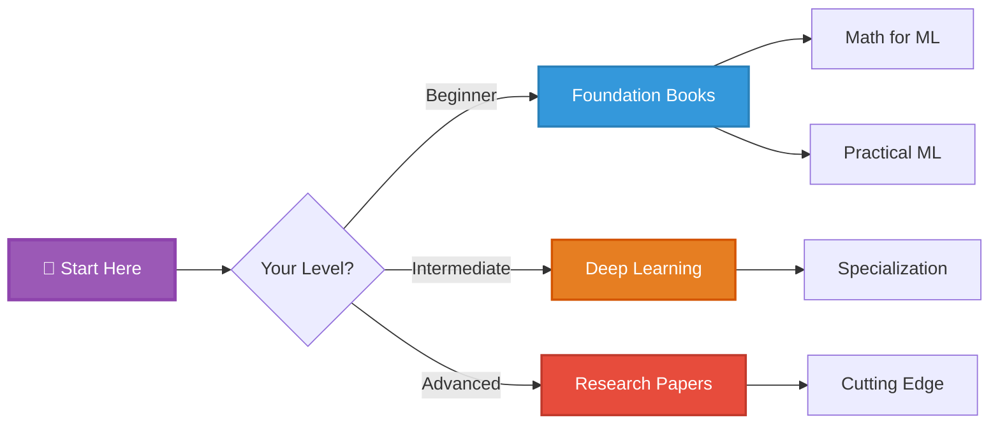
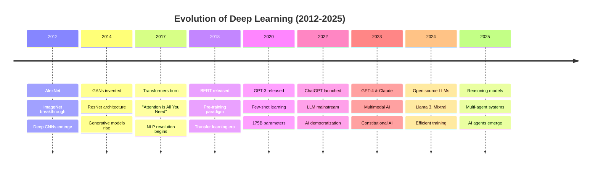
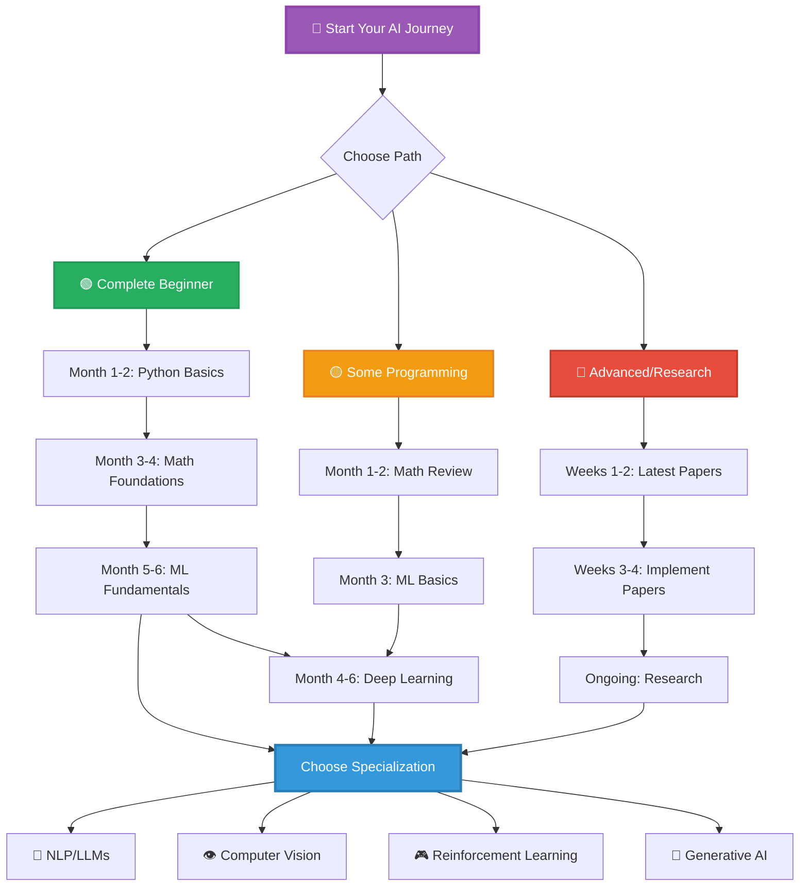
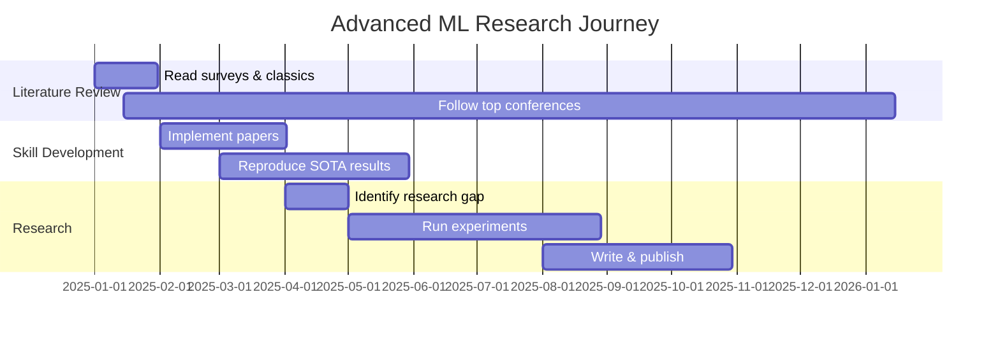
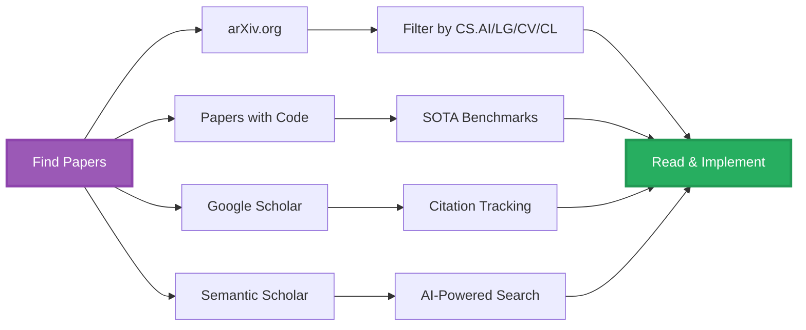
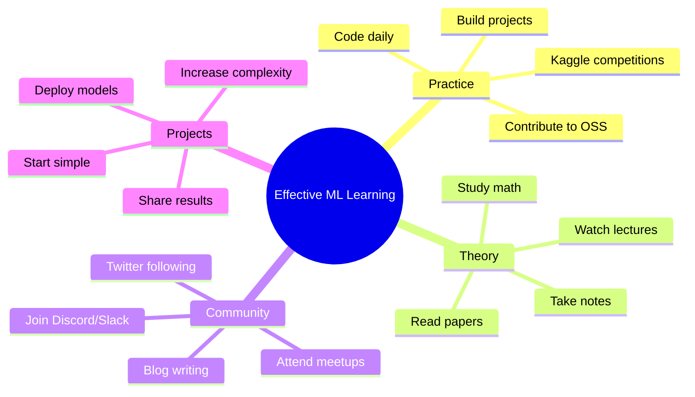
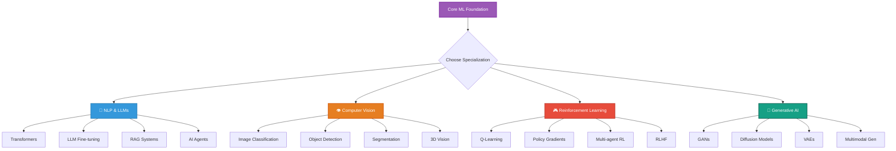
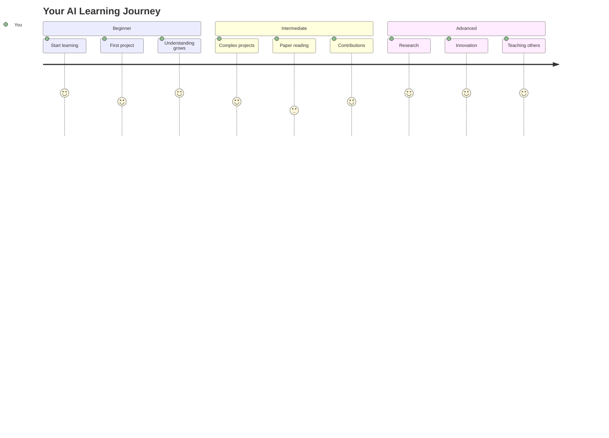

<div align="center">

# 📚 AI/ML Learning Resources Hub

### *Your Complete Guide to Artificial Intelligence & Machine Learning Education*


</div>

---

## 🎯 Quick Navigation



---

## 🏆 Resource Categories

<table>
<tr>
<td width="33%" align="center">

### 📖 Books


Essential textbooks & guides

</td>
<td width="33%" align="center">

### 📄 Research Papers


Latest breakthroughs

</td>
<td width="33%" align="center">

### 🎓 Online Courses


Structured learning paths

</td>
</tr>
</table>

---

## 📖 Foundation Books Collection

### Mathematics for Machine Learning

<details open>
<summary><b>📐 Mathematical Foundations (Click to expand)</b></summary>

| Book | Authors | Level | Free? | Rating | 2025 Status |
|------|---------|-------|-------|--------|-------------|
| **Mathematics for Machine Learning** | Deisenroth, Faisal, Ong | 🟢 Beginner | ✅ Yes | ⭐⭐⭐⭐⭐ | Still Relevant |
| **The Elements of Statistical Learning** | Hastie, Tibshirani, Friedman | 🟡 Intermediate | ✅ Yes | ⭐⭐⭐⭐⭐ | Classic Reference |
| **Pattern Recognition and Machine Learning** | Christopher Bishop | 🔴 Advanced | ❌ No | ⭐⭐⭐⭐⭐ | Timeless |
| **Probabilistic Machine Learning** (2022) | Kevin Murphy | 🔴 Advanced | ✅ Yes | ⭐⭐⭐⭐⭐ | **NEW 2024 Update** |

**Why These Matter:**
```python
math_foundations = {
    "linear_algebra": {
        "importance": "Critical for understanding neural networks",
        "applications": ["Matrix operations", "Dimensionality reduction", "PCA"],
        "mastery_time": "2-3 months"
    },
    "calculus": {
        "importance": "Essential for optimization and backpropagation",
        "applications": ["Gradient descent", "Loss functions", "Derivatives"],
        "mastery_time": "2-3 months"
    },
    "probability": {
        "importance": "Foundation of all ML algorithms",
        "applications": ["Bayesian inference", "Distributions", "Statistics"],
        "mastery_time": "3-4 months"
    }
}
```

</details>

### Deep Learning Essentials

<details open>
<summary><b>🧠 Deep Learning Books (Click to expand)</b></summary>

#### Classic References

1. **"Deep Learning"** - Goodfellow, Bengio, Courville
   -  
   - 📖 The definitive textbook
   - 🌐 Free online: [deeplearningbook.org](https://www.deeplearningbook.org/)
   - 📚 Covers: Theory, algorithms, applications
   - 🎯 Best for: Graduate students & researchers

2. **"Dive into Deep Learning"** (D2L) - Zhang, Lipton, Li, Smola
   -  
   - 📖 Interactive online book
   - 💻 Code in PyTorch, TensorFlow, JAX
   - 🌐 Free at: [d2l.ai](https://d2l.ai)
   - 🆕 **2024 Update:** Added Transformers, Diffusion Models, LLMs

3. **"Understanding Deep Learning"** (2024) - Simon J.D. Prince
   -  
   - 📖 Modern approach with latest architectures
   - 🌐 Free: [udlbook.github.io](https://udlbook.github.io/udlbook/)
   - 🆕 Includes: Attention, Transformers, Diffusion
   - 🎯 Best for: Modern DL practitioners

#### Practical Guides

| Book | Year | Focus | Code | Level |
|------|------|-------|------|-------|
| **Hands-On Machine Learning** (3rd Ed) | 2024 | Scikit-Learn, Keras, TF | ✅ | 🟢 Beginner |
| **Deep Learning with PyTorch** | 2023 | PyTorch ecosystem | ✅ | 🟡 Intermediate |
| **Practical Deep Learning for Coders** | 2024 | Fast.ai framework | ✅ | 🟢 Beginner |
| **Full Stack Deep Learning** | 2024 | Production ML | ✅ | 🔴 Advanced |

</details>

---

## 📄 Must-Read Research Papers

### 🌟 Foundation Papers (The Classics)



### 📊 Breakthrough Papers by Category

<details>
<summary><b>🖼️ Computer Vision Papers</b></summary>

| Paper | Year | Impact | Citations | 2025 Relevance |
|-------|------|--------|-----------|----------------|
| **AlexNet** - ImageNet Classification | 2012 | ⭐⭐⭐⭐⭐ | 100K+ | Historical |
| **ResNet** - Deep Residual Learning | 2015 | ⭐⭐⭐⭐⭐ | 150K+ | Still Used |
| **Vision Transformer (ViT)** | 2020 | ⭐⭐⭐⭐⭐ | 20K+ | **Active** |
| **CLIP** - Visual-Language Learning | 2021 | ⭐⭐⭐⭐⭐ | 10K+ | **Very Active** |
| **Segment Anything (SAM)** | 2023 | ⭐⭐⭐⭐⭐ | 3K+ | **Cutting Edge** |

```python
# Modern CV Pipeline (2025)
computer_vision_stack_2025 = {
    "image_classification": {
        "models": ["ViT", "Swin Transformer", "ConvNeXt V2"],
        "pre_training": "CLIP, DINOv2",
        "frameworks": "timm (PyTorch Image Models)"
    },
    "object_detection": {
        "models": ["YOLO v9/v10", "RT-DETR", "DINO"],
        "trend": "Transformer-based detectors",
        "real_time": "YOLO-NAS, RT-DETR"
    },
    "segmentation": {
        "models": ["Segment Anything (SAM)", "Mask2Former"],
        "innovation": "Foundation models",
        "applications": "Zero-shot segmentation"
    }
}
```

</details>

<details>
<summary><b>💬 NLP & LLM Papers</b></summary>

#### Transformer Era (2017-2020)

1. **"Attention Is All You Need"** (2017) - Vaswani et al.
   - 🎯 Introduced Transformers
   - 📈 Citations: 80K+
   - 🚀 Changed everything in NLP

2. **"BERT"** (2018) - Devlin et al.
   - 🎯 Bidirectional pre-training
   - 📈 Citations: 70K+
   - 💡 Masked language modeling

#### LLM Era (2020-2025)

| Model/Paper | Year | Parameters | Key Innovation | Status |
|-------------|------|------------|----------------|--------|
| GPT-3 | 2020 | 175B | In-context learning | Active |
| PaLM | 2022 | 540B | Pathways architecture | Superseded |
| LLaMA | 2023 | 7B-65B | Open source efficiency | **Very Active** |
| GPT-4 | 2023 | ~1.7T | Multimodal | Active |
| Claude 3 | 2024 | Unknown | Constitutional AI | **Active** |
| Llama 3 | 2024 | 8B-405B | Open source SOTA | **Very Active** |
| Mixtral 8x22B | 2024 | 176B | Sparse MoE | **Active** |

#### 🆕 2024-2025 Breakthrough Papers

```markdown
## Reasoning & Agents
1. **"Chain-of-Thought Prompting Elicits Reasoning"** (2022, still highly cited)
   - Improved complex reasoning
   - Simple yet effective
   - Foundation for many techniques

2. **"Tree of Thoughts"** (2023)
   - Structured reasoning
   - Better problem solving
   - Used in modern agents

3. **"ReAct: Synergizing Reasoning and Acting"** (2023)
   - LLMs as agents
   - Tool use integration
   - Multi-step planning

## Efficiency & Training
4. **"QLoRA: Efficient Finetuning of Quantized LLMs"** (2023)
   - 4-bit quantization
   - Democratized fine-tuning
   - Run 70B models on consumer GPUs

5. **"Flash Attention 2"** (2023)
   - 2-4x faster inference
   - Memory efficient
   - Industry standard

6. **"Mixture of Experts (MoE) at Scale"** (2024)
   - Sparse activation
   - Better parameter efficiency
   - Powers Mixtral, GPT-4
```

</details>

<details>
<summary><b>🎨 Generative AI Papers</b></summary>

#### Diffusion Models

| Paper | Year | Innovation | Applications |
|-------|------|-----------|-------------|
| **DDPM** | 2020 | Denoising diffusion | Foundation |
| **Stable Diffusion** | 2022 | Latent diffusion | Image generation |
| **DALL-E 2** | 2022 | Text-to-image | AI art |
| **Midjourney v6** | 2024 | Photorealism | Creative AI |
| **SDXL Turbo** | 2024 | Real-time generation | Interactive AI |

#### GANs (Still Relevant in 2025)

- **StyleGAN 3** (2021) - High-quality face generation
- **GigaGAN** (2023) - Fast, large-scale image synthesis
- **Applications:** Video synthesis, super-resolution, editing

</details>

---

## 🎓 Learning Path Roadmap



### 🟢 Beginner Path (6-9 months)

<table>
<tr>
<th>Phase</th>
<th>Duration</th>
<th>Resources</th>
<th>Goals</th>
</tr>
<tr>
<td>

**Phase 1**
*Foundations*

</td>
<td>2-3 months</td>
<td>

- 📖 **Math:** Khan Academy Linear Algebra & Calculus
- 🐍 **Python:** "Python Crash Course" or Codecademy
- 📊 **Stats:** "Think Stats" (free book)

</td>
<td>

✅ Comfortable with Python
✅ Understand vectors/matrices
✅ Basic probability

</td>
</tr>
<tr>
<td>

**Phase 2**
*ML Basics*

</td>
<td>2-3 months</td>
<td>

- 🎓 **Course:** Andrew Ng's ML (Coursera)
- 📖 **Book:** "Hands-On ML" (Géron)
- 💻 **Practice:** Kaggle Learn tracks

</td>
<td>

✅ Implement algorithms
✅ Complete 3+ projects
✅ Kaggle competitions

</td>
</tr>
<tr>
<td>

**Phase 3**
*Deep Learning*

</td>
<td>2-3 months</td>
<td>

- 🎓 **Course:** Fast.ai Practical Deep Learning
- 📖 **Book:** "Dive into Deep Learning"
- 🔬 **Practice:** Build neural networks

</td>
<td>

✅ Train CNNs, RNNs
✅ Use PyTorch/TF
✅ Deploy a model

</td>
</tr>
</table>

### 🟡 Intermediate Path (4-6 months)

```python
intermediate_roadmap = {
    "month_1_2": {
        "focus": "Deep Learning Mastery",
        "resources": [
            "Fast.ai Part 2: Deep Learning Foundations",
            "Stanford CS231n (Computer Vision)",
            "Stanford CS224n (NLP)"
        ],
        "projects": [
            "Image classifier with transfer learning",
            "Text generation with transformers",
            "Object detection system"
        ]
    },

    "month_3_4": {
        "focus": "Specialization",
        "choose_one": {
            "nlp": "Hugging Face Course + fine-tune BERT",
            "cv": "PyTorch Computer Vision + implement ResNet",
            "rl": "Spinning Up in Deep RL + implement DQN"
        },
        "milestone": "Contribute to open source project"
    },

    "month_5_6": {
        "focus": "Advanced Topics & Production",
        "resources": [
            "Full Stack Deep Learning",
            "MLOps courses",
            "Paper implementations"
        ],
        "projects": [
            "Deploy model to production",
            "Reproduce a recent paper",
            "Build end-to-end ML system"
        ]
    }
}
```

### 🔴 Advanced/Research Path



**Key Resources for Researchers:**

1. **Stay Current:**
   - 📰 arXiv-sanity (daily paper digest)
   - 🎥 Yannic Kilcher (paper explanations)
   - 📊 Papers with Code (benchmarks)

2. **Conferences to Follow (2025):**
   - **NeurIPS 2025** (Dec) - Biggest ML conference
   - **ICML 2025** (Jul) - Theory & algorithms
   - **ICLR 2025** (Apr) - Deep learning focus
   - **CVPR 2025** (Jun) - Computer vision
   - **ACL 2025** (Jul) - NLP advances

3. **Research Skills:**
   ```python
   research_workflow = {
       "read_papers": {
           "frequency": "3-5 per week",
           "method": "Three-pass approach",
           "tools": ["Zotero", "Notion", "Obsidian"]
       },
       "implement": {
           "focus": "Reproduce key results",
           "framework": "PyTorch (research standard)",
           "track": "Weights & Biases, MLflow"
       },
       "publish": {
           "start_with": "arXiv preprints",
           "target": "Workshops first, then main conferences",
           "code": "Always release on GitHub"
       }
   }
   ```

---

## 📚 2024-2025 Trending Books

### 🆕 Latest Releases

<table>
<tr>
<td width="50%">

#### **"Generative AI"** by David Foster (2024)


- 🎨 Focus: GANs, VAEs, Diffusion Models
- 💻 Code: TensorFlow & PyTorch
- 🎯 Build: Stable Diffusion from scratch
- ⭐ Rating: 4.8/5

</td>
<td width="50%">

#### **"Build a Large Language Model (From Scratch)"** (2024)


- 🧠 Focus: LLM architecture & training
- 💻 Code: Pure PyTorch
- 🎯 Build: GPT-like model
- ⭐ Rating: 4.9/5

</td>
</tr>
<tr>
<td>

#### **"Machine Learning Engineering"** by Andriy Burkov (2024 Ed)


- 🏭 Focus: Production ML systems
- 📊 Topics: Deployment, monitoring, scaling
- 🎯 For: ML engineers
- ⭐ Rating: 4.7/5

</td>
<td>

#### **"AI Engineering"** by Chip Huyen (2024)


- 🏢 Focus: Real-world AI systems
- 📈 Topics: LLM applications, AI products
- 🎯 For: AI product builders
- ⭐ Rating: 4.9/5

</td>
</tr>
</table>

---

## 🎓 Top Online Courses (2024-2025)

### Course Comparison Matrix

| Course | Provider | Level | Duration | Cost | 2025 Status | Rating |
|--------|----------|-------|----------|------|-------------|--------|
| **Machine Learning Specialization** | Coursera (DeepLearning.AI) | 🟢 Beginner | 3 months | $49/mo | ✅ Updated 2024 | ⭐⭐⭐⭐⭐ |
| **Deep Learning Specialization** | Coursera (DeepLearning.AI) | 🟡 Intermediate | 5 months | $49/mo | ✅ Still Relevant | ⭐⭐⭐⭐⭐ |
| **Practical Deep Learning** | Fast.ai | 🟢 Beginner | 7 weeks | Free | ✅ 2024 Version | ⭐⭐⭐⭐⭐ |
| **CS50's AI with Python** | Harvard (edX) | 🟢 Beginner | 7 weeks | Free | ✅ Updated | ⭐⭐⭐⭐⭐ |
| **Generative AI with LLMs** | Coursera (DeepLearning.AI) | 🟡 Intermediate | 4 weeks | $49/mo | 🆕 NEW 2024 | ⭐⭐⭐⭐⭐ |
| **MLOps Specialization** | Coursera (DeepLearning.AI) | 🔴 Advanced | 4 months | $49/mo | ✅ Updated 2024 | ⭐⭐⭐⭐⭐ |
| **Full Stack Deep Learning** | FSDL | 🔴 Advanced | Self-paced | Free | ✅ 2024 Cohort | ⭐⭐⭐⭐⭐ |
| **Hugging Face Course** | Hugging Face | 🟡 Intermediate | Self-paced | Free | ✅ Always Updated | ⭐⭐⭐⭐⭐ |

### 🆕 2024-2025 New Courses

```python
new_courses_2024_2025 = {
    "llm_focused": [
        {
            "name": "Large Language Models: Application through Production",
            "provider": "Databricks Academy",
            "focus": "Building LLM applications",
            "free": True,
            "link": "databricks.com/learn/training/llm"
        },
        {
            "name": "Building LLM Applications",
            "provider": "Weights & Biases",
            "focus": "Prompt engineering, RAG, fine-tuning",
            "free": True,
            "status": "New 2024"
        }
    ],

    "ai_agents": [
        {
            "name": "AI Agents in LangGraph",
            "provider": "DeepLearning.AI",
            "focus": "Building autonomous agents",
            "free": True,
            "status": "🆕 NEW Dec 2024"
        },
        {
            "name": "Functions, Tools and Agents with LangChain",
            "provider": "DeepLearning.AI",
            "focus": "LLM tool use",
            "free": True
        }
    ],

    "diffusion_models": [
        {
            "name": "How Diffusion Models Work",
            "provider": "DeepLearning.AI",
            "focus": "Build diffusion models from scratch",
            "free": True,
            "status": "2024"
        }
    ]
}
```

---

## 💻 Interactive Learning Resources

### 🎮 Hands-On Platforms

<table>
<tr>
<th>Platform</th>
<th>Focus</th>
<th>Best For</th>
<th>Pricing</th>
</tr>
<tr>
<td>

**Kaggle Learn**


</td>
<td>Micro-courses + competitions</td>
<td>Practical skills, datasets</td>
<td>✅ Free</td>
</tr>
<tr>
<td>

**Google Colab**


</td>
<td>Jupyter notebooks</td>
<td>Experimentation</td>
<td>Free (Pro: $10/mo)</td>
</tr>
<tr>
<td>

**Paperspace Gradient**


</td>
<td>Cloud notebooks</td>
<td>Training models</td>
<td>Free tier + paid</td>
</tr>
<tr>
<td>

**Lightning AI Studio**


</td>
<td>Cloud development</td>
<td>Collaborative ML</td>
<td>Free tier</td>
</tr>
<tr>
<td>

**Hugging Face Spaces**


</td>
<td>Model demos</td>
<td>Sharing & testing</td>
<td>✅ Free</td>
</tr>
</table>

### 📱 Mobile Learning Apps (2025)

- **Brilliant** - Interactive ML courses (Premium)
- **DataCamp** - Bite-sized lessons (Freemium)
- **Mimo** - Python for ML (Premium)
- **Educative** - Text-based courses (Subscription)

---

## 🔬 Research Paper Resources

### Where to Find Papers



### 📖 How to Read Research Papers

```python
def read_research_paper(paper_pdf):
    """Three-pass reading strategy for efficiency"""

    # PASS 1: Quick Scan (5-10 minutes)
    first_pass = {
        "read": [
            "Title & Abstract",
            "Introduction (skim)",
            "Section headings",
            "Conclusions",
            "Figures/Tables"
        ],
        "goal": "Is this paper relevant?",
        "decision": "Continue to Pass 2 or skip"
    }

    # PASS 2: Deeper Read (1 hour)
    second_pass = {
        "read": [
            "Full paper (except math proofs)",
            "Focus on methodology",
            "Study figures carefully",
            "Mark key references"
        ],
        "goal": "Understand main contribution",
        "notes": "Take detailed notes",
        "decision": "Is implementation needed?"
    }

    # PASS 3: Deep Understanding (4-5 hours)
    third_pass = {
        "read": "Every detail including proofs",
        "do": [
            "Verify all claims",
            "Check math",
            "Think about improvements",
            "Attempt reproduction"
        ],
        "goal": "Could I reimplement this?",
        "output": "Full understanding + code"
    }

    return first_pass, second_pass, third_pass

# Paper organization tools
paper_management = {
    "reference_managers": ["Zotero (free)", "Mendeley", "Paperpile"],
    "note_taking": ["Notion", "Obsidian", "Roam Research"],
    "search_tools": ["Connected Papers", "Semantic Scholar", "Google Scholar"]
}
```

---

## 🌟 Study Tips & Best Practices

### 🧠 Effective Learning Strategies



### ⏱️ Optimal Study Schedule

<table>
<tr>
<th>Time Available</th>
<th>Recommended Split</th>
<th>Focus Areas</th>
</tr>
<tr>
<td>

**1-2 hours/day**
*(Casual learner)*

</td>
<td>

- 40% Video courses
- 40% Hands-on coding
- 20% Reading

</td>
<td>

- One course at a time
- Small projects
- Daily consistency

</td>
</tr>
<tr>
<td>

**3-4 hours/day**
*(Serious learner)*

</td>
<td>

- 30% Theory/Reading
- 50% Coding/Projects
- 20% Community/Papers

</td>
<td>

- Complete courses
- Build portfolio
- Start competitions

</td>
</tr>
<tr>
<td>

**5+ hours/day**
*(Full-time study)*

</td>
<td>

- 25% Theory
- 50% Implementation
- 25% Research/Papers

</td>
<td>

- Paper implementations
- Research contributions
- Advanced projects

</td>
</tr>
</table>

### 📝 Active Learning Techniques

```python
active_learning_methods = {
    "feynman_technique": {
        "step_1": "Choose a concept to learn",
        "step_2": "Teach it to a 12-year-old (in writing)",
        "step_3": "Identify gaps in your explanation",
        "step_4": "Review and simplify",
        "benefit": "Deep understanding"
    },

    "project_based": {
        "method": "Learn by building",
        "examples": [
            "Build image classifier before theory",
            "Create chatbot while learning NLP",
            "Make recommender system for practice"
        ],
        "benefit": "Practical skills + motivation"
    },

    "spaced_repetition": {
        "tool": "Anki for ML concepts",
        "schedule": "Review: 1 day, 3 days, 7 days, 30 days",
        "cards_for": "Math formulas, algorithms, paper key points",
        "benefit": "Long-term retention"
    },

    "peer_learning": {
        "activities": [
            "Study groups (online/offline)",
            "Code reviews on GitHub",
            "Explain concepts on forums",
            "Pair programming"
        ],
        "platforms": ["Reddit r/MachineLearning", "MLOps Discord", "AI alignment forums"]
    }
}
```

---

## 🎯 Specialization Tracks

### Choose Your Path



### 💬 NLP/LLM Specialization Resources

<details>
<summary><b>📚 Books & Courses (Click to expand)</b></summary>

**Books:**
- "Speech and Language Processing" - Jurafsky & Martin (3rd Ed, 2024)
- "Natural Language Processing with Transformers" - Tunstall et al. (2022)
- "Build a Large Language Model From Scratch" (2024) 🆕

**Courses:**
- Stanford CS224N (2024) - FREE
- Hugging Face NLP Course - FREE
- DeepLearning.AI: Generative AI with LLMs - $49

**Key Papers:**
- Attention Is All You Need
- BERT, GPT-3, LLaMA 2/3
- Constitutional AI (Anthropic)

</details>

### 👁️ Computer Vision Resources

<details>
<summary><b>📚 Books & Courses (Click to expand)</b></summary>

**Books:**
- "Computer Vision: Algorithms and Applications" - Szeliski (2nd Ed, 2022)
- "Deep Learning for Computer Vision" - Rajalingappaa Shanmugamani

**Courses:**
- Stanford CS231n (2024) - FREE
- PyImageSearch University - Subscription
- Fast.ai Part 1 - FREE

**Key Papers:**
- Vision Transformer (ViT)
- Segment Anything (SAM)
- CLIP, DINOv2

</details>

---

## 📊 Resource Comparison Tables

### Python ML Libraries Comparison (2025)

| Library | Best For | Ease of Use | Performance | Community | 2025 Trend |
|---------|----------|-------------|-------------|-----------|------------|
| **PyTorch** | Research, flexibility | 🟡 Medium | ⭐⭐⭐⭐⭐ | Huge | ↗️ Growing |
| **TensorFlow** | Production, deployment | 🟡 Medium | ⭐⭐⭐⭐⭐ | Huge | → Stable |
| **JAX** | High performance, research | 🔴 Hard | ⭐⭐⭐⭐⭐ | Growing | ↗️ Growing |
| **Scikit-learn** | Traditional ML | 🟢 Easy | ⭐⭐⭐⭐ | Huge | → Stable |
| **Hugging Face** | NLP, pre-trained models | 🟢 Easy | ⭐⭐⭐⭐⭐ | Huge | ↗️↗️ Exploding |
| **Lightning** | PyTorch wrapper | 🟢 Easy | ⭐⭐⭐⭐⭐ | Growing | ↗️ Growing |

### Online Course Platforms Comparison

| Platform | Content Quality | Price | Certificates | Hands-on | Best For |
|----------|----------------|-------|--------------|----------|----------|
| **Coursera** | ⭐⭐⭐⭐⭐ | $$ | ✅ Recognized | 🟡 Some | Structured learning |
| **Fast.ai** | ⭐⭐⭐⭐⭐ | Free | ❌ No | ✅ Very | Practical skills |
| **DeepLearning.AI** | ⭐⭐⭐⭐⭐ | $$ | ✅ Yes | ✅ Yes | Industry skills |
| **Kaggle Learn** | ⭐⭐⭐⭐ | Free | ✅ Yes | ✅ Very | Quick start |
| **YouTube** | ⭐⭐⭐⭐ | Free | ❌ No | ❌ No | Supplementary |
| **Udemy** | ⭐⭐⭐ | $ | ✅ Yes | 🟡 Varies | Budget option |

---

## 🚀 Next Steps & Action Items

### Your 30-Day Quick Start

```python
quick_start_plan = {
    "week_1": {
        "goal": "Environment setup + basics",
        "tasks": [
            "✅ Install Python & Jupyter",
            "✅ Set up GitHub account",
            "✅ Complete Python refresher",
            "✅ Start Andrew Ng's ML course"
        ],
        "time": "1-2 hours/day"
    },

    "week_2": {
        "goal": "First ML project",
        "tasks": [
            "✅ Finish ML course weeks 1-2",
            "✅ Kaggle: Titanic competition",
            "✅ Implement linear regression",
            "✅ Join ML Discord/Slack"
        ],
        "time": "2-3 hours/day"
    },

    "week_3": {
        "goal": "Deep learning intro",
        "tasks": [
            "✅ Start Fast.ai course",
            "✅ Build image classifier",
            "✅ Read 'Attention is All You Need'",
            "✅ Experiment with Hugging Face"
        ],
        "time": "2-3 hours/day"
    },

    "week_4": {
        "goal": "Portfolio project",
        "tasks": [
            "✅ Choose specialization area",
            "✅ Build end-to-end project",
            "✅ Deploy to Hugging Face Spaces",
            "✅ Write blog post about learning"
        ],
        "time": "3-4 hours/day"
    }
}
```

---

## 📚 Additional Resources

### 🎙️ Podcasts (2024-2025)

- **Latent Space** - LLM & AI engineering (🆕 NEW)
- **The TWIML AI Podcast** - Industry applications
- **Gradient Descent** - Conversational AI deep dives
- **Lex Fridman** - AI researchers interviews
- **Machine Learning Street Talk** - Technical discussions

### 📰 Newsletters to Subscribe

- **The Batch** (DeepLearning.AI) - Weekly AI news
- **TLDR AI** - Daily AI updates
- **Import AI** - Policy + technical
- **AlphaSignal** - ML research highlights
- **Ahead of AI** - Trends & tools

### 🐦 Twitter/X Accounts to Follow

```python
ml_influencers_2025 = {
    "researchers": [
        "@ylecun", "@karpathy", "@AndrewYNg",
        "@goodfellow_ian", "@DrJimFan"
    ],
    "educators": [
        "@jeremyphoward", "@math_rachel",
        "@weights_biases", "@huggingface"
    ],
    "ai_companies": [
        "@OpenAI", "@AnthropicAI", "@DeepMind",
        "@MetaAI", "@GoogleAI"
    ],
    "explainers": [
        "@_akhaliq", "@omarsar0",
        "@TivadarDanka", "@svpino"
    ]
}
```

---

## 🎓 University Free Resources

### Top University Courses (All Free!)

| University | Course | Focus | Format |
|------------|--------|-------|--------|
| **Stanford** | CS229 | Machine Learning | Videos + Notes |
| **Stanford** | CS231n | Computer Vision | Videos + Assignments |
| **Stanford** | CS224n | NLP | Videos + Projects |
| **MIT** | 6.S191 | Intro to Deep Learning | Videos + Labs |
| **Berkeley** | CS188 | Artificial Intelligence | Full materials |
| **CMU** | 11-785 | Deep Learning | Videos + Homework |
| **NYU** | DS-GA 1008 | Deep Learning | Videos + Labs |

---

<div align="center">

## 🌟 Final Thoughts

> *"The best time to start learning AI was 5 years ago. The second best time is NOW."*

### Your Learning Journey Starts Here



---

### 📬 Stay Connected

<table>
<tr>
<td align="center">

**💡 Questions?**

Open an issue

</td>
<td align="center">

**🤝 Contribute**

Submit PR

</td>
<td align="center">

**⭐ Helpful?**

Star this repo

</td>
</tr>
</table>

---

**Last Updated:** January 2025 | **Maintained by:** Community Contributors

**License:** MIT | **Status:** 

</div>

---

*Remember: Consistency beats intensity. Small daily progress compounds into expertise. Happy learning!* 🚀📚
