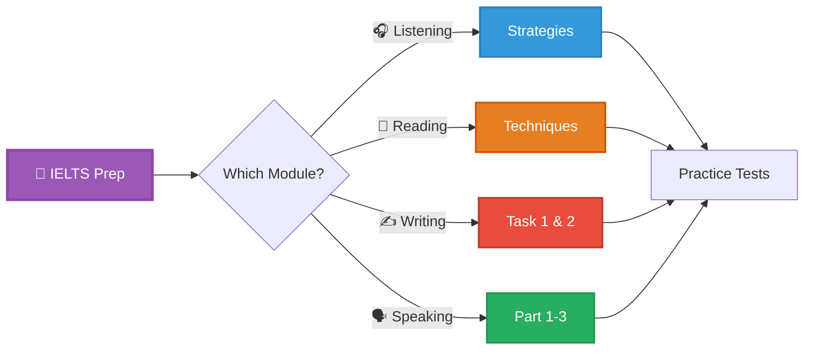
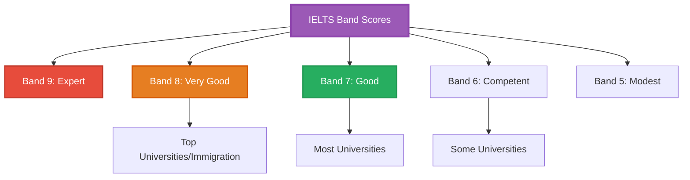
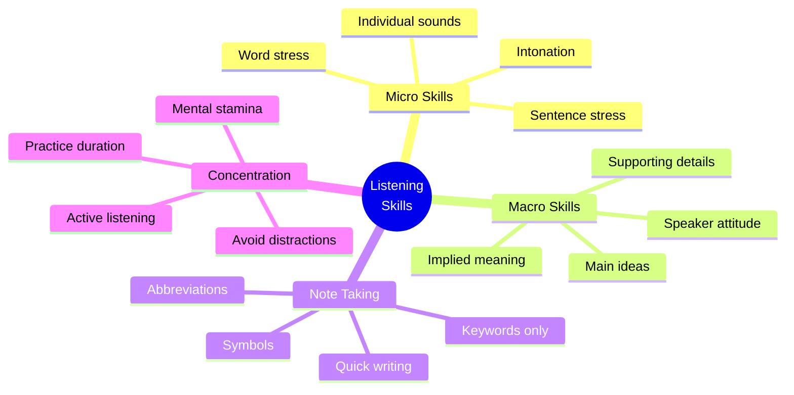
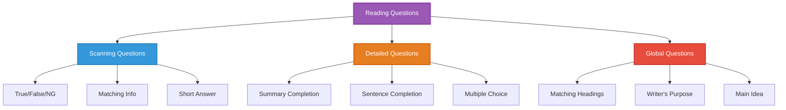
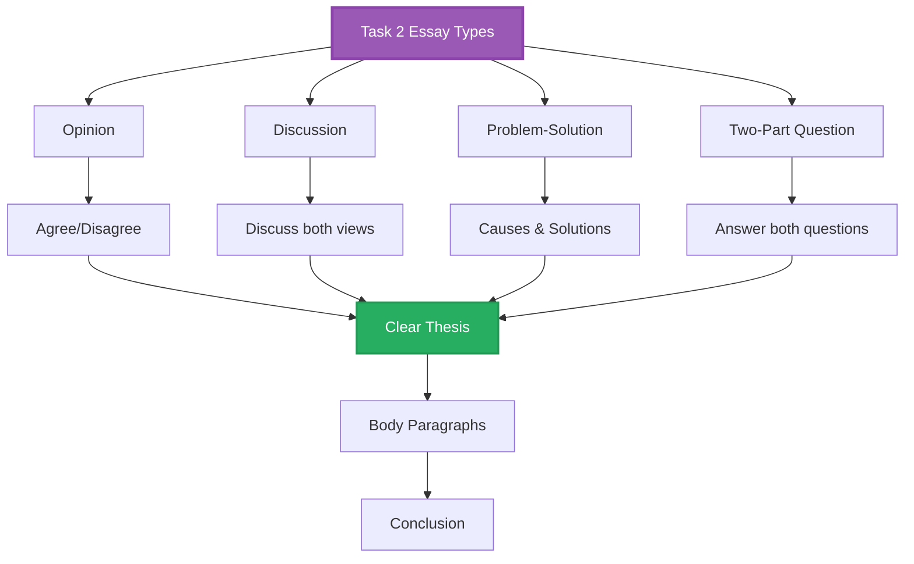
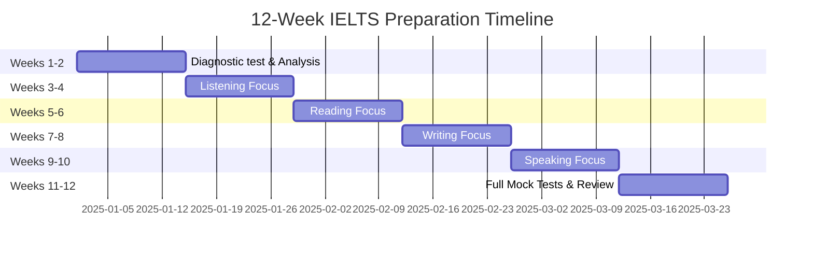
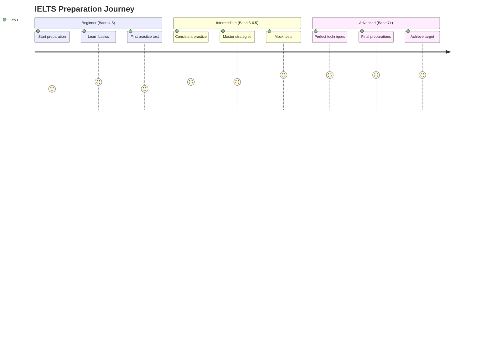

<div align="center">

# 📚 IELTS Mastery Hub 2025

### *Your Complete Guide to IELTS Success - Academic & General Training*


</div>

---

## 🎯 Quick Navigation



---

## 📊 IELTS Overview

### Test Format Comparison

<table>
<tr>
<th>Module</th>
<th>Duration</th>
<th>Questions/Tasks</th>
<th>Focus</th>
<th>Scoring</th>
</tr>
<tr>
<td><b>🎧 Listening</b></td>
<td>30 + 10 min</td>
<td>40 questions</td>
<td>4 sections (increasing difficulty)</td>
<td>0.5 band increments</td>
</tr>
<tr>
<td><b>📖 Reading</b></td>
<td>60 minutes</td>
<td>40 questions</td>
<td>3 passages</td>
<td>0.5 band increments</td>
</tr>
<tr>
<td><b>✍️ Writing</b></td>
<td>60 minutes</td>
<td>2 tasks</td>
<td>Task 1 (150w) + Task 2 (250w)</td>
<td>Whole bands</td>
</tr>
<tr>
<td><b>🗣️ Speaking</b></td>
<td>11-14 minutes</td>
<td>3 parts</td>
<td>Face-to-face interview</td>
<td>Whole bands</td>
</tr>
</table>

### Band Score Requirements



---

## 🎧 Listening Module

### Question Types & Strategies

<details open>
<summary><b>💡 Master All 10 Question Types</b></summary>

| Type | Difficulty | Strategy | Band 7+ Tips |
|------|------------|----------|--------------|
| **Multiple Choice** | 🟡 Medium | Eliminate wrong answers first | Listen for paraphrasing |
| **Matching** | 🔴 Hard | Scan all options before audio | Note relationships |
| **Plan/Map** | 🟡 Medium | Study diagram during preview | Follow directional language |
| **Form/Note Completion** | 🟢 Easy | Predict word types | Check spelling carefully |
| **Sentence Completion** | 🟡 Medium | Grammar must match | Word limit crucial |
| **Summary Completion** | 🟡 Medium | Understand context | Synonyms likely |
| **Short Answer** | 🟢 Easy | Stay within word limit | Write legibly |
| **Classification** | 🔴 Hard | Understand categories | Fast note-taking |
| **Labeling** | 🟡 Medium | Familiarize with diagram | Listen for sequence words |
| **Table Completion** | 🟢 Easy | Note column/row headers | Predict information type |

</details>

### Listening Skills Development



### Practice Resources (2024-2025)

| Resource | Type | Cost | Band Focus | 2025 Status |
|----------|------|------|------------|-------------|
| **Cambridge IELTS 15-19** | Official | $$ | All levels | 🔥 Latest editions |
| **IELTS Liz YouTube** | Free practice | Free | 6-9 | ✅ Updated regularly |
| **British Council Practice** | Online tests | Free | All levels | ✅ Official |
| **IELTS Advantage** | App | $ subscription | 7+ | ↗️ Growing |

---

## 📖 Reading Module

### Reading Strategies (Band 7+)

<details open>
<summary><b>⚡ Advanced Techniques for High Scores</b></summary>

#### Time Management Strategy

```python
reading_time_allocation = {
    "per_passage": {
        "skim": "3 minutes",
        "answer": "15 minutes",
        "review": "2 minutes",
        "total": "20 minutes"
    },

    "difficulty_strategy": {
        "easy_passage": "Start here (18 mins)",
        "medium_passage": "Second (20 mins)",
        "hard_passage": "Last (22 mins if time)"
    },

    "pro_tips": [
        "Always attempt all questions",
        "No negative marking",
        "Educated guesses are fine",
        "Transfer answers carefully - NO extra time!"
    ]
}
```

#### Question Type Mastery



#### True/False/Not Given Strategy

| Answer | Meaning | How to Identify |
|--------|---------|-----------------|
| **TRUE** | Statement agrees with passage | Exact match or paraphrase |
| **FALSE** | Statement contradicts passage | Opposite meaning found |
| **NOT GIVEN** | No information in passage | Missing from text entirely |

**Common Mistakes:**
- ❌ Using outside knowledge
- ❌ Making assumptions
- ❌ Mixing up False and Not Given

**Pro Tips:**
- ✅ Scan for keywords first
- ✅ Look for paraphrasing
- ✅ If unsure between False/NG → usually NOT GIVEN

</details>

---

## ✍️ Writing Module

### Task 1: Academic (Report Writing)

<details open>
<summary><b>📊 Master Graphs, Charts, and Diagrams</b></summary>

#### Structure Template (150+ words, 20 minutes)

```markdown
## Task 1 Perfect Structure (Band 7+)

### Introduction (1 sentence - 15 words)
Paraphrase the question
Example: "The graph illustrates..." → "The chart demonstrates..."

### Overview (2-3 sentences - 40 words)
- Most striking/significant features
- Main trends (increasing, decreasing, stable)
- NO specific data in overview

### Body Paragraph 1 (50-60 words)
- First set of data details
- Specific figures with comparisons
- Time references

### Body Paragraph 2 (50-60 words)
- Remaining details
- Contrasts and exceptions
- Final data points
```

#### Vocabulary for Trends (Band 7-9)

<table>
<tr>
<th>Trend</th>
<th>Verbs</th>
<th>Nouns</th>
<th>Adverbs (Speed)</th>
</tr>
<tr>
<td><b>⬆️ Increase</b></td>
<td>rise, grow, climb, surge, soar, rocket</td>
<td>a rise, growth, increase, surge</td>
<td>sharply, dramatically, significantly, gradually</td>
</tr>
<tr>
<td><b>⬇️ Decrease</b></td>
<td>fall, drop, decline, plummet, plunge, dip</td>
<td>a fall, drop, decline, decrease</td>
<td>sharply, steeply, slightly, marginally</td>
</tr>
<tr>
<td><b>➡️ Stable</b></td>
<td>remain stable, level off, plateau</td>
<td>stability, plateau</td>
<td>consistently, steadily</td>
</tr>
<tr>
<td><b>↕️ Fluctuate</b></td>
<td>fluctuate, vary, oscillate</td>
<td>fluctuation, variation</td>
<td>erratically, considerably</td>
</tr>
</table>

#### Sample Task 1 Response (Band 8)

```
The line graph illustrates the changes in the consumption of three types of meat (chicken,
beef, and lamb) in a European country between 1979 and 2004.

Overall, chicken consumption experienced a dramatic rise over the period, while beef and lamb
showed declining trends. By 2004, chicken had become the most popular meat, overtaking both
beef and lamb.

In 1979, beef was the most consumed meat at approximately 220 grams per person per week,
compared to around 150 grams for lamb and just under 150 grams for chicken. Over the next
decade, beef consumption peaked at roughly 240 grams in 1983 before beginning a steady
decline to about 100 grams by 2004.

Conversely, chicken consumption showed a markedly different pattern, rising consistently
throughout the entire period from 150 grams to peak at approximately 250 grams in 2004.
Meanwhile, lamb consumption followed a downward trajectory, falling gradually from 150 grams
to around 60 grams per person per week by the end of the period.
```

</details>

### Task 2: Opinion Essay (Band 7-9)



### Writing Skills Comparison

| Skill | Band 6 | Band 7 | Band 8-9 |
|-------|--------|--------|----------|
| **Task Achievement** | Addresses task | Fully develops ideas | Sophisticated ideas, fully extended |
| **Coherence** | Basic linking | Clear progression | Skillful cohesion throughout |
| **Vocabulary** | Adequate range | Less common vocab | Wide range with precision |
| **Grammar** | Mix of simple/complex | Variety with accuracy | Full range, error-free |

---

## 🗣️ Speaking Module

### Test Structure & Scoring

<details open>
<summary><b>💬 Master All 3 Parts</b></summary>

#### Part 1: Introduction & Interview (4-5 min)

**Topics:**
- Home, family, work, studies
- Hobbies, interests, daily routine
- Likes/dislikes, preferences

**Strategy:**
```python
part1_strategy = {
    "answer_length": "2-3 sentences per question",

    "structure": {
        "answer": "Direct answer to question",
        "extend": "Add reason or example",
        "extra": "Personal detail (optional)"
    },

    "example": {
        "Q": "Do you like reading?",
        "answer": "Yes, I really enjoy reading.",
        "extend": "I usually read before bed because it helps me relax.",
        "extra": "My favorite genre is science fiction."
    },

    "avoid": [
        "One-word answers",
        "Memorized responses",
        "Off-topic rambling"
    ]
}
```

#### Part 2: Individual Long Turn (3-4 min)

**Format:**
- 1 minute preparation
- 2 minutes speaking
- Topic card with prompts

**Cue Card Structure:**
```markdown
TOPIC CARD: Describe a person who has influenced you

You should say:
- Who this person is
- How you know them
- What they have done
- And explain how they influenced you

PREPARATION NOTES (1 minute):
┌─────────────────────────────────┐
│ Who: Uncle Tom - entrepreneur   │
│ How: Family, known since birth  │
│ What: Started tech company      │
│ Why: Taught me persistence      │
│ Examples: Business failures →   │
│           final success          │
└─────────────────────────────────┘
```

#### Part 3: Two-Way Discussion (4-5 min)

**Characteristics:**
- Abstract topics related to Part 2
- Opinion, analysis, speculation questions
- More complex vocabulary expected

**Sample Questions & Answers (Band 8):**

| Question Type | Example | Band 8 Response Starter |
|---------------|---------|-------------------------|
| **Opinion** | "Is technology good for society?" | "I'd say it's a double-edged sword. While technology has..." |
| **Comparison** | "How has education changed?" | "There's been a significant shift from... whereas nowadays..." |
| **Prediction** | "What will cities look like in future?" | "It's quite likely that urban areas will become increasingly..." |
| **Problem-solving** | "How can we reduce pollution?" | "There are several approaches we could take. Perhaps the most effective..." |

</details>

### Fluency Phrases (Band 7-9)

```python
speaking_phrases = {
    "introducing_topic": [
        "That's an interesting question. I think...",
        "Well, there are several ways to look at this...",
        "From my perspective, I'd say..."
    ],

    "organizing_ideas": [
        "There are three main reasons for this...",
        "On the one hand... On the other hand...",
        "Let me explain what I mean by that..."
    ],

    "giving_examples": [
        "For instance, ...",
        "A good illustration of this would be...",
        "Take ... for example"
    ],

    "expressing_opinion": [
        "In my view, ...",
        "I strongly believe that...",
        "From my experience, ..."
    ],

    "speculating": [
        "It's quite possible that...",
        "I imagine that...",
        "It could be argued that..."
    ],

    "buying_time": [  # Natural, don't overuse
        "That's a good question. Let me think...",
        "Well, I've never really thought about it, but...",
        "Hmm, that's an interesting point..."
    ]
}
```

---

## 📅 Study Plans

### 12-Week Intensive Plan



### Daily Study Routine

| Time Available | Listening | Reading | Writing | Speaking |
|----------------|-----------|---------|---------|----------|
| **2 hours/day** | 30 min | 45 min | 30 min | 15 min |
| **3 hours/day** | 45 min | 60 min | 45 min | 30 min |
| **4+ hours/day** | 60 min | 90 min | 60 min | 30-45 min |

---

## 📱 Digital Resources (2025)

### Top Apps & Platforms

<table>
<tr>
<th>Resource</th>
<th>Type</th>
<th>Cost</th>
<th>Best For</th>
<th>Rating</th>
</tr>
<tr>
<td><b>IELTS Prep App</b> (British Council)</td>
<td>Mobile App</td>
<td>Free</td>
<td>All modules</td>
<td>⭐⭐⭐⭐⭐</td>
</tr>
<tr>
<td><b>IELTS Liz</b></td>
<td>Website/YouTube</td>
<td>Free</td>
<td>Tips & strategies</td>
<td>⭐⭐⭐⭐⭐</td>
</tr>
<tr>
<td><b>IELTS Simon</b></td>
<td>Website/Blog</td>
<td>Free/Premium</td>
<td>Writing & speaking</td>
<td>⭐⭐⭐⭐⭐</td>
</tr>
<tr>
<td><b>Cambridge One</b></td>
<td>Platform</td>
<td>$$</td>
<td>Practice tests</td>
<td>⭐⭐⭐⭐⭐</td>
</tr>
<tr>
<td><b>BBC Learning English</b></td>
<td>Website/App</td>
<td>Free</td>
<td>General improvement</td>
<td>⭐⭐⭐⭐</td>
</tr>
</table>

---

## 💡 Test Day Tips

### Before the Test

```markdown
## Night Before
✅ Prepare all documents (ID, confirmation)
✅ Check test location & transport
✅ Get 7-8 hours sleep
✅ Light, healthy dinner

## Morning Of
✅ Healthy breakfast (not too heavy)
✅ Arrive 30 minutes early
✅ Bring water & snacks
✅ Stay calm & confident

## What to Bring
✅ Valid passport/ID
✅ Test confirmation
✅ Pencils & eraser
✅ Water bottle (label removed)
```

### During the Test

<details>
<summary><b>⏰ Module-Specific Strategies</b></summary>

#### 🎧 Listening
- ✅ Use preparation time wisely
- ✅ Write answers as you hear them
- ✅ Check spelling during transfer time (10 minutes)
- ✅ Transfer ALL answers (even guesses)

#### 📖 Reading
- ✅ Start with easiest passage
- ✅ Don't spend too long on one question
- ✅ Attempt ALL questions
- ✅ Transfer answers carefully (NO extra time!)

#### ✍️ Writing
- ✅ Plan Task 2 first (5 minutes)
- ✅ Watch word count (150/250 minimum)
- ✅ Leave 5 minutes to check both tasks
- ✅ Write legibly

#### 🗣️ Speaking
- ✅ Be yourself, be natural
- ✅ Don't memorize answers
- ✅ Ask for clarification if needed
- ✅ Keep talking in Part 2 (2 minutes)

</details>

---

<div align="center">

## 🎯 Your IELTS Success Roadmap



---

### 📊 Band Score Estimator

| Module | Band 5 | Band 6 | Band 7 | Band 8 |
|--------|--------|--------|--------|--------|
| **Listening** | 16/40 | 23/40 | 30/40 | 35/40 |
| **Reading** | 15/40 | 23/40 | 30/40 | 35/40 |
| **Writing** | Basic coherence | Adequate range | Good range, mostly accurate | Wide range, accurate |
| **Speaking** | Basic fluency | Adequate fluency | Good fluency, vocabulary | Fluent, sophisticated |

---

### 🌟 Success Factors

| Factor | Importance | How to Improve |
|--------|------------|----------------|
| **Daily Practice** | ⭐⭐⭐⭐⭐ | 2-4 hours/day, every day |
| **Mock Tests** | ⭐⭐⭐⭐⭐ | Weekly full tests |
| **Vocabulary** | ⭐⭐⭐⭐⭐ | Learn 10-15 words/day |
| **Grammar** | ⭐⭐⭐⭐ | Review and practice daily |
| **Time Management** | ⭐⭐⭐⭐⭐ | Timed practice always |

---

**Last Updated:** January 2025 | **Status:** 

**Good luck with your IELTS preparation!** 🎯📚

</div>

---

*"Success in IELTS comes from consistent practice and strategic preparation."* 🚀✨
