<div align="center">

# 🔬 NLP Research & LLM Mastery Hub

### *From Transformers to Agents: Your Complete NLP Research Guide*


</div>

---

## 🎯 Quick Navigation

```mermaid
graph LR
    A[🚀 Start Here] --> B{Your Goal?}
    B -->|Understand| C[Foundation Papers]
    B -->|Build| D[Implementation]
    B -->|Research| E[Latest Papers]

    C --> F[Transformers]
    C --> G[BERT/GPT]
    D --> H[Hugging Face]
    D --> I[Fine-tuning]
    E --> J[2024-2025 Trends]

    style A fill:#9b59b6,stroke:#8e44ad,stroke-width:3px,color:#fff
    style C fill:#3498db,stroke:#2980b9,stroke-width:2px,color:#fff
    style D fill:#e67e22,stroke:#d35400,stroke-width:2px,color:#fff
    style E fill:#e74c3c,stroke:#c0392b,stroke-width:2px,color:#fff
```



---

## 📊 NLP Evolution Timeline


---

## 📚 Foundation Papers Collection

### 🌟 Essential Reading (Must-Read Papers)

<table>
<tr>
<th>Paper</th>
<th>Year</th>
<th>Impact</th>
<th>Level</th>
<th>Priority</th>
</tr>
<tr>
<td><b>"Attention Is All You Need"</b><br/>Vaswani et al.</td>
<td>2017</td>
<td>⭐⭐⭐⭐⭐<br/>80K+ citations</td>
<td>🔴 Advanced</td>
<td>🔥 MUST READ</td>
</tr>
<tr>
<td><b>"BERT: Pre-training..."</b><br/>Devlin et al.</td>
<td>2018</td>
<td>⭐⭐⭐⭐⭐<br/>70K+ citations</td>
<td>🟡 Intermediate</td>
<td>🔥 MUST READ</td>
</tr>
<tr>
<td><b>"Language Models are Few-Shot Learners"</b><br/>GPT-3 Paper</td>
<td>2020</td>
<td>⭐⭐⭐⭐⭐<br/>15K+ citations</td>
<td>🔴 Advanced</td>
<td>🔥 MUST READ</td>
</tr>
<tr>
<td><b>"Chain-of-Thought Prompting"</b><br/>Wei et al.</td>
<td>2022</td>
<td>⭐⭐⭐⭐⭐<br/>3K+ citations</td>
<td>🟢 Beginner</td>
<td>🆕 Essential 2024</td>
</tr>
</table>

---

## 🏆 Paper Categories & Learning Paths

### 📖 1. Word Representations (Beginner)

<details open>
<summary><b>💡 Click to expand: Word Embeddings Era</b></summary>

#### Key Papers

| Paper | Year | Innovation | Code | Status |
|-------|------|-----------|------|--------|
| **Word2Vec** | 2013 | Skip-gram, CBOW | ✅ | Historical |
| **GloVe** | 2014 | Global vectors | ✅ | Historical |
| **FastText** | 2017 | Subword embeddings | ✅ | Still useful |

```python
# Word2Vec: The Foundation
word2vec_concepts = {
    "skip_gram": {
        "objective": "Predict context from word",
        "pros": ["Works well with small datasets", "Good for rare words"],
        "implementation": "word2vec, gensim"
    },

    "cbow": {
        "objective": "Predict word from context",
        "pros": ["Faster training", "Better for frequent words"],
        "use_case": "Large datasets"
    },

    "key_insight": "Words with similar contexts have similar meanings",

    "example": """
from gensim.models import Word2Vec

# Train Word2Vec
sentences = [["cat", "sat", "mat"], ["dog", "sat", "log"]]
model = Word2Vec(sentences, vector_size=100, window=5, min_count=1)

# Find similar words
similar = model.wv.most_similar('cat', topn=5)

# Word arithmetic
king_vector = model.wv['king'] - model.wv['man'] + model.wv['woman']
# Result ≈ 'queen'
    """
}
```

#### Why This Matters in 2025
- 🎯 **Foundation concept** for modern embeddings
- 📚 **Still used** in specialized domains
- 🧠 **Understanding basis** for contextual embeddings

</details>

### 🧠 2. The Transformer Revolution (Intermediate)

<details open>
<summary><b>🔥 Click to expand: Transformer Architecture Deep Dive</b></summary>

#### The Paper That Changed Everything

**"Attention Is All You Need"** (Vaswani et al., 2017)


#### Key Innovations

| Component | Purpose | Impact |
|-----------|---------|--------|
| **Self-Attention** | Capture long-range dependencies | ⭐⭐⭐⭐⭐ |
| **Multi-Head Attention** | Learn diverse representations | ⭐⭐⭐⭐⭐ |
| **Positional Encoding** | Encode sequence order | ⭐⭐⭐⭐ |
| **Layer Normalization** | Stable training | ⭐⭐⭐⭐ |

```python
# Implementing Self-Attention from Scratch
import torch
import torch.nn as nn
import math

class SelfAttention(nn.Module):
    def __init__(self, embed_dim, num_heads=8):
        super().__init__()
        self.embed_dim = embed_dim
        self.num_heads = num_heads
        self.head_dim = embed_dim // num_heads

        assert self.head_dim * num_heads == embed_dim, "Embed dim must be divisible by num_heads"

        # Query, Key, Value projections
        self.qkv = nn.Linear(embed_dim, embed_dim * 3)
        self.out_proj = nn.Linear(embed_dim, embed_dim)

    def forward(self, x):
        batch_size, seq_len, embed_dim = x.shape

        # Generate Q, K, V
        qkv = self.qkv(x)  # [batch, seq_len, 3 * embed_dim]
        qkv = qkv.reshape(batch_size, seq_len, 3, self.num_heads, self.head_dim)
        qkv = qkv.permute(2, 0, 3, 1, 4)  # [3, batch, heads, seq_len, head_dim]
        q, k, v = qkv[0], qkv[1], qkv[2]

        # Scaled dot-product attention
        scores = torch.matmul(q, k.transpose(-2, -1)) / math.sqrt(self.head_dim)
        attn_weights = torch.softmax(scores, dim=-1)

        # Apply attention to values
        attn_output = torch.matmul(attn_weights, v)

        # Concatenate heads
        attn_output = attn_output.transpose(1, 2).contiguous()
        attn_output = attn_output.reshape(batch_size, seq_len, embed_dim)

        # Final projection
        output = self.out_proj(attn_output)

        return output

# Usage
attention = SelfAttention(embed_dim=512, num_heads=8)
x = torch.randn(2, 10, 512)  # [batch, seq_len, embed_dim]
output = attention(x)
print(f"Output shape: {output.shape}")  # [2, 10, 512]
```

#### 📚 Related Papers (Must Read)

1. **"Transformers are RNNs"** (2020) - Alternative perspective
2. **"Rethinking Attention with Performers"** (2020) - Linear complexity
3. **"Formal Algorithms for Transformers"** (2022) - Mathematical foundations

</details>

### 🚀 3. Pre-training Era: BERT & GPT (Advanced)

<details open>
<summary><b>⚡ Click to expand: BERT vs GPT Paradigms</b></summary>

#### BERT Family (Bidirectional Encoders)


**Key Papers:**

| Model | Innovation | Best For | Paper Impact |
|-------|-----------|----------|--------------|
| **BERT** | Masked LM + NSP | Understanding tasks | ⭐⭐⭐⭐⭐ |
| **RoBERTa** | Remove NSP, more data | Better BERT | ⭐⭐⭐⭐⭐ |
| **ALBERT** | Parameter sharing | Efficiency | ⭐⭐⭐⭐ |
| **DeBERTa** | Disentangled attention | SOTA understanding | ⭐⭐⭐⭐⭐ |

```python
# BERT Fine-tuning Example (2025 Best Practices)
from transformers import (
    AutoModelForSequenceClassification,
    AutoTokenizer,
    TrainingArguments,
    Trainer
)
from datasets import load_dataset
import evaluate

# Load modern BERT variant
model_name = "microsoft/deberta-v3-base"  # State-of-art in 2025
tokenizer = AutoTokenizer.from_pretrained(model_name)
model = AutoModelForSequenceClassification.from_pretrained(
    model_name,
    num_labels=2
)

# Prepare dataset
dataset = load_dataset("imdb")

def tokenize_function(examples):
    return tokenizer(
        examples["text"],
        padding="max_length",
        truncation=True,
        max_length=512
    )

tokenized_datasets = dataset.map(tokenize_function, batched=True)

# Training with modern hyperparameters (2025)
training_args = TrainingArguments(
    output_dir="./results",
    learning_rate=2e-5,
    per_device_train_batch_size=16,
    per_device_eval_batch_size=64,
    num_train_epochs=3,
    weight_decay=0.01,
    evaluation_strategy="epoch",
    save_strategy="epoch",
    load_best_model_at_end=True,
    fp16=True,  # Mixed precision
    gradient_checkpointing=True,  # Save memory
    logging_steps=100,
    warmup_ratio=0.1,  # Learning rate warmup
)

# Metrics
accuracy_metric = evaluate.load("accuracy")
f1_metric = evaluate.load("f1")

def compute_metrics(eval_pred):
    predictions, labels = eval_pred
    predictions = predictions.argmax(axis=-1)
    return {
        **accuracy_metric.compute(predictions=predictions, references=labels),
        **f1_metric.compute(predictions=predictions, references=labels)
    }

# Train
trainer = Trainer(
    model=model,
    args=training_args,
    train_dataset=tokenized_datasets["train"],
    eval_dataset=tokenized_datasets["test"],
    tokenizer=tokenizer,
    compute_metrics=compute_metrics,
)

trainer.train()
```

#### GPT Family (Autoregressive Decoders)


**Breakthrough: In-Context Learning**

```python
# GPT-3 Style Prompting (Few-Shot Learning)
prompt = """
Classify the sentiment of these reviews:

Review: "This movie was amazing! Best film I've seen this year."
Sentiment: Positive

Review: "Terrible waste of time. Don't bother watching."
Sentiment: Negative

Review: "It was okay, nothing special."
Sentiment: Neutral

Review: "Absolutely loved it! The acting was superb."
Sentiment:"""

# GPT will output: "Positive" without any fine-tuning!
```

</details>

### 🆕 4. Modern LLMs (2023-2025)

<details open>
<summary><b>🚀 Click to expand: Open Source vs Closed Source LLMs</b></summary>

#### Landscape Comparison

| Model | Company | Params | Open? | Best For | Release |
|-------|---------|--------|-------|----------|---------|
| **GPT-4** | OpenAI | ~1.7T | ❌ | General tasks | 2023 |
| **Claude 3 Opus** | Anthropic | ? | ❌ | Safety, reasoning | 2024 |
| **Gemini Ultra** | Google | ? | ❌ | Multimodal | 2024 |
| **Llama 3.1** | Meta | 8B-405B | ✅ | Open source SOTA | 2024 |
| **Mixtral 8x22B** | Mistral | 176B | ✅ | Efficient MoE | 2024 |
| **Command R+** | Cohere | 104B | ✅ | RAG | 2024 |
| **Qwen 2.5** | Alibaba | 0.5B-72B | ✅ | Multilingual | 2024 |

#### 🔥 2024-2025 Trending Papers

**Efficiency & Training:**

1. **"QLoRA: Efficient Finetuning of Quantized LLMs"** (2023)
   - 🎯 4-bit quantization
   - 💻 Fine-tune 65B on single GPU
   - 📊 Impact: Democratized LLM fine-tuning

2. **"Flash Attention 2"** (2023)
   - ⚡ 2-4x faster than standard attention
   - 💾 Memory efficient
   - 🏭 Industry standard in 2025

3. **"Mixture of Experts (MoE)"** Papers
   - 📄 "Switch Transformers" (Google, 2021)
   - 📄 "Mixtral of Experts" (Mistral, 2024)
   - 💡 Sparse activation = efficiency

**Reasoning & Planning:**

4. **"Chain-of-Thought Prompting Elicits Reasoning"** (2022)
   ```python
   # Without CoT
   prompt = "Q: 15 + 27 = ?"
   # Answer: 42

   # With CoT
   prompt = """
   Q: 15 + 27 = ?
   A: Let's think step by step.
   15 + 27
   = 10 + 5 + 20 + 7
   = 30 + 12
   = 42
   """
   # Better reasoning, fewer errors!
   ```

5. **"Tree of Thoughts"** (2023)
   - 🌳 Structured exploration
   - 🎯 Better problem solving
   - 🔄 Self-evaluation

6. **"ReAct: Reasoning and Acting"** (2023)
   - 🤖 LLMs as autonomous agents
   - 🛠️ Tool use integration
   - 📊 Multi-step planning

**Alignment & Safety:**

7. **"Constitutional AI"** (Anthropic, 2022)
   - 📜 Value alignment
   - 🛡️ Safety without human feedback
   - 🔍 Self-critique

8. **"Direct Preference Optimization (DPO)"** (2023)
   - 🎯 Simpler than RLHF
   - 📈 Better alignment
   - ⚡ Faster training

</details>

---

## 💻 Implementation Resources

### 🛠️ Modern NLP Stack (2025)


### 📦 Essential Libraries (Updated 2025)

<table>
<tr>
<th>Library</th>
<th>Purpose</th>
<th>Stars</th>
<th>Why Use</th>
</tr>
<tr>
<td>

**🤗 Transformers**


</td>
<td>Pre-trained models</td>
<td>120K+ ⭐</td>
<td>Industry standard, 20K+ models</td>
</tr>
<tr>
<td>

**LangChain**


</td>
<td>LLM applications</td>
<td>80K+ ⭐</td>
<td>RAG, agents, chains</td>
</tr>
<tr>
<td>

**vLLM**


</td>
<td>LLM serving</td>
<td>20K+ ⭐</td>
<td>PagedAttention, 24x faster</td>
</tr>
<tr>
<td>

**Unsloth**


</td>
<td>Fast fine-tuning</td>
<td>10K+ ⭐</td>
<td>2x faster than HF, QLoRA</td>
</tr>
<tr>
<td>

**LlamaIndex**


</td>
<td>Data framework</td>
<td>30K+ ⭐</td>
<td>Best for RAG systems</td>
</tr>
</table>

### 🚀 Quick Start: Build Your First LLM App

```python
# Modern LLM App with RAG (2025 Best Practices)
from langchain.chat_models import ChatOpenAI
from langchain.embeddings import OpenAIEmbeddings
from langchain.vectorstores import Chroma
from langchain.chains import RetrievalQA
from langchain.document_loaders import TextLoader
from langchain.text_splitter import RecursiveCharacterTextSplitter

# 1. Load documents
loader = TextLoader("documents.txt")
documents = loader.load()

# 2. Split into chunks
text_splitter = RecursiveCharacterTextSplitter(
    chunk_size=1000,
    chunk_overlap=200,
    length_function=len,
)
texts = text_splitter.split_documents(documents)

# 3. Create embeddings and vector store
embeddings = OpenAIEmbeddings()
vectorstore = Chroma.from_documents(
    documents=texts,
    embedding=embeddings,
    persist_directory="./chroma_db"
)

# 4. Create retrieval QA chain
llm = ChatOpenAI(model_name="gpt-4", temperature=0)
qa_chain = RetrievalQA.from_chain_type(
    llm=llm,
    chain_type="stuff",
    retriever=vectorstore.as_retriever(
        search_kwargs={"k": 3}
    ),
    return_source_documents=True,
)

# 5. Query
query = "What are the main findings?"
result = qa_chain({"query": query})

print(f"Answer: {result['result']}")
print(f"\nSources:")
for doc in result['source_documents']:
    print(f"- {doc.metadata['source']}")
```

---

## 📊 Research Trends (2024-2025)

### 🔥 Hot Topics


### 📈 Conference Trends (NeurIPS 2024, ICLR 2025)

| Topic | % of Papers | Trend | Key Papers |
|-------|-------------|-------|------------|
| **LLM Efficiency** | 25% | ↗️ Growing | QLoRA, FlashAttn |
| **Reasoning** | 20% | 🔥 Hot | CoT, ToT, ReAct |
| **Multimodal** | 18% | ↗️ Growing | CLIP, Flamingo |
| **Alignment** | 15% | → Stable | RLHF, DPO |
| **RAG/Retrieval** | 12% | ↗️ Growing | RALM, Self-RAG |
| **Agents** | 10% | 🚀 Exploding | AutoGPT, BabyAGI |

---

## 🎓 Learning Roadmap

### 🟢 Beginner Path (3 months)


**Week-by-Week Plan:**

<details>
<summary><b>📅 Click for detailed schedule</b></summary>

**Month 1: Foundations**
- Week 1-2: Python + NLP basics
  - 📖 Read: "Speech and Language Processing" (Ch 1-3)
  - 💻 Practice: NLTK, spaCy basics
- Week 3-4: Traditional NLP
  - 📖 Read: N-grams, POS tagging
  - 💻 Project: Sentiment classifier with bag-of-words

**Month 2: Neural NLP**
- Week 5-6: Word embeddings
  - 📖 Read: Word2Vec, GloVe papers
  - 💻 Practice: Train embeddings with Gensim
- Week 7-8: RNNs for text
  - 📖 Read: Sequence models
  - 💻 Project: Text generation with LSTM

**Month 3: Transformers**
- Week 9-10: Attention & Transformers
  - 📖 Read: "Attention Is All You Need"
  - 💻 Practice: Implement self-attention
- Week 11-12: BERT fine-tuning
  - 📖 Read: BERT paper
  - 💻 Project: Fine-tune BERT for classification

</details>

### 🟡 Intermediate Path (4 months)

<table>
<tr>
<th>Month</th>
<th>Focus</th>
<th>Papers to Read</th>
<th>Projects</th>
</tr>
<tr>
<td>1</td>
<td>Advanced Transformers</td>
<td>

- BERT variants
- GPT-2/3
- T5

</td>
<td>

- Multi-task BERT
- Text generation

</td>
</tr>
<tr>
<td>2</td>
<td>LLM Fine-tuning</td>
<td>

- LoRA
- QLoRA
- PEFT methods

</td>
<td>

- Fine-tune Llama
- Instruction tuning

</td>
</tr>
<tr>
<td>3</td>
<td>Prompting & RAG</td>
<td>

- Chain-of-Thought
- ReAct
- RAG papers

</td>
<td>

- Build RAG system
- Prompt engineering

</td>
</tr>
<tr>
<td>4</td>
<td>Production</td>
<td>

- Serving papers
- Optimization

</td>
<td>

- Deploy LLM app
- Optimize inference

</td>
</tr>
</table>

### 🔴 Advanced/Research Path

```python
research_roadmap = {
    "phase_1_literature": {
        "duration": "1 month",
        "activities": [
            "Read 30+ papers in chosen area",
            "Reproduce 3 key papers",
            "Follow latest arXiv submissions"
        ],
        "conferences": ["ICLR", "NeurIPS", "ACL", "EMNLP"]
    },

    "phase_2_experimentation": {
        "duration": "2-3 months",
        "focus": [
            "Identify research gap",
            "Design experiments",
            "Implement baseline + proposed method",
            "Run ablation studies"
        ],
        "tools": ["Weights & Biases", "PyTorch Lightning", "Hugging Face"]
    },

    "phase_3_publication": {
        "duration": "1-2 months",
        "steps": [
            "Write paper (LaTeX)",
            "Create visualizations",
            "Prepare code release",
            "Submit to conference"
        ],
        "target_venues": [
            "Workshops first (easier acceptance)",
            "Then main conferences"
        ]
    }
}
```

---

## 🌐 Top NLP Resources

### 📰 Stay Updated

**Daily:**
- 📱 [Hugging Face Papers](https://huggingface.co/papers) - Daily top papers
- 🐦 Twitter: @_akhaliq, @omarsar0 (paper summaries)

**Weekly:**
- 📧 [NLP Newsletter](https://nlpnewsletter.substack.com/)
- 🎥 [Yannic Kilcher](https://www.youtube.com/@YannicKilcher) - Paper explanations

**Conferences (2025):**
- 🎓 **ICLR 2025** (April) - Vienna
- 🎓 **ACL 2025** (July) - Bangkok
- 🎓 **NeurIPS 2025** (December) - Vancouver
- 🎓 **EMNLP 2025** (Nov) - TBD

### 🎓 Best Courses (2024-2025)

| Course | Instructor | Institution | Updated | Level |
|--------|-----------|-------------|---------|-------|
| **CS224N** | Chris Manning | Stanford | 2024 | 🟡 Intermediate |
| **Fast.ai NLP** | Jeremy Howard | Fast.ai | 2024 | 🟢 Beginner |
| **HF Course** | HF Team | Hugging Face | Always | 🟢-🟡 Both |
| **LLM Bootcamp** | Charles Frye | FSDL | 2024 | 🟡-🔴 Advanced |

---

<div align="center">

## 🚀 Quick Reference

### 📖 Paper Reading Strategy


### 🛠️ Essential Tools

<table>
<tr>
<td align="center">

**📝 Writing**

LaTeX + Overleaf

</td>
<td align="center">

**📚 References**

Zotero + BetterBibTeX

</td>
<td align="center">

**📊 Experiments**

W&B + MLflow

</td>
<td align="center">

**💻 Code**

GitHub + Papers with Code

</td>
</tr>
</table>

---

### 📬 Community

**Discord Servers:**
- 🤗 Hugging Face Discord (50K+ members)
- 🧠 EleutherAI (Research focused)
- 📊 r/MachineLearning Discord

**Reddit:**
- r/MachineLearning
- r/LanguageTechnology
- r/LocalLLaMA

---

**Last Updated:** January 2025 | **Status:** 

</div>

---

*"In NLP, the only constant is change. Stay curious, keep reading, and build amazing things!"* 🔬🚀
