<div align="center">

# 💻 Modern Software Development Mastery

### *From Code Quality to Production Excellence - 2025 Best Practices*


</div>

---

## 🎯 Quick Navigation

```mermaid
graph LR
    A[🚀 Start Here] --> B{Your Focus?}
    B -->|Code Quality| C[Clean Code]
    B -->|Architecture| D[Design Patterns]
    B -->|Process| E[Methodologies]
    B -->|Production| F[DevOps & Deploy]

    C --> G[SOLID Principles]
    D --> H[Modern Patterns]
    E --> I[Agile 2025]
    F --> J[CI/CD]

    style A fill:#9b59b6,stroke:#8e44ad,stroke-width:3px,color:#fff
    style C fill:#3498db,stroke:#2980b9,stroke-width:2px,color:#fff
    style D fill:#e67e22,stroke:#d35400,stroke-width:2px,color:#fff
    style E fill:#27ae60,stroke:#229954,stroke-width:2px,color:#fff
    style F fill:#e74c3c,stroke:#c0392b,stroke-width:2px,color:#fff
```



---

## 📚 Learning Paths

```mermaid
graph TD
    A[👨‍💻 Software Developer] --> B{Experience Level?}

    B --> C[🟢 Junior<br/>0-2 years]
    B --> D[🟡 Mid-Level<br/>2-5 years]
    B --> E[🔴 Senior<br/>5+ years]

    C --> C1[Clean Code]
    C1 --> C2[Git Basics]
    C2 --> C3[Testing]
    C3 --> C4[First Project]

    D --> D1[Design Patterns]
    D1 --> D2[Architecture]
    D2 --> D3[System Design]
    D3 --> D4[Team Lead]

    E --> E1[Distributed Systems]
    E1 --> E2[Scalability]
    E2 --> E3[Technical Strategy]
    E3 --> E4[Architecture Lead]

    style A fill:#9b59b6,stroke:#8e44ad,stroke-width:3px,color:#fff
    style C fill:#27ae60,stroke:#229954,stroke-width:2px,color:#fff
    style D fill:#f39c12,stroke:#e67e22,stroke-width:2px,color:#fff
    style E fill:#e74c3c,stroke:#c0392b,stroke-width:2px,color:#fff
```



---

## 🏆 Clean Code Principles

### SOLID Principles (2025 Edition)

<details open>
<summary><b>💡 Click to expand: The Foundation of Clean Code</b></summary>

#### Quick Reference Table

| Principle | Meaning | Impact | Difficulty |
|-----------|---------|--------|------------|
| **S**ingle Responsibility | One class = One reason to change | ⭐⭐⭐⭐⭐ | 🟢 Easy |
| **O**pen/Closed | Open for extension, closed for modification | ⭐⭐⭐⭐⭐ | 🟡 Medium |
| **L**iskov Substitution | Subtypes must be substitutable | ⭐⭐⭐⭐ | 🔴 Hard |
| **I**nterface Segregation | Many specific interfaces > one general | ⭐⭐⭐⭐ | 🟢 Easy |
| **D**ependency Inversion | Depend on abstractions, not concretions | ⭐⭐⭐⭐⭐ | 🟡 Medium |

#### Modern Examples (Python & TypeScript)

```python
# ❌ BAD: Violates Single Responsibility
class User:
    def __init__(self, name, email):
        self.name = name
        self.email = email

    def save_to_database(self):  # Database logic
        pass

    def send_welcome_email(self):  # Email logic
        pass

    def generate_report(self):  # Reporting logic
        pass

# ✅ GOOD: Single Responsibility (2025 Best Practice)
from dataclasses import dataclass
from abc import ABC, abstractmethod

@dataclass
class User:
    """Domain model - only user data"""
    name: str
    email: str
    id: str | None = None

class UserRepository(ABC):
    """Handles data persistence"""
    @abstractmethod
    async def save(self, user: User) -> User:
        pass

    @abstractmethod
    async def find_by_id(self, user_id: str) -> User | None:
        pass

class EmailService(ABC):
    """Handles email notifications"""
    @abstractmethod
    async def send_welcome(self, user: User) -> None:
        pass

class ReportGenerator:
    """Handles report generation"""
    def generate_user_report(self, user: User) -> dict:
        return {"name": user.name, "email": user.email}

# Usage with Dependency Injection
class UserService:
    def __init__(
        self,
        repository: UserRepository,
        email_service: EmailService
    ):
        self.repository = repository
        self.email_service = email_service

    async def create_user(self, name: str, email: str) -> User:
        user = User(name=name, email=email)
        user = await self.repository.save(user)
        await self.email_service.send_welcome(user)
        return user
```

#### TypeScript Modern Example (2025)

```typescript
// ✅ Dependency Inversion with Interfaces
interface IPaymentProcessor {
  processPayment(amount: number): Promise<PaymentResult>;
}

interface INotificationService {
  notify(message: string): Promise<void>;
}

// Concrete implementations
class StripePaymentProcessor implements IPaymentProcessor {
  async processPayment(amount: number): Promise<PaymentResult> {
    // Stripe API call
    return { success: true, transactionId: "stripe_123" };
  }
}

class EmailNotificationService implements INotificationService {
  async notify(message: string): Promise<void> {
    console.log(`Email sent: ${message}`);
  }
}

// High-level module depends on abstractions
class OrderService {
  constructor(
    private paymentProcessor: IPaymentProcessor,
    private notificationService: INotificationService
  ) {}

  async placeOrder(amount: number): Promise<void> {
    const result = await this.paymentProcessor.processPayment(amount);

    if (result.success) {
      await this.notificationService.notify(
        `Payment successful: ${result.transactionId}`
      );
    }
  }
}

// Easy to test with mocks!
const orderService = new OrderService(
  new StripePaymentProcessor(),
  new EmailNotificationService()
);
```

</details>

---

## 🏗️ Modern Design Patterns (2025)

### Pattern Comparison Matrix

<table>
<tr>
<th>Pattern</th>
<th>Category</th>
<th>Use Case</th>
<th>Popularity 2025</th>
<th>Difficulty</th>
</tr>
<tr>
<td><b>Singleton</b></td>
<td>Creational</td>
<td>Single instance (use sparingly!)</td>
<td>⚠️ Declining (use DI instead)</td>
<td>🟢 Easy</td>
</tr>
<tr>
<td><b>Factory</b></td>
<td>Creational</td>
<td>Object creation</td>
<td>↗️ Growing</td>
<td>🟢 Easy</td>
</tr>
<tr>
<td><b>Builder</b></td>
<td>Creational</td>
<td>Complex object construction</td>
<td>↗️ Growing</td>
<td>🟡 Medium</td>
</tr>
<tr>
<td><b>Observer</b></td>
<td>Behavioral</td>
<td>Event-driven systems</td>
<td>🔥 Hot (reactive programming)</td>
<td>🟡 Medium</td>
</tr>
<tr>
<td><b>Strategy</b></td>
<td>Behavioral</td>
<td>Algorithm selection</td>
<td>→ Stable</td>
<td>🟢 Easy</td>
</tr>
<tr>
<td><b>Repository</b></td>
<td>Architectural</td>
<td>Data access abstraction</td>
<td>🔥 Essential</td>
<td>🟡 Medium</td>
</tr>
<tr>
<td><b>CQRS</b></td>
<td>Architectural</td>
<td>Separate read/write models</td>
<td>↗️ Growing</td>
<td>🔴 Hard</td>
</tr>
</table>

### 🆕 2024-2025 Trending Patterns

<details open>
<summary><b>🔥 Modern Patterns You Should Know</b></summary>

#### 1. Repository Pattern with Generic Types

```typescript
// Modern Repository Pattern (TypeScript 2025)
interface IRepository<T> {
  findById(id: string): Promise<T | null>;
  findAll(filter?: Partial<T>): Promise<T[]>;
  create(entity: T): Promise<T>;
  update(id: string, entity: Partial<T>): Promise<T>;
  delete(id: string): Promise<void>;
}

// Generic Base Repository
abstract class BaseRepository<T extends { id?: string }> implements IRepository<T> {
  constructor(protected collection: string) {}

  async findById(id: string): Promise<T | null> {
    // Implementation with your ORM/database
    return null;
  }

  async findAll(filter?: Partial<T>): Promise<T[]> {
    return [];
  }

  async create(entity: T): Promise<T> {
    entity.id = crypto.randomUUID();
    // Save to database
    return entity;
  }

  async update(id: string, entity: Partial<T>): Promise<T> {
    // Update in database
    return entity as T;
  }

  async delete(id: string): Promise<void> {
    // Delete from database
  }
}

// Specific repository
class UserRepository extends BaseRepository<User> {
  constructor() {
    super("users");
  }

  // Add user-specific methods
  async findByEmail(email: string): Promise<User | null> {
    // Custom query
    return null;
  }
}
```

#### 2. Event-Driven Architecture Pattern

```python
# Event-Driven Pattern (Python 2025)
from dataclasses import dataclass
from typing import Callable, Dict, List
from datetime import datetime

@dataclass
class Event:
    """Base event class"""
    event_type: str
    timestamp: datetime
    data: dict

class EventBus:
    """Simple in-memory event bus"""

    def __init__(self):
        self._subscribers: Dict[str, List[Callable]] = {}

    def subscribe(self, event_type: str, handler: Callable):
        """Subscribe to an event"""
        if event_type not in self._subscribers:
            self._subscribers[event_type] = []
        self._subscribers[event_type].append(handler)

    async def publish(self, event: Event):
        """Publish an event to all subscribers"""
        if event.event_type in self._subscribers:
            for handler in self._subscribers[event.event_type]:
                await handler(event)

# Usage
event_bus = EventBus()

# Subscribe to events
async def on_user_created(event: Event):
    print(f"New user: {event.data['email']}")
    # Send welcome email

async def on_user_created_analytics(event: Event):
    print("Track user signup in analytics")

event_bus.subscribe("user.created", on_user_created)
event_bus.subscribe("user.created", on_user_created_analytics)

# Publish event
await event_bus.publish(Event(
    event_type="user.created",
    timestamp=datetime.now(),
    data={"email": "user@example.com"}
))
```

</details>

---

## 🔄 Development Methodologies (2025 Edition)

### Methodology Comparison


### 🆕 Modern Agile (2024-2025)

<details open>
<summary><b>📊 What's Changed in Agile</b></summary>

#### Evolution of Agile Practices

| Practice | 2020 | 2025 | Trend |
|----------|------|------|-------|
| **Daily Standups** | In-person, same time | Async-first, flexible | ↗️ Async |
| **Sprint Length** | 2 weeks standard | 1-2 weeks, team choice | → Flexible |
| **Planning** | Detailed upfront | Continuous refinement | ↗️ Continuous |
| **Estimation** | Story points | #NoEstimates movement | ⚠️ Debated |
| **Retrospectives** | End of sprint | Continuous feedback | ↗️ Ongoing |
| **Documentation** | Minimal | Just enough, automated | ↗️ Auto-generated |

#### Modern Sprint Workflow


</details>

---

## 🧪 Testing Best Practices (2025)

### Testing Pyramid 2.0

```mermaid
graph TD
    A[E2E Tests<br/>10%<br/>⏱️ Slow, 💰 Expensive] --> B[Integration Tests<br/>30%<br/>⏱️ Medium, 💰 Moderate]
    B --> C[Unit Tests<br/>60%<br/>⏱️ Fast, 💰 Cheap]

    style A fill:#e74c3c,stroke:#c0392b,stroke-width:2px,color:#fff
    style B fill:#f39c12,stroke:#e67e22,stroke-width:2px,color:#fff
    style C fill:#27ae60,stroke:#229954,stroke-width:2px,color:#fff
```



### Modern Testing Stack Comparison

| Framework | Language | Speed | Learning Curve | 2025 Status |
|-----------|----------|-------|----------------|-------------|
| **Vitest** | JS/TS | ⚡⚡⚡ Very Fast | 🟢 Easy | 🔥 Hot |
| **Jest** | JS/TS | ⚡⚡ Fast | 🟢 Easy | → Stable |
| **Pytest** | Python | ⚡⚡⚡ Very Fast | 🟢 Easy | 🔥 Industry Standard |
| **JUnit 5** | Java | ⚡⚡ Fast | 🟡 Medium | → Stable |
| **Playwright** | E2E Multi-lang | ⚡⚡ Fast | 🟡 Medium | 🔥 Growing |
| **Cypress** | E2E JS | ⚡ Medium | 🟢 Easy | → Stable |

### Example: Modern Test Structure

```python
# Modern Python Testing (2025 Best Practices)
import pytest
from unittest.mock import AsyncMock, Mock
from datetime import datetime

# Fixtures for dependency injection
@pytest.fixture
def user_repository():
    """Mock user repository"""
    repo = AsyncMock()
    repo.save.return_value = User(id="123", name="Test", email="test@example.com")
    return repo

@pytest.fixture
def email_service():
    """Mock email service"""
    return AsyncMock()

@pytest.fixture
def user_service(user_repository, email_service):
    """User service with mocked dependencies"""
    return UserService(user_repository, email_service)

# Parametrized tests
@pytest.mark.parametrize("name,email,should_pass", [
    ("John Doe", "john@example.com", True),
    ("", "invalid", False),
    ("Jane", "jane@example.com", True),
])
async def test_create_user_validation(
    user_service,
    name,
    email,
    should_pass
):
    """Test user creation with various inputs"""
    if should_pass:
        user = await user_service.create_user(name, email)
        assert user.name == name
        assert user.email == email
    else:
        with pytest.raises(ValidationError):
            await user_service.create_user(name, email)

# Integration test with actual database
@pytest.mark.integration
async def test_user_creation_flow(db_session):
    """Full user creation flow with real database"""
    repo = UserRepository(db_session)
    email = EmailService()
    service = UserService(repo, email)

    user = await service.create_user("Integration Test", "int@test.com")

    # Verify user in database
    found_user = await repo.find_by_id(user.id)
    assert found_user is not None
    assert found_user.email == "int@test.com"
```

---

## 🚀 CI/CD & DevOps (2025)

### Modern CI/CD Pipeline

```mermaid
graph LR
    A[💻 Push Code] --> B[🧪 Run Tests]
    B --> C[📊 Code Quality]
    C --> D[🔒 Security Scan]
    D --> E[🏗️ Build]
    E --> F[📦 Containerize]
    F --> G{Environment}

    G -->|Auto| H[🌍 Dev]
    G -->|Manual Approve| I[🟢 Staging]
    I -->|Manual Approve| J[🔴 Production]

    H --> K[🎉 Deploy]
    I --> K
    J --> K

    K --> L[📈 Monitor]

    style A fill:#9b59b6,stroke:#8e44ad,stroke-width:2px,color:#fff
    style J fill:#e74c3c,stroke:#c0392b,stroke-width:2px,color:#fff
    style K fill:#27ae60,stroke:#229954,stroke-width:2px,color:#fff
```



### GitHub Actions Example (2025 Best Practices)

```yaml
# .github/workflows/ci-cd.yml
name: Modern CI/CD Pipeline

on:
  push:
    branches: [main, develop]
  pull_request:
    branches: [main]

# Permissions for security
permissions:
  contents: read
  security-events: write
  pull-requests: write

jobs:
  # Job 1: Test
  test:
    runs-on: ubuntu-latest
    strategy:
      matrix:
        node-version: [18.x, 20.x]

    steps:
      - uses: actions/checkout@v4

      - name: Setup Node.js ${{ matrix.node-version }}
        uses: actions/setup-node@v4
        with:
          node-version: ${{ matrix.node-version }}
          cache: 'npm'

      - name: Install dependencies
        run: npm ci

      - name: Run linter
        run: npm run lint

      - name: Run type check
        run: npm run type-check

      - name: Run tests with coverage
        run: npm run test:coverage

      - name: Upload coverage to Codecov
        uses: codecov/codecov-action@v3
        with:
          file: ./coverage/coverage-final.json

  # Job 2: Security
  security:
    runs-on: ubuntu-latest
    steps:
      - uses: actions/checkout@v4

      - name: Run Trivy vulnerability scanner
        uses: aquasecurity/trivy-action@master
        with:
          scan-type: 'fs'
          scan-ref: '.'
          format: 'sarif'
          output: 'trivy-results.sarif'

      - name: Upload Trivy results to GitHub Security
        uses: github/codeql-action/upload-sarif@v2
        with:
          sarif_file: 'trivy-results.sarif'

  # Job 3: Build & Deploy
  build-and-deploy:
    needs: [test, security]
    runs-on: ubuntu-latest
    if: github.ref == 'refs/heads/main'

    steps:
      - uses: actions/checkout@v4

      - name: Set up Docker Buildx
        uses: docker/setup-buildx-action@v3

      - name: Login to Docker Hub
        uses: docker/login-action@v3
        with:
          username: ${{ secrets.DOCKERHUB_USERNAME }}
          password: ${{ secrets.DOCKERHUB_TOKEN }}

      - name: Build and push
        uses: docker/build-push-action@v5
        with:
          context: .
          push: true
          tags: myapp:${{ github.sha }},myapp:latest
          cache-from: type=gha
          cache-to: type=gha,mode=max

      - name: Deploy to production
        run: |
          # Deploy using your method (k8s, cloud, etc.)
          echo "Deploying ${{ github.sha }}"
```

---

## 📚 Essential Learning Resources

### 📖 Must-Read Books (Updated 2025)

<table>
<tr>
<th>Book</th>
<th>Author</th>
<th>Focus</th>
<th>Level</th>
<th>2025 Relevance</th>
</tr>
<tr>
<td><b>"Clean Code"</b></td>
<td>Robert C. Martin</td>
<td>Code Quality</td>
<td>🟢 All</td>
<td>⭐⭐⭐⭐⭐ Timeless</td>
</tr>
<tr>
<td><b>"The Pragmatic Programmer"</b> (20th Ed)</td>
<td>Hunt & Thomas</td>
<td>General Best Practices</td>
<td>🟡 Intermediate</td>
<td>⭐⭐⭐⭐⭐ Updated 2024</td>
</tr>
<tr>
<td><b>"Designing Data-Intensive Applications"</b></td>
<td>Martin Kleppmann</td>
<td>System Design</td>
<td>🔴 Advanced</td>
<td>⭐⭐⭐⭐⭐ Essential</td>
</tr>
<tr>
<td><b>"System Design Interview"</b> (Vol 1 & 2)</td>
<td>Alex Xu</td>
<td>Interviews</td>
<td>🟡 Intermediate</td>
<td>🔥 Hot in 2024</td>
</tr>
<tr>
<td><b>"Software Engineering at Google"</b></td>
<td>Winters, Manshreck, Wright</td>
<td>Large Scale</td>
<td>🔴 Advanced</td>
<td>⭐⭐⭐⭐⭐ Industry Insights</td>
</tr>
<tr>
<td><b>"Accelerate"</b></td>
<td>Forsgren, Humble, Kim</td>
<td>DevOps Metrics</td>
<td>🟡 Intermediate</td>
<td>⭐⭐⭐⭐⭐ Data-Driven</td>
</tr>
</table>

### 🎓 Top Online Courses (2024-2025)

| Course | Platform | Level | Updated | Focus |
|--------|----------|-------|---------|-------|
| **Grokking System Design** | Educative | 🔴 Advanced | 2024 | Interviews |
| **Software Architecture** | Coursera | 🟡 Intermediate | 2024 | Patterns |
| **Clean Code** | Udemy | 🟢 Beginner | 2024 | Best Practices |
| **Docker Mastery** | Udemy | 🟡 Intermediate | 2024 | Containers |
| **Kubernetes Course** | KodeKloud | 🔴 Advanced | 2024 | Orchestration |

---

## 🛠️ Modern Tech Stack (2025)

### Backend Frameworks


### Frontend Frameworks (2025 Rankings)

| Framework | Trend | Best For | Learning Curve |
|-----------|-------|----------|----------------|
| **React** | → Stable | Large apps, ecosystem | 🟡 Medium |
| **Next.js** | 🔥 Hot | Full-stack React | 🟡 Medium |
| **Vue 3** | → Stable | Progressive apps | 🟢 Easy |
| **Svelte/SvelteKit** | ↗️ Growing | Performance | 🟢 Easy |
| **Solid.js** | ↗️ Rising | Reactive perf | 🟡 Medium |
| **Astro** | 🔥 Hot | Content sites | 🟢 Easy |

---

## 💡 Pro Tips & Best Practices

### Code Review Checklist

```python
code_review_checklist = {
    "functionality": [
        "✅ Does the code do what it's supposed to?",
        "✅ Edge cases handled?",
        "✅ Error handling in place?"
    ],

    "code_quality": [
        "✅ Follows coding standards?",
        "✅ No code duplication?",
        "✅ Clear naming conventions?",
        "✅ Appropriate comments?"
    ],

    "testing": [
        "✅ Unit tests present?",
        "✅ Tests actually test the logic?",
        "✅ Edge cases tested?"
    ],

    "performance": [
        "✅ No obvious bottlenecks?",
        "✅ Efficient algorithms used?",
        "✅ Database queries optimized?"
    ],

    "security": [
        "✅ Input validation?",
        "✅ No hardcoded secrets?",
        "✅ SQL injection prevented?",
        "✅ XSS protection?"
    ]
}
```

### Git Commit Best Practices (2025)

```bash
# Conventional Commits (Industry Standard)
# Format: <type>(<scope>): <subject>

# Types:
feat:     # New feature
fix:      # Bug fix
docs:     # Documentation only
style:    # Code style (formatting, no logic change)
refactor: # Code restructure (no feature/fix)
perf:     # Performance improvement
test:     # Adding/updating tests
build:    # Build system changes
ci:       # CI/CD changes
chore:    # Other changes

# Examples:
git commit -m "feat(auth): add JWT token validation

- Implement token validation middleware
- Add token refresh endpoint
- Update authentication documentation

Closes #123"

git commit -m "fix(api): resolve race condition in user creation

The user creation endpoint had a race condition when multiple
requests arrived simultaneously. Added proper locking mechanism.

Fixes #456"
```

---

<div align="center">

## 🚀 Your Development Journey


---

### 📈 Skill Progression Roadmap

| Skill | Junior | Mid | Senior |
|-------|--------|-----|--------|
| **Coding** | Write features | Optimize code | Design systems |
| **Testing** | Unit tests | Integration tests | Test strategy |
| **Architecture** | Understand patterns | Apply patterns | Create patterns |
| **Leadership** | Self-management | Mentor 1-2 | Lead team |
| **Communication** | Updates | Technical docs | Presentations |

---

### 📬 Stay Updated

**Newsletters:**
- 📧 [TLDR Newsletter](https://tldr.tech/) - Daily tech news
- 📧 [DevOps Weekly](https://www.devopsweekly.com/)
- 📧 [JavaScript Weekly](https://javascriptweekly.com/)

**Podcasts:**
- 🎙️ Software Engineering Daily
- 🎙️ Syntax.fm
- 🎙️ The Changelog

**Communities:**
- 💬 Dev.to
- 💬 Hashnode
- 💬 Reddit r/programming

---

**Last Updated:** January 2025 | **Status:** 

</div>

---

*"Code is read more than it's written. Make it count."* 💻✨
