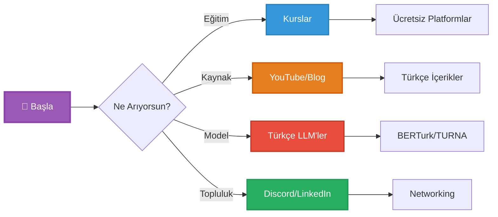
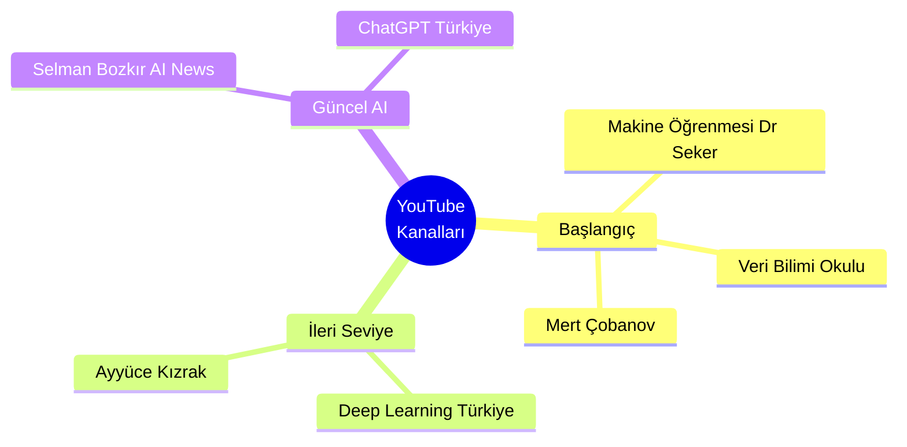
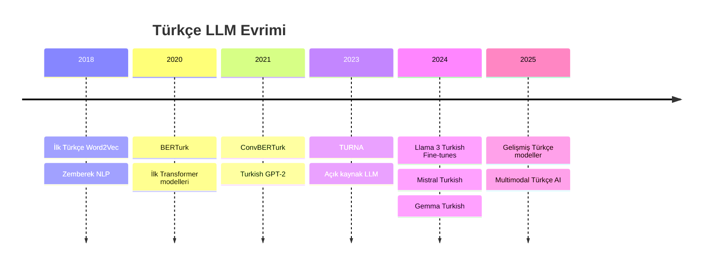
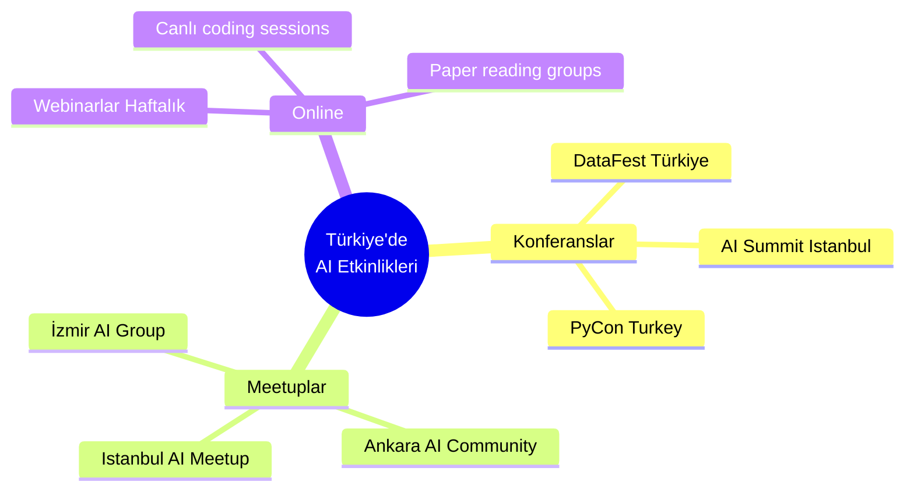
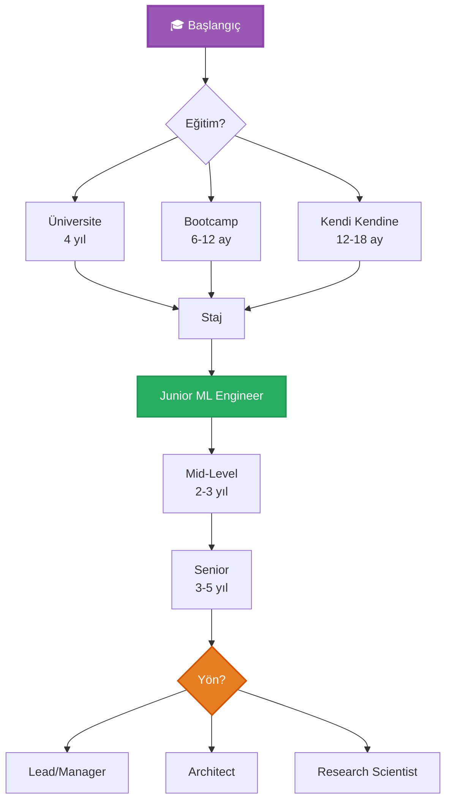
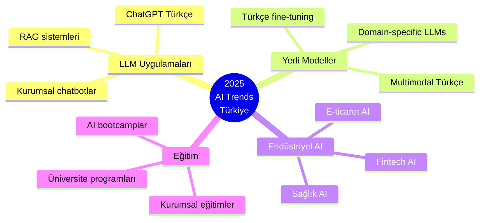

<div align="center">

# 🇹🇷 Türkçe Yapay Zeka Kaynakları

### *Turkish AI & ML Resources Hub - 2024-2025 Edition*


</div>

---

## 🎯 Hızlı Navigasyon



---

## 📚 Eğitim Platformları

### 🆓 Ücretsiz Kaynaklar

<table>
<tr>
<th>Platform</th>
<th>İçerik</th>
<th>Seviye</th>
<th>Sertifika</th>
<th>2025 Durumu</th>
</tr>
<tr>
<td><b>BTK Akademi</b></td>
<td>Yapay Zeka, Python, ML</td>
<td>🟢 Başlangıç</td>
<td>✅ Var</td>
<td>🔥 Aktif</td>
</tr>
<tr>
<td><b>Turkcell Geleceği Yazanlar</b></td>
<td>Veri Bilimi, ML 101</td>
<td>🟢 Başlangıç</td>
<td>✅ Var</td>
<td>→ Stabil</td>
</tr>
<tr>
<td><b>Google AI (Türkçe)</b></td>
<td>TensorFlow, ML Crash Course</td>
<td>🟡 Orta</td>
<td>❌ Yok</td>
<td>→ Güncel</td>
</tr>
<tr>
<td><b>Kodluyoruz</b></td>
<td>Veri Bilimi Patikası</td>
<td>🟢 Başlangıç</td>
<td>✅ Var</td>
<td>🔥 Bootcamp</td>
</tr>
</table>

---

## 🎥 YouTube Kanalları (2024-2025)

### Popüler Türkçe AI/ML Kanalları



### Kanal Karşılaştırması

| Kanal | Odak | Seviye | Video Sayısı | 2025 Aktiflik |
|-------|------|--------|--------------|---------------|
| **Makine Öğrenmesi** (Dr. Şadi Evren Şeker) | Algoritma açıklamaları | 🟢 Başlangıç | 200+ | → Stabil |
| **Veri Bilimi Okulu** (M.V. Keskin) | Pratik projeler | 🟢-🟡 Karma | 300+ | ↗️ Aktif |
| **Deep Learning Türkiye** (M.A. Kızrak) | Paper incelemeleri | 🔴 İleri | 150+ | → Stabil |
| **Mert Çobanov** | Kaggle, Veri Bilimi | 🟡 Orta | 250+ | ↗️ Canlı yayınlar |
| **Selman Bozkır** | AI haberleri, toollar | 🟢 Herkes | 100+ | 🔥 Çok aktif |

---

## 📖 Türkçe Kitaplar

### Zorunlu Okumalar

<details open>
<summary><b>📚 Türkiye'de Yazılmış AI/ML Kitapları</b></summary>

#### Temel Kitaplar

| Kitap | Yazar | Seviye | Yayın Yılı | Durum |
|-------|-------|--------|------------|-------|
| **"Yapay Zeka"** | Ethem Alpaydın | 🔴 Akademik | 2020 | Klasik |
| **"Python ile Makine Öğrenmesi"** | Dr. Ş.E. Şeker | 🟢 Başlangıç | 2021 | ⭐⭐⭐⭐⭐ |
| **"Herkes İçin Yapay Zeka"** | Cem Say | 🟢 Giriş | 2019 | Popüler |
| **"Derin Öğrenme"** | Çeviri (Goodfellow) | 🔴 İleri | 2018 | Referans |
| **"Hands-On ML"** (Türkçe) | Çeviri (Géron) | 🟡 Orta | 2022 | Pratik |

#### 💡 Neden Önemli?

```python
turkish_ai_books = {
    "장점": [
        "📖 Anadilde öğrenme daha kolay",
        "🇹🇷 Türk yazarların bakış açısı",
        "💼 Türkiye piyasasına uygun örnekler"
    ],

    "tavsiye": {
        "başlangıç": "Python ile Makine Öğrenmesi",
        "teorik": "Yapay Zeka (Alpaydın)",
        "pratik": "Hands-On ML Türkçe çevirisi"
    }
}
```

</details>

---

## 🤖 Türkçe Dil Modelleri (2024-2025)

### 🆕 Modern Türkçe LLM'ler



### Model Karşılaştırma Tablosu

<table>
<tr>
<th>Model</th>
<th>Parametre</th>
<th>Açık Kaynak?</th>
<th>Kullanım Alanı</th>
<th>2025 Durumu</th>
</tr>
<tr>
<td><b>BERTurk</b></td>
<td>128M</td>
<td>✅ Evet</td>
<td>Metin sınıflandırma, NER</td>
<td>→ Hala kullanılıyor</td>
</tr>
<tr>
<td><b>TURNA</b></td>
<td>1.1B</td>
<td>✅ Evet</td>
<td>Çoklu görev, metin üretimi</td>
<td>→ Popüler</td>
</tr>
<tr>
<td><b>Turkish GPT-2</b></td>
<td>124M</td>
<td>✅ Evet</td>
<td>Metin üretimi</td>
<td>→ Eski ama işlevsel</td>
</tr>
<tr>
<td><b>mT5-Turkish</b></td>
<td>Base</td>
<td>✅ Evet</td>
<td>Özetleme, çeviri</td>
<td>→ Multilingual</td>
</tr>
<tr>
<td><b>Llama 3 TR Fine-tune</b></td>
<td>8B-70B</td>
<td>✅ Evet</td>
<td>Genel amaçlı LLM</td>
<td>🔥 Yeni ve güçlü</td>
</tr>
<tr>
<td><b>Gemini (Turkish support)</b></td>
<td>Unknown</td>
<td>❌ Hayır</td>
<td>Multimodal, sohbet</td>
<td>🔥 Ticari</td>
</tr>
</table>

### 🚀 Hızlı Başlangıç: Türkçe Model Kullanımı

```python
# BERTurk ile Metin Sınıflandırma (2025)
from transformers import AutoTokenizer, AutoModelForSequenceClassification
import torch

# BERTurk modelini yükle
model_name = "dbmdz/bert-base-turkish-cased"
tokenizer = AutoTokenizer.from_pretrained(model_name)
model = AutoModelForSequenceClassification.from_pretrained(
    model_name,
    num_labels=2  # Pozitif/Negatif sentiment
)

# Türkçe metin
text = "Bu film gerçekten harikaydı! Kesinlikle tavsiye ederim."

# Tokenize et
inputs = tokenizer(
    text,
    return_tensors="pt",
    padding=True,
    truncation=True,
    max_length=512
)

# Tahmin yap
with torch.no_grad():
    outputs = model(**inputs)
    predictions = torch.nn.functional.softmax(outputs.logits, dim=-1)

print(f"Pozitif: {predictions[0][1]:.2%}")
print(f"Negatif: {predictions[0][0]:.2%}")
```

---

## 👥 Türk AI Topluluğu

### Discord & Slack Grupları

| Topluluk | Üye Sayısı | Odak | Link/Açıklama |
|----------|------------|------|---------------|
| **Deep Learning Türkiye Discord** | 1000+ | Derin öğrenme, araştırma | Aktif tartışmalar |
| **Veri Bilimi Türkiye Slack** | 500+ | Profesyonel network | İş fırsatları |
| **AI Türkiye Discord** | 800+ | Genel AI, ChatGPT | Güncel haberler |
| **Türkiye Yapay Zeka İnisiyatifi** | LinkedIn | Sektör liderleri | Politika, etkinlikler |

### 🌍 Meetup & Etkinlikler (2025)



---

## 💼 Türkiye'deki AI Şirketleri & Kariyer

### 🏢 AI Kullanan Şirketler (2025)

<details open>
<summary><b>🔥 Türkiye'de AI/ML Pozisyonları Olan Şirketler</b></summary>

#### Teknoloji Şirketleri

```python
turkish_ai_companies = {
    "büyük_şirketler": [
        {
            "name": "Arçelik",
            "ai_team": "Arçelik AI Lab",
            "focus": "IoT, Computer Vision",
            "hiring": "Aktif"
        },
        {
            "name": "Turkcell",
            "ai_team": "Turkcell AI Team",
            "focus": "Telecom AI, NLP",
            "hiring": "Aktif"
        },
        {
            "name": "Aselsan",
            "ai_team": "Aselsan AI Lab",
            "focus": "Savunma AI, CV",
            "hiring": "Düzenli"
        }
    ],

    "startuplar": [
        {
            "name": "Insider",
            "focus": "Marketing AI",
            "global": "Uluslararası"
        },
        {
            "name": "Getir",
            "ai_team": "Getir AI",
            "focus": "Lojistik optimizasyonu"
        },
        {
            "name": "Trendyol",
            "ai_team": "Trendyol Tech",
            "focus": "E-commerce AI, öneri sistemleri"
        },
        {
            "name": "Hepsiburada",
            "ai_team": "Data Science Team",
            "focus": "Arama, öneri, fraud detection"
        }
    ],

    "bankacilik": [
        "Garanti BBVA AI",
        "İş Bankası AI",
        "Akbank AI Lab",
        "Yapı Kredi AI"
    ]
}
```

#### Maaş Aralıkları (2025 TL - Ortalama)

| Pozisyon | Junior | Mid-Level | Senior |
|----------|--------|-----------|--------|
| **ML Engineer** | 40-60K | 80-120K | 150-250K+ |
| **Data Scientist** | 45-65K | 90-130K | 160-280K+ |
| **AI Researcher** | 50-70K | 100-150K | 180-300K+ |

</details>

### 🎯 Kariyer Yol Haritası



---

## 🎓 Üniversite Kaynakları

### Açık Ders Materyalleri

| Üniversite | Bölüm | Dersler | Erişim |
|------------|-------|---------|--------|
| **Boğaziçi** | Bilgisayar Müh. | CmpE 544 Pattern Recognition, 58Z Deep Learning | Ders notları açık |
| **ODTÜ** | Bilgisayar Müh. | CENG 463 Intro to ML, 783 Deep Learning | Video kayıtları |
| **İTÜ** | Bilgisayar Müh. | BLG 561E Deep Learning | Proje örnekleri |
| **Koç** | AI Lab | Araştırma makaleleri | Açık yayınlar |

### 🔬 Araştırma Laboratuvarları

```python
research_labs = {
    "KUIS AI Lab": {
        "üniversite": "Koç Üniversitesi",
        "focus": ["Computer Vision", "NLP", "Robotics"],
        "website": "ai.ku.edu.tr"
    },

    "METU Image Lab": {
        "üniversite": "ODTÜ",
        "focus": ["Image Processing", "Video Analysis"],
        "projects": "Endüstriyel işbirlikleri"
    },

    "ITU AI/ML Lab": {
        "üniversite": "İTÜ",
        "focus": "Multidisciplinary AI",
        "opportunities": "Staj imkanları"
    }
}
```

---

## 📱 Açık Kaynak Türkçe NLP Projeleri

### GitHub Projeleri

<table>
<tr>
<th>Proje</th>
<th>Açıklama</th>
<th>Yıldız</th>
<th>Durum</th>
</tr>
<tr>
<td><b>turkish-bert</b></td>
<td>Türkçe BERT modeli</td>
<td>⭐ 500+</td>
<td>✅ Aktif</td>
</tr>
<tr>
<td><b>zemberek-nlp</b></td>
<td>Türkçe NLP kütüphanesi (Java)</td>
<td>⭐ 1K+</td>
<td>✅ Bakımda</td>
</tr>
<tr>
<td><b>turkish-nlp-preprocessing</b></td>
<td>Preprocessing araçları</td>
<td>⭐ 200+</td>
<td>→ Stabil</td>
</tr>
<tr>
<td><b>TTC-4900</b></td>
<td>Türkçe metin sınıflandırma dataset</td>
<td>⭐ 100+</td>
<td>→ Dataset</td>
</tr>
</table>

### Türkçe Veri Setleri

```python
turkish_datasets = {
    "metin_siniflandirma": [
        "TTC-4900: 7 kategori, 4900 doküman",
        "Turkish Movie Reviews: 50K+ yorum",
        "Turkish News: Haber kategorileri"
    ],

    "ner": [
        "TWNERTC: Twitter NER dataset",
        "Turkish NER: Genel amaçlı"
    ],

    "sentiment": [
        "Turkish Sentiment Analysis: 15K tweet",
        "Product Reviews TR: E-ticaret yorumları"
    ],

    "qa": [
        "Turkish Question Answering: SQuAD-style",
        "Turkish Reading Comprehension"
    ]
}
```

---

## 🚀 2025 Türkiye AI Trendleri

### 🔥 Güncel Konular



---

## 💡 Öğrenme Tavsiyeler

### 30 Günlük Hızlı Başlangıç

<details>
<summary><b>📅 Detaylı Plan (Tıkla)</b></summary>

**Hafta 1-2: Temeller**
- 🐍 Python öğren (BTK Akademi)
- 📊 Matematik temelleri (Khan Academy Türkçe)
- 🎥 Makine Öğrenmesi YouTube (Dr. Şeker)

**Hafta 3-4: ML Basics**
- 📚 İlk ML algoritmaları (Scikit-learn)
- 💻 İlk proje: Titanic dataset
- 📖 "Python ile Makine Öğrenmesi" kitabı

**Hafta 5-6: Deep Learning**
- 🧠 Neural Network temelleri
- 🎥 Deep Learning Türkiye YouTube
- 💻 PyTorch/TensorFlow başlangıç

**Hafta 7-8: Türkçe NLP**
- 🇹🇷 BERTurk kullanımı
- 💻 Türkçe sentiment analysis projesi
- 📊 Türkçe veri setleri

**Hafta 9+: Uzmanlık**
- 🎯 Alan seç (CV, NLP, vb.)
- 💼 Portfolio oluştur
- 👥 Topluluğa katıl (Discord)

</details>

---

<div align="center">

## 📬 Toplulukla Bağlantıda Kal

<table>
<tr>
<td align="center">

**💬 Discord**

[Deep Learning TR](https://discord.gg/deeplearning)

</td>
<td align="center">

**💼 LinkedIn**

[TRAI - Türkiye Yapay Zeka](https://linkedin.com/company/turkiye-yapay-zeka-inisiyatifi/)

</td>
<td align="center">

**🐦 Twitter**

#TürkçeAI #YapayZekaTR

</td>
</tr>
</table>

---

### 🌟 Başarı İpuçları

> *"Türkçe kaynaklarla başla, İngilizce ile devam et, proje yaparak öğren!"*

| İpucu | Açıklama |
|-------|----------|
| **Günlük pratik** | Her gün en az 1 saat kod yaz |
| **Topluluk** | Discord/Slack'te aktif ol |
| **Projeler** | Portfolyo oluştur (GitHub) |
| **Networking** | Meetuplara katıl |

---

**Son Güncelleme:** Ocak 2025 | **Durum:** 

</div>

---

*"Türkçe kaynaklarla AI öğrenmek artık çok daha kolay. Başarılar!" * 🇹🇷🚀
