<div align="center">

# 🖥️ MCP Client Implementation Guide


**Build AI Agents That Connect to Any Tool** - From basic clients to production-ready AI systems with MCP.

[🎯 Client Patterns](#-client-implementation-patterns) • [🤖 AI Agents](#-intelligent-mcp-agents) • [📊 Streaming](#-streaming-clients) • [🚀 Deployment](#-client-deployment) • [🔒 Security](#-security-patterns)

</div>

---

## 📋 Table of Contents

- [🎯 Client Implementation Patterns](#-client-implementation-patterns)
- [🤖 Intelligent MCP Agents](#-intelligent-mcp-agents)
- [📊 Streaming Clients](#-streaming-clients)
- [🔧 Advanced Patterns](#-advanced-client-patterns)
- [🚀 Client Deployment](#-client-deployment)
- [🎯 Integration Examples](#-integration-examples)
- [📚 Essential Resources](#-essential-resources)

---

## 🎯 Client Implementation Patterns

### Basic Client Connection

<div align="center">


</div>

### ⚡ Quick Client

```python
from mcp import Client, StdioTransport

# Basic connection
client = Client("my-client")
transport = StdioTransport()

# Connect to server
await client.connect(transport, "python", ["my_server.py"])

# Call tool
result = await client.call_tool("query_database", {
    "query": "SELECT * FROM users LIMIT 10"
})
```

### 🏢 Production Client

```python
import asyncio
from typing import Dict, List, Any, Optional
from mcp import Client, Transport
import logging
from tenacity import retry, stop_after_attempt, wait_exponential
from dataclasses import dataclass
import time

@dataclass
class ClientConfig:
    """Client configuration"""
    client_name: str
    health_check_interval: int = 30
    reconnect_attempts: int = 3
    timeout: float = 30.0

class ProductionMCPClient:
    """Production-ready MCP client with resilience"""

    def __init__(self, config: ClientConfig):
        self.config = config
        self.clients = {}
        self.logger = logging.getLogger(__name__)
        self.health_check_interval = config.health_check_interval
        self._health_tasks = {}
        self.stats = {
            'tool_calls': 0,
            'successes': 0,
            'failures': 0,
            'reconnections': 0
        }

    async def connect_server(
        self,
        name: str,
        command: str,
        args: List[str],
        env: Dict[str, str] = None
    ):
        """Connect to MCP server with retry logic"""

        @retry(
            stop=stop_after_attempt(self.config.reconnect_attempts),
            wait=wait_exponential(multiplier=1, min=4, max=10)
        )
        async def _connect():
            client = Client(f"{self.config.client_name}-{name}")
            transport = StdioTransport()

            try:
                await client.connect(transport, command, args, env)

                # Verify connection
                capabilities = await client.get_capabilities()
                self.logger.info(
                    f"✅ Connected to {name}: "
                    f"{len(capabilities.tools)} tools available"
                )

                return client

            except Exception as e:
                self.logger.error(f"❌ Failed to connect to {name}: {e}")
                raise

        client = await _connect()
        self.clients[name] = client

        # Start health monitoring
        self._health_tasks[name] = asyncio.create_task(
            self._monitor_health(name, client)
        )

        return client

    async def _monitor_health(self, name: str, client: Client):
        """Monitor server health and auto-reconnect"""
        while True:
            try:
                await asyncio.sleep(self.health_check_interval)

                # Health check
                await asyncio.wait_for(
                    client.list_tools(),
                    timeout=5.0
                )

            except Exception as e:
                self.logger.warning(f"⚠️ Health check failed for {name}: {e}")

                # Attempt reconnection
                try:
                    await self.reconnect_server(name)
                    self.stats['reconnections'] += 1
                except Exception:
                    self.logger.error(f"❌ Reconnection failed for {name}")

    async def reconnect_server(self, name: str):
        """Reconnect to server"""
        if name not in self.clients:
            return

        # Get original connection info
        old_client = self.clients[name]

        # Reconnect
        # Note: In production, store original connection params
        self.logger.info(f"🔄 Reconnecting to {name}...")

    async def call_tool(
        self,
        server: str,
        tool: str,
        arguments: dict,
        timeout: float = None
    ) -> Any:
        """Call tool with timeout and error handling"""

        if server not in self.clients:
            raise ValueError(f"Not connected to server: {server}")

        client = self.clients[server]
        timeout = timeout or self.config.timeout

        self.stats['tool_calls'] += 1
        start_time = time.time()

        try:
            result = await asyncio.wait_for(
                client.call_tool(tool, arguments),
                timeout=timeout
            )

            execution_time = time.time() - start_time
            self.stats['successes'] += 1

            self.logger.debug(
                f"✅ Tool call successful: {server}.{tool} "
                f"({execution_time:.2f}s)"
            )

            return result

        except asyncio.TimeoutError:
            self.stats['failures'] += 1
            self.logger.error(f"⏱️ Tool call timed out: {server}.{tool}")
            raise

        except Exception as e:
            self.stats['failures'] += 1
            self.logger.error(f"❌ Tool call failed: {server}.{tool} - {e}")
            raise

    async def get_stats(self) -> Dict[str, Any]:
        """Get client statistics"""
        success_rate = (
            self.stats['successes'] / max(self.stats['tool_calls'], 1) * 100
        )

        return {
            **self.stats,
            'success_rate': f"{success_rate:.1f}%",
            'connected_servers': list(self.clients.keys())
        }

    async def disconnect_all(self):
        """Disconnect from all servers"""
        for name in list(self.clients.keys()):
            await self.disconnect_server(name)

    async def disconnect_server(self, name: str):
        """Disconnect from specific server"""
        if name in self.clients:
            # Cancel health check
            if name in self._health_tasks:
                self._health_tasks[name].cancel()
                del self._health_tasks[name]

            # Disconnect
            await self.clients[name].disconnect()
            del self.clients[name]

            self.logger.info(f"🔌 Disconnected from {name}")
```

**Features:**
- ✅ Automatic reconnection
- ✅ Health monitoring
- ✅ Timeout handling
- ✅ Error recovery
- ✅ Statistics tracking
- ✅ Graceful shutdown

---

## 🤖 Intelligent MCP Agents

### AI Agent Architecture

```mermaid
graph TB
    subgraph "AI Agent"
        User[👤 User Input]
        LLM[🧠 LLM Core]
        Router[🎯 Tool Router]
        MCP[MCP Client]

        subgraph "Tool Registry"
            T1[Query Tool]
            T2[API Tool]
            T3[File Tool]
        end

        subgraph "MCP Servers"
            S1[Database Server]
            S2[API Server]
            S3[File Server]
        end
    end

    User --> LLM
    LLM --> Router
    Router --> T1 --> MCP
    Router --> T2 --> MCP
    Router --> T3 --> MCP
    MCP --> S1
    MCP --> S2
    MCP --> S3

    style LLM fill:#a855f7,stroke:#7e22ce,color:#fff
    style Router fill:#3b82f6,stroke:#1d4ed8,color:#fff
    style MCP fill:#10b981,stroke:#059669,color:#fff
```

<div align="center">



</div>

### Production AI Agent

```python
from typing import Dict, List, Any, Optional
from dataclasses import dataclass
from enum import Enum
import json

class ToolCategory(Enum):
    DATABASE = "database"
    API = "api"
    FILESYSTEM = "filesystem"
    COMPUTE = "compute"

@dataclass
class ToolRegistration:
    server: str
    tool: str
    category: ToolCategory
    description: str
    schema: dict

class IntelligentMCPAgent:
    """AI agent with intelligent tool routing"""

    def __init__(self, llm_client):
        self.llm = llm_client
        self.mcp_client = ProductionMCPClient(
            ClientConfig(client_name="ai-agent")
        )
        self.tool_registry = {}
        self.conversation_history = []

    async def initialize(self, server_configs: List[dict]):
        """Initialize with multiple MCP servers"""

        # Connect to all servers
        for config in server_configs:
            await self.mcp_client.connect_server(
                name=config['name'],
                command=config['command'],
                args=config.get('args', []),
                env=config.get('env', {})
            )

        # Discover and register all tools
        await self._discover_tools()

    async def _discover_tools(self):
        """Discover tools from all connected servers"""

        for server_name, client in self.mcp_client.clients.items():
            tools = await client.list_tools()

            for tool in tools:
                category = self._categorize_tool(tool)

                registration = ToolRegistration(
                    server=server_name,
                    tool=tool.name,
                    category=category,
                    description=tool.description,
                    schema=tool.input_schema
                )

                self.tool_registry[f"{server_name}.{tool.name}"] = registration

    def _categorize_tool(self, tool) -> ToolCategory:
        """Categorize tool based on its properties"""
        name_lower = tool.name.lower()
        desc_lower = tool.description.lower()

        if any(kw in name_lower or kw in desc_lower
               for kw in ['db', 'sql', 'query']):
            return ToolCategory.DATABASE
        elif any(kw in name_lower or kw in desc_lower
                 for kw in ['api', 'http', 'rest']):
            return ToolCategory.API
        elif any(kw in name_lower or kw in desc_lower
                 for kw in ['file', 'read', 'write']):
            return ToolCategory.FILESYSTEM
        else:
            return ToolCategory.COMPUTE

    async def process_request(
        self,
        user_request: str,
        context: Optional[dict] = None
    ) -> str:
        """Process user request using available tools"""

        # Add to conversation history
        self.conversation_history.append({
            "role": "user",
            "content": user_request,
            "context": context
        })

        # Create tool descriptions for LLM
        tool_descriptions = self._format_tools_for_llm()

        # Let LLM decide which tools to use
        llm_prompt = f"""
        You are an AI assistant with access to these tools:

        {tool_descriptions}

        User request: {user_request}

        Context: {json.dumps(context or {})}

        Analyze the request and determine which tools to use.
        Respond with a JSON array of tool calls.
        """

        # Get LLM's tool selection
        llm_response = await self.llm.complete(llm_prompt)
        tool_calls = json.loads(llm_response)

        # Execute tool calls
        results = []
        for call in tool_calls:
            result = await self._execute_tool_call(call)
            results.append(result)

        # Let LLM synthesize the results
        synthesis_prompt = f"""
        Original request: {user_request}

        Tool results:
        {json.dumps(results, indent=2)}

        Provide a helpful response based on these results.
        """

        final_response = await self.llm.complete(synthesis_prompt)

        # Add to history
        self.conversation_history.append({
            "role": "assistant",
            "content": final_response,
            "tool_calls": tool_calls,
            "tool_results": results
        })

        return final_response

    async def _execute_tool_call(self, call: dict) -> dict:
        """Execute a single tool call"""

        tool_key = f"{call['server']}.{call['tool']}"

        if tool_key not in self.tool_registry:
            return {"error": f"Tool not found: {tool_key}"}

        try:
            result = await self.mcp_client.call_tool(
                server=call['server'],
                tool=call['tool'],
                arguments=call.get('arguments', {})
            )

            return {
                "success": True,
                "result": result
            }

        except Exception as e:
            return {
                "success": False,
                "error": str(e)
            }

    def _format_tools_for_llm(self) -> str:
        """Format tool registry for LLM consumption"""
        formatted = []

        for key, tool in self.tool_registry.items():
            formatted.append(
                f"- {key}: {tool.description} "
                f"(category: {tool.category.value})"
            )

        return "\n".join(formatted)
```

---

## 📊 Streaming Clients

### Streaming Architecture


### Production Streaming Client

```python
from typing import AsyncIterator, Optional, Callable
from collections import deque
import time

class StreamingMCPClient:
    """MCP client with advanced streaming support"""

    def __init__(self):
        self.active_streams = {}
        self.stream_buffers = {}

    async def stream_tool(
        self,
        server: str,
        tool: str,
        arguments: dict,
        on_chunk: Optional[Callable] = None,
        buffer_size: int = 1000,
        timeout: float = 300.0
    ) -> AsyncIterator[Any]:
        """Stream tool results with buffering and timeout"""

        stream_id = f"{server}.{tool}.{time.time()}"
        self.stream_buffers[stream_id] = deque(maxlen=buffer_size)
        self.active_streams[stream_id] = True

        try:
            client = self.clients[server]

            # Start streaming
            async with asyncio.timeout(timeout):
                async for chunk in client.stream_tool(tool, arguments):
                    if not self.active_streams.get(stream_id, False):
                        break

                    # Buffer management
                    self.stream_buffers[stream_id].append({
                        "timestamp": time.time(),
                        "data": chunk
                    })

                    # Callback processing
                    if on_chunk:
                        try:
                            await on_chunk(chunk)
                        except Exception as e:
                            logging.error(f"Chunk callback error: {e}")

                    yield chunk

        except asyncio.TimeoutError:
            logging.error(f"Stream timeout: {stream_id}")
            raise

        finally:
            # Cleanup
            self.active_streams.pop(stream_id, None)
            self.stream_buffers.pop(stream_id, None)

    async def parallel_stream(
        self,
        streams: List[dict],
        merge_strategy: str = "round_robin"
    ) -> AsyncIterator[dict]:
        """Handle multiple parallel streams"""

        queues = {
            i: asyncio.Queue(maxsize=100)
            for i in range(len(streams))
        }

        # Start stream tasks
        tasks = []
        for i, stream_config in enumerate(streams):
            task = asyncio.create_task(
                self._stream_to_queue(stream_config, queues[i])
            )
            tasks.append(task)

        try:
            if merge_strategy == "round_robin":
                async for item in self._round_robin_merge(queues):
                    yield item

        finally:
            # Cancel all tasks
            for task in tasks:
                task.cancel()

    async def _round_robin_merge(
        self,
        queues: Dict[int, asyncio.Queue]
    ) -> AsyncIterator[dict]:
        """Merge streams in round-robin fashion"""
        active_queues = list(queues.keys())

        while active_queues:
            for queue_id in list(active_queues):
                try:
                    item = await asyncio.wait_for(
                        queues[queue_id].get(),
                        timeout=0.1
                    )
                    yield {
                        'stream_id': queue_id,
                        'data': item
                    }
                except asyncio.TimeoutError:
                    active_queues.remove(queue_id)
```

---

## 🔧 Advanced Client Patterns

### Circuit Breaker Pattern

```python
class CircuitBreakerMCP:
    """Prevent cascading failures"""

    def __init__(self):
        self.failure_threshold = 5
        self.recovery_timeout = 60
        self.failure_counts = defaultdict(int)
        self.circuit_states = {}  # 'closed', 'open', 'half-open'
        self.last_failure_time = {}

    def _is_circuit_open(self, server: str) -> bool:
        """Check if circuit is open"""
        state = self.circuit_states.get(server, 'closed')

        if state == 'open':
            # Check if recovery timeout has elapsed
            last_failure = self.last_failure_time.get(server, 0)
            if time.time() - last_failure > self.recovery_timeout:
                self.circuit_states[server] = 'half-open'
                return False
            return True

        return False

    async def call_with_circuit_breaker(
        self,
        server: str,
        tool: str,
        arguments: dict
    ):
        """Call tool with circuit breaker protection"""

        if self._is_circuit_open(server):
            raise Exception(f"Circuit open for {server}")

        try:
            result = await self.call_tool(server, tool, arguments)
            self._on_success(server)
            return result

        except Exception as e:
            self._on_failure(server)
            raise

    def _on_success(self, server: str):
        """Handle successful call"""
        self.failure_counts[server] = 0
        if self.circuit_states.get(server) == 'half-open':
            self.circuit_states[server] = 'closed'

    def _on_failure(self, server: str):
        """Handle failed call"""
        self.failure_counts[server] += 1
        self.last_failure_time[server] = time.time()

        if self.failure_counts[server] >= self.failure_threshold:
            self.circuit_states[server] = 'open'
            logging.warning(f"Circuit opened for {server}")
```

### Load Balancing Pattern

```python
class LoadBalancedMCP:
    """Distribute load across multiple servers"""

    def __init__(self):
        self.server_pools = defaultdict(list)
        self.current_index = defaultdict(int)
        self.server_stats = defaultdict(lambda: {
            'requests': 0,
            'failures': 0,
            'avg_response_time': 0
        })

    def add_server_to_pool(self, pool: str, server: str):
        """Add server to load balancing pool"""
        self.server_pools[pool].append(server)

    async def call_balanced(
        self,
        pool: str,
        tool: str,
        arguments: dict
    ):
        """Call tool with load balancing"""
        servers = self.server_pools[pool]
        if not servers:
            raise ValueError(f"No servers in pool: {pool}")

        # Round-robin selection
        index = self.current_index[pool] % len(servers)
        self.current_index[pool] += 1

        server = servers[index]

        # Track stats
        start_time = time.time()
        try:
            result = await self.call_tool(server, tool, arguments)
            response_time = time.time() - start_time

            # Update stats
            stats = self.server_stats[server]
            stats['requests'] += 1
            stats['avg_response_time'] = (
                (stats['avg_response_time'] *
                 (stats['requests'] - 1) + response_time) /
                stats['requests']
            )

            return result

        except Exception as e:
            self.server_stats[server]['failures'] += 1
            raise
```

---

## 🚀 Client Deployment

### Microservice Client

```python
from fastapi import FastAPI, HTTPException
from pydantic import BaseModel

app = FastAPI()
mcp_client = ProductionMCPClient(
    ClientConfig(client_name="api-service")
)

class ToolRequest(BaseModel):
    server: str
    tool: str
    arguments: dict

@app.on_event("startup")
async def startup():
    """Initialize MCP connections"""
    await mcp_client.connect_server(
        "database",
        "python",
        ["-m", "mcp_server.database"]
    )

@app.post("/mcp/call")
async def call_mcp_tool(request: ToolRequest):
    """Call MCP tool via API"""
    try:
        result = await mcp_client.call_tool(
            request.server,
            request.tool,
            request.arguments
        )
        return {"success": True, "result": result}
    except Exception as e:
        raise HTTPException(status_code=500, detail=str(e))

@app.get("/mcp/stats")
async def get_stats():
    """Get client statistics"""
    return await mcp_client.get_stats()
```

### Serverless Client

```python
# AWS Lambda with MCP
import json

client = ProductionMCPClient(
    ClientConfig(client_name="lambda-client")
)

def lambda_handler(event, context):
    """Lambda handler with MCP client"""

    # Parse request
    body = json.loads(event['body'])

    # Call MCP tool
    result = asyncio.run(
        client.call_tool(
            body['server'],
            body['tool'],
            body['arguments']
        )
    )

    return {
        'statusCode': 200,
        'body': json.dumps(result)
    }
```

---

## 🎯 Integration Examples

### LangChain Integration

```python
from langchain.tools import MCPTool
from langchain.agents import initialize_agent

# Wrap MCP as LangChain tool
mcp_tool = MCPTool(
    server_url="http://localhost:8080",
    name="database_query",
    description="Query production database"
)

agent = initialize_agent(
    tools=[mcp_tool],
    llm=llm,
    agent="zero-shot-react-description"
)

response = agent.run("Get top 10 customers")
```

### React/Vercel AI SDK

```typescript
import { useChat } from 'ai/react';
import { createMCPClient } from '@modelcontextprotocol/client';

const mcpClient = createMCPClient({
  servers: {
    database: {
      command: 'python',
      args: ['-m', 'mcp_server.database']
    }
  }
});

export function ChatInterface() {
  const { messages, input, handleInputChange, handleSubmit } = useChat({
    api: '/api/chat',
    onToolCall: async (toolCall) => {
      return await mcpClient.callTool(
        toolCall.server,
        toolCall.tool,
        toolCall.arguments
      );
    }
  });

  return (
    <div>
      {messages.map(m => (
        <div key={m.id}>{m.content}</div>
      ))}
      <form onSubmit={handleSubmit}>
        <input value={input} onChange={handleInputChange} />
      </form>
    </div>
  );
}
```

---

## 📚 Essential Resources

### 🏆 Official Client Libraries

<div align="center">

| Library | Language | Features | Link |
|---------|----------|----------|------|
| **Python SDK** | Python | Async, Type-safe |  |
| **TypeScript SDK** | TypeScript | Node.js, Browser |  |
| **Go Client** | Go | High-performance |  |

</div>

### 🎓 Learning Resources

- **[Client Development Guide](https://modelcontextprotocol.io/docs/client-development)** - Complete guide
- **[LangChain MCP Integration](https://python.langchain.com/docs/integrations/tools/mcp)** - LangChain docs
- **[Vercel AI SDK + MCP](https://sdk.vercel.ai/docs/guides/mcp)** - Web integration

---

<div align="center">

## 🌟 **Connect Your AI to the World with MCP Clients!** 🌟

### Build intelligent agents that can use any tool

[](./README.md)
[](./model-context-protocol.md)
[](./mcp-server-examples.md)

---

*Last Updated: January 2025 • Production-Ready Patterns • Battle-Tested at Scale*

</div>
