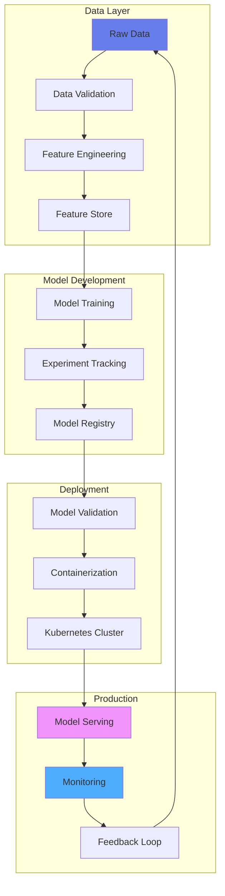
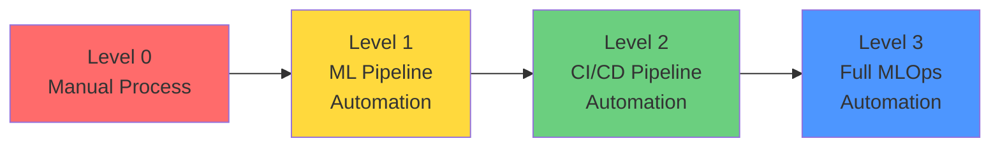
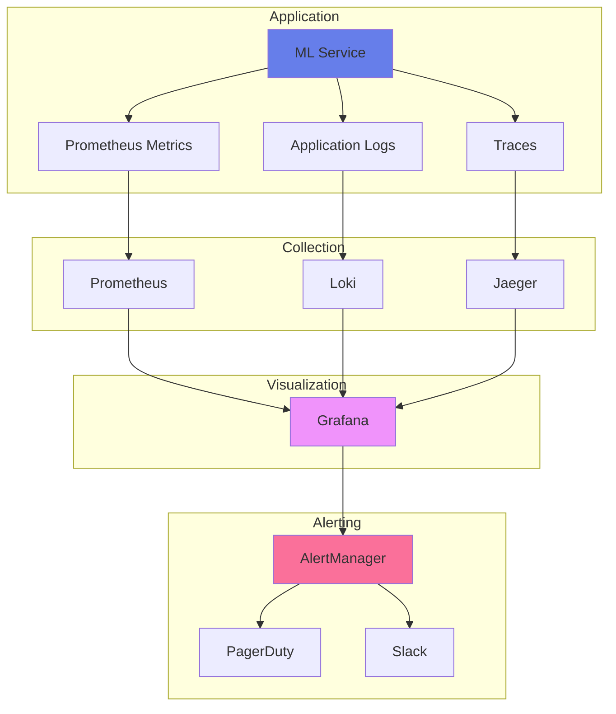
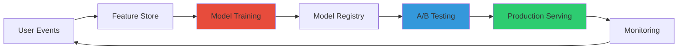

<svg width="800" height="100" xmlns="http://www.w3.org/2000/svg">
  <defs>
    <linearGradient id="grad1" x1="0%" y1="0%" x2="100%" y2="0%">
      <stop offset="0%" style="stop-color:#667eea;stop-opacity:1" />
      <stop offset="100%" style="stop-color:#764ba2;stop-opacity:1" />
    </linearGradient>
  </defs>
  <style>
    .title { font: bold 48px sans-serif; fill: url(#grad1); }
    @keyframes typing {
      from { width: 0; }
      to { width: 100%; }
    }
  </style>
  <text x="50" y="60" class="title">MLOps &amp; Production Deployment 🚀</text>
</svg>


## Table of Contents
- [MLOps Architecture](#mlops-architecture)
- [Production ML Pipeline](#production-ml-pipeline)
- [Containerization & Orchestration](#containerization--orchestration)
- [Model Serving](#model-serving)
- [Monitoring & Observability](#monitoring--observability)
- [CI/CD for ML](#cicd-for-ml)
- [Feature Stores](#feature-stores)
- [Best Practices](#best-practices)
- [Real-World Case Studies](#real-world-case-studies)

## MLOps Architecture

### End-to-End MLOps Pipeline



### MLOps Maturity Model



## Production ML Pipeline

### Complete MLflow Pipeline

```python
"""
Production-Ready MLflow Pipeline with Best Practices
- Experiment tracking
- Model registry
- Deployment automation
- Performance monitoring
"""

import mlflow
import mlflow.sklearn
from mlflow.tracking import MlflowClient
from sklearn.ensemble import RandomForestClassifier
from sklearn.model_selection import train_test_split
from sklearn.metrics import accuracy_score, precision_score, recall_score, f1_score
import numpy as np
import pandas as pd
from typing import Dict, Tuple
import logging

# Configure logging
logging.basicConfig(level=logging.INFO)
logger = logging.getLogger(__name__)

class MLflowPipeline:
    """Production MLflow Pipeline with comprehensive tracking"""

    def __init__(self, experiment_name: str, tracking_uri: str = "http://mlflow-server:5000"):
        """
        Initialize MLflow pipeline

        Args:
            experiment_name: Name of the MLflow experiment
            tracking_uri: MLflow tracking server URI
        """
        mlflow.set_tracking_uri(tracking_uri)
        mlflow.set_experiment(experiment_name)
        self.client = MlflowClient()
        self.experiment_name = experiment_name

    def train_and_log_model(
        self,
        X_train: np.ndarray,
        y_train: np.ndarray,
        X_test: np.ndarray,
        y_test: np.ndarray,
        params: Dict
    ) -> Tuple[str, str]:
        """
        Train model with comprehensive MLflow tracking

        Args:
            X_train, y_train: Training data
            X_test, y_test: Test data
            params: Model hyperparameters

        Returns:
            Tuple of (run_id, model_uri)
        """
        with mlflow.start_run() as run:
            # Log parameters
            mlflow.log_params(params)

            # Train model
            logger.info("Training model...")
            model = RandomForestClassifier(**params)
            model.fit(X_train, y_train)

            # Make predictions
            y_pred = model.predict(X_test)

            # Calculate metrics
            metrics = {
                'accuracy': accuracy_score(y_test, y_pred),
                'precision': precision_score(y_test, y_pred, average='weighted'),
                'recall': recall_score(y_test, y_pred, average='weighted'),
                'f1_score': f1_score(y_test, y_pred, average='weighted')
            }

            # Log metrics
            mlflow.log_metrics(metrics)
            logger.info(f"Metrics: {metrics}")

            # Log model
            mlflow.sklearn.log_model(
                model,
                "model",
                registered_model_name="production_classifier",
                signature=mlflow.models.infer_signature(X_train, model.predict(X_train))
            )

            # Log feature importance
            if hasattr(model, 'feature_importances_'):
                importance_df = pd.DataFrame({
                    'feature': range(X_train.shape[1]),
                    'importance': model.feature_importances_
                }).sort_values('importance', ascending=False)

                mlflow.log_table(importance_df, "feature_importance.json")

            # Log training artifacts
            mlflow.log_dict(params, "config.json")

            return run.info.run_id, f"runs:/{run.info.run_id}/model"

    def promote_model_to_production(self, model_name: str, version: int):
        """
        Promote model version to production

        Args:
            model_name: Registered model name
            version: Model version to promote
        """
        self.client.transition_model_version_stage(
            name=model_name,
            version=version,
            stage="Production",
            archive_existing_versions=True
        )
        logger.info(f"Model {model_name} version {version} promoted to Production")

    def load_production_model(self, model_name: str):
        """Load latest production model"""
        model_uri = f"models:/{model_name}/Production"
        return mlflow.sklearn.load_model(model_uri)

# Example usage
def main():
    # Initialize pipeline
    pipeline = MLflowPipeline(experiment_name="production_classifier_2025")

    # Load data (example)
    from sklearn.datasets import make_classification
    X, y = make_classification(n_samples=10000, n_features=20, n_classes=3, n_informative=15)
    X_train, X_test, y_train, y_test = train_test_split(X, y, test_size=0.2, random_state=42)

    # Define hyperparameters
    params = {
        'n_estimators': 100,
        'max_depth': 10,
        'min_samples_split': 5,
        'min_samples_leaf': 2,
        'random_state': 42,
        'n_jobs': -1
    }

    # Train and log model
    run_id, model_uri = pipeline.train_and_log_model(X_train, y_train, X_test, y_test, params)
    print(f"Model trained with run_id: {run_id}")
    print(f"Model URI: {model_uri}")

    # Promote to production (after validation)
    # pipeline.promote_model_to_production("production_classifier", version=1)

if __name__ == "__main__":
    main()
```

## Containerization & Orchestration

### Docker Multi-Stage Build

```dockerfile
# Dockerfile for production ML service
# Multi-stage build for optimized image size

# Stage 1: Builder
FROM python:3.11-slim as builder

WORKDIR /app

# Install build dependencies
RUN apt-get update && apt-get install -y \
    gcc \
    g++ \
    cmake \
    && rm -rf /var/lib/apt/lists/*

# Copy requirements and install dependencies
COPY requirements.txt .
RUN pip install --user --no-cache-dir -r requirements.txt

# Stage 2: Runtime
FROM python:3.11-slim

WORKDIR /app

# Create non-root user
RUN useradd -m -u 1000 mluser && \
    chown -R mluser:mluser /app

# Copy Python dependencies from builder
COPY --from=builder /root/.local /home/mluser/.local

# Copy application code
COPY --chown=mluser:mluser . .

# Set environment variables
ENV PATH=/home/mluser/.local/bin:$PATH \
    PYTHONUNBUFFERED=1 \
    MLFLOW_TRACKING_URI=http://mlflow-server:5000

# Switch to non-root user
USER mluser

# Health check
HEALTHCHECK --interval=30s --timeout=10s --start-period=40s --retries=3 \
    CMD python -c "import requests; requests.get('http://localhost:8000/health')" || exit 1

# Expose port
EXPOSE 8000

# Run application with Gunicorn
CMD ["gunicorn", "app:app", \
     "--bind", "0.0.0.0:8000", \
     "--workers", "4", \
     "--worker-class", "uvicorn.workers.UvicornWorker", \
     "--timeout", "120", \
     "--access-logfile", "-", \
     "--error-logfile", "-"]
```

### Kubernetes Deployment

```yaml
# k8s-deployment.yaml
# Production-ready Kubernetes deployment for ML service

apiVersion: apps/v1
kind: Deployment
metadata:
  name: ml-model-service
  namespace: ml-production
  labels:
    app: ml-model
    version: v1
spec:
  replicas: 3
  selector:
    matchLabels:
      app: ml-model
  template:
    metadata:
      labels:
        app: ml-model
        version: v1
    spec:
      containers:
      - name: ml-service
        image: your-registry/ml-model:latest
        ports:
        - containerPort: 8000
          name: http
        resources:
          requests:
            memory: "2Gi"
            cpu: "1000m"
          limits:
            memory: "4Gi"
            cpu: "2000m"
        env:
        - name: MLFLOW_TRACKING_URI
          valueFrom:
            configMapKeyRef:
              name: ml-config
              key: mlflow-uri
        - name: MODEL_VERSION
          value: "production"
        livenessProbe:
          httpGet:
            path: /health
            port: 8000
          initialDelaySeconds: 30
          periodSeconds: 10
        readinessProbe:
          httpGet:
            path: /ready
            port: 8000
          initialDelaySeconds: 10
          periodSeconds: 5
        volumeMounts:
        - name: model-cache
          mountPath: /app/models
      volumes:
      - name: model-cache
        emptyDir: {}
---
apiVersion: v1
kind: Service
metadata:
  name: ml-model-service
  namespace: ml-production
spec:
  selector:
    app: ml-model
  ports:
  - protocol: TCP
    port: 80
    targetPort: 8000
  type: LoadBalancer
---
apiVersion: autoscaling/v2
kind: HorizontalPodAutoscaler
metadata:
  name: ml-model-hpa
  namespace: ml-production
spec:
  scaleTargetRef:
    apiVersion: apps/v1
    kind: Deployment
    name: ml-model-service
  minReplicas: 3
  maxReplicas: 10
  metrics:
  - type: Resource
    resource:
      name: cpu
      target:
        type: Utilization
        averageUtilization: 70
  - type: Resource
    resource:
      name: memory
      target:
        type: Utilization
        averageUtilization: 80
```

### Infrastructure as Code with Terraform

```hcl
# main.tf - AWS EKS Cluster for MLOps
terraform {
  required_version = ">= 1.6"
  required_providers {
    aws = {
      source  = "hashicorp/aws"
      version = "~> 5.0"
    }
    kubernetes = {
      source  = "hashicorp/kubernetes"
      version = "~> 2.25"
    }
  }
}

provider "aws" {
  region = var.aws_region
}

# EKS Cluster for ML Workloads
module "eks" {
  source  = "terraform-aws-modules/eks/aws"
  version = "~> 19.0"

  cluster_name    = "mlops-cluster"
  cluster_version = "1.28"

  vpc_id     = module.vpc.vpc_id
  subnet_ids = module.vpc.private_subnets

  # Node groups for different workloads
  eks_managed_node_groups = {
    # CPU nodes for serving
    cpu_serving = {
      min_size     = 2
      max_size     = 10
      desired_size = 3

      instance_types = ["t3.xlarge"]
      capacity_type  = "SPOT"
    }

    # GPU nodes for training
    gpu_training = {
      min_size     = 0
      max_size     = 5
      desired_size = 0

      instance_types = ["g5.2xlarge"]
      capacity_type  = "ON_DEMAND"

      taints = [{
        key    = "nvidia.com/gpu"
        value  = "true"
        effect = "NO_SCHEDULE"
      }]
    }
  }

  tags = {
    Environment = "production"
    ManagedBy   = "terraform"
    Purpose     = "MLOps"
  }
}

# S3 bucket for model artifacts
resource "aws_s3_bucket" "model_artifacts" {
  bucket = "mlops-model-artifacts-${var.environment}"

  tags = {
    Name        = "Model Artifacts"
    Environment = var.environment
  }
}

# Enable versioning
resource "aws_s3_bucket_versioning" "model_artifacts" {
  bucket = aws_s3_bucket.model_artifacts.id

  versioning_configuration {
    status = "Enabled"
  }
}
```

## Model Serving

### FastAPI Production Service

```python
"""
Production-ready FastAPI service for model serving
- Async support
- Request validation
- Monitoring
- Caching
"""

from fastapi import FastAPI, HTTPException, BackgroundTasks
from fastapi.middleware.cors import CORSMiddleware
from fastapi.responses import JSONResponse
from pydantic import BaseModel, Field, validator
from typing import List, Optional
import numpy as np
import mlflow
import redis
import hashlib
import json
import time
from prometheus_client import Counter, Histogram, make_asgi_app
import logging

# Configure logging
logging.basicConfig(level=logging.INFO)
logger = logging.getLogger(__name__)

# Prometheus metrics
REQUEST_COUNT = Counter('prediction_requests_total', 'Total prediction requests')
PREDICTION_TIME = Histogram('prediction_duration_seconds', 'Prediction duration')
ERROR_COUNT = Counter('prediction_errors_total', 'Total prediction errors')

# Initialize FastAPI
app = FastAPI(
    title="ML Model Serving API",
    description="Production-ready ML model serving with MLflow",
    version="2.0.0"
)

# Add Prometheus metrics endpoint
metrics_app = make_asgi_app()
app.mount("/metrics", metrics_app)

# CORS middleware
app.add_middleware(
    CORSMiddleware,
    allow_origins=["*"],
    allow_credentials=True,
    allow_methods=["*"],
    allow_headers=["*"],
)

# Redis cache
try:
    redis_client = redis.Redis(host='redis', port=6379, db=0, decode_responses=True)
except:
    redis_client = None
    logger.warning("Redis not available, caching disabled")

# Load model at startup
class ModelLoader:
    _model = None

    @classmethod
    def get_model(cls):
        if cls._model is None:
            logger.info("Loading model from MLflow...")
            cls._model = mlflow.pyfunc.load_model("models:/production_classifier/Production")
            logger.info("Model loaded successfully")
        return cls._model

# Request/Response models
class PredictionRequest(BaseModel):
    features: List[List[float]] = Field(..., description="Feature matrix for prediction")
    return_probabilities: bool = Field(default=False, description="Return class probabilities")

    @validator('features')
    def validate_features(cls, v):
        if not v:
            raise ValueError("Features cannot be empty")
        if not all(isinstance(row, list) for row in v):
            raise ValueError("Features must be a list of lists")
        return v

    class Config:
        schema_extra = {
            "example": {
                "features": [[1.0, 2.0, 3.0, 4.0]],
                "return_probabilities": False
            }
        }

class PredictionResponse(BaseModel):
    predictions: List[int]
    probabilities: Optional[List[List[float]]] = None
    model_version: str
    latency_ms: float

class HealthResponse(BaseModel):
    status: str
    model_loaded: bool
    version: str
    uptime_seconds: float

# Startup event
start_time = time.time()

@app.on_event("startup")
async def startup_event():
    """Load model on startup"""
    ModelLoader.get_model()
    logger.info("Application started successfully")

# Health check endpoints
@app.get("/health", response_model=HealthResponse)
async def health_check():
    """Health check endpoint"""
    return HealthResponse(
        status="healthy",
        model_loaded=ModelLoader._model is not None,
        version="2.0.0",
        uptime_seconds=time.time() - start_time
    )

@app.get("/ready")
async def readiness_check():
    """Readiness check endpoint"""
    if ModelLoader._model is None:
        raise HTTPException(status_code=503, detail="Model not loaded")
    return {"status": "ready"}

# Prediction endpoint
@app.post("/predict", response_model=PredictionResponse)
@PREDICTION_TIME.time()
async def predict(
    request: PredictionRequest,
    background_tasks: BackgroundTasks
):
    """
    Make predictions on input features

    Args:
        request: Prediction request with features
        background_tasks: FastAPI background tasks

    Returns:
        Predictions with optional probabilities
    """
    REQUEST_COUNT.inc()
    start = time.time()

    try:
        # Convert to numpy array
        X = np.array(request.features)

        # Check cache
        cache_key = None
        if redis_client:
            cache_key = hashlib.md5(X.tobytes()).hexdigest()
            cached_result = redis_client.get(cache_key)
            if cached_result:
                logger.info("Cache hit")
                return JSONResponse(content=json.loads(cached_result))

        # Get model
        model = ModelLoader.get_model()

        # Make predictions
        predictions = model.predict(X).tolist()

        # Get probabilities if requested
        probabilities = None
        if request.return_probabilities and hasattr(model, 'predict_proba'):
            probabilities = model.predict_proba(X).tolist()

        # Prepare response
        response = PredictionResponse(
            predictions=predictions,
            probabilities=probabilities,
            model_version="Production",
            latency_ms=(time.time() - start) * 1000
        )

        # Cache result
        if redis_client and cache_key:
            redis_client.setex(
                cache_key,
                3600,  # 1 hour TTL
                response.json()
            )

        # Log prediction in background
        background_tasks.add_task(log_prediction, X, predictions)

        return response

    except Exception as e:
        ERROR_COUNT.inc()
        logger.error(f"Prediction error: {str(e)}")
        raise HTTPException(status_code=500, detail=str(e))

def log_prediction(features: np.ndarray, predictions: List[int]):
    """Log prediction for monitoring"""
    logger.info(f"Prediction logged: {len(predictions)} samples")
    # Here you would typically log to your monitoring system

# Batch prediction endpoint
@app.post("/predict/batch")
async def predict_batch(request: PredictionRequest):
    """
    Batch prediction endpoint for large datasets
    """
    if len(request.features) > 10000:
        raise HTTPException(
            status_code=400,
            detail="Batch size too large. Maximum 10000 samples."
        )

    return await predict(request, BackgroundTasks())

if __name__ == "__main__":
    import uvicorn
    uvicorn.run(app, host="0.0.0.0", port=8000)
```

## Monitoring & Observability

### Monitoring Architecture



### Evidently AI Integration

```python
"""
Model monitoring with Evidently AI
- Data drift detection
- Model performance monitoring
- Automated reporting
"""

from evidently import ColumnMapping
from evidently.report import Report
from evidently.metric_preset import (
    DataDriftPreset,
    DataQualityPreset,
    TargetDriftPreset,
    ClassificationPreset
)
from evidently.ui.workspace import Workspace
from evidently.ui.dashboards import DashboardPanelCounter, PanelValue
import pandas as pd
import logging

logger = logging.getLogger(__name__)

class ModelMonitor:
    """
    Comprehensive model monitoring with Evidently
    """

    def __init__(self, workspace_path: str = "./monitoring_workspace"):
        """Initialize monitoring workspace"""
        self.workspace = Workspace.create(workspace_path)
        self.project = self.workspace.create_project("ML Model Monitoring")

    def create_data_drift_report(
        self,
        reference_data: pd.DataFrame,
        current_data: pd.DataFrame,
        column_mapping: ColumnMapping = None
    ) -> Report:
        """
        Create data drift report comparing reference and current data

        Args:
            reference_data: Historical/training data
            current_data: Production data
            column_mapping: Column type mapping

        Returns:
            Evidently Report object
        """
        report = Report(metrics=[
            DataDriftPreset(),
            DataQualityPreset(),
        ])

        report.run(
            reference_data=reference_data,
            current_data=current_data,
            column_mapping=column_mapping
        )

        # Save to workspace
        self.workspace.add_report(self.project.id, report)

        # Check for drift
        drift_detected = report.as_dict()['metrics'][0]['result']['dataset_drift']

        if drift_detected:
            logger.warning("⚠️ DATA DRIFT DETECTED!")
            self._send_alert("Data drift detected in production data")
        else:
            logger.info("✓ No data drift detected")

        return report

    def create_model_performance_report(
        self,
        reference_data: pd.DataFrame,
        current_data: pd.DataFrame,
        target_col: str,
        prediction_col: str
    ) -> Report:
        """
        Monitor model performance metrics

        Args:
            reference_data: Training data with ground truth
            current_data: Production data with predictions
            target_col: Target column name
            prediction_col: Prediction column name
        """
        column_mapping = ColumnMapping(
            target=target_col,
            prediction=prediction_col
        )

        report = Report(metrics=[
            ClassificationPreset(),
            TargetDriftPreset(),
        ])

        report.run(
            reference_data=reference_data,
            current_data=current_data,
            column_mapping=column_mapping
        )

        # Save to workspace
        self.workspace.add_report(self.project.id, report)

        # Extract key metrics
        metrics = report.as_dict()['metrics']
        accuracy = metrics[0]['result']['current']['accuracy']

        logger.info(f"Current model accuracy: {accuracy:.4f}")

        # Check if performance degraded
        if accuracy < 0.8:  # Threshold
            logger.warning(f"⚠️ Model performance degraded: {accuracy:.4f}")
            self._send_alert(f"Model accuracy dropped to {accuracy:.4f}")

        return report

    def _send_alert(self, message: str):
        """Send alert to monitoring system"""
        # Implement your alerting logic (Slack, PagerDuty, etc.)
        logger.error(f"ALERT: {message}")

# Example usage
def monitor_production_model():
    """Example monitoring workflow"""

    # Load reference data (training data)
    reference_df = pd.read_csv("training_data.csv")

    # Load current production data
    current_df = pd.read_csv("production_data_last_week.csv")

    # Initialize monitor
    monitor = ModelMonitor()

    # Check for data drift
    drift_report = monitor.create_data_drift_report(
        reference_data=reference_df,
        current_data=current_df
    )

    # Monitor model performance
    perf_report = monitor.create_model_performance_report(
        reference_data=reference_df,
        current_data=current_df,
        target_col="label",
        prediction_col="prediction"
    )

    # Save reports
    drift_report.save_html("reports/drift_report.html")
    perf_report.save_html("reports/performance_report.html")

    return drift_report, perf_report
```

## CI/CD for ML

### GitHub Actions Workflow

```yaml
# .github/workflows/ml-pipeline.yml
# Complete CI/CD pipeline for ML projects

name: ML Pipeline CI/CD

on:
  push:
    branches: [main, develop]
  pull_request:
    branches: [main]

env:
  PYTHON_VERSION: '3.11'
  MLFLOW_TRACKING_URI: ${{ secrets.MLFLOW_TRACKING_URI }}

jobs:
  code-quality:
    name: Code Quality Checks
    runs-on: ubuntu-latest

    steps:
    - uses: actions/checkout@v4

    - name: Set up Python
      uses: actions/setup-python@v5
      with:
        python-version: ${{ env.PYTHON_VERSION }}

    - name: Install dependencies
      run: |
        pip install black flake8 mypy isort pylint
        pip install -r requirements.txt

    - name: Format check with Black
      run: black --check .

    - name: Lint with Flake8
      run: flake8 . --max-line-length=120 --ignore=E203,W503

    - name: Type check with MyPy
      run: mypy . --ignore-missing-imports

    - name: Import sort check
      run: isort --check-only .

  test:
    name: Run Tests
    runs-on: ubuntu-latest
    needs: code-quality

    steps:
    - uses: actions/checkout@v4

    - name: Set up Python
      uses: actions/setup-python@v5
      with:
        python-version: ${{ env.PYTHON_VERSION }}

    - name: Cache dependencies
      uses: actions/cache@v3
      with:
        path: ~/.cache/pip
        key: ${{ runner.os }}-pip-${{ hashFiles('**/requirements.txt') }}

    - name: Install dependencies
      run: |
        pip install -r requirements.txt
        pip install -r requirements-test.txt

    - name: Run unit tests
      run: |
        pytest tests/unit \
          --cov=src \
          --cov-report=xml \
          --cov-report=html \
          --junitxml=junit.xml

    - name: Run integration tests
      run: |
        pytest tests/integration \
          --junitxml=junit-integration.xml

    - name: Upload coverage to Codecov
      uses: codecov/codecov-action@v3
      with:
        file: ./coverage.xml
        flags: unittests
        name: codecov-umbrella

  train-model:
    name: Train and Validate Model
    runs-on: ubuntu-latest
    needs: test
    if: github.ref == 'refs/heads/main'

    steps:
    - uses: actions/checkout@v4

    - name: Set up Python
      uses: actions/setup-python@v5
      with:
        python-version: ${{ env.PYTHON_VERSION }}

    - name: Install dependencies
      run: pip install -r requirements.txt

    - name: Train model
      env:
        MLFLOW_TRACKING_URI: ${{ secrets.MLFLOW_TRACKING_URI }}
        MLFLOW_TRACKING_USERNAME: ${{ secrets.MLFLOW_USERNAME }}
        MLFLOW_TRACKING_PASSWORD: ${{ secrets.MLFLOW_PASSWORD }}
      run: |
        python src/train.py \
          --data-path data/processed/train.csv \
          --experiment-name production_training \
          --run-name "ci-run-${{ github.sha }}"

    - name: Validate model
      run: |
        python src/validate_model.py \
          --model-uri "runs:/latest/model" \
          --test-data data/processed/test.csv \
          --min-accuracy 0.85

  build-and-push:
    name: Build and Push Docker Image
    runs-on: ubuntu-latest
    needs: train-model
    if: github.ref == 'refs/heads/main'

    steps:
    - uses: actions/checkout@v4

    - name: Set up Docker Buildx
      uses: docker/setup-buildx-action@v3

    - name: Log in to Container Registry
      uses: docker/login-action@v3
      with:
        registry: ghcr.io
        username: ${{ github.actor }}
        password: ${{ secrets.GITHUB_TOKEN }}

    - name: Build and push
      uses: docker/build-push-action@v5
      with:
        context: .
        push: true
        tags: |
          ghcr.io/${{ github.repository }}/ml-model:latest
          ghcr.io/${{ github.repository }}/ml-model:${{ github.sha }}
        cache-from: type=gha
        cache-to: type=gha,mode=max

  deploy-staging:
    name: Deploy to Staging
    runs-on: ubuntu-latest
    needs: build-and-push
    environment: staging

    steps:
    - name: Deploy to Kubernetes
      uses: azure/k8s-deploy@v4
      with:
        manifests: |
          k8s/staging/deployment.yaml
          k8s/staging/service.yaml
        images: ghcr.io/${{ github.repository }}/ml-model:${{ github.sha }}
        namespace: ml-staging

  deploy-production:
    name: Deploy to Production
    runs-on: ubuntu-latest
    needs: deploy-staging
    environment: production
    if: github.ref == 'refs/heads/main'

    steps:
    - name: Deploy to Kubernetes
      uses: azure/k8s-deploy@v4
      with:
        manifests: |
          k8s/production/deployment.yaml
          k8s/production/service.yaml
          k8s/production/hpa.yaml
        images: ghcr.io/${{ github.repository }}/ml-model:${{ github.sha }}
        namespace: ml-production

    - name: Run smoke tests
      run: |
        curl -f https://ml-api.production.com/health || exit 1
        python tests/smoke_tests.py --environment production
```

## Feature Stores

### Feast Feature Store

```python
"""
Production Feature Store with Feast
- Online and offline serving
- Point-in-time correct features
- Feature versioning
"""

from feast import FeatureStore, Entity, FeatureView, Field, FileSource
from feast.types import Float32, Int64, String
from datetime import timedelta
import pandas as pd
from typing import List, Dict
import logging

logger = logging.getLogger(__name__)

# Define entities
user_entity = Entity(
    name="user_id",
    description="User identifier",
    value_type=String
)

# Define data source
user_features_source = FileSource(
    path="data/user_features.parquet",
    timestamp_field="event_timestamp",
    created_timestamp_column="created"
)

# Define feature view
user_features_view = FeatureView(
    name="user_features",
    entities=[user_entity],
    ttl=timedelta(days=1),
    schema=[
        Field(name="user_age", dtype=Int64),
        Field(name="user_tenure_days", dtype=Int64),
        Field(name="avg_transaction_amount", dtype=Float32),
        Field(name="transaction_count_30d", dtype=Int64),
        Field(name="credit_score", dtype=Int64),
    ],
    source=user_features_source,
    tags={"team": "ml", "version": "v1"}
)

class FeatureStoreManager:
    """
    Manager for Feast feature store operations
    """

    def __init__(self, repo_path: str = "."):
        """Initialize feature store"""
        self.store = FeatureStore(repo_path=repo_path)
        logger.info("Feature store initialized")

    def get_online_features(
        self,
        entity_ids: List[str],
        feature_refs: List[str]
    ) -> pd.DataFrame:
        """
        Retrieve online features for serving

        Args:
            entity_ids: List of entity IDs
            feature_refs: List of feature references

        Returns:
            DataFrame with features
        """
        entity_dict = {"user_id": entity_ids}

        features = self.store.get_online_features(
            features=feature_refs,
            entity_rows=[entity_dict]
        ).to_df()

        logger.info(f"Retrieved online features for {len(entity_ids)} entities")
        return features

    def get_historical_features(
        self,
        entity_df: pd.DataFrame,
        feature_refs: List[str]
    ) -> pd.DataFrame:
        """
        Retrieve historical features for training

        Args:
            entity_df: DataFrame with entity IDs and timestamps
            feature_refs: List of feature references

        Returns:
            DataFrame with point-in-time correct features
        """
        training_df = self.store.get_historical_features(
            entity_df=entity_df,
            features=feature_refs
        ).to_df()

        logger.info(f"Retrieved historical features for {len(entity_df)} rows")
        return training_df

    def materialize_features(
        self,
        start_date: str,
        end_date: str
    ):
        """
        Materialize features to online store

        Args:
            start_date: Start date (YYYY-MM-DD)
            end_date: End date (YYYY-MM-DD)
        """
        self.store.materialize(
            start_date=start_date,
            end_date=end_date
        )
        logger.info(f"Materialized features from {start_date} to {end_date}")

# Example usage
def feature_store_example():
    """Example feature store workflow"""

    # Initialize feature store
    fs = FeatureStoreManager()

    # Get online features for real-time serving
    user_ids = ["user_123", "user_456", "user_789"]
    feature_refs = [
        "user_features:user_age",
        "user_features:credit_score",
        "user_features:transaction_count_30d"
    ]

    online_features = fs.get_online_features(user_ids, feature_refs)
    print("Online features:", online_features)

    # Get historical features for training
    entity_df = pd.DataFrame({
        "user_id": ["user_123", "user_456"],
        "event_timestamp": [
            pd.Timestamp("2025-01-01"),
            pd.Timestamp("2025-01-02")
        ]
    })

    historical_features = fs.get_historical_features(entity_df, feature_refs)
    print("Historical features:", historical_features)

    # Materialize to online store
    fs.materialize_features(
        start_date="2025-01-01",
        end_date="2025-01-15"
    )
```

## Best Practices

### MLOps Checklist

```python
mlops_checklist = {
    "Development": [
        "✓ Experiment tracking configured (MLflow)",
        "✓ Version control for code and data",
        "✓ Reproducible environments (Docker)",
        "✓ Automated testing (unit, integration)",
        "✓ Code quality checks (linting, formatting)"
    ],

    "Training": [
        "✓ Data validation implemented",
        "✓ Feature engineering documented",
        "✓ Model versioning in registry",
        "✓ Hyperparameter optimization",
        "✓ Cross-validation strategy",
        "✓ Training metrics logged"
    ],

    "Deployment": [
        "✓ Model packaging automated",
        "✓ API documentation complete",
        "✓ Load testing performed",
        "✓ Security review done",
        "✓ Rollback plan ready",
        "✓ Health checks implemented"
    ],

    "Monitoring": [
        "✓ Data drift detection active",
        "✓ Model performance tracked",
        "✓ Resource utilization monitored",
        "✓ Error logging configured",
        "✓ Alerting rules set up",
        "✓ SLA tracking enabled"
    ],

    "Governance": [
        "✓ Model documentation complete",
        "✓ Compliance requirements met",
        "✓ Data privacy ensured",
        "✓ Audit trail maintained",
        "✓ Access controls configured"
    ]
}
```

### Model Performance SLAs

| Metric | Target | Action if Breached |
|--------|--------|-------------------|
| Latency (P99) | < 100ms | Auto-scale, investigate |
| Accuracy | > 85% | Trigger retraining |
| Throughput | > 1000 req/s | Scale horizontally |
| Availability | 99.9% | Failover to backup |
| Data Drift | < 0.2 | Investigate and retrain |
| Error Rate | < 1% | Alert team, rollback if needed |

## Real-World Case Studies

### Case Study 1: Netflix - Recommendation System



**Key Components:**
- **Scale**: 200M+ users, billions of predictions/day
- **Tech Stack**: Metaflow, MLflow, Kubernetes
- **Challenge**: Real-time personalization
- **Solution**: Feature store + online serving
- **Results**: 80% of viewing from recommendations

### Case Study 2: Uber - Forecasting & Optimization

**Architecture Highlights:**
- **Michelangelo**: Uber's ML platform
- **Features**: 10,000+ features in real-time
- **Models**: 1000+ models in production
- **Latency**: < 100ms for predictions
- **Infrastructure**: Kubernetes on multi-cloud

### Platform Comparison

| Platform | Best For | Scale | Learning Curve | Cost |
|----------|----------|-------|----------------|------|
|  | End-to-end lifecycle | Medium | Easy | Low |
|  | Kubernetes-native | Large | Hard | Medium |
|  | AWS ecosystem | Large | Medium | High |
|  | GCP ecosystem | Large | Medium | High |
|  | Azure ecosystem | Large | Medium | High |

## Framework Comparison

| Feature | MLflow | Kubeflow | SageMaker | Vertex AI |
|---------|--------|----------|-----------|-----------|
| Open Source | ✅ | ✅ | ❌ | ❌ |
| Experiment Tracking | ✅ | ⚠️ | ✅ | ✅ |
| Model Registry | ✅ | ✅ | ✅ | ✅ |
| Pipeline Orchestration | ⚠️ | ✅ | ✅ | ✅ |
| AutoML | ❌ | ⚠️ | ✅ | ✅ |
| Multi-cloud | ✅ | ✅ | ❌ | ❌ |
| Cost | Free | Free | Pay-per-use | Pay-per-use |

## Top GitHub Repositories

| Repository | Stars | Description |
|------------|-------|-------------|
|  [MLflow](https://github.com/mlflow/mlflow) | 17k+ | Open source ML platform |
|  [Kubeflow](https://github.com/kubeflow/kubeflow) | 13k+ | ML on Kubernetes |
|  [BentoML](https://github.com/bentoml/BentoML) | 6k+ | Model serving framework |
|  [Evidently](https://github.com/evidentlyai/evidently) | 4k+ | ML monitoring |
|  [ZenML](https://github.com/zenml-io/zenml) | 3k+ | MLOps framework |

## Learning Resources

### Books
- "Designing Machine Learning Systems" - Chip Huyen (2025 Edition)
- "MLOps: Production ML Systems" - O'Reilly (2024)
- "Building Machine Learning Powered Applications" - Emmanuel Ameisen

### Courses
- [MLOps Specialization](https://www.deeplearning.ai/courses/machine-learning-engineering-for-production-mlops/) - DeepLearning.AI
- [Made With ML](https://madewithml.com/) - MLOps course
- [Full Stack Deep Learning](https://fullstackdeeplearning.com/) - Production ML

### Communities
- [r/MLOps](https://reddit.com/r/mlops) - Reddit community
- [MLOps Community](https://mlops.community/) - Slack workspace
- [Kubeflow Slack](https://kubeflow.slack.com/) - Kubeflow community

---

**Last Updated**: January 2025
**Maintainer**: MLOps Community
**License**: MIT


