<div align="center">

# ⚡ AI Edge Computing & Tiny/Embedded Systems

### *Intelligence at the Edge - From Microcontrollers to IoT*


**Last Updated:** January 2025 | **Status:** Production Ready

[Hardware](#-hardware-platforms-2025) • [Frameworks](#-edge-ai-frameworks) • [Optimization](#-model-optimization-pipeline) • [Use Cases](#-production-use-cases)

</div>

---

## 🎯 What is Edge AI?

**Edge AI** brings intelligence directly to devices where data is generated, eliminating cloud dependency and enabling real-time decision-making on resource-constrained hardware.

### The Edge AI Revolution (2025)


### Why Edge AI? (2025 Perspective)

```mermaid
graph LR
    A[Edge AI<br/>Advantages] --> B[🚀 Ultra-Low Latency<br/>1-10ms local]
    A --> C[🔒 Privacy First<br/>GDPR compliant]
    A --> D[💰 Cost Savings<br/>90% vs cloud]
    A --> E[⚡ Energy Efficient<br/>mW to W range]
    A --> F[🌐 Distributed<br/>Billions of devices]
    A --> G[🔧 Scalable<br/>Edge-to-cloud]

    style A fill:#00d4ff,stroke:#0099cc,stroke-width:4px,color:#000
    style B fill:#667eea,stroke:#764ba2,color:#fff
    style C fill:#f093fb,stroke:#f5576c,color:#fff
    style D fill:#4facfe,stroke:#00f2fe,color:#fff
    style E fill:#43e97b,stroke:#38f9d7,color:#fff
    style F fill:#fa709a,stroke:#fee140,color:#fff
    style G fill:#fccb90,stroke:#d57eeb,color:#000
```



---

## 🔌 Hardware Platforms (2025)

### Edge AI Hardware Landscape

```mermaid
flowchart TB
    subgraph TinyML["🔬 TinyML Devices<br/>KB RAM, mW Power"]
        A1[Arduino Nano 33<br/>256KB RAM, 1MB Flash<br/>$30]
        A2[ESP32-S3<br/>512KB RAM, 8MB Flash<br/>$15]
        A3[STM32H7<br/>1MB RAM, 2MB Flash<br/>$20]
        A4[nRF5340<br/>512KB RAM, BLE 5.3<br/>$8]
    end

    subgraph Mobile["📱 Mobile NPUs<br/>MB RAM, W Power"]
        B1[Snapdragon 8 Gen 3<br/>45 TOPS, 5W<br/>Phones]
        B2[Apple A17 Pro<br/>35 TOPS, 3W<br/>iPhone 15 Pro]
        B3[Google Tensor G3<br/>20 TOPS, 4W<br/>Pixel 8]
        B4[MediaTek 9300<br/>40 TOPS, 6W<br/>Mid-range]
    end

    subgraph Edge["🖥️ Edge Accelerators<br/>GB RAM, 5-30W"]
        C1[Jetson Orin Nano<br/>40 TOPS, 7-15W<br/>$499]
        C2[Coral Edge TPU<br/>4 TOPS, 2W<br/>$75]
        C3[Intel NCS2<br/>VPU, 1W<br/>$99]
        C4[Hailo-8<br/>26 TOPS, 2.5W<br/>$299]
    end

    subgraph Industrial["🏭 Industrial Edge<br/>GB RAM, 15-60W"]
        D1[Jetson AGX Orin<br/>275 TOPS, 60W<br/>$1999]
        D2[AWS Panorama<br/>Custom ASIC<br/>$4000]
        D3[Azure Stack Edge<br/>FPGA/GPU<br/>$6000]
        D4[NVIDIA IGX<br/>Industrial Grade<br/>$3500]
    end

    TinyML --> Mobile
    Mobile --> Edge
    Edge --> Industrial

    style TinyML fill:#667eea,stroke:#764ba2,stroke-width:3px,color:#fff
    style Mobile fill:#f093fb,stroke:#f5576c,stroke-width:3px,color:#fff
    style Edge fill:#4facfe,stroke:#00f2fe,stroke-width:3px,color:#fff
    style Industrial fill:#43e97b,stroke:#38f9d7,stroke-width:3px,color:#fff
```



### Hardware Comparison Matrix (2025)

| Platform | RAM | TOPS | Power | Price | Best For | Frameworks |
|----------|-----|------|-------|-------|----------|------------|
| **TinyML** |
| Arduino Nano 33 BLE | 256KB | 0.001 | 20mW | $30 | Wearables, sensors | TFLite Micro |
| ESP32-S3 | 512KB | 0.005 | 50mW | $15 | IoT, voice | ESP-DL, TFLite |
| STM32H743 | 1MB | 0.01 | 100mW | $20 | Industrial sensors | X-CUBE-AI |
| nRF5340 | 512KB | 0.002 | 15mW | $8 | BLE devices | TFLite Micro |
| **Mobile NPUs** |
| Snapdragon 8 Gen 3 | 16GB | 45 | 5W | $200 | Flagship phones | TFLite, NNAPI |
| Apple A17 Pro | 8GB | 35 | 3W | $150 | iPhone 15 Pro | Core ML 7 |
| Google Tensor G3 | 12GB | 20 | 4W | $100 | Pixel 8 | TFLite, TPU |
| MediaTek 9300 | 12GB | 40 | 6W | $120 | Android phones | NeuroPilot |
| **Edge Accelerators** |
| Jetson Orin Nano | 8GB | 40 | 15W | $499 | Robotics, vision | TensorRT, TFLite |
| Google Coral | 1GB | 4 | 2W | $75 | Smart cameras | Edge TPU |
| Intel NCS2 | - | 1 | 1W | $99 | USB inference | OpenVINO |
| Hailo-8 | - | 26 | 2.5W | $299 | Industrial vision | Hailo SDK |
| **Industrial** |
| Jetson AGX Orin | 64GB | 275 | 60W | $1999 | Autonomous vehicles | Full CUDA stack |
| AWS Panorama | 16GB | Custom | 30W | $4000 | Warehouse vision | SageMaker Edge |
| Azure Stack Edge | 32GB | FPGA | 40W | $6000 | Manufacturing | Azure ML |

---

## 🛠️ Edge AI Frameworks

### Framework Ecosystem (2025)


### Framework Features Comparison

| Framework | Min RAM | Size | Platforms | Quantization | Best For |
|-----------|---------|------|-----------|--------------|----------|
| **TensorFlow Lite Micro** | 2KB | 20KB | MCU, Arduino | INT8 | Ultra-low power |
| **TensorFlow Lite** | 50KB | 300KB | Mobile, RPi | INT8, FP16 | Cross-platform |
| **ONNX Runtime Mobile** | 100KB | 2MB | iOS, Android | INT8, FP16 | Enterprise apps |
| **Core ML** | 1MB | 500KB | iOS, macOS | INT8, FP16 | Apple ecosystem |
| **NCNN** | 10KB | 500KB | ARM devices | INT8, FP16 | Ultra-lightweight |
| **MNN** | 50KB | 1MB | Mobile, IoT | INT8, FP16 | Alibaba apps |
| **TensorRT** | 1GB | 100MB | NVIDIA GPUs | INT8, FP16, INT4 | Maximum performance |
| **Edge TPU Runtime** | 50MB | 15MB | Coral devices | INT8 | Google ecosystem |
| **OpenVINO** | 100MB | 50MB | Intel hardware | INT8, FP16 | Intel optimized |

---

## 🔧 Model Optimization Pipeline

### End-to-End Optimization Flow

```mermaid
flowchart TD
    A[Original Model<br/>FP32, 100MB, 50ms] --> B{Optimization<br/>Strategy}

    B --> C1[Quantization]
    B --> C2[Pruning]
    B --> C3[Distillation]
    B --> C4[NAS]

    C1 --> D1[Post-Training<br/>Quantization<br/>PTQ]
    C1 --> D2[Quantization-Aware<br/>Training<br/>QAT]

    D1 --> E1[INT8: 25MB, 12ms<br/>↓75% size, ↓76% latency<br/>-0.8% accuracy]
    D2 --> E2[INT8: 25MB, 12ms<br/>↓75% size, ↓76% latency<br/>-0.3% accuracy]

    C2 --> F1[Structured<br/>Pruning]
    C2 --> F2[Unstructured<br/>Pruning]

    F1 --> G1[50% sparse: 50MB, 25ms<br/>↓50% size, ↓50% latency<br/>-1.0% accuracy]
    F2 --> G2[70% sparse: 30MB, 20ms<br/>↓70% size, ↓60% latency<br/>-1.5% accuracy]

    C3 --> H[Student Model<br/>30MB, 15ms<br/>↓70% size, ↓70% latency<br/>-2.0% accuracy]

    C4 --> I[Optimal Architecture<br/>20MB, 10ms<br/>↓80% size, ↓80% latency<br/>-0.5% accuracy]

    E1 --> J[Combined<br/>Optimization]
    E2 --> J
    G1 --> J
    G2 --> J
    H --> J
    I --> J

    J --> K[Final Model<br/>INT8 + 70% Pruned<br/>8MB, 6ms<br/>↓92% size, ↓88% latency<br/>-2.5% accuracy]

    style A fill:#ff6b6b,stroke:#ee5a6f,stroke-width:3px,color:#fff
    style B fill:#ffd93d,stroke:#fbac04,stroke-width:3px,color:#000
    style K fill:#4facfe,stroke:#00f2fe,stroke-width:4px,color:#fff
    style C1 fill:#667eea,stroke:#764ba2,color:#fff
    style C2 fill:#f093fb,stroke:#f5576c,color:#fff
    style C3 fill:#43e97b,stroke:#38f9d7,color:#fff
    style C4 fill:#fa709a,stroke:#fee140,color:#fff
```



### Advanced Quantization Code (2025)

```python
import tensorflow as tf
import numpy as np
from tensorflow_model_optimization.quantization.keras import quantize_model
from tensorflow_model_optimization.sparsity import keras as sparsity

def optimize_for_edge(model_path: str,
                      target_platform: str = "tinyml",
                      target_size_kb: int = 50) -> str:
    """
    Advanced edge model optimization (2025)

    Platforms: tinyml, mobile, edge-accelerator, industrial
    Optimizations: INT8/INT4 quantization, 50-90% pruning, distillation
    """

    # Load model
    model = tf.keras.models.load_model(model_path)
    original_size = get_model_size_mb(model_path)
    print(f"📊 Original: {original_size:.2f} MB")

    # Platform-specific optimization
    if target_platform == "tinyml":
        # Ultra-aggressive optimization for MCUs
        model = optimize_for_tinyml(model, target_size_kb)
    elif target_platform == "mobile":
        # Balance size/speed for mobile NPUs
        model = optimize_for_mobile(model)
    elif target_platform == "edge-accelerator":
        # Optimize for Coral/Jetson
        model = optimize_for_edge_tpu(model)
    else:
        # General optimization
        model = apply_standard_optimization(model)

    return model

def optimize_for_tinyml(model, target_size_kb: int = 50):
    """TinyML optimization - target <50KB models"""

    # Step 1: Aggressive pruning (90%)
    pruning_params = {
        'pruning_schedule': sparsity.PolynomialDecay(
            initial_sparsity=0.0,
            final_sparsity=0.9,  # 90% pruning
            begin_step=0,
            end_step=1000
        )
    }
    model = sparsity.prune_low_magnitude(model, **pruning_params)

    # Train with pruning
    model.compile(optimizer='adam', loss='mse', metrics=['mae'])
    model.fit(train_data, epochs=5, validation_data=val_data)
    model = sparsity.strip_pruning(model)

    # Step 2: INT8 quantization
    converter = tf.lite.TFLiteConverter.from_keras_model(model)
    converter.optimizations = [tf.lite.Optimize.DEFAULT]

    def representative_dataset():
        for i in range(100):
            yield [train_data[i:i+1].astype(np.float32)]

    converter.representative_dataset = representative_dataset
    converter.target_spec.supported_ops = [tf.lite.OpsSet.TFLITE_BUILTINS_INT8]
    converter.inference_input_type = tf.int8
    converter.inference_output_type = tf.int8

    # Step 3: Convert to TFLite Micro format
    tflite_model = converter.convert()

    # Step 4: Further compression
    compressed_model = apply_huffman_encoding(tflite_model)

    final_size = len(compressed_model) / 1024  # KB
    print(f"✅ TinyML optimized: {final_size:.1f} KB")

    if final_size > target_size_kb:
        print(f"⚠️  Target {target_size_kb}KB not met, consider:")
        print("   - Reducing model width/depth")
        print("   - Using INT4 quantization")
        print("   - Applying knowledge distillation")

    return compressed_model

def optimize_for_edge_tpu(model):
    """Optimize for Google Coral Edge TPU"""

    # Edge TPU requires full INT8 quantization
    converter = tf.lite.TFLiteConverter.from_keras_model(model)
    converter.optimizations = [tf.lite.Optimize.DEFAULT]
    converter.representative_dataset = representative_dataset

    # Edge TPU specific settings
    converter.target_spec.supported_ops = [
        tf.lite.OpsSet.TFLITE_BUILTINS_INT8
    ]
    converter.inference_input_type = tf.uint8
    converter.inference_output_type = tf.uint8

    # Enable Edge TPU compatibility
    converter.experimental_new_quantizer = True

    tflite_model = converter.convert()

    # Compile for Edge TPU
    edgetpu_model = compile_for_edgetpu(tflite_model)

    print("✅ Edge TPU model compiled")
    return edgetpu_model

def benchmark_edge_model(model_path: str, platform: str):
    """Comprehensive edge model benchmarking"""

    results = {
        'model_size_kb': 0,
        'inference_time_ms': 0,
        'power_consumption_mw': 0,
        'throughput_fps': 0,
        'accuracy': 0
    }

    # Platform-specific benchmarking
    if platform == "esp32":
        results = benchmark_esp32(model_path)
    elif platform == "arduino":
        results = benchmark_arduino(model_path)
    elif platform == "coral":
        results = benchmark_coral(model_path)
    elif platform == "jetson":
        results = benchmark_jetson(model_path)

    # Print results
    print("\n📊 Benchmark Results:")
    print(f"   Model Size: {results['model_size_kb']:.1f} KB")
    print(f"   Inference: {results['inference_time_ms']:.2f} ms")
    print(f"   Power: {results['power_consumption_mw']:.1f} mW")
    print(f"   Throughput: {results['throughput_fps']:.1f} FPS")
    print(f"   Accuracy: {results['accuracy']:.2f}%")

    # Calculate efficiency score
    efficiency = (results['throughput_fps'] * results['accuracy']) / \
                 (results['power_consumption_mw'] * results['model_size_kb'])
    print(f"   Efficiency Score: {efficiency:.4f}")

    return results
```

---

## 🚀 TinyML Implementation (2025)

### Arduino TensorFlow Lite Micro

```cpp
// Arduino Nano 33 BLE Sense - TinyML Example (2025)
#include <TensorFlowLite.h>
#include <tensorflow/lite/micro/all_ops_resolver.h>
#include <tensorflow/lite/micro/micro_interpreter.h>
#include <tensorflow/lite/micro/micro_log.h>
#include <tensorflow/lite/micro/system_setup.h>
#include <tensorflow/lite/schema/schema_generated.h>

#include "model_data.h"  // Your quantized model

namespace {
    const tflite::Model* model = nullptr;
    tflite::MicroInterpreter* interpreter = nullptr;
    TfLiteTensor* input = nullptr;
    TfLiteTensor* output = nullptr;

    // Memory arena for tensors
    constexpr int kTensorArenaSize = 8 * 1024;  // 8KB
    alignas(16) uint8_t tensor_arena[kTensorArenaSize];

    // Power management
    uint32_t inference_count = 0;
    uint32_t sleep_count = 0;
}

void setup() {
    Serial.begin(115200);
    while (!Serial);

    // Initialize TFLite Micro
    MicroPrintf("TensorFlow Lite Micro - Edge AI Demo");

    // Load model from flash
    model = tflite::GetModel(model_data);
    if (model->version() != TFLITE_SCHEMA_VERSION) {
        MicroPrintf("Model schema mismatch!");
        return;
    }

    // Resolver for operations
    static tflite::AllOpsResolver resolver;

    // Build interpreter
    static tflite::MicroInterpreter static_interpreter(
        model, resolver, tensor_arena, kTensorArenaSize
    );
    interpreter = &static_interpreter;

    // Allocate tensors
    TfLiteStatus allocate_status = interpreter->AllocateTensors();
    if (allocate_status != kTfLiteOk) {
        MicroPrintf("AllocateTensors() failed");
        return;
    }

    // Get input/output tensors
    input = interpreter->input(0);
    output = interpreter->output(0);

    // Log model info
    MicroPrintf("Input shape: %d x %d", input->dims->data[1], input->dims->data[2]);
    MicroPrintf("Output classes: %d", output->dims->data[1]);
    MicroPrintf("Tensor arena used: %d bytes",
                interpreter->arena_used_bytes());

    // Enable power-saving mode
    enablePowerSaving();
}

void loop() {
    // Read sensor data (e.g., IMU, microphone, etc.)
    float sensor_data[INPUT_SIZE];
    readSensors(sensor_data);

    // Check if inference needed (event-driven)
    if (!shouldRunInference(sensor_data)) {
        // Sleep to save power
        enterLowPowerMode(100);  // 100ms sleep
        sleep_count++;
        return;
    }

    // Preprocess input
    for (int i = 0; i < INPUT_SIZE; i++) {
        input->data.int8[i] = quantize(sensor_data[i]);
    }

    // Run inference
    uint32_t start_time = micros();
    TfLiteStatus invoke_status = interpreter->Invoke();
    uint32_t inference_time = micros() - start_time;

    if (invoke_status != kTfLiteOk) {
        MicroPrintf("Invoke failed");
        return;
    }

    // Process results
    int8_t max_score = -128;
    int predicted_class = 0;

    for (int i = 0; i < NUM_CLASSES; i++) {
        int8_t score = output->data.int8[i];
        if (score > max_score) {
            max_score = score;
            predicted_class = i;
        }
    }

    // Convert to float probability
    float confidence = dequantize(max_score);

    inference_count++;

    // Log results
    MicroPrintf("Prediction: %d (%.2f%%) | Time: %lu us | Count: %lu",
                predicted_class, confidence * 100,
                inference_time, inference_count);

    // Report power stats every 100 inferences
    if (inference_count % 100 == 0) {
        float duty_cycle = (float)inference_count / (inference_count + sleep_count);
        MicroPrintf("Power efficiency - Duty cycle: %.2f%%", duty_cycle * 100);
    }

    // Rate limiting (don't spam predictions)
    delay(50);
}

// Power management functions
void enablePowerSaving() {
    // Disable unused peripherals
    NRF_UART0->ENABLE = 0;  // If not using UART
    NRF_TWI0->ENABLE = 0;   // If not using I2C

    // Lower CPU frequency when idle
    sd_power_mode_set(NRF_POWER_MODE_LOWPWR);
}

void enterLowPowerMode(uint32_t ms) {
    // Sleep CPU for specified duration
    sd_app_evt_wait();
    delay(ms);
}

bool shouldRunInference(float* data) {
    // Event-driven inference - only run when needed
    // Example: check if signal variance exceeds threshold
    float variance = calculateVariance(data, INPUT_SIZE);
    return variance > INFERENCE_THRESHOLD;
}

// Helper functions
int8_t quantize(float value) {
    // Quantize float to INT8
    return (int8_t)((value - INPUT_ZERO_POINT) / INPUT_SCALE);
}

float dequantize(int8_t value) {
    // Dequantize INT8 to float
    return (value * OUTPUT_SCALE) + OUTPUT_ZERO_POINT;
}
```

### ESP32-S3 AI Accelerated

```cpp
// ESP32-S3 with AI acceleration (2025)
#include "esp_log.h"
#include "esp_system.h"
#include "esp_timer.h"
#include "esp_dsp.h"  // ESP-DSP for optimized operations
#include "esp_nn.h"   // ESP-NN for neural network ops

#include <TensorFlowLite_ESP32.h>
#include "tensorflow/lite/micro/esp_nn/esp_nn_types.h"

static const char* TAG = "ESP32_AI";

// Use both cores for parallel processing
TaskHandle_t inferenceTask;
TaskHandle_t preprocessTask;

// PSRAM for large models (ESP32-S3 has 8MB PSRAM)
#define TENSOR_ARENA_SIZE (200 * 1024)  // 200KB
DRAM_ATTR uint8_t tensor_arena[TENSOR_ARENA_SIZE];

void setup() {
    Serial.begin(115200);

    // Enable PSRAM
    if (!psramFound()) {
        ESP_LOGE(TAG, "PSRAM not found!");
    } else {
        ESP_LOGI(TAG, "PSRAM: %d bytes", ESP.getPsramSize());
    }

    // Initialize ESP-NN optimizations
    esp_nn_init();

    // Create tasks on both cores
    xTaskCreatePinnedToCore(
        inferenceTaskFunc,
        "AI_Inference",
        8192,
        NULL,
        1,
        &inferenceTask,
        1  // Core 1
    );

    xTaskCreatePinnedToCore(
        preprocessTaskFunc,
        "Data_Preprocess",
        4096,
        NULL,
        2,
        &preprocessTask,
        0  // Core 0
    );

    ESP_LOGI(TAG, "ESP32-S3 AI initialized");
}

void inferenceTaskFunc(void* parameter) {
    // Load TFLite model with ESP-NN optimizations
    const tflite::Model* model = tflite::GetModel(model_data);

    // Use ESP-NN optimized operations
    static tflite::MicroMutableOpResolver<10> resolver;
    resolver.AddFullyConnected(Register_FULLY_CONNECTED_INT8());  // ESP-NN optimized
    resolver.AddConv2D(Register_CONV_2D_INT8());  // ESP-NN optimized
    // ... add other ops

    static tflite::MicroInterpreter interpreter(
        model, resolver, tensor_arena, TENSOR_ARENA_SIZE
    );

    interpreter.AllocateTensors();

    while (1) {
        // Wait for preprocessed data
        ulTaskNotifyTake(pdTRUE, portMAX_DELAY);

        // Run inference with timing
        int64_t start = esp_timer_get_time();

        TfLiteStatus status = interpreter.Invoke();

        int64_t inference_time = esp_timer_get_time() - start;

        ESP_LOGI(TAG, "Inference: %lld μs", inference_time);

        // Process results
        processResults(interpreter.output(0));

        // Yield for power management
        vTaskDelay(pdMS_TO_TICKS(10));
    }
}

void preprocessTaskFunc(void* parameter) {
    while (1) {
        // Read sensors (I2S microphone, I2C IMU, etc.)
        float* sensor_data = readSensorData();

        // Use ESP-DSP for fast preprocessing
        dsps_fft2r_fc32(sensor_data, DATA_SIZE);  // FFT
        dsps_mulc_f32(sensor_data, sensor_data, DATA_SIZE, 2.0, 1, 1);  // Scale

        // Quantize using ESP-NN
        int8_t* quantized = (int8_t*)malloc(DATA_SIZE);
        esp_nn_quantize_float_to_int8(sensor_data, quantized, DATA_SIZE,
                                     SCALE, ZERO_POINT);

        // Notify inference task
        xTaskNotifyGive(inferenceTask);

        free(quantized);
        vTaskDelay(pdMS_TO_TICKS(50));
    }
}

void loop() {
    // Monitor system health
    ESP_LOGI(TAG, "Free heap: %d | PSRAM free: %d | CPU: %d%%",
             ESP.getFreeHeap(),
             ESP.getFreePsram(),
             getCPUUsage());

    delay(5000);
}
```

---

## 📊 Performance Benchmarks (2025)

### TinyML Device Performance

| Device | Model | Size | Latency | Power | Throughput | Accuracy |
|--------|-------|------|---------|-------|------------|----------|
| **Arduino Nano 33** | KWS | 18KB | 40ms | 20mW | 25 FPS | 94.2% |
| **ESP32-S3** | Image Class | 45KB | 25ms | 50mW | 40 FPS | 91.8% |
| **STM32H7** | Anomaly Det | 32KB | 15ms | 100mW | 66 FPS | 96.5% |
| **nRF5340** | Gesture Rec | 28KB | 30ms | 15mW | 33 FPS | 93.1% |

### Edge Accelerator Performance

| Device | Model | Latency | Power | Throughput | TOPS/W |
|--------|-------|---------|-------|------------|--------|
| **Jetson Orin Nano** | YOLOv8n | 8ms | 15W | 125 FPS | 2.7 |
| **Coral Edge TPU** | MobileNetV2 | 3ms | 2W | 333 FPS | 2.0 |
| **Intel NCS2** | MobileNetV3 | 12ms | 1W | 83 FPS | 1.0 |
| **Hailo-8** | ResNet50 | 5ms | 2.5W | 200 FPS | 10.4 |

### Power Consumption Analysis


---

## 🏭 Production Use Cases

### 1. Industrial IoT - Predictive Maintenance

```python
# Edge-based vibration analysis for motors
import numpy as np
from tensorflow.lite.python.interpreter import Interpreter

class PredictiveMaintenance:
    def __init__(self, model_path: str):
        self.interpreter = Interpreter(model_path)
        self.interpreter.allocate_tensors()

        self.input_details = self.interpreter.get_input_details()
        self.output_details = self.interpreter.get_output_details()

        # Sensor configuration
        self.sampling_rate = 10000  # 10kHz
        self.window_size = 1024

    def analyze_vibration(self, sensor_data: np.ndarray) -> dict:
        """Analyze vibration patterns for anomalies"""

        # Preprocessing on edge device
        fft_features = np.fft.rfft(sensor_data)
        magnitude = np.abs(fft_features)

        # Extract features
        features = np.array([
            np.mean(magnitude),
            np.std(magnitude),
            np.max(magnitude),
            self.compute_spectral_centroid(magnitude),
            self.compute_rms(sensor_data)
        ], dtype=np.float32)

        # Quantize input
        input_scale, input_zero_point = self.input_details[0]['quantization']
        features_quantized = (features / input_scale + input_zero_point).astype(np.int8)

        # Run inference
        self.interpreter.set_tensor(
            self.input_details[0]['index'],
            features_quantized[np.newaxis, :]
        )
        self.interpreter.invoke()

        # Get results
        output = self.interpreter.get_tensor(self.output_details[0]['index'])
        output_scale, output_zero_point = self.output_details[0]['quantization']
        anomaly_score = (output[0] - output_zero_point) * output_scale

        return {
            'anomaly_score': float(anomaly_score),
            'status': 'normal' if anomaly_score < 0.7 else 'warning',
            'maintenance_needed': anomaly_score > 0.9
        }

    def compute_spectral_centroid(self, magnitude):
        freqs = np.fft.rfftfreq(len(magnitude) * 2 - 1, 1.0 / self.sampling_rate)
        return np.sum(freqs * magnitude) / np.sum(magnitude)

    def compute_rms(self, signal):
        return np.sqrt(np.mean(signal ** 2))

# Deploy on Raspberry Pi or Jetson Nano
maintenance = PredictiveMaintenance('motor_anomaly_int8.tflite')

while True:
    vibration_data = read_accelerometer()  # 10kHz sampling
    result = maintenance.analyze_vibration(vibration_data)

    if result['maintenance_needed']:
        send_alert("Motor maintenance required!")
        log_to_cloud(result)

    time.sleep(1)
```

### 2. Smart Agriculture - Crop Monitoring

```cpp
// ESP32-CAM for plant disease detection
#include "esp_camera.h"
#include "tensorflow/lite/micro/micro_interpreter.h"
#include "model_plant_disease.h"

// Camera configuration for ESP32-CAM
camera_config_t camera_config = {
    .pin_pwdn = 32,
    .pin_reset = -1,
    .pin_xclk = 0,
    .pin_sccb_sda = 26,
    .pin_sccb_scl = 27,
    .pin_d7 = 35,
    .pin_d6 = 34,
    .pin_d5 = 39,
    .pin_d4 = 36,
    .pin_d3 = 21,
    .pin_d2 = 19,
    .pin_d1 = 18,
    .pin_d0 = 5,
    .pin_vsync = 25,
    .pin_href = 23,
    .pin_pclk = 22,
    .xclk_freq_hz = 20000000,
    .ledc_timer = LEDC_TIMER_0,
    .ledc_channel = LEDC_CHANNEL_0,
    .pixel_format = PIXFORMAT_RGB565,
    .frame_size = FRAMESIZE_96X96,  // 96x96 for ML
    .jpeg_quality = 12,
    .fb_count = 1
};

const char* disease_labels[] = {
    "Healthy",
    "Early Blight",
    "Late Blight",
    "Leaf Mold",
    "Septoria Leaf Spot",
    "Spider Mites",
    "Target Spot",
    "Mosaic Virus",
    "Yellow Leaf Curl"
};

void setup() {
    Serial.begin(115200);

    // Initialize camera
    esp_err_t err = esp_camera_init(&camera_config);
    if (err != ESP_OK) {
        Serial.printf("Camera init failed: 0x%x", err);
        return;
    }

    // Initialize TFLite model
    model = tflite::GetModel(plant_disease_model);
    // ... (interpreter setup)

    // Connect to WiFi for cloud sync
    connectWiFi();

    Serial.println("Smart Agriculture System Ready");
}

void loop() {
    // Capture image every 30 minutes
    camera_fb_t* fb = esp_camera_fb_get();
    if (!fb) {
        Serial.println("Camera capture failed");
        return;
    }

    // Preprocess image
    uint8_t* resized = resizeAndNormalize(fb->buf, 96, 96);

    // Run inference
    uint32_t start = millis();
    int8_t prediction = runInference(resized);
    uint32_t inference_time = millis() - start;

    // Get confidence
    float confidence = getConfidence(prediction);

    Serial.printf("Disease: %s (%.1f%%) | Time: %lums\n",
                  disease_labels[prediction],
                  confidence * 100,
                  inference_time);

    // Alert if disease detected
    if (prediction > 0 && confidence > 0.85) {
        sendAlert(disease_labels[prediction], confidence);
        saveImage(fb, disease_labels[prediction]);
    }

    esp_camera_fb_return(fb);

    // Deep sleep for 30 minutes to save power
    esp_deep_sleep(30 * 60 * 1000000ULL);
}
```

---

## 🌟 Latest Trends (2025)

### Emerging Technologies

- ⚡ **Neuromorphic Computing**: Intel Loihi 3, BrainChip Akida 2.0
- 🔋 **Energy Harvesting AI**: Self-powered edge devices
- 🧠 **On-Device Training**: Federated learning on MCUs
- 📡 **5G Edge AI**: Ultra-low latency networks
- 🔒 **Secure Enclaves**: ARM TrustZone for AI
- 🌐 **Swarm Intelligence**: Distributed edge networks

### Future Directions


---

## 📚 Resources & Learning

### Official Documentation

| Resource | Description | Link |
|----------|-------------|------|
| **TensorFlow Lite Micro** | MCU inference guide | [tinyml.org](https://www.tensorflow.org/lite/microcontrollers) |
| **Edge Impulse** | End-to-end platform | [edgeimpulse.com](https://edgeimpulse.com) |
| **NVIDIA Jetson** | GPU-accelerated edge | [developer.nvidia.com/jetson](https://developer.nvidia.com/jetson) |
| **Google Coral** | Edge TPU documentation | [coral.ai/docs](https://coral.ai/docs) |

### Books & Courses

1. **"TinyML: Machine Learning with TensorFlow Lite"** - Pete Warden
2. **"AI at the Edge"** - Daniel Situnayake
3. **[Coursera: TinyML Specialization](https://www.coursera.org/specializations/tinyml)** - Harvard
4. **[edX: Edge AI](https://www.edx.org/learn/artificial-intelligence/the-linux-foundation-edge-ai)** - Linux Foundation

---

<div align="center">

## 🌟 Contributing

Found this helpful? Star the repo and contribute!

**Last Updated:** January 2025 | **Version:** 3.0

[⬆️ Back to Top](#-ai-edge-computing--tinyembedded-systems)

</div>
