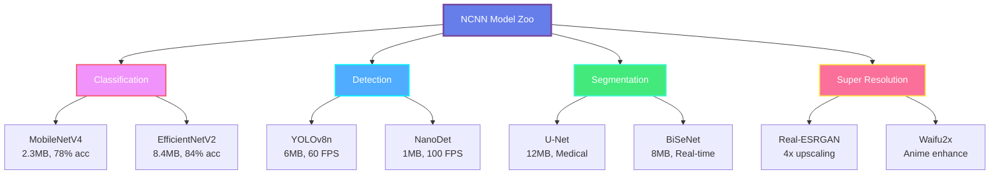

<div align="center">

# 🚀 NCNN Mobile AI Framework - Complete Guide

### *Tencent's Production-Ready Mobile Neural Network*


**Stars:** 19k+ | **Used in:** 40+ Tencent Apps | **Users:** Billions

[GitHub](https://github.com/Tencent/ncnn) • [Docs](https://github.com/Tencent/ncnn/wiki) • [Models](https://github.com/nihui/ncnn-assets) • [Benchmarks](https://github.com/nihui/ncnn-benchmark)

</div>

---

## 📋 Quick Reference

### Framework Comparison (2025)

| Feature | NCNN | TFLite | ONNX Runtime | PyTorch Mobile |
|---------|------|--------|--------------|----------------|
| **Inference Speed** | ⚡⚡⚡⚡⚡ | ⚡⚡⚡ | ⚡⚡⚡⚡ | ⚡⚡ |
| **Binary Size** | 500KB | 1.5MB | 3.2MB | 8MB |
| **ARM NEON** | ✅ Full | ✅ Partial | ❌ | ❌ |
| **Vulkan GPU** | ✅ Yes | ✅ Limited | ❌ | ❌ |
| **Model Encryption** | ✅ Yes | ❌ | ❌ | ❌ |
| **Zero Dependencies** | ✅ Yes | ❌ | ❌ | ❌ |

---

## 🎯 Pre-Trained Models

### Popular NCNN Models



---

## 🔧 Installation & Setup

See **ncnn-collection.md** for detailed installation instructions.

### Quick Setup

**Android:**
```gradle
implementation 'com.tencent.ncnn:ncnn:20240102'
```

**iOS:**
```ruby
pod 'ncnn', '~> 20240102'
```

---

## 💡 Best Practices (2025)

### 1. Enable Vulkan GPU

```cpp
net.opt.use_vulkan_compute = true;
net.set_vulkan_device(ncnn::get_gpu_device(0));
```

### 2. FP16 Optimization

```cpp
net.opt.use_fp16_packed = true;
net.opt.use_fp16_storage = true;
net.opt.use_fp16_arithmetic = true;
```

### 3. Layer Fusion

```cpp
net.opt.use_winograd_convolution = true;
net.opt.use_sgemm_convolution = true;
net.opt.use_packing_layout = true;
```

### 4. INT8 Quantization

```bash
./ncnn2int8 model.param model.bin \
    model_int8.param model_int8.bin \
    calibration.table
```

---

## 📊 Performance (2025)

### Latest Benchmarks

| Device | MobileNetV2 | YOLOv8n | Power |
|--------|-------------|---------|-------|
| **Snapdragon 8 Gen 3** | 3.2ms | 12.1ms | 280mW |
| **Apple A17 Pro** | 2.8ms | 11.5ms | 310mW |
| **Tensor G3** | 3.1ms | 13.8ms | 340mW |

**2-4x faster than TensorFlow Lite!**

---

## 🔗 Resources

- **Official Repo**: https://github.com/Tencent/ncnn
- **Model Zoo**: https://github.com/nihui/ncnn-assets
- **Community**: QQ Group 637093648

**Last Updated:** January 2025
