<div align="center">

# ⚡ ONNX Runtime & TensorRT Optimization

### *Enterprise-Grade Inference Acceleration*


**ONNX RT 1.17+** | **TensorRT 10.x** | **Production Ready**

[ONNX Runtime](https://onnxruntime.ai) • [TensorRT](https://developer.nvidia.com/tensorrt) • [Benchmarks](#-performance-benchmarks-2025)

</div>

---

## 🎯 Overview


---

## 🚀 ONNX Runtime (2025)

### Latest Features (v1.17+)

- ✨ **QNN Integration**: Qualcomm NPU acceleration
- 🔥 **CoreML EP 2.0**: Better iOS performance
- 📱 **NNAPI v1.3**: Android 14+ optimizations
- 🚀 **Dynamic Shapes**: Transformer support
- 💾 **Model Caching**: 10x faster first-run

### Quick Start

```python
import onnxruntime as ort

# Create session with multiple providers
providers = [
    ('TensorrtExecutionProvider', {
        'device_id': 0,
        'trt_max_workspace_size': 2147483648,
        'trt_fp16_enable': True,
    }),
    'CUDAExecutionProvider',
    'CPUExecutionProvider'
]

session = ort.InferenceSession("model.onnx", providers=providers)

# Run inference
input_name = session.get_inputs()[0].name
output = session.run(None, {input_name: input_data})[0]
```

### Execution Providers (2025)

| Provider | Platform | Acceleration | Speedup |
|----------|----------|--------------|---------|
| **TensorRT** | NVIDIA GPU | CUDA, Tensor Cores | 10-40x |
| **CUDA** | NVIDIA GPU | CUDA only | 5-10x |
| **CoreML** | iOS/macOS | Neural Engine | 3-5x |
| **NNAPI** | Android | NPU/DSP | 2-4x |
| **DirectML** | Windows | DX12 | 2-3x |
| **OpenVINO** | Intel | VPU/GPU | 2-4x |
| **XNNPACK** | Mobile CPU | ARM NEON | 2-3x |

---

## 🔥 TensorRT Optimization

### Architecture

```mermaid
graph TB
    A[ONNX Model] --> B[TensorRT Builder]

    B --> C1[Layer Fusion<br/>Conv+BN+ReLU→Single]
    B --> C2[Kernel Auto-Tuning<br/>1000+ variants tested]
    B --> C3[Precision Calibration<br/>FP32/FP16/INT8/INT4]
    B --> C4[Memory Optimization<br/>Reuse + Pooling]

    C1 --> D[TensorRT Engine<br/>.plan file]
    C2 --> D
    C3 --> D
    C4 --> D

    D --> E[Inference<br/>10-40x faster]

    style A fill:#667eea,stroke:#764ba2,stroke-width:3px,color:#fff
    style B fill:#f093fb,stroke:#f5576c,stroke-width:3px,color:#fff
    style D fill:#43e97b,stroke:#38f9d7,stroke-width:3px,color:#fff
    style E fill:#4facfe,stroke:#00f2fe,stroke-width:3px,color:#fff
```



### INT8 Quantization

```python
import tensorrt as trt

def build_engine_int8(onnx_file, calibration_data):
    TRT_LOGGER = trt.Logger(trt.Logger.WARNING)
    builder = trt.Builder(TRT_LOGGER)
    config = builder.create_builder_config()

    # Parse ONNX
    network = builder.create_network(
        1 << int(trt.NetworkDefinitionCreationFlag.EXPLICIT_BATCH)
    )
    parser = trt.OnnxParser(network, TRT_LOGGER)

    with open(onnx_file, 'rb') as model:
        parser.parse(model.read())

    # INT8 configuration
    config.set_flag(trt.BuilderFlag.INT8)
    config.int8_calibrator = Int8EntropyCalibrator(calibration_data)

    # Build engine
    engine = builder.build_engine(network, config)

    # Save engine
    with open("model_int8.plan", "wb") as f:
        f.write(engine.serialize())

    return engine
```

---

## 📊 Performance Benchmarks (2025)

### Inference Speed Comparison

| Model | Framework | Hardware | Latency | Throughput |
|-------|-----------|----------|---------|------------|
| **ResNet50** | PyTorch | A100 | 8.2ms | 122 FPS |
| **ResNet50** | ONNX RT | A100 | 2.3ms | 435 FPS |
| **ResNet50** | TensorRT FP16 | A100 | 0.8ms | 1250 FPS |
| **ResNet50** | TensorRT INT8 | A100 | 0.4ms | 2500 FPS |
| | | | |
| **BERT-Base** | PyTorch | A100 | 12.5ms | 80 FPS |
| **BERT-Base** | ONNX RT | A100 | 4.2ms | 238 FPS |
| **BERT-Base** | TensorRT FP16 | A100 | 1.8ms | 555 FPS |
| **BERT-Base** | TensorRT INT8 | A100 | 0.9ms | 1111 FPS |

### Mobile Performance (Pixel 8 Pro)

| Model | ONNX RT | TFLite | NCNN |
|-------|---------|--------|------|
| **MobileNetV2** | 4.9ms | 5.8ms | 3.2ms |
| **EfficientNet-B0** | 8.3ms | 9.7ms | 6.4ms |
| **YOLOv8n** | 18.5ms | 22.1ms | 12.1ms |

---

## 🔧 Optimization Techniques

### Quantization Comparison

```mermaid
graph LR
    A[FP32 Baseline<br/>100MB, 50ms] --> B[FP16<br/>50MB, 25ms<br/>↓50% size/time]
    B --> C[INT8<br/>25MB, 12ms<br/>↓75% size, ↓76% time]
    C --> D[INT4 NEW<br/>12MB, 6ms<br/>↓88% size/time]

    style A fill:#ff6b6b,stroke:#ee5a6f,stroke-width:2px,color:#fff
    style B fill:#ffd93d,stroke:#fbac04,stroke-width:2px,color:#000
    style C fill:#43e97b,stroke:#38f9d7,stroke-width:2px,color:#fff
    style D fill:#4facfe,stroke:#00f2fe,stroke-width:2px,color:#fff
```



### Dynamic Shapes (Transformers)

```python
# TensorRT dynamic batching
profile = builder.create_optimization_profile()
profile.set_shape(
    "input_ids",
    min=(1, 128),
    opt=(8, 128),
    max=(32, 128)
)
config.add_optimization_profile(profile)
```

---

## 🚀 Production Deployment

### Triton Inference Server

```python
import tritonclient.grpc as grpcclient

client = grpcclient.InferenceServerClient("localhost:8001")

# Create input
input_data = grpcclient.InferInput("input", [1, 3, 224, 224], "FP32")
input_data.set_data_from_numpy(image_array)

# Request
output = grpcclient.InferRequestedOutput("output")
response = client.infer("resnet50", inputs=[input_data], outputs=[output])

result = response.as_numpy("output")
```

---

## 📚 Resources

### Official Documentation

- **ONNX Runtime**: https://onnxruntime.ai
- **TensorRT**: https://developer.nvidia.com/tensorrt
- **Model Zoo**: https://github.com/onnx/models

### Tools

- **Netron**: Model visualization
- **onnx-simplifier**: Graph optimization
- **trtexec**: TensorRT profiling
- **Polygraphy**: Debugging toolkit

**Last Updated:** January 2025 | **ONNX RT 1.17** | **TensorRT 10.x**

