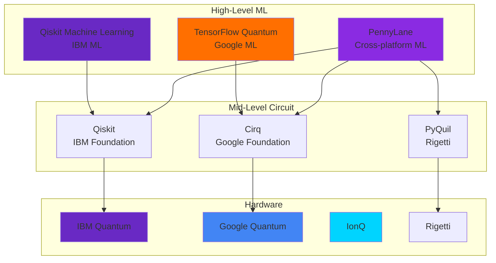
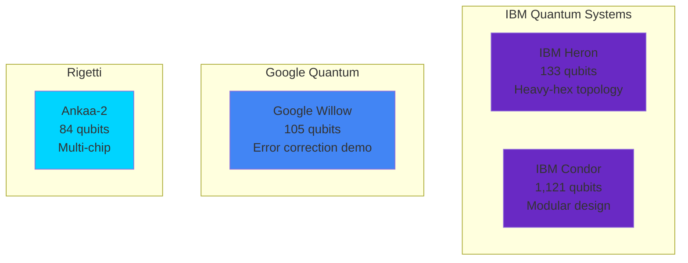
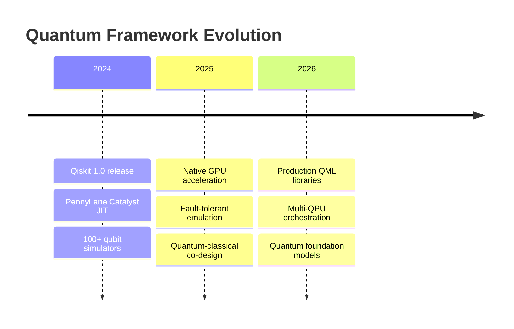

<div align="center">

<!-- Animated Quantum Header -->


<p align="center">
  <a href="#-major-frameworks"><kbd>Frameworks</kbd></a>
  <a href="#-quantum-hardware"><kbd>Hardware</kbd></a>
  <a href="#-cloud-platforms"><kbd>Cloud</kbd></a>
  <a href="#-development-tools"><kbd>Tools</kbd></a>
  <a href="#-comparison"><kbd>Comparison</kbd></a>
</p>

[](https://pennylane.ai/)
[](https://qiskit.org/)
[](https://www.tensorflow.org/quantum)
[](https://quantumai.google/cirq)

</div>

---

## 🎯 Major Frameworks

### Framework Ecosystem Map (2025)



---

## 🚀 PennyLane 0.35+

**[PennyLane](https://pennylane.ai/)** • Cross-platform quantum machine learning framework

### Why PennyLane in 2025?

✅ **Hardware Agnostic**: Run on IBM, Google, AWS, IonQ, Xanadu
✅ **AutoDiff**: Native PyTorch, TensorFlow, JAX, NumPy integration
✅ **100x Faster**: Catalyst JIT compilation
✅ **Best Documentation**: 500+ tutorials and demos
✅ **Active Development**: Monthly releases, strong community

### Installation & Setup

```bash
# Core PennyLane
pip install pennylane==0.35.0

# Device plugins
pip install pennylane-qiskit       # IBM Quantum
pip install pennylane-cirq         # Google Cirq
pip install pennylane-braket       # AWS Braket
pip install pennylane-ionq         # IonQ
pip install pennylane-sf           # Xanadu Strawberry Fields

# High-performance simulators
pip install pennylane-lightning[gpu]  # GPU acceleration
pip install pennylane-qulacs           # Fast C++ simulator

# Optional: Catalyst for JIT compilation
pip install pennylane-catalyst
```

### Core Features

**1. Quantum Nodes (QNodes)**

```python
import pennylane as qml
from pennylane import numpy as np

# Create device
dev = qml.device('default.qubit', wires=2)

@qml.qnode(dev, interface='autograd')
def quantum_circuit(params, x):
    """Quantum circuit as a differentiable function"""
    # Data encoding
    qml.AngleEmbedding(x, wires=[0, 1])

    # Parameterized gates
    qml.RY(params[0], wires=0)
    qml.RZ(params[1], wires=1)
    qml.CNOT(wires=[0, 1])

    # Measurement
    return qml.expval(qml.PauliZ(0))

# Use like any Python function
params = np.array([0.5, 0.3], requires_grad=True)
x = np.array([0.1, 0.2])

result = quantum_circuit(params, x)
print(f"Output: {result}")

# Automatic differentiation
gradient = qml.grad(quantum_circuit)
grad_result = gradient(params, x)
print(f"Gradient: {grad_result}")
```

**2. Quantum Templates**

```python
from pennylane.templates import (
    StronglyEntanglingLayers,
    AngleEmbedding,
    AmplitudeEmbedding,
    BasicEntanglerLayers
)

n_qubits = 4
n_layers = 3

dev = qml.device('default.qubit', wires=n_qubits)

@qml.qnode(dev)
def template_circuit(weights, features):
    """Using built-in templates"""

    # Data embedding
    AngleEmbedding(features, wires=range(n_qubits))

    # Variational layers
    StronglyEntanglingLayers(weights, wires=range(n_qubits))

    return [qml.expval(qml.PauliZ(i)) for i in range(n_qubits)]

# Initialize weights
weight_shape = StronglyEntanglingLayers.shape(n_layers=n_layers, n_wires=n_qubits)
weights = np.random.randn(*weight_shape)
features = np.random.randn(n_qubits)

output = template_circuit(weights, features)
```

**3. PyTorch Integration**

```python
import torch
import torch.nn as nn
import pennylane as qml

class HybridQNN(nn.Module):
    """Hybrid classical-quantum neural network"""

    def __init__(self):
        super().__init__()

        # Classical layers
        self.fc1 = nn.Linear(10, 4)

        # Quantum layer
        self.n_qubits = 4
        dev = qml.device('default.qubit', wires=self.n_qubits)

        @qml.qnode(dev, interface='torch')
        def quantum_layer(inputs, weights):
            for i in range(self.n_qubits):
                qml.RY(inputs[i], wires=i)

            for i in range(self.n_qubits):
                qml.RY(weights[i, 0], wires=i)
                qml.RZ(weights[i, 1], wires=i)

            for i in range(self.n_qubits - 1):
                qml.CNOT(wires=[i, i + 1])

            return [qml.expval(qml.PauliZ(i)) for i in range(self.n_qubits)]

        self.quantum_layer = quantum_layer
        self.q_weights = nn.Parameter(torch.randn(self.n_qubits, 2))

        # Output layer
        self.fc2 = nn.Linear(self.n_qubits, 2)

    def forward(self, x):
        # Classical preprocessing
        x = torch.relu(self.fc1(x))

        # Quantum processing
        q_out = self.quantum_layer(x, self.q_weights)
        q_out = torch.stack(q_out, dim=-1)

        # Classical postprocessing
        return self.fc2(q_out)

# Training
model = HybridQNN()
optimizer = torch.optim.Adam(model.parameters(), lr=0.01)
criterion = nn.CrossEntropyLoss()

X = torch.randn(100, 10)
y = torch.randint(0, 2, (100,))

for epoch in range(50):
    optimizer.zero_grad()
    outputs = model(X)
    loss = criterion(outputs, y)
    loss.backward()
    optimizer.step()

    if epoch % 10 == 0:
        print(f"Epoch {epoch}: Loss = {loss.item():.4f}")
```

**4. Catalyst JIT Compilation (NEW in 0.35)**

```python
import catalyst

@catalyst.qjit
@qml.qnode(dev)
def fast_circuit(x):
    """100x faster with JIT compilation"""
    qml.RY(x, wires=0)
    qml.CNOT(wires=[0, 1])
    return qml.expval(qml.PauliZ(0))

# First call compiles (slow)
result1 = fast_circuit(0.5)

# Subsequent calls are fast
result2 = fast_circuit(0.8)  # 100x faster!
```

### PennyLane Devices

| Device | Backend | Speed | Best For |
|--------|---------|-------|----------|
| `default.qubit` | Pure Python | Slow | Small circuits, debugging |
| `lightning.qubit` | C++ | 10x faster | Medium circuits |
| `lightning.gpu` | CUDA/ROCm | 100x faster | Large circuits, training |
| `qiskit.ibm` | IBM Hardware | Real QPU | Production |
| `cirq.simulator` | Google | Fast | Google ecosystem |
| `braket.local.qubit` | AWS | Medium | AWS development |

---

## 🔷 Qiskit 1.0+

**[Qiskit](https://qiskit.org/)** • IBM's comprehensive quantum computing framework

### Major 1.0 Changes (2024)

🎉 **Complete rewrite** for performance
🎉 **Primitives-based** workflow (Sampler, Estimator)
🎉 **Runtime integration** with error mitigation
🎉 **Faster transpilation** (5-10x speedup)
🎉 **Simplified API** with better docs

### Installation

```bash
# Qiskit 1.0+ (meta-package)
pip install qiskit==1.0.0

# IBM Quantum access
pip install qiskit-ibm-runtime

# Qiskit Nature (chemistry)
pip install qiskit-nature

# Qiskit Machine Learning
pip install qiskit-machine-learning

# Qiskit Optimization
pip install qiskit-optimization

# Visualization
pip install qiskit[visualization]
```

### Primitives Workflow

**Old (Qiskit 0.x):**
```python
# Old way (deprecated)
from qiskit import execute, Aer

backend = Aer.get_backend('qasm_simulator')
job = execute(circuit, backend, shots=1000)
result = job.result()
counts = result.get_counts()
```

**New (Qiskit 1.0+):**
```python
from qiskit import QuantumCircuit
from qiskit.primitives import Sampler, Estimator
from qiskit.quantum_info import SparsePauliOp

# Create circuit
qc = QuantumCircuit(2)
qc.h(0)
qc.cx(0, 1)
qc.measure_all()

# Sampler primitive (for sampling)
sampler = Sampler()
job = sampler.run(qc, shots=1000)
result = job.result()
counts = result.quasi_dists[0]

# Estimator primitive (for expectation values)
observable = SparsePauliOp.from_list([("ZZ", 1.0), ("XX", 0.5)])
estimator = Estimator()
job = estimator.run(qc, observable)
result = job.result()
expectation = result.values[0]
```

### IBM Quantum Hardware Access

```python
from qiskit_ibm_runtime import QiskitRuntimeService, Session, Sampler, Estimator
from qiskit_ibm_runtime import Options

# Save account (one-time)
QiskitRuntimeService.save_account(
    channel='ibm_quantum',
    token='YOUR_IBM_QUANTUM_TOKEN',
    overwrite=True
)

# Load service
service = QiskitRuntimeService()

# Find best backend
backend = service.least_busy(
    operational=True,
    simulator=False,
    min_num_qubits=127
)

print(f"Using backend: {backend.name}")
print(f"  Qubits: {backend.configuration().n_qubits}")
print(f"  Quantum Volume: {backend.configuration().quantum_volume}")

# Configure options
options = Options()
options.optimization_level = 3  # Maximum optimization
options.resilience_level = 2    # Error mitigation
options.execution.shots = 1000

# Run with session
with Session(service=service, backend=backend) as session:
    sampler = Sampler(session=session, options=options)

    job = sampler.run(qc)
    job_id = job.job_id()
    print(f"Job ID: {job_id}")

    result = job.result()
    print(f"Results: {result.quasi_dists[0]}")
```

### Qiskit Machine Learning

```python
from qiskit.circuit.library import ZZFeatureMap, RealAmplitudes
from qiskit_machine_learning.neural_networks import EstimatorQNN
from qiskit_machine_learning.algorithms import VQC
from qiskit_algorithms.optimizers import COBYLA

# Feature map and ansatz
feature_map = ZZFeatureMap(feature_dimension=4, reps=2)
ansatz = RealAmplitudes(num_qubits=4, reps=3)

# Create QNN
qnn = EstimatorQNN(
    circuit=feature_map.compose(ansatz),
    input_params=feature_map.parameters,
    weight_params=ansatz.parameters
)

# Variational Quantum Classifier
vqc = VQC(
    feature_map=feature_map,
    ansatz=ansatz,
    optimizer=COBYLA(maxiter=100)
)

# Train
from sklearn.datasets import make_classification
X_train, y_train = make_classification(n_samples=100, n_features=4, n_classes=2)

vqc.fit(X_train, y_train)

# Predict
X_test, y_test = make_classification(n_samples=20, n_features=4, n_classes=2, random_state=42)
accuracy = vqc.score(X_test, y_test)
print(f"Accuracy: {accuracy:.2%}")
```

---

## 🔶 TensorFlow Quantum

**[TensorFlow Quantum (TFQ)](https://www.tensorflow.org/quantum)** • Google's quantum ML framework

### Key Features

- 🔥 TensorFlow 2.x integration
- 🔥 Keras API for quantum layers
- 🔥 Hybrid quantum-classical models
- 🔥 Cirq backend
- 🔥 Batch quantum processing

### Installation

```bash
pip install tensorflow==2.15.0
pip install tensorflow-quantum==0.7.3
```

### Quantum Layers in Keras

```python
import tensorflow as tf
import tensorflow_quantum as tfq
import cirq
import sympy

# Define qubits
qubits = cirq.GridQubit.rect(1, 4)

# Create quantum layer
def create_quantum_model():
    """Hybrid quantum-classical model"""

    # Classical input
    input_layer = tf.keras.Input(shape=(4,), dtype=tf.float32, name='input')

    # Quantum circuit with parameters
    theta = sympy.symbols('theta_0:12')
    circuit = cirq.Circuit()

    # Encoding layer
    for i, qubit in enumerate(qubits):
        circuit += cirq.rx(theta[i])(qubit)

    # Variational layer
    for i in range(len(qubits) - 1):
        circuit += cirq.CNOT(qubits[i], qubits[i + 1])

    for i, qubit in enumerate(qubits):
        circuit += cirq.ry(theta[i + 4])(qubit)
        circuit += cirq.rz(theta[i + 8])(qubit)

    # Measurement operators
    readouts = [cirq.Z(q) for q in qubits]

    # Create quantum layer
    quantum_layer = tfq.layers.PQC(
        circuit,
        readouts,
        repetitions=1000
    )

    # Build model
    quantum_output = quantum_layer(input_layer)
    output_layer = tf.keras.layers.Dense(2, activation='softmax')(quantum_output)

    model = tf.keras.Model(inputs=input_layer, outputs=output_layer)
    return model

# Create and compile
model = create_quantum_model()
model.compile(
    optimizer=tf.keras.optimizers.Adam(learning_rate=0.01),
    loss='sparse_categorical_crossentropy',
    metrics=['accuracy']
)

# Train
import numpy as np
X_train = np.random.randn(100, 4).astype(np.float32)
y_train = np.random.randint(0, 2, size=(100,))

history = model.fit(
    X_train,
    y_train,
    epochs=20,
    batch_size=10,
    validation_split=0.2,
    verbose=1
)
```

### Quantum Data Processing

```python
# Encode classical data as quantum circuits
def encode_data(x):
    """Encode classical data point as quantum circuit"""
    qubits = cirq.GridQubit.rect(1, len(x))
    circuit = cirq.Circuit()

    for i, qubit in enumerate(qubits):
        circuit += cirq.rx(x[i])(qubit)

    return circuit

# Batch encoding
X = np.random.randn(100, 4)
quantum_data = tfq.convert_to_tensor([encode_data(x) for x in X])

print(f"Quantum data tensor shape: {quantum_data.shape}")
```

---

## ☁️ Cloud Platforms

### Platform Comparison 2024-2025

| Platform | Pricing | Free Tier | Devices | Best For |
|----------|---------|-----------|---------|----------|
| **IBM Quantum** | Free + Premium | 10 min/month | 20+ QPUs (up to 433 qubits) | Research, Education |
| **AWS Braket** | Pay-per-use | Simulator only | IonQ, Rigetti, OQC, QuEra | Production, Enterprise |
| **Azure Quantum** | Credits | $500 free credits | IonQ, Quantinuum, Rigetti | Microsoft ecosystem |
| **Google Quantum AI** | Partner only | Research partners | Sycamore (105 qubits) | Advanced research |
| **Xanadu Cloud** | Free + Paid | Limited free | Borealis (photonic) | Photonic QC research |

### AWS Braket

```python
from braket.circuits import Circuit
from braket.aws import AwsDevice
from braket.devices import LocalSimulator

# Local simulation (free)
device = LocalSimulator()

circuit = Circuit().h(0).cnot(0, 1)
task = device.run(circuit, shots=1000)
result = task.result()

print("Local simulation:")
print(result.measurement_counts)

# IonQ hardware (paid)
ionq_device = AwsDevice("arn:aws:braket:us-east-1::device/qpu/ionq/Forte")

# Check device availability
if ionq_device.status == 'ONLINE':
    task = ionq_device.run(circuit, shots=100)

    # Pricing for this task:
    # - Per-task fee: $0.30
    # - Per-shot fee: $0.01 × 100 = $1.00
    # Total: $1.30

    result = task.result()
    print("\nIonQ hardware:")
    print(result.measurement_counts)
```

**AWS Braket Pricing:**

| Device | Per-Task | Per-Shot | Typical Cost (1000 shots) |
|--------|----------|----------|---------------------------|
| SV1 Simulator | $0.075/min | - | ~$0.50 |
| IonQ Aria | $0.30 | $0.01 | $10.30 |
| Rigetti Aspen-M-3 | $0.30 | $0.00035 | $0.65 |
| OQC Lucy | $0.30 | $0.00035 | $0.65 |

### Azure Quantum

```python
from azure.quantum import Workspace
from azure.quantum.qiskit import AzureQuantumProvider

# Create workspace
workspace = Workspace(
    resource_id="/subscriptions/.../resourceGroups/.../providers/Microsoft.Quantum/Workspaces/...",
    location="eastus"
)

# Get provider
provider = AzureQuantumProvider(workspace)

# List backends
backends = provider.backends()
for backend in backends:
    print(f"{backend.name()}: {backend.status()}")

# Use IonQ simulator
backend = provider.get_backend("ionq.simulator")

from qiskit import QuantumCircuit

qc = QuantumCircuit(2)
qc.h(0)
qc.cx(0, 1)
qc.measure_all()

job = backend.run(qc, shots=1000)
result = job.result()
print(result.get_counts())
```

---

## 🖥️ Quantum Hardware Specifications

### Superconducting Qubits (2025)

| System | Provider | Qubits | Quantum Volume | CNOT Error | Access |
|--------|----------|--------|----------------|------------|--------|
| **IBM Condor** | IBM | 1,121 | TBD | ~1% | Premium |
| **IBM Heron** | IBM | 133 | 512 | 0.7% | Open |
| **Google Willow** | Google | 105 | TBD | 0.1% | Partners |
| **Rigetti Ankaa-2** | Rigetti | 84 | 64 | 1.2% | AWS Braket |



### Trapped Ion Qubits (2025)

| System | Provider | Qubits | Fidelity | Connectivity | Access |
|--------|----------|--------|----------|--------------|--------|
| **IonQ Forte** | IonQ | 36 | 99.9% | All-to-all | AWS, Azure |
| **Quantinuum H2** | Quantinuum | 56 | 99.97% | All-to-all | Azure |

**Advantages of Trapped Ions:**
- ✅ Higher gate fidelity (99%+)
- ✅ All-to-all connectivity
- ✅ Longer coherence times
- ⚠️ Slower gate times (~100μs)

### Photonic Systems

| System | Provider | Modes | Type | Access |
|--------|----------|-------|------|--------|
| **Xanadu Borealis** | Xanadu | 216 | GBS | Cloud (free tier) |

---

## 🔧 Development Tools

### Quantum Circuit Optimization

**t|ket⟩ (Cambridge Quantum)**

```python
from pytket import Circuit
from pytket.extensions.qiskit import qiskit_to_tk, tk_to_qiskit
from pytket.passes import FullPeepholeOptimise

# Create Qiskit circuit
from qiskit import QuantumCircuit

qc = QuantumCircuit(3)
for _ in range(10):
    qc.h(0)
    qc.cx(0, 1)
    qc.cx(1, 2)

print(f"Original gates: {qc.count_ops()}")
print(f"Original depth: {qc.depth()}")

# Convert to t|ket⟩
tk_circuit = qiskit_to_tk(qc)

# Optimize
FullPeepholeOptimise().apply(tk_circuit)

# Convert back
optimized_qc = tk_to_qiskit(tk_circuit)

print(f"Optimized gates: {optimized_qc.count_ops()}")
print(f"Optimized depth: {optimized_qc.depth()}")
print(f"Improvement: {(1 - optimized_qc.depth()/qc.depth())*100:.1f}% reduction")
```

### Error Mitigation (Mitiq)

```python
from mitiq import zne
from qiskit import QuantumCircuit
from qiskit.primitives import Sampler

# Noisy circuit execution
def execute_circuit(circuit, noise_scale=1.0):
    """Execute circuit with noise"""
    # Add noise proportional to noise_scale
    # In practice, this would use a noisy simulator
    sampler = Sampler()
    job = sampler.run(circuit, shots=1000)
    result = job.result()
    return result.quasi_dists[0]

# Create circuit
qc = QuantumCircuit(2)
qc.h(0)
qc.cx(0, 1)

# Zero-noise extrapolation
mitigated_result = zne.execute_with_zne(
    qc,
    execute_circuit,
    scale_noise=zne.scaling.fold_gates_at_random
)

print("Mitigated result:", mitigated_result)
```

---

## 📊 Framework Comparison

### Feature Matrix

| Feature | PennyLane | Qiskit | TFQ | Cirq | Braket |
|---------|-----------|--------|-----|------|--------|
| **AutoDiff** | ✅ Native | ⚠️ Manual | ✅ TF | ⚠️ JAX | ❌ |
| **PyTorch** | ✅ | ⚠️ Via conversion | ❌ | ❌ | ❌ |
| **TensorFlow** | ✅ | ❌ | ✅ | ⚠️ Via TFQ | ❌ |
| **JAX** | ✅ | ❌ | ❌ | ✅ | ❌ |
| **IBM Hardware** | ✅ | ✅ Native | ❌ | ❌ | ❌ |
| **Google Hardware** | ✅ | ❌ | ✅ | ✅ Native | ❌ |
| **AWS Devices** | ✅ | ❌ | ❌ | ❌ | ✅ Native |
| **Simulators** | ✅ Fast | ✅ Good | ✅ TF-based | ✅ Fast | ✅ Cloud |
| **Documentation** | ✅ Excellent | ✅ Excellent | ✅ Good | ✅ Good | ✅ Good |
| **Community** | 🟢 Large | 🟢 Largest | 🟡 Medium | 🟡 Medium | 🟡 Medium |
| **Learning Curve** | 🟢 Easy | 🟡 Moderate | 🟡 Moderate | 🔴 Hard | 🟢 Easy |

### Performance Benchmarks

```python
import time
import pennylane as qml
from qiskit import QuantumCircuit
from qiskit.primitives import Sampler

# Benchmark: 20-qubit circuit, 100 shots

# PennyLane
dev_pl = qml.device('lightning.qubit', wires=20)

@qml.qnode(dev_pl)
def pl_circuit():
    for i in range(20):
        qml.Hadamard(wires=i)
    for i in range(19):
        qml.CNOT(wires=[i, i+1])
    return qml.probs(wires=range(20))

start = time.time()
pl_result = pl_circuit()
pl_time = time.time() - start

# Qiskit
qc = QuantumCircuit(20)
for i in range(20):
    qc.h(i)
for i in range(19):
    qc.cx(i, i+1)
qc.measure_all()

sampler = Sampler()
start = time.time()
job = sampler.run(qc, shots=100)
qiskit_result = job.result()
qiskit_time = time.time() - start

print("Performance Comparison:")
print(f"  PennyLane: {pl_time:.4f}s")
print(f"  Qiskit: {qiskit_time:.4f}s")
```

---

## 🎓 Learning Resources

### Official Tutorials

| Framework | Tutorial Link | Difficulty | Focus |
|-----------|--------------|------------|-------|
| PennyLane | [pennylane.ai/qml](https://pennylane.ai/qml/) | 🟢 Beginner | Quantum ML |
| Qiskit | [qiskit.org/textbook](https://qiskit.org/textbook/) | 🟡 Intermediate | Full stack QC |
| TFQ | [tensorflow.org/quantum](https://www.tensorflow.org/quantum/tutorials) | 🟡 Intermediate | Hybrid ML |
| Cirq | [quantumai.google/cirq](https://quantumai.google/cirq/tutorials) | 🔴 Advanced | Low-level control |

### Community

| Platform | Link | Members | Activity |
|----------|------|---------|----------|
| Qiskit Slack | [qisk.it/slack](https://qisk.it/slack) | 20,000+ | 🔥 Very Active |
| PennyLane Forum | [discuss.pennylane.ai](https://discuss.pennylane.ai/) | 5,000+ | 🔥 Very Active |
| Quantum Computing SE | [quantumcomputing.stackexchange.com](https://quantumcomputing.stackexchange.com/) | 15,000+ | 🔥 Very Active |
| r/QuantumComputing | [reddit.com/r/QuantumComputing](https://reddit.com/r/QuantumComputing) | 50,000+ | 🟡 Active |

---

## 🚀 Quick Start Guide

### Choose Your Framework

```python
def recommend_framework(use_case):
    """Framework selection guide"""

    recommendations = {
        "quantum_ml_research": "PennyLane - Best ML integration",
        "ibm_hardware": "Qiskit - Native IBM access",
        "tensorflow_projects": "TensorFlow Quantum - TF ecosystem",
        "google_hardware": "Cirq - Google native",
        "production_cloud": "AWS Braket - Multi-vendor",
        "learning_qc": "Qiskit - Best tutorials",
        "fast_prototyping": "PennyLane - Easiest API",
        "low_level_control": "Cirq - Maximum flexibility"
    }

    return recommendations.get(use_case, "Try PennyLane first - most versatile")

# Examples
print(recommend_framework("quantum_ml_research"))
# Output: PennyLane - Best ML integration

print(recommend_framework("ibm_hardware"))
# Output: Qiskit - Native IBM access
```

### Installation Quick Reference

```bash
# Minimal setup (choose one)
pip install pennylane          # For quantum ML
pip install qiskit             # For IBM Quantum
pip install tensorflow-quantum # For Google/TensorFlow

# Full quantum ML stack
pip install pennylane qiskit qiskit-machine-learning torch

# Production deployment
pip install pennylane-lightning[gpu] qiskit-ibm-runtime
```

---

<div align="center">

## 🌟 2025 Framework Trends



### Emerging Technologies

- 🔬 **Quantum AutoML**: Automated circuit design
- 🧠 **Quantum Transformers**: Attention mechanisms on QPUs
- ⚡ **Edge Quantum Computing**: Local quantum devices
- 🌐 **Quantum Internet**: Distributed quantum computing
- 🔐 **Post-Quantum ML**: Quantum-resistant algorithms


**Last Updated:** January 2025 • **Maintained by:** Quantum ML Community

[](https://docs.pennylane.ai/)
[](https://qiskit.org/textbook/)
[](https://www.tensorflow.org/quantum/tutorials)
[](https://quantumcomputing.stackexchange.com/)

</div>
