<div align="center">

<!-- Animated Quantum Header -->


<p align="center">
  <a href="#-foundational-algorithms"><kbd>Foundational</kbd></a>
  <a href="#-variational-algorithms"><kbd>Variational</kbd></a>
  <a href="#-optimization"><kbd>Optimization</kbd></a>
  <a href="#-quantum-search"><kbd>Search</kbd></a>
  <a href="#-quantum-linear-algebra"><kbd>Linear Algebra</kbd></a>
</p>

[](.)
[](.)
[](.)
[](.)

</div>

---

## 🎯 Foundational Algorithms

### Deutsch-Jozsa: First Quantum Advantage

**Problem:** Determine if function f:{0,1}ⁿ → {0,1} is constant or balanced

```mermaid
graph LR
    A["|0...0⟩"] -->|Initialize| B["|0...01⟩"]
    B -->|Hadamard All| C["Superposition"]
    C -->|Oracle Uf| D["Phase Kickback"]
    D -->|Hadamard Again| E["Interference"]
    E -->|Measure| F{Result}
    F -->|All 0| G["Constant"]
    F -->|Any 1| H["Balanced"]

    style A fill:#667eea
    style C fill:#8A2BE2
    style D fill:#9D50BB
    style E fill:#6E48AA
    style G fill:#00D4FF
    style H fill:#00D4FF
```



**Qiskit Implementation:**

```python
from qiskit import QuantumCircuit, QuantumRegister, ClassicalRegister, transpile
from qiskit.primitives import Sampler
import numpy as np

def deutsch_jozsa(oracle_type='constant', n=4):
    """
    Deutsch-Jozsa algorithm

    Args:
        oracle_type: 'constant' or 'balanced'
        n: number of input qubits

    Returns:
        measurement result
    """
    # Create quantum circuit
    qr = QuantumRegister(n + 1, 'q')
    cr = ClassicalRegister(n, 'c')
    qc = QuantumCircuit(qr, cr)

    # Step 1: Initialize ancilla to |1⟩
    qc.x(qr[n])

    # Step 2: Apply Hadamard to all qubits
    qc.h(qr)
    qc.barrier()

    # Step 3: Apply oracle
    if oracle_type == 'constant':
        # Oracle that does nothing (f(x) = 0)
        pass  # or qc.i(qr) for identity
    elif oracle_type == 'balanced':
        # Oracle that flips based on first qubit
        qc.cx(qr[0], qr[n])
    qc.barrier()

    # Step 4: Apply Hadamard to input qubits
    for i in range(n):
        qc.h(qr[i])
    qc.barrier()

    # Step 5: Measure
    qc.measure(qr[:n], cr)

    return qc

# Test constant oracle
qc_const = deutsch_jozsa('constant', n=4)
sampler = Sampler()
job = sampler.run(qc_const, shots=1000)
result = job.result()
counts = result.quasi_dists[0]

print("Constant oracle results:", counts)
# Expected: All measurements give 0000

# Test balanced oracle
qc_balanced = deutsch_jozsa('balanced', n=4)
job = sampler.run(qc_balanced, shots=1000)
result = job.result()
counts = result.quasi_dists[0]

print("Balanced oracle results:", counts)
# Expected: Non-zero results
```

**Speedup:**
- Classical: O(2^(n-1) + 1) queries
- Quantum: O(1) query
- **Exponential advantage!**

---

## 🔬 Variational Algorithms

### Variational Quantum Eigensolver (VQE)

**Purpose:** Find ground state energy of quantum systems (molecules, materials)

**Workflow Diagram:**

```mermaid
graph TB
    A[Hamiltonian H] --> B[Ansatz |ψ θ ⟩]
    B --> C[Quantum Circuit]
    C --> D[Measure ⟨ψ θ |H|ψ θ ⟩]
    D --> E{Energy < Threshold?}
    E -->|No| F[Classical Optimizer]
    F -->|Update θ| B
    E -->|Yes| G[Ground State Found]

    style A fill:#667eea
    style B fill:#8A2BE2
    style C fill:#9D50BB
    style D fill:#6E48AA
    style F fill:#4FACFE
    style G fill:#00D4FF
```

**Complete VQE Implementation (Qiskit):**

```python
from qiskit import QuantumCircuit
from qiskit.circuit import Parameter
from qiskit.primitives import Estimator
from qiskit.quantum_info import SparsePauliOp
from qiskit_algorithms import VQE
from qiskit_algorithms.optimizers import SLSQP, COBYLA
from qiskit.circuit.library import TwoLocal
import numpy as np

# Example: H2 molecule Hamiltonian (simplified)
# In practice, use qiskit_nature for real molecules
hamiltonian = SparsePauliOp.from_list([
    ("II", -1.0523732),
    ("IZ", 0.39793742),
    ("ZI", -0.39793742),
    ("ZZ", -0.01128010),
    ("XX", 0.18093119)
])

# Ansatz: Hardware-efficient ansatz
ansatz = TwoLocal(
    num_qubits=2,
    rotation_blocks=['ry', 'rz'],
    entanglement_blocks='cz',
    entanglement='full',
    reps=3,
    insert_barriers=True
)

# Classical optimizer
optimizer = SLSQP(maxiter=1000)

# Estimator primitive
estimator = Estimator()

# VQE instance
vqe = VQE(
    estimator=estimator,
    ansatz=ansatz,
    optimizer=optimizer,
    initial_point=np.random.random(ansatz.num_parameters)
)

# Run VQE
result = vqe.compute_minimum_eigenvalue(hamiltonian)

print("=== VQE Results ===")
print(f"Ground state energy: {result.eigenvalue:.6f}")
print(f"Optimal parameters: {result.optimal_parameters}")
print(f"Optimizer evaluations: {result.cost_function_evals}")
print(f"Optimal value: {result.optimal_value:.6f}")

# Visualize ansatz
print("\nAnsatz circuit:")
print(ansatz.decompose().draw())
```

**Advanced VQE with Error Mitigation:**

```python
from qiskit_ibm_runtime import QiskitRuntimeService, Session, Estimator as RuntimeEstimator
from qiskit_ibm_runtime import Options

# Setup IBM Quantum
service = QiskitRuntimeService()
backend = service.least_busy(operational=True, simulator=False, min_num_qubits=2)

# Runtime options with error mitigation
options = Options()
options.optimization_level = 3
options.resilience_level = 2  # Error mitigation

# VQE with real hardware
with Session(service=service, backend=backend) as session:
    runtime_estimator = RuntimeEstimator(session=session, options=options)

    vqe_runtime = VQE(
        estimator=runtime_estimator,
        ansatz=ansatz,
        optimizer=COBYLA(maxiter=50)  # Fewer iterations on real hardware
    )

    result_hw = vqe_runtime.compute_minimum_eigenvalue(hamiltonian)
    print(f"\nHardware result: {result_hw.eigenvalue:.6f}")
```

**VQE Applications (2024-2025):**

| Application | Impact | Status |
|------------|--------|--------|
| 🧬 Drug Discovery | 40% faster molecular simulation | ✅ Production |
| 🔋 Battery Materials | Novel lithium compounds | 🔬 Research |
| 🌿 Catalysts | CO2 reduction catalysts | 🔬 Research |
| ⚛️ High-T Superconductors | Material design | 🔬 Research |

---

### Quantum Approximate Optimization Algorithm (QAOA)

**Purpose:** Solve combinatorial optimization problems (MaxCut, TSP, etc.)

**Circuit Structure:**



```mermaid
graph LR
    A["|+⟩⊗n"] -->|Cost Hamiltonian| B["e^(-iγC)"]
    B -->|Mixer Hamiltonian| C["e^(-iβB)"]
    C -->|Repeat p times| D["|γ,β⟩"]
    D -->|Measure| E["Solution"]

    style A fill:#667eea
    style B fill:#8A2BE2
    style C fill:#9D50BB
    style D fill:#6E48AA
    style E fill:#00D4FF
```

**QAOA for MaxCut:**

```python
from qiskit_optimization.applications import Maxcut
from qiskit_optimization.converters import QuadraticProgramToQubo
from qiskit.primitives import Sampler
from qiskit_algorithms import QAOA
from qiskit_algorithms.optimizers import COBYLA
import networkx as nx
import matplotlib.pyplot as plt

# Create graph
G = nx.Graph()
G.add_edges_from([
    (0, 1), (1, 2), (2, 3), (3, 0),  # Square
    (0, 2), (1, 3)  # Diagonals
])

# Convert to optimization problem
maxcut = Maxcut(G)
qp = maxcut.to_quadratic_program()
print("MaxCut problem:")
print(qp.prettyprint())

# Convert to Ising Hamiltonian
from qiskit_optimization.converters import InequalityToEquality, IntegerToBinary, LinearEqualityToPenalty

# Convert to QUBO then to Ising
qubo = QuadraticProgramToQubo().convert(qp)
operator, offset = qubo.to_ising()

print(f"\nIsing Hamiltonian (offset: {offset}):")
print(operator)

# QAOA with p=3 layers
p = 3  # Number of QAOA layers
sampler = Sampler()
optimizer = COBYLA(maxiter=100)

qaoa = QAOA(
    sampler=sampler,
    optimizer=optimizer,
    reps=p
)

result = qaoa.compute_minimum_eigenvalue(operator)

# Extract solution
from qiskit_optimization.algorithms import MinimumEigenOptimizer

meo = MinimumEigenOptimizer(qaoa)
result = meo.solve(qp)

print("\n=== QAOA Results ===")
print(f"Optimal value: {result.fval}")
print(f"Optimal solution: {result.x}")
print(f"Status: {result.status}")

# Visualize solution
colors = ['red' if result.x[i] == 1 else 'blue' for i in range(len(result.x))]
nx.draw(G, node_color=colors, with_labels=True, node_size=500)
plt.title(f"MaxCut Solution (value: {result.fval})")
plt.show()
```

**QAOA Performance vs Depth:**

```python
# Benchmark QAOA performance
import time

depths = [1, 2, 3, 5, 10]
results = []

for p in depths:
    start = time.time()

    qaoa = QAOA(sampler=sampler, optimizer=COBYLA(maxiter=50), reps=p)
    meo = MinimumEigenOptimizer(qaoa)
    result = meo.solve(qp)

    elapsed = time.time() - start
    results.append({
        'depth': p,
        'value': result.fval,
        'time': elapsed,
        'evaluations': result.raw_results.cost_function_evals
    })

    print(f"p={p}: value={result.fval:.3f}, time={elapsed:.2f}s")

# Optimal depth is usually p=3-5 for NISQ devices
```

**QAOA Applications:**

| Problem | Graph Size (2024) | Quantum Advantage? |
|---------|------------------|-------------------|
| MaxCut | 127 nodes | ⚠️ Marginal |
| Portfolio Optimization | 20 assets | ✅ Competitive |
| Vehicle Routing | 50 locations | 🔬 Research |
| Protein Folding | Small proteins | 🔬 Research |

---

## 🔍 Quantum Search

### Grover's Algorithm

**Purpose:** Search unstructured database in O(√N) time

**Circuit Diagram:**

```mermaid
graph TB
    A["Initialize |s⟩ = H⊗n|0⟩"] --> B["Apply Oracle Uf"]
    B --> C["Apply Diffusion Operator"]
    C --> D{Iterations = O√N ?}
    D -->|No| B
    D -->|Yes| E["Measure"]

    style A fill:#667eea
    style B fill:#8A2BE2
    style C fill:#9D50BB
    style E fill:#00D4FF
```



**Complete Grover Implementation:**

```python
from qiskit import QuantumCircuit
from qiskit.circuit.library import GroverOperator
import math

def grover_oracle(marked_items, n_qubits):
    """
    Create oracle that marks specific items

    Args:
        marked_items: List of integers to mark
        n_qubits: Number of qubits

    Returns:
        Oracle circuit
    """
    oracle = QuantumCircuit(n_qubits, name='Oracle')

    for item in marked_items:
        # Convert item to binary string
        binary = format(item, f'0{n_qubits}b')

        # Flip qubits that should be 0
        for i, bit in enumerate(binary):
            if bit == '0':
                oracle.x(i)

        # Multi-controlled Z gate
        oracle.h(n_qubits - 1)
        oracle.mcx(list(range(n_qubits - 1)), n_qubits - 1)
        oracle.h(n_qubits - 1)

        # Unflip
        for i, bit in enumerate(binary):
            if bit == '0':
                oracle.x(i)

    return oracle

def grover_diffuser(n_qubits):
    """Inversion about average (diffusion operator)"""
    qc = QuantumCircuit(n_qubits, name='Diffuser')

    # Apply H gates
    qc.h(range(n_qubits))

    # Apply X gates
    qc.x(range(n_qubits))

    # Multi-controlled Z
    qc.h(n_qubits - 1)
    qc.mcx(list(range(n_qubits - 1)), n_qubits - 1)
    qc.h(n_qubits - 1)

    # Apply X gates
    qc.x(range(n_qubits))

    # Apply H gates
    qc.h(range(n_qubits))

    return qc

def grover_search(marked_items, n_qubits):
    """
    Complete Grover's search algorithm

    Args:
        marked_items: Items to find
        n_qubits: Number of qubits

    Returns:
        Quantum circuit
    """
    N = 2 ** n_qubits
    num_iterations = math.floor(math.pi / 4 * math.sqrt(N / len(marked_items)))

    # Create circuit
    qc = QuantumCircuit(n_qubits, n_qubits)

    # Initialize superposition
    qc.h(range(n_qubits))
    qc.barrier()

    # Create oracle and diffuser
    oracle = grover_oracle(marked_items, n_qubits)
    diffuser = grover_diffuser(n_qubits)

    # Apply Grover iterations
    for _ in range(num_iterations):
        qc.append(oracle, range(n_qubits))
        qc.barrier()
        qc.append(diffuser, range(n_qubits))
        qc.barrier()

    # Measure
    qc.measure(range(n_qubits), range(n_qubits))

    return qc

# Search for item 6 in database of size 16 (4 qubits)
n_qubits = 4
marked = [6]  # Looking for item 6

qc = grover_search(marked, n_qubits)
print(f"Grover iterations: {math.floor(math.pi/4 * math.sqrt(2**n_qubits))}")
print(qc.draw())

# Execute
from qiskit.primitives import Sampler

sampler = Sampler()
job = sampler.run(qc, shots=1000)
result = job.result()
counts = result.quasi_dists[0]

# Convert to counts
from collections import Counter
counts_dict = {format(k, '04b'): int(v * 1000) for k, v in counts.items() if v > 0}
sorted_counts = dict(sorted(counts_dict.items(), key=lambda x: x[1], reverse=True))

print("\nMeasurement results:")
for state, count in list(sorted_counts.items())[:5]:
    print(f"  |{state}⟩: {count} shots ({count/10:.1f}%)")

# Item 6 = 0110 should have highest probability
```

**Grover Applications in ML:**

```python
# Example: Hyperparameter search
def evaluate_hyperparams(index):
    """Evaluate ML model with hyperparameters at index"""
    # Map index to hyperparameter combination
    learning_rates = [0.001, 0.01, 0.1]
    batch_sizes = [16, 32, 64, 128]

    lr_idx = index // len(batch_sizes)
    bs_idx = index % len(batch_sizes)

    lr = learning_rates[lr_idx]
    bs = batch_sizes[bs_idx]

    # Train model and return score
    # ... training code ...
    return score

# Use Grover to find best hyperparameters faster than grid search
# Classical: O(N) evaluations
# Quantum: O(√N) evaluations
```

---

## 📐 Quantum Linear Algebra

### HHL Algorithm (Solving Linear Systems)

**Problem:** Solve Ax = b for vector x

**Algorithm Flow:**

```mermaid
graph TB
    A["Prepare |b⟩"] --> B["QPE on A"]
    B --> C["Controlled Rotation"]
    C --> D["Inverse QPE"]
    D --> E["|x⟩ ≈ A⁻¹|b⟩"]

    style A fill:#667eea
    style B fill:#8A2BE2
    style C fill:#9D50BB
    style D fill:#6E48AA
    style E fill:#00D4FF
```



**Simplified HHL Implementation:**

```python
from qiskit import QuantumCircuit
from qiskit.circuit.library import QFT
from qiskit.quantum_info import Statevector
import numpy as np

def simple_hhl(matrix, vector):
    """
    Simplified HHL for 2x2 systems

    Args:
        matrix: 2x2 Hermitian matrix A
        vector: 2D vector b

    Returns:
        Solution vector x
    """
    # Verify matrix is 2x2 and Hermitian
    assert matrix.shape == (2, 2)
    assert np.allclose(matrix, matrix.conj().T)

    # Eigendecomposition of A
    eigenvalues, eigenvectors = np.linalg.eig(matrix)

    # Create circuit
    nb = 1  # Number of qubits for |b⟩
    nl = 2  # Number of qubits for eigenvalue register
    na = 1  # Ancilla qubit

    qc = QuantumCircuit(nb + nl + na, na)

    # Step 1: Prepare |b⟩
    # Normalize b
    b_norm = vector / np.linalg.norm(vector)

    # Initialize first qubit to |b⟩
    angle = 2 * np.arctan2(b_norm[1], b_norm[0])
    qc.ry(angle, 0)

    # Step 2: Quantum Phase Estimation
    # Simplified version - in practice use QPE circuit
    # This encodes eigenvalues in register

    # Step 3: Controlled rotation based on eigenvalue
    # R(λ) = ry(2*arcsin(C/λ))
    C = 1.0

    for i, lam in enumerate(eigenvalues):
        if abs(lam) > 1e-6:  # Avoid division by zero
            rotation_angle = 2 * np.arcsin(min(C / abs(lam), 1.0))
            # Controlled rotation (simplified)
            qc.cry(rotation_angle, nl, na)

    # Step 4: Inverse QPE (simplified - omitted)

    # Step 5: Measure ancilla
    qc.measure(na, 0)

    return qc

# Example: Solve Ax = b
A = np.array([[1.5, 0.5],
              [0.5, 1.5]])
b = np.array([1, 0])

print("Matrix A:")
print(A)
print("\nVector b:")
print(b)

# Classical solution
x_classical = np.linalg.solve(A, b)
print("\nClassical solution x:")
print(x_classical)

# Quantum HHL (conceptual)
# Note: Full HHL requires QRAM and is complex for practical implementation
print("\nQuantum HHL would give same solution with O(log N) complexity")
print("vs O(N) classical for sparse matrices with condition number κ")
```

**HHL Complexity:**

| Method | Time Complexity | Space | Condition |
|--------|----------------|-------|-----------|
| Classical (dense) | O(N²) | O(N²) | Always |
| Classical (sparse) | O(Ns log(1/ε)) | O(Ns) | Sparse matrix |
| **Quantum HHL** | **O(log(N)s²κ²/ε)** | **O(log N)** | **Sparse, QRAM** |

Where: N = matrix size, s = sparsity, κ = condition number, ε = precision

---

## 🔄 Quantum Sampling

### Quantum Boltzmann Machines

**Purpose:** Sample from thermal distributions for machine learning

**Circuit Structure:**



```mermaid
graph TB
    A["Hamiltonian H"] --> B["Thermal State ρ(β)"]
    B --> C["Variational Preparation"]
    C --> D["Sample"]
    D --> E["Train on Data"]
    E --> F{Converged?}
    F -->|No| C
    F -->|Yes| G["Trained QBM"]

    style A fill:#667eea
    style B fill:#8A2BE2
    style C fill:#9D50BB
    style D fill:#6E48AA
    style G fill:#00D4FF
```

**QBM Implementation:**

```python
import pennylane as qml
from pennylane import numpy as np

n_qubits = 4
dev = qml.device('default.qubit', wires=n_qubits)

def hamiltonian(weights):
    """Construct Hamiltonian for QBM"""
    # Transverse field terms
    coeffs = []
    ops = []

    for i in range(n_qubits):
        coeffs.append(weights[i])
        ops.append(qml.PauliZ(i))

    # Interaction terms
    for i in range(n_qubits - 1):
        coeffs.append(weights[n_qubits + i])
        ops.append(qml.PauliZ(i) @ qml.PauliZ(i + 1))

    return qml.Hamiltonian(coeffs, ops)

@qml.qnode(dev)
def thermal_state_circuit(weights, beta):
    """
    Prepare approximate thermal state

    Args:
        weights: Hamiltonian parameters
        beta: Inverse temperature

    Returns:
        Probabilities of each computational basis state
    """
    # Variational circuit to prepare thermal state
    for i in range(n_qubits):
        qml.RY(weights[i] * beta, wires=i)

    for i in range(n_qubits - 1):
        qml.CNOT(wires=[i, i + 1])

    for i in range(n_qubits):
        qml.RZ(weights[n_qubits + i] * beta, wires=i)

    return qml.probs(wires=range(n_qubits))

# Train QBM on data
def train_qbm(data, epochs=100):
    """Train QBM to model data distribution"""
    n_params = 2 * n_qubits - 1
    weights = np.random.randn(n_params)
    beta = 1.0

    opt = qml.AdamOptimizer(stepsize=0.1)

    for epoch in range(epochs):
        # Compute quantum distribution
        q_probs = thermal_state_circuit(weights, beta)

        # Empirical data distribution
        data_probs = np.bincount(data, minlength=2**n_qubits) / len(data)

        # KL divergence loss
        def cost(w):
            probs = thermal_state_circuit(w, beta)
            # Avoid log(0)
            probs = np.clip(probs, 1e-10, 1.0)
            return np.sum(data_probs * np.log(data_probs / probs))

        weights = opt.step(cost, weights)

        if epoch % 20 == 0:
            loss = cost(weights)
            print(f"Epoch {epoch}: KL divergence = {loss:.4f}")

    return weights

# Example: Learn distribution of MNIST digit (simplified)
# In practice, use real image data
data_samples = np.random.choice(2**n_qubits, size=1000, p=np.random.dirichlet(np.ones(2**n_qubits)))
trained_weights = train_qbm(data_samples)
```

---

## 🎯 Hybrid Classical-Quantum Algorithms

### Quantum Transfer Learning

**Approach:** Pre-train quantum circuits, fine-tune on new tasks

```python
from qiskit import QuantumCircuit
from qiskit.circuit import Parameter
from qiskit.circuit.library import ZZFeatureMap, RealAmplitudes

def quantum_transfer_learning_model():
    """
    Build transfer learning model:
    1. Pretrained feature extractor (frozen)
    2. Trainable classifier layer
    """
    n_qubits = 4
    feature_dim = 4

    # Pretrained feature map (frozen)
    feature_map = ZZFeatureMap(feature_dimension=feature_dim, reps=2)

    # Trainable ansatz (only this gets updated)
    ansatz = RealAmplitudes(num_qubits=n_qubits, reps=1)

    # Combined circuit
    qc = feature_map.compose(ansatz)

    return qc, feature_map.parameters, ansatz.parameters

# Usage
model, feature_params, trainable_params = quantum_transfer_learning_model()

print(f"Total parameters: {len(model.parameters)}")
print(f"  Feature parameters (frozen): {len(feature_params)}")
print(f"  Trainable parameters: {len(trainable_params)}")

# Only optimize trainable_params during training
# This is few-shot learning on quantum hardware!
```

---

## 📊 Performance Benchmarks

### Algorithm Comparison (2024-2025)

| Algorithm | Classical Best | Quantum | Speedup | Hardware Ready? |
|-----------|---------------|---------|---------|-----------------|
| **Grover Search** | O(N) | O(√N) | Quadratic | ✅ Yes |
| **Shor Factoring** | O(exp(n^⅓)) | O(n²logn) | Exponential | ⚠️ Needs 1000+ qubits |
| **VQE Chemistry** | O(N⁴) | O(N²polylog) | Polynomial | ✅ Yes (NISQ) |
| **QAOA MaxCut** | NP-hard | Heuristic | Conditional | ✅ Yes (NISQ) |
| **HHL Linear Systems** | O(Ns) | O(log(N)κ²s²) | Exponential* | ⚠️ Needs QRAM |
| **Quantum ML** | O(Nd) | O(log(N)polylog) | Exponential* | 🔬 Research |

*Conditional on specific problem structure

### Resource Requirements (Jan 2025)

```python
def estimate_quantum_resources(algorithm, problem_size):
    """Estimate quantum resources for algorithms"""

    resources = {
        'vqe': {
            'qubits': problem_size,
            'circuit_depth': problem_size * 10,
            'gates': problem_size ** 2,
            'shots': 10000,
            'classical_calls': 1000
        },
        'qaoa': {
            'qubits': problem_size,
            'circuit_depth': lambda p: problem_size * p * 2,
            'gates': lambda p: problem_size ** 2 * p,
            'shots': 1000,
            'classical_calls': 100
        },
        'grover': {
            'qubits': int(np.log2(problem_size)),
            'circuit_depth': int(np.sqrt(problem_size)),
            'gates': int(problem_size ** 0.5 * np.log2(problem_size)),
            'shots': 100,
            'classical_calls': 1
        }
    }

    return resources.get(algorithm, {})

# Example
print("VQE for 10-qubit system:")
print(estimate_quantum_resources('vqe', 10))
```

---

## 🔮 2025 Outlook

### Algorithm Development Trends


### Research Frontiers

- 🔬 **Quantum Error Correction**: Surface codes at scale
- 🧠 **Quantum Machine Learning**: Foundation quantum models
- ⚡ **Fast Quantum Algorithms**: Sub-logarithmic complexity
- 🌐 **Distributed Quantum Computing**: Networked quantum processors
- 🔐 **Post-Quantum Cryptography**: Quantum-resistant algorithms

---

<div align="center">

## 🌟 Quick Reference

### Algorithm Selection Guide

```python
def choose_algorithm(problem_type):
    """Guide for selecting quantum algorithm"""

    if problem_type == "molecular_simulation":
        return "VQE"
    elif problem_type == "combinatorial_optimization":
        return "QAOA"
    elif problem_type == "database_search":
        return "Grover"
    elif problem_type == "linear_systems":
        return "HHL (if sparse + QRAM available)"
    elif problem_type == "machine_learning":
        return "Quantum Kernel Methods or VQC"
    elif problem_type == "sampling":
        return "Quantum Boltzmann Machine"
    else:
        return "Consult quantum algorithm zoo"
```


**Last Updated:** January 2025 • **Community:** Quantum Algorithm Researchers

[](https://qiskit.org/textbook/)
[](https://quantumalgorithmzoo.org/)
[](https://arxiv.org/list/quant-ph/recent)

</div>
