<div align="center">

<!-- Animated Quantum Header -->


<p align="center">
  <a href="#-quantum-fundamentals"><kbd>Fundamentals</kbd></a>
  <a href="#-quantum-algorithms"><kbd>Algorithms</kbd></a>
  <a href="#-frameworks"><kbd>Frameworks</kbd></a>
  <a href="#-hardware"><kbd>Hardware</kbd></a>
  <a href="#-applications"><kbd>Applications</kbd></a>
</p>

[](https://pennylane.ai/)
[](https://qiskit.org/)
[](https://www.tensorflow.org/quantum)
[](.)

</div>

---

## ⚛️ Quantum Fundamentals

**Quantum Machine Learning (QML)** harnesses quantum mechanics to revolutionize AI, offering exponential speedups for specific computational tasks through superposition, entanglement, and quantum interference.

### The Quantum Advantage in 2025


| Technology | Status (2025) | Qubits | Use Case |
|-----------|---------------|--------|----------|
| 🔷 **IBM Quantum** | Production | 433+ | Optimization, Chemistry |
| 🔷 **Google Willow** | Advanced | 105 | Error correction, ML |
| 🔷 **IonQ Forte** | Commercial | 36 trapped ions | Finance, Drug discovery |
| 🔷 **Rigetti Ankaa** | Beta | 84 | Hybrid algorithms |
| 🔷 **AWS Braket** | Cloud | Multi-vendor | Research, Development |

### Why Quantum ML? The 2025 Landscape

**🚀 Proven Advantages:**
- **Quantum Chemistry**: 1000x faster molecular simulations
- **Optimization**: Solving NP-hard problems with QAOA
- **Feature Spaces**: Exponentially large Hilbert spaces
- **Kernel Methods**: Quantum kernels outperform classical on specific tasks

**⚠️ Current Limitations (NISQ Era):**
- Limited qubit count (100-1000 qubits)
- High error rates (0.1-1% per gate)
- Short coherence times (μs to ms)
- No fault-tolerant quantum computers yet

---

## 🎯 Quantum Computing Basics

### Qubits: The Building Blocks

```mermaid
graph LR
    A["|0⟩"] -->|Superposition| B["|ψ⟩ = α|0⟩ + β|1⟩"]
    B -->|Measurement| C{Collapse}
    C -->|Probability |α|²| D["|0⟩"]
    C -->|Probability |β|²| E["|1⟩"]

    style A fill:#00D4FF
    style B fill:#8A2BE2
    style C fill:#9D50BB
    style D fill:#00D4FF
    style E fill:#00D4FF
```

**Mathematical Foundation:**

```python
import pennylane as qml
import numpy as np

# Single qubit in superposition
# |ψ⟩ = α|0⟩ + β|1⟩ where |α|² + |β|² = 1

# Example: Equal superposition
alpha, beta = 1/np.sqrt(2), 1/np.sqrt(2)
state = alpha * np.array([1, 0]) + beta * np.array([0, 1])
# |ψ⟩ = 1/√2 |0⟩ + 1/√2 |1⟩

# Probability of measuring |0⟩: |α|² = 0.5
# Probability of measuring |1⟩: |β|² = 0.5
```

### Quantum Gates: Building Circuits


**PennyLane 0.35+ Implementation:**

```python
import pennylane as qml

# Create quantum device (local simulator)
dev = qml.device('default.qubit', wires=2)

@qml.qnode(dev)
def quantum_circuit(params):
    """Basic quantum circuit with gates"""

    # Hadamard gate: Creates superposition
    qml.Hadamard(wires=0)

    # Rotation gates (parametrized)
    qml.RY(params[0], wires=0)
    qml.RZ(params[1], wires=1)

    # CNOT gate: Creates entanglement
    qml.CNOT(wires=[0, 1])

    # Rotation after entanglement
    qml.RY(params[2], wires=1)

    # Measurement (returns expectation value)
    return qml.expval(qml.PauliZ(0)), qml.expval(qml.PauliZ(1))

# Execute circuit
params = np.array([0.5, 0.3, 0.7])
result = quantum_circuit(params)
print(f"Expectation values: {result}")
```

### Entanglement: Quantum Correlation

**Bell State Creation:**

```mermaid
graph TD
    A["Initial: |00⟩"] --> B[Apply H to qubit 0]
    B --> C["State: 1/√2(|0⟩+|1⟩) ⊗ |0⟩"]
    C --> D[Apply CNOT]
    D --> E["Bell State: 1/√2(|00⟩+|11⟩)"]

    style A fill:#667eea
    style C fill:#8A2BE2
    style E fill:#6E48AA
```



```python
@qml.qnode(dev)
def create_bell_state():
    """Create maximally entangled Bell state"""
    qml.Hadamard(wires=0)
    qml.CNOT(wires=[0, 1])
    return qml.state()

bell_state = create_bell_state()
# Result: [1/√2, 0, 0, 1/√2] = 1/√2(|00⟩ + |11⟩)
print(f"Bell state: {bell_state}")

# Measure entanglement
from pennylane import math as qmath
entanglement = qml.math.vn_entropy(bell_state, [0])  # Von Neumann entropy
print(f"Entanglement entropy: {entanglement}")  # Max entropy = 1.0 for Bell state
```

---

## 🧠 Quantum Machine Learning Paradigms

### 1. Variational Quantum Circuits (VQC)

**Architecture Pattern:**

```mermaid
graph LR
    A[Classical Data] -->|Encoding| B[Data Encoding Layer]
    B --> C[Variational Layer 1]
    C --> D[Variational Layer 2]
    D --> E[Variational Layer 3]
    E -->|Measurement| F[Classical Output]
    F -->|Loss| G[Classical Optimizer]
    G -->|Update θ| C

    style A fill:#667eea
    style B fill:#764ba2
    style C fill:#8A2BE2
    style D fill:#9D50BB
    style E fill:#6E48AA
    style F fill:#4FACFE
```



**Complete VQC Implementation (PennyLane 0.35+):**

```python
import pennylane as qml
from pennylane import numpy as np
from pennylane.templates import AngleEmbedding, StronglyEntanglingLayers

# Device setup
n_qubits = 4
dev = qml.device('default.qubit', wires=n_qubits)

@qml.qnode(dev, interface='autograd')
def variational_classifier(weights, x):
    """
    Variational quantum classifier

    Args:
        weights: Trainable parameters for variational layers
        x: Classical input data

    Returns:
        Expectation value for classification
    """
    # 1. Data Encoding (Amplitude or Angle Embedding)
    AngleEmbedding(x, wires=range(n_qubits))

    # 2. Variational Layers (trainable quantum circuit)
    StronglyEntanglingLayers(weights, wires=range(n_qubits))

    # 3. Measurement
    return qml.expval(qml.PauliZ(0))

# Initialize weights
n_layers = 3
weight_shape = StronglyEntanglingLayers.shape(n_layers=n_layers, n_wires=n_qubits)
weights = np.random.randn(*weight_shape, requires_grad=True)

# Binary classification task
def square_loss(labels, predictions):
    return np.mean((labels - predictions) ** 2)

# Training loop
opt = qml.AdagradOptimizer(stepsize=0.4)

X_train = np.random.randn(100, n_qubits)  # 100 samples
y_train = np.random.choice([-1, 1], size=100)  # Binary labels

batch_size = 10
epochs = 50

for epoch in range(epochs):
    for i in range(0, len(X_train), batch_size):
        X_batch = X_train[i:i+batch_size]
        y_batch = y_train[i:i+batch_size]

        # Compute predictions
        predictions = [variational_classifier(weights, x) for x in X_batch]

        # Update weights
        def cost(w):
            preds = [variational_classifier(w, x) for x in X_batch]
            return square_loss(y_batch, np.array(preds))

        weights = opt.step(cost, weights)

    # Evaluate
    train_preds = [variational_classifier(weights, x) for x in X_train]
    train_loss = square_loss(y_train, np.array(train_preds))

    if epoch % 10 == 0:
        print(f"Epoch {epoch}: Loss = {train_loss:.4f}")

print(f"Final weights shape: {weights.shape}")
```

### 2. Quantum Kernel Methods

**Quantum Feature Maps:**

```python
from qiskit.circuit.library import ZZFeatureMap
from qiskit_machine_learning.kernels import FidelityQuantumKernel
from qiskit_algorithms.utils import algorithm_globals

# Set random seed
algorithm_globals.random_seed = 42

# Create quantum feature map
feature_dim = 2
feature_map = ZZFeatureMap(feature_dimension=feature_dim, reps=2, entanglement='linear')

# Quantum kernel
from qiskit.primitives import Sampler
sampler = Sampler()

quantum_kernel = FidelityQuantumKernel(feature_map=feature_map)

# Use with classical SVM
from sklearn.svm import SVC

# Generate sample data
from sklearn.datasets import make_classification
X_train, y_train = make_classification(n_samples=100, n_features=2, n_informative=2,
                                       n_redundant=0, random_state=42)

# Train quantum kernel SVM
qsvm = SVC(kernel=lambda x1, x2: quantum_kernel.evaluate(x1, x2))
qsvm.fit(X_train, y_train)

# Predict
X_test, y_test = make_classification(n_samples=20, n_features=2, n_informative=2,
                                     n_redundant=0, random_state=123)
accuracy = qsvm.score(X_test, y_test)
print(f"Quantum SVM Accuracy: {accuracy:.2%}")
```

**Kernel Comparison:**

| Kernel Type | Complexity | Best For | 2024 Performance |
|------------|-----------|----------|------------------|
| Linear | O(n²d) | Linearly separable | Baseline |
| RBF | O(n²) | General purpose | Good |
| Polynomial | O(n²d²) | Specific patterns | Moderate |
| **Quantum ZZ** | O(n²) + quantum | High-dimensional | **+15% on specific datasets** |

### 3. Quantum Neural Networks (QNN)

**Hybrid Classical-Quantum Architecture:**

```python
import torch
import torch.nn as nn
import pennylane as qml

# Quantum layer
n_qubits = 4
dev = qml.device('default.qubit', wires=n_qubits)

@qml.qnode(dev, interface='torch')
def quantum_layer(inputs, weights):
    """Quantum neural network layer"""
    # Encode inputs
    for i in range(n_qubits):
        qml.RY(inputs[i], wires=i)

    # Trainable quantum circuit
    for i in range(n_qubits):
        qml.RY(weights[i, 0], wires=i)
        qml.RZ(weights[i, 1], wires=i)

    # Entanglement
    for i in range(n_qubits - 1):
        qml.CNOT(wires=[i, i + 1])
    qml.CNOT(wires=[n_qubits - 1, 0])

    # Measure
    return [qml.expval(qml.PauliZ(i)) for i in range(n_qubits)]

# Hybrid model
class HybridQNN(nn.Module):
    def __init__(self):
        super().__init__()
        self.classical_pre = nn.Linear(10, n_qubits)
        self.quantum_weights = nn.Parameter(torch.randn(n_qubits, 2))
        self.classical_post = nn.Linear(n_qubits, 2)

    def forward(self, x):
        # Classical preprocessing
        x = torch.relu(self.classical_pre(x))

        # Quantum processing
        q_out = quantum_layer(x, self.quantum_weights)
        q_out = torch.stack(q_out, dim=-1)

        # Classical postprocessing
        return self.classical_post(q_out)

# Training
model = HybridQNN()
optimizer = torch.optim.Adam(model.parameters(), lr=0.01)
criterion = nn.CrossEntropyLoss()

# Dummy data
X = torch.randn(100, 10)
y = torch.randint(0, 2, (100,))

for epoch in range(50):
    optimizer.zero_grad()
    outputs = model(X)
    loss = criterion(outputs, y)
    loss.backward()
    optimizer.step()

    if epoch % 10 == 0:
        print(f"Epoch {epoch}, Loss: {loss.item():.4f}")
```

---

## 🔧 Frameworks

### Framework Comparison 2024-2025

| Framework | Version | Backend | Best For | Difficulty |
|-----------|---------|---------|----------|-----------|
| **PennyLane** | 0.35+ | Hardware Agnostic | ML Integration | 🟢 Easy |
| **Qiskit** | 1.0+ | IBM Quantum | Hardware Access | 🟡 Moderate |
| **TensorFlow Quantum** | 0.7+ | Google Cirq | TF Ecosystem | 🟡 Moderate |
| **Amazon Braket** | Latest | Multi-vendor | Cloud Production | 🟢 Easy |
| **Cirq** | 1.3+ | Google Hardware | Low-level Control | 🔴 Hard |

### PennyLane 0.35+ (Recommended for ML)

**Installation & Setup:**

```bash
# Core installation
pip install pennylane==0.35.0

# Device plugins
pip install pennylane-qiskit pennylane-lightning pennylane-qulacs

# Optional: GPU acceleration
pip install pennylane-lightning[gpu]
```

**New Features in 0.35:**

```python
# 1. Catalyst compilation for 100x speedup
import catalyst

@catalyst.qjit
@qml.qnode(dev)
def compiled_circuit(x):
    qml.RY(x, wires=0)
    return qml.expval(qml.PauliZ(0))

# 2. Native support for Qiskit Runtime
dev_ibm = qml.device('qiskit.remote', wires=5, backend='ibm_osaka')

# 3. Improved differentiation
@qml.qnode(dev, diff_method='adjoint')  # Faster gradients
def differentiable_circuit(params):
    qml.RY(params[0], wires=0)
    return qml.expval(qml.PauliZ(0))

grad_fn = qml.grad(differentiable_circuit)
```

### Qiskit 1.0+ (IBM Quantum)

**Major Update (2024):**

```python
from qiskit import QuantumCircuit
from qiskit.primitives import Sampler, Estimator
from qiskit_ibm_runtime import QiskitRuntimeService

# New primitives-based workflow
qc = QuantumCircuit(2)
qc.h(0)
qc.cx(0, 1)
qc.measure_all()

# Local simulation
sampler = Sampler()
job = sampler.run(qc, shots=1000)
result = job.result()
print(result.quasi_dists[0])

# IBM Quantum hardware
service = QiskitRuntimeService(channel="ibm_quantum")
backend = service.least_busy(operational=True, simulator=False, min_num_qubits=127)

# Run on real hardware
from qiskit_ibm_runtime import Session

with Session(service=service, backend=backend) as session:
    sampler = Sampler(session=session)
    job = sampler.run(qc, shots=1000)
    result = job.result()
    print(f"Job ID: {job.job_id()}")
```

**Qiskit Runtime Options (2024):**
- ⚡ **Execution modes**: Batch, Session, Single
- 🎯 **Error mitigation**: Built-in ZNE, PEC
- 🔄 **Dynamic circuits**: Mid-circuit measurements
- 📊 **Optimization levels**: 0-3 (3 = most optimized)

---

## 🖥️ Hardware

### Quantum Hardware Landscape 2024-2025


### IBM Quantum System Specifications

| System | Qubits | Quantum Volume | Median CNOT Error | Access |
|--------|--------|----------------|-------------------|--------|
| **IBM Cushing** | 133 | 512 | 0.7% | Premium |
| **IBM Sherbrooke** | 127 | 512 | 0.8% | Open |
| **IBM Brisbane** | 127 | 512 | 0.9% | Open |
| **IBM Osaka** | 127 | 256 | 1.0% | Open |

**Accessing IBM Hardware:**

```python
from qiskit_ibm_runtime import QiskitRuntimeService

# Save credentials (one-time)
QiskitRuntimeService.save_account(
    channel='ibm_quantum',
    token='YOUR_IBM_QUANTUM_TOKEN',
    overwrite=True
)

# Load service
service = QiskitRuntimeService()

# List available backends
backends = service.backends(
    filters=lambda x: x.configuration().n_qubits >= 127 and not x.configuration().simulator
)

for backend in backends:
    print(f"{backend.name}: {backend.configuration().n_qubits} qubits")
    print(f"  Status: {backend.status().status_msg}")
    print(f"  Queue: {backend.status().pending_jobs} jobs")
```

### Cloud Quantum Platforms

**AWS Braket Pricing (2024):**

```python
from braket.aws import AwsDevice
from braket.circuits import Circuit

# IonQ device
device = AwsDevice("arn:aws:braket:us-east-1::device/qpu/ionq/Forte")

circuit = Circuit().h(0).cnot(0, 1)

# Pricing:
# - Per task: $0.30
# - Per shot: $0.01
# Total for 100 shots: $0.30 + $1.00 = $1.30

task = device.run(circuit, shots=100)
result = task.result()
print(result.measurement_counts)
```

| Platform | Pay Model | Free Tier | Devices | Best For |
|----------|-----------|-----------|---------|----------|
| **IBM Quantum** | Free + Premium | 10 min/month | 20+ systems | Research |
| **AWS Braket** | Pay-per-use | $0 (simulators) | IonQ, Rigetti, OQC | Production |
| **Azure Quantum** | Credits | $500 credits | IonQ, Quantinuum | Enterprise |
| **Google Quantum AI** | Partner access | Research only | Sycamore | Advanced research |

---

## 🎯 Applications

### 1. Quantum Chemistry (Drug Discovery)

**VQE for Molecular Ground State:**

```python
from qiskit_nature.second_q.drivers import PySCFDriver
from qiskit_nature.second_q.mappers import JordanWignerMapper
from qiskit_algorithms import VQE
from qiskit_algorithms.optimizers import SLSQP
from qiskit.circuit.library import TwoLocal

# Define molecule (Hydrogen molecule)
driver = PySCFDriver(atom='H 0 0 0; H 0 0 0.735', basis='sto3g')
problem = driver.run()

# Map to qubit operators
mapper = JordanWignerMapper()
qubit_op = mapper.map(problem.second_q_ops()[0])

# Ansatz (variational form)
ansatz = TwoLocal(
    num_qubits=qubit_op.num_qubits,
    rotation_blocks='ry',
    entanglement_blocks='cz',
    entanglement='linear',
    reps=2
)

# VQE algorithm
vqe = VQE(
    estimator=Estimator(),
    ansatz=ansatz,
    optimizer=SLSQP(maxiter=100)
)

result = vqe.compute_minimum_eigenvalue(qubit_op)
print(f"Ground state energy: {result.eigenvalue.real:.6f} Ha")
```

**2024 Impact:**
- ✅ 40% reduction in drug discovery time
- ✅ Novel COVID-19 treatment candidates identified
- ✅ $2.6B pharmaceutical investment in QML

### 2. Portfolio Optimization (Finance)

**QAOA for Portfolio Selection:**

```python
from qiskit_optimization.applications import PortfolioOptimization
from qiskit_optimization.algorithms import MinimumEigenOptimizer
from qiskit_algorithms import QAOA
from qiskit.primitives import Sampler

# Portfolio parameters
num_assets = 4
expected_returns = np.array([0.05, 0.1, 0.15, 0.2])
covariances = np.array([
    [0.01, 0.002, 0.001, 0.0],
    [0.002, 0.02, 0.003, 0.001],
    [0.001, 0.003, 0.03, 0.002],
    [0.0, 0.001, 0.002, 0.04]
])

# Create optimization problem
portfolio = PortfolioOptimization(
    expected_returns=expected_returns,
    covariances=covariances,
    risk_factor=0.5,
    budget=2  # Select 2 assets
)

qp = portfolio.to_quadratic_program()

# Solve with QAOA
qaoa = QAOA(sampler=Sampler(), optimizer=SLSQP(), reps=3)
optimizer = MinimumEigenOptimizer(qaoa)

result = optimizer.solve(qp)
print(f"Optimal portfolio: {result.x}")
print(f"Expected return: {result.fval}")
```

### 3. Quantum Transfer Learning

```python
# Pre-trained quantum model (Qiskit)
from qiskit_machine_learning.neural_networks import EstimatorQNN
from qiskit.circuit.library import RealAmplitudes

# Pretrained feature extractor
feature_map = ZZFeatureMap(feature_dimension=4, reps=2)

# Fine-tune last layer
new_ansatz = RealAmplitudes(num_qubits=4, reps=1)

# Combined circuit
full_circuit = feature_map.compose(new_ansatz)

# QNN with transfer learning
qnn = EstimatorQNN(
    circuit=full_circuit,
    input_params=feature_map.parameters,
    weight_params=new_ansatz.parameters  # Only these are trained
)

# Train on new small dataset (few-shot learning)
from qiskit_machine_learning.algorithms import NeuralNetworkClassifier

classifier = NeuralNetworkClassifier(
    neural_network=qnn,
    optimizer=SLSQP(maxiter=50)
)

# Small dataset
X_new = np.random.rand(20, 4)
y_new = np.random.randint(0, 2, 20)

classifier.fit(X_new, y_new)
```

---

## 📊 Performance & Benchmarks

### Quantum Speedup Landscape (2024)

| Algorithm | Classical | Quantum | Speedup | Status |
|-----------|-----------|---------|---------|--------|
| **Grover Search** | O(N) | O(√N) | Quadratic | ✅ Proven |
| **Shor Factoring** | O(exp(n^1/3)) | O(n³) | Exponential | ✅ Demonstrated |
| **HHL (Linear Systems)** | O(N) | O(log N) | Exponential* | ⚠️ Conditional |
| **VQE Chemistry** | O(N⁴) | O(N²) | Polynomial | ✅ Practical |
| **QAOA Optimization** | NP-hard | Heuristic | Problem-dep. | 🔬 Active research |

*Requires specific matrix properties and QRAM

### Real-World Benchmarks (Jan 2025)

```python
# Benchmark: Quantum vs Classical on Real Hardware

import time
from qiskit import transpile

# Task: 20-qubit random circuit
qc = QuantumCircuit(20)
for _ in range(50):
    qc.h(np.random.randint(20))
    qc.cx(np.random.randint(20), np.random.randint(20))
qc.measure_all()

# Classical simulation
start = time.time()
backend_sim = Aer.get_backend('qasm_simulator')
transpiled = transpile(qc, backend_sim)
job_sim = backend_sim.run(transpiled, shots=1000)
result_sim = job_sim.result()
sim_time = time.time() - start

# Quantum hardware (IBM)
start = time.time()
backend_hw = service.backend('ibm_brisbane')
transpiled_hw = transpile(qc, backend_hw, optimization_level=3)
job_hw = backend_hw.run(transpiled_hw, shots=1000)
# Wait for queue + execution
result_hw = job_hw.result()
hw_time = time.time() - start

print(f"Simulator: {sim_time:.2f}s")
print(f"Hardware: {hw_time:.2f}s (includes queue time)")
```

---

## 🔮 2025 Outlook

### Near-Term Developments


### Research Frontiers

- 🔬 **Quantum Foundation Models**: Pre-trained quantum circuits
- 🌐 **Federated Quantum Learning**: Distributed quantum training
- 🧠 **Quantum Reinforcement Learning**: RL with quantum agents
- 🔐 **Post-Quantum Cryptography**: Quantum-safe ML
- ⚡ **Quantum Generative AI**: Quantum GANs, diffusion models

---

<div align="center">

## 🌟 Getting Started Checklist

- [ ] Install PennyLane 0.35+ or Qiskit 1.0+
- [ ] Complete [IBM Quantum Challenge](https://quantum-computing.ibm.com/challenges)
- [ ] Run first VQC on simulator
- [ ] Join [Quantum Open Source Foundation](https://qosf.org/)
- [ ] Execute circuit on real quantum hardware
- [ ] Build hybrid classical-quantum model
- [ ] Contribute to quantum ML library


**Last Updated:** January 2025 • **Community:** Quantum ML Researchers Worldwide

[](https://qisk.it/slack)
[](https://discuss.pennylane.ai/)
[](https://quantumcomputing.stackexchange.com/)

</div>
