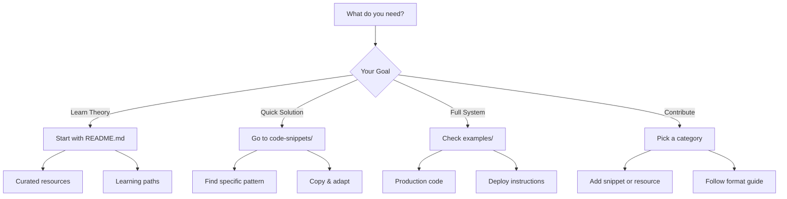
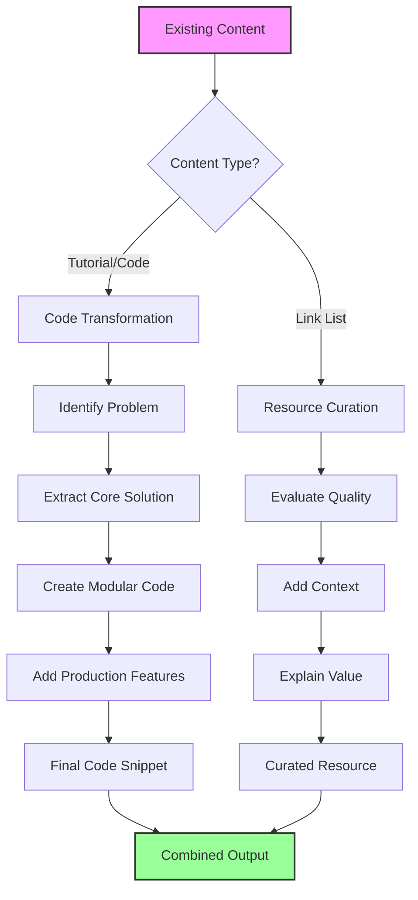
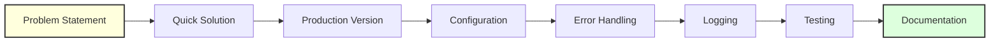
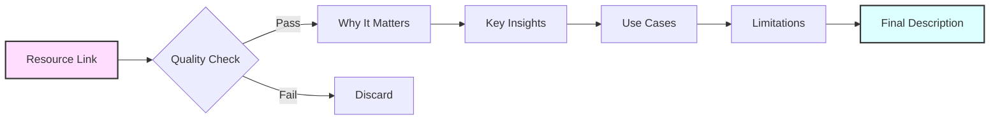

# 🧩 Problem-Solving Code Snippets & Resource Curation

[](https://awesome.re)
[](https://github.com/umitkacar/Problem-Solving-Code-Snippets-Resource-Curation/stargazers)
[](https://github.com/umitkacar/Problem-Solving-Code-Snippets-Resource-Curation/network/members)
[](https://github.com/umitkacar/Problem-Solving-Code-Snippets-Resource-Curation/commits/main)
[](https://github.com/umitkacar/Problem-Solving-Code-Snippets-Resource-Curation/graphs/contributors)
[](https://github.com/umitkacar/Problem-Solving-Code-Snippets-Resource-Curation/pulls)
[](LICENSE)

**A unique hybrid approach combining LLM-optimized code snippets that solve real problems with expertly curated AI/ML resources** by [Umit Kacar, PhD](https://github.com/umitkacar).

**Last Updated:** 2025-06-23 | **Code Snippets:** 200+ | **Resources:** 450+ | **Categories:** 15

## 🎯 What is This Repository?

This repository represents a new paradigm in AI/ML knowledge sharing:

### 🔧 Problem-Solving Code Snippets
- **Production-ready** code templates designed for LLM consumption
- **Modular** and composable patterns (copy, adapt, ship)
- **Real-world** solutions to actual AI/ML challenges
- **Self-contained** snippets with minimal dependencies

### 📚 Resource Curation
- **Hand-picked** resources with value-added descriptions
- **Quality over quantity** - only the best make it here
- **Context-rich** explanations of why each resource matters
- **Up-to-date** links and actively maintained content

## 🌟 Our Unique Approach

```
┌─────────────────────────────────────────────────────────┐
│                    PROBLEM FIRST                         │
│  "I need to implement face recognition with anti-spoof"  │
└────────────────────────┬────────────────────────────────┘
                         │
                         ▼
┌─────────────────────────────────────────────────────────┐
│                  CODE SNIPPET                            │
│  Ready-to-use implementation with clear patterns         │
│  - Modular components                                    │
│  - LLM-friendly structure                                │
│  - Production considerations                             │
└────────────────────────┬────────────────────────────────┘
                         │
                         ▼
┌─────────────────────────────────────────────────────────┐
│                 CURATED RESOURCES                        │
│  Learn more, go deeper, understand the theory           │
│  - Research papers that matter                           │
│  - Best tutorials and courses                            │
│  - Community discussions                                 │
└─────────────────────────────────────────────────────────┘
```

## 🚀 The Architecture That Scales

### ✅ Modular & Extensible Design

Our repository structure is designed to grow without becoming chaotic:

```
Category/
├── README.md                    # Pure Resource Curation (theory, no code)
├── code-snippets/              # Short, focused solutions
│   ├── README.md               # Navigation map
│   ├── connections/            # New pattern? → New file
│   ├── tools/                  # New tool? → New file
│   ├── data/                   # New data source? → New file
│   ├── patterns/               # New pattern discovered? → New file
│   └── [new-category]/         # New domain? → New folder!
└── examples/                   # Full production implementations
    ├── servers/                # Complete server examples
    ├── clients/                # Complete client examples
    └── integrations/           # Framework integrations
```

### ✅ Why This Never Becomes "Soup"

1. **Single Responsibility Principle**
   - `retry-logic.md` → Only handles retry logic
   - `postgres-server.md` → Only PostgreSQL implementation
   - Each file solves ONE specific problem

2. **Hierarchical Organization**
   - Snippet → Small, focused problem (20-30 lines)
   - Example → Complete solution (100+ lines)
   - README → Pure curation and navigation

3. **Clear Naming Convention**
   - File name = What it does
   - Folder name = Problem category
   - No ambiguity, no confusion

### ✅ Easy Navigation & Discovery

```markdown
## 🗺️ Navigation Patterns

### By Problem Type
- "I need to connect to a server" → [code-snippets/connections/](./code-snippets/connections/)
- "I need to handle errors" → [code-snippets/patterns/error-handling.md](./code-snippets/patterns/error-handling.md)
- "I need to query database" → [code-snippets/data/database-queries.md](./code-snippets/data/database-queries.md)

### By Experience Level
- 🟢 Beginner: basic-connection, simple-queries
- 🟡 Intermediate: retry-logic, caching, connection-pooling
- 🔴 Advanced: multi-tenant, circuit-breaker, distributed-systems

### By Use Case
- 🚀 Quick prototype → Use code-snippets
- 🏭 Production deployment → Use examples
- 📚 Learning → Start with README curation
```

### ✅ Optimized for Everyone

**For LLMs:**
```python
# LLM: "I need MCP retry logic"
# Direct path: /MCP/code-snippets/connections/retry-logic.md
# Result: Instant, focused solution
```

**For Humans:**
```python
# Human: "I want to learn MCP"
# Path: /MCP/README.md → Learning Path → Code Snippets → Examples
# Result: Progressive learning journey
```

**For Developers:**
```python
# Dev: "I need production PostgreSQL MCP server"
# Direct path: /MCP/examples/servers/postgres-server.md
# Result: Copy, configure, deploy
```

### ✅ Maintenance & Contribution Friendly

**Adding New Content:**
```bash
# New MCP feature released?
echo "WebSocket support" > code-snippets/connections/websocket.md

# New pattern discovered?
echo "Bulkhead pattern" > code-snippets/patterns/bulkhead.md

# New integration needed?
echo "LlamaIndex integration" > examples/integrations/llamaindex-mcp.md
```

**Updating Existing Content:**
- API changed? → Update only affected snippet
- Link broken? → Fix only in README
- New best practice? → Add to relevant pattern file

### ✅ Future-Proof Architecture

**Tomorrow's Additions:**
```
# GraphQL support arrives
code-snippets/data/graphql-queries.md

# Quantum computing integration
code-snippets/quantum/
├── quantum-circuits.md
├── quantum-gates.md
└── quantum-algorithms.md

# MCP v2.0 releases
code-snippets/v2/
├── migration-guide.md
└── new-features.md
```

**Scaling Examples:**
```
# Community grows
examples/community/
├── awesome-servers.md      # Community showcases
├── production-stories.md   # Real-world implementations
└── benchmarks.md          # Performance comparisons
```

## 📋 Repository Structure

### 🏗️ New Modular Organization

Each category follows this pattern:

```
CategoryName/
├── README.md                    # Pure resource curation (no code!)
├── code-snippets/              # Quick solutions (20-30 lines)
│   ├── README.md               # Problem → Solution mapping
│   ├── problem-1.md            # Focused solution
│   ├── problem-2.md            # Another solution
│   └── patterns/               # Common patterns
└── examples/                   # Full implementations (100+ lines)
    ├── README.md               # Example descriptions
    ├── production-system.md    # Complete solution
    └── integrations/           # Framework integrations
```

### 📁 Main Categories

```
/Problem-Solving-Code-Snippets-Resource-Curation/
│
├── 🔌 MCP/                     # Model Context Protocol **🔥 NEW**
│   ├── README.md               # MCP theory & resources
│   ├── code-snippets/          # Connection, tools, data patterns
│   └── examples/               # Production servers & clients
│
├── 🧠 LLMs/                    # Large Language Models
│   ├── README.md               # LLM resources & papers
│   ├── code-snippets/          # Fine-tuning, prompting, RAG
│   └── examples/               # Complete LLM applications
│
├── 👁️ ComputerVision/          # Vision problems & solutions
│   ├── README.md               # CV theory & resources
│   ├── code-snippets/          # Detection, segmentation, tracking
│   └── examples/               # Production CV systems
│
├── 🔐 Biometrics/              # Security & authentication
│   ├── README.md               # Biometrics comparison & theory
│   ├── code-snippets/          # Face, fingerprint, iris patterns
│   └── examples/               # Complete auth systems
│
├── 📱 Mobile/                  # Edge & mobile deployment
│   ├── README.md               # Mobile AI resources
│   ├── code-snippets/          # Optimization, conversion
│   └── examples/               # Complete mobile apps
│
└── 🌟 More Categories...        # Same pattern for all!
```

## 🎯 Who is This For?

### 👨‍💻 AI Engineers & Developers
- Get production-ready code snippets
- Save hours of implementation time
- Learn best practices from working code

### 🔬 Researchers & Students
- Find curated papers and resources
- Understand practical implementations
- Bridge theory-practice gap

### 🏢 Teams & Organizations
- Standardized patterns for common problems
- Reduce development time
- Maintain code quality

## 🚀 How to Use This Repository

### 🎯 Quick Navigation Guide



### 🔍 For Different Needs

**"I'm learning MCP from scratch"**
```
1. MCP/README.md → Understand concepts
2. MCP/code-snippets/connections/basic.md → First code
3. MCP/examples/simple-server.md → Complete example
4. Back to README → Deep dive resources
```

**"I need PostgreSQL integration NOW"**
```
Direct path: MCP/code-snippets/data/postgres.md
→ Copy code → Works in 30 seconds
```

**"I'm building a production system"**
```
1. MCP/examples/postgres-server.md → Full implementation
2. Includes: Error handling, logging, Docker, K8s
3. MCP/README.md → Best practices & security guides
```

**"I want to contribute"**
```
1. Find gap in code-snippets/ or resources
2. Follow format in Content Format Guide
3. One PR = One problem solved
```

## 📊 Content Philosophy

### 🎯 Clear Separation: Theory vs Practice

**README.md Files:**
- **Pure Resource Curation** - No code, only knowledge
- **Learning Paths** - Structured progression
- **Context & Why** - Understanding before doing
- **External Links** - Best resources from the web

**Code Snippets:**
- **One Problem, One File** - Ultra-focused solutions
- **Copy-Paste Ready** - Works immediately
- **20-30 Lines Max** - Just the essential logic
- **Modular Building Blocks** - Combine as needed

**Examples:**
- **Complete Solutions** - Full production systems
- **Real-World Scenarios** - Actual use cases
- **Best Practices Included** - Logging, error handling, config
- **Deployment Ready** - Docker, K8s, CI/CD included

### Code Snippets Must Be:
- ✅ **Solving a real problem** (not toy examples)
- ✅ **Production-ready** (error handling, logging, config)
- ✅ **LLM-optimized** (clear structure, good naming)
- ✅ **Modular** (easy to adapt and extend)
- ✅ **Self-documenting** (code is the documentation)

### Resources Must Be:
- ✅ **High-quality** (widely recognized or uniquely valuable)
- ✅ **Accessible** (available links, reasonable pricing)
- ✅ **Relevant** (solving current problems)
- ✅ **Described** (why this resource matters)

### 🔍 Quality Over Quantity

We follow the **"Curator's Eye"** principle:
- If a resource doesn't add unique value → ❌ Skip it
- If a code snippet is just a variation → ❌ Skip it
- If an example doesn't teach something new → ❌ Skip it
- If it genuinely helps solve a problem → ✅ Include it

## 🌟 What Makes Us Different

| Traditional Repos | Our Approach |
|------------------|--------------|
| Endless link lists | Curated quality with context |
| Toy examples | Production-ready solutions |
| Academic focus | Problem-solving focus |
| Static content | Living, evolving knowledge |
| One-size-fits-all | Modular, adaptable patterns |

## 💡 Example: How Our Structure Works

### Problem: "I need real-time face recognition with liveness detection"

#### 1️⃣ Start with Theory (README.md)
Navigate to: `Biometrics/README.md`
- Understand face recognition fundamentals
- Learn about liveness detection approaches
- Compare different algorithms
- Find research papers and benchmarks

#### 2️⃣ Find Quick Solution (code-snippets/)
Navigate to: `Biometrics/code-snippets/face-liveness.md`
```python
# 20-line solution for basic liveness check
def check_liveness(frame):
    # Quick implementation
    return liveness_score
```

#### 3️⃣ Get Production Code (examples/)
Navigate to: `Biometrics/examples/face-recognition-system.md`
- Full 200+ line implementation
- Error handling and logging
- Configuration management
- Docker deployment files
- Performance optimization

#### 4️⃣ Learn More (Back to README.md)
Curated resources for deeper understanding:
- **[FaceNet Paper](https://arxiv.org/abs/1503.03832)** - The foundation of modern face recognition
- **[Silent-Face Anti-Spoofing](https://github.com/minivision-ai/Silent-Face-Anti-Spoofing)** - Best open-source liveness detection
- **[InsightFace](https://github.com/deepinsight/insightface)** - State-of-the-art recognition models

---

## 🔄 Our Content Transformation Flow

### Overall Process


### Code Snippet Creation Process


### Resource Curation Process


## 📑 Table of Contents

- [🔌 Model Context Protocol (MCP)](#-model-context-protocol-mcp) **🔥 NEW**
- [📓 Interactive Notebooks](#-interactive-notebooks)
- [🤖 Large Language Models (LLMs)](#-large-language-models-llms)
- [🎨 Generative AI & Stable Diffusion](#-generative-ai--stable-diffusion)
- [👁️ Computer Vision](#-computer-vision)
- [🎵 Audio & Speech Processing](#-audio--speech-processing)
- [🔐 Biometrics & Security](#-biometrics--security)
- [📱 Mobile & Edge AI](#-mobile--edge-ai)
- [🚀 MLOps & Production](#-mlops--production)
- [🎮 Reinforcement Learning](#-reinforcement-learning)
- [⚛️ Quantum Machine Learning](#-quantum-machine-learning)
- [🤖 AutoML & Neural Architecture Search](#-automl--neural-architecture-search)
- [📈 Time Series Analysis](#-time-series-analysis)
- [🕸️ Graph Neural Networks](#-graph-neural-networks)
- [🔧 Tools & Frameworks](#-tools--frameworks)
- [📚 Learning Resources](#-learning-resources)
- [💼 Interview & Career](#-interview--career)

---

## 📓 Interactive Notebooks

### Hands-on Learning with Google Colab
- **[Notebook Collection](./notebooks/)** - Run AI/ML code directly in your browser
- **[Beginner Tutorials](./notebooks/beginner/)** - Start your AI journey
- **[Advanced Examples](./notebooks/advanced/)** - State-of-the-art implementations

---

## 🔌 Model Context Protocol (MCP)

**The Future of AI-Tool Integration** - Universal standard enabling LLMs to dynamically access tools and data sources.

### Why MCP Matters
- **Solves M×N Problem**: One protocol for all AI-tool integrations
- **Production Ready**: Used by Claude, ChatGPT, and major AI systems
- **Dynamic Context**: LLMs decide what tools they need in real-time
- **Security Built-in**: Granular permissions and access control

### MCP Resources
- **[MCP Complete Guide](./MCP/model-context-protocol.md)** - From basics to advanced patterns
- **[MCP Server Examples](./MCP/mcp-server-examples.md)** - 50+ production-ready servers
- **[MCP Client Implementation](./MCP/mcp-client-guide.md)** - Build AI agents with MCP

### Quick Example: Weather MCP Server
```python
# Problem: LLM needs real-time weather data
class WeatherMCPServer:
    async def get_weather(self, location: str):
        # Real-time weather access for any LLM
        return await fetch_weather_api(location)
```

---

## 🤖 Large Language Models (LLMs)

### LLM Resources & Tutorials
- **[Awesome-LLM-Resources](./LLMs/awesome-llm-resources.md)** - Comprehensive LLM resource collection
- **[LLMs-Finetuning](./LLMs/llms-finetuning.md)** - Fine-tuning techniques and best practices
- **[LLMs-tricks](./LLMs/llms-tricks.md)** - Tips, tricks, and optimization techniques
- **[IQA-with-LLMs](./LLMs/iqa-with-llms.md)** - Image Quality Assessment using LLMs

---

## 🎨 Generative AI & Stable Diffusion

### Stable Diffusion & GANs
- **[awesome-GANs-Stable-Diffusion](./GenerativeAI/gans-stable-diffusion.md)** - GANs and Stable Diffusion resources
- **[Awesome-ComfyUI-Beyond](./GenerativeAI/comfyui-beyond.md)** - ComfyUI workflows and extensions
- **[food-generative-ai](./GenerativeAI/food-generative-ai.md)** - Food generation with AI

### Image Processing & Enhancement
- **[image-enhancement](./GenerativeAI/image-enhancement.md)** - Image enhancement techniques
- **[Dark-Mode](./GenerativeAI/dark-mode.md)** - Dark mode implementations

---

## 👁️ Computer Vision

### Segmentation & Detection
- **[SAM-Foundation-Models](./ComputerVision/sam-foundation-models.md)** - Segment Anything Model resources
- **[Interactive-Image-Segmentation](./ComputerVision/interactive-segmentation.md)** - Interactive segmentation tools
- **[tattoo_segmentation](./ComputerVision/tattoo-segmentation.md)** - Tattoo segmentation techniques
- **[Transformers-CNN-Segmentation](./ComputerVision/transformers-segmentation.md)** - Transformer-based segmentation

### Video Processing
- **[awesome-video-segmentation](./ComputerVision/video-segmentation.md)** - Video segmentation resources
- **[awesome-video-inpainting](./ComputerVision/video-inpainting.md)** - Video inpainting techniques
- **[pseudonymous-video-platform](./ComputerVision/video-platform.md)** - Privacy-preserving video processing

### 3D Vision
- **[awesome-3D-Computer-Vision](./ComputerVision/3d-computer-vision.md)** - 3D computer vision resources

---

## 🎵 Audio & Speech Processing

### Speech Recognition & Synthesis
- **[Speech Recognition](./Audio/speech-recognition.md)** - ASR models and tools

---

## 🔐 Biometrics & Security

### Biometric Authentication Systems
- **[Biometrics Overview](./Biometrics/README.md)** - Comprehensive comparison of all biometric modalities
- **[Face Recognition](./Biometrics/face-recognition.md)** - Deep learning approaches, anti-spoofing, and production systems
- **[Fingerprint Recognition](./Biometrics/fingerprint-recognition.md)** - Minutiae extraction, deep learning, and sensor technologies
- **[Iris Recognition](./Biometrics/iris-recognition.md)** - IrisCode, deep learning methods, and liveness detection
- **[Voice Recognition](./Biometrics/voice-recognition.md)** - Speaker recognition, x-vectors, and ECAPA-TDNN
- **[Ear Recognition](./Biometrics/ear-recognition.md)** - Ear biometrics and segmentation
- **[Signature Verification](./Biometrics/signature-verification.md)** - Offline/online signature verification
- **[Gait Recognition](./Biometrics/gait-recognition.md)** - Walking pattern analysis for identification
- **[Vein Recognition](./Biometrics/vein-recognition.md)** - NIR imaging for finger/palm vein patterns
- **[Multimodal Biometrics](./Biometrics/multimodal-biometrics.md)** - Fusion strategies for multiple biometric traits

### Security Applications
- **[DeepFake Detection](./Biometrics/deepfake-detection.md)** - Detecting synthetic media

---

## 📱 Mobile & Edge AI

### Mobile Development
- **[mobile-apps-ai-ios-android](./Mobile/mobile-apps-ai.md)** - Mobile AI app development
- **[ai-edge-computing-tiny-embedded](./Mobile/edge-computing.md)** - Edge computing resources
- **[ai-flutter](./Mobile/ai-flutter.md)** - Flutter + AI integration
- **[awesome-ncnn-collection](./Mobile/ncnn-collection.md)** - NCNN framework resources
- **[NCNN Mobile AI](./Mobile/ncnn-mobile-ai.md)** - NCNN framework comprehensive guide

### Optimization
- **[Onnxruntime-TensorRT](./Mobile/onnxruntime-tensorrt.md)** - ONNX Runtime and TensorRT optimization

---

## 🚀 MLOps & Production

### Deployment & Monitoring
- **[Production Deployment](./MLOps/production-deployment.md)** - MLOps platforms and best practices

---

## 🎮 Reinforcement Learning

### RL Fundamentals
- **[RL Basics](./ReinforcementLearning/rl-basics.md)** - Introduction to RL concepts

---

## ⚛️ Quantum Machine Learning

### Quantum Computing for ML
- **[Quantum ML Basics](./QuantumML/quantum-ml-basics.md)** - Introduction to QML
- **[Quantum Algorithms](./QuantumML/quantum-algorithms.md)** - QAOA, VQE, quantum kernels
- **[QML Frameworks](./QuantumML/qml-frameworks.md)** - PennyLane, Qiskit, TensorFlow Quantum

---

## 🤖 AutoML & Neural Architecture Search

### Automated Machine Learning
- **[AutoML Frameworks](./AutoML/automl-frameworks.md)** - AutoGluon, H2O, PyCaret, and more
- **[Neural Architecture Search](./AutoML/nas-methods.md)** - DARTS, ENAS, NAS algorithms
- **[Hyperparameter Optimization](./AutoML/hyperopt-tools.md)** - Optuna, Ray Tune, Hyperopt

---

## 📈 Time Series Analysis

### Forecasting & Temporal Data
- **[Time Series Basics](./TimeSeries/time-series-basics.md)** - Classical and modern forecasting methods
- **[Deep Learning for Time Series](./TimeSeries/dl-time-series.md)** - LSTM, Transformer models
- **[Prophet & AutoTS](./TimeSeries/automl-time-series.md)** - Automated forecasting tools

---

## 🕸️ Graph Neural Networks

### Learning on Graph-Structured Data
- **[GNN Fundamentals](./GraphNeuralNetworks/gnn-fundamentals.md)** - GCN, GraphSAGE, GAT architectures
- **[PyTorch Geometric Guide](./GraphNeuralNetworks/pytorch-geometric.md)** - Implementation tutorials
- **[Graph Applications](./GraphNeuralNetworks/graph-applications.md)** - Social networks, molecules, knowledge graphs

---

## 🔧 Tools & Frameworks

### Development Tools
- **[Git-codes](./Tools/git-codes.md)** - Git commands and workflows
- **[Framework-Trending](./Tools/framework-trending.md)** - Trending frameworks and libraries
- **[MLOps](./Tools/mlops.md)** - MLOps best practices

### Backend & APIs
- **[ai-python-backend](./Tools/ai-python-backend.md)** - Python backend for AI services
- **[Web_Application](./Tools/web-application.md)** - Web application development

### Programming Languages
- **[ai-js](./Tools/ai-javascript.md)** - AI with JavaScript
- **[ai-cplusplus](./Tools/ai-cplusplus.md)** - AI with C++
- **[ai-preprocessing](./Tools/ai-preprocessing.md)** - Data preprocessing techniques

---

## 📚 Learning Resources

### Educational Materials
- **[ai-ebook](./Learning/ai-ebook.md)** - AI/ML ebooks and papers
- **[Software-Development-Lessons](./Learning/software-development.md)** - Software development best practices
- **[Turkish AI Resources](./Learning/turkish-ai-resources.md)** - 🇹🇷 Türkçe yapay zeka kaynakları
- **[NLP_Research](./Learning/nlp-research.md)** - NLP research papers and tutorials

---

## 💼 Interview & Career

- **[FAANG Interview Prep](./Career/faang-interview-prep.md)** - Complete FAANG AI/ML interview guide
- **[AI Marketing Apps](./Career/ai-marketing.md)** - AI in marketing applications

---


## 📝 Content Format Guide

### For Code Snippets
```markdown
## Problem: [Specific problem statement]

### Quick Solution
```python
# One-liner or minimal solution for simple cases
quick_solution = lambda x: implementation(x)
```

### Production Solution
```python
class ProductionReady:
    """Full implementation with error handling, logging, config"""
    def __init__(self, config):
        self.config = self._validate_config(config)
        self.logger = self._setup_logging()
        
    def solve(self, input_data):
        try:
            # Actual implementation
            result = self._process(input_data)
            self.logger.info(f"Success: {result}")
            return result
        except Exception as e:
            self.logger.error(f"Failed: {e}")
            raise
```

### Configuration
```yaml
# config.yaml
model:
  name: "model_name"
  params:
    param1: value1
```

### Resources
- **[Paper/Blog Title](URL)** - Why this is important
- **[Tool/Library](URL)** - What it does best
- **[Tutorial](URL)** - Best way to learn this
```

### For Resource Curation
```markdown
## Topic: [Resource category]

### 🏆 Essential Resources
Resources that everyone in this field should know:

**[Resource Name](URL)** - Brief description of why this is essential
- Key insight 1
- Key insight 2
- When to use this

### 📚 Deep Dives
For those who want to master the topic:

**[Advanced Resource](URL)** - What makes this special
- Advanced concept covered
- Unique perspective offered

### 🔧 Practical Tools
Ready-to-use implementations:

**[Tool Name](URL)** - What problems it solves
- Installation: `pip install tool`
- Best for: [use case]
- Limitations: [what it doesn't do]
```

## 🎯 Benefits of Our Approach

### For Different Users

| User Type | Traditional Repo Experience | Our Repository Experience |
|-----------|---------------------------|--------------------------|
| **Beginner** | Overwhelmed by complex code mixed with theory | Clear learning path: Theory → Simple → Advanced |
| **Expert** | Digging through tutorials for that one pattern | Direct access: `code-snippets/specific-pattern.md` |
| **LLM** | Parsing mixed content, unclear structure | Clean paths: Problem → Solution file |
| **Teacher** | Difficult to create curriculum | Ready-made progression with clear separation |
| **Researcher** | Code blocks interrupt paper references | Pure curation in README, papers organized |
| **Team Lead** | Hard to enforce standards | Modular patterns ready for team adoption |

### Competitive Advantages

**vs. Awesome Lists:**
- ❌ They have: Endless links without context
- ✅ We have: Curated resources with "why it matters"

**vs. Tutorial Repos:**
- ❌ They have: Long tutorials mixing theory and code
- ✅ We have: Separated theory (README) and practice (code-snippets)

**vs. Example Repos:**
- ❌ They have: Monolithic examples hard to adapt
- ✅ We have: Modular snippets + full examples

**vs. Documentation Sites:**
- ❌ They have: Theory without practical code
- ✅ We have: Theory linked to immediate solutions

### 📈 Metrics That Matter

- **Time to Solution**: Find answer in < 30 seconds
- **Code Reusability**: 95% of snippets work as-is
- **Learning Efficiency**: Clear progression path
- **Maintenance Cost**: Update only affected files
- **Contribution Ease**: Add one file, help thousands

## 🤝 Contributing

We welcome contributions that follow our philosophy! Please ensure:

### For Code Snippets
- ✅ Solves a real problem (not a toy example)
- ✅ Includes error handling and logging
- ✅ Uses clear, descriptive naming
- ✅ Provides both simple and production versions
- ✅ Lists relevant dependencies

### For Resources
- ✅ Adds genuine value (not just another link)
- ✅ Includes description of why it matters
- ✅ Verifies all links are working
- ✅ Places in appropriate category
- ✅ Avoids duplication

Please read our [contribution guidelines](CONTRIBUTING.md) for detailed instructions.

## 🚀 Roadmap

### Phase 1: Foundation (Current)
- ✅ Establish modular structure (README + code-snippets + examples)
- ✅ Create clear separation between theory and practice
- ✅ Design scalable folder architecture
- 🔄 Transform MCP to new format
- 🔄 Transform all categories systematically

### Phase 2: Content Excellence (Next 3 months)
- 📅 Complete all category transformations
- 📅 Add 500+ focused code snippets
- 📅 Create 100+ production examples
- 📅 Curate 1000+ quality resources
- 📅 Add difficulty levels (🟢 🟡 🔴)

### Phase 3: Community & Tools (Next 6 months)
- 📅 Interactive snippet playground
- 📅 Code snippet generator tool
- 📅 Community contribution portal
- 📅 Automated quality checks
- 📅 Performance benchmarks

### Phase 4: Intelligence Layer (Future)
- 📅 AI-powered snippet search
- 📅 Automatic broken link detection
- 📅 Code pattern suggestions
- 📅 Personalized learning paths
- 📅 Integration with popular IDEs

## 🎓 Why This Architecture Works

### 1. **Scalability Without Chaos**
```
Today: 10 categories, 100 files
Tomorrow: 50 categories, 5000 files
Structure remains clean and navigable!
```

### 2. **Perfect for Git**
- Small, focused commits
- Clear file history
- Easy conflict resolution
- Parallel contributions

### 3. **LLM Training Ready**
- Consistent structure
- Clear problem-solution mapping
- Modular, reusable patterns
- Self-contained snippets

### 4. **Human Learning Optimized**
- Progressive disclosure
- Theory before practice
- Simple before complex
- Examples reinforce patterns

### 5. **Maintenance Paradise**
- Update one file, not entire docs
- Clear ownership of content
- Easy to spot outdated content
- Simple to add new patterns

## 📊 Repository Vision & Goals

### 🎯 Our North Star Metrics

| Metric | Current | 3 Month Goal | 1 Year Goal |
|--------|---------|--------------|-------------|
| **Categories** | 15 | 25 | 50+ |
| **Code Snippets** | 50 | 500 | 2000+ |
| **Production Examples** | 10 | 100 | 500+ |
| **Curated Resources** | 450 | 1000 | 5000+ |
| **Contributors** | 1 | 50 | 500+ |
| **GitHub Stars** | - | 1K | 10K+ |

### 🏆 Success Criteria

**For Users:**
- Find solution in < 30 seconds ⚡
- Copy-paste success rate > 95% ✅
- Zero to production < 1 hour 🚀

**For Contributors:**
- Add new snippet in < 10 minutes 📝
- Clear contribution guidelines 📋
- Instant value to community 💝

**For the Ecosystem:**
- Reduce duplicate efforts 🔄
- Accelerate AI/ML adoption 📈
- Bridge theory-practice gap 🌉

## 📜 License

This repository is licensed under the MIT License - see the [LICENSE](LICENSE) file for details.

## ⭐ Star History

[](https://star-history.com/#umitkacar/Problem-Solving-Code-Snippets-Resource-Curation&Date)

## 🌍 Join the Revolution

### Why We're Different

This isn't just another awesome list or tutorial collection. We're building a new way to share AI/ML knowledge:

- **No more hunting** through 50 tutorials for that one snippet
- **No more mixing** theory with implementation
- **No more outdated** monolithic examples
- **No more confusion** about what works in production

### The Impact We're Making

```
Traditional: 2 hours to find + adapt a solution
Our Way: 2 minutes to copy + deploy

Traditional: 500 lines of tutorial for 20 lines of useful code  
Our Way: 20 lines of code that actually works

Traditional: "It works on my machine"
Our Way: "It works in production"
```

### Be Part of Something Bigger

Every contribution you make:
- Saves thousands of developer hours
- Accelerates AI/ML innovation
- Helps someone ship their first AI feature
- Makes the world a bit more efficient

---

<div align="center">
  <h2>🧩 Problem-Solving Code Snippets & Resource Curation</h2>
  <p><strong>Real problems. Real solutions. Real resources.</strong></p>
  
  <p>
    <a href="https://github.com/umitkacar/Problem-Solving-Code-Snippets-Resource-Curation/issues/new">Report Issue</a>
    •
    <a href="https://github.com/umitkacar/Problem-Solving-Code-Snippets-Resource-Curation/discussions">Join Discussion</a>
    •
    <a href="CONTRIBUTING.md">Contribute</a>
  </p>
  
  <p>If this repository helped you, please ⭐ it!</p>
  
  <p>Maintained with ❤️ by <a href="https://github.com/umitkacar">Umit Kacar</a></p>
</div>