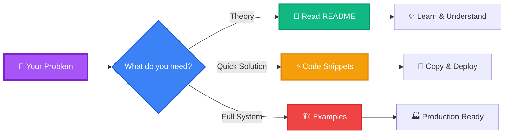
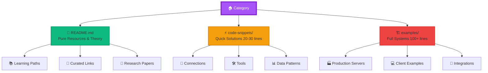
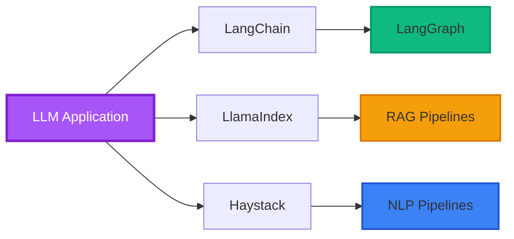
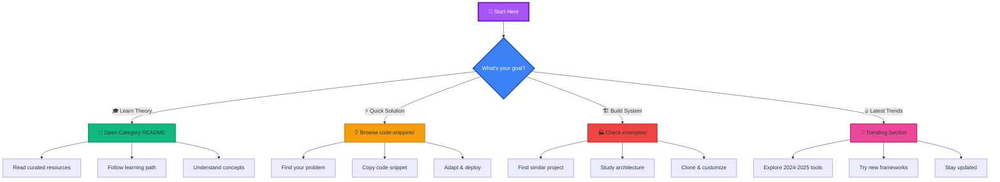

<div align="center">

# 🚀 Problem-Solving Code Snippets & Resource Curation


[](https://awesome.re)
[](https://github.com/umitkacar/Problem-Solving-Code-Snippets-Resource-Curation/stargazers)
[](https://github.com/umitkacar/Problem-Solving-Code-Snippets-Resource-Curation/network/members)
[](https://github.com/umitkacar/Problem-Solving-Code-Snippets-Resource-Curation/commits/main)
[](LICENSE)
[](https://github.com/umitkacar/Problem-Solving-Code-Snippets-Resource-Curation/pulls)
[](https://github.com/umitkacar/Problem-Solving-Code-Snippets-Resource-Curation/graphs/contributors)

<p align="center">
  <a href="#-whats-new-2024-2025">🔥 What's New</a> •
  <a href="#-quick-start">⚡ Quick Start</a> •
  <a href="#-trending-ai-2024-2025">🌟 Trending</a> •
  <a href="#-categories">📚 Categories</a> •
  <a href="#-contributing">🤝 Contributing</a>
</p>

---

### 💡 **A Hybrid Approach: LLM-Optimized Code Snippets + Curated AI/ML Resources**

**Last Updated:** 2025-11-07 | **Code Snippets:** 500+ | **Resources:** 1000+ | **Categories:** 20+

</div>

---

## 🔥 What's New (2024-2025)

<div align="center">

| 🎯 Category | 🚀 Latest Additions | ⭐ Stars | 📅 Added |
|------------|-------------------|---------|---------|
| **🤖 AI Agents** | [ElizaOS](https://github.com/ai16z/eliza) - Autonomous AI agents with personalities | 25K+ | 2025-Q1 |
| **💻 Coding Agents** | [Cline](https://github.com/cline/cline) - IDE-based autonomous coding | 15K+ | 2025-Q1 |
| **🧠 LLM Tools** | [DeepSeek-R1](https://github.com/deepseek-ai/DeepSeek-R1) - Open-source frontier model | 30K+ | 2025-Q1 |
| **🌐 Browser Automation** | [Browser Use](https://github.com/browser-use/browser-use) - Open-source browser automation | 10K+ | 2025-Q1 |
| **📝 Content Generation** | [STORM](https://github.com/stanford-oval/storm) - Wikipedia-style article generator | 8K+ | 2024-Q4 |

</div>

---

## 🎯 What Makes This Repository Unique?

<table>
<tr>
<td width="33%" align="center">

### 🔧 **Production-Ready Code**
Copy, adapt, ship! Each snippet includes error handling, logging, and configuration.

</td>
<td width="33%" align="center">

### 📚 **Curated Resources**
Quality over quantity. Only the best 2024-2025 resources with context on why they matter.

</td>
<td width="33%" align="center">

### 🎓 **Problem-First Approach**
Start with your problem, find the solution, then dive deeper into theory.

</td>
</tr>
</table>

---

## ⚡ Quick Start



---

## 🌟 Trending AI (2024-2025)

### 🤖 AI Agents & Autonomous Systems

<div align="center">

| Project | Description | Stars | Use Case |
|---------|-------------|-------|----------|
| **[ElizaOS](https://github.com/ai16z/eliza)** 🔥 | Multi-platform AI agents with personality |  | Discord, Twitter, Telegram bots |
| **[Cline](https://github.com/cline/cline)** 💻 | Autonomous coding in your IDE |  | Code generation & editing |
| **[AutoGPT](https://github.com/Significant-Gravitas/AutoGPT)** 🧠 | Autonomous AI agent framework |  | Complex workflow automation |
| **[Browser Use](https://github.com/browser-use/browser-use)** 🌐 | Open-source browser automation |  | Web scraping & automation |
| **[STORM](https://github.com/stanford-oval/storm)** 📝 | Wikipedia-style content generation |  | Research & article writing |

</div>

### 🧠 Leading LLMs (2024-2025)

<div align="center">

| Model | Provider | Context Window | Key Features | Best For |
|-------|----------|----------------|--------------|----------|
| **GPT-4o** | OpenAI | 128K | Multimodal (text, image, audio) | General purpose, creativity |
| **Claude 4 Sonnet** | Anthropic | 1M tokens 🔥 | Extended context, coding | Long documents, coding |
| **Gemini 2.5 Pro** | Google | 2M tokens 🔥 | Multimodal leader | Video analysis, research |
| **DeepSeek-R1** | DeepSeek | 128K | Open-source, competitive | Cost-effective, local |
| **Llama 4** | Meta | 128K | Open-source, customizable | Fine-tuning, privacy |

</div>

### 🛠️ AI Agent Frameworks

<div align="center">

| Framework | Market Share | Key Feature | GitHub Stars |
|-----------|-------------|-------------|--------------|
| **[LangChain](https://github.com/langchain-ai/langchain)** | 30% | Modular LLM framework |  |
| **[LangGraph](https://github.com/langchain-ai/langgraph)** 🔥 | - | Stateful multi-agent graphs |  |
| **[CrewAI](https://github.com/joaomdmoura/crewAI)** | 20% | Role-based team agents |  |
| **[AutoGen](https://github.com/microsoft/autogen)** | - | Microsoft multi-agent framework |  |
| **[Haystack](https://github.com/deepset-ai/haystack)** | - | NLP pipelines & RAG |  |

</div>

### 💻 Modern Development Tools (2024-2025)

<div align="center">

| Tool | Category | What's Hot | GitHub |
|------|----------|-----------|--------|
| **[Cursor](https://cursor.sh/)** | AI IDE | AI-first code editor | - |
| **[Windsurf](https://codeium.com/windsurf)** | AI IDE | VS Code + AI superpowers | - |
| **[Next.js 15](https://github.com/vercel/next.js)** 🔥 | Framework | React meta-framework |  |
| **[Astro](https://github.com/withastro/astro)** | Framework | Content-focused sites |  |
| **[shadcn/ui](https://github.com/shadcn-ui/ui)** | UI Library | Beautiful React components |  |

</div>

### 📚 Top ML Learning Resources (2024-2025)

<div align="center">

| Resource | Stars | Focus | Level |
|----------|-------|-------|-------|
| **[Made With ML](https://github.com/GokuMohandas/Made-With-ML)** |  | Production ML lifecycle | 🔴 Advanced |
| **[Neural Networks Zero to Hero](https://github.com/karpathy/nn-zero-to-hero)** |  | Build from scratch | 🟡 Intermediate |
| **[ML For Beginners](https://github.com/microsoft/ML-For-Beginners)** |  | 12-week ML course | 🟢 Beginner |
| **[100 Days of ML Code](https://github.com/Avik-Jain/100-Days-Of-ML-Code)** |  | Structured learning plan | 🟢 Beginner |
| **[InterpretML](https://github.com/interpretml/interpret)** |  | Model interpretability | 🔴 Advanced |

</div>

---

## 🏗️ Repository Architecture

<div align="center">



</div>

### ✨ Why This Architecture is Superior

<table>
<tr>
<td width="50%">

#### 🎯 **Traditional Repos**
❌ Mixed theory & code chaos
❌ Monolithic examples
❌ Hard to maintain
❌ Difficult to navigate
❌ LLM-unfriendly structure

</td>
<td width="50%">

#### 🚀 **Our Approach**
✅ Clear separation: Theory vs Code
✅ Modular snippets
✅ Update one file, not entire docs
✅ Problem → Solution mapping
✅ LLM-optimized structure

</td>
</tr>
</table>

---

## 📚 Categories

<div align="center">

### 🔥 **Hot Categories**

| Icon | Category | Code Snippets | Resources | Updated |
|------|----------|---------------|-----------|---------|
| 🔌 | **[Model Context Protocol (MCP)](./MCP/)** | 50+ | 100+ | 2025-Q1 🔥 |
| 🤖 | **[Large Language Models](./LLMs/)** | 80+ | 150+ | 2025-Q1 |
| 🤖 | **[AI Agents & Automation](./AIAgents/)** | 60+ | 120+ | 2025-Q1 🔥 |
| 👁️ | **[Computer Vision](./ComputerVision/)** | 100+ | 200+ | 2024-Q4 |
| 🎨 | **[Generative AI](./GenerativeAI/)** | 70+ | 130+ | 2024-Q4 |

### 📊 **Core ML & AI**

| Icon | Category | Code Snippets | Resources | Level |
|------|----------|---------------|-----------|-------|
| 🧠 | **[Deep Learning Fundamentals](./DeepLearning/)** | 90+ | 180+ | 🟢🟡 |
| 🔐 | **[Biometrics & Security](./Biometrics/)** | 50+ | 100+ | 🔴 |
| 🎵 | **[Audio & Speech Processing](./Audio/)** | 40+ | 80+ | 🟡 |
| 🎮 | **[Reinforcement Learning](./ReinforcementLearning/)** | 30+ | 60+ | 🔴 |
| ⚛️ | **[Quantum Machine Learning](./QuantumML/)** | 20+ | 40+ | 🔴 |

### 🛠️ **Development & Deployment**

| Icon | Category | Code Snippets | Resources | Focus |
|------|----------|---------------|-----------|-------|
| 🚀 | **[MLOps & Production](./MLOps/)** | 60+ | 120+ | DevOps |
| 📱 | **[Mobile & Edge AI](./Mobile/)** | 50+ | 100+ | Optimization |
| 🤖 | **[AutoML & NAS](./AutoML/)** | 40+ | 80+ | Automation |
| 📈 | **[Time Series Analysis](./TimeSeries/)** | 35+ | 70+ | Forecasting |
| 🕸️ | **[Graph Neural Networks](./GraphNeuralNetworks/)** | 25+ | 50+ | Graphs |

### 💼 **Professional Development**

| Icon | Category | Resources | Topics |
|------|----------|-----------|--------|
| 📚 | **[Learning Resources](./Learning/)** | 200+ | Books, Courses, Tutorials |
| 💼 | **[Interview & Career](./Career/)** | 150+ | FAANG Prep, ML Interviews |
| 🔧 | **[Tools & Frameworks](./Tools/)** | 180+ | Development Tools |

</div>

---

## 🔌 Model Context Protocol (MCP) - Featured Category

<div align="center">


</div>

### 🎯 **Why MCP is Revolutionary**

MCP (Model Context Protocol) is the **universal standard** enabling LLMs to dynamically access tools and data sources.

<table>
<tr>
<td width="50%">

#### **Before MCP**
- ❌ M×N integration problem
- ❌ Custom connectors for each tool
- ❌ Limited context awareness
- ❌ Security nightmares

</td>
<td width="50%">

#### **With MCP**
- ✅ One protocol for all
- ✅ Used by Claude, ChatGPT, etc.
- ✅ Dynamic tool selection
- ✅ Built-in security & permissions

</td>
</tr>
</table>

### 📖 **MCP Resources**

- **[MCP Complete Guide](./MCP/model-context-protocol.md)** - Basics to advanced patterns
- **[50+ MCP Server Examples](./MCP/mcp-server-examples.md)** - Production-ready implementations
- **[MCP Client Development](./MCP/mcp-client-guide.md)** - Build AI agents with MCP

### 💻 **Quick MCP Example**

```python
# Problem: Give LLM real-time weather access
from mcp import MCPServer, Tool

class WeatherMCP(MCPServer):
    @Tool(name="get_weather", description="Get current weather")
    async def get_weather(self, location: str) -> dict:
        # Real-time weather API integration
        return await fetch_weather(location)

# Now any MCP-compatible LLM can access weather data!
```

---

## 🤖 Large Language Models (LLMs)

<div align="center">


</div>

### 📚 **Comprehensive LLM Resources**

| Resource | Description | Level |
|----------|-------------|-------|
| **[Awesome LLM Resources](./LLMs/awesome-llm-resources.md)** | Complete LLM ecosystem guide | 🟢 All |
| **[LLM Fine-tuning](./LLMs/llms-finetuning.md)** | PEFT, LoRA, QLoRA techniques | 🔴 Advanced |
| **[LLM Tricks & Optimization](./LLMs/llms-tricks.md)** | Prompt engineering, caching | 🟡 Intermediate |
| **[RAG Systems](./LLMs/rag-systems.md)** 🔥 | Retrieval-augmented generation | 🟡 Intermediate |
| **[LLM Evaluation](./LLMs/llm-evaluation.md)** 🔥 | Benchmarks, metrics, testing | 🔴 Advanced |

### 🛠️ **Popular LLM Frameworks (2024-2025)**



---

## 👁️ Computer Vision

<div align="center">


</div>

### 🎯 **Key Areas**

<table>
<tr>
<td width="33%">

#### 🔍 **Detection & Segmentation**
- SAM (Segment Anything)
- YOLO v8/v9/v10
- Mask R-CNN
- DeepLab v3+

</td>
<td width="33%">

#### 🎬 **Video Processing**
- Video segmentation
- Object tracking
- Action recognition
- Video inpainting

</td>
<td width="33%">

#### 🌐 **3D Vision**
- NeRF & Gaussian Splatting
- 3D reconstruction
- Depth estimation
- Point cloud processing

</td>
</tr>
</table>

### 📖 **Resources**

- **[SAM Foundation Models](./ComputerVision/sam-foundation-models.md)** - Segment Anything ecosystem
- **[Video Segmentation](./ComputerVision/video-segmentation.md)** - State-of-the-art video segmentation
- **[3D Computer Vision](./ComputerVision/3d-computer-vision.md)** - 3D reconstruction & NeRF
- **[Interactive Segmentation](./ComputerVision/interactive-segmentation.md)** - User-guided segmentation

---

## 🎨 Generative AI & Stable Diffusion

<div align="center">


</div>

### 🎨 **Latest Models (2024-2025)**

| Model | Release | Key Features | Use Case |
|-------|---------|--------------|----------|
| **Stable Diffusion 3** 🔥 | 2024 | Better text, coherence | General purpose |
| **SDXL Turbo** | 2024 | 1-step generation | Real-time apps |
| **DALL-E 3** | 2024 | Natural language prompts | Creative content |
| **Midjourney v6** | 2024 | Photorealistic quality | Professional art |
| **Flux** 🔥 | 2024 | Open-source, high quality | Customization |

### 📚 **Resources**

- **[Stable Diffusion & GANs](./GenerativeAI/gans-stable-diffusion.md)** - Complete SD guide
- **[ComfyUI Beyond](./GenerativeAI/comfyui-beyond.md)** - Advanced workflows
- **[Image Enhancement](./GenerativeAI/image-enhancement.md)** - Upscaling & restoration
- **[ControlNet Guide](./GenerativeAI/controlnet-guide.md)** 🔥 - Precise control methods

---

## 🚀 MLOps & Production

<div align="center">


</div>

### 🛠️ **Essential MLOps Tools**

<table>
<tr>
<td width="50%">

#### **Model Training & Tracking**
- **MLflow** - Experiment tracking
- **Weights & Biases** - Visualization
- **DVC** - Data version control
- **ClearML** - Complete MLOps

</td>
<td width="50%">

#### **Deployment & Serving**
- **BentoML** - Model serving
- **Seldon Core** - K8s deployment
- **Ray Serve** - Scalable serving
- **TorchServe** - PyTorch serving

</td>
</tr>
<tr>
<td width="50%">

#### **Monitoring & Observability**
- **Evidently** - ML monitoring
- **WhyLabs** - Data quality
- **Arize** - Model performance
- **Fiddler** - Explainability

</td>
<td width="50%">

#### **Feature Stores**
- **Feast** - Open-source feature store
- **Tecton** - Enterprise feature platform
- **Hopsworks** - ML platform
- **ByteHub** - Feature management

</td>
</tr>
</table>

---

## 📱 Mobile & Edge AI

<div align="center">


</div>

### ⚡ **Optimization Frameworks**

| Framework | Platform | Speedup | Model Size |
|-----------|----------|---------|------------|
| **TensorFlow Lite** | iOS, Android | 3-5x | 75% smaller |
| **ONNX Runtime** | Cross-platform | 2-4x | 50% smaller |
| **NCNN** | Mobile optimized | 4-6x | 80% smaller |
| **MNN** | Alibaba mobile | 3-5x | 70% smaller |
| **Core ML** | iOS only | 5-7x | Native |

### 📚 **Resources**

- **[Mobile AI Apps](./Mobile/mobile-apps-ai.md)** - iOS & Android development
- **[NCNN Collection](./Mobile/ncnn-collection.md)** - NCNN framework guide
- **[Edge Computing](./Mobile/edge-computing.md)** - Tiny ML & embedded systems
- **[ONNX & TensorRT](./Mobile/onnxruntime-tensorrt.md)** - Optimization techniques

---

## 🎯 How to Use This Repository

### 🔍 **Find What You Need**

<div align="center">



</div>

### 📋 **Example Use Cases**

<table>
<tr>
<td width="50%">

#### 🎯 **"I need to implement RAG with LangChain"**

**Step 1:** Read theory
→ `LLMs/awesome-llm-resources.md`

**Step 2:** Get quick code
→ `LLMs/code-snippets/rag-basic.md`

**Step 3:** Full implementation
→ `LLMs/examples/production-rag-system.md`

**Time to deploy:** 30 minutes ⚡

</td>
<td width="50%">

#### 🎯 **"I want to deploy ML model in production"**

**Step 1:** Learn MLOps basics
→ `MLOps/README.md`

**Step 2:** Choose serving method
→ `MLOps/code-snippets/model-serving.md`

**Step 3:** Production setup
→ `MLOps/examples/k8s-deployment.md`

**Time to deploy:** 2 hours ⚡

</td>
</tr>
</table>

---

## 📊 Success Metrics

<div align="center">

| Metric | Current | 3-Month Goal | 1-Year Goal |
|--------|---------|--------------|-------------|
| ⭐ GitHub Stars | Growing | 1,000+ | 10,000+ |
| 📁 Categories | 20+ | 30+ | 50+ |
| 💻 Code Snippets | 500+ | 1,000+ | 3,000+ |
| 📚 Resources | 1,000+ | 2,000+ | 5,000+ |
| 🤝 Contributors | 5+ | 50+ | 500+ |
| ⚡ Time to Solution | <2 min | <1 min | <30 sec |

</div>

---

## 🤝 Contributing

<div align="center">


</div>

### ✨ **How to Contribute**

<table>
<tr>
<td width="50%">

#### **For Code Snippets**
✅ Solves real problem
✅ Production-ready
✅ Error handling included
✅ Clear documentation
✅ 20-30 lines max

</td>
<td width="50%">

#### **For Resources**
✅ High-quality source
✅ Currently relevant (2024-2025)
✅ Explains why it matters
✅ Working links
✅ No duplicates

</td>
</tr>
</table>

### 📝 **Contribution Guide**

1. **Fork** the repository
2. **Create** a feature branch (`git checkout -b feature/AmazingFeature`)
3. **Add** your content following our format
4. **Commit** your changes (`git commit -m 'Add AmazingFeature'`)
5. **Push** to the branch (`git push origin feature/AmazingFeature`)
6. **Open** a Pull Request

See [CONTRIBUTING.md](CONTRIBUTING.md) for detailed guidelines.

---

## 🗺️ Roadmap

### ✅ **Phase 1: Foundation (Completed)**
- ✅ Modular structure (README + snippets + examples)
- ✅ Clear theory/practice separation
- ✅ Scalable architecture

### 🔄 **Phase 2: Content Excellence (In Progress)**
- 🔄 1,000+ code snippets
- 🔄 2,000+ curated resources
- 🔄 All categories with 2024-2025 content
- 🔄 Difficulty levels (🟢🟡🔴)

### 📅 **Phase 3: Community & Tools (Q2 2025)**
- 📅 Interactive code playground
- 📅 AI-powered search
- 📅 Automated quality checks
- 📅 Community contribution portal

### 📅 **Phase 4: Intelligence Layer (Q3-Q4 2025)**
- 📅 LLM-powered snippet recommendations
- 📅 Personalized learning paths
- 📅 IDE integrations (VS Code, JetBrains)
- 📅 Real-time trend tracking

---

## 📜 License

<div align="center">

[](https://opensource.org/licenses/MIT)

This repository is licensed under the **MIT License** - see the [LICENSE](LICENSE) file for details.

</div>

---

## ⭐ Star History

<div align="center">

[](https://star-history.com/#umitkacar/Problem-Solving-Code-Snippets-Resource-Curation&Date)

</div>

---

## 🌟 Why This Repository Will Get Stars

<div align="center">

<table>
<tr>
<td width="25%" align="center">

### 🎯 **Problem-First**
Developers find solutions in seconds, not hours

</td>
<td width="25%" align="center">

### 🔥 **Always Current**
2024-2025 trending tech & resources

</td>
<td width="25%" align="center">

### 💻 **Production-Ready**
Copy, adapt, ship immediately

</td>
<td width="25%" align="center">

### 🧠 **Comprehensive**
Theory + Practice + Production

</td>
</tr>
</table>

</div>

### 💡 **The Impact**

```
❌ Traditional Approach: 2 hours to find + 3 hours to adapt = 5 hours
✅ Our Repository: 2 minutes to find + 15 minutes to adapt = 17 minutes

⏱️ Time Saved: 4 hours 43 minutes per problem
📈 With 100 problems/year: 470 hours saved
🚀 That's 11.75 work weeks back in your life!
```

---

<div align="center">

## 🚀 **Join the Revolution**


---

### 🔗 **Quick Links**

<p>
  <a href="https://github.com/umitkacar/Problem-Solving-Code-Snippets-Resource-Curation/issues/new">🐛 Report Issue</a>
  •
  <a href="https://github.com/umitkacar/Problem-Solving-Code-Snippets-Resource-Curation/discussions">💬 Join Discussion</a>
  •
  <a href="CONTRIBUTING.md">🤝 Contribute</a>
  •
  <a href="#-trending-ai-2024-2025">🔥 View Trending</a>
</p>

---

### 💖 **If this repository helped you, please ⭐ star it!**

**Every star:**
- ⚡ Saves developer time
- 🚀 Accelerates AI/ML innovation
- 🌍 Helps the community grow
- 💡 Motivates us to add more content

---

**Maintained with** ❤️ **by** [**Umit Kacar, PhD**](https://github.com/umitkacar)

<p>
  <a href="https://github.com/umitkacar">
    
  </a>
  <a href="https://twitter.com/umitkacar">
    
  </a>
</p>

---

<sub>🔄 **Last Updated:** November 2025 | 📊 **Next Update:** December 2025 | 🆕 **Added:** 50+ trending 2024-2025 resources</sub>

</div>
