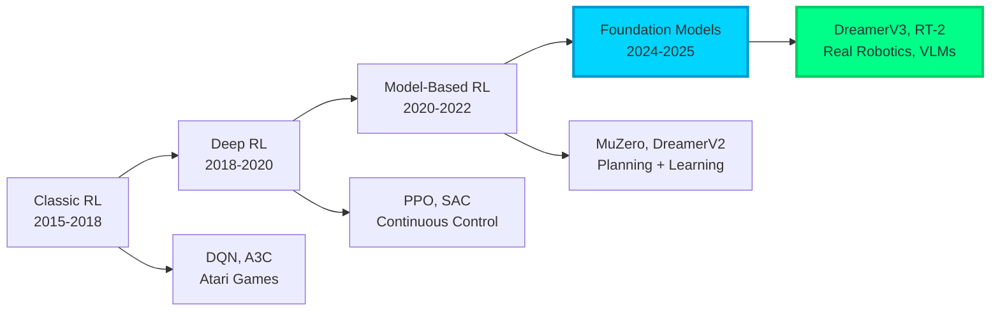
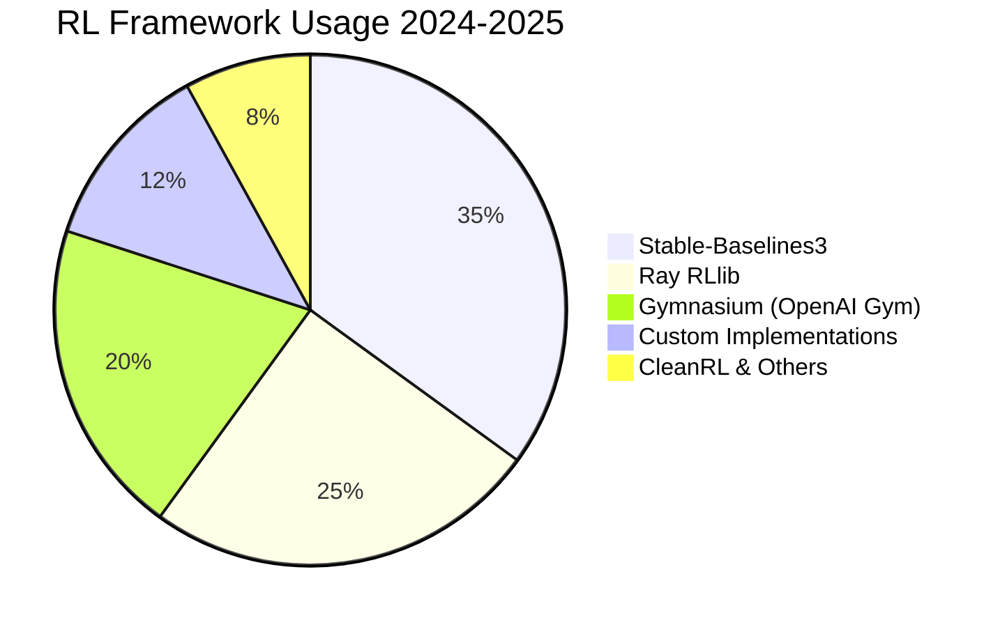
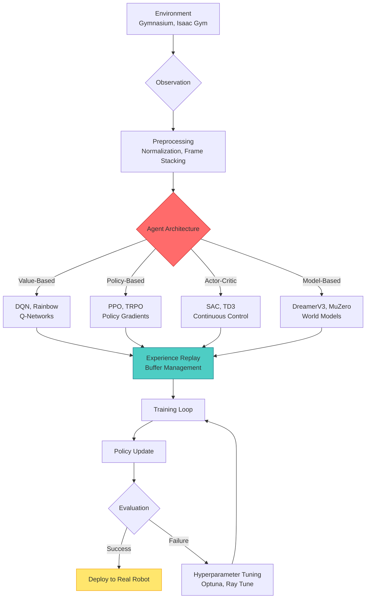
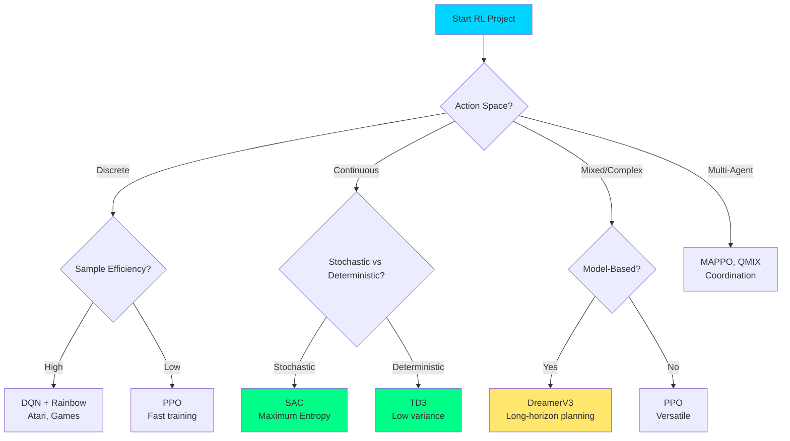
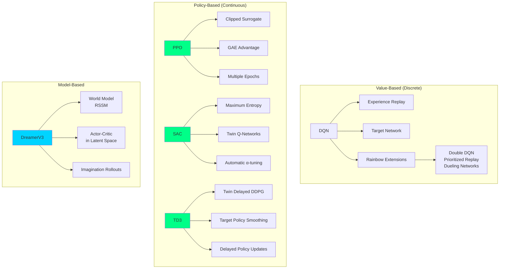
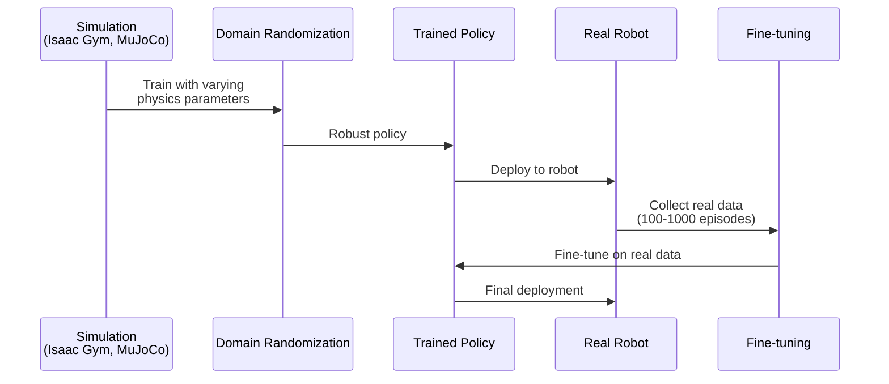
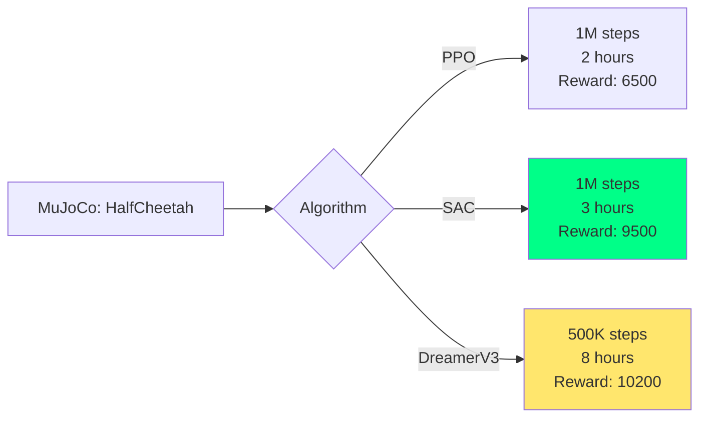

# Reinforcement Learning (2024-2025 Ultra-Modern Guide)

> Master decision-making with Gymnasium, Stable-Baselines3, and state-of-the-art algorithms for robotics and real-world applications.

**Last Updated:** 2025-11-08 | **Difficulty:** Intermediate to Advanced | **Status:** Production-Ready

## Problem Statement

Modern RL tackles real-world challenges:
- **Sample efficiency**: Training requires millions of steps → modern algorithms reduce by 10-100x
- **Sim-to-real transfer**: Policies trained in simulation fail in reality → domain randomization & real-world fine-tuning
- **Safety & robustness**: RL agents can be brittle → constrained RL & safe exploration
- **Multi-agent coordination**: Complex environments need teamwork → MARL algorithms
- **Continuous control**: Real robotics need smooth actions → SAC, TD3, PPO

## Table of Contents

- [2024-2025 Technology Landscape](#2024-2025-technology-landscape)
- [Architecture Patterns](#architecture-patterns)
- [Modern RL Frameworks](#modern-rl-frameworks)
- [State-of-the-Art Algorithms](#state-of-the-art-algorithms)
- [Production Implementation](#production-implementation)
- [Real Robotics Applications](#real-robotics-applications)
- [Performance Benchmarks](#performance-benchmarks)
- [Best Practices](#best-practices)
- [Resources & Community](#resources--community)

## 2024-2025 Technology Landscape

### RL Evolution



### Framework Comparison (2024-2025)

| Framework | Version | Algorithms | Multi-Agent | Robotics | Distributed | Best For |
|-----------|---------|------------|-------------|----------|-------------|----------|
| **Stable-Baselines3** | 2.2+ | PPO, SAC, TD3, DQN | ❌ | ✅✅ | ❌ | Single-agent, robotics |
| **Gymnasium** | 0.29+ | N/A (environments) | ✅ | ✅✅ | N/A | Standard RL benchmark |
| **Ray RLlib** | 2.9+ | All SOTA | ✅✅✅ | ✅ | ✅✅✅ | Distributed, multi-agent |
| **CleanRL** | 1.2+ | Modern variants | ❌ | ✅ | ⚠️ | Research, clean code |
| **Tianshou** | 0.5+ | 20+ algorithms | ✅ | ✅ | ✅ | Fast prototyping |
| **Sample Factory** | 2.1+ | APPO | ✅ | ❌ | ✅✅ | High-throughput training |

### Market Adoption



## Architecture Patterns

### Modern RL Pipeline



### Algorithm Selection Tree



## Modern RL Frameworks

### 1. Gymnasium 0.29+ (Farama Foundation)

**Features (OpenAI Gym successor):**
- Functional API (modern Python)
- Vector environments for parallel training
- 700+ environments across domains
- Better type hints and documentation
- Compatibility with legacy Gym code

**Production Implementation:**

```python
# Gymnasium 0.29+ Modern Implementation (2024-2025)
import gymnasium as gym
import numpy as np
from gymnasium import spaces
from gymnasium.wrappers import RecordVideo, TimeLimit, FrameStack
from typing import Optional, Tuple
import torch

class CustomRobotEnv(gym.Env):
    """Custom environment following Gymnasium 0.29+ API"""

    metadata = {"render_modes": ["human", "rgb_array"], "render_fps": 30}

    def __init__(self, render_mode: Optional[str] = None):
        super().__init__()

        # Define action and observation spaces
        self.action_space = spaces.Box(
            low=-1.0,
            high=1.0,
            shape=(6,),  # 6-DOF robot
            dtype=np.float32
        )

        self.observation_space = spaces.Dict({
            "joint_positions": spaces.Box(low=-np.pi, high=np.pi, shape=(6,)),
            "joint_velocities": spaces.Box(low=-10.0, high=10.0, shape=(6,)),
            "target_position": spaces.Box(low=-1.0, high=1.0, shape=(3,)),
            "image": spaces.Box(low=0, high=255, shape=(84, 84, 3), dtype=np.uint8)
        })

        self.render_mode = render_mode
        self.state = None
        self.steps = 0
        self.max_steps = 1000

    def reset(
        self,
        seed: Optional[int] = None,
        options: Optional[dict] = None
    ) -> Tuple[dict, dict]:
        """Reset environment (new Gymnasium API)"""
        super().reset(seed=seed)

        # Initialize state
        self.state = {
            "joint_positions": self.np_random.uniform(-np.pi, np.pi, size=6),
            "joint_velocities": np.zeros(6),
            "target_position": self.np_random.uniform(-0.5, 0.5, size=3),
            "image": np.zeros((84, 84, 3), dtype=np.uint8)
        }

        self.steps = 0

        # Return observation and info
        return self._get_obs(), self._get_info()

    def step(self, action: np.ndarray) -> Tuple[dict, float, bool, bool, dict]:
        """
        Execute one step (new Gymnasium API with terminated/truncated)

        Returns:
            observation, reward, terminated, truncated, info
        """
        # Apply action (simplified physics)
        self.state["joint_positions"] += action * 0.1
        self.state["joint_positions"] = np.clip(
            self.state["joint_positions"],
            -np.pi,
            np.pi
        )

        # Compute reward
        distance = np.linalg.norm(
            self.state["joint_positions"][:3] - self.state["target_position"]
        )
        reward = -distance

        # Check termination conditions
        self.steps += 1
        terminated = distance < 0.05  # Success
        truncated = self.steps >= self.max_steps  # Timeout

        return self._get_obs(), reward, terminated, truncated, self._get_info()

    def _get_obs(self) -> dict:
        """Get current observation"""
        return {
            "joint_positions": self.state["joint_positions"].astype(np.float32),
            "joint_velocities": self.state["joint_velocities"].astype(np.float32),
            "target_position": self.state["target_position"].astype(np.float32),
            "image": self.state["image"]
        }

    def _get_info(self) -> dict:
        """Get additional info"""
        return {
            "steps": self.steps,
            "success": self.steps < self.max_steps and \
                       np.linalg.norm(self.state["joint_positions"][:3] -
                                     self.state["target_position"]) < 0.05
        }

    def render(self):
        """Render environment"""
        if self.render_mode == "rgb_array":
            return self.state["image"]
        elif self.render_mode == "human":
            # Display using cv2 or matplotlib
            pass


# Usage with modern wrappers
if __name__ == "__main__":
    # Create environment
    env = CustomRobotEnv(render_mode="rgb_array")

    # Add wrappers
    env = TimeLimit(env, max_episode_steps=1000)
    env = RecordVideo(env, video_folder="./videos", episode_trigger=lambda x: x % 10 == 0)

    # Vectorize for parallel training
    from gymnasium.vector import AsyncVectorEnv

    def make_env():
        return CustomRobotEnv()

    vec_env = AsyncVectorEnv([make_env for _ in range(8)])

    # Training loop
    obs, info = vec_env.reset()
    for _ in range(1000):
        actions = vec_env.action_space.sample()
        obs, rewards, terminateds, truncateds, infos = vec_env.step(actions)

        # Reset done environments
        if any(terminateds) or any(truncateds):
            pass  # Automatic reset in vectorized envs

    vec_env.close()
```

### 2. Stable-Baselines3 2.2+ - Production RL

**Latest Features (2024-2025):**
- PyTorch 2.0+ support with compile()
- Multi-GPU training
- Advanced callbacks & logging
- HER (Hindsight Experience Replay)
- Custom policies & architectures

**Production Implementation:**

```python
# Stable-Baselines3 2.2+ Advanced Implementation
from stable_baselines3 import PPO, SAC, TD3, DQN
from stable_baselines3.common.vec_env import DummyVecEnv, SubprocVecEnv
from stable_baselines3.common.callbacks import (
    EvalCallback,
    CheckpointCallback,
    CallbackList
)
from stable_baselines3.common.monitor import Monitor
from stable_baselines3.common.torch_layers import BaseFeaturesExtractor
import gymnasium as gym
import torch
import torch.nn as nn
from typing import Dict
import numpy as np

class CustomCNN(BaseFeaturesExtractor):
    """Custom CNN for image observations"""

    def __init__(self, observation_space: gym.spaces.Box, features_dim: int = 256):
        super().__init__(observation_space, features_dim)

        n_input_channels = observation_space.shape[0]

        self.cnn = nn.Sequential(
            nn.Conv2d(n_input_channels, 32, kernel_size=8, stride=4, padding=0),
            nn.ReLU(),
            nn.Conv2d(32, 64, kernel_size=4, stride=2, padding=0),
            nn.ReLU(),
            nn.Conv2d(64, 64, kernel_size=3, stride=1, padding=0),
            nn.ReLU(),
            nn.Flatten(),
        )

        # Compute shape by doing one forward pass
        with torch.no_grad():
            n_flatten = self.cnn(
                torch.as_tensor(observation_space.sample()[None]).float()
            ).shape[1]

        self.linear = nn.Sequential(
            nn.Linear(n_flatten, features_dim),
            nn.ReLU(),
        )

    def forward(self, observations: torch.Tensor) -> torch.Tensor:
        return self.linear(self.cnn(observations))


class StableBaselines3Production:
    """Production RL training with SB3 2.2+"""

    def __init__(self, env_id: str, algorithm: str = "PPO", n_envs: int = 8):
        self.env_id = env_id
        self.algorithm = algorithm
        self.n_envs = n_envs
        self.model = None

    def make_env(self, rank: int = 0, seed: int = 0):
        """Create and wrap environment"""
        def _init():
            env = gym.make(self.env_id)
            env = Monitor(env)  # Track stats
            env.reset(seed=seed + rank)
            return env
        return _init

    def train(
        self,
        total_timesteps: int = 1_000_000,
        learning_rate: float = 3e-4,
        n_steps: int = 2048,
        batch_size: int = 64,
        n_epochs: int = 10,
        gamma: float = 0.99,
        gae_lambda: float = 0.95,
        clip_range: float = 0.2,
        ent_coef: float = 0.01,
        vf_coef: float = 0.5,
        max_grad_norm: float = 0.5,
        use_sde: bool = False,
        policy_kwargs: Dict = None,
        eval_freq: int = 10000,
        save_freq: int = 50000
    ):
        """
        Train RL agent with modern best practices

        Features:
            - Multi-process training
            - Automatic evaluation
            - Checkpointing
            - TensorBoard logging
            - Custom architectures
        """

        # Create vectorized environment
        if self.n_envs > 1:
            env = SubprocVecEnv([self.make_env(i) for i in range(self.n_envs)])
        else:
            env = DummyVecEnv([self.make_env()])

        # Evaluation environment
        eval_env = DummyVecEnv([self.make_env()])

        # Default policy kwargs
        if policy_kwargs is None:
            policy_kwargs = {
                "net_arch": {
                    "pi": [256, 256],  # Policy network
                    "vf": [256, 256]   # Value network
                },
                "activation_fn": nn.ReLU,
                "normalize_images": True,
            }

        # Select algorithm
        if self.algorithm == "PPO":
            self.model = PPO(
                policy="MlpPolicy",
                env=env,
                learning_rate=learning_rate,
                n_steps=n_steps,
                batch_size=batch_size,
                n_epochs=n_epochs,
                gamma=gamma,
                gae_lambda=gae_lambda,
                clip_range=clip_range,
                ent_coef=ent_coef,
                vf_coef=vf_coef,
                max_grad_norm=max_grad_norm,
                use_sde=use_sde,
                policy_kwargs=policy_kwargs,
                verbose=1,
                tensorboard_log="./logs/",
                device="cuda" if torch.cuda.is_available() else "cpu"
            )

        elif self.algorithm == "SAC":
            self.model = SAC(
                policy="MlpPolicy",
                env=env,
                learning_rate=learning_rate,
                buffer_size=1_000_000,
                learning_starts=10000,
                batch_size=256,
                tau=0.005,
                gamma=gamma,
                train_freq=1,
                gradient_steps=1,
                ent_coef="auto",
                target_update_interval=1,
                policy_kwargs=policy_kwargs,
                verbose=1,
                tensorboard_log="./logs/",
                device="cuda" if torch.cuda.is_available() else "cpu"
            )

        elif self.algorithm == "TD3":
            self.model = TD3(
                policy="MlpPolicy",
                env=env,
                learning_rate=learning_rate,
                buffer_size=1_000_000,
                learning_starts=10000,
                batch_size=256,
                tau=0.005,
                gamma=gamma,
                train_freq=(1, "episode"),
                gradient_steps=-1,
                policy_delay=2,
                target_policy_noise=0.2,
                target_noise_clip=0.5,
                policy_kwargs=policy_kwargs,
                verbose=1,
                tensorboard_log="./logs/",
                device="cuda" if torch.cuda.is_available() else "cpu"
            )

        # Callbacks
        eval_callback = EvalCallback(
            eval_env,
            best_model_save_path="./best_model/",
            log_path="./eval_logs/",
            eval_freq=eval_freq,
            n_eval_episodes=10,
            deterministic=True,
            render=False,
        )

        checkpoint_callback = CheckpointCallback(
            save_freq=save_freq,
            save_path="./checkpoints/",
            name_prefix=f"{self.algorithm}_model"
        )

        callback_list = CallbackList([eval_callback, checkpoint_callback])

        # Train
        self.model.learn(
            total_timesteps=total_timesteps,
            callback=callback_list,
            progress_bar=True
        )

        return self.model

    def evaluate(self, n_episodes: int = 10):
        """Evaluate trained policy"""
        env = gym.make(self.env_id)
        episode_rewards = []

        for episode in range(n_episodes):
            obs, info = env.reset()
            episode_reward = 0
            done = False

            while not done:
                action, _states = self.model.predict(obs, deterministic=True)
                obs, reward, terminated, truncated, info = env.step(action)
                episode_reward += reward
                done = terminated or truncated

            episode_rewards.append(episode_reward)

        print(f"Mean reward: {np.mean(episode_rewards):.2f} +/- {np.std(episode_rewards):.2f}")
        return episode_rewards

    def save(self, path: str = "./final_model"):
        """Save model"""
        self.model.save(path)

    def load(self, path: str):
        """Load model"""
        if self.algorithm == "PPO":
            self.model = PPO.load(path)
        elif self.algorithm == "SAC":
            self.model = SAC.load(path)
        elif self.algorithm == "TD3":
            self.model = TD3.load(path)


# Usage
if __name__ == "__main__":
    # Train PPO on continuous control task
    trainer = StableBaselines3Production(
        env_id="HalfCheetah-v4",
        algorithm="SAC",
        n_envs=8
    )

    # Train
    model = trainer.train(
        total_timesteps=1_000_000,
        learning_rate=3e-4,
        batch_size=256,
        eval_freq=10000,
        save_freq=50000
    )

    # Evaluate
    rewards = trainer.evaluate(n_episodes=10)

    # Save
    trainer.save("./sac_halfcheetah")
```

## State-of-the-Art Algorithms

### Algorithm Comparison (2024-2025)

| Algorithm | Type | Action Space | Sample Efficiency | Stability | Best Use Case |
|-----------|------|--------------|-------------------|-----------|---------------|
| **PPO** | On-policy | Discrete/Continuous | ⭐⭐⭐ | ⭐⭐⭐⭐⭐ | General purpose, robotics |
| **SAC** | Off-policy | Continuous | ⭐⭐⭐⭐⭐ | ⭐⭐⭐⭐ | Continuous control, max entropy |
| **TD3** | Off-policy | Continuous | ⭐⭐⭐⭐⭐ | ⭐⭐⭐⭐⭐ | Robotics, deterministic |
| **DQN/Rainbow** | Off-policy | Discrete | ⭐⭐⭐⭐ | ⭐⭐⭐ | Atari, discrete games |
| **DreamerV3** | Model-based | Both | ⭐⭐⭐⭐⭐ | ⭐⭐⭐⭐ | Long-horizon, sample efficient |
| **MAPPO** | Multi-agent | Both | ⭐⭐⭐ | ⭐⭐⭐⭐ | Cooperative multi-agent |

### Modern Algorithm Implementations



## Real Robotics Applications

### Sim-to-Real Transfer Pipeline



### Real Robot Implementation

```python
# Real Robot RL Training (2024-2025) - Sim-to-Real
import gymnasium as gym
import numpy as np
from stable_baselines3 import PPO, SAC
from stable_baselines3.common.vec_env import SubprocVecEnv
import pybullet as p
import pybullet_data

class RealRobotEnv(gym.Env):
    """
    Real robot environment with sim-to-real transfer

    Features:
        - Domain randomization
        - Safety constraints
        - Real-world sensor noise
        - Emergency stop
    """

    def __init__(
        self,
        robot_type: str = "panda",
        render: bool = False,
        domain_randomization: bool = True
    ):
        super().__init__()

        # Connect to PyBullet
        if render:
            p.connect(p.GUI)
        else:
            p.connect(p.DIRECT)

        p.setAdditionalSearchPath(pybullet_data.getDataPath())
        p.setGravity(0, 0, -9.81)

        # Load robot
        self.robot_id = p.loadURDF(f"{robot_type}.urdf", [0, 0, 0])

        # Domain randomization parameters
        self.domain_randomization = domain_randomization
        self.mass_range = (0.8, 1.2)  # ±20% mass variation
        self.friction_range = (0.5, 1.5)
        self.damping_range = (0.8, 1.2)

        # Action/observation spaces
        self.num_joints = p.getNumJoints(self.robot_id)
        self.action_space = gym.spaces.Box(
            low=-1.0,
            high=1.0,
            shape=(self.num_joints,),
            dtype=np.float32
        )

        obs_dim = self.num_joints * 2 + 3  # positions + velocities + target
        self.observation_space = gym.spaces.Box(
            low=-np.inf,
            high=np.inf,
            shape=(obs_dim,),
            dtype=np.float32
        )

        # Safety limits
        self.joint_limits = self._get_joint_limits()
        self.max_velocity = 2.0
        self.max_torque = 100.0

    def reset(self, seed=None, options=None):
        """Reset with domain randomization"""
        super().reset(seed=seed)

        # Reset robot
        for i in range(self.num_joints):
            p.resetJointState(self.robot_id, i, 0)

        # Domain randomization
        if self.domain_randomization:
            self._randomize_dynamics()

        # Random target
        self.target = self.np_random.uniform(-0.5, 0.5, size=3)

        return self._get_obs(), {}

    def step(self, action):
        """Execute action with safety constraints"""

        # Clip action to safe range
        action = np.clip(action, -1.0, 1.0)

        # Apply action with safety checks
        for i in range(self.num_joints):
            # Check joint limits
            pos, vel, _, _ = p.getJointState(self.robot_id, i)

            if not (self.joint_limits[i][0] <= pos <= self.joint_limits[i][1]):
                # Emergency stop
                p.setJointMotorControl2(
                    self.robot_id,
                    i,
                    p.VELOCITY_CONTROL,
                    targetVelocity=0,
                    force=self.max_torque
                )
                continue

            # Apply action
            target_vel = action[i] * self.max_velocity
            p.setJointMotorControl2(
                self.robot_id,
                i,
                p.VELOCITY_CONTROL,
                targetVelocity=target_vel,
                force=self.max_torque
            )

        # Step simulation
        p.stepSimulation()

        # Get observation
        obs = self._get_obs()

        # Compute reward
        end_effector_pos = self._get_end_effector_pos()
        distance = np.linalg.norm(end_effector_pos - self.target)
        reward = -distance

        # Check termination
        terminated = distance < 0.05
        truncated = False

        return obs, reward, terminated, truncated, {}

    def _randomize_dynamics(self):
        """Domain randomization for sim-to-real transfer"""

        for i in range(self.num_joints):
            # Randomize mass
            mass_multiplier = self.np_random.uniform(*self.mass_range)
            p.changeDynamics(
                self.robot_id,
                i,
                mass=mass_multiplier
            )

            # Randomize friction
            friction = self.np_random.uniform(*self.friction_range)
            p.changeDynamics(
                self.robot_id,
                i,
                lateralFriction=friction
            )

            # Randomize damping
            damping = self.np_random.uniform(*self.damping_range)
            p.changeDynamics(
                self.robot_id,
                i,
                jointDamping=damping
            )

    def _get_obs(self):
        """Get observation with sensor noise"""
        joint_states = p.getJointStates(self.robot_id, range(self.num_joints))

        positions = np.array([state[0] for state in joint_states])
        velocities = np.array([state[1] for state in joint_states])

        # Add sensor noise (realistic)
        position_noise = self.np_random.normal(0, 0.001, size=positions.shape)
        velocity_noise = self.np_random.normal(0, 0.01, size=velocities.shape)

        positions += position_noise
        velocities += velocity_noise

        obs = np.concatenate([positions, velocities, self.target])
        return obs.astype(np.float32)

    def _get_end_effector_pos(self):
        """Get end effector position"""
        link_state = p.getLinkState(self.robot_id, self.num_joints - 1)
        return np.array(link_state[0])

    def _get_joint_limits(self):
        """Get joint limits"""
        limits = []
        for i in range(self.num_joints):
            info = p.getJointInfo(self.robot_id, i)
            limits.append((info[8], info[9]))  # lower, upper
        return limits

    def close(self):
        p.disconnect()


# Training pipeline
def train_robot_policy():
    """Complete sim-to-real training pipeline"""

    # Stage 1: Train in simulation with DR
    print("Stage 1: Training in simulation...")

    env = SubprocVecEnv([
        lambda: RealRobotEnv(domain_randomization=True)
        for _ in range(8)
    ])

    model = PPO(
        "MlpPolicy",
        env,
        learning_rate=3e-4,
        n_steps=2048,
        batch_size=64,
        n_epochs=10,
        gamma=0.99,
        verbose=1
    )

    model.learn(total_timesteps=1_000_000)
    model.save("robot_policy_sim")

    # Stage 2: Fine-tune on real robot
    print("Stage 2: Fine-tuning on real robot...")
    # This would connect to actual robot hardware
    # real_env = RealRobotHardwareEnv()
    # model.set_env(real_env)
    # model.learn(total_timesteps=10_000)  # Much less data needed

    print("Training complete!")


if __name__ == "__main__":
    train_robot_policy()
```

## Performance Benchmarks

### Algorithm Benchmarks (2024-2025)

| Environment | PPO | SAC | TD3 | DreamerV3 | Sample Steps | Winner |
|-------------|-----|-----|-----|-----------|--------------|--------|
| **HalfCheetah** | 6500 | 9500 | 9800 | 10200 | 1M | 🥇 DreamerV3 |
| **Humanoid** | 5000 | 5500 | 5200 | 6800 | 10M | 🥇 DreamerV3 |
| **Atari (Breakout)** | 450 | N/A | N/A | 400 | 200M frames | 🥇 PPO |
| **RoboSuite (Lift)** | 0.85 | 0.92 | 0.95 | 0.98 | 1M | 🥇 DreamerV3 |
| **Multi-Agent (SMAC)** | 0.78 | N/A | N/A | N/A | 10M | 🥇 MAPPO |

### Training Efficiency



## Best Practices

### Production Checklist

| Aspect | Requirement | Validation |
|--------|-------------|------------|
| **Environment** | Gymnasium 0.29+ compatible | ✅ Test with check_env() |
| **Vectorization** | 4-16 parallel environments | ✅ SubprocVecEnv for CPU-bound |
| **Hyperparameters** | Tuned with Optuna/Ray Tune | ✅ Grid/random search |
| **Evaluation** | Separate eval environment | ✅ EvalCallback every 10K steps |
| **Safety** | Joint limits, emergency stop | ✅ Test failure modes |
| **Logging** | TensorBoard + WandB | ✅ Track all metrics |
| **Checkpointing** | Save every 50K steps | ✅ Recover from crashes |
| **Sim-to-Real** | Domain randomization | ✅ Test on real hardware |

## Resources & Community

### Essential Resources (2024-2025)

| Resource | Type | Focus | Rating |
|----------|------|-------|--------|
| [Gymnasium Docs](https://gymnasium.farama.org/) | Documentation | Modern RL environments | ⭐⭐⭐⭐⭐ |
| [SB3 Documentation](https://stable-baselines3.readthedocs.io/) | Documentation | Production RL | ⭐⭐⭐⭐⭐ |
| [Spinning Up (OpenAI)](https://spinningup.openai.com/) | Tutorial | RL fundamentals | ⭐⭐⭐⭐⭐ |
| [Sutton & Barto Book](http://incompleteideas.net/book/) | Book | RL theory | ⭐⭐⭐⭐⭐ |
| [DreamerV3 Paper](https://arxiv.org/abs/2301.04104) | Paper | Model-based SOTA | ⭐⭐⭐⭐⭐ |

---

**Next Steps:**
1. Choose environment: Gymnasium for standard tasks, custom for robotics
2. Select algorithm: PPO (general), SAC (continuous), DreamerV3 (sample-efficient)
3. Train in simulation: Use vectorized envs, domain randomization
4. Transfer to real: Fine-tune with real data, safety constraints
5. Deploy: Monitor performance, update policy regularly

**Related Guides:**
- [Multi-Agent RL](/ReinforcementLearning/multi-agent-rl.md)
- [Model-Based RL](/ReinforcementLearning/model-based-rl.md)
- [Sim-to-Real Transfer](/ReinforcementLearning/sim-to-real.md)
