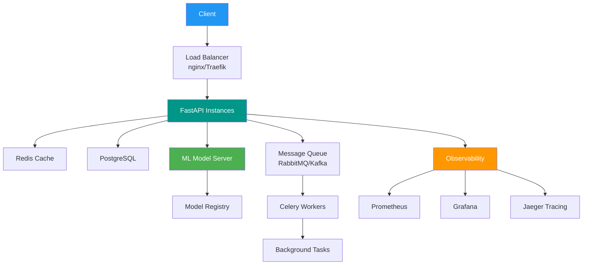
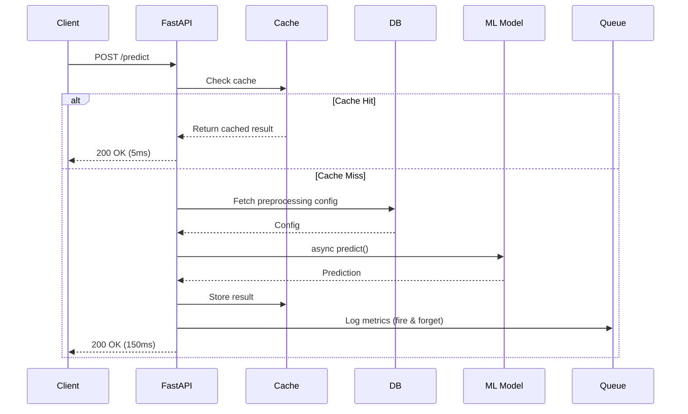

<div align="center">

# 🐍 Modern Python Backend & AI/ML Services

### *Production-Ready FastAPI,

 Async Python & ML Deployment 2024-2025*


</div>

---

## 📋 Table of Contents

- [Modern Python Stack](#-modern-python-stack-2024)
- [FastAPI Production Setup](#-fastapi-production-setup)
- [Pydantic v2 Validation](#-pydantic-v2-validation)
- [Async Patterns](#-async-patterns)
- [Database Integration](#-database-integration)
- [ML Model Serving](#-ml-model-serving)
- [Deployment](#-deployment--scaling)
- [Monitoring & Observability](#-monitoring--observability)

---

## 🚀 Modern Python Stack (2024)

### Framework Comparison

| Framework | GitHub Stars | Speed | Best For | Async |
|-----------|-------------|-------|----------|-------|
| **FastAPI** |  | ⚡⚡⚡⚡⚡ | APIs, ML Serving | Native |
| **Django** |  | ⚡⚡⚡ | Full Apps | Partial |
| **Flask** |  | ⚡⚡⚡⚡ | Microservices | Extensions |
| **Litestar** |  | ⚡⚡⚡⚡⚡ | Modern APIs | Native |

### Architecture Overview



---

## 🔥 FastAPI Production Setup

### Project Structure (2024 Best Practice)

```python
# Modern FastAPI Project Structure
project/
├── app/
│   ├── __init__.py
│   ├── main.py                 # Application entry point
│   ├── config.py               # Pydantic Settings
│   ├── dependencies.py         # Dependency injection
│   │
│   ├── api/
│   │   ├── __init__.py
│   │   ├── routes/
│   │   │   ├── __init__.py
│   │   │   ├── health.py
│   │   │   ├── predictions.py
│   │   │   └── models.py
│   │   └── middleware/
│   │       ├── __init__.py
│   │       ├── auth.py
│   │       └── logging.py
│   │
│   ├── core/
│   │   ├── __init__.py
│   │   ├── security.py
│   │   ├── cache.py
│   │   └── database.py
│   │
│   ├── models/                 # Database models
│   │   ├── __init__.py
│   │   ├── prediction.py
│   │   └── user.py
│   │
│   ├── schemas/                # Pydantic schemas
│   │   ├── __init__.py
│   │   ├── prediction.py
│   │   └── user.py
│   │
│   ├── services/               # Business logic
│   │   ├── __init__.py
│   │   ├── ml_service.py
│   │   └── cache_service.py
│   │
│   └── ml/                     # ML components
│       ├── __init__.py
│       ├── model_loader.py
│       ├── predictor.py
│       └── preprocessor.py
│
├── tests/
├── alembic/                    # Database migrations
├── docker/
├── pyproject.toml              # Modern Python packaging
└── .env
```

### FastAPI Main Application (2024)

```python
# app/main.py
from contextlib import asynccontextmanager
from fastapi import FastAPI, Request
from fastapi.middleware.cors import CORSMiddleware
from fastapi.middleware.gzip import GZipMiddleware
from fastapi.responses import ORJSONResponse
from prometheus_fastapi_instrumentator import Instrumentator
import structlog

from app.config import settings
from app.api.routes import health, predictions
from app.core.database import init_db, close_db
from app.core.cache import init_redis, close_redis
from app.services.ml_service import MLService

# Structured logging
logger = structlog.get_logger()

@asynccontextmanager
async def lifespan(app: FastAPI):
    """Manage application lifecycle"""
    # Startup
    logger.info("Starting application")
    await init_db()
    await init_redis()

    # Load ML models
    ml_service = MLService()
    await ml_service.load_models()
    app.state.ml_service = ml_service

    logger.info("Application started successfully")

    yield

    # Shutdown
    logger.info("Shutting down application")
    await close_redis()
    await close_db()
    logger.info("Application shut down")

# Initialize FastAPI with modern defaults
app = FastAPI(
    title="AI ML Service API",
    description="Production-ready ML model serving with FastAPI",
    version="2.0.0",
    docs_url="/api/docs",
    redoc_url="/api/redoc",
    openapi_url="/api/openapi.json",
    default_response_class=ORJSONResponse,  # Faster JSON serialization
    lifespan=lifespan
)

# ═══════════════════════════════════════════════════════
# Middleware Configuration
# ═══════════════════════════════════════════════════════

# CORS
app.add_middleware(
    CORSMiddleware,
    allow_origins=settings.ALLOWED_ORIGINS,
    allow_credentials=True,
    allow_methods=["*"],
    allow_headers=["*"],
)

# Gzip compression
app.add_middleware(GZipMiddleware, minimum_size=1000)

# Request ID tracking
@app.middleware("http")
async def add_request_id(request: Request, call_next):
    request_id = request.headers.get("X-Request-ID", str(uuid.uuid4()))
    logger.bind(request_id=request_id)
    response = await call_next(request)
    response.headers["X-Request-ID"] = request_id
    return response

# ═══════════════════════════════════════════════════════
# Monitoring & Metrics
# ═══════════════════════════════════════════════════════

# Prometheus metrics
Instrumentator().instrument(app).expose(app, endpoint="/metrics")

# ═══════════════════════════════════════════════════════
# Routes
# ═══════════════════════════════════════════════════════

app.include_router(health.router, prefix="/health", tags=["health"])
app.include_router(predictions.router, prefix="/api/v1", tags=["predictions"])

@app.get("/")
async def root():
    return {
        "service": "AI ML API",
        "version": "2.0.0",
        "status": "operational"
    }

if __name__ == "__main__":
    import uvicorn
    uvicorn.run(
        "app.main:app",
        host="0.0.0.0",
        port=8000,
        reload=settings.DEBUG,
        workers=4,
        log_config=None,  # Use structlog
    )
```

---

## ✅ Pydantic v2 Validation

### Modern Pydantic v2 Schemas (2024)

```python
# app/schemas/prediction.py
from datetime import datetime
from typing import Annotated, Literal
from pydantic import (
    BaseModel,
    Field,
    ConfigDict,
    field_validator,
    model_validator,
    computed_field
)
from pydantic.functional_validators import AfterValidator

# ═══════════════════════════════════════════════════════
# Custom Validators (Pydantic v2)
# ═══════════════════════════════════════════════════════

def validate_positive(v: float) -> float:
    if v <= 0:
        raise ValueError("must be positive")
    return v

PositiveFloat = Annotated[float, AfterValidator(validate_positive)]

# ═══════════════════════════════════════════════════════
# Request/Response Models
# ═══════════════════════════════════════════════════════

class PredictionInput(BaseModel):
    """Input schema for ML predictions"""

    model_config = ConfigDict(
        str_strip_whitespace=True,
        validate_assignment=True,
        use_enum_values=True,
    )

    features: list[float] = Field(
        ...,
        min_length=1,
        max_length=100,
        description="Feature vector for prediction"
    )

    model_version: str = Field(
        default="latest",
        pattern=r"^(latest|v\d+\.\d+\.\d+)$",
        description="Model version to use"
    )

    confidence_threshold: PositiveFloat = Field(
        default=0.5,
        ge=0.0,
        le=1.0,
        description="Minimum confidence threshold"
    )

    preprocessing: Literal["standard", "minmax", "robust"] = Field(
        default="standard",
        description="Preprocessing method"
    )

    @field_validator("features")
    @classmethod
    def validate_features(cls, v: list[float]) -> list[float]:
        """Validate feature values"""
        if any(abs(x) > 1000 for x in v):
            raise ValueError("Feature values too large")
        return v

    @model_validator(mode="after")
    def validate_model(self) -> "PredictionInput":
        """Cross-field validation"""
        if self.model_version != "latest" and self.preprocessing == "robust":
            raise ValueError("Robust preprocessing only available in latest version")
        return self

class PredictionOutput(BaseModel):
    """Output schema for ML predictions"""

    model_config = ConfigDict(
        json_schema_extra={
            "examples": [{
                "prediction": 0.85,
                "confidence": 0.92,
                "model_version": "v2.1.0",
                "latency_ms": 15.3,
                "timestamp": "2024-01-15T10:30:00Z"
            }]
        }
    )

    prediction: float = Field(..., description="Predicted value")
    confidence: float = Field(..., ge=0.0, le=1.0)
    model_version: str
    latency_ms: float
    timestamp: datetime = Field(default_factory=datetime.utcnow)

    @computed_field
    @property
    def prediction_class(self) -> str:
        """Computed field for classification"""
        return "positive" if self.prediction > 0.5 else "negative"

class BatchPredictionInput(BaseModel):
    """Batch prediction input"""

    samples: list[PredictionInput] = Field(
        ...,
        min_length=1,
        max_length=1000,
        description="Batch of prediction inputs"
    )

    parallel: bool = Field(
        default=True,
        description="Process predictions in parallel"
    )

# ═══════════════════════════════════════════════════════
# Settings with Pydantic v2
# ═══════════════════════════════════════════════════════

from pydantic_settings import BaseSettings, SettingsConfigDict

class Settings(BaseSettings):
    """Application settings"""

    model_config = SettingsConfigDict(
        env_file=".env",
        env_file_encoding="utf-8",
        case_sensitive=False,
        extra="ignore"
    )

    # App Settings
    APP_NAME: str = "AI ML Service"
    DEBUG: bool = False
    API_V1_PREFIX: str = "/api/v1"

    # Database
    DATABASE_URL: str = Field(..., description="PostgreSQL connection string")
    DB_POOL_SIZE: int = Field(default=20, ge=1, le=100)

    # Redis
    REDIS_URL: str = Field(..., description="Redis connection string")
    REDIS_TTL: int = Field(default=3600, ge=60)

    # Security
    SECRET_KEY: str = Field(..., min_length=32)
    ALLOWED_ORIGINS: list[str] = ["http://localhost:3000"]

    # ML Models
    MODEL_PATH: str = Field(default="./models")
    MAX_BATCH_SIZE: int = Field(default=100, ge=1, le=1000)

    @computed_field
    @property
    def database_url_async(self) -> str:
        """Convert PostgreSQL URL to async version"""
        return self.DATABASE_URL.replace("postgresql://", "postgresql+asyncpg://")

settings = Settings()
```

---

## ⚡ Async Patterns

### Async Processing Pipeline



### Production Async Code (2024)

```python
# app/services/ml_service.py
import asyncio
from typing import List, Optional
import numpy as np
from functools import lru_cache
import aioredis
import orjson

from app.schemas.prediction import PredictionInput, PredictionOutput
from app.core.cache import get_redis
from app.core.database import get_db

class MLService:
    """Production ML service with async support"""

    def __init__(self):
        self.models = {}
        self.preprocessing_cache = {}

    async def load_models(self):
        """Load all ML models asynchronously"""
        model_versions = ["v1.0.0", "v2.0.0", "latest"]

        # Load models in parallel
        tasks = [
            self._load_single_model(version)
            for version in model_versions
        ]

        results = await asyncio.gather(*tasks, return_exceptions=True)

        for version, result in zip(model_versions, results):
            if isinstance(result, Exception):
                logger.error(f"Failed to load model {version}", exc_info=result)
            else:
                self.models[version] = result
                logger.info(f"Loaded model {version}")

    async def _load_single_model(self, version: str):
        """Load a single model"""
        # Simulate async model loading
        await asyncio.sleep(0.1)  # I/O operation

        # In production, use joblib.load() or ONNX runtime
        return {"version": version, "loaded": True}

    async def predict(
        self,
        input_data: PredictionInput,
        redis: aioredis.Redis = None
    ) -> PredictionOutput:
        """Make prediction with caching"""

        # Generate cache key
        cache_key = self._generate_cache_key(input_data)

        # Check cache
        if redis:
            cached = await redis.get(cache_key)
            if cached:
                return PredictionOutput(**orjson.loads(cached))

        # Perform prediction
        start_time = asyncio.get_event_loop().time()

        # Preprocess features (CPU-bound, run in executor)
        preprocessed = await asyncio.to_thread(
            self._preprocess_features,
            input_data.features,
            input_data.preprocessing
        )

        # Get model
        model = self.models.get(input_data.model_version, self.models["latest"])

        # Predict (CPU-bound, run in executor)
        prediction = await asyncio.to_thread(
            self._run_inference,
            model,
            preprocessed
        )

        latency_ms = (asyncio.get_event_loop().time() - start_time) * 1000

        # Create response
        result = PredictionOutput(
            prediction=float(prediction[0]),
            confidence=float(prediction[1]),
            model_version=input_data.model_version,
            latency_ms=latency_ms
        )

        # Cache result
        if redis:
            await redis.setex(
                cache_key,
                3600,  # 1 hour TTL
                orjson.dumps(result.model_dump())
            )

        return result

    async def batch_predict(
        self,
        inputs: List[PredictionInput],
        parallel: bool = True
    ) -> List[PredictionOutput]:
        """Batch prediction with optional parallelization"""

        if parallel:
            # Process in parallel with concurrency limit
            semaphore = asyncio.Semaphore(10)  # Max 10 concurrent

            async def predict_with_semaphore(input_data):
                async with semaphore:
                    return await self.predict(input_data)

            tasks = [predict_with_semaphore(inp) for inp in inputs]
            results = await asyncio.gather(*tasks)
        else:
            # Process sequentially
            results = []
            for inp in inputs:
                result = await self.predict(inp)
                results.append(result)

        return results

    def _preprocess_features(
        self,
        features: List[float],
        method: str
    ) -> np.ndarray:
        """Preprocess features (CPU-bound)"""
        arr = np.array(features).reshape(1, -1)

        if method == "standard":
            return (arr - arr.mean()) / arr.std()
        elif method == "minmax":
            return (arr - arr.min()) / (arr.max() - arr.min())
        else:  # robust
            median = np.median(arr)
            mad = np.median(np.abs(arr - median))
            return (arr - median) / mad

    def _run_inference(self, model, features: np.ndarray):
        """Run model inference (CPU-bound)"""
        # Simulate prediction
        prediction = np.random.random()
        confidence = np.random.uniform(0.7, 0.99)
        return prediction, confidence

    def _generate_cache_key(self, input_data: PredictionInput) -> str:
        """Generate cache key from input"""
        import hashlib
        data = orjson.dumps(input_data.model_dump())
        return f"pred:{hashlib.md5(data).hexdigest()}"
```

### Async Database Operations

```python
# app/core/database.py
from sqlalchemy.ext.asyncio import (
    create_async_engine,
    AsyncSession,
    async_sessionmaker
)
from sqlalchemy.orm import declarative_base
from typing import AsyncGenerator

from app.config import settings

# Create async engine
engine = create_async_engine(
    settings.database_url_async,
    echo=settings.DEBUG,
    pool_size=20,
    max_overflow=40,
    pool_pre_ping=True,  # Verify connections before use
)

# Create async session factory
AsyncSessionLocal = async_sessionmaker(
    engine,
    class_=AsyncSession,
    expire_on_commit=False,
    autoflush=False,
    autocommit=False
)

Base = declarative_base()

async def get_db() -> AsyncGenerator[AsyncSession, None]:
    """Dependency for getting async DB session"""
    async with AsyncSessionLocal() as session:
        try:
            yield session
            await session.commit()
        except Exception:
            await session.rollback()
            raise
        finally:
            await session.close()

# ═══════════════════════════════════════════════════════
# CRUD Operations
# ═══════════════════════════════════════════════════════

from sqlalchemy import select, update, delete
from app.models.prediction import Prediction

class PredictionCRUD:
    """Async CRUD operations for predictions"""

    @staticmethod
    async def create(db: AsyncSession, prediction_data: dict) -> Prediction:
        """Create new prediction record"""
        prediction = Prediction(**prediction_data)
        db.add(prediction)
        await db.flush()
        await db.refresh(prediction)
        return prediction

    @staticmethod
    async def get_by_id(db: AsyncSession, prediction_id: int) -> Optional[Prediction]:
        """Get prediction by ID"""
        result = await db.execute(
            select(Prediction).where(Prediction.id == prediction_id)
        )
        return result.scalar_one_or_none()

    @staticmethod
    async def get_recent(
        db: AsyncSession,
        limit: int = 100,
        offset: int = 0
    ) -> List[Prediction]:
        """Get recent predictions with pagination"""
        result = await db.execute(
            select(Prediction)
            .order_by(Prediction.created_at.desc())
            .limit(limit)
            .offset(offset)
        )
        return result.scalars().all()

    @staticmethod
    async def update_status(
        db: AsyncSession,
        prediction_id: int,
        status: str
    ) -> bool:
        """Update prediction status"""
        result = await db.execute(
            update(Prediction)
            .where(Prediction.id == prediction_id)
            .values(status=status)
        )
        return result.rowcount > 0
```

---

## 🗄️ Database Integration

### SQLAlchemy 2.0 with Async (2024)

```python
# app/models/prediction.py
from datetime import datetime
from sqlalchemy import String, Float, DateTime, JSON, Index
from sqlalchemy.orm import Mapped, mapped_column

from app.core.database import Base

class Prediction(Base):
    """Prediction model with modern SQLAlchemy 2.0 syntax"""

    __tablename__ = "predictions"

    # Primary key
    id: Mapped[int] = mapped_column(primary_key=True, index=True)

    # Prediction data
    input_features: Mapped[dict] = mapped_column(JSON, nullable=False)
    prediction_value: Mapped[float] = mapped_column(Float, nullable=False)
    confidence_score: Mapped[float] = mapped_column(Float, nullable=False)
    model_version: Mapped[str] = mapped_column(String(50), nullable=False)

    # Metadata
    user_id: Mapped[str | None] = mapped_column(String(100), nullable=True)
    request_id: Mapped[str] = mapped_column(String(36), nullable=False, unique=True)
    latency_ms: Mapped[float] = mapped_column(Float, nullable=False)
    status: Mapped[str] = mapped_column(String(20), default="completed")

    # Timestamps
    created_at: Mapped[datetime] = mapped_column(
        DateTime,
        default=datetime.utcnow,
        nullable=False
    )
    updated_at: Mapped[datetime] = mapped_column(
        DateTime,
        default=datetime.utcnow,
        onupdate=datetime.utcnow,
        nullable=False
    )

    # Indexes for performance
    __table_args__ = (
        Index("idx_created_at", "created_at"),
        Index("idx_model_version", "model_version"),
        Index("idx_user_id_created", "user_id", "created_at"),
    )

    def __repr__(self) -> str:
        return f"<Prediction(id={self.id}, model={self.model_version})>"
```

---

## 🤖 ML Model Serving

### Production Model Deployment

```python
# app/api/routes/predictions.py
from fastapi import APIRouter, Depends, BackgroundTasks, HTTPException
from fastapi.responses import StreamingResponse
from sqlalchemy.ext.asyncio import AsyncSession
import asyncio

from app.schemas.prediction import (
    PredictionInput,
    PredictionOutput,
    BatchPredictionInput
)
from app.services.ml_service import MLService
from app.core.database import get_db
from app.core.cache import get_redis
from app.models.prediction import Prediction

router = APIRouter()

@router.post("/predict", response_model=PredictionOutput)
async def predict(
    input_data: PredictionInput,
    background_tasks: BackgroundTasks,
    db: AsyncSession = Depends(get_db),
    redis = Depends(get_redis),
    ml_service: MLService = Depends(lambda: app.state.ml_service)
):
    """
    Make a single prediction

    - **features**: Feature vector for prediction
    - **model_version**: Model version to use (default: latest)
    - **confidence_threshold**: Minimum confidence threshold
    """

    # Make prediction
    result = await ml_service.predict(input_data, redis)

    # Store in database (background task)
    background_tasks.add_task(
        store_prediction,
        db,
        input_data,
        result
    )

    # Check confidence threshold
    if result.confidence < input_data.confidence_threshold:
        background_tasks.add_task(
            alert_low_confidence,
            result
        )

    return result

@router.post("/predict/batch")
async def batch_predict(
    batch_input: BatchPredictionInput,
    ml_service: MLService = Depends(lambda: app.state.ml_service)
):
    """Batch prediction endpoint"""

    if len(batch_input.samples) > 1000:
        raise HTTPException(
            status_code=400,
            detail="Batch size exceeds maximum of 1000"
        )

    results = await ml_service.batch_predict(
        batch_input.samples,
        parallel=batch_input.parallel
    )

    return {
        "predictions": results,
        "total": len(results),
        "parallel": batch_input.parallel
    }

@router.get("/predict/stream")
async def stream_predictions(
    ml_service: MLService = Depends(lambda: app.state.ml_service)
):
    """Server-Sent Events for real-time predictions"""

    async def event_generator():
        while True:
            # Simulate real-time predictions
            await asyncio.sleep(1)

            # Generate sample prediction
            sample = PredictionInput(features=[1.0, 2.0, 3.0])
            result = await ml_service.predict(sample)

            yield f"data: {result.model_dump_json()}\n\n"

    return StreamingResponse(
        event_generator(),
        media_type="text/event-stream"
    )

async def store_prediction(
    db: AsyncSession,
    input_data: PredictionInput,
    result: PredictionOutput
):
    """Background task to store prediction"""
    from app.core.database import PredictionCRUD

    await PredictionCRUD.create(db, {
        "input_features": {"features": input_data.features},
        "prediction_value": result.prediction,
        "confidence_score": result.confidence,
        "model_version": result.model_version,
        "latency_ms": result.latency_ms,
        "request_id": str(uuid.uuid4())
    })

async def alert_low_confidence(result: PredictionOutput):
    """Alert on low confidence predictions"""
    logger.warning(
        "Low confidence prediction",
        confidence=result.confidence,
        threshold=0.5
    )
```

---

## 🚀 Deployment & Scaling

### Docker Production Setup (2024)

```dockerfile
# Dockerfile
FROM python:3.12-slim as base

# Set environment variables
ENV PYTHONUNBUFFERED=1 \
    PYTHONDONTWRITEBYTECODE=1 \
    PIP_NO_CACHE_DIR=1 \
    PIP_DISABLE_PIP_VERSION_CHECK=1

WORKDIR /app

# Install system dependencies
RUN apt-get update && apt-get install -y \
    build-essential \
    curl \
    && rm -rf /var/lib/apt/lists/*

# Install Python dependencies
COPY pyproject.toml poetry.lock ./
RUN pip install poetry && \
    poetry config virtualenvs.create false && \
    poetry install --no-dev --no-interaction --no-ansi

# Copy application
COPY ./app ./app

# Create non-root user
RUN useradd -m -u 1000 appuser && \
    chown -R appuser:appuser /app
USER appuser

# Health check
HEALTHCHECK --interval=30s --timeout=3s --start-period=5s --retries=3 \
    CMD curl -f http://localhost:8000/health || exit 1

# Run with Gunicorn + Uvicorn workers
CMD ["gunicorn", "app.main:app", \
     "--workers", "4", \
     "--worker-class", "uvicorn.workers.UvicornWorker", \
     "--bind", "0.0.0.0:8000", \
     "--access-logfile", "-", \
     "--error-logfile", "-"]
```

### Docker Compose Stack

```yaml
# docker-compose.yml
version: '3.8'

services:
  api:
    build: .
    ports:
      - "8000:8000"
    environment:
      - DATABASE_URL=postgresql://user:pass@db:5432/mldb
      - REDIS_URL=redis://redis:6379/0
    depends_on:
      - db
      - redis
    deploy:
      replicas: 3
      resources:
        limits:
          cpus: '2'
          memory: 4G
        reservations:
          cpus: '1'
          memory: 2G

  db:
    image: postgres:16-alpine
    environment:
      POSTGRES_USER: user
      POSTGRES_PASSWORD: pass
      POSTGRES_DB: mldb
    volumes:
      - postgres_data:/var/lib/postgresql/data

  redis:
    image: redis:7-alpine
    command: redis-server --appendonly yes
    volumes:
      - redis_data:/data

  nginx:
    image: nginx:alpine
    ports:
      - "80:80"
    volumes:
      - ./nginx.conf:/etc/nginx/nginx.conf
    depends_on:
      - api

volumes:
  postgres_data:
  redis_data:
```

---

## 📊 Monitoring & Observability

### Prometheus + OpenTelemetry (2024)

```python
# app/core/observability.py
from prometheus_client import Counter, Histogram, Gauge
from opentelemetry import trace
from opentelemetry.exporter.jaeger.thrift import JaegerExporter
from opentelemetry.sdk.trace import TracerProvider
from opentelemetry.sdk.trace.export import BatchSpanProcessor

# Prometheus metrics
prediction_counter = Counter(
    'ml_predictions_total',
    'Total ML predictions',
    ['model_version', 'status']
)

prediction_latency = Histogram(
    'ml_prediction_duration_seconds',
    'ML prediction latency',
    ['model_version'],
    buckets=[0.01, 0.05, 0.1, 0.5, 1.0, 2.0, 5.0]
)

model_confidence = Histogram(
    'ml_model_confidence',
    'Model confidence scores',
    ['model_version'],
    buckets=[0.5, 0.6, 0.7, 0.8, 0.9, 0.95, 0.99, 1.0]
)

# OpenTelemetry tracing
trace.set_tracer_provider(TracerProvider())
tracer = trace.get_tracer(__name__)

jaeger_exporter = JaegerExporter(
    agent_host_name="jaeger",
    agent_port=6831,
)

trace.get_tracer_provider().add_span_processor(
    BatchSpanProcessor(jaeger_exporter)
)

# Usage in endpoints
@tracer.start_as_current_span("ml_prediction")
async def predict_with_tracing(input_data):
    span = trace.get_current_span()
    span.set_attribute("model.version", input_data.model_version)

    with prediction_latency.labels(
        model_version=input_data.model_version
    ).time():
        result = await ml_service.predict(input_data)

    prediction_counter.labels(
        model_version=result.model_version,
        status="success"
    ).inc()

    model_confidence.labels(
        model_version=result.model_version
    ).observe(result.confidence)

    return result
```

---

<div align="center">

**[⬆ Back to Top](#-modern-python-backend--aiml-services)**

Made with 🐍 for production AI/ML services

*Last Updated: 2024 | FastAPI + Pydantic v2 + Async*

</div>
