<svg width="100%" height="120" xmlns="http://www.w3.org/2000/svg">
  <defs>
    <linearGradient id="grad1" x1="0%" y1="0%" x2="100%" y2="0%">
      <stop offset="0%" style="stop-color:#667eea;stop-opacity:1" />
      <stop offset="100%" style="stop-color:#764ba2;stop-opacity:1" />
    </linearGradient>
  </defs>
  <rect width="100%" height="120" fill="url(#grad1)" rx="10"/>
  <text x="50%" y="50%" font-family="'Courier New', monospace" font-size="32" font-weight="bold" fill="white" text-anchor="middle" dominant-baseline="middle">
    <tspan class="typing">Trending AI/ML Frameworks 2024-2025</tspan>
  </text>
  <style>
    .typing { animation: typing 3.5s steps(40, end); }
    @keyframes typing {
      from { width: 0; }
      to { width: 100%; }
    }
  </style>
</svg>

<div align="center">


**Last Updated:** 2025-11-07 | **Category:** Tools & Frameworks

[📊 Popularity Trends](#-framework-popularity-2024-2025) • [🆕 New Frameworks](#-new--emerging-2024-2025) • [⚡ Benchmarks](#-performance-benchmarks) • [🎯 Framework Selector](#-framework-selection-guide)

</div>

---

## 📊 Framework Popularity 2024-2025

### Trending Frameworks Comparison Tree

```mermaid
graph TB
    A[AI/ML Frameworks 2024-2025] --> B[Deep Learning]
    A --> C[Traditional ML]
    A --> D[LLM/GenAI]
    A --> E[MLOps]

    B --> B1[PyTorch 2.x<br/>⭐ 83k stars]
    B --> B2[TensorFlow 2.15+<br/>⭐ 186k stars]
    B --> B3[JAX 0.4+<br/>⭐ 31k stars]
    B --> B4[MXNet Apache<br/>⭐ 20k stars]

    C --> C1[Scikit-learn 1.4<br/>⭐ 60k stars]
    C --> C2[XGBoost 2.0<br/>⭐ 26k stars]
    C --> C3[LightGBM<br/>⭐ 16k stars]

    D --> D1[Transformers 🔥<br/>⭐ 138k stars]
    D --> D2[LangChain 🔥<br/>⭐ 96k stars]
    D --> D3[LlamaIndex<br/>⭐ 38k stars]
    D --> D4[Semantic Kernel<br/>⭐ 22k stars]

    E --> E1[MLflow<br/>⭐ 19k stars]
    E --> E2[Ray<br/>⭐ 34k stars]
    E --> E3[Kubeflow<br/>⭐ 14k stars]

    style B1 fill:#f9d71c
    style D1 fill:#ff6b6b
    style D2 fill:#ff6b6b
```



### 🔥 2024-2025 Framework Statistics

<table>
<tr>
<th>Framework</th>
<th>GitHub Stars</th>
<th>NPM/PyPI Downloads</th>
<th>2025 Trend</th>
<th>Primary Use Case</th>
<th>Company Adoption</th>
</tr>

<tr>
<td>


</td>
<td>


</td>
<td>


</td>
<td>↗️ +35%</td>
<td>Research & Production DL</td>
<td>Meta, Tesla, OpenAI</td>
</tr>

<tr>
<td>


</td>
<td>


</td>
<td>


</td>
<td>→ Stable</td>
<td>Production ML Systems</td>
<td>Google, Airbnb, Uber</td>
</tr>

<tr>
<td>


</td>
<td>


</td>
<td>


</td>
<td>🚀 +125%</td>
<td>LLMs & GenAI</td>
<td>Microsoft, Anthropic, Cohere</td>
</tr>

<tr>
<td>


</td>
<td>


</td>
<td>


</td>
<td>🚀 +280%</td>
<td>LLM Applications</td>
<td>Startups, Enterprise AI</td>
</tr>

<tr>
<td>


</td>
<td>


</td>
<td>


</td>
<td>↗️ +68%</td>
<td>High-Performance ML</td>
<td>Google DeepMind, Research Labs</td>
</tr>

<tr>
<td>


</td>
<td>


</td>
<td>


</td>
<td>🚀 +95%</td>
<td>Full-Stack React/AI Apps</td>
<td>Vercel, Netflix, TikTok</td>
</tr>

<tr>
<td>


</td>
<td>


</td>
<td>


</td>
<td>🚀 +210%</td>
<td>Content-First Sites</td>
<td>Firebase, Netlify users</td>
</tr>

</table>

---

## 🆕 New & Emerging 2024-2025

### AI Development Tools (2024-2025 Hottest)

```mermaid
mindmap
  root((2024-2025<br/>Trending Tools))
    AI IDEs
      Cursor AI 🔥
      Windsurf Codeium 🔥
      GitHub Copilot X
      Tabnine Pro
    LLM Frameworks
      LangChain 0.1+
      LlamaIndex
      Haystack 2.0
      Semantic Kernel
    Vector DBs
      Pinecone
      Weaviate
      Qdrant 🆕
      Milvus
    AI Agents
      AutoGPT
      BabyAGI
      AgentGPT
      CrewAI 🆕
```



### 🌟 Breakout Stars 2024-2025

| Framework | Description | GitHub | Weekly Growth | Use Case |
|-----------|-------------|--------|---------------|----------|
| **Cursor AI** 🔥 | AI-first code editor | [🔗](https://cursor.sh) | +15k users/week | AI-assisted coding |
| **Windsurf (Codeium)** 🔥 | Next-gen AI IDE |  | +25% MoM | Enterprise AI coding |
| **Next.js 15** | React framework with AI |  | +12k/month | Full-stack AI apps |
| **Astro 4.0** | Content-first framework |  | +18% MoM | Static + AI sites |
| **Mojo** 🆕 | AI programming language | Private | N/A | High-performance ML |
| **Bun 1.x** | Fast JS runtime |  | +45% YoY | JS/TS performance |
| **Vite 5.0** | Next-gen build tool |  | +30% YoY | Fast development |

---

## ⚡ Performance Benchmarks

### Training Speed Comparison (ImageNet ResNet-50)


### Framework Performance Matrix (2024-2025)

| Metric | PyTorch 2.x | TensorFlow 2.15 | JAX 0.4 | Hugging Face | LangChain |
|--------|-------------|-----------------|---------|--------------|-----------|
| **Training Speed** | ⭐⭐⭐⭐ | ⭐⭐⭐⭐⭐ | ⭐⭐⭐⭐⭐ | ⭐⭐⭐ | N/A |
| **Inference Speed** | ⭐⭐⭐⭐ | ⭐⭐⭐⭐ | ⭐⭐⭐⭐⭐ | ⭐⭐⭐⭐ | ⭐⭐⭐ |
| **Ease of Use** | ⭐⭐⭐⭐⭐ | ⭐⭐⭐ | ⭐⭐⭐ | ⭐⭐⭐⭐⭐ | ⭐⭐⭐⭐⭐ |
| **Production Ready** | ⭐⭐⭐⭐ | ⭐⭐⭐⭐⭐ | ⭐⭐⭐ | ⭐⭐⭐⭐ | ⭐⭐⭐ |
| **Community** | ⭐⭐⭐⭐⭐ | ⭐⭐⭐⭐ | ⭐⭐⭐ | ⭐⭐⭐⭐⭐ | ⭐⭐⭐⭐⭐ |
| **Documentation** | ⭐⭐⭐⭐⭐ | ⭐⭐⭐⭐ | ⭐⭐⭐⭐ | ⭐⭐⭐⭐⭐ | ⭐⭐⭐⭐ |
| **2025 Growth** | +35% | Stable | +68% | +125% | +280% |

---

## 💻 Modern Framework Code Examples

### PyTorch 2.x with Compile (2024)

```python
import torch
import torch.nn as nn
from torch.optim import AdamW

class ModernTransformer(nn.Module):
    def __init__(self, vocab_size, d_model=512, nhead=8):
        super().__init__()
        self.embedding = nn.Embedding(vocab_size, d_model)
        self.transformer = nn.TransformerEncoder(
            nn.TransformerEncoderLayer(d_model, nhead, batch_first=True),
            num_layers=6
        )
        self.fc = nn.Linear(d_model, vocab_size)

    def forward(self, x):
        x = self.embedding(x)
        x = self.transformer(x)
        return self.fc(x)

# 🔥 NEW: PyTorch 2.x Compile for 2-5x speedup
model = ModernTransformer(vocab_size=50000)
model = torch.compile(model)  # Automatic optimization!

# Mixed precision training (2024 best practice)
from torch.amp import autocast, GradScaler

scaler = GradScaler()
optimizer = AdamW(model.parameters(), lr=1e-4)

for epoch in range(epochs):
    for batch in dataloader:
        with autocast(device_type='cuda'):
            output = model(batch)
            loss = criterion(output, targets)

        scaler.scale(loss).backward()
        scaler.step(optimizer)
        scaler.update()
        optimizer.zero_grad()
```

### LangChain + RAG (2024-2025 Standard)

```python
from langchain_openai import ChatOpenAI, OpenAIEmbeddings
from langchain_community.vectorstores import Pinecone
from langchain.chains import RetrievalQA
from langchain.text_splitter import RecursiveCharacterTextSplitter
from langchain.document_loaders import DirectoryLoader
import pinecone

# 🔥 Modern RAG Pipeline (2024-2025)
class ModernRAGSystem:
    def __init__(self, openai_key, pinecone_key):
        # Initialize LLM
        self.llm = ChatOpenAI(
            model="gpt-4-turbo-preview",  # Latest model
            temperature=0.7,
            api_key=openai_key
        )

        # Initialize embeddings
        self.embeddings = OpenAIEmbeddings(
            model="text-embedding-3-large",  # New 2024 model
            api_key=openai_key
        )

        # Initialize Pinecone
        pinecone.init(api_key=pinecone_key)
        self.index_name = "modern-rag-2024"

    def ingest_documents(self, docs_path):
        """Ingest documents into vector database"""
        # Load documents
        loader = DirectoryLoader(docs_path, glob="**/*.md")
        documents = loader.load()

        # Split with modern chunking strategy
        text_splitter = RecursiveCharacterTextSplitter(
            chunk_size=1000,
            chunk_overlap=200,
            separators=["\n\n", "\n", " ", ""]
        )
        chunks = text_splitter.split_documents(documents)

        # Create vector store
        self.vectorstore = Pinecone.from_documents(
            chunks,
            self.embeddings,
            index_name=self.index_name
        )

    def query(self, question: str) -> str:
        """Query the RAG system"""
        qa_chain = RetrievalQA.from_chain_type(
            llm=self.llm,
            chain_type="stuff",
            retriever=self.vectorstore.as_retriever(
                search_kwargs={"k": 5}
            ),
            return_source_documents=True
        )

        result = qa_chain({"query": question})
        return result["result"]

# Usage
rag = ModernRAGSystem(openai_key="sk-...", pinecone_key="...")
rag.ingest_documents("./docs")
answer = rag.query("What are the latest AI trends in 2024?")
```

### Next.js 15 + AI Integration (2024-2025)

```typescript
// app/api/ai-completion/route.ts - Next.js 15 App Router
import { OpenAI } from 'openai';
import { OpenAIStream, StreamingTextResponse } from 'ai';

// Edge runtime for low latency (New in 2024)
export const runtime = 'edge';

const openai = new OpenAI({
  apiKey: process.env.OPENAI_API_KEY,
});

export async function POST(req: Request) {
  const { messages } = await req.json();

  // 🔥 Streaming response (2024-2025 standard)
  const response = await openai.chat.completions.create({
    model: 'gpt-4-turbo-preview',
    stream: true,
    messages: messages,
    temperature: 0.7,
    max_tokens: 500,
  });

  // Convert to streaming response
  const stream = OpenAIStream(response);
  return new StreamingTextResponse(stream);
}

// Client component using new React Server Components
'use client';
import { useChat } from 'ai/react';

export default function AIChat() {
  const { messages, input, handleInputChange, handleSubmit } = useChat({
    api: '/api/ai-completion',
  });

  return (
    <div className="flex flex-col h-screen">
      <div className="flex-1 overflow-y-auto p-4">
        {messages.map((message) => (
          <div key={message.id} className={`mb-4 ${message.role}`}>
            <div className="font-bold">{message.role}</div>
            <div>{message.content}</div>
          </div>
        ))}
      </div>

      <form onSubmit={handleSubmit} className="border-t p-4">
        <input
          value={input}
          onChange={handleInputChange}
          placeholder="Ask anything..."
          className="w-full p-2 border rounded"
        />
      </form>
    </div>
  );
}
```

---

## 🎯 Framework Selection Guide

### Decision Tree


### Use Case to Framework Mapping (2024-2025)

| Use Case | Recommended Framework | Alternative | Stars | Trend |
|----------|----------------------|-------------|-------|-------|
| **LLM Chatbot** | LangChain + OpenAI | Haystack 2.0 |  | 🔥 Hot |
| **RAG System** | LangChain + Pinecone | LlamaIndex |  | 🔥 Hot |
| **AI Web App** | Next.js 15 | Astro 4.0 |  | 🔥 Hot |
| **Computer Vision** | PyTorch 2.x | TensorFlow |  | ↗️ Growing |
| **NLP/Transformers** | Hugging Face | PyTorch |  | 🚀 Explosive |
| **Reinforcement Learning** | Stable-Baselines3 | Ray RLlib |  | → Stable |
| **MLOps** | MLflow + Ray | Kubeflow |  | ↗️ Growing |
| **Edge AI** | TensorFlow Lite | ONNX Runtime |  | → Stable |

---

## 📚 Learning Resources 2024-2025

### Official Courses (Free)

| Course | Provider | Focus | Updated |
|--------|----------|-------|---------|
| [Fast.ai 2024](https://www.fast.ai/) | Fast.ai | Practical Deep Learning | 2024-Q4 |
| [DeepLearning.AI](https://www.deeplearning.ai/) | Andrew Ng | LLMs & GenAI | 2024-Q3 |
| [Hugging Face Course](https://huggingface.co/learn) | HF | Transformers & LLMs | 2024-Q4 |
| [LangChain Academy](https://academy.langchain.com/) | LangChain | LLM Apps | 2025-Q1 |
| [Next.js Learn](https://nextjs.org/learn) | Vercel | Full-Stack AI | 2024-Q4 |

### Must-Read 2024-2025

- 📖 **"Building LLM Apps with LangChain"** - Harrison Chase (2024)
- 📖 **"Hands-On LLMs"** - Paul Iusztin (2024)
- 📖 **"AI Engineering"** - Chip Huyen (2024)
- 📖 **"The Alignment Problem"** - Brian Christian (2024)

---

## 🔮 Future Trends 2025+

### Emerging Technologies


### Watch List 2025

| Technology | Category | Why Watch | ETA |
|-----------|----------|-----------|-----|
| **Mojo** | Language | 68,000x faster than Python | Q1 2025 |
| **Rust AI** | Frameworks | Memory safety + Performance | 2025 |
| **WebGPU** | Browser AI | Native GPU in browsers | 2025 |
| **Multi-Modal** | Models | Vision + Language + Audio | Q2 2025 |
| **On-Device LLMs** | Edge AI | Privacy-first AI | 2025 |

---

<div align="center">

### 🌟 Stay Updated


**Star this repo to stay updated with the latest framework trends!**

Made with ❤️ by the AI/ML Community | Updated Weekly

[⬆ Back to Top](#)

</div>
