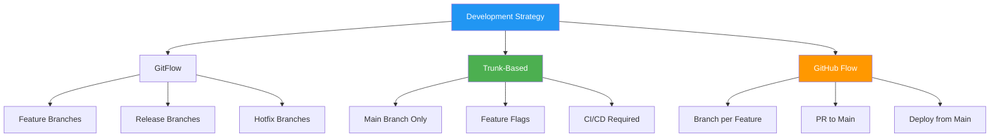
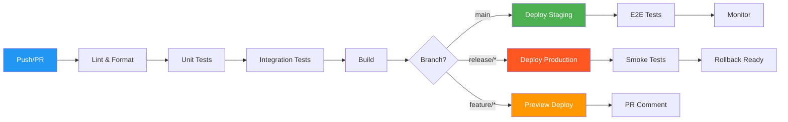
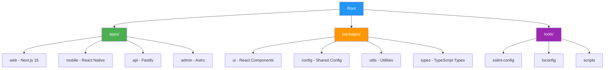

<div align="center">

# 🌿 Modern Git Mastery & DevOps Workflows

### *Production-Ready Version Control for 2024-2025*


</div>

---

## 📋 Table of Contents

- [Modern Git Workflows](#-modern-git-workflows)
- [GitHub Actions CI/CD](#-github-actions-cicd)
- [Monorepo Management](#-monorepo-management)
- [Advanced Git Techniques](#-advanced-git-techniques)
- [Git Security & Signing](#-git-security--signing)
- [Performance Optimization](#-performance-optimization)
- [Team Collaboration](#-team-collaboration)
- [Troubleshooting](#-troubleshooting)

---

## 🔄 Modern Git Workflows

### GitFlow vs Trunk-Based Development (2024)



### Production Git Configuration (2024)

```bash
# ⚡ Modern Git Config with Best Practices

# User Configuration
git config --global user.name "Your Name"
git config --global user.email "email@example.com"

# Default Branch (Industry Standard 2024)
git config --global init.defaultBranch main

# Modern Editor
git config --global core.editor "code --wait"

# Advanced Diff/Merge Tools
git config --global diff.tool vscode
git config --global difftool.vscode.cmd "code --wait --diff \$LOCAL \$REMOTE"
git config --global merge.tool vscode
git config --global mergetool.vscode.cmd "code --wait \$MERGED"

# Performance Optimizations
git config --global core.fsmonitor true
git config --global core.untrackedCache true
git config --global feature.manyFiles true
git config --global pack.threads 0  # Auto-detect CPU cores

# Security
git config --global commit.gpgSign true
git config --global tag.gpgSign true
git config --global gpg.format ssh
git config --global user.signingkey ~/.ssh/id_ed25519.pub

# Pull Strategy (rebase for cleaner history)
git config --global pull.rebase true
git config --global rebase.autoStash true

# Modern Aliases (2024)
git config --global alias.st "status -sb"
git config --global alias.co checkout
git config --global alias.br branch
git config --global alias.last "log -1 HEAD --stat"
git config --global alias.lg "log --graph --pretty=format:'%Cred%h%Creset -%C(yellow)%d%Creset %s %Cgreen(%cr) %C(bold blue)<%an>%Creset' --abbrev-commit --date=relative"
git config --global alias.unstage "reset HEAD --"
git config --global alias.undo "reset --soft HEAD~1"
git config --global alias.pushf "push --force-with-lease"
git config --global alias.sync "!git fetch origin && git rebase origin/main"
```

### Conventional Commits (2024 Standard)

```bash
# 📝 Conventional Commits with Emojis (Trending 2024-2025)

# Format: <type>(<scope>): <emoji> <subject>
#
# Types:
# feat: ✨ New feature
# fix: 🐛 Bug fix
# docs: 📚 Documentation
# style: 💄 Code style (formatting, semicolons)
# refactor: ♻️ Code refactoring
# perf: ⚡ Performance improvements
# test: ✅ Adding tests
# build: 🔧 Build system or dependencies
# ci: 👷 CI/CD changes
# chore: 🔨 Other changes

# Examples:
git commit -m "feat(auth): ✨ add OAuth2 Google login"
git commit -m "fix(api): 🐛 resolve memory leak in request handler"
git commit -m "perf(db): ⚡ optimize query with indexing"
git commit -m "docs(readme): 📚 update installation instructions"
git commit -m "ci(actions): 👷 add automated deployment workflow"

# Breaking Changes
git commit -m "feat(api)!: ✨ migrate to GraphQL (BREAKING CHANGE)"

# Multi-line commits
git commit -m "feat(payments): ✨ integrate Stripe payment processor

- Add Stripe SDK integration
- Create webhook endpoints
- Implement payment confirmation flow
- Add comprehensive error handling

Closes #123"
```

---

## 🚀 GitHub Actions CI/CD

### Modern CI/CD Workflow Architecture



### Production GitHub Actions Workflow (2024)

```yaml
# .github/workflows/ci-cd.yml
name: 🚀 CI/CD Production Pipeline

on:
  push:
    branches: [main, develop, 'release/**']
  pull_request:
    branches: [main, develop]
  workflow_dispatch:

env:
  NODE_VERSION: '20.x'
  PYTHON_VERSION: '3.12'
  CACHE_VERSION: v1

jobs:
  # ═══════════════════════════════════════════════════════
  # 🔍 Code Quality & Security
  # ═══════════════════════════════════════════════════════
  quality:
    name: 🔍 Code Quality
    runs-on: ubuntu-latest
    steps:
      - name: 📥 Checkout Code
        uses: actions/checkout@v4
        with:
          fetch-depth: 0  # Full history for better analysis

      - name: 🔧 Setup Node.js ${{ env.NODE_VERSION }}
        uses: actions/setup-node@v4
        with:
          node-version: ${{ env.NODE_VERSION }}
          cache: 'npm'

      - name: 📦 Install Dependencies
        run: npm ci

      - name: 🎨 Lint Code (ESLint + Prettier)
        run: |
          npm run lint
          npm run format:check

      - name: 🔐 Security Audit
        run: |
          npm audit --audit-level=moderate
          npx snyk test --severity-threshold=high

      - name: 📊 Code Coverage
        run: npm run test:coverage

      - name: 📤 Upload Coverage to Codecov
        uses: codecov/codecov-action@v4
        with:
          token: ${{ secrets.CODECOV_TOKEN }}

  # ═══════════════════════════════════════════════════════
  # 🧪 Testing Matrix
  # ═══════════════════════════════════════════════════════
  test:
    name: 🧪 Test Suite
    runs-on: ${{ matrix.os }}
    strategy:
      matrix:
        os: [ubuntu-latest, macos-latest, windows-latest]
        node-version: ['18.x', '20.x', '21.x']

    steps:
      - uses: actions/checkout@v4

      - name: 🔧 Setup Node.js ${{ matrix.node-version }}
        uses: actions/setup-node@v4
        with:
          node-version: ${{ matrix.node-version }}
          cache: 'npm'

      - name: 📦 Install Dependencies
        run: npm ci

      - name: 🧪 Run Tests
        run: npm test

      - name: 🔬 Integration Tests
        run: npm run test:integration
        env:
          DATABASE_URL: ${{ secrets.TEST_DATABASE_URL }}

  # ═══════════════════════════════════════════════════════
  # 🏗️ Build
  # ═══════════════════════════════════════════════════════
  build:
    name: 🏗️ Build Application
    needs: [quality, test]
    runs-on: ubuntu-latest

    steps:
      - uses: actions/checkout@v4

      - name: 🔧 Setup Node.js
        uses: actions/setup-node@v4
        with:
          node-version: ${{ env.NODE_VERSION }}
          cache: 'npm'

      - name: 📦 Install Dependencies
        run: npm ci

      - name: 🏗️ Build Production Bundle
        run: npm run build
        env:
          NODE_ENV: production

      - name: 📦 Cache Build Artifacts
        uses: actions/cache@v4
        with:
          path: |
            dist/
            .next/
          key: build-${{ github.sha }}

  # ═══════════════════════════════════════════════════════
  # 🐳 Docker Build & Push
  # ═══════════════════════════════════════════════════════
  docker:
    name: 🐳 Docker Build & Push
    needs: build
    runs-on: ubuntu-latest
    if: github.ref == 'refs/heads/main' || startsWith(github.ref, 'refs/heads/release/')

    steps:
      - uses: actions/checkout@v4

      - name: 🔐 Login to GitHub Container Registry
        uses: docker/login-action@v3
        with:
          registry: ghcr.io
          username: ${{ github.actor }}
          password: ${{ secrets.GITHUB_TOKEN }}

      - name: 🏷️ Extract Metadata
        id: meta
        uses: docker/metadata-action@v5
        with:
          images: ghcr.io/${{ github.repository }}
          tags: |
            type=ref,event=branch
            type=ref,event=pr
            type=semver,pattern={{version}}
            type=semver,pattern={{major}}.{{minor}}
            type=sha,prefix={{branch}}-

      - name: 🏗️ Build and Push
        uses: docker/build-push-action@v5
        with:
          context: .
          push: true
          tags: ${{ steps.meta.outputs.tags }}
          labels: ${{ steps.meta.outputs.labels }}
          cache-from: type=gha
          cache-to: type=gha,mode=max

  # ═══════════════════════════════════════════════════════
  # 🚀 Deploy to Staging/Production
  # ═══════════════════════════════════════════════════════
  deploy:
    name: 🚀 Deploy to ${{ matrix.environment }}
    needs: docker
    runs-on: ubuntu-latest
    strategy:
      matrix:
        include:
          - environment: staging
            branch: main
          - environment: production
            branch: release/*

    environment:
      name: ${{ matrix.environment }}
      url: https://${{ matrix.environment }}.example.com

    steps:
      - name: 🚀 Deploy to Vercel
        uses: amondnet/vercel-action@v25
        with:
          vercel-token: ${{ secrets.VERCEL_TOKEN }}
          vercel-org-id: ${{ secrets.VERCEL_ORG_ID }}
          vercel-project-id: ${{ secrets.VERCEL_PROJECT_ID }}
          vercel-args: ${{ matrix.environment == 'production' && '--prod' || '' }}

      - name: 📊 Create Deployment Status
        uses: chrnorm/deployment-action@v2
        with:
          token: ${{ secrets.GITHUB_TOKEN }}
          environment: ${{ matrix.environment }}
          deployment-status: success
```

### Monorepo GitHub Actions (Turborepo 2024)

```yaml
# .github/workflows/monorepo-ci.yml
name: 🏗️ Monorepo CI (Turborepo)

on: [push, pull_request]

jobs:
  build:
    name: 🏗️ Build & Test
    runs-on: ubuntu-latest

    steps:
      - name: 📥 Checkout
        uses: actions/checkout@v4
        with:
          fetch-depth: 2  # For turbo --filter

      - name: 🔧 Setup Node.js
        uses: actions/setup-node@v4
        with:
          node-version: '20'
          cache: 'npm'

      - name: 📦 Install Dependencies
        run: npm ci

      - name: ⚡ Turbo Cache
        uses: actions/cache@v4
        with:
          path: .turbo
          key: turbo-${{ runner.os }}-${{ github.sha }}
          restore-keys: |
            turbo-${{ runner.os }}-

      - name: 🧪 Run Tests (Changed Packages Only)
        run: npx turbo run test --filter='...[HEAD^1]'

      - name: 🏗️ Build (Changed Packages + Dependencies)
        run: npx turbo run build --filter='...[HEAD^1]'

      - name: 📊 Generate Build Summary
        run: |
          npx turbo run build --dry=json > turbo-summary.json
          cat turbo-summary.json
```

---

## 📦 Monorepo Management

### Framework Comparison (2024)

| Tool | GitHub Stars | Speed | Best For | Built-in |
|------|-------------|-------|----------|----------|
| **Turborepo** |  | ⚡⚡⚡⚡⚡ | Next.js, React | Remote caching |
| **Nx** |  | ⚡⚡⚡⚡ | Angular, React | Graph visualization |
| **Lerna** |  | ⚡⚡⚡ | npm packages | Version management |
| **pnpm** |  | ⚡⚡⚡⚡⚡ | Any | Disk efficiency |

### Turborepo Setup (2024 Recommended)

```json
{
  "$schema": "https://turbo.build/schema.json",
  "globalDependencies": ["**/.env.*local"],
  "pipeline": {
    "build": {
      "dependsOn": ["^build"],
      "outputs": ["dist/**", ".next/**", "!.next/cache/**"],
      "env": ["NODE_ENV", "NEXT_PUBLIC_*"]
    },
    "test": {
      "dependsOn": ["build"],
      "outputs": ["coverage/**"],
      "cache": false
    },
    "lint": {
      "outputs": []
    },
    "dev": {
      "cache": false,
      "persistent": true
    },
    "deploy": {
      "dependsOn": ["build", "test", "lint"],
      "outputs": []
    }
  },
  "remoteCache": {
    "signature": true
  }
}
```

```bash
# 🚀 Turborepo Commands (2024)

# Install Turborepo globally
npm install -g turbo

# Run build for all packages
turbo run build

# Run build for specific package + dependencies
turbo run build --filter=@myapp/web

# Run with caching
turbo run build --cache-dir=.turbo

# Parallel execution with max concurrency
turbo run test --concurrency=10

# Force run (ignore cache)
turbo run build --force

# Generate dependency graph
turbo run build --graph=graph.html

# Run on changed packages only
turbo run test --filter='...[origin/main]'

# Remote caching with Vercel
turbo run build --token=$TURBO_TOKEN --team=my-team
```

### Monorepo Structure (2024 Best Practice)



---

## ⚡ Advanced Git Techniques

### Git Worktrees (Multiple Working Directories)

```bash
# 🌳 Git Worktrees - Work on multiple branches simultaneously

# List all worktrees
git worktree list

# Add new worktree for feature branch
git worktree add ../myapp-feature-auth feature/auth

# Add new worktree with new branch
git worktree add -b feature/new-ui ../myapp-new-ui

# Remove worktree
git worktree remove ../myapp-feature-auth

# Prune stale worktree references
git worktree prune

# Example workflow:
# Terminal 1: Main development
cd ~/projects/myapp
git worktree add ../myapp-hotfix hotfix/critical-bug

# Terminal 2: Work on hotfix
cd ~/projects/myapp-hotfix
# Make changes, commit, push

# Back to Terminal 1
cd ~/projects/myapp
git worktree remove ../myapp-hotfix
```

### Git Bisect Automation (Find Bugs Fast)

```bash
# 🔍 Automated Bug Hunting with Git Bisect

# Start bisect
git bisect start

# Mark current commit as bad
git bisect bad

# Mark known good commit
git bisect good v1.0.0

# Automated bisect with test script
git bisect run npm test

# Example: Find when tests started failing
git bisect start HEAD v2.0.0
git bisect run sh -c "npm install && npm test"

# Bisect will automatically find the first bad commit
# Reset when done
git bisect reset
```

### Sparse Checkout (Clone Partial Repos)

```bash
# 📦 Sparse Checkout - Clone only what you need (2024)

# Initialize sparse checkout
git clone --filter=blob:none --sparse https://github.com/large/repo.git
cd repo

# Add specific directories
git sparse-checkout set apps/web packages/ui

# Add more directories
git sparse-checkout add tools/scripts

# List current sparse checkout paths
git sparse-checkout list

# Disable sparse checkout
git sparse-checkout disable

# Example: Clone only documentation
git clone --filter=blob:none --sparse https://github.com/vercel/next.js.git
cd next.js
git sparse-checkout set docs
```

---

## 🔐 Git Security & Signing

### SSH Key Setup (Ed25519 - 2024 Standard)

```bash
# 🔑 Modern SSH Key Generation (Ed25519)

# Generate Ed25519 key (faster, more secure than RSA)
ssh-keygen -t ed25519 -C "your.email@example.com" -f ~/.ssh/id_ed25519

# For legacy systems (RSA 4096-bit)
ssh-keygen -t rsa -b 4096 -C "your.email@example.com"

# Start SSH agent
eval "$(ssh-agent -s)"

# Add key to agent
ssh-add ~/.ssh/id_ed25519

# Copy public key to clipboard
# macOS
pbcopy < ~/.ssh/id_ed25519.pub

# Linux
xclip -selection clipboard < ~/.ssh/id_ed25519.pub

# Windows (PowerShell)
Get-Content ~/.ssh/id_ed25519.pub | Set-Clipboard

# Test GitHub connection
ssh -T git@github.com

# Configure SSH for multiple accounts
cat >> ~/.ssh/config << 'EOF'
# Personal GitHub
Host github.com-personal
    HostName github.com
    User git
    IdentityFile ~/.ssh/id_ed25519_personal

# Work GitHub
Host github.com-work
    HostName github.com
    User git
    IdentityFile ~/.ssh/id_ed25519_work
EOF

# Clone using specific identity
git clone git@github.com-work:company/repo.git
```

### Commit Signing with SSH (2024)

```bash
# ✍️ Sign Commits with SSH Keys (Easier than GPG!)

# Configure Git to use SSH for signing
git config --global gpg.format ssh
git config --global user.signingkey ~/.ssh/id_ed25519.pub

# Auto-sign all commits
git config --global commit.gpgsign true
git config --global tag.gpgsign true

# Verify signatures
git log --show-signature

# GitHub: Add SSH signing key
# 1. Go to Settings > SSH and GPG keys
# 2. Add your public key as "Signing Key"

# GitLab: Add to User Settings > GPG Keys
# Mark as "Signing Key"
```

### Pre-commit Hooks (Prevent Bad Commits)

```bash
# 🛡️ Pre-commit Hooks with Husky (2024)

# Install Husky & lint-staged
npm install -D husky lint-staged

# Initialize Husky
npx husky install

# Add pre-commit hook
npx husky add .husky/pre-commit "npx lint-staged"

# Configure lint-staged
cat > .lintstagedrc.json << 'EOF'
{
  "*.{js,jsx,ts,tsx}": [
    "eslint --fix",
    "prettier --write",
    "jest --bail --findRelatedTests"
  ],
  "*.{json,md,yml,yaml}": ["prettier --write"],
  "*.{css,scss}": ["stylelint --fix", "prettier --write"]
}
EOF

# Add commit-msg hook (validate commit messages)
npx husky add .husky/commit-msg 'npx --no -- commitlint --edit "$1"'

# commitlint config
cat > commitlint.config.js << 'EOF'
module.exports = {
  extends: ['@commitlint/config-conventional'],
  rules: {
    'type-enum': [
      2,
      'always',
      ['feat', 'fix', 'docs', 'style', 'refactor', 'perf', 'test', 'build', 'ci', 'chore']
    ],
    'subject-case': [2, 'never', ['start-case', 'pascal-case', 'upper-case']]
  }
};
EOF
```

---

## ⚡ Performance Optimization

### Git Performance Tuning (2024)

```bash
# 🚀 Git Performance Optimization

# Enable file system monitor (2-10x faster status)
git config --global core.fsmonitor true

# Enable untracked cache
git config --global core.untrackedCache true

# Parallel index operations
git config --global index.threads true

# Increase pack window for better compression
git config --global pack.window 20
git config --global pack.depth 50
git config --global pack.threads 0  # Auto-detect cores

# Enable commit-graph (faster log/rev-list)
git config --global core.commitGraph true
git config --global gc.writeCommitGraph true

# Maintenance schedule
git maintenance start  # Runs hourly/daily/weekly tasks

# Manual optimization
git gc --aggressive --prune=now

# Verify repository integrity
git fsck --full

# Clean up remote-tracking references
git remote prune origin
git fetch --prune --prune-tags

# Shallow clone for CI/CD
git clone --depth 1 https://github.com/user/repo.git

# Partial clone (no blobs initially)
git clone --filter=blob:none https://github.com/user/large-repo.git
```

### Large File Storage (Git LFS 2024)

```bash
# 💾 Git LFS (Large File Storage)

# Install Git LFS
brew install git-lfs          # macOS
sudo apt install git-lfs      # Linux
# Download from git-lfs.github.com for Windows

# Initialize LFS
git lfs install

# Track large files
git lfs track "*.psd"
git lfs track "*.mp4"
git lfs track "*.zip"
git lfs track "models/**/*.pkl"

# Commit .gitattributes
git add .gitattributes
git commit -m "chore: add Git LFS tracking"

# Check tracked patterns
git lfs track

# List LFS files
git lfs ls-files

# Migrate existing files to LFS
git lfs migrate import --include="*.zip,*.tar.gz"

# Fetch LFS files
git lfs fetch --all

# Prune old LFS files
git lfs prune

# Clone with LFS
git lfs clone https://github.com/user/repo.git
```

---

## 🤝 Team Collaboration

### Pull Request Templates

```markdown
<!-- .github/pull_request_template.md -->
## 🎯 Description

<!-- Describe your changes in detail -->

## 🔗 Related Issue

Closes #(issue number)

## 🧪 Type of Change

- [ ] 🐛 Bug fix (non-breaking change which fixes an issue)
- [ ] ✨ New feature (non-breaking change which adds functionality)
- [ ] 💥 Breaking change (fix or feature that would cause existing functionality to not work as expected)
- [ ] 📚 Documentation update
- [ ] ♻️ Code refactoring
- [ ] ⚡ Performance improvement

## ✅ Checklist

- [ ] My code follows the style guidelines of this project
- [ ] I have performed a self-review of my own code
- [ ] I have commented my code, particularly in hard-to-understand areas
- [ ] I have made corresponding changes to the documentation
- [ ] My changes generate no new warnings
- [ ] I have added tests that prove my fix is effective or that my feature works
- [ ] New and existing unit tests pass locally with my changes
- [ ] Any dependent changes have been merged and published

## 📸 Screenshots (if applicable)

## 🧪 Testing Instructions

<!-- How to test your changes -->

## 🚀 Deployment Notes

<!-- Any special deployment considerations -->
```

### Code Review Best Practices (2024)

```bash
# 👀 Modern Code Review Workflow

# Review specific commits
git log --oneline feature/new-ui
git diff main..feature/new-ui

# Interactive review with delta (modern diff tool)
brew install git-delta
git diff main..feature/new-ui | delta

# Review specific files
git diff main..feature/new-ui -- src/

# Check what changed since last review
git diff main...feature/new-ui

# GitHub CLI for PR reviews
gh pr checkout 123
gh pr review 123 --approve
gh pr review 123 --request-changes --body "Needs tests"
gh pr merge 123 --squash

# Suggest changes inline
gh pr review 123 --comment --body "Consider using async/await here"
```

---

## 🐛 Troubleshooting

### Common Issues & Solutions (2024)

```bash
# 🔧 Git Problem Solving

# ═══════════════════════════════════════════════════════
# Problem: Accidentally committed to wrong branch
# ═══════════════════════════════════════════════════════
# Move commits to new branch
git branch feature/correct-branch
git reset --hard HEAD~3  # Undo last 3 commits on current branch
git checkout feature/correct-branch

# ═══════════════════════════════════════════════════════
# Problem: Need to undo last commit (keep changes)
# ═══════════════════════════════════════════════════════
git reset --soft HEAD~1

# ═══════════════════════════════════════════════════════
# Problem: Committed sensitive data
# ═══════════════════════════════════════════════════════
# Use BFG Repo-Cleaner (faster than filter-branch)
brew install bfg
bfg --delete-files secrets.env
git reflog expire --expire=now --all
git gc --prune=now --aggressive

# Or use git-filter-repo (modern replacement for filter-branch)
pip install git-filter-repo
git filter-repo --path-glob '**/*.env' --invert-paths

# ═══════════════════════════════════════════════════════
# Problem: Merge conflict hell
# ═══════════════════════════════════════════════════════
# Abort merge and start over
git merge --abort

# Use strategy (keep our changes)
git merge -X ours feature-branch

# Use strategy (keep their changes)
git merge -X theirs feature-branch

# Visual merge tool
git mergetool --tool=vscode

# ═══════════════════════════════════════════════════════
# Problem: Detached HEAD state
# ═══════════════════════════════════════════════════════
# Create branch from detached HEAD
git checkout -b recovery-branch

# Or attach to existing branch
git checkout main
git merge recovery-branch

# ═══════════════════════════════════════════════════════
# Problem: Lost commits after reset
# ═══════════════════════════════════════════════════════
# Find lost commit
git reflog

# Recover it
git cherry-pick <lost-commit-hash>
# Or
git reset --hard <lost-commit-hash>

# ═══════════════════════════════════════════════════════
# Problem: Large repository size
# ═══════════════════════════════════════════════════════
# Analyze repository size
git count-objects -vH

# Find large files
git rev-list --objects --all | \
  git cat-file --batch-check='%(objecttype) %(objectname) %(objectsize) %(rest)' | \
  sed -n 's/^blob //p' | \
  sort --numeric-sort --key=2 | \
  tail -20

# Clean up
git gc --aggressive --prune=now
git repack -a -d --depth=250 --window=250

# ═══════════════════════════════════════════════════════
# Problem: Push rejected (non-fast-forward)
# ═══════════════════════════════════════════════════════
# Safer force push
git push --force-with-lease

# Update and rebase
git fetch origin
git rebase origin/main
git push
```

---

## 🎓 Resources

### Essential Tools (2024-2025)

| Tool | Description | Stars |
|------|-------------|-------|
| [GitHub CLI](https://cli.github.com/) | Official GitHub command-line tool |  |
| [Lazygit](https://github.com/jesseduffield/lazygit) | Terminal UI for Git |  |
| [Delta](https://github.com/dandavison/delta) | Modern diff viewer |  |
| [GitUI](https://github.com/extrawurst/gitui) | Blazing fast TUI written in Rust |  |
| [git-filter-repo](https://github.com/newren/git-filter-repo) | Repo history rewriter |  |

### Learning Resources

- **Official Git Documentation**: [git-scm.com](https://git-scm.com)
- **GitHub Skills**: [skills.github.com](https://skills.github.com)
- **Git Katas**: Practice Git workflows
- **Pro Git Book** (Free): Comprehensive Git guide
- **Learn Git Branching**: [learngitbranching.js.org](https://learngitbranching.js.org)

---

<div align="center">

**[⬆ Back to Top](#-modern-git-mastery--devops-workflows)**

Made with 💚 for the developer community

*Last Updated: 2024 | Next-Gen Version Control*

</div>
