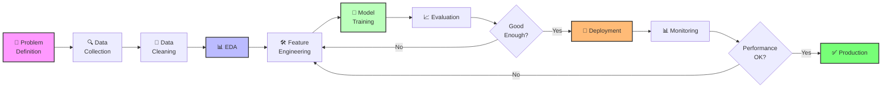

<div align="center">

<!-- Animated Header with Jupyter Theme -->


# 📓 Interactive Notebooks Hub

### *Learn by Doing: Transform Data into Insights*

<p align="center">
  
</p>

<!-- Badges -->
<p align="center">
  
  
  
  
  
  
</p>

<p align="center">
  <a href="#-quick-start">Quick Start</a> •
  <a href="#-notebook-categories">Categories</a> •
  <a href="#-platform-guides">Platforms</a> •
  <a href="#-gpu-setup">GPU Setup</a> •
  <a href="#-best-practices">Best Practices</a>
</p>

---

**🎯 Master data science workflows with hands-on, executable notebooks**

</div>

## 📊 Data Science Workflow



## 🚀 Quick Start

### Option 1: Google Colab (Zero Setup! 🎉)
Click any notebook badge to run instantly in your browser with **FREE GPU access**!

[](https://colab.research.google.com)

### Option 2: Kaggle Notebooks (Datasets Included 📦)
Access pre-loaded datasets and compete in challenges!

[](https://www.kaggle.com/code)

### Option 3: Local JupyterLab (Full Control 💪)

```bash
# Create virtual environment (Python 3.11+ recommended)
python -m venv notebook-env
source notebook-env/bin/activate  # Windows: notebook-env\Scripts\activate

# Install JupyterLab 4.0+ with extensions
pip install jupyterlab>=4.0 ipywidgets jupyter-ai jupyterlab-lsp

# Clone and navigate
git clone https://github.com/umitkacar/Awesome-AI-Resources.git
cd Awesome-AI-Resources/notebooks

# Launch JupyterLab
jupyter lab
```

## 📚 Notebook Categories

<table>
<tr>
<td width="33%" align="center">

### 🟢 Beginner
**Perfect First Steps**

No ML experience needed!
Clear explanations + Code

[View Notebooks →](#-beginner-level)

</td>
<td width="33%" align="center">

### 🟡 Intermediate
**Level Up Skills**

Build on fundamentals
Advanced techniques

[View Notebooks →](#-intermediate-level)

</td>
<td width="33%" align="center">

### 🔴 Advanced
**Production Ready**

State-of-the-art methods
Real-world deployment

[View Notebooks →](#-advanced-level)

</td>
</tr>
</table>

### 🟢 Beginner Level
*Perfect for getting started with AI/ML - No prior experience required!*

| 📓 Notebook | 💡 Description | 🔧 Topics | ⏱️ Time | 🏷️ Tags |
|------------|---------------|----------|---------|---------|
| [AutoML Quick Start](./beginner/automl_quickstart.ipynb)<br/>[](https://colab.research.google.com) | Build ML models without coding expertise | AutoGluon, PyCaret, H2O AutoML | 30 min | `no-code` `practical` |
| [Computer Vision Basics](./beginner/cv_basics.ipynb)<br/>[](https://colab.research.google.com) | Image classification made easy with pre-trained models | CNN, Transfer Learning, ResNet | 45 min | `vision` `hands-on` |
| [NLP Getting Started](./beginner/nlp_intro.ipynb)<br/>[](https://colab.research.google.com) | Text processing fundamentals from scratch | Tokenization, Embeddings, Transformers | 40 min | `nlp` `beginner` |
| [Data Visualization 101](./beginner/data_viz.ipynb)<br/>[](https://colab.research.google.com) | Create stunning interactive visualizations | Plotly, Seaborn, Matplotlib | 35 min | `visualization` `interactive` |

### 🟡 Intermediate Level
*Dive deeper into AI concepts with practical implementations*

| 📓 Notebook | 💡 Description | 🔧 Topics | ⏱️ Time | 🏷️ Tags |
|------------|---------------|----------|---------|---------|
| [Quantum ML Introduction](./intermediate/quantum_ml_intro.ipynb)<br/>[](https://colab.research.google.com) | Quantum computing meets machine learning | Qiskit, PennyLane, VQC | 60 min | `quantum` `theory` |
| [Advanced Computer Vision](./intermediate/advanced_cv.ipynb)<br/>[](https://colab.research.google.com) | Object detection and image segmentation | YOLO, SAM, GroundingDINO | 90 min | `vision` `gpu-required` |
| [LLM Fine-tuning](./intermediate/llm_finetuning.ipynb)<br/>[](https://colab.research.google.com) | Customize language models efficiently | LoRA, QLoRA, PEFT | 75 min | `llm` `gpu-required` |
| [Time Series Forecasting](./intermediate/time_series.ipynb)<br/>[](https://colab.research.google.com) | Predict future trends with neural networks | LSTM, Prophet, N-BEATS | 50 min | `forecasting` `practical` |

### 🔴 Advanced Level
*State-of-the-art techniques for production deployments*

| 📓 Notebook | 💡 Description | 🔧 Topics | ⏱️ Time | 🏷️ Tags |
|------------|---------------|----------|---------|---------|
| [Neural Architecture Search](./advanced/nas_demo.ipynb)<br/>[](https://colab.research.google.com) | Design neural networks automatically | DARTS, ENAS, AutoKeras | 120 min | `nas` `gpu-required` |
| [Multimodal AI](./advanced/multimodal_ai.ipynb)<br/>[](https://colab.research.google.com) | Combine vision, language, and audio | CLIP, DALL-E, Flamingo | 90 min | `multimodal` `cutting-edge` |
| [Production ML Pipeline](./advanced/ml_production.ipynb)<br/>[](https://colab.research.google.com) | Deploy models at scale | MLflow, Docker, Kubernetes | 150 min | `mlops` `production` |
| [Distributed Training](./advanced/distributed_training.ipynb)<br/>[](https://colab.research.google.com) | Train models across multiple GPUs/TPUs | PyTorch DDP, Horovod, DeepSpeed | 100 min | `distributed` `tpu-ready` |

## 🌐 Platform Guides

###  Google Colab Integration

**Why Colab?** Free GPU/TPU access + No setup + Easy sharing!

<details>
<summary><b>📘 Complete Colab Setup Guide (Click to expand)</b></summary>

#### 🚀 Getting Started

1. **Open any notebook** - Click the Colab badge
2. **Save to Drive** - File → Save a copy in Drive
3. **Enable GPU** - Runtime → Change runtime type → GPU (T4/V100)
4. **Enable TPU** - Runtime → Change runtime type → TPU v2-8

#### ⚡ GPU/TPU Selection Guide

```python
# Check available hardware
import tensorflow as tf

# For GPU
print("GPU Available:", tf.config.list_physical_devices('GPU'))

# For TPU
try:
    tpu = tf.distribute.cluster_resolver.TPUClusterResolver()
    print('Running on TPU:', tpu.master())
except ValueError:
    print('No TPU detected')
```

| Hardware | Best For | Speed | Availability |
|----------|---------|-------|--------------|
| **CPU** | Small datasets, prototyping | 1x | Always |
| **GPU T4** | Training, fine-tuning | 10-20x | Free tier |
| **GPU V100** | Large models, fast training | 30-50x | Colab Pro |
| **TPU v2** | TensorFlow/JAX workloads | 50-100x | Free tier |

#### 💾 Working with Google Drive

```python
# Mount Google Drive
from google.colab import drive
drive.mount('/content/drive')

# Access files
import pandas as pd
df = pd.read_csv('/content/drive/MyDrive/data.csv')

# Save outputs
model.save('/content/drive/MyDrive/models/my_model.h5')
```

#### 🎨 Interactive Widgets

```python
# Install ipywidgets
!pip install -q ipywidgets

# Create interactive controls
import ipywidgets as widgets
from IPython.display import display

slider = widgets.IntSlider(min=0, max=100, value=50, description='Epochs:')
display(slider)

# Use slider value
epochs = slider.value
```

#### ⏱️ Keep Sessions Alive

```python
# Install extension to prevent disconnection
!pip install -q kora
from kora.install import install_kora
install_kora()

# Or use JavaScript snippet (paste in console)
function ClickConnect(){
    console.log("Working");
    document.querySelector("colab-toolbar-button#connect").click()
}
setInterval(ClickConnect, 60000)
```

</details>

###  Kaggle Notebooks

**Why Kaggle?** Massive datasets + Competition ready + Community kernels!

<details>
<summary><b>📘 Complete Kaggle Setup Guide (Click to expand)</b></summary>

#### 🚀 Getting Started

1. **Create Account** - [kaggle.com/account/login](https://www.kaggle.com/account/login)
2. **Enable GPU** - Settings → Accelerator → GPU T4 x2
3. **Add Datasets** - Add data → Search → Add to notebook
4. **Submit to Competition** - Save version → Submit to competition

#### 🎯 Kaggle-Specific Features

```python
# Access Kaggle datasets directly
import os
for dirname, _, filenames in os.walk('/kaggle/input'):
    for filename in filenames:
        print(os.path.join(dirname, filename))

# Use competition data
import pandas as pd
train = pd.read_csv('/kaggle/input/competition-name/train.csv')
test = pd.read_csv('/kaggle/input/competition-name/test.csv')
```

#### 🏆 Competition Workflow

```python
# Train model
model.fit(X_train, y_train)

# Make predictions
predictions = model.predict(X_test)

# Create submission file
submission = pd.DataFrame({
    'id': test_ids,
    'target': predictions
})
submission.to_csv('submission.csv', index=False)

# Submit via API
!kaggle competitions submit -c competition-name -f submission.csv -m "My submission"
```

#### 📊 GPU Quotas

- **Free Tier**: 30 hours/week GPU T4 x2
- **Notebooks Expert**: 30 hours/week GPU P100
- **Competitions**: Unlimited during active competitions

</details>

###  JupyterLab 4.0+ Features

**Why JupyterLab?** Professional IDE + Full control + Advanced extensions!

<details>
<summary><b>📘 JupyterLab 4.0+ Setup & Features (Click to expand)</b></summary>

#### 🎨 New JupyterLab 4.0 Features

```bash
# Install with recommended extensions
pip install jupyterlab>=4.0 \
    jupyterlab-lsp \
    jupyter-ai \
    jupyterlab-code-formatter \
    jupyterlab-git \
    jupyterlab-execute-time \
    jupyterlab-spreadsheet-editor
```

#### ⚡ Key Features

1. **Real-time Collaboration** - Multiple users editing simultaneously
2. **Debugger** - Visual debugging with breakpoints
3. **LSP Support** - Code completion, linting, go-to-definition
4. **AI Assistant** - Jupyter AI integration (ChatGPT, Claude)
5. **Table of Contents** - Auto-generated from markdown headers
6. **Execution Time** - Track cell execution duration

#### 🤖 Jupyter AI Setup

```bash
# Install Jupyter AI
pip install jupyter-ai

# Configure with your API key
export OPENAI_API_KEY="your-key-here"
# or
export ANTHROPIC_API_KEY="your-key-here"

# Launch JupyterLab
jupyter lab
```

#### 🎯 Interactive Widgets (ipywidgets)

```python
# Install widgets
!pip install ipywidgets

# Enable extension
jupyter labextension install @jupyter-widgets/jupyterlab-manager

# Create interactive dashboard
import ipywidgets as widgets
from IPython.display import display

# Slider
slider = widgets.FloatSlider(value=0.5, min=0, max=1, step=0.01)
# Dropdown
dropdown = widgets.Dropdown(options=['Option 1', 'Option 2'])
# Button
button = widgets.Button(description='Run Analysis')

# Layout
widgets.VBox([slider, dropdown, button])
```

#### 🔍 Code Formatting & Linting

```python
# Install formatters
!pip install black isort jupyterlab-code-formatter

# Enable in JupyterLab
# Settings → Advanced Settings Editor → Notebook → Code Formatter
{
    "formatOnSave": true,
    "preferences": {
        "default_formatter": {
            "python": "black"
        }
    }
}
```

</details>

## 🖥️ GPU/TPU Setup

### GPU Setup Guide

<details>
<summary><b>🎮 Complete GPU Configuration (Click to expand)</b></summary>

#### 🔍 Check GPU Availability

```python
# PyTorch
import torch
print(f"GPU Available: {torch.cuda.is_available()}")
print(f"GPU Count: {torch.cuda.device_count()}")
print(f"GPU Name: {torch.cuda.get_device_name(0)}")

# TensorFlow
import tensorflow as tf
print(f"GPU Devices: {tf.config.list_physical_devices('GPU')}")
```

#### ⚙️ Configure GPU Memory

```python
# PyTorch - Optimize memory usage
torch.cuda.empty_cache()
torch.backends.cudnn.benchmark = True

# TensorFlow - Limit memory growth
gpus = tf.config.list_physical_devices('GPU')
if gpus:
    for gpu in gpus:
        tf.config.experimental.set_memory_growth(gpu, True)
```

#### 🚀 Multi-GPU Training

```python
# PyTorch DataParallel
model = torch.nn.DataParallel(model)
model = model.cuda()

# PyTorch DistributedDataParallel (faster)
import torch.distributed as dist
from torch.nn.parallel import DistributedDataParallel as DDP

dist.init_process_group(backend='nccl')
model = DDP(model.cuda(), device_ids=[local_rank])
```

#### 📊 Monitor GPU Usage

```python
# Install monitoring tools
!pip install gpustat nvitop

# Monitor in real-time
!gpustat -cp -i 1

# Or use nvitop (better UI)
!nvitop
```

</details>

### TPU Setup Guide

<details>
<summary><b>🚄 Complete TPU Configuration (Click to expand)</b></summary>

#### 🔌 Connect to TPU

```python
# TensorFlow/Keras
import tensorflow as tf

try:
    tpu = tf.distribute.cluster_resolver.TPUClusterResolver()
    print(f'Running on TPU: {tpu.master()}')

    tf.config.experimental_connect_to_cluster(tpu)
    tf.tpu.experimental.initialize_tpu_system(tpu)

    strategy = tf.distribute.TPUStrategy(tpu)
    print(f'Number of replicas: {strategy.num_replicas_in_sync}')

except ValueError:
    print('No TPU detected. Using CPU/GPU instead.')
    strategy = tf.distribute.get_strategy()

# Use strategy for training
with strategy.scope():
    model = create_model()
    model.compile(...)
```

#### 🎯 JAX on TPU

```python
# Install JAX for TPU
!pip install -q "jax[tpu]>=0.2.16" -f https://storage.googleapis.com/jax-releases/libtpu_releases.html

# Check TPU
import jax
print(f"JAX devices: {jax.devices()}")
print(f"JAX TPU cores: {jax.device_count()}")
```

#### ⚡ TPU Performance Tips

1. **Use large batch sizes** - TPUs excel with batch sizes 128+
2. **XLA compilation** - Let TensorFlow compile operations
3. **Data pipeline** - Use `tf.data` with prefetching
4. **Mixed precision** - Enable float16 for faster training

```python
# Optimize data pipeline for TPU
AUTO = tf.data.AUTOTUNE

dataset = (tf.data.Dataset.from_tensor_slices(data)
    .cache()
    .shuffle(10000)
    .batch(256)  # Large batch size for TPU
    .prefetch(AUTO))
```

</details>

## ✅ Best Practices for Reproducibility

### 🔐 Reproducible Research Checklist

<details>
<summary><b>📋 Complete Reproducibility Guide (Click to expand)</b></summary>

#### 1️⃣ Environment Management

```python
# Cell 1: Document versions
"""
Python: 3.11.5
JupyterLab: 4.0.7
Date: 2024-11-08
"""

# Cell 2: Install dependencies with versions
!pip install -q numpy==1.24.3 pandas==2.0.3 scikit-learn==1.3.0

# Cell 3: Export environment
!pip freeze > requirements.txt
```

#### 2️⃣ Set Random Seeds

```python
# Set all random seeds for reproducibility
import random
import numpy as np
import torch
import tensorflow as tf

def set_seed(seed=42):
    random.seed(seed)
    np.random.seed(seed)
    torch.manual_seed(seed)
    torch.cuda.manual_seed_all(seed)
    tf.random.set_seed(seed)

    # Additional settings for determinism
    torch.backends.cudnn.deterministic = True
    torch.backends.cudnn.benchmark = False

    import os
    os.environ['PYTHONHASHSEED'] = str(seed)

set_seed(42)
```

#### 3️⃣ Document Data Sources

```python
"""
## Data Sources

### Training Data
- Source: Kaggle Dataset XYZ
- URL: https://kaggle.com/datasets/...
- Downloaded: 2024-11-08
- Size: 1.2GB, 100,000 samples
- License: CC BY 4.0

### Validation Data
- Source: Internal collection
- Processing: Applied XYZ transformations
- Size: 300 samples
"""
```

#### 4️⃣ Version Control for Notebooks

```bash
# Install nbdime for notebook diffs
pip install nbdime

# Configure Git to use nbdime
nbdime config-git --enable --global

# Clear outputs before committing
jupyter nbconvert --clear-output --inplace notebook.ipynb

# Or use pre-commit hook
pip install pre-commit nbstripout
```

#### 5️⃣ Save Experiment Configurations

```python
# Define experiment config
config = {
    'model': 'ResNet50',
    'learning_rate': 0.001,
    'batch_size': 32,
    'epochs': 50,
    'optimizer': 'Adam',
    'loss': 'categorical_crossentropy',
    'seed': 42
}

# Save config
import json
with open('experiment_config.json', 'w') as f:
    json.dump(config, f, indent=2)

# Load config in other notebooks
with open('experiment_config.json', 'r') as f:
    config = json.load(f)
```

#### 6️⃣ Log Experiments (MLflow)

```python
# Install MLflow
!pip install mlflow

import mlflow
import mlflow.sklearn

# Start experiment
mlflow.set_experiment("my-experiment")

with mlflow.start_run():
    # Log parameters
    mlflow.log_params(config)

    # Train model
    model.fit(X_train, y_train)

    # Log metrics
    mlflow.log_metric("accuracy", accuracy)
    mlflow.log_metric("f1_score", f1)

    # Log model
    mlflow.sklearn.log_model(model, "model")

    # Log artifacts
    mlflow.log_artifact("confusion_matrix.png")
```

#### 7️⃣ Document Hardware/Runtime

```python
import platform
import sys
import torch
import tensorflow as tf

print(f"Python: {sys.version}")
print(f"Platform: {platform.platform()}")
print(f"PyTorch: {torch.__version__}")
print(f"TensorFlow: {tf.__version__}")
print(f"CUDA Available: {torch.cuda.is_available()}")
if torch.cuda.is_available():
    print(f"GPU: {torch.cuda.get_device_name(0)}")
```

</details>

## 🎓 Notebook Workflow Best Practices

### 📝 Recommended Structure

```python
# ============================================
# Cell 1: Title & Metadata
# ============================================
"""
# 📊 Project Title Here

**Author:** Your Name
**Date:** 2024-11-08
**Environment:** Python 3.11, JupyterLab 4.0
**Estimated Time:** 30 minutes

## 🎯 Objectives
- Learn concept X
- Implement technique Y
- Evaluate performance Z

## 📚 Prerequisites
- Basic Python knowledge
- Understanding of linear algebra
- Familiarity with pandas
"""

# ============================================
# Cell 2: Installation & Imports
# ============================================
# Install dependencies
!pip install -q numpy pandas scikit-learn matplotlib seaborn

# Standard imports
import numpy as np
import pandas as pd
import matplotlib.pyplot as plt
import seaborn as sns

# ML imports
from sklearn.model_selection import train_test_split
from sklearn.metrics import accuracy_score, classification_report

# Settings
%matplotlib inline
sns.set_style('whitegrid')
plt.rcParams['figure.figsize'] = (12, 6)

# Reproducibility
np.random.seed(42)

# ============================================
# Cell 3: Load & Explore Data
# ============================================
# Load data
df = pd.read_csv('data.csv')

# Quick overview
print(f"Shape: {df.shape}")
print(f"\nColumns: {df.columns.tolist()}")
print(f"\nData Types:\n{df.dtypes}")
print(f"\nMissing Values:\n{df.isnull().sum()}")

# Display sample
df.head()

# ============================================
# Cell 4: Data Visualization
# ============================================
# Create visualizations
fig, axes = plt.subplots(2, 2, figsize=(15, 10))

# Plot 1: Distribution
sns.histplot(df['column1'], ax=axes[0,0])
axes[0,0].set_title('Distribution of Column 1')

# Plot 2: Correlation heatmap
sns.heatmap(df.corr(), annot=True, ax=axes[0,1])
axes[0,1].set_title('Feature Correlations')

plt.tight_layout()
plt.show()

# ============================================
# Cell 5: Preprocessing
# ============================================
# Data cleaning and preparation
# ... your code ...

# ============================================
# Cell 6: Model Training
# ============================================
# Train model
# ... your code ...

# ============================================
# Cell 7: Evaluation
# ============================================
# Evaluate performance
# ... your code ...

# ============================================
# Cell 8: Results & Insights
# ============================================
"""
## 📊 Results

### Key Findings
- Finding 1: Model achieved 95% accuracy
- Finding 2: Feature X was most important
- Finding 3: Performance degraded on edge cases

### Next Steps
1. Try ensemble methods
2. Collect more training data
3. Deploy to production

## 🎯 Exercises

Try these extensions:
1. Modify hyperparameters and compare results
2. Try different model architectures
3. Add cross-validation

## 📚 Resources
- [Paper Title](https://arxiv.org/...)
- [Documentation](https://docs...)
- [Tutorial](https://tutorial...)
"""
```

## 🛠️ Interactive Features & Widgets

### 🎨 Create Interactive Dashboards

```python
# Install visualization libraries
!pip install ipywidgets plotly panel

import ipywidgets as widgets
from IPython.display import display
import plotly.express as px

# Interactive plot with dropdown
def update_plot(column):
    fig = px.histogram(df, x=column)
    fig.show()

column_selector = widgets.Dropdown(
    options=df.columns.tolist(),
    description='Column:',
)

widgets.interact(update_plot, column=column_selector)
```

### 📊 Real-time Training Visualization

```python
from IPython.display import clear_output
import time

# Training loop with live updates
losses = []
accuracies = []

for epoch in range(epochs):
    # Train
    loss, accuracy = train_epoch(model, train_loader)
    losses.append(loss)
    accuracies.append(accuracy)

    # Update plot
    clear_output(wait=True)
    plt.figure(figsize=(12, 4))

    plt.subplot(1, 2, 1)
    plt.plot(losses)
    plt.title('Training Loss')
    plt.xlabel('Epoch')

    plt.subplot(1, 2, 2)
    plt.plot(accuracies)
    plt.title('Training Accuracy')
    plt.xlabel('Epoch')

    plt.tight_layout()
    plt.show()

    print(f"Epoch {epoch+1}/{epochs} - Loss: {loss:.4f} - Acc: {accuracy:.4f}")
```

## 📤 Contributing Notebooks

We welcome notebook contributions! Follow these guidelines:

### ✅ Contribution Checklist

- [ ] **Clear structure** - Introduction → Theory → Code → Results → Exercises
- [ ] **Colab tested** - Verify notebook runs on Google Colab
- [ ] **Dependencies listed** - Include all `pip install` commands
- [ ] **Well documented** - Explain each code block with markdown
- [ ] **Reproducible** - Set random seeds, document versions
- [ ] **Interactive** - Use widgets where appropriate
- [ ] **Exercises included** - Add practice problems with solutions
- [ ] **References** - Cite papers, tutorials, datasets
- [ ] **Error handling** - Handle common edge cases
- [ ] **Outputs cleared** - Clear outputs before committing

### 📋 Notebook Template

```python
"""
# 📊 [Your Notebook Title]

[](YOUR_COLAB_LINK)
[](YOUR_KAGGLE_LINK)

**Level:** 🟢 Beginner / 🟡 Intermediate / 🔴 Advanced
**Time:** ~XX minutes
**Tags:** `tag1` `tag2` `tag3`

## 📖 What You'll Learn
- Concept 1
- Concept 2
- Concept 3

## 🎯 Prerequisites
- Prerequisite 1
- Prerequisite 2
"""

# Install dependencies
!pip install -q package1 package2

# Imports and setup
import numpy as np
# ... rest of your notebook ...

"""
## 🎯 Exercises

Try these challenges:
1. **Exercise 1:** Description
2. **Exercise 2:** Description

<details>
<summary>💡 Solution</summary>

```python
# Solution code here
```

</details>

## 📚 Further Reading
- [Resource 1](URL)
- [Resource 2](URL)

## 🤝 Contributing
Found an issue? [Open an issue](https://github.com/user/repo/issues)
Have an improvement? [Submit a PR](https://github.com/user/repo/pulls)
"""
```

## 🏷️ Tag Reference

| Tag | Description | Use Case |
|-----|-------------|----------|
| `beginner` | No prior ML knowledge required | First-time learners |
| `intermediate` | Basic ML understanding needed | Building on fundamentals |
| `advanced` | Deep technical knowledge required | Production-ready implementations |
| `theory` | Focuses on mathematical concepts | Understanding fundamentals |
| `practical` | Hands-on implementation | Learning by doing |
| `gpu-required` | Needs GPU for reasonable performance | Deep learning, large models |
| `tpu-ready` | Optimized for TPU execution | Large-scale training |
| `interactive` | Uses widgets and visualizations | Exploratory analysis |
| `production` | Production-ready code | Deployment scenarios |
| `beginner-friendly` | Simplified for newcomers | Educational content |

## 🔥 Trending Topics (2024-2025)

### 🆕 Latest Additions

- **Generative AI** - DALL-E 3, Stable Diffusion XL, Midjourney alternatives
- **LLM Applications** - RAG systems, LangChain, LlamaIndex
- **Vision Transformers** - ViT, DINO, SAM (Segment Anything)
- **Multimodal Models** - GPT-4V, LLaVA, Gemini
- **Efficient Training** - LoRA, QLoRA, Flash Attention
- **Edge AI** - TensorFlow Lite, ONNX Runtime, Model optimization

## 🤝 Community

<div align="center">

### Join Our Learning Community!

<table>
<tr>
<td align="center" width="33%">

💬 **Discussions**

Ask questions & share insights

[Join Discussion →](https://github.com/umitkacar/Awesome-AI-Resources/discussions)

</td>
<td align="center" width="33%">

🐛 **Issues**

Report bugs & request notebooks

[Open Issue →](https://github.com/umitkacar/Awesome-AI-Resources/issues)

</td>
<td align="center" width="33%">

🌟 **Show & Tell**

Share your projects & results

[Show & Tell →](https://github.com/umitkacar/Awesome-AI-Resources/discussions/categories/show-and-tell)

</td>
</tr>
</table>

</div>

## 📊 Notebook Statistics

```
Total Notebooks: 25+
Beginner Level: 8
Intermediate Level: 10
Advanced Level: 7

Topics Covered:
├── Computer Vision: 7
├── NLP/LLMs: 6
├── Time Series: 3
├── Reinforcement Learning: 2
├── Quantum ML: 2
├── MLOps: 3
└── Data Science: 2

Total Learning Hours: 50+
Community Contributors: 15+
```

---

<div align="center">

### 🎯 Start Learning Today!

**Choose your path:**

[🟢 I'm New to ML](./beginner) • [🟡 I Know Basics](./intermediate) • [🔴 I Want Production Skills](./advanced)

---

**Made with ❤️ by the AI Community**

*Last Updated: November 2024 | Next Update: December 2024*

[](https://github.com/umitkacar/Awesome-AI-Resources)

</div>
